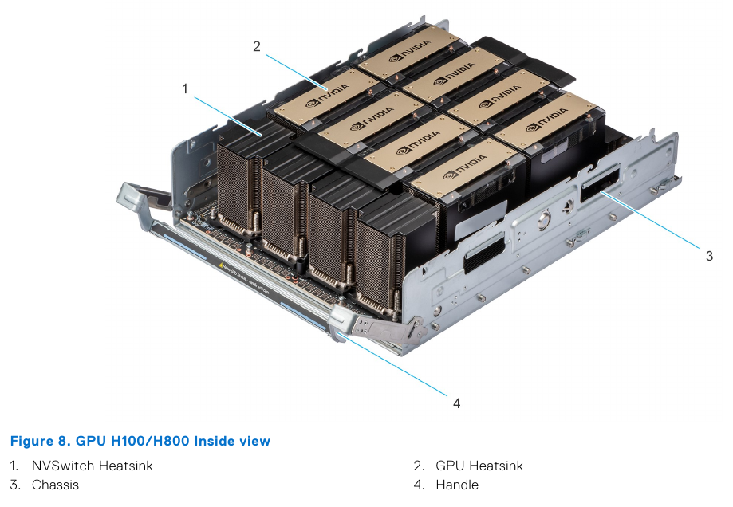
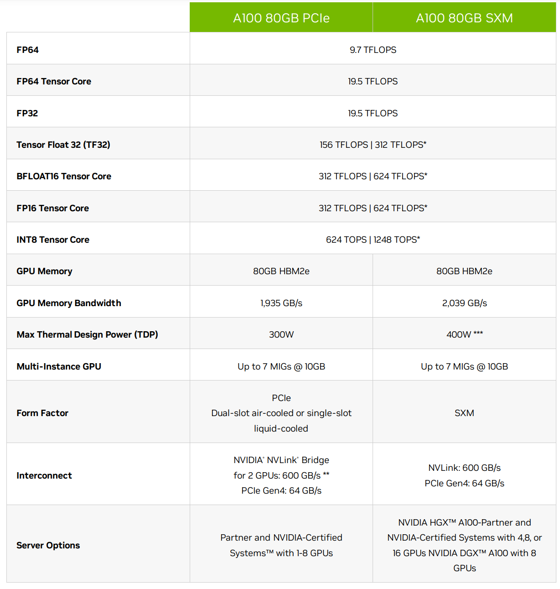
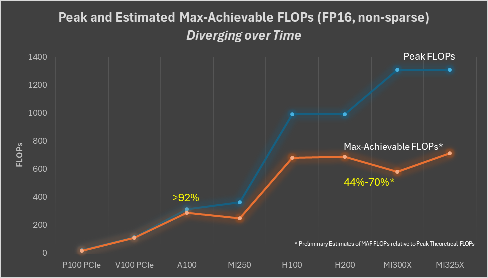

# Accelerators

Compute accelerators are the workhorses of the ML training. At the beginning there were just GPUs. But now there are also TPUs, IPUs, FPGAs, HPUs, QPUs, RDUs and more are being invented.

There exist two main ML workloads - training and inference. There is also the finetuning workload which is usually the same as training, unless a much lighter [LORA-style](https://arxiv.org/abs/2106.09685) finetuning is performed. The latter requires significantly fewer resources and time than normal finetuning.

In language models during inference the generation is performed in a sequence - one token at a time. So it has to repeat the same `forward` call thousands of times one smallish `matmul` (matrix multiplication or GEMM) at a time. And this can be done on either an accelerator, like GPU, or some of the most recent CPUs, that can handle inference quite efficiently.

During training the whole sequence length is processed in one huge `matmul` operation. So if the sequence length is 4k long, the training of the same model will require a compute unit that can handle 4k times more operations than inference and do it fast. Accelerators excel at this task. In fact the larger the matrices they have to multiply, the more efficient the compute.

The other computational difference is that while both training and inference have to perform the same total amount of `matmul`s in the `forward` pass, in the `backward` pass, which is only done for training, an additional 2x times of `matmul`s is done to calculate the gradients with regards to inputs and weights. And an additional `forward` is performed if activations recomputation is used. Therefore the training process requires at 3-4x more `matmul`s than inference.

## Subsections

General:
- [Benchmarks](benchmarks)

NVIDIA:
- [Troubleshooting NVIDIA GPUs](nvidia/debug.md)

AMD:
- [Troubleshooting AMD GPUs](amd/debug.md)
- [AMD GPUs Performance](amd/performance.md)

## Bird's eye view on the high end accelerator reality

While this might be changing in the future, unlike the consumer GPU market, as of this writing there aren't that many high end accelerators, and if you rent on the cloud, most providers will have more or less the same few accelerators to offer.

GPUs:
- As of today, ML clouds/HPCs started transitioning from NVIDIA H100s to H200s and this is going to take some months due to the usual shortage of NVIDIA GPUs. B200, GB200 are starting to emerge. B300 and GB300 were announced on 2024-12!
- AMD's MI325X is now widely available on Tier 2 cloud providers. MI355X is starting to emerge. MI400X hopefully in 2026.

HPU:
- Intel's Gaudi2 and Gaudi3 are available at Intel's cloud.
- Falcon Shores is to replace Gaudi in 2025
- Jaguar Shores is to replace Falcon Shores in 2026

IPU:
- Graphcore with their IPU offering was briefly available at Paperspace, but it's gone now. I'm not sure if anybody offers those.

TPU:
- Google's TPUs are, of course, available but they aren't the most desirable accelerators because you can only rent them, and the software isn't quite easily convertible between GPUs and TPUs, and so many (most?) developers remain in the GPU land, since they don't want to be locked into a hardware which is a Google monopoly.
- Amazon's Trainium2 is very similar to the TPU architecture and is available on AWS

On Pods and racks:
- Cerebras' WaferScale Engine (WSE)
- SambaNova's DataScale
- dozens of different pod and rack configs that compose the aforementioned GPUs with super-fast interconnects.

That's about it as Q5-2025.

The rest of this document will compare most of the above in details and if you want to read the specs please head [here](#high-end-accelerators-for-ml-workloads).

As most of us rent the compute, and we never see what it looks like, here is how an 8xH100 node looks like physically (this is the GPU tray of the Dell PowerEdge XE9680 Rack Server):




## Glossary

- CPU: Central Processing Unit
- FMA: Fused Multiply Add
- FPGA: Field Programmable Gate Arrays
- GCD: Graphics Compute Die
- GPU: Graphics Processing Unit
- HBM: High Bandwidth Memory
- HPC: High-performance Computing
- HPU: Habana Gaudi AI Processor Unit
- IPU: Intelligence Processing Unit
- MAMF: Maximum Achievable Matmul FLOPS
- MME: Matrix Multiplication Engine
- QPU: Quantum Processing Unit
- RDU: Reconfigurable Dataflow Unit
- TBP: Total Board Power
- TDP: Thermal Design Power or Thermal Design Parameter
- TGP: Total Graphics Power
- TPU: Tensor Processing Unit

[Additional glossary @ Modal](https://modal.com/gpu-glossary)

## The most important thing to understand

I will make the following statement multiple times in this book - and that it's not enough to buy/rent the most expensive accelerators and expect a high return on investment (ROI).

The two metrics for a high ROI for ML training are:
1. the speed at which the training will finish, because if the training takes 2-3x longer than planned, your model could become irrelevant before it was released - time is everything in the current super-competitive ML market.
2. the total $$ spent to train the model, because if the training takes 2-3x longer than planned, you will end up spending 2-3x times more.

Unless the rest of the purchased/rented hardware isn't chosen carefully to match the required workload chances are very high that the accelerators will idle a lot and both time and $$ will be lost. The most critical component is [network](../../network), then [storage](../../storage/), and the least critical ones are [CPU](../cpu) and [CPU memory](../cpu-memory) (at least for a typical training workload where any CPU limitations are compensated with multiple `DataLoader` workers).

If the compute is rented one usually doesn't have the freedom to choose - the hardware is either set in stone or some components might be replaceable but with not too many choices. Thus there are times when the chosen cloud provider doesn't provide a sufficiently well matched hardware, in which case it's best to seek out a different provider.

If you purchase your servers then I recommend to perform a very indepth due diligence before buying.

Besides hardware, you, of course, need software that can efficiently deploy the hardware.

We will discuss both the hardware and the software aspects in various chapters of this book. You may want to start [here](../../training/performance) and [here](../../training/model-parallelism).


## What Accelerator characteristics do we care for

Let's use the NVIDIA A100 spec as a reference point in the following sections.



[source](https://www.nvidia.com/en-us/data-center/a100/)

### TFLOPS

As mentioned earlier most of the work that ML training and inference do is matrix multiplication. If you remember your algebra matrix multiplication is made of many multiplications followed by summation. Each of these computations can be counted and define how many of these operations can be performed by the chip in a single seconds.

This is one of the key characteristics that the accelerators are judged by. The term TFLOPS defines how many trillions of FloatingPointOperations the chip can perform in a second. The more the better. There is a different definition for different data types. For example, here are a few entries from the theoretical peak TFLOPS from [A100 spec](https://www.nvidia.com/en-us/data-center/a100/):

| Data type \ TFLOPS     | w/o Sparsity | w/ Sparsity |
| :--------------------  | -----------: | ----------: |
| FP32                   |         19.5 |         n/a |
| Tensor Float 32 (TF32) |          156 |         312 |
| BFLOAT16 Tensor Core   |          312 |         624 |
| FP16 Tensor Core       |          312 |         624 |
| FP8 Tensor Core        |          624 |        1248 |
| INT8 Tensor Core       |          624 |        1248 |

Notes:

* INT8 is measured in TeraOperations as it's not a floating operation.

* the term FLOPS could mean either the total number of FloatingPointOperations, e.g. when counting how many FLOPS a single Transformer iteration takes, and it could also mean FloatingPointOperations per second - so watch out for the context. When you read an accelerator spec it's almost always a per second definition. When model architectures are discussed it's usually just the total number of FloatingPointOperations.

So you can see that int8 is 2x faster than bf16 which in turn is 2x faster than tf32.

Moreover, the TFLOPs depend on the matrices size as can be seen from this table:


[source](https://developer.nvidia.com/blog/cuda-11-features-revealed/)

As you can see the difference in performance is non-linear due to [the tile and wave quantization effects](../../training/performance#tile-and-wave-quantization).

#### How To Calculate Theoretical TFLOPS

Theoretical peak FLOPS is what gets published on the accelerator's spec. And it's calculated as:

`Theoretical FLOPS = compute_unit_clock_speed * FLOPs_per_clock_cycle_per_compute_unit * num_compute_units`

where:
- `compute_unit_clock_speed` - how many times the compute unit clock ticks per second in Hz
- `flops_per_clock_cycle_per_compute_unit` - the number of floating point operations the compute unit can execute per clock cycle.
- `num_compute_units` - how many units there is in the device

FLOPs per clock cycle per compute unit is usually not published, but what one often finds is the FMAs per clock cycle per compute unit specs. FMA is Fused Multiply Add. And since 1 FMA is made of 2 FLOPs, we can expand the above formula to:

`Theoretical FLOPS = compute_unit_clock_speed * FMAs_per_clock_cycle_per_compute_unit * 2 * num_compute_units`

Let's validate that this formula checks out. Let's compute some BF16 (half precision) TFLOPS and compare to the published specs.

First, let's extract the necessary accelerator specs from [wiki](https://en.wikipedia.org/wiki/Hopper_(microarchitecture)#H100_accelerator_and_DGX_H100).

The tricky part was to find the FMAs ops per CUDA core per clock cycle for BF16 (half precision). I found them [here](https://forums.developer.nvidia.com/t/how-to-calculate-the-tensor-core-fp16-performance-of-h100/244727/2). Most are coming from the [A100 whitepaper](https://images.nvidia.com/aem-dam/en-zz/Solutions/data-center/nvidia-ampere-architecture-whitepaper.pdf) (search the pdf for "FMA" and then choose the ones listed for the target precision you're after). The [H100 whitepaper](https://resources.nvidia.com/en-us-tensor-core) omitted a lot of specific FMA numbers, but included the multipliers wrt FMAs listed in the A100 whitepaper).


**For NVIDIA @ BF16**:

For NVIDIA BF16 operations a compute unit is a CUDA core.

| Accelerator | Boost Clock | FMAs ops per CUDA Core per clock cycle |  CUDA Cores | Spec TFLOPS |
| :---------  | ---------:  | -------------------------------------: | ----------: | ----------: |
| H100 SXM    | 1980Mhz     |                                    512 |         528 |         989 |
| A100 SXM    | 1410MHz     |                                    256 |         432 |         312 |

Now let's do the math, by inserting the numbers from the table above into the last FMA-based formula:

- `1980*10**6 * 512 * 2 * 528 / 10**12 = 1070.530` TFLOPS
- `1410*10**6 * 256 * 2 * 432 / 10**12 = 311.87` TFLOPS

The calculated A100 SXM TFLOPS number matches the published 312 TFLOPS, but H100 SXM is slightly off (some 80 points higher than the spec) - most likely when its theoretical specs were calculated a lower boost clock speed was used. We can reverse engineer what it was using the spec TFLOPS: `989 / (512 * 2 * 528 / 10**12) / 10**6 = 1829.20`. Indeed some Internet articles publish 1830Mhz as the actual boost clock speed of H100 SXM.

**For AMD @ BF16**:

| Accelerator | Boost Clock | FMAs ops per Tensor Core per clock cycle | Tensor Cores | Spec TFLOPS |
| :---------  | ---------:  |   -------------------------------------: |  ----------: | ----------: |
| MI300X      | 2100Mhz     |                                      256 |         1216 |        1307 |

Let's calculate ourselves as before:

- `2100*10**6 * 256 * 2 * 1216 / 10**12 = 1307.4` TFLOPS - matches the published spec, even though most of the time you will see the rounded down `1300` TFLOPS in the literature.

**For Intel @ BF16**:

Intel Gaudi uses MMEs to do BF16 `matmul`

| Accelerator | Boost Clock | FMAs ops per MME per clock cycle | MMEs  | Spec TFLOPS |
| :---------  | ---------:  | -------------------------------: | ----: | ----------: |
| Gaudi 2     | 1650Mhz     | 256*256                          | 2     | 432         |
| Gaudi 3     | 1600Mhz     | 256*256                          | 8     | 1677        |
|             |             |                                  |       |             |

Let's calculate ourselves as before:

- Gaudi 2: `1650*10**6 * 256*256 * 2 * 2 / 10**12 = 432.5` TFLOPS - matches the published spec
- Gaudi 3: `1600*10**6 * 256*256 * 2 * 8 / 10**12 = 1677` TFLOPS - note that this doesn't match the published spec in the whitepaper (1835 TFLOPS), because in order to have 1835 TFLOPS the clock has to be 1750Mhz. i.e. the current incarnation of Gaudi3 is running at 1600Mhz.

It should become obvious now that if your accelerator runs at a lower boost clock than the spec (e.g. overheating that leads to accelerator throttling) the expected TFLOPS will be lower than advertised.

To check the actual clock speed when your accelerator is under load:
- NVIDIA: `nvidia-settings -q GPUCurrentClockFreqs`
- AMD: `rocm-smi -g` for actual and `amd-smi metric --clock` for theoretical
- Intel: `hl-smi –display CLOCK`


#### TFLOPS comparison table

Let's look at the supported [dtypes](../../training/dtype.md) and the corresponding theoretical peak TFLOPS specs across the high end accelerators (w/o sparsity). Sorted by the bf16 column.

| Accelerator \ TFLOPS  |  fp32 |   tf32 | fp16 | bf16 |  fp8 | int8 | fp6  | fp4    | Notes |
| :---------------      | ----: | -----: | ---: | ---: | ---: | ---: | --:  | -----: | ----: |
| NVIDIA GB200 SXM      |    80 | 1250.0 | 2500 | 2500 | 5000 | 5000 | 5000 | 10000  |     2 |
| AMD MI355X            |    ?? |     ?? | 2300 | 2300 | 4600 | 4600 | 9200 | 9200   |       |
| NVIDIA B200 SXM       |    80 | 1125.0 | 2250 | 2250 | 4500 | 4500 | 4500 | 9000   |       |
| Intel Gaudi3          | 229.0 |  459.0 |  459 | 1677 | 1677 |    V | X    | X      |   1,8 |
| AMD MI325X            | 163.4 |  653.7 | 1300 | 1300 | 2600 | 2600 | X    | X      |     7 |
| AMD MI300X            | 163.4 |  653.7 | 1300 | 1300 | 2600 | 2600 | X    | X      |       |
| NVIDIA H200 SXM       |  67.0 |  494.5 |  989 |  989 | 1979 | 1979 | X    | X      |     4 |
| NVIDIA H100 SXM       |  67.0 |  494.5 |  989 |  989 | 1979 | 1979 | X    | X      |     3 |
| NVIDIA GH200 SXM      |  67.0 |  494.5 |  989 |  989 | 1979 | 1979 | X    | X      |     6 |
| NVIDIA H100 PCIe      |  51.0 |  378.0 |  756 |  756 | 1513 | 1513 | X    | X      |       |
| AWS Trainium2 / Ultra | 181.0 |  667.0 |  667 |  667 | 1299 |    X | X    | X      |     9 |
| Google TPU v5p        |     X |      X |    X |  459 |    X |  918 | X    | X      |       |
| Intel Gaudi2          |     V |      V |    V |  432 |  865 |    V | X    | X      |     1 |
| AMD MI250X            |  47.9 |      X |  383 |  383 |    X |  383 | X    | X      |       |
| NVIDIA L40S           |  91.6 |  183.0 |  362 |  362 |  733 |  733 | X    | X      |       |
| AMD MI250             |  45.3 |      X |  362 |  362 |    X |  362 | X    | X      |       |
| NVIDIA A100 SXM       |  19.5 |  156.0 |  312 |  312 |    X |  624 | X    | X      |       |
| NVIDIA A100 PCIe      |  19.5 |  156.0 |  312 |  312 |    X |  624 | X    | X      |     5 |
| Google TPU v4         |     X |      X |    X |  275 |    X |  275 | X    | X      |       |
| Google TPU v5e        |     X |      X |    X |  197 |    X |  394 | X    | X      |       |
|                       |       |        |      |      |      |      |      |        |       |
| NVIDIA B300 SXM       |    ?? |        |      |      |      |      |      |        |       |
|                       |       |        |      |      |      |      |      |        |       |

Row-specific notes:

1. Intel Gaudi2 and 3 only have partial TFLOPS [specs](https://www.intel.com/content/www/us/en/content-details/817486/intel-gaudi-3-ai-accelerator-white-paper.html) published, but it does support FP32, TF32, BF16, FP16 & FP8, INT8 and INT16. These numbers are for MME (Matrix) compute.

2. Since GB200 is 2x B200 chips the table includes TFLOPS per chip for a fair comparison - you'd 2x it for the real GB200 - it also seems to run the B200 chips a bit faster so higher specs than standalone B200. This also means that instead of your typical 8-GPU node, with GB200 you will get a 4-GPU node instead (but it'd be the equivalent of 8x B200 w/ an additional ~10% faster compute).

3. I didn't include `NVIDIA H100 dual NVL` as it's, well, 2x GPUs - so it won't be fair - it's the same FLOPS as H100 but 2x everything, plus at has a bit more memory (94GB per chip, as compared to 80GB H100) and the memory is a bit faster.

4. H200 is the same as H100 but has 141GB vs 80GB of HBM memory, and its memory is faster, HBMe@4.8TBps vs HBM@3.35TBps - so basically H200 solves the compute efficiency issues of H100.

5. Oddly NVIDIA A100 PCIe and SXM revisions [spec](https://www.nvidia.com/en-us/data-center/a100/) are reported to have the same TFLOPS, which is odd considering the SXM version uses 30% more power and uses a 5% faster HBM.

6. GH200 - same note as GB200 - this is 2 chips, so the table includes specs per chip w/o sparsity.

7. MI325X is the same compute as MI300X, but has more memory and more power (more efficient compute).

8. Gaudi3 as of this writing is running at 1600Mhz (MME) and not the planned 1750Mhz, therefore its BF16 TFLOPS are 1677 and not 1835 as per whitepaper spec. Same goes for fp8 which runs at the same TFLOPS as BF16.

9. Trainium2 also supports FP8/FP16/BF16/TF32 @ 2563 TFLOPS w/ 4:1 sparsity

General notes:

* int8 is measured in TeraOperations as it's not a floating operation.

* if you find numbers that are double of the above - it usually means with sparsity (which at the moment almost nobody can benefit from as our matrices are dense).

* when looking at specs be very careful at which numbers you're reading - many vendors often publish TFLOPS with sparsity, as they are ~2x bigger, but if they even indicate this they often do it in small print. I had to ask NVIDIA to add a note to their H100 spec that those numbers were w/ sparsity as they originally didn't mention this important technical fact. And 99% of the time as of this writing you will be not using sparsity and thus the actual theoretical TFLOPs that you care for most of the time are w/o sparsity (i.e. the table above).

* also beware that if accelerator A publishes a higher TFLOPS than accelerator B, it doesn't mean A is faster. These are theoretical numbers which not only can never be achieved in practice - the actual TFLOPS efficiency (HFU) can vary a lot from vendor to vendor or even for the same vendor's different accelerator architectures.


#### Maximum Achievable FLOPS

The problem with the advertised theoretical peak FLOPS is that they are **very** theoretical and can't be achieved in practice even if all the perfect conditions have been provided. Each accelerator has its own realistic FLOPS which is not advertised and there are anecdotal community reports that do their best to find the actual best value, but I'm yet to find any official reports.

If you find solid reports (papers?) showing the actual TFLOPS one can expect from one or more of the high end accelerators discussed in this chapter please kindly submit a PR with this information. The key is to have a reference to a source that the reader can validate the proposed information with.

To provide a numerical sense to what I'm talking about let's take an A100 with its 312 TFLOPS bf16 peak performance in the specs of this card. Until the invent of FlashAttention it was known that 150TFLOPS was close to the highest one could get for fp16/bf16 mixed precision training regime. And with FlashAttention it's around 180+TFLOPS. This is, of course, measured for training LLMs where the network and IO are involved which create additional overheads. So here the maximum achievable peak performance probably lays somewhere between 200 and 300 TFLOPS.

You could measure the the actual achievable peak TFLOPS by doing a perfectly aligned max-size matrices `matmul` measured on a single accelerator. You can use [Maximum Achievable Matmul FLOPS Finder](benchmarks#maximum-achievable-matmul-flops-finder) to reproduce the results. But, of course, this will only tell you how well your given accelerator and its software stack do `matmul` - depending on the workload this might be all you need to know, or not.

MAMF stands for [Maximum Achievable Matmul FLOPS](#maximum-achievable-matmul-flops-comparison-table), which is a term coined by yours truly. It is very practical for those who do performance optimization work.

#### Maximum Achievable Matmul FLOPS comparison table

The following measurements are for `matmul` with BF16 and FP8 inputs (no sparsity) TFLOPS (see above for what MAMF means). Using a mean of 100 iterations after 50 warmup iterations for each shape. Sorted by accelerator efficiency:

**BF16**:

| Accelerator      |   MAMF | Theory | Efficiency |  Best Shape MxNxK | torch ver       | Notes                              |
| :--------------- | -----: | -----: | ---------: | :---------------- | :-------------- | :-----                             |
| NVIDIA A100 SXM  |  271.2 |    312 |      86.9% |   1024x10240x5120 | 2.6.0+cu126     |                                    |
| NVIDIA GH200 SXM |  828.6 |    989 |      83.6% |   1024x15360x4096 | 2.6.0+cu126     | 900W 141GB HBM3e version           |
| NVIDIA A100 PCIe |  252.9 |    312 |      81.1% |    2048x5120x6144 | 2.5.1+cu124     |                                    |
| NVIDIA H100 SXM  |  794.5 |    989 |      80.3% |   2048x2048x13312 | 2.7.0+cu126     |                                    |
| AMD MI325X       |  784.9 |   1300 |      60.4% |  13312x10240x8192 | 2.6.0+6.2.4     | 1000W, PYTORCH_TUNABLEOP_ENABLED=1 |
| AMD MI300X       |  668.4 |   1300 |      51.4% |  10240x15360x8192 | 2.5.1+6.3.42131 | PYTORCH_TUNABLEOP_ENABLED=1        |
| Intel Gaudi 2    |        |    432 |            |                   |                 |                                    |
| Intel Gaudi 3    |        |   1677 |            |                   |                 |                                    |
|                  |        |        |            |                   |                 |                                    |

**FP8 (`float8_e4m3fn`)**:

| Accelerator      |   MAMF | Theory | Efficiency |  Best Shape MxNxK | torch ver   | Notes                    |
| :--------------- | -----: | -----: | ---------: | :---------------- | :---------- | :-----                   |
| NVIDIA GH200 SXM | 1535.0 |   1979 |      77.6% |  1024x14336x14336 | 2.6.0+cu126 | 900W 141GB HBM3e version |
| NVIDIA H100 SXM  | 1402.6 |   1979 |      70.9% |   1024x9216x14336 | 2.7.0+cu126 |                          |
| Intel Gaudi 2    |        |    865 |            |                   |             |                          |
| Intel Gaudi 3    |        |   1677 |            |                   |             |                          |
| AMD MI300X       |        |   2600 |            |                   |             |                          |
|                  |        |        |            |                   |             |                          |

The following is the older v1 version table that didn't reset the cache during the benchmark and in theory should have given higher scores -  It will get removed once I re-populate the v2 tables.

| Accelerator      |   MAMF | Theory | Efficiency |        Best Shape | Notes            |
| :--------------- | -----: | -----: | ---------: | :---------------- | ---------------: |
| Intel Gaudi 2    |  429.3 |  432.0 |      99.4% | 20224x19968x11520 | Gaudi 1.15       |
| NVIDIA A100 SXM  |  267.9 |  312.0 |      85.9% |   6912x2048x16384 | CUDA-12.1        |
| NVIDIA GH200 SXM |  821.0 |  989.0 |      83.0% |  11264x1536x19712 | CUDA-12.5        |
| NVIDIA A100 PCIe |  256.4 |  312.0 |      82.2% |    2304x1536x5120 | CUDA-12.1        |
| NVIDIA H100 SXM  |  792.1 |  989.0 |      80.1% |   6144x2816x17920 | CUDA-12.1        |
| Intel Gaudi 3    | 1288.8 | 1677.0 |      76.8% |  22272x12288x7936 | Gaudi 1.19       |
| AMD MI250X       |  147.0 |  191.5 |      76.7% |  1024x19968x14080 | ROCm-6.2 / 1 GCD |
| AMD MI300X       |  781.9 | 1300.0 |      60.1% |   4096x4864x10240 | ROCm-6.2         |
|                  |        |        |            |                   |                  |

Caveat emptor: these numbers were achieved by a brute-force search of a non-exhaustive sub-space of various shapes performing `matmul`. See:  [Maximum Achievable Matmul TFLOPS Finder](benchmarks#maximum-achievable-matmul-flops-finder) using the software components available at the time of taking the measurement, so I highly recommend you re-run `mamf-finder.py` on your particular setup to get the true to your setup numbers. The numbers in this table are a rough estimation and shouldn't be used as absolute. As the software improves these numbers will improve coming closer to the theoretical spec. So ideally they ought to be re-run every 6 months or so.

Notes:
- For the full set of theoretical ones see [Theoretical accelerator TFLOPS](#tflops-comparison-table)
- Efficiency is MAMF/Theory*100
- While `mean` is probably what most users are interested in, the script reports `max`, `median` and `mean` - should you want the other numbers.
- Best shape is the one detected by the script, but there could be many others with similar performance - it's listed for reproducibility
- If you get a much lower performance than the numbers in this table, check that the target hardware has an adequate cooling, if the accelerator is overheated it'd usually throttle its performance down. And, of course, the assumption here is that the power supply matches the spec. The latter is rarely a problem in data centers, but bad cooling is not unheard of.
- Which software you use can make a huge difference - e.g., with MI300X I clocked 450TFLOPS using ROCm-6.1, but as you can see there was a dramatic improvement in ROCm-6.2 where it jumped a whooping additional 300 TFLOPS up. BLAS library type/version may have a big impact as well.
- Then there are various system optimizations - e.g. in the case of MI300X disabling numa_balancing in the kernel settings is a must.
- AMD MI250X has 2 GCDs - so the theoretical TFLOPS needs to be halved, as a single matmul uses only 1 of them and 383 TFLOPS is reported for 2 GCDs.

Also it's important to understand that knowing the Maximum Achievable Matmul TFLOPS at some particular shape like `4352x3840x13568` doesn't mean you can expect to get the same performance in your real application because chances are close to 0 that you will ever hit that exact shape. Instead, to know your system well, you'd run the MAMF Finder with the actual shapes your model is using during its training. This is really the key intention of this tool. Once you have that TFLOPS measurement you will have a good sense of where you can stop optimizing when you measure the actual TFLOPS reported by your training.

And to conclude this section I'd like to repeat again that **the intention here is not to point fingers at which accelerator is more efficient than another, but to give a sense of what's what and how to navigate those theoretical specs and to help you understand when you need to continue optimizing your system and when to stop. So start with these notes and numbers as a starting point, then measure your own use case and use that latter measurement to gain the best outcome.**

update: this new metric is starting to catch on. AMD published this graph and [explanations of why the efficiency of accelerators is going down as they get faster](https://rocm.blogs.amd.com/software-tools-optimization/Understanding_Peak_and_Max-Achievable_FLOPS/README.html):



[source](https://rocm.blogs.amd.com/software-tools-optimization/Understanding_Peak_and_Max-Achievable_FLOPS/README.html)


#### Not all accelerators are created equal

While measuring how well an accelerator performs, you need to be aware that while it gives you the ballpark performance numbers, other accelerators are likely to perform slightly differently. I have seen 5% and higher differences on an 8-gpu node.

This partially has to do with manufacturing processes, how well each accelerator is installed and much more about how equally each accelerator is cooled. For example, when air cooling is used it's very likely that the accelerators closer to the source of cooling will perform better than those further away, especially since now the hot air dissipated from one row gets blown into the next row of accelerators. Things should be better with liquid cooling.

Therefore, you want to measure the performance of all accelerators on the node and do it at the same time. For example, on NVIDIA nodes, if each benchmark measures a single accelerator, you could do:
```
CUDA_VISIBLE_DEVICES=0 ./some-benchmark
CUDA_VISIBLE_DEVICES=2 ./some-benchmark
...
CUDA_VISIBLE_DEVICES=7 ./some-benchmark
```

Now here what you want is the slowest performance as when used in an ensemble that slowest accelerator (struggler) will set the speed for all other accelerators.

If you do multi-node training then, of course, you'd want to measure them all.

So if you decide to calculate your achievable [MFU](../../training/performance#mfu-vs-hfu) (rather than theoretical one) you'd want to measure the achievable FLOPS across all participating accelerators and pick the value of the slowest accelerator. (If it really is an outlier you might want to consider replacing it as well).


### Accelerator memory size and speed

The accelerators use [High Bandwidth Memory](https://en.wikipedia.org/wiki/High_Bandwidth_Memory) (HBM) which is a 3D version of SDRAM memory. For example, A100-SXM comes with HBM2 at 1.6TBps, and H100-SXM comes with HBM3 at 3.35TBps (see the full table per accelerator below).

Here are the specs:

| Type  | Max data<br> rate speed per<br> pin (Gbps) | Stack<br> Height | Bits per<br> Channel | Number<br> of dies<br> per stack | Die capacity<br> per stack<br> (GBs) | Max capacity<br> per stack<br> (GBs) | Max data<br> rate per<br> stack (GBps) |
| :---- | --: | -: | --: | -: | -: | -: | ---: |
| HBM1  | 1.0 |  8 | 128 |  4 |  1 |  4 |  128 |
| HBM2  | 2.4 |  8 | 128 |  8 |  1 |  8 |  307 |
| HBM2e | 3.6 |  8 | 128 | 12 |  2 | 24 |  461 |
| HBM3  | 6.4 | 16 |  64 | 12 |  2 | 24 |  819 |
| HBM3e | 9.8 | 16 |  64 | 16 |  3 | 48 | 1229 |
| HBM4  | 6.4 | 32 |  64 | 16 |  4 | 64 | 1638 |

Notes:

- While I was researching this table I found a wide variation of the above numbers. I think it's because either there were different implementations or the specs changed several times and different publications caught different specs. The table above comes from [wikipedia](https://en.wikipedia.org/wiki/High_Bandwidth_Memory).
- Since HBM is a stack of multiple DRAM chips, the *Stack Height* specifies how many chips are per device.

Typically the more on-device memory the accelerator has the better. At any given time usually most of the model weights aren't being used as they wait for their turn to be processed and thus large memory allows more of the model to be on the accelerator memory and immediately available for access and update. When there is not enough memory, sometimes the model has to be split across multiple accelerators, or offloaded to CPU and/or disk.

Here are the memory specs for the recent high end accelerators (some aren't GA yet), sorted by memory size, then bandwidth:

| Accelerator           |  Memory<br> (GBs) | Type  | Peak<br>Bandwidth<br> (TBps) |
| :-------------------  | ----------------: | :---- |         -------------------: |
| NVIDIA B300 SXM       |               288 | HBM3e |                         8.00 |
| AMD MI355X            |               288 | HBM3e |                         8.00 |
| AMD MI325X            |               256 | HBM3e |                         6.00 |
| NVIDIA B200 SXM       |               192 | HBM3e |                         8.00 |
| AMD MI300X            |               192 | HBM3  |                         5.30 |
| NVIDIA GH200 SXM (2)  |               141 | HBM3e |                         4.80 |
| NVIDIA H200 SXM       |               141 | HBM3e |                         4.80 |
| Intel Gaudi3          |               128 | HBM2e |                         3.70 |
| AMD MI250             |               128 | HBM2e |                         3.28 |
| AMD MI250X            |               128 | HBM2e |                         3.28 |
| NVIDIA GH200 SXM (1)  |                96 | HBM3  |                         4.00 |
| Intel Gaudi2          |                96 | HBM2e |                         2.46 |
| AWS Trainium2 / Ultra |                96 | HBM3  |                         2.90 |
| Google TPU v5p        |                95 | HBM2e |                         4.80 |
| NVIDIA H100 SXM       |                80 | HBM3  |                         3.35 |
| NVIDIA A100 SXM       |                80 | HBM2e |                         2.00 |
| NVIDIA H100 PCIe      |                80 | HBM3  |                         2.00 |
| NVIDIA A100 PCIe      |                80 | HBM2e |                         1.94 |
| NVIDIA L40S           |                48 | GDDR6 |                         0.86 |
| Google TPU v4         |                32 | HBM2  |                         1.20 |
| Google TPU v5e        |                16 | HBM2  |                         1.60 |

Notes:

* I didn't include `NVIDIA H100 dual NVL` as it's 2x H100 GPUs with 14GB memory extra per chip and slightly faster memory (3.9TBps vs 3.35TBps) - but it would have an unfair advantage in the above table as everything else is per-chip. (I guess AMD250 is also 2 GCDs, but they aren't very competitive anyway and will soon be displaced from this table by newer offerings)

Memory speed (bandwidth) is, of course, very important since if it's not fast enough than the compute ends up idling waiting for the data to be moved to and from the memory.


### Caches

High performance cache is used for storing frequently used instructions and data. L1 is usually the smallest and fastest, then L2 is a bit larger and a bit slower and there can be an L3 cache which is even bigger and slower. All these caches massively reduce trips to HBM.

The cache size is often important for when running benchmarks - as one needs to reset the cache between each experiment.

It's somewhat difficult to show a comparison of caches on different accelerators because they use different approaches.

Columns:

- The **L3** column is for optional additional caches: Some accelerators have only L1/L2 caches, yet others have additional caches - e.g. MI300X has 256MB of AMD Infinity cache which they also call Last Level Cache (LLC), and Gaudi3 can have its L2 cache used as L3 cache.

- Units can be different things in different accelerators, e.g. in AMD those would be Accelerator Complex Dies (XCD) or compute dies, for NVIDIA this is usually the SMs, for Intel these are DCOREs (Deep Learning Core).

Sorting by L2 Total, as it seems to be the cache that is in all accelerators listed here.

| Accelerator          | L1/Unit | L2/Unit | Units | L1 Total | L2 Total | L3 Total | Notes |
| :------------------- | ------: | ------: | ----: | -------: | -------: | -------: | :---- |
| Intel Gaudi3         |         | 24MB    |     4 |          | 96MB     |          | 2,4   |
| NVIDIA GH100 SXM     | 256KB   |         |   132 | 33.00MB  | 60MB     |          |       |
| NVIDIA GH200 SXM     | 256KB   |         |   132 | 33.00MB  | 60MB     |          |       |
| NVIDIA H200 SXM      | 192KB   |         |   132 | 24.75MB  | 50MB     |          |       |
| NVIDIA H100 SXM      | 192KB   |         |   132 | 24.75MB  | 50MB     |          |       |
| Intel Gaudi2         |         |         |       |          | 48MB     |          | 2,3   |
| NVIDIA A100 SXM      | 128KB   |         |   108 | 20.25MB  | 40MB     |          |       |
| NVIDIA A100 PCIe     | 128KB   |         |   108 | 20.25MB  | 40MB     |          |       |
| AMD MI300X           | 32KB    | 4MB     |     8 | 0.25MB   | 32MB     | 256MB    | 1     |
| AMD MI325X           | 32KB    | 4MB     |     8 | 0.25MB   | 32MB     | 256MB    | 1     |
|                      |         |         |       |          |          |          |       |
| AMD MI355X           | ???     |         |       |          |          |          |       |
| NVIDIA B200 SXM      | ???     |         |       |          |          |          |       |
| NVIDIA B300 SXM      | ???     |         |       |          |          |          |       |
|                      |         |         |       |          |          |          |       |

Notes:

1. AMD provides L3 AMD Infinity Cache which it also calls Last Level Cache (LLC) in the specs

2. Gaudi has a different architecture than a GPU. In Gaudi’s case, the MME and TPC have private buffer that perform some of the functions of an L1 cache, called Suspension Buffers. The main function that these buffers provide is data reuse from the buffer (instead of reading the same data multiple times from L2/L3/HBM). Both Gaudi2 and Gaudi3 have the same these buffers for the TPC and MME.

3. Gaudi2 doesn’t have a cache. It has scratchpad SRAM instead of a cache, meaning that software determines what goes in or out of the SRAM at any moment. There are dedicated DMA engines that software needs to program to perform all the data movement between SRAM and HBM.

4. The 96MB cache can be configured by software to be either a single L3 cache or 4 slices of 24MB L2 cache (this is at tensor-level granularity). L2 configuration is 2x faster than L3.


### Clock speed

Also known as [clock rate](https://en.wikipedia.org/wiki/Clock_rate) this spec tells us at which frequency the card runs. As hardware becomes faster newer generations will typically increase the clock speed.

When you read specs you're likely to see one or two specifications:

- Base clock is the minimal clock at idling accelerator
- Boost clock (or Peak Engine clock) is the guaranteed clock at heavy load - but it might be surpassed.

Often just the boost clock is specified.

These numbers are useful if you need to [calculate theoretical TFLOPS](#how-to-calculate-theoretical-tflops).

I've observed that the same accelerator may have different clock rates published in different specs, probably because not "final" versions are created equal. So always double check your specific accelerator for its actual specs.

Clock speed is in Mhz

| Accelerator          | Boost Clock | Notes              |
| :------------------- | ----------: | :----              |
| NVIDIA H200 SXM      |        1830 |                    |
| NVIDIA H100 SXM      |        1830 |                    |
| NVIDIA A100 SXM      |        1410 |                    |
| NVIDIA A100 PCIe     |        1410 |                    |
| AMD MI300X           |        2100 |                    |
| AMD MI325X           |        2100 |                    |
| Intel Gaudi2         |        1650 | MME=1650, TPC=1800 |
| Intel Gaudi3         |        1600 | MME=1600, TPC=1600 |
|                      |             |                    |
| NVIDIA B200 SXM      |           ? |                    |
| NVIDIA B300 SXM      |           ? |                    |
| AMD MI355X           |           ? |                    |
|                      |             |                    |


### Power consumption

There are three different definitions, whose only difference is which parts of the accelerator card is included in the measurement:

1. **Thermal Design Power (TDP)** is the maximum power that a subsystem is allowed to draw and also the maximum amount of heat an accelerator can generate. This measurement is just for the accelerator chip.
2. **Total Graphics Power (TGP)** is the same as TDP, but additionally includes the PCB's power, yet without cooling and LEDS (if any).
3. **Total Board Power (TBP)** is the same as TGP, but additionally includes cooling and LEDS (if any).

As typically high-end accelerators require external cooling and have no LEDS, TGP and TBP usually imply the same.

The actual power consumption in Watts will vary, depending on whether the accelerator is idle or used to compute something.

If you're a cloud compute user you normally don't care for these values because you're not paying for power consumption directly, as it's already included in your package. For those who host their own hardware these values are important because they tells you how much power and cooling you'd need to keep the hardware running without getting throttled or melting down.

These numbers are also important for knowing how much closer one can get to the theoretical TFLOPS published, the higher the TDP the more efficient the compute will be. For example, while AMD MI325X has the same theoretical compute specs as its MI300X predecessor, the former is more efficient at effective compute because its TDP is 250W higher. In other words, given 2 accelerators with the same or very similar [theoretical compute specs](#tflops-comparison-table) - the one with the higher TDP will be better at sustainable compute.

Some specs report TDP, others TGP/TBP so the table has different columns depending on which measurement has been published. All measurements are in Watts:

| Accelerator           | TGP/TBP |   TDP | Notes |
| :-------------------  | ------: | ----: | :---- |
| NVIDIA GB300 SXM      |         |  1400 |       |
| NVIDIA B300 SXM       |         |  1300 |       |
| NVIDIA GB200 SXM      |         |  1200 |       |
| NVIDIA B200 SXM       |         |  1000 |       |
| AMD MI325X            | 1000    |       |       |
| Intel Gaudi3          |         |   900 |       |
| AMD MI300X            | 750     |       |       |
| NVIDIA H200 SXM       |         |   700 |       |
| NVIDIA H100 SXM       |         |   700 |       |
| Intel Gaudi2          |         |   600 |       |
| NVIDIA H200 NVL       |         |   600 |       |
| AMD MI250X            |         |   560 |       |
| AWS Trainium2 / Ultra |         |   500 |       |
| NVIDIA H100 NVL       |         |   400 |       |
| NVIDIA A100 SXM       |         |   400 | 1     |
| NVIDIA A100 PCIe      |         |   300 |       |
|                       |         |       |       |
| AMD MI355X            | ??      |       |       |


1. HGX A100-80GB custom thermal solution (CTS) SKU can support TDPs up to 500W

Additional notes:

1. Google doesn't publish power consumption specs for recent TPUs, the older ones can be found [here](https://en.wikipedia.org/wiki/Tensor_Processing_Unit#Products)


### Cooling

This is of interest when you buy your own hardware, when you rent on the cloud the provider hopefully takes care of adequate cooling.

The only important practical understanding for cooling is that if the accelerators aren't kept cool they will throttle their compute clock and slow everything down and could even crash sometimes, albeit throttling is supposed to prevent that.

For NVIDIA GPUs to check if your GPU gets throttled down, run `nvidia-smi -q -d PERFORMANCE` - if `SW Thermal Slowdown` or some other entries are `Active` - then your are not getting the full performance of your GPU and you need to investigate better cooling.


## High end accelerators for ML workloads

### Cloud accelerators

Most common accelerators that can be either rented on compute clouds or purchased:

NVIDIA:
- B200 - no official spec yet - only can be derived from the DGX spec: https://www.nvidia.com/en-us/data-center/hgx/ (XXX: update when official specs are released)
- [H200](https://www.nvidia.com/en-us/data-center/h200/) - mainly the same as H100, but with more and faster memory! Supposed to become available some time mid-2024.
- [H100](https://www.nvidia.com/en-us/data-center/h100) - 2-3x faster than A100 (half precision), 6x faster for fp8, has been available on all Tier-1 compute clouds since Q4-2023.
- [GH200](https://www.nvidia.com/en-us/data-center/grace-hopper-superchip/) - 2 chips on one card - (1) H100 w/ 96GB HBM3 or 144GB HBM3e + (2) Grace CPU w/ 624GB RAM - first units have been reported to become available. Do not confuse with H200, which is a different card.
- [L40S](https://www.nvidia.com/en-us/data-center/l40s/) - a powerful card that is supposed to be more than 2x cheaper than H100, and it's more powerful than A100.
- [A100](https://www.nvidia.com/en-us/data-center/a100/#specifications) - huge availability, but already getting outdated. But given the much lower cost than H100 this is still a great GPU.

AMD:
- [MI250](https://www.amd.com/en/products/accelerators/instinct/mi200/mi250.html) ~= A100 - very few clouds have them
- [MI300X](https://www.amd.com/en/products/accelerators/instinct/mi300/mi300x.html) ~= H100 - available mainly on Tier-2 clouds (lots of new startups)
- [MI325X](https://www.amd.com/en/products/accelerators/instinct/mi300/mi325x.html) ~= H200 - just starting to emerge, mainly on Tier-2 clouds


Intel:
- [Gaudi2](https://habana.ai/products/gaudi2/) somewhere between A100 and H100 theoretical TFLOPS-wise [spec](https://docs.habana.ai/en/latest/Gaudi_Overview/Gaudi_Architecture.html) - available on Intel cloud. AWS has the older Gaudi1 via [DL1 instances](https://aws.amazon.com/ec2/instance-types/dl1/). It's also available on-premises implementations via Supermicro and WiWynn.
-  [Gaudi3](https://habana.ai/products/gaudi3/), somewhat below B200 theoretical TFLOPS-wise - already available on Intel cloud - [spec](https://www.intel.com/content/www/us/en/content-details/817486/intel-gaudi-3-ai-accelerator-white-paper.html)

Amazon:
- [Trainium2](https://awsdocs-neuron.readthedocs-hosted.com/en/latest/general/arch/neuron-hardware/trainium2.html) < H100 - available on AWS (works via PyTorch XLA)


Graphcore:
- [IPU](https://www.graphcore.ai/products/ipu) - available via [Paperspace](https://www.paperspace.com/graphcore). the latest product MK2 (C600) has only 0.9GB SRAM per card, so it's not clear how this card can do anything ML-wise - even inference of a small model won't fit its model weights - but there is something new at works at Graphcore, which I'm told we should discover soon. Here is is a good explanation [of how IPU works](https://thytu.com/posts/ipus-101/).

SambaNova:
- [DataScale SN30](https://sambanova.ai/products/datascale/)


### On-premises accelerator clusters

Cerebras:
- [clusters](https://www.cerebras.net/product-cluster/)
- [systems](https://www.cerebras.net/product-system/)
based on WaferScale Engine (WSE).


### Cloud-only solutions

These can be only used via clouds:

Google
- [TPUs](https://cloud.google.com/tpu), [specs](https://cloud.google.com/tpu/docs/system-architecture-tpu-vm) - lock-in, can't switch to another vendor like NVIDIA -> AMD

Cerebras:
- [Cloud](https://www.cerebras.net/product-cloud/)


### New hardware startups

These are possible future competitors to the big boys.

They typically target inference.

- [TensTorrent](https://tenstorrent.com), [n150s/n300s specs](https://docs.tenstorrent.com/aibs/wormhole/specifications.html)
- [d-Matrix](https://www.d-matrix.ai), [specs](https://www.d-matrix.ai/product/)


### How to get the best price

Remember that the advertised prices are almost always open to negotiations as long as you're willing to buy/rent in bulk or if renting for a 1-3 years. What you will discover is that the actual price that you end up paying could be many times less than the advertised "public" price. Some cloud providers already include the discount as you choose a longer commitment on their website, but it's always the best to negotiate directly with their sales team. In addition or instead of a $$-discount you could be offered some useful features/upgrades for free.

If your company has venture capital investors - it could help a lot to mention that, as then the cloud provider knows you are likely to buy more compute down the road and more likely to discount more.

Tier 2 clouds are likely to give better prices than Tier 1. Tier 1 as of this writing is AWS, OCI, Azure and GCP.

For the baseline prices it should be easy to find a few good sites that provide an up-to-date public price comparisons across clouds - just search for something like [cloud gpu pricing comparison](https://www.google.com/search?q=cloud+gpu+pricing+comparison). Some good starting points: [vast.ai](https://cloud.vast.ai/create/) and specifically for clusters [gpulist.ai](https://gpulist.ai).

When shopping for a solution please remember that it's not enough to rent the most powerful accelerator. You also need fast [intra-node](../../network#intra-node-networking) and [inter-node](../../network#inter-node-networking) connectivity and sufficiently fast [storage](../../storage) - without which the expensive accelerators will idle waiting for data to arrive and you could be wasting a lot money and losing time.


## Accelerators in detail

### NVIDIA

Abbreviations:

- CUDA: Compute Unified Device Architecture (proprietary to NVIDIA)

NVIDIA-specific key GPU characteristics:
- CUDA Cores - similar to CPU cores, but unlike CPUs that typically have 10-100 powerful cores, CUDA Cores are weaker and come in thousands and allow to perform massive general purpose computations (parallelization). Like CPU cores CUDA Cores perform a single operation in each clock cycle.
- Tensor Cores - special compute units that are designed specifically to perform fast multiplication and addition operations like matrix multiplication. These perform multiple operations in each clock cycle. They can execute extremely fast computations on low or mixed precision data types with some loss (fp16, bf16, tf32, fp8, etc.). These cores are specifically designed for ML workloads.
- Streaming Multiprocessors (SM) are clusters of CUDA Cores, Tensor Cores and other components.

For example, A100-80GB has:

- 6912 CUDA Cores
- 432 Tensor Cores (Gen 3)
- 108 Streaming Multiprocessors (SM)

H100 has:

- 16896 FP32 CUDA Cores
- 528 Tensor Cores (Gen 4)
- 132 Streaming Multiprocessors (SM)


### AMD

AMD-specific key GPU characteristics:
- Stream Processors - are similar in functionality to CUDA Cores - that is these are the parallel computation units. But they aren't the same, so one can't compare 2 gpus by just comparing the number of CUDA Cores vs the number of Stream Processors.
- Compute Units - are clusters of Stream Processors and other components

for example, AMD MI250 has:
- 13,312 Stream Processors
- 208 Compute Units


### Intel Gaudi

[Architecture](https://docs.habana.ai/en/latest/Gaudi_Overview/Gaudi_Architecture.html)

- 24x 100 Gigabit Ethernet (RoCEv2) integrated on chip - 21 of which are used for intra-node and 3 for inter-node (so `21*8=168` cards for intra-node (262.5GBps per GPU), and `3*8=24` cards for inter-node (2.4Tbps between nodes)
- 96GB HBM2E memory on board w/2.45 TBps bandwidth per chip, for a total of 768GB per node

A server/node is built from 8 GPUs, which can then be expanded with racks of those servers.

There are no official TFLOPS information published (and from talking to an Intel representative they have no intention to publish any.) They publish the [following benchmarks](https://developer.habana.ai/resources/habana-models-performance/) but I'm not sure how these can be used to compare this compute to other providers.

Comparison: supposedly Gaudi2 competes with NVIDIA H100


## API

Which software is needed to deploy the high end GPUs?


### NVIDIA

NVIDIA GPUs run on [CUDA](https://developer.nvidia.com/cuda-toolkit)

### AMD

AMD GPUs run on [ROCm](https://www.amd.com/en/products/software/rocm.html) - note that PyTorch you can use CUDA-based software on ROCm-based GPUs! So it should be trivial to switch to the recent AMD MI250, MI300X, and other emerging ones.

### Intel Gaudi

The API is via [Habana SynapseAI® SDK](https://habana.ai/training-software/) which supports PyTorch and TensorFlow.

Useful integrations:
- [HF Optimum Habana](https://github.com/huggingface/optimum-habana) which also includes - [DeepSpeed](https://github.com/deepspeedai/DeepSpeed) integration.


## Apples-to-apples Comparison

It's very difficult to compare specs of different offerings since marketing tricks get deployed pretty much by all competitors so that one can't compare 2 sets of specs and know the actual difference.

- [MLPerf via MLCommons](https://mlcommons.org/en/) publishes various hardware benchmarks that measure training, inference, storage and other tasks' performance. For example, here is the most recent as of this writing [training v3.0](https://mlcommons.org/en/training-normal-30/) and [inference v3.1](https://mlcommons.org/en/inference-datacenter-31/) results.

   Except I have no idea how to make use of it - it's close to impossible to make sense of or control the view. This is a great intention lost in over-engineering and not thinking about how the user will benefit from it, IMHO. For example, I don't care about CV data, I only want to quickly see the LLM rows, but I can't do it. And then the comparisons are still not apples to apples so how can you possibly make sense of which hardware is better I don't know.


## Power and Cooling

It is most likely that you're renting your accelerator nodes and someone else is responsible for ensuring they function properly, but if you own the accelerators you do need to know how to supply a sufficient power and adequate cooling.


### Power

Some high end consumer GPU cards have 2 and sometimes 3 PCI-E 8-Pin power sockets. Make sure you have as many independent 12V PCI-E 8-Pin cables plugged into the card as there are sockets. Do not use the 2 splits at one end of the same cable (also known as pigtail cable). That is if you have 2 sockets on the GPU, you want 2 PCI-E 8-Pin cables going from your PSU to the card and not one that has 2 PCI-E 8-Pin connectors at the end! You won't get the full performance out of your card otherwise.

Each PCI-E 8-Pin power cable needs to be plugged into a 12V rail on the PSU side and can supply up to 150W of power.

Some other cards may use a PCI-E 12-Pin connectors, and these can deliver up to 500-600W of power.

Low end cards may use 6-Pin connectors, which supply up to 75W of power.

Additionally you want the high-end PSU that has stable voltage. Some lower quality ones may not give the card the stable voltage it needs to function at its peak.

And of course the PSU needs to have enough unused Watts to power the card.


### Cooling

When a GPU gets overheated it will start throttling down and will not deliver full performance and it can even shutdown if it gets too hot.

It's hard to tell the exact best temperature to strive for when a GPU is heavily loaded, but probably anything under +80C is good, but lower is better - perhaps 70-75C is an excellent range to be in. The throttling down is likely to start at around 84-90C. But other than throttling performance a prolonged very high temperature is likely to reduce the lifespan of a GPU.
