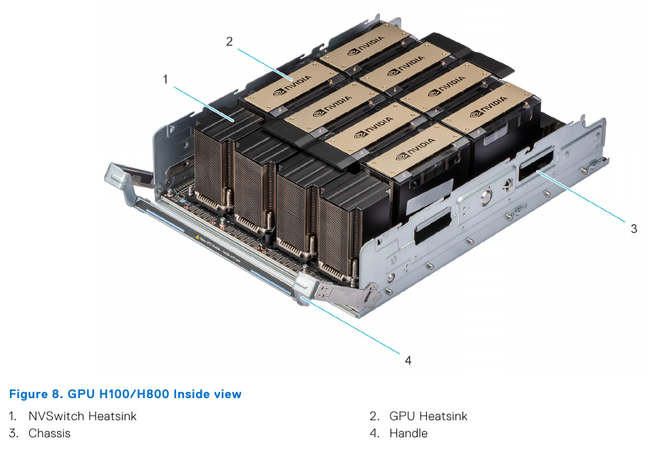
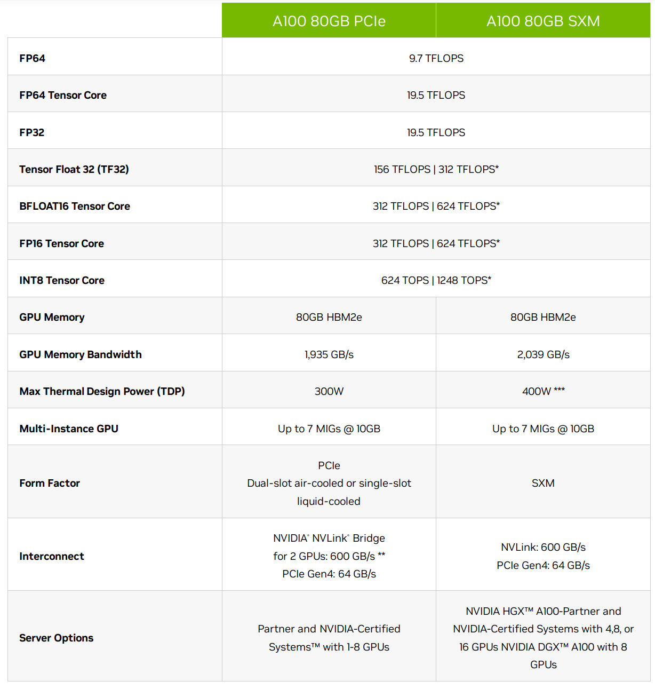
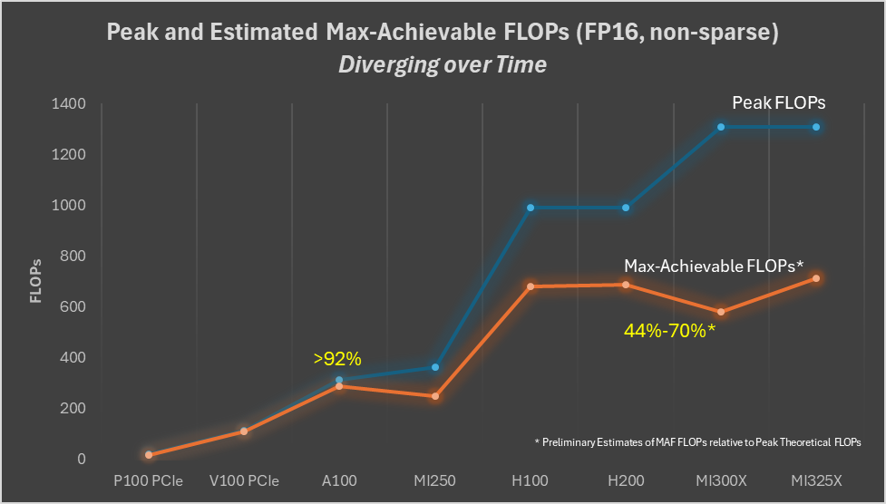

# Accelerators

Compute accelerators are the workhorses of the ML training. At the beginning there were just GPUs. But now there are also TPUs, FPGAs, HPUs, QPUs, RDUs and more are being invented.

There exist two main ML workloads - training and inference. There is also the finetuning workload which is usually the same as training, unless a much lighter [LORA-style](https://arxiv.org/abs/2106.09685) finetuning is performed. The latter requires significantly fewer resources and time than normal finetuning.

In language models during inference the generation is performed in a sequence - one token at a time. So it has to repeat the same `forward` call thousands of times one smallish `matmul` (matrix multiplication or GEMM) at a time. And this can be done on either an accelerator, like GPU, or some of the most recent CPUs, that can handle inference quite efficiently.

During training the whole sequence length is processed in one huge `matmul` operation. So if the sequence length is 4k long, the training of the same model will require a compute unit that can handle 4k times more operations than inference and do it fast. Accelerators excel at this task. In fact the larger the matrices they have to multiply, the more efficient the compute.

The other computational difference is that while both training and inference have to perform the same total amount of `matmul`s in the `forward` pass, in the `backward` pass, which is only done for training, an additional 2x times of `matmul`s is done to calculate the gradients with regards to inputs and weights. And an additional `forward` is performed if activations recomputation is used. Therefore the training process requires at 3-4x more `matmul`s than inference.

## Subsections

General:
- [Benchmarks](benchmarks)

NVIDIA:
- [Troubleshooting NVIDIA GPUs](nvidia/debug.md)

AMD:
- [Troubleshooting AMD GPUs](amd/debug.md)
- [AMD GPUs Performance](amd/performance.md)

## Bird's eye view on the high end accelerator reality

While this might be changing in the future, unlike the consumer GPU market, as of 2026-08 there aren't that many high end accelerators, and if you rent on the cloud, most providers will have more or less the same few accelerators to offer.

GPUs:
- As of today, ML clouds/HPCs already have B200s/B300s, and GB200/GB300 NVL72 racks are shipping. Rubin is expected to emerge in H2-2026.
- AMD's MI325X is now widely available on Tier 2 cloud providers. MI355X is starting to emerge. MI455X hopefully in 2026. New: large CSPs started to offer AMD GPUs

HPU:
- Intel's Gaudi2 and Gaudi3 are available at Intel's cloud.
- Falcon Shores is to replace Gaudi in 2025 - update - the project has been cancelled
- Jaguar Shores is named as the replacement, but as of 2026-07-31 Intel publishes nothing about it - see [Intel Gaudi](#intel-gaudi)

TPU:
- Google's TPUs are, of course, available but they aren't the most desirable accelerators because you can only rent them, and the software isn't quite easily convertible between GPUs and TPUs, and so many (most?) developers remain in the GPU land, since they don't want to be locked into a hardware which is a Google monopoly.
- Amazon's Trainium2 is very similar to the TPU architecture and is available on AWS

On Pods and racks:
- Cerebras' WaferScale Engine (WSE)
- SambaNova's SambaRack (SN40L today, SN50 from H2-2026)
- dozens of different pod and rack configs that compose the aforementioned GPUs with super-fast interconnects.

That's about it as of 2026-07-31.

The rest of this document will compare most of the above in details and if you want to read the specs please head [here](#high-end-accelerators-for-ml-workloads).

As most of us rent the compute, and we never see what it looks like, here is how an 8xH100 node looks like physically (this is the GPU tray of the Dell PowerEdge XE9680 Rack Server):




## Glossary

- BLAS: Basic Linear Algebra Subprograms
- CPU: Central Processing Unit
- CTS: Custom Thermal Solution - a vendor-supported cooling option that allows a higher power limit than the default
- CU: Compute Unit - AMD's counterpart to NVIDIA's SM
- CUDA: Compute Unified Device Architecture - NVIDIA's GPU programming platform
- DCORE: the die core Intel reports Gaudi3 cache against; a Gaudi3 has 4 of them
- DGX: NVIDIA's turn-key accelerator server line
- ECC: Error Correcting Code
- FMA: Fused Multiply Add
- FPGA: Field Programmable Gate Arrays
- GA: Generally Available - the product can actually be bought or rented, as opposed to announced, sampling, or spec'd only
- GCD: Graphics Compute Die
- GEMM: General Matrix Multiply
- GPU: Graphics Processing Unit
- HBM: High Bandwidth Memory
- HFU: Hardware FLOPS Utilization
- HGX: NVIDIA's accelerator baseboard that OEMs build their own servers around
- HPC: High-performance Computing
- HPU: Habana Gaudi AI Processor Unit
- LLC: Last Level Cache
- MAMF: Maximum Achievable Matmul FLOPS
- MFU: Model FLOPS Utilization
- MIG: Multi-Instance GPU - NVIDIA's partitioning of one GPU into isolated instances
- MME: Matrix Multiplication Engine
- NVL72: an NVLink domain of 72 accelerators; likewise NVL8 and NVL36
- OAM: OCP Accelerator Module - the Open Compute Project's accelerator form factor
- PSU: Power Supply Unit
- PTX: Parallel Thread Execution - NVIDIA's intermediate GPU instruction set
- QPU: Quantum Processing Unit
- RDU: Reconfigurable Dataflow Unit
- SM: Streaming Multiprocessor - NVIDIA's counterpart to AMD's CU
- SRAM: Static Random Access Memory
- TBP: Typical Board Power or Total Board Power, depending on vendor
- TDP: Thermal Design Power or Thermal Design Parameter
- TGP: Total Graphics Power
- TPC: Tensor Processing Core
- TPU: Tensor Processing Unit
- WSE: Wafer Scale Engine - Cerebras' whole-wafer accelerator
- XCD: Accelerator Complex Die - AMD's per-die cache reporting scope
- XLA: Accelerated Linear Algebra - the compiler behind PyTorch/JAX on TPUs and Trainium

[Additional glossary @ Modal](https://modal.com/gpu-glossary)

## The most important thing to understand

I will make the following statement multiple times in this book: it's not enough to buy/rent the most expensive accelerators and expect a high return on investment (ROI).

The two metrics for a high ROI for ML training are:
1. the speed at which the training will finish, because if the training takes 2-3x longer than planned, your model could become irrelevant before it was released - time is everything in the current super-competitive ML market.
2. the total $$ spent to train the model, because if the training takes 2-3x longer than planned, you will end up spending 2-3x times more.

If the rest of the purchased/rented hardware isn't chosen carefully to match the required workload, chances are very high that the accelerators will idle a lot and both time and $$ will be lost. The most critical component is [network](../../network), then [storage](../../storage/), and the least critical ones are [CPU](../cpu) and [CPU memory](../cpu-memory) (at least for a typical training workload where any CPU limitations are compensated with multiple `DataLoader` workers).

If the compute is rented one usually doesn't have the freedom to choose - the hardware is either set in stone or some components might be replaceable but with not too many choices. Thus there are times when the chosen cloud provider doesn't provide a sufficiently well matched hardware, in which case it's best to seek out a different provider.

If you purchase your servers then I recommend to perform a very indepth due diligence before buying.

Besides hardware, you, of course, need software that can efficiently deploy the hardware.

We will discuss both the hardware and the software aspects in various chapters of this book. You may want to start [here](../../training/performance) and [here](../../training/model-parallelism).


## What Accelerator characteristics do we care for

Let's use the NVIDIA A100 spec as a reference point in the following sections.



[source](https://www.nvidia.com/en-us/data-center/a100/)

### TFLOPS

Most of the work that ML training and inference do is matrix multiplication. If you remember your algebra matrix multiplication is made of many multiplications followed by summation. Each of these computations can be counted and define how many of these operations can be performed by the chip in a single seconds.

This is one of the key characteristics that the accelerators are judged by. The term TFLOPS defines how many trillions of FloatingPointOperations the chip can perform in a second. The more the better. There is a different definition for different data types. For example, here are a few entries from the theoretical peak TFLOPS from [A100 spec](https://www.nvidia.com/en-us/data-center/a100/):

| Data type \ TFLOPS     | w/o Sparsity | w/ Sparsity |
| :--------------------  | -----------: | ----------: |
| FP32                   |         19.5 |         n/a |
| Tensor Float 32 (TF32) |          156 |         312 |
| BFLOAT16 Tensor Core   |          312 |         624 |
| FP16 Tensor Core       |          312 |         624 |
| FP8 Tensor Core        |          624 |        1248 |
| INT8 Tensor Core       |          624 |        1248 |

Notes:

* INT8 is measured in TeraOperations as it's not a floating operation.

* the term FLOPS could mean either the total number of FloatingPointOperations, e.g. when counting how many FLOPS a single Transformer iteration takes, and it could also mean FloatingPointOperations per second - so watch out for the context. When you read an accelerator spec it's almost always a per second definition. When model architectures are discussed it's usually just the total number of FloatingPointOperations.

So you can see that int8 is 2x faster than bf16 which in turn is 2x faster than tf32.

Moreover, the TFLOPS depend on the matrices size as can be seen from this table:


[source](https://developer.nvidia.com/blog/cuda-11-features-revealed/)

As you can see the difference in performance is non-linear due to [the tile and wave quantization effects](../../training/performance/README.md#tile-and-wave-quantization). Note the blue line in the graph corresponds to FP32 Tensor Core.

#### How To Calculate Theoretical TFLOPS

Theoretical peak FLOPS is what gets published on the accelerator's spec. And it's calculated as:

`Theoretical FLOPS = compute_unit_clock_speed * FLOPs_per_clock_cycle_per_compute_unit * num_compute_units`

where:
- `compute_unit_clock_speed` - how many times the compute unit clock ticks per second in Hz
- `flops_per_clock_cycle_per_compute_unit` - the number of floating point operations the compute unit can execute per clock cycle.
- `num_compute_units` - how many units there is in the device

FLOPs per clock cycle per compute unit is usually not published, but what one often finds is the FMAs per clock cycle per compute unit specs. FMA is Fused Multiply Add. And since 1 FMA is made of 2 FLOPs, we can expand the above formula to:

`Theoretical FLOPS = compute_unit_clock_speed * FMAs_per_clock_cycle_per_compute_unit * 2 * num_compute_units`

Let's validate that this formula checks out. Let's compute some BF16 (half precision) TFLOPS and compare to the published specs.

First, let's extract the necessary accelerator specs from [wiki](https://en.wikipedia.org/wiki/Hopper_(microarchitecture)#H100_accelerator_and_DGX_H100).

The tricky part was to find the FMAs ops per Tensor Core per clock cycle for BF16 (half precision). I found them [here](https://forums.developer.nvidia.com/t/how-to-calculate-the-tensor-core-fp16-performance-of-h100/244727/2). Most are coming from the [A100 whitepaper](https://images.nvidia.com/aem-dam/en-zz/Solutions/data-center/nvidia-ampere-architecture-whitepaper.pdf) (search the pdf for "FMA" and then choose the ones listed for the target precision you're after). The [H100 whitepaper](https://resources.nvidia.com/en-us-hopper-architecture/nvidia-h100-tensor-c) omitted a lot of specific FMA numbers, but included the multipliers wrt FMAs listed in the A100 whitepaper).

The clock speeds used in the following calculations and what each vendor's clock actually means, are collected in [Clock speed](#clock-speed).

**For NVIDIA @ BF16**:

For NVIDIA BF16 operations are performed by Tensor cores.

| Accelerator | Clock   | FMAs ops per Tensor Core per clock cycle | Tensor Cores | Spec TFLOPS | Notes |
| :---------  | ------: | ---------------------------------------: | -----------: | ----------: | ----: |
| H100 SXM    | 1830MHz |                                      512 |          528 |         989 |     1 |
| A100 SXM    | 1410MHz |                                      256 |          432 |         312 |     1 |

1. `Tensor Cores` is derived: 4 Tensor Cores per SM, times 132 SMs for H100 SXM and 108 SMs for A100 SXM.


Now let's do the math, by inserting the numbers from the table above into the last FMA-based formula:

- `1830*10**6 * 512 * 2 * 528 / 10**12 = 989.430` TFLOPS
- `1410*10**6 * 256 * 2 * 432 / 10**12 = 311.87` TFLOPS

Both calculated numbers match the published specs - 989 for H100 SXM and 312 for A100 SXM.

Note that this peak is an aggregate over the whole accelerator - `528` Tensor Cores is `4 x 132` SMs - so it is not what a single matmul achieves unless that matmul is large enough to occupy every SM. For why a part with more SMs does not automatically deliver more TFLOPS, see [Do more SMs give more TFLOPS?](../../training/performance/README.md#do-more-sms-give-more-tflops).

The H100 SXM clock above is 1830MHz, which is now NVIDIA's official figure. Earlier 1980MHz was the widely published number, and it doesn't work out: `1980*10**6 * 512 * 2 * 528 / 10**12 = 1070.530` TFLOPS, some 80 points above the spec. Before 1830MHz became official you could already recover it by inverting the same formula against the spec TFLOPS: `989 / (512 * 2 * 528 / 10**12) / 10**6 = 1829.20`. Which is a useful trick in general - if a vendor publishes the TFLOPS but not the clock, or publishes a clock that doesn't reproduce their own TFLOPS, the formula tells you which number they actually used.

**For AMD @ BF16**:

| Accelerator | Peak Engine Clock | FMAs ops per Matrix Core per clock cycle | Matrix Cores | Spec TFLOPS | Notes |
| :---------- | ----------------: | ---------------------------------------: | -----------: | ----------: | ----: |
| MI355X      |           2400MHz |                                      512 |         1024 |        2500 |     1 |
| MI300X      |           2100MHz |                                      256 |         1216 |        1307 |       |
| MI250X      |           1700MHz |                                      128 |          880 |         383 |     2 |

1. AMD publishes `2.5 PFLOPS` for MI355X BF16 matrix, rounded to two significant digits - the formula gives 2516.6.
2. AMD publishes the Matrix Core count for MI355X (1024) and MI300X (1216), but not for MI250X, so its 880 is derived: 4 Matrix Cores per CU, times 220 CUs.

Let's calculate ourselves as before:

- `2400*10**6 * 512 * 2 * 1024 / 10**12 = 2516.6` TFLOPS - matches AMD's published `2.5 PFLOPS` within their own rounding
- `2100*10**6 * 256 * 2 * 1216 / 10**12 = 1307.4` TFLOPS - matches the published spec, even though most of the time you will see the rounded down `1300` TFLOPS in the literature.
- `1700*10**6 * 128 * 2 * 880 / 10**12 = 383.0` TFLOPS - matches the published spec exactly

Note the FMAs per Matrix Core doubling every CDNA generation - 128 on MI250X (CDNA2), 256 on MI300X (CDNA3), 512 on MI355X (CDNA4). Since the Matrix Core count barely moved (880 to 1216 to 1024), that per-core doubling is where almost all of the generational BF16 gain came from, not from more cores.

**For Intel @ BF16**:

Intel Gaudi uses MMEs to do BF16 `matmul`

| Accelerator | MME Clock | FMAs ops per MME per clock cycle | MMEs | Spec TFLOPS |
| :---------- | --------: | -------------------------------: | ---: | ----------: |
| Gaudi 2     |   1650MHz |                          256*256 |    2 |         432 |
| Gaudi 3     |   1600MHz |                          256*256 |    8 |        1677 |
|             |           |                                  |      |             |

Let's calculate ourselves as before:

- Gaudi 2: `1650*10**6 * 256*256 * 2 * 2 / 10**12 = 432.5` TFLOPS - matches the published spec
- Gaudi 3: `1600*10**6 * 256*256 * 2 * 8 / 10**12 = 1677` TFLOPS - note that this doesn't match the published spec in the whitepaper (1835TFLOPS), because in order to have 1835TFLOPS the clock has to be 1750MHz. i.e. the current incarnation of Gaudi3 is running at 1600MHz.

It should become obvious now that if your accelerator runs at a lower boost clock than the spec (e.g. overheating that leads to accelerator throttling) the expected TFLOPS will be lower than advertised.

To check the actual clock speed when your accelerator is under load see the [clock speed](#clock-speed) section.


#### TFLOPS comparison table

Let's look at the supported [dtypes](../../training/dtype.md) and the corresponding theoretical peak TFLOPS specs across the high end accelerators (w/o sparsity). Both tables are sorted by the bf16 column, and they share one set of notes, listed after them.

**Generally available:**

| Accelerator \ TFLOPS  | fp32  | tf32   | fp16 | bf16 | fp8  | int8 | fp6   | fp4   | nvfp4 | Notes |
| :-------------------- | ----: | -----: | ---: | ---: | ---: | ---: | ----: | ----: | ----: | ----: |
| NVIDIA GB300 SXM      |  80.0 | 1250.0 | 2500 | 2500 | 5000 | 5000 |  5000 | 15000 |     ? |    24 |
| NVIDIA GB200 SXM      |  80.0 | 1250.0 | 2500 | 2500 | 5000 | 5000 |  5000 | 10000 |     ? |    23 |
| AMD MI355X            | 157.3 |      ? | 2500 | 2500 | 5000 | 5000 | 10100 | 10100 |     X |    22 |
| Google TPU v7x        |     ? |      ? | 2307 | 2307 | 4614 |    ? |     ? |     ? |     ? |    25 |
| NVIDIA B300 SXM       |  80.0 | 1125.0 | 2250 | 2250 | 4500 | 4500 |  4500 | 12600 | 15000 |    21 |
| NVIDIA B200 SXM       |  80.0 | 1125.0 | 2250 | 2250 | 4500 | 4500 |  4500 |  9000 | 10000 |    20 |
| Intel Gaudi3          | 229.0 |  459.0 |  459 | 1677 | 1677 |    V |     X |     X |     X |  8,19 |
| AMD MI325X            | 163.4 |  653.7 | 1300 | 1300 | 2610 | 2600 |     X |     X |     X |    18 |
| AMD MI300X            | 163.4 |  653.7 | 1300 | 1300 | 2610 | 2600 |     X |     X |     X |    17 |
| NVIDIA H200 SXM       |  67.0 |  494.5 |  989 |  989 | 1979 | 1979 |     X |     X |     X |    16 |
| NVIDIA H100 SXM       |  67.0 |  494.5 |  989 |  989 | 1979 | 1979 |     X |     X |     X | 12,15 |
| NVIDIA GH200 SXM      |  67.0 |  494.5 |  989 |  989 | 1979 | 1979 |     X |     X |     X |    14 |
| Google TPU v6e        |     ? |      ? |  918 |  918 |  918 | 1836 |     X |     X |     X |    13 |
| NVIDIA H100 PCIe      |  51.0 |  378.0 |  756 |  756 | 1513 | 1513 |     X |     X |     X |    12 |
| AWS Trainium2 / Ultra | 181.0 |  667.0 |  667 |  667 | 1299 |    X |     X |     X |     X |    11 |
| Google TPU v5p        |     X |      X |    X |  459 |    X |  918 |     X |     X |     X |    10 |
| Intel Gaudi2          |     V |      V |    V |  432 |  865 |    V |     X |     X |     X |   8,9 |
| AMD MI250X            |  47.9 |      X |  383 |  383 |    X |  383 |     X |     X |     X |     7 |
| NVIDIA L40S           |  91.6 |  183.0 |  362 |  362 |  733 |  733 |     X |     X |     X |     6 |
| AMD MI250             |  45.3 |      X |  362 |  362 |    X |  362 |     X |     X |     X |     5 |
| NVIDIA A100 SXM       |  19.5 |  156.0 |  312 |  312 |    X |  624 |     X |     X |     X |     4 |
| NVIDIA A100 PCIe      |  19.5 |  156.0 |  312 |  312 |    X |  624 |     X |     X |     X |   3,4 |
| Google TPU v4         |     X |      X |    X |  275 |    X |  275 |     X |     X |     X |     2 |
| Google TPU v5e        |     X |      X |    X |  197 |    X |  394 |     X |     X |     X |     1 |

**Announced, availability not confirmed:**

| Accelerator \ TFLOPS | fp32  | tf32   | fp16 | bf16 | fp8   | int8 | fp6   | fp4   | nvfp4 | Notes |
| :------------------- | ----: | -----: | ---: | ---: | ----: | ---: | ----: | ----: | ----: | ----: |
| AMD MI455X           | 315.0 |      ? | 5000 | 5000 | 10000 | 5000 | 10000 | 20000 |     X |    27 |
| NVIDIA Rubin SXM     | 130.0 | 2000.0 | 4000 | 4000 | 17500 | 2500 | 17500 | 35000 | 35000 |    26 |
| Huawei Ascend 950DT  |     X |      X |  486 |  486 |   919 |    X |     X |  1783 |     X |    28 |

Notes and sources - the `Notes` column of both tables points here. Numbers run from the oldest hardware upward, so anything new gets the next number and lands at the end of this list:

1. [Google Cloud TPU v5e documentation](https://docs.cloud.google.com/tpu/docs/v5e)
2. [Google Cloud TPU v4 documentation](https://docs.cloud.google.com/tpu/docs/v4)
3. Oddly NVIDIA A100 PCIe and SXM revisions [spec](https://www.nvidia.com/en-us/data-center/a100/) are reported to have the same TFLOPS, which is odd considering the SXM version uses 30% more power and uses a 5% faster HBM.
4. [NVIDIA A100 specifications](https://www.nvidia.com/en-us/data-center/a100/) - covers both the SXM and PCIe rows
5. [AMD Instinct MI250 specifications](https://www.amd.com/en/products/accelerators/instinct/mi200/mi250.html)
6. [NVIDIA L40S specifications](https://www.nvidia.com/en-us/data-center/l40s/)
7. [AMD Instinct MI250X specifications](https://www.amd.com/en/products/accelerators/instinct/mi200/mi250x.html)
8. Intel Gaudi2 and 3 only have partial TFLOPS [specs](https://www.intel.com/content/www/us/en/content-details/817486/intel-gaudi-3-ai-accelerator-white-paper.html) published, but it does support FP32, TF32, BF16, FP16 & FP8, INT8 and INT16. These numbers are for MME (Matrix) compute.
9. [Intel Gaudi 2 AI accelerator white paper](https://www.intel.com/content/www/us/en/content-details/839363/intel-gaudi-2-ai-accelerators-white-paper.html)
10. [Google Cloud TPU v5p documentation](https://docs.cloud.google.com/tpu/docs/v5p)
11. Trainium2 also supports FP8/FP16/BF16/TF32 @ 2563TFLOPS w/ 4:1 sparsity. See [AWS Trainium2 architecture documentation](https://awsdocs-neuron.readthedocs-hosted.com/en/latest/about-neuron/arch/neuron-hardware/trainium2.html).
12. [NVIDIA H100 specifications](https://www.nvidia.com/en-us/data-center/h100/) - covers both the SXM and PCIe rows
13. [Google Cloud TPU v6e documentation](https://docs.cloud.google.com/tpu/docs/v6e)
14. GH200 - same note as GB200 - this is 2 GPUs in one package, so the table includes specs per chip w/o sparsity. See [NVIDIA GH200 Grace Hopper Superchip specifications](https://www.nvidia.com/en-us/data-center/grace-hopper-superchip/).
15. I didn't include `NVIDIA H100 dual NVL` as it's, well, 2x GPUs - so it won't be fair - it's the same FLOPS as H100 but 2x everything, plus at has a bit more memory (94GiB per chip, as compared to 80GiB H100) and the memory is a bit faster.
16. H200 is the same as H100 but has 141GiB vs 80GiB of HBM memory, and its memory is faster, HBMe@4.8TBps vs HBM@3.35TBps - so basically H200 solves the memory-bandwidth and memory-capacity bottlenecks of H100. See [NVIDIA H200 specifications](https://www.nvidia.com/en-us/data-center/h200/).
17. [AMD Instinct MI300X specifications](https://www.amd.com/en/products/accelerators/instinct/mi300/mi300x.html)
18. MI325X is the same compute as MI300X, but has more memory and more power (more efficient compute). See [AMD Instinct MI325X specifications](https://www.amd.com/en/products/accelerators/instinct/mi300/mi325x.html).
19. Gaudi3 as of 2026-08 is running at 1600MHz (MME) and not the planned 1750MHz, therefore its BF16 TFLOPS are 1677 and not 1835 as per whitepaper spec. Same goes for fp8 which runs at the same TFLOPS as BF16.
20. [NVIDIA DGX B200 datasheet](https://resources.nvidia.com/en-us-dgx-systems/dgx-b200-datasheet)
21. [NVIDIA DGX B300 datasheet](https://resources.nvidia.com/en-us-dgx-systems/dgx-b300-datasheet)
22. [AMD Instinct MI355X specifications](https://www.amd.com/en/products/accelerators/instinct/mi350/mi355x.html) - these are AMD's dense figures. AMD also publishes `with Structured Sparsity` variants at exactly 2x - 10.1 PFLOPS for OCP-FP8 and 5 PFLOPS for FP16 matrix - so a 10.1 PFLOPS fp8 number quoted elsewhere is the sparse one, not this table's. The `fp6` and `fp4` entries carry no sparsity qualifier on AMD's page and are dense. MI350X is the same silicon at 2200MHz and 1000W, with everything scaled by the clock ratio (144.2 vs 157.3 fp32); it is left out because MI355X is the part you can actually rent.
23. Since GB200 is 2x B200 chips the table includes TFLOPS per chip for a fair comparison - you'd 2x it for the real GB200 - it also seems to run the B200 chips a bit faster so higher specs than standalone B200. This also means that instead of your typical 8-GPU node, with GB200 you will get a 4-GPU node instead (but it'd be the equivalent of 8x B200 w/ an additional ~10% faster compute). See [NVIDIA GB200 NVL72 specifications](https://www.nvidia.com/en-us/data-center/gb200-nvl72/).
24. GB200 NVL72 and GB300 NVL72 seem to be the same but faster fp4 and more memory for the latter. See [NVIDIA GB300 NVL72 specifications](https://www.nvidia.com/en-us/data-center/gb300-nvl72/).
25. [Google Cloud TPU v7x documentation](https://docs.cloud.google.com/tpu/docs/tpu7x) - Google calls it "the latest TPU available on Google Cloud" and documents using it through GKE or Compute Engine, so it is treated as available like every other TPU here, all of which are rent-only and capacity-gated. Only fp16, bf16 and fp8 are published; the rest of the row is `?` because Google has not stated those numbers.
26. [NVIDIA Vera Rubin NVL72 specifications](https://www.nvidia.com/en-us/data-center/vera-rubin-nvl72/) - pre-release, so these are announced figures rather than a shipped part's spec sheet
27. AMD's MI455X figures come from its [product page](https://www.amd.com/en/products/accelerators/instinct/mi400/mi455x.html), read on 2026-08-06. `fp32` 315, `fp16` 5000, `bf16` 5000 and `int8` 5000 are AMD's own dense numbers. `fp8`, `fp6` and `fp4` are halved from the 20100, 20100 and 40300 that AMD publishes, because those three are almost certainly with-sparsity figures that AMD did not declare as such: it labels the sparsity variants of FP16, BF16 and INT8 explicitly on the same page, all at 10100, and taking the three unlabelled numbers at face value would make fp8 4x bf16 where every other accelerator here is 2x - MI355X runs 2500, 5000, 10100. Halving restores that doubling exactly. AMD publishes no TF32 figure for this part, hence `?`. All of it remains AMD Performance Labs projections carrying "Results subject to change when products are released in market".
28. Ascend 950DT figures are from the Atlas 950 SuperPoD product-spec table on [Ascend Community](https://www.hiascend.com/en/hardware/cluster?tag=950) (read 2026-08-10): `114.1 / 58.8 / 31.1` PFLOPS @ `mxFP4` / `mxFP8/HiF8` / `FP16/BF16` for **64×** Ascend 950DT, divided by 64 → **1783 / 919 / 486**. Do not mix with the 1024-card SuperPoD totals on the Chinese page (those give ~1953 / 977 mxFP4/mxFP8 and no bf16). The `fp8` column is Huawei's single published `mxFP8/HiF8` rate; [HiF8](https://arxiv.org/abs/2409.16626) is tapered-precision, not OCP E4M3/E5M2, so the chapter's `e`/`m` dtype decoder does not apply to it. Unpublished columns are `X`.
General notes:

* int8 is measured in TeraOperations as it's not a floating operation.

* if you find numbers that are double of the above - it usually means with sparsity (which at the moment almost nobody can benefit from as our matrices are dense).

* when looking at specs be very careful at which numbers you're reading - many vendors often publish TFLOPS with sparsity, as they are ~2x bigger, but if they even indicate this they often do it in small print. I had to ask NVIDIA to add a note to their H100 spec that those numbers were w/ sparsity as they originally didn't mention this important technical fact. And 99% of the time as of 2026-08 you will be not using sparsity and thus the actual theoretical TFLOPS that you care for most of the time are w/o sparsity (i.e. the table above).

* also beware that if accelerator A publishes a higher TFLOPS than accelerator B, it doesn't mean A is faster. These are theoretical numbers which not only can never be achieved in practice - the actual TFLOPS efficiency [Hardware FLOPS Utilization](../../training/performance/README.md#mfu-vs-hfu) (HFU) can vary a lot from vendor to vendor or even for the same vendor's different accelerator architectures.


#### Maximum Achievable FLOPS

The problem with the advertised theoretical peak FLOPS is that they are **very** theoretical and can't be achieved in practice even if all the perfect conditions have been provided. Each accelerator has its own realistic FLOPS which is not advertised and there are anecdotal community reports that do their best to find the actual best value, but I'm yet to find any official reports.

If you find solid reports (papers?) showing the actual TFLOPS one can expect from one or more of the high end accelerators discussed in this chapter please kindly submit a PR with this information. The key is to have a reference to a source that the reader can validate the proposed information with.

To provide a numerical sense to what I'm talking about let's take an A100 with its 312TFLOPS bf16 peak performance in the specs of this card. Until the invention of FlashAttention it was known that 150TFLOPS was close to the highest one could get for fp16/bf16 mixed precision training regime. And with FlashAttention it's around 180+TFLOPS. This is, of course, measured for training LLMs where the network and IO are involved which create additional overheads. So here the maximum achievable peak performance probably lays somewhere between 200 and 300TFLOPS.

You could measure the actual achievable peak TFLOPS by doing a perfectly aligned max-size matrices `matmul` measured on a single accelerator. You can use [Maximum Achievable Matmul FLOPS Finder](benchmarks/README.md#maximum-achievable-matmul-flops-finder) to reproduce the results. But, of course, this will only tell you how well your given accelerator and its software stack do `matmul` - depending on the workload this might be all you need to know, or not.

MAMF stands for [Maximum Achievable Matmul FLOPS](#maximum-achievable-matmul-flops-comparison-table), which is a term coined by yours truly. It is very practical for those who do performance optimization work.

#### Maximum Achievable Matmul FLOPS comparison table

The following measurements are for `matmul` with BF16 and FP8 inputs (no sparsity) TFLOPS (see [Maximum Achievable FLOPS](#maximum-achievable-flops) for what MAMF stands for). Reporting a mean of 100 iterations after 50 warmup iterations for each shape. Sorted by accelerator efficiency:

**BF16**:

| Accelerator      |   MAMF | Theory | Efficiency | Best Shape MxNxK | torch version                  | Notes                              |
| :--------------- | -----: | -----: | ---------: | :--------------- | :----------------------------- | :--------------------------------- |
| Intel Gaudi 2    |  418.7 |    432 |      96.9% | 14336x15360x2048 | 2.6.0+hpu_1.21.2-76.gitabf798b | PT_HPU_LAZY_MODE=1                 |
| NVIDIA A100 SXM  |  271.2 |    312 |      86.9% |  1024x10240x5120 | 2.6.0+cu126                    |                                    |
| NVIDIA GH200 SXM |  828.6 |    989 |      83.8% |  1024x15360x4096 | 2.6.0+cu126                    | 900W 141GiB HBM3e version          |
| NVIDIA A100 PCIe |  252.9 |    312 |      81.1% |   2048x5120x6144 | 2.5.1+cu124                    |                                    |
| NVIDIA H100 SXM  |  794.5 |    989 |      80.3% |  2048x2048x13312 | 2.7.0+cu126                    | H200 is the same                   |
| NVIDIA B300 SXM  | 1769.0 |   2250 |      78.6% | 12288x18432x1024 | 2.9.1+cu130                    | same as B200, newer torch/cuda     |
| NVIDIA B200 SXM  | 1745.0 |   2250 |      77.6% |  1792x16128x3072 | 2.7.1+cu128                    |                                    |
| Intel Gaudi 3    | 1243.0 |   1677 |      74.1% |   16384x4096x768 | 2.6.0+hpu_1.21.4-3.gitabf798b  | PT_HPU_LAZY_MODE=1                 |
| NVIDIA GB200 SXM | 1822.0 |   2500 |      72.9% |   4096x9728x2048 | 2.10.0.dev20250916+cu130       |                                    |
| AMD MI355X       | 1565.0 |   2300 |      68.0% |  12288x8192x8192 | 2.8.0+rocm7.0.2.git245bf6ed    | PYTORCH_TUNABLEOP_ENABLED=0        |
| AMD MI325X       |  784.9 |   1300 |      60.4% | 13312x10240x8192 | 2.6.0+6.2.4                    | PYTORCH_TUNABLEOP_ENABLED=1, 1000W |
| AMD MI300X       |  668.4 |   1300 |      51.4% | 10240x15360x8192 | 2.5.1+6.3.42131                | PYTORCH_TUNABLEOP_ENABLED=1        |
|                  |        |        |            |                  |                                |                                    |


**FP8 (`float8_e4m3fn`)**:

| Accelerator      |   MAMF | Theory | Efficiency | Best Shape MxNxK | torch version                  | Notes                     |
| :--------------- | -----: | -----: | ---------: | :--------------- | :----------------------------- | :------------------------ |
| Intel Gaudi 2    |  826.5 |    865 |      95.5% |  6144x11264x5120 | 2.6.0+hpu_1.21.2-76.gitabf798b | PT_HPU_LAZY_MODE=1        |
| NVIDIA GH200 SXM | 1535.0 |   1979 |      77.6% | 1024x14336x14336 | 2.6.0+cu126                    | 900W 141GiB HBM3e version |
| Intel Gaudi 3    | 1289.5 |   1677 |      76.9% |  16640x1536x3072 | 2.6.0+hpu_1.21.4-3.gitabf798b  | PT_HPU_LAZY_MODE=1        |
| NVIDIA B200 SXM  | 3432.5 |   4500 |      76.3% |  15360x4096x3072 | 2.7.1+cu128                    |                           |
| NVIDIA B300 SXM  | 3353.3 |   4500 |      74.5% |   3072x6144x7168 | 2.9.1+cu130                    |                           |
| NVIDIA H200 SXM  | 1453.4 |   1979 |      73.4% |  1280x4096x12032 | 2.7.1+cu128                    |                           |
| NVIDIA GB200 SXM | 3615.6 |   5000 |      72.3% |  19456x5120x1536 | 2.10.0.dev20250916+cu130       |                           |
| NVIDIA H100 SXM  | 1402.6 |   1979 |      70.9% |  1024x9216x14336 | 2.7.0+cu126                    |                           |
| AMD MI300X       |        |   2600 |            |                  |                                |                           |
|                  |        |        |            |                  |                                |                           |


Caveat emptor: these numbers were achieved by a brute-force search of a non-exhaustive sub-space of various shapes performing `matmul`. See:  [Maximum Achievable Matmul TFLOPS Finder](benchmarks/README.md#maximum-achievable-matmul-flops-finder) using the software components available at the time of taking the measurement, so I highly recommend you re-run `mamf-finder.py` on your particular setup to get the true to your setup numbers. The numbers in this table are a rough estimation and shouldn't be used as absolute. As the software improves these numbers will improve coming closer to the theoretical spec. So ideally they ought to be re-run every 6 months or so.

Notes:
- For the full set of theoretical ones see [Theoretical accelerator TFLOPS](#tflops-comparison-table)
- Efficiency is MAMF/Theory*100
- While `mean` is probably what most users are interested in, the script reports `max`, `median` and `mean` - should you want the other numbers.
- Best shape is the one detected by the script, but there could be many others with similar performance - it's listed for reproducibility
- If you get a much lower performance than the numbers in this table, check that the target hardware has an adequate cooling, if the accelerator is overheated it'd usually throttle its performance down. And, of course, the assumption here is that the power supply matches the spec. The latter is rarely a problem in data centers, but bad cooling is not unheard of.
- Which software you use can make a huge difference - e.g., with MI300X I clocked 450TFLOPS using ROCm-6.1, but as you can see there was a dramatic improvement in ROCm-6.2 where it jumped a whooping additional 300TFLOPS up. BLAS library type/version may have a big impact as well.
- Then there are various system optimizations - e.g. in the case of MI300X disabling numa_balancing in the kernel settings is a must.
- Rows are not always exactly comparable with each other. Each is the best shape found for *that* accelerator, and often on a different `torch`/CUDA or ROCm version, so any gap between two rows mixes hardware, shape and software. But it's a good enough of indication to compare with the theoretical spec. As software evolves remeasuring is needed and likely to give better results, but yours truly doesn't have access to all the gpus, especially the older ones, thus contributions are very welcome.
- AMD MI250X has 2 GCDs - so the theoretical TFLOPS needs to be halved, as a single matmul uses only 1 of them and 383TFLOPS is reported for 2 GCDs.

Also it's important to understand that knowing the Maximum Achievable Matmul TFLOPS at some particular shape like `4352x3840x13568` doesn't mean you can expect to get the same performance in your real application because chances are low that you will ever hit that exact shape. Instead, to know your system well, you'd run the [MAMF Finder](benchmarks/README.md#maximum-achievable-matmul-flops-finder) with the actual shapes your model is using during its training. This really is the main intention of this tool. You will have a good sense of when you can stop optimizing by comparing the TFLOPS reported by your training to Maximum Achievable MatMul TFLOPS you measured on your specific accelerator cluster.

And to conclude this section I'd like to repeat again that **the intention here is not to point fingers at which accelerator is less efficient than another, but to give a sense of what's what and how to navigate those theoretical specs and to help you understand when you need to continue optimizing your system and when to stop. So begin with these notes and numbers as a starting point, then measure your own use case and use that latter measurement to gain the best outcome.**

update: this new metric is starting to catch on. AMD published this graph and [explanations of why the efficiency of accelerators is going down as they get faster](https://rocm.blogs.amd.com/software-tools-optimization/Understanding_Peak_and_Max-Achievable_FLOPS/README.html):



[source](https://rocm.blogs.amd.com/software-tools-optimization/Understanding_Peak_and_Max-Achievable_FLOPS/README.html)


#### Not all accelerators are created equal

While measuring how well an accelerator performs, you need to be aware that while it gives you the ballpark performance numbers, other accelerators are likely to perform slightly differently. I have seen 5% and higher differences on an 8-gpu node.

This partially has to do with manufacturing processes, how well each accelerator is installed and much more about how equally each accelerator is cooled. For example, when air cooling is used it's very likely that the accelerators closer to the source of cooling will perform better than those further away, especially since now the hot air dissipated from one row gets blown into the next row of accelerators. Things should be better with liquid cooling.

##### Silicon lottery

Even two chips coming off the same wafer are not identical. Tiny variations during manufacturing mean each die ends up with slightly different transistor characteristics. Some leak more current, some need higher voltage to switch reliably at a given frequency, others can run cooler or hotter at the same workload. This is known as the **silicon lottery**: you can buy two GPUs with the same model number and SKU and get measurably different performance and power behavior from them.

The way this is characterized is the per-chip **V-F-T curve** (Voltage-Frequency-Temperature). Every die has its own surface describing the minimum voltage required to run stably at a given frequency and temperature. A "good" die can hit higher frequencies at lower voltage (less heat, less power, more headroom before throttling); a "weaker" die needs more voltage for the same clock, which produces more heat, which then forces the clock down sooner under load. So the curves are not parallel. Two dies that are equal at idle can diverge significantly once they're hot and under sustained compute.

In data-center accelerators the boost-clock and TDP spec is set conservatively so that every binned chip can meet it, but the *actual sustained performance* still falls anywhere on a distribution. Combined with uneven cooling (see above), this explains why on the same 8-GPU node you can see 5%+ MAMF spread between GPUs even when all of them pass the same factory binning.

Therefore, you want to measure the performance of all accelerators on the node and do it at the same time. For example, on NVIDIA nodes, if each benchmark measures a single accelerator, you could do:
```bash
CUDA_VISIBLE_DEVICES=0 ./some-benchmark
CUDA_VISIBLE_DEVICES=2 ./some-benchmark
...
CUDA_VISIBLE_DEVICES=7 ./some-benchmark
```

Now here what you want is the slowest performance as when used in an ensemble that slowest accelerator (struggler) will set the speed for all other accelerators.

If you do multi-node training then, of course, you'd want to measure them all.

So if you decide to calculate your achievable [MFU](../../training/performance/README.md#mfu-vs-hfu) (rather than theoretical one) you'd want to measure the achievable FLOPS across all participating accelerators and pick the value of the slowest accelerator. (If it really is an outlier you might want to consider replacing it as well).


### Accelerator memory size and speed

The accelerators use [High Bandwidth Memory](https://en.wikipedia.org/wiki/High_Bandwidth_Memory) (HBM) which is a 3D version of SDRAM memory. For example, the 80GiB A100-SXM comes with HBM2e at 2.0TBps, and the 80GiB H100-SXM comes with HBM3 at 3.35TBps (see the full table per accelerator below).

Here are the specs:

| Type  | Max data<br> rate speed per<br> pin (Gbps) | Stack<br> Height | Bits per<br> Channel | Number<br> of dies<br> per stack | Die capacity<br> per stack<br> (GiBs) | Max capacity<br> per stack<br> (GiBs) | Max data<br> rate per<br> stack (GBps) |
| :---- | -----------------------------------------: | ---------------: | -------------------: | -------------------------------: | ------------------------------------: | ------------------------------------: | -------------------------------------: |
| HBM1  |                                        1.0 |                8 |                  128 |                                4 |                                     1 |                                     4 |                                    128 |
| HBM2  |                                        2.4 |                8 |                  128 |                                8 |                                     1 |                                     8 |                                    307 |
| HBM2e |                                        3.6 |                8 |                  128 |                               12 |                                     2 |                                    24 |                                    461 |
| HBM3  |                                        6.4 |               16 |                   64 |                               12 |                                     2 |                                    24 |                                    819 |
| HBM3e |                                        9.6 |               16 |                   64 |                               16 |                                     3 |                                    48 |                                   1229 |
| HBM4  |                                        8.0 |               32 |                   64 |                               16 |                                     4 |                                    64 |                                   2048 |

Notes:

- While I was researching this table I found a wide variation of the above numbers. I think it's because either there were different implementations or the specs changed several times and different publications caught different specs. The table above comes from [wikipedia](https://en.wikipedia.org/wiki/High_Bandwidth_Memory).
- Since HBM is a stack of multiple DRAM chips, the *Stack Height* specifies how many chips are per device.

Beware that sometimes memory specs may not be very clear about what GB means. Sometimes it's GiB (`2**30` bytes), but written as GB. At other times it's actually GB (`10**9` bytes). Bandwidth (`GBps`, `TBps`) almost always means decimal units (`1GBps = 10**9` bytes per second). To convert GiB to GB: `x * 2**30 / 10**9`. To convert from GB to GiB: `x * 10**9 / 2**30`. Most often, memory size will be in GiB (with the `i` omitted), while bandwidth will use decimal GBps or TBps.

To make things even more confusing, the advertised capacity isn't always what you actually get to use. One possible explanation for NVIDIA B200's 192GB and 180GB figures is that it physically has 192GiB of HBM3e - 8 stacks of 24GiB each (these are GiB and not decimal GB: DRAM die density is inherently binary, so a stack of 8x 24Gbit dies is `8*24*2**30/8 = 24GiB`, and 8 stacks give 192GiB - vendors just print it as "192GB"). Under this interpretation, only about 180GiB is usable in HGX/DGX systems and the rest is reserved, e.g. for ECC; `192*15/16 = 180` exactly, suggesting that 1/16 is held back. So the 192-versus-180 difference would be physical versus usable capacity, not GB versus GiB, and this is why the table below lists NVIDIA's 180GB hardware/platform figure. However, the 192GiB physical capacity, eight-stack layout, binary-unit interpretation, and 1/16 reservation are derived from arithmetic: NVIDIA has not officially documented this relationship, and the actual hardware layout or memory accounting could differ.

Typically, the more on-device memory an accelerator has, the better its performance. At any given time usually most of the model weights aren't being used as they wait for their turn to be processed and thus large memory allows more of the model to be on the accelerator memory and immediately available for access and update. When there is not enough memory, sometimes the model has to be split across multiple accelerators, or offloaded to CPU and/or disk.

Here are the memory specs for the recent high end accelerators (some aren't GA yet), sorted by memory size, then bandwidth:

**Generally available:**

| Accelerator           | Memory<br>(GB) | Type  | Peak<br>Bandwidth<br>(TBps) |
| :-------------------- | -------------: | :---- | --------------------------: |
| NVIDIA B300 SXM       |            288 | HBM3e |                        8.00 |
| AMD MI355X            |            288 | HBM3e |                        8.00 |
| AMD MI350X            |            288 | HBM3e |                        8.00 |
| AMD MI325X            |            256 | HBM3e |                        6.00 |
| AMD MI300X            |            192 | HBM3  |                        5.30 |
| NVIDIA GB200 SXM      |            186 | HBM3e |                        8.00 |
| NVIDIA B200 SXM       |            180 | HBM3e |                        8.00 |
| NVIDIA GH200 SXM (2)  |            141 | HBM3e |                        4.80 |
| NVIDIA H200 SXM       |            141 | HBM3e |                        4.80 |
| Intel Gaudi3          |            128 | HBM2e |                        3.70 |
| AMD MI250             |            128 | HBM2e |                        3.28 |
| AMD MI250X            |            128 | HBM2e |                        3.28 |
| NVIDIA GH200 SXM (1)  |             96 | HBM3  |                        4.00 |
| Intel Gaudi2          |             96 | HBM2e |                        2.46 |
| AWS Trainium2 / Ultra |             96 | HBM3  |                        2.90 |
| Google TPU v5p        |             95 | HBM2e |                        2.76 |
| NVIDIA H100 SXM       |             80 | HBM3  |                        3.35 |
| NVIDIA A100 SXM       |             80 | HBM2e |                        2.00 |
| NVIDIA H100 PCIe      |             80 | HBM3  |                        2.00 |
| NVIDIA A100 PCIe      |             80 | HBM2e |                        1.94 |
| NVIDIA L40S           |             48 | GDDR6 |                        0.86 |
| Google TPU v4         |             32 | HBM2  |                        1.20 |
| Google TPU v5e        |             16 | HBM2  |                        0.82 |

**Announced, availability not confirmed:**

| Accelerator           | Memory<br>(GB) | Type  | Peak<br>Bandwidth<br>(TBps) |
| :-------------------- | -------------: | :---- | --------------------------: |
| AMD MI455X            |            432 | HBM4  |                       23.30 |
| NVIDIA Rubin SXM      |            288 | HBM4  |                       22.00 |
| Huawei Ascend 950DT   |             96 | ?     |                        4.00 |


Notes:

* The listed sizes preserve vendor-published `GB` labels. As of 2026-07-29, NVIDIA's [HGX AI Factory components](https://docs.nvidia.com/enterprise-reference-architectures/hgx-ai-factory/latest/components.html) page lists B200 at 180GB, and its [MIG table](https://www.nvidia.com/en-gb/technologies/multi-instance-gpu/) lists B200 at 180GB and GB200 at 186GB. NVIDIA's [OpenFold2 support matrix](https://docs.nvidia.com/nim/bionemo/openfold2/2.0.0/support-matrix.html) instead lists B200 at 192GB without explaining whether the discrepancy reflects physical, usable, reserved, or differently reported capacity. This table follows the hardware and platform values; the possible physical-capacity/ECC explanation above is an arithmetic derivation, not a documented NVIDIA specification.

* I didn't include `NVIDIA H100 dual NVL` as it's 2x H100 GPUs with 14GiB memory extra per chip and slightly faster memory (3.9TBps vs 3.35TBps) - but it would have an unfair advantage in the above table as everything else is per-chip. (I guess AMD250 is also 2 GCDs, but they aren't very competitive anyway and will soon be displaced from this table by newer offerings)

#### How to calculate theoretical memory bandwidth

The `Peak Bandwidth` figures above aren't measured - like the [theoretical TFLOPS](#how-to-calculate-theoretical-tflops) they fall out of three numbers:

```
bandwidth (bytes/sec) = memory clock (Hz) * bus width (bytes) * 2
```

The `*2` is because HBM, like all Double Data Rate memory, transfers on both the rising and the falling clock edge - hence one transfer per half-cycle rather than per cycle. The bus width is the *whole* memory interface summed across every stack, not one stack's width, which is the easiest of the three to get wrong.

Worked on a B200: `nvidia-smi -q -d CLOCK` reports a 3996MHz memory clock and the bus is 8192 bits, so 1024 bytes:

- `3996*10**6 * 1024 * 2 / 10**12 = 8.184` TBps

against the 8.00TBps NVIDIA publishes and this table carries. The 2.3% gap is the published figure being rounded down, not an error in the arithmetic - which is the normal outcome and the reason this is worth doing as a *cross-check* rather than as a way to obtain the number. If your result is far off rather than a couple of percent off, one of the three inputs is wrong.

All three inputs are readable from the accelerator itself, so nothing has to be transcribed from a spec sheet:

```python
import torch
p = torch.cuda.get_device_properties(0)
# memory_clock_rate is the *peak* clock in kHz; memory_bus_width is in bits
bw = p.memory_clock_rate * 1e3 * (p.memory_bus_width / 8) * 2 / 1e12
print(f"{p.name}: {p.memory_clock_rate/1e6:.3f}GHz x {p.memory_bus_width}-bit bus -> {bw:.2f}TBps")
```

Two things to watch. Take the **peak** memory clock rather than the current one - an idle accelerator clocks its memory down, so `nvidia-smi`'s `Clocks` section will read low while `Max Clocks` reads the figure this arithmetic needs, and PyTorch's `memory_clock_rate` is already the peak. And this gives the *theoretical* ceiling; what a real workload achieves is lower, which is what [Maximum Achievable Matmul FLOPS](#maximum-achievable-matmul-flops-comparison-table) is to TFLOPS - see [Do more SMs give more TFLOPS?](../../training/performance/README.md#do-more-sms-give-more-tflops) for why aggregate peaks and achieved throughput diverge in general.

Memory speed (bandwidth) is, of course, very important since if it's not fast enough, the compute ends up idling waiting for the data to be moved to and from the memory.


### Caches

High performance cache is used for storing frequently used instructions and data. L1 is usually the smallest and fastest, then L2 is a bit larger and a bit slower and there can be an L3 cache which is even bigger and slower. All these caches massively reduce trips to HBM.

The cache size is often important for when running benchmarks - as one needs to reset the cache between each experiment.

Cache specifications are difficult to normalize across vendors because they describe different resources and reporting scopes. For example, NVIDIA reports a combined and configurable L1/texture/shared-memory capacity per SM, AMD reports L1 per CU and L2 per XCD, and Intel Gaudi includes software-managed SRAM and configurable cache modes that don't map directly to a conventional GPU cache hierarchy.

Therefore the following tables preserve the scope used in the vendor documentation and don't derive per-accelerator totals by multiplying private local caches. Accelerators without a directly documented comparable value are omitted rather than filled with an estimate.

The first table compares the capacity of broadly shared on-chip caches. It is sorted by **Shared capacity** descending, then by **Approx. announced** descending. For a grouped row, the date is that of the newest product named in the row. This helps answer which accelerator publishes more broadly shared cache capacity, but it isn't a cache-performance ranking: cache type, bandwidth, latency, sharing domain, and workload hit rate still differ. Vendor unit labels are preserved, so the ordering of `MB` and `MiB` values is approximate.

| Shared capacity | Accelerator / architecture       | Cache type                     | Scope / qualification | Approx.<br>announced | Ref. |
| :-------------- | :------------------------------- | :----------------------------- | :-------------------- | :------------------- | :--- |
| 256MiB          | AMD MI350X / MI355X              | Infinity Cache (LLC)           | per accelerator       | 2025-06              | 1    |
| 256MiB          | AMD MI300X / MI325X              | Infinity Cache (LLC)           | per accelerator       | 2024-10              | 2    |
| 192MB           | AMD MI455X                       | global L2                      | per accelerator       | 2026-06              | 3    |
| 126MB           | NVIDIA Blackwell (GB200 example) | L2                             | per GPU               | 2024-03              | 4    |
| 96MiB           | Intel Gaudi3                     | configurable L3 or 4 L2 slices | per accelerator       | 2024-04              | 5    |
| 50MiB           | NVIDIA Hopper (H100 example)     | L2                             | per accelerator       | 2022-03              | 6    |
| 40MiB           | NVIDIA Ampere (A100 example)     | L2                             | per accelerator       | 2020-05              | 7    |

Sources:

1. AMD MI350X / MI355X [cache specification](https://rocm.docs.amd.com/projects/ai-ecosystem/en/latest/optimization/workload-optimization.html) and [announcement](https://newsroom.amd.com/news/amd-unveils-vision-for-an-open-ai-ecosystem-detai/)
2. AMD MI300X / MI325X [cache specification](https://rocm.docs.amd.com/projects/ai-ecosystem/en/latest/optimization/workload-optimization.html) and [announcement](https://www.amd.com/en/newsroom/press-releases/2024-10-10-amd-delivers-leadership-ai-performance-with-amd-in.html)
3. [AMD Instinct MI455X specifications and announcement](https://www.amd.com/en/products/accelerators/instinct/mi400/mi455x.html)
4. NVIDIA Blackwell [cache specification](https://docs.nvidia.com/cuda/blackwell-tuning-guide/index.html) and [announcement](https://nvidianews.nvidia.com/news/nvidia-blackwell-platform-arrives-to-power-a-new-era-of-computing)
5. Intel Gaudi3 [cache specification](https://www.intel.com/content/www/us/en/content-details/817486/intel-gaudi-3-ai-accelerator-white-paper.html) and [announcement](https://newsroom.intel.com/artificial-intelligence/vision-2024-enterprise-ai-gaudi-3-open-systems-strategy)
6. NVIDIA Hopper [cache specification](https://docs.nvidia.com/cuda/hopper-tuning-guide/index.html) and [announcement](https://nvidianews.nvidia.com/news/nvidia-announces-dgx-h100-systems-worlds-most-advanced-enterprise-ai-infrastructure)
7. NVIDIA Ampere [cache specification](https://docs.nvidia.com/cuda/ampere-tuning-guide/index.html) and [announcement](https://nvidianews.nvidia.com/news/nvidias-new-ampere-data-center-gpu-in-full-production)

The second table preserves vendor-native local resources. It is sorted by **Vendor** ascending, then by **Approx. announced** descending.

| Vendor | Accelerator / architecture | Approx.<br>announced | Vendor-reported local resource                  | Scope               | Ref. |
| :----- | :------------------------- | :------------------- | :---------------------------------------------- | :------------------ | :--- |
| AMD    | MI455X                     | 2026-06              | not disclosed in the cited public specification |                     | 1    |
| AMD    | MI350X / MI355X            | 2025-06              | 32KiB L1 data cache; 4MiB L2 cache              | per CU; per XCD     | 2    |
| AMD    | MI300X / MI325X            | 2024-10              | 32KiB L1 data cache; 4MiB L2 cache              | per CU; per XCD     | 3    |
| Intel  | Gaudi3                     | 2024-04              | 24MiB configurable cache                        | per DCORE; 4 DCOREs | 4    |
| Intel  | Gaudi2                     | 2022-05              | 48MiB software-managed SRAM                     | per accelerator     | 5    |
| NVIDIA | Blackwell (GB200 example)  | 2024-03              | 256KB combined L1/texture/shared memory         | per SM              | 6    |
| NVIDIA | Hopper (H100 example)      | 2022-03              | 256KiB combined L1/texture/shared memory        | per SM              | 7    |
| NVIDIA | Ampere (A100 example)      | 2020-05              | 192KiB combined L1/texture/shared memory        | per SM              | 8    |

Sources:

1. [AMD Instinct MI455X specifications and announcement](https://www.amd.com/en/products/accelerators/instinct/mi400/mi455x.html)
2. AMD MI350X / MI355X [cache specification](https://rocm.docs.amd.com/projects/ai-ecosystem/en/latest/optimization/workload-optimization.html) and [announcement](https://newsroom.amd.com/news/amd-unveils-vision-for-an-open-ai-ecosystem-detai/)
3. AMD MI300X / MI325X [cache specification](https://rocm.docs.amd.com/projects/ai-ecosystem/en/latest/optimization/workload-optimization.html) and [announcement](https://www.amd.com/en/newsroom/press-releases/2024-10-10-amd-delivers-leadership-ai-performance-with-amd-in.html)
4. Intel Gaudi3 [cache specification](https://www.intel.com/content/www/us/en/content-details/817486/intel-gaudi-3-ai-accelerator-white-paper.html) and [announcement](https://newsroom.intel.com/artificial-intelligence/vision-2024-enterprise-ai-gaudi-3-open-systems-strategy)
5. Intel Gaudi2 [architecture specification](https://docs.habana.ai/en/latest/Gaudi_Overview/Gaudi_Architecture.html) and [announcement](https://www.intel.com/content/www/us/en/developer/articles/technical/habana-gaudi2-processor-for-deep-learning.html)
6. NVIDIA Blackwell [cache specification](https://docs.nvidia.com/cuda/blackwell-tuning-guide/index.html) and [announcement](https://nvidianews.nvidia.com/news/nvidia-blackwell-platform-arrives-to-power-a-new-era-of-computing)
7. NVIDIA Hopper [cache specification](https://docs.nvidia.com/cuda/hopper-tuning-guide/index.html) and [announcement](https://nvidianews.nvidia.com/news/nvidia-announces-dgx-h100-systems-worlds-most-advanced-enterprise-ai-infrastructure)
8. NVIDIA Ampere [cache specification](https://docs.nvidia.com/cuda/ampere-tuning-guide/index.html) and [announcement](https://nvidianews.nvidia.com/news/nvidias-new-ampere-data-center-gpu-in-full-production)

The third table restores the per-product detail from the earlier comparison while separating vendor-native scope from derived distributed capacity. It is sorted by **Vendor** ascending, then by **Accelerator / product** ascending. `Distributed capacity` is arithmetic across private units and does not imply that one operation can access it as a single shared cache.

| Vendor | Accelerator / product             | Vendor-native detail                                 | Distributed capacity       | Shared cache / LLC        | Qualification of the earlier entry                                        | Ref. |
| :----- | :-------------------------------- | :--------------------------------------------------- | :------------------------- | :------------------------ | :------------------------------------------------------------------------ | :--- |
| AMD    | MI300X                            | 32KiB L1/CU; 4MiB L2/XCD; 8 XCDs                     | 32MiB L2; L1 not derived   | 256MiB Infinity Cache     | Earlier 0.25MiB L1 total multiplied a per-CU value by the eight-XCD count | 1    |
| AMD    | MI325X                            | 32KiB L1/CU; 4MiB L2/XCD; 8 XCDs                     | 32MiB L2; L1 not derived   | 256MiB Infinity Cache     | Earlier 0.25MiB L1 total multiplied a per-CU value by the eight-XCD count | 1    |
| AMD    | MI355X                            | 32KiB L1/CU; 4MiB L2/XCD; 8 XCDs                     | 32MiB L2; L1 not derived   | 256MiB Infinity Cache     | Earlier 0.25MiB L1 total multiplied a per-CU value by the eight-XCD count | 1    |
| Intel  | Gaudi2                            | 48MiB software-managed SRAM per accelerator          | not applicable             | no conventional GPU LLC   | Earlier 48MiB L2 label is retained here with its software-managed meaning | 2    |
| Intel  | Gaudi3                            | 24MiB configurable cache/DCORE; 4 DCOREs             | 96MiB                      | configurable L3 or 4 L2s  | Earlier 24MiB x 4 = 96MiB arithmetic is retained with its cache mode      | 3    |
| NVIDIA | A100 PCIe                         | 192KiB combined L1/texture/shared memory/SM; 108 SMs | 20.25MiB                   | 40MiB L2                  | Earlier row said 128KiB/SM, but its 20.25MiB total used 192KiB/SM         | 4    |
| NVIDIA | A100 SXM                          | 192KiB combined L1/texture/shared memory/SM; 108 SMs | 20.25MiB                   | 40MiB L2                  | Earlier row said 128KiB/SM, but its 20.25MiB total used 192KiB/SM         | 4    |
| NVIDIA | B200 SXM                          | not disclosed in the cited product-specific form     | not derived                | not disclosed             | Earlier `???` placeholder is retained as `not disclosed`                  | 5    |
| NVIDIA | B300 SXM                          | not disclosed in the cited product-specific form     | not derived                | not disclosed             | Earlier `???` placeholder is retained as `not disclosed`                  | 5    |
| NVIDIA | GH100 full implementation         | 256KiB combined L1/texture/shared memory/SM; 144 SMs | 36MiB                      | up to 60MB L2             | Earlier `GH100 SXM` mixed 132 enabled SMs with the full-die 60MB L2       | 6, 7 |
| NVIDIA | GH200 SXM (original label)        | uses its installed Hopper GPU cache hierarchy        | not derived                | use the GPU configuration | Earlier 256KiB x 132 = 33MiB and 60MiB L2 mixed product/full-die scopes   | 6, 7 |
| NVIDIA | H100 SXM                          | 256KiB combined L1/texture/shared memory/SM; 132 SMs | 33MiB                      | 50MiB L2                  | Earlier 192KiB x 132 = 24.75MiB distributed-capacity value is preserved   | 6, 7 |
| NVIDIA | H200 SXM                          | 256KiB combined L1/texture/shared memory/SM; 132 SMs | 33MiB                      | 50MiB L2                  | Earlier 192KiB x 132 = 24.75MiB distributed-capacity value is preserved   | 6, 7 |

Sources:

1. [AMD Instinct MI300 Series / MI350 Series workload optimization](https://rocm.docs.amd.com/projects/ai-ecosystem/en/latest/optimization/workload-optimization.html)
2. [Intel Gaudi architecture](https://docs.habana.ai/en/latest/Gaudi_Overview/Gaudi_Architecture.html)
3. [Intel Gaudi3 white paper](https://www.intel.com/content/www/us/en/content-details/817486/intel-gaudi-3-ai-accelerator-white-paper.html)
4. [NVIDIA Ampere Tuning Guide](https://docs.nvidia.com/cuda/ampere-tuning-guide/index.html)
5. [NVIDIA Blackwell Tuning Guide](https://docs.nvidia.com/cuda/blackwell-tuning-guide/index.html)
6. [NVIDIA Hopper Tuning Guide](https://docs.nvidia.com/cuda/hopper-tuning-guide/index.html)
7. [NVIDIA Hopper architecture white paper](https://resources.nvidia.com/en-us-hopper-architecture/nvidia-h100-tensor-c)

When comparing these specifications:

- First compare the scope. A per-SM or per-CU cache is private to a local compute unit, whereas an L2, L3, LLC, or Infinity Cache may be shared by a much larger part of the accelerator.
- Check the semantics. A hardware-managed cache, configurable shared memory, and software-managed SRAM may have similar capacities while requiring very different programming and access patterns.
- Don't treat the sum of private caches as one large shared cache. Such a total describes physical capacity, but not how much cache any one operation can access.
- Capacity is only one factor. Cache bandwidth, latency, associativity, sharing domain, and the workload's hit rate can matter more, so use workload-representative benchmarks for performance comparisons.

Notes:

1. AMD provides L3 AMD Infinity Cache which it also calls Last Level Cache (LLC) in the specs

2. Gaudi has a different architecture than a GPU. In Gaudi's case, the MME and TPC have private buffers that perform some of the functions of an L1 cache, called Suspension Buffers. The main function that these buffers provide is data reuse from the buffer instead of reading the same data multiple times from L2/L3/HBM. Both Gaudi2 and Gaudi3 have the same Suspension Buffers for the TPC and MME.

3. Gaudi2 doesn't have a conventional GPU cache hierarchy. It has scratchpad SRAM, meaning that software determines what goes in or out of the SRAM. There are dedicated DMA engines that software needs to program to perform the data movement between SRAM and HBM.

4. Gaudi3's 96MiB cache can be configured by software to be either a single L3 cache or 4 slices of 24MiB L2 cache (this is at tensor-level granularity). L2 configuration is 2x faster than L3.


### Clock speed

Also known as [clock rate](https://en.wikipedia.org/wiki/Clock_rate) this spec tells us at which frequency the card runs. As hardware becomes faster newer generations will typically increase the clock speed.

Accelerator specifications may publish a base clock, a boost or peak clock, or no compute clock at all:

- A base clock is a vendor-defined nominal operating point, not the minimum idle clock.
- A boost, peak, or maximum clock is a vendor-defined upper operating target. It is not guaranteed under every workload because the actual frequency depends on the accelerator SKU, power limit, temperature, and workload.

Clock frequency is useful for [calculating theoretical TFLOPS](#how-to-calculate-theoretical-tflops) within an architecture, but raw MHz alone does not rank performance across different architectures.

The same accelerator family may also have different clock rates across SKUs and system configurations, so always check the clock of your specific accelerator.

The table is sorted by compute clock, highest first. Products whose vendors do not disclose a compute clock follow alphabetically. `not disclosed` means that the linked product specification did not publish a compute clock when checked on 2026-07-28.

**Generally available:**

| Accelerator      | Compute Clock (MHz) | Notes                                        |
| :--------------- | ------------------: | :------------------------------------------- |
| AMD MI355X       |                2400 | 1; Peak Engine Clock                         |
| AMD MI300X       |                2100 | 3; Peak Engine Clock                         |
| AMD MI325X       |                2100 | 4; Peak Engine Clock                         |
| NVIDIA GB200 SXM |                2062 | 5; device-reported maximum SM clock          |
| NVIDIA B200 SXM  |                1965 | 5; device-reported maximum SM clock          |
| NVIDIA H200 SXM  |                1830 | 12                                           |
| NVIDIA H100 SXM  |                1830 | 12                                           |
| Intel Gaudi2     |                1650 | 6,10,11; device-reported MME clock; TPC=1800 |
| Intel Gaudi3     |                1600 | 6,10,11; device-reported MME clock; TPC=1600 |
| NVIDIA A100 SXM  |                1410 | 7; GPU Boost Clock                           |
| NVIDIA A100 PCIe |                1410 | 7; GPU Boost Clock                           |
| NVIDIA B300 SXM  |       not disclosed | 8                                            |
| NVIDIA GB300 SXM |       not disclosed | 8                                            |

**Announced, availability not confirmed:**

| Accelerator      | Compute Clock (MHz) | Notes                                        |
| :--------------- | ------------------: | :------------------------------------------- |
| AMD MI455X       |                2400 | 2; Peak Engine Clock                         |
| NVIDIA Rubin GPU |       not disclosed | 9                                            |

Notes:

1. [AMD Instinct MI355X specifications](https://www.amd.com/en/products/accelerators/instinct/mi350/mi355x.html)
2. [AMD Instinct MI455X specifications](https://www.amd.com/en/products/accelerators/instinct/mi400/mi455x.html)
3. [AMD Instinct MI300X specifications](https://www.amd.com/en/products/accelerators/instinct/mi300/mi300x.html)
4. [AMD Instinct MI325X specifications](https://www.amd.com/en/products/accelerators/instinct/mi300/mi325x.html)
5. [NVIDIA System Management Interface documentation](https://docs.nvidia.com/deploy/nvidia-smi/)
6. [Intel Gaudi `hl-smi` documentation](https://docs.habana.ai/en/latest/Management_and_Monitoring/Embedded_System_Tools_Guide/System_Management_Interface_Tool.html)
7. [NVIDIA A100 architecture white paper](https://images.nvidia.com/aem-dam/en-zz/Solutions/data-center/nvidia-ampere-architecture-whitepaper.pdf)
8. [NVIDIA GB300 NVL72 specifications](https://www.nvidia.com/en-us/data-center/gb300-nvl72/)
9. [NVIDIA Vera Rubin NVL72 specifications](https://www.nvidia.com/en-us/data-center/vera-rubin-nvl72/)
10. [Intel Gaudi architecture documentation](https://docs.habana.ai/en/latest/Gaudi_Overview/Gaudi_Architecture.html)
11. Intel Gaudi exposes separate clocks for its Matrix Multiplication Engine (MME) and Tensor Processing Core (TPC).
12. 1830MHz is NVIDIA's official compute clock for H200 and H100, superseding the 1980MHz that was widely published earlier. It is also self-consistent: it reproduces the 989TFLOPS bf16 spec exactly through the [TFLOPS calculation](#how-to-calculate-theoretical-tflops), where 1980MHz would give 1070.


Here is how to get the actual clock speed (in particular when your accelerator is under load):

- NVIDIA: `nvidia-settings -q GPUCurrentClockFreqs` with X-server, or `nvidia-smi -q -d CLOCK -i 0 | grep -B2 " SM " | head -3` for headless (adapt `-i 0` if not measuring gpu0, or remove it to show all available GPUs). Remove the `grep` to get the full output - `Max Clocks` shows the theoretical clock. Here is a continuous log of the same with timestamps: `nvidia-smi --query-gpu=index,timestamp,power.draw,clocks.sm,clocks.mem,clocks.gr --format=csv -l 1 -i 0`
- AMD: `rocm-smi -g` for actual and `amd-smi metric --clock` for theoretical
- Intel: `hl-smi -Q clocks.current.soc --format=csv` for actual and `hl-smi -Q clocks.max.soc --format=csv` or `hl-smi -Q clocks.limit.soc --format=csv` for theoretical


### Power consumption

Accelerator vendors publish power specifications under several names: Thermal Design Power or Thermal Design Parameter (TDP), Total Graphics Power (TGP), and Typical Board Power or Total Board Power (TBP).

These terms are related because each describes a power or thermal envelope used to provision electricity and cooling. The underlying physical scopes can be nested: chip or package, accelerator board or module, then complete system. A broader scope includes more components, but the acronym alone does not reliably identify that scope. TDP, TGP, and TBP therefore cannot be universally ordered or converted.

Where vendor documentation defines the scope and qualifier, the relationship is useful:

- [NVIDIA defines TGP](https://docs.nvidia.com/mission-control/docs/systems-administration-guide/2.3.0/wpps/concepts.html#tgp-total-graphics-power) as the total electrical power for the GPU core, onboard memory, and supporting board circuitry. Its [DGX B200 power controls](https://docs.nvidia.com/dgx/dgxb200-user-guide/power-capping.html) separately expose a 1000W maximum TGP, a 700W default set point, the configured set point, and current measured power.
- [AMD lists MI250X](https://www.amd.com/en/products/accelerators/instinct/mi200/mi250x.html) with 500W TDP and 560W peak TBP, so for this OAM module the published peak TBP is 60W above its TDP.
- NVIDIA's [GB300 rack-planning example](https://docs.nvidia.com/mission-control/docs/systems-administration-guide/2.3.0/prs/faq.html) adds four 1.4kW GPUs and a 1kW CPU into a 6.6kW managed node budget, adds 0.9kW of static node power, then multiplies the resulting 7.5kW node budget by 18 nodes to obtain a 135kW rack budget.

These examples are product-specific relationships, not conversion rules. Before comparing values, check whether the specification describes electrical input or thermal design, which components it includes, and whether the value is typical, default, maximum, peak, or configurable. Actual draw varies with workload and the configured power limit.

If you're a cloud compute user you normally don't care about these values because power consumption is already included in your package. For those who host their own hardware, these values help determine how much power and cooling to provision without power-limit or thermal throttling.

Beyond sizing power and cooling infrastructure, these specifications can also help explain sustained performance. With adequate cooling, more power headroom may reduce power-limit throttling and allow an accelerator to sustain higher performance, but a higher power specification alone does not prove faster compute or better efficiency. Efficiency requires comparable work-per-energy measurements such as FLOP/J or tokens/J. For example, AMD publishes the same peak arithmetic throughput for MI325X and MI300X, but MI325X pairs a 1000W rather than 750W peak TBP with 33% more HBM capacity and 13% more memory bandwidth; its nominal peak arithmetic per watt is therefore 25% lower, while measured efficiency may differ on memory-bound workloads.

The table is sorted by **Power spec (W)**, highest first, followed by `N/A` entries. Values are per accelerator rather than per node or rack. `N/A` means that the cited specification did not publish a product power value when checked on 2026-07-29.

**Generally available:**

| Accelerator           | Power<br>spec (W) | Vendor term                 | Notes                    |
| :-------------------- | ----------------: | :-------------------------- | :----------------------- |
| NVIDIA GB300 SXM      |              1400 | per-GPU maximum power       | 1                        |
| AMD MI355X            |              1400 | Typical Board Power         | 2                        |
| NVIDIA GB200 SXM      |              1200 | per-GPU maximum power       | 1                        |
| AMD MI325X            |              1000 | Typical Board Power         | 3; peak                  |
| AMD MI350X            |              1000 | Typical Board Power         | 4                        |
| NVIDIA B200 SXM       |              1000 | maximum TGP                 | 5                        |
| NVIDIA B300 SXM       |              1000 | maximum TGP                 | 6                        |
| Intel Gaudi3          |               900 | TDP                         | 7                        |
| AMD MI300X            |               750 | Typical Board Power         | 8; peak                  |
| NVIDIA H100 SXM       |               700 | maximum TDP                 | 9                        |
| NVIDIA H200 SXM       |               700 | maximum TDP                 | 10                       |
| AMD MI350P            |               600 | maximum Typical Board Power | 11; configurable to 450W |
| Intel Gaudi2          |               600 | TDP                         | 12                       |
| NVIDIA H200 NVL       |               600 | maximum TDP                 | 10                       |
| NVIDIA RTX PRO 6000   |               600 | maximum power consumption   | 13; configurable         |
| AMD MI250X            |               560 | Typical Board Power         | 14; peak; 500W TDP       |
| NVIDIA H100 NVL       |               400 | maximum TDP                 | 9; configurable 350-400W |
| NVIDIA A100 SXM       |               400 | maximum TDP                 | 15; CTS up to 500W       |
| NVIDIA L40S           |               350 | maximum power consumption   | 16                       |
| NVIDIA A100 PCIe      |               300 | maximum TDP                 | 15                       |
| AWS Trainium2 / Ultra |               N/A |                             | 18                       |
| Google TPUs           |               N/A |                             | 20                       |

**Announced, availability not confirmed:**

| Accelerator           | Power<br>spec (W) | Vendor term                 | Notes                    |
| :-------------------- | ----------------: | :-------------------------- | :----------------------- |
| AMD MI455X            |               N/A |                             | 17                       |
| NVIDIA Rubin GPU      |               N/A |                             | 19                       |

Notes:

1. [NVIDIA Mission Control power-management FAQs](https://docs.nvidia.com/mission-control/docs/systems-administration-guide/2.3.0/prs/faq.html)
2. [AMD Instinct MI355X specifications](https://www.amd.com/en/products/accelerators/instinct/mi350/mi355x.html)
3. [AMD Instinct MI325X specifications](https://www.amd.com/en/products/accelerators/instinct/mi300/mi325x.html)
4. [AMD Instinct MI350X specifications](https://www.amd.com/en/products/accelerators/instinct/mi350/mi350x.html)
5. [NVIDIA DGX B200 power capping](https://docs.nvidia.com/dgx/dgxb200-user-guide/power-capping.html)
6. [NVIDIA DGX B300 power capping](https://docs.nvidia.com/dgx/dgxb300-user-guide/power-capping.html)
7. [Intel Gaudi 3 AI accelerator white paper](https://www.intel.com/content/www/us/en/content-details/817486/intel-gaudi-3-ai-accelerator-white-paper.html)
8. [AMD Instinct MI300X specifications](https://www.amd.com/en/products/accelerators/instinct/mi300/mi300x.html)
9. [NVIDIA H100 specifications](https://www.nvidia.com/en-us/data-center/h100/)
10. [NVIDIA H200 specifications](https://www.nvidia.com/en-us/data-center/h200/)
11. [AMD Instinct MI350P specifications](https://www.amd.com/en/products/accelerators/instinct/mi350/mi350p.html)
12. [Intel Gaudi 2 AI accelerator white paper](https://www.intel.com/content/www/us/en/content-details/839363/intel-gaudi-2-ai-accelerators-white-paper.html)
13. [NVIDIA RTX PRO 6000 Blackwell Server Edition specifications](https://www.nvidia.com/en-us/data-center/rtx-pro-6000-blackwell-server-edition/)
14. [AMD Instinct MI250X specifications](https://www.amd.com/en/products/accelerators/instinct/mi200/mi250x.html)
15. [NVIDIA A100 specifications](https://www.nvidia.com/en-us/data-center/a100/)
16. [NVIDIA L40S specifications](https://www.nvidia.com/en-us/data-center/l40s/)
17. [AMD Instinct MI455X specifications](https://www.amd.com/en/products/accelerators/instinct/mi400/mi455x.html)
18. [AWS Trainium2 architecture documentation](https://awsdocs-neuron.readthedocs-hosted.com/en/latest/about-neuron/arch/neuron-hardware/trainium2.html)
19. [NVIDIA Vera Rubin NVL72 specifications](https://www.nvidia.com/en-us/data-center/vera-rubin-nvl72/)
20. Google doesn't publish power consumption specs for recent TPUs, the older ones can be found [here](https://en.wikipedia.org/wiki/Tensor_Processing_Unit#Products)


### Cooling

This is of interest when you buy your own hardware, when you rent on the cloud the provider hopefully takes care of adequate cooling.

The only important practical understanding for cooling is that if the accelerators aren't kept cool they will throttle their compute clock and slow everything down and could even crash sometimes, albeit throttling is supposed to prevent that.

For NVIDIA GPUs to check if your GPU gets throttled down, run `nvidia-smi -q -d PERFORMANCE` - if `SW Thermal Slowdown` or some other entries are `Active` - then your are not getting the full performance of your GPU and you need to investigate better cooling.


## High end accelerators for ML workloads

### Cloud accelerators

Most common accelerators that can be either rented on compute clouds or purchased:

NVIDIA:
- [Vera Rubin NVL72](https://www.nvidia.com/en-us/data-center/vera-rubin-nvl72/) -- the 72 GPUs supernode at NVLink speed with Grace Rubin - 36x blocks of 2x Rubin GPU + Vera CPU
- [GB300 NVL72](https://www.nvidia.com/en-us/data-center/gb300-nvl72/) - the 72 GPUs supernode at NVLink speed with B300s (Grace Blackwell - 36x blocks of 2x B300 + Grace CPU)
- [GB200 NVL72](https://www.nvidia.com/en-us/data-center/gb200-nvl72/) - the 72 GPUs supernode at NVLink speed with B200s. (Grace Blackwell - 36x blocks of 2x B200 + Grace CPU)
- [B300](https://www.nvidia.com/en-us/data-center/hgx/) - NVIDIA now publishes official HGX B300 platform specs and lists it as shipping, as of 2026-07-31. Note that those are 8-GPU board figures (144PFLOPS FP4 sparse, 2.1TB total memory, 14.4TBps total NVLink) so per-GPU values have to be divided out, and HBM bandwidth still isn't published there - for that the [DGX B300 datasheet](https://resources.nvidia.com/en-us-dgx-systems/dgx-b300-datasheet) remains the practical source
- [B200](https://www.nvidia.com/en-us/data-center/hgx/) - same story: official HGX B200 platform specs published and shipping (144PFLOPS FP4 sparse, 1.4TB total memory, 14.4TBps total NVLink), with the [DGX B200 datasheet](https://resources.nvidia.com/en-us-dgx-systems/dgx-b200-datasheet) filling in what the platform page omits. Worth knowing that B300 cut FP64 hard - 10TFLOPS against B200's 296TFLOPS per the same table - so it is not a strict upgrade for double-precision work
- [H200](https://www.nvidia.com/en-us/data-center/h200/) - mainly the same as H100, but with more and faster memory! Widely available as of 2026-07-31.
- [H100](https://www.nvidia.com/en-us/data-center/h100) - 2-3x faster than A100 (half precision), 6x faster for fp8, has been available on all Tier-1 compute clouds since Q4-2023.
- [GH200](https://www.nvidia.com/en-us/data-center/grace-hopper-superchip/) - 2 chips on one card - (1) H100 w/ 96GiB HBM3 or 144GiB HBM3e + (2) Grace CPU w/ 624GiB RAM - available as of 2026-07-31. Do not confuse with H200, which is a different card.
- [L40S](https://www.nvidia.com/en-us/data-center/l40s/) - a powerful card that is supposed to be more than 2x cheaper than H100, and it's more powerful than A100.
- [A100](https://www.nvidia.com/en-us/data-center/a100/#specifications) - huge availability, but already getting outdated. But given the much lower cost than H100 this is still a great GPU.

AMD:
- [MI455X](https://www.amd.com/en/products/accelerators/instinct/mi400/mi455x.html) ~= Rubin, a little above it on the published numbers - but those are AMD Performance Labs projections carrying "Results subject to change when products are released in market", and it isn't purchasable as of 2026-07-31. See the [TFLOPS](#tflops) and [memory](#accelerator-memory-size-and-speed) tables, where it sits in the `Announced, availability not confirmed` half
- [MI355X](https://www.amd.com/en/products/accelerators/instinct/mi350/mi355x.html) ~= B200 - just starting to emerge, mainly on Tier-2 clouds
- [MI350X](https://www.amd.com/en/products/accelerators/instinct/mi350/mi350x.html) ~= B200 - it seems that MI355X is made available instead of MI350X
- [MI325X](https://www.amd.com/en/products/accelerators/instinct/mi300/mi325x.html) ~= H200 - available mainly on Tier-2 clouds
- [MI300X](https://www.amd.com/en/products/accelerators/instinct/mi300/mi300x.html) ~= H100 - available mainly on Tier-2 clouds (lots of new startups)
- [MI250](https://www.amd.com/en/products/accelerators/instinct/mi200/mi250.html) ~= A100 - very few clouds have them


Intel:
- Jaguar Shores - named as the successor, but no Intel specification or date is published; see [Intel Gaudi](#intel-gaudi)
- Falcon Shores - cancelled
- [Gaudi3](https://habana.ai/products/gaudi3/), somewhat below B200 theoretical TFLOPS-wise - already available on Intel cloud - [spec](https://www.intel.com/content/www/us/en/content-details/817486/intel-gaudi-3-ai-accelerator-white-paper.html)
- [Gaudi2](https://habana.ai/products/gaudi2/) somewhere between A100 and H100 theoretical TFLOPS-wise [spec](https://docs.habana.ai/en/latest/Gaudi_Overview/Gaudi_Architecture.html) - available on Intel cloud. AWS has the older Gaudi1 via [DL1 instances](https://aws.amazon.com/ec2/instance-types/dl1/). It's also available on-premises implementations via Supermicro and WiWynn.

Amazon:
- [Trainium2](https://awsdocs-neuron.readthedocs-hosted.com/en/latest/about-neuron/arch/neuron-hardware/trainium2.html) < H100 - available on AWS (works via PyTorch XLA)


Google:
- [TPU7x](https://docs.cloud.google.com/tpu/docs/tpu7x) (Ironwood) - 2307TFLOPS bf16 and 192GB HBM per chip, in 4-chip VMs up to a 9216-chip pod. Rent-only on GCP, like every TPU generation
- [TPU v6e](https://docs.cloud.google.com/tpu/docs/v6e) (Trillium) and [TPU v5p](https://docs.cloud.google.com/tpu/docs/v5p) - the previous two generations, both still offered


SambaNova:
- [SN40L](https://sambanova.ai/products/rdu-ai-chips) - fourth-generation RDU, 16 per SambaRack; inference-oriented rather than a training part
- [SN50](https://sambanova.ai/blog/introducing-the-sn50-rdu-purpose-built-for-agentic-inference) - fifth generation, announced Feb-2026, "will start shipping to customers in the second half of 2026"


### Cerebras on-premises clusters

[Cerebras](https://www.cerebras.ai/) cluster and systems based on WaferScale Engine (WSE).


### Cloud-only solutions

These can be only used via clouds:

Google [TPUs](https://cloud.google.com/tpu), [specs](https://docs.cloud.google.com/tpu/docs/system-architecture-tpu-vm) - lock-in, can't switch to another vendor like NVIDIA -> AMD

Recent architecture specs:
- [v7x](https://docs.cloud.google.com/tpu/docs/tpu7x)
- [v6e](https://docs.cloud.google.com/tpu/docs/v6e)
- [v5p](https://docs.cloud.google.com/tpu/docs/v5p)

Cerebras:
- [Cloud](https://www.cerebras.ai/cloud)


### New hardware startups

These are possible future competitors to the big boys.

They typically target inference.

- [TensTorrent](https://tenstorrent.com), [n150s/n300s specs](https://docs.tenstorrent.com/aibs/wormhole/index.html#specificationsrequirements)
- [d-Matrix](https://www.d-matrix.ai), [specs](https://www.d-matrix.ai/product/)


### How to get the best price

Remember that the advertised prices are almost always open to negotiations as long as you're willing to buy/rent in bulk or if renting for a 1-3 years. What you will discover is that the actual price that you end up paying could be many times less than the advertised "public" price. Some cloud providers already include the discount as you choose a longer commitment on their website, but it's always the best to negotiate directly with their sales team. In addition or instead of a $$-discount you could be offered some useful features/upgrades for free.

If your company has venture capital investors - it could help a lot to mention that, as then the cloud provider knows you are likely to buy more compute down the road and more likely to discount more.

Tier 2 clouds are likely to give better prices than Tier 1. Tier 1 as of 2026-08 is AWS, OCI, Azure and GCP.

For the baseline prices it should be easy to find a few good sites that provide an up-to-date public price comparisons across clouds - just search for something like [cloud gpu pricing comparison](https://www.google.com/search?q=cloud+gpu+pricing+comparison). Some good starting points: [vast.ai](https://cloud.vast.ai/create/) and specifically for clusters [gpulist.ai](https://gpulist.ai).

When shopping for a solution please remember that it's not enough to rent the most powerful accelerator. You also need fast [intra-node](../../network/README.md#intra-node-networking) and [inter-node](../../network/README.md#inter-node-networking) connectivity and sufficiently fast [storage](../../storage) - without which the expensive accelerators will idle waiting for data to arrive and you could be wasting a lot money and losing time.


## Accelerators in detail

### NVIDIA

Abbreviations:

- CUDA: Compute Unified Device Architecture (proprietary to NVIDIA)

NVIDIA-specific key GPU characteristics:
- CUDA Cores - similar to CPU cores, but unlike CPUs that typically have 10-100 powerful cores, CUDA Cores are weaker and come in thousands and allow to perform massive general purpose computations (parallelization). Like CPU cores CUDA Cores perform a single operation in each clock cycle.
- Tensor Cores - special compute units that are designed specifically to perform fast multiplication and addition operations like matrix multiplication. These perform multiple operations in each clock cycle. They can execute extremely fast computations on low or mixed precision data types with some loss (fp16, bf16, tf32, fp8, etc.). These cores are specifically designed for ML workloads.
- Streaming Multiprocessors (SM) are clusters of CUDA Cores, Tensor Cores and other components.

For example, A100-80GB has:

- 6912 CUDA Cores
- 432 Tensor Cores (Gen 3)
- 108 Streaming Multiprocessors (SM)

H100 has:

- 16896 FP32 CUDA Cores
- 528 Tensor Cores (Gen 4)
- 132 Streaming Multiprocessors (SM)


### AMD

AMD-specific key GPU characteristics:
- Stream Processors - are similar in functionality to CUDA Cores - that is these are the parallel computation units. But they aren't the same, so one can't compare 2 gpus by just comparing the number of CUDA Cores vs the number of Stream Processors.
- Compute Units - are clusters of Stream Processors and other components

for example, AMD MI250 has:
- 13,312 Stream Processors
- 208 Compute Units

[AMD's table comparing its high-end gpus](https://rocm.docs.amd.com/en/latest/reference/gpu-specs.html)

### Intel Gaudi

[Architecture](https://docs.habana.ai/en/latest/Gaudi_Overview/Gaudi_Architecture.html)

- 24x 100 Gigabit Ethernet (RoCEv2) integrated on chip - 21 of which are used for intra-node and 3 for inter-node (so `21*8=168` cards for intra-node (262.5GBps per Gaudi chip), and `3*8=24` cards for inter-node (2.4Tbps between nodes)
- 96GiB HBM2E memory on board w/2.45TBps bandwidth per chip, for a total of 768GiB per node

A server/node is built from 8 Gaudi accelerators, which can then be expanded with racks of those servers.

There are no official TFLOPS information published (and from talking to an Intel representative they have no intention to publish any.) They publish the [following benchmarks](https://www.intel.com/content/www/us/en/developer/platform/gaudi/model-performance.html) but I'm not sure how these can be used to compare this compute to other providers.

Comparison: supposedly Gaudi2 competes with NVIDIA H100

On what comes after Gaudi: Falcon Shores was to replace it and was cancelled. Jaguar Shores is the name that replaced that plan, but as of 2026-08-05 there is nothing to evaluate - Intel has since retired its dedicated AI-accelerators page and its [product index](https://www.intel.com/content/www/us/en/products/details/processors.html) lists only Gaudi and the Data Center GPU Flex Series under AI accelerators, with no occurrence of `Jaguar`, `Falcon` or `Shores` anywhere in it, and the [data center GPU](https://www.intel.com/content/www/us/en/products/details/discrete-gpus/data-center-gpu.html) page doesn't mention them either. So treat Jaguar Shores as a roadmap name with no published specification, no launch date, and no confirmation from Intel - not as a part you can plan around. Gaudi3 remains Intel's current accelerator.


### AWS Trainium

AWS-specific vocabulary:
- NeuronCore - the compute unit. A Trainium2 chip holds "eight NeuronCore-V3 cores"
- NeuronLink - the chip-to-chip interconnect. Trainium2 uses "NeuronLink-v3 for chip-to-chip interconnect provides 1.28 TB/sec bandwidth per chip"
- CC-Cores - dedicated collective-communication engines; "16 CC-Cores orchestrate collective communication among Trainium2 chips within and across instances"

A `trn2.48xlarge` instance holds 16 Trainium2 chips, and an UltraServer extends NeuronLink across "64 Trainium2 chips across four Trn2 instances". Memory pooling spans "Up to 64 chips", against 16 for the previous generation.

You program it through the Neuron SDK and PyTorch XLA rather than CUDA, which is the main porting cost. AWS publishes no per-link rate or link count, only the 1.28TBps aggregate, so peer-to-peer bandwidth can't be derived - see [the intra-node tables](../../network/README.md#all-to-all-bandwidth).

Specs: [Trainium2](https://awsdocs-neuron.readthedocs-hosted.com/en/latest/about-neuron/arch/neuron-hardware/trainium2.html), [Trn2 instances](https://aws.amazon.com/ec2/instance-types/trn2/).

### Google TPU

TPU-specific vocabulary:
- TensorCore and SparseCore - the compute units. A TPU7x chip has "2 TensorCores and 4 SparseCores", split across two chiplets joined by a die-to-die interface
- ICI (inter-chip interconnect) - the scale-up fabric, a 3D torus where each chip has "a direct connection to the nearest neighboring chips in 3 dimensions"
- slice, cube, pod - the units of allocation; a slice is "a collection of chips all located inside the same TPU Pod connected by high-speed inter-chip interconnects (ICI)"

TPU7x (Ironwood) per chip: 192GB HBM at "approximately 7.37 TB/s", 2307TFLOPS bf16 and 4614TFLOPS fp8, and a "Bidirectional inter-chip interconnect (ICI) bandwidth per chip (GBps)" of 1200. The torus carries "bi-directional bandwidth of 200 GBps per axis", which is consistent with 1200 total across six neighbours. A VM is always 4 chips, and a pod reaches "a 9,216-chip footprint".

The catch isn't performance, it is lock-in: TPUs are rent-only on GCP and the software path is XLA, so a codebase that reaches for custom CUDA kernels doesn't move over for free.

Specs: [TPU7x](https://docs.cloud.google.com/tpu/docs/tpu7x), [TPU system architecture](https://docs.cloud.google.com/tpu/docs/system-architecture-tpu-vm).

### Huawei Ascend

The one vendor here that most readers can't buy from, and the one with the least accessible documentation - but it ships at scale, so it belongs for context if nothing else.

Huawei-specific vocabulary:
- Ascend - the accelerator line; Atlas - the servers and rack-scale SuperPoDs built from them
- UB Link (UnifiedBus) - the scale-up interconnect, Huawei's answer to [NVLink](../../network/README.md#nvlink) and [UALink](../../network/README.md#ultra-accelerator-link-ualink)
- HiF8 - Huawei's own 8-bit float format, quoted alongside the OCP `mxFP8` standard rather than instead of it
- CANN - the compute architecture and toolchain, with MindSpore as the first-party framework and PyTorch/TensorFlow adaptation layers alongside it

As of 2026-08 Huawei's Chinese pages carry the full specification table where the English ones carry almost nothing, so use those. For the Atlas 950 SuperPoD the Chinese page gives up to 1024 Ascend 950DT accelerators, on-chip memory of up to 1024 x 96GB at a bandwidth of up to 4.0TBps, AI compute of up to 1EFLOPS mxFP8/FP8/HiF8 and 2EFLOPS mxFP4, and a per-cabinet total interconnect bandwidth of up to 64 x 1.68TBps bidirectional.

Divided out over the 1024 accelerators, that is roughly 977TFLOPS mxFP8 and 1953TFLOPS mxFP4 per Ascend 950DT, with 96GB at 4.0TBps and 840GBps of unidirectional [UB Link](../../network/README.md#ub-link-unifiedbus) scale-up bandwidth each - which would place it just below NVLink 5. Unlike the English page, this division is safe rather than inferred: the accelerator count is stated, and it cross-checks twice over - 1024 accelerators across the stated 16 compute cabinets is 64 per cabinet exactly as the bandwidth line says, and 1024 x 1.68TBps is the 1.72PBps total the same page claims.

Two things to be careful about. The TFLOPS and memory comparison-table rows for Ascend 950DT use the **64-card** Atlas 950 SuperPoD product-spec table on the English Ascend Community page (`114.1 / 58.8 / 31.1` PFLOPS @ mxFP4 / mxFP8-HiF8 / FP16-BF16, and `64 × 96GB` on-chip memory at 4.0TBps) - divided per accelerator - not the 1024-card SuperPoD totals on the Chinese page (~1953 / 977 mxFP4/mxFP8, no bf16). The two configurations are not simply the same part scaled; don't mix figures between them. Memory type is `?` in the table because Huawei publishes "On-chip Memory" / 片上内存 without an HBM generation. And `HiF8` is quoted alongside `mxFP8` as one published rate, so the `fp8` column carries that pair - HiF8 itself is tapered-precision ([arxiv:2409.16626](https://arxiv.org/abs/2409.16626)), not an OCP `E4M3`/`E5M2`, and the chapter's dtype decoder does not apply to it.

Specs: [Ascend Community](https://www.hiascend.com/en). Be aware that both Huawei sites are JavaScript applications that serve only a page shell to a plain downloader - `e.huawei.com` returns 255KB of HTML containing not one occurrence of `PFLOPS`, `TB/s` or even `Ascend`. The Ascend Community site happens to inline enough text to read the Atlas 950 spec off; the product pages do not. So these figures are harder to confirm than any other vendor's here, and a second-hand UB Link or Ascend number should be treated as unverified until traced back to Huawei.

### Cerebras

The outlier in approach: rather than connecting many chips, put the whole cluster on one wafer. WSE-3 measures "46,225 mm2 and containing 4 trillion transistors", delivers compute through "900,000 AI-optimized cores", and is rated at "125 petaflops of AI compute".

Wafer-scale trades a familiar problem for an unfamiliar one. There is no intra-node fabric to benchmark and no model-parallel partitioning across accelerators, because it is one device - but you also can't buy 8 of them in a node the way the rest of this chapter assumes, and the software stack is entirely its own. Yield is handled architecturally rather than avoided, "with redundant compute cores, redundant routing, and a fail-in-place architecture".

On-chip SRAM capacity and memory bandwidth are not published on the chip page despite a heading promising them, so the two figures that matter most for a training workload have to come from the datasheet.

Specs: [Cerebras WSE](https://www.cerebras.ai/chip).

### SambaNova

Inference-first, and explicitly so - the vocabulary and the product line are both organised around serving rather than training.

SambaNova-specific vocabulary:
- RDU (Reconfigurable Dataflow Unit) - the accelerator. The "fourth-generation RDU SN40" and "fifth-generation SN50" are the current parts
- Dataflow architecture - the execution model, reconfiguring the chip around a model's graph instead of dispatching kernels
- SambaRack - the rack; "The combination of 16 SN40L RDUs creates a single, high-performance rack"
- three-tier memory - HBM plus large-capacity memory plus SRAM, so that "Models residing in HBM and SRAM can be hot swapped in milliseconds"

SN50 was announced in February 2026 as the fifth generation and "will start shipping to customers in the second half of 2026", so SN40L is what you can actually deploy today. A SambaRack SN50 combines 16 chips for "five times more compute per accelerator and four times more network bandwidth", scales "up to 256 chips across multiple racks", and targets models "up to 10 trillion parameters in size" at context lengths "up to 10 million tokens".

The three-tier memory and millisecond model swapping are the genuinely different idea here - it is aimed at serving many models from one machine, which is a different problem from the one the rest of this chapter optimises for. Don't read SambaNova's throughput comparisons against B200 as training numbers; they are agentic-inference numbers.

Specs: [RDU AI chips](https://sambanova.ai/products/rdu-ai-chips), [SambaRack](https://sambanova.ai/products/sambarack).

## API

Which software is needed to deploy the high end accelerators?


### NVIDIA

NVIDIA GPUs run on [CUDA](https://developer.nvidia.com/cuda/toolkit)

### AMD

AMD GPUs run on [ROCm](https://www.amd.com/en/products/software/rocm.html) - note that PyTorch intentionally reuses the same `torch.cuda` Python API on ROCm, so many programs that only use PyTorch APIs can run unchanged on supported AMD GPUs such as MI250 and MI300X! Software that includes custom CUDA or PTX code, NVIDIA-specific libraries, or unsupported operations may still need porting or replacement and validation.

### Intel Gaudi

The API is via [Habana SynapseAI® SDK](https://habana.ai/intel-gaudi-software/) which supports PyTorch and TensorFlow.

Useful integrations:
- [HF Optimum Habana](https://github.com/huggingface/optimum-habana) which also includes - [DeepSpeed](https://github.com/deepspeedai/DeepSpeed) integration.


## Apples-to-apples Comparison

It's very difficult to compare specs of different offerings since marketing tricks get deployed pretty much by all competitors so that one can't compare 2 sets of specs and know the actual difference.

- [MLPerf via MLCommons](https://mlcommons.org/) publishes various hardware benchmarks that measure training, inference, storage and other tasks' performance. The round numbers advance a few times a year, so head to the suite pages rather than a pinned version - [training](https://mlcommons.org/benchmarks/training/) and [inference: datacenter](https://mlcommons.org/benchmarks/inference-datacenter/) each show the latest results.

   Except I have no idea how to make use of it - it's close to impossible to make sense of or control the view. This is a great intention lost in over-engineering and not thinking about how the user will benefit from it, IMHO. For example, I don't care about CV data, I only want to quickly see the LLM rows, but I can't do it. And then the comparisons are still not apples to apples so how can you possibly make sense of which hardware is better I don't know.


## Power and Cooling

It is most likely that you're renting your accelerator nodes and someone else is responsible for ensuring they function properly, but if you own the accelerators you do need to know how to supply a sufficient power and adequate cooling.


### Power

Some high end consumer GPU cards have 2 and sometimes 3 PCIe 8-Pin power sockets. Make sure you have as many independent 12V PCIe 8-Pin cables plugged into the card as there are sockets. Do not use the 2 splits at one end of the same cable (also known as pigtail cable). That is if you have 2 sockets on the GPU, you want 2 PCIe 8-Pin cables going from your PSU to the card and not one that has 2 PCIe 8-Pin connectors at the end! You won't get the full performance out of your card otherwise.

Each PCIe 8-Pin power cable needs to be plugged into a 12V rail on the PSU side and can supply up to 150W of power.

Some other cards may use a PCIe 12-Pin connectors, and these can deliver up to 500-600W of power.

Low end cards may use 6-Pin connectors, which supply up to 75W of power.

Additionally you want the high-end PSU that has stable voltage. Some lower quality ones may not give the card the stable voltage it needs to function at its peak.

And of course the PSU needs to have enough unused Watts to power the card.


### Cooling

When a GPU gets overheated it will start throttling down and will not deliver full performance and it can even shutdown if it gets too hot.

It's hard to tell the exact best temperature to strive for when a GPU is heavily loaded, but probably anything under +80C is good, but lower is better - perhaps 70-75C is an excellent range to be in. The throttling down is likely to start at around 84-90C. But other than throttling performance a prolonged very high temperature is likely to reduce the lifespan of a GPU.

It's important to understand that on modern GPUs throttling is not just a hard cliff at the thermal limit, the boost clock itself is a continuous function of temperature (and power and current). NVIDIA's GPU Boost (and AMD's equivalent on Instinct) continuously samples die temperature, board power, and per-rail current, and picks the highest stable point on the chip's [V-F-T curve](#silicon-lottery) that fits inside all of those budgets. Cross any one of them and the clock steps down; come back under and it steps back up. In practice this means **the cooler you keep the GPU, the higher the sustained clock you get**, well before you hit the official throttle threshold. A GPU running steady at 60°C will hold a meaningfully higher average clock than the same GPU running at 78°C on the same workload - even though neither is "throttling" in the alarming sense. This is why liquid-cooled nodes typically deliver higher sustained MAMF than air-cooled nodes with identical silicon, and why a node with one poorly-seated heatsink can have one obvious straggler GPU.
