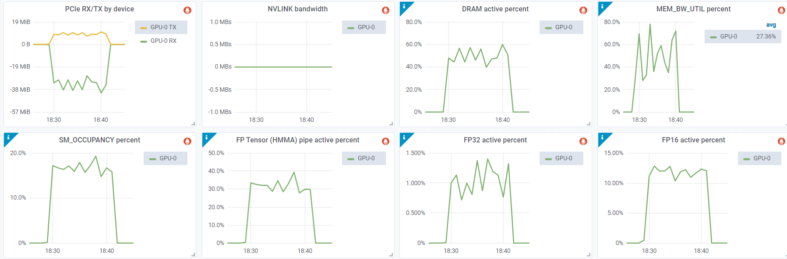

# Troubleshooting NVIDIA GPUs

## Glossary

- DBE: Double Bit ECC Error
- DCGM: (NVIDIA) Data Center GPU Manager
- ECC: Error-Correcting Code
- FB: Frame Buffer
- SBE: Single Bit ECC Error
- SDC: Silent Data Corruption

## Xid Errors

No hardware is perfect, sometimes due to the manufacturing problems or due to tear and wear (especially because of exposure to high heat), GPUs are likely to encounter various hardware issues. A lot of these issues get corrected automatically without needing to really understand what's going on. If the application continues running usually there is nothing to worry about. If the application crashes due to a hardware issue it's important to understand why this is so and how to act on it.

A normal user who uses a handful of GPUs is likely to never need to understand GPU-related hardware issues, but if you come anywhere close to massive ML training where you are likely to use hundreds to thousands of GPUs it's certain that you'd want to understand about different hardware issues.

In your system logs you are likely to see occasionally Xid Errors like:

```
NVRM: Xid (PCI:0000:10:1c): 63, pid=1896, Row Remapper: New row marked for remapping, reset gpu to activate.
```

To get those logs one of the following ways should work:
```
sudo grep Xid /var/log/syslog
sudo dmesg -T | grep Xid
```

Typically, as long as the training doesn't crash, these errors often indicate issues that automatically get corrected by the hardware.

The full list of Xid Errors and their interpretation can be found [here](https://docs.nvidia.com/deploy/xid-errors/index.html).

You can run `nvidia-smi -q` and see if there are any error counts reported. For example, in this case of Xid 63, you will see something like:

```
Timestamp                                 : Wed Jun  7 19:32:16 2023
Driver Version                            : 510.73.08
CUDA Version                              : 11.6

Attached GPUs                             : 8
GPU 00000000:10:1C.0
    Product Name                          : NVIDIA A100-SXM4-80GB
    [...]
    ECC Errors
        Volatile
            SRAM Correctable              : 0
            SRAM Uncorrectable            : 0
            DRAM Correctable              : 177
            DRAM Uncorrectable            : 0
        Aggregate
            SRAM Correctable              : 0
            SRAM Uncorrectable            : 0
            DRAM Correctable              : 177
            DRAM Uncorrectable            : 0
    Retired Pages
        Single Bit ECC                    : N/A
        Double Bit ECC                    : N/A
        Pending Page Blacklist            : N/A
    Remapped Rows
        Correctable Error                 : 1
        Uncorrectable Error               : 0
        Pending                           : Yes
        Remapping Failure Occurred        : No
        Bank Remap Availability Histogram
            Max                           : 639 bank(s)
            High                          : 1 bank(s)
            Partial                       : 0 bank(s)
            Low                           : 0 bank(s)
            None                          : 0 bank(s)
[...]
```

Here we can see that Xid 63 corresponds to:

```
ECC page retirement or row remapping recording event
```

which may have 3 causes: HW Error / Driver Error / FrameBuffer (FB) Corruption

This error means that one of the memory rows is malfunctioning and that upon either reboot and/or a gpu reset one of the 640 spare memory rows (in A100) will be used to replace the bad row. Therefore we see in the report above that only 639 banks remain (out of 640).

The Volatile section of the `ECC Errors` report above refers to the errors recorded since last reboot/GPU reset. The Aggregate section records the same error since the GPU was first used.

Now, there are 2 types of errors - Correctable and Uncorrectable. The correctable one is a Single Bit ECC Error (SBE) where despite memory being faulty the driver can still recover the correct value. The uncorrectable one is where more than one bit is faulty and it's called Double Bit ECC Error (DBE). Typically, the driver will retire whole memory pages if 1 DBE or 2 SBE errors occur at the same memory address. For full information see [this document](https://docs.nvidia.com/deploy/dynamic-page-retirement/index.html)

A correctable error will not impact the application, a non-correctable one will crash the application. The memory page containing the uncorrectable ECC error will be blacklisted and not accessible until the GPU is reset.

If there are page scheduled to be retired you will see something like this in the output of `nvidia-smi -q`:

```
    Retired pages
        Single Bit ECC             : 2
        Double Bit ECC             : 0
        Pending Page Blacklist    : Yes
```

Each retired page decreases the total memory available to applications. But the maximum amount of pages retired amounts to only 4MB in total, so it doesn't reduce the total available GPU memory by much.

To dive even deeper into the GPU debugging, please refer to [this document](https://docs.nvidia.com/deploy/gpu-debug-guidelines/index.html) - it includes a useful triage chart which helps to determine when to RMA GPUs. This document has additional information about Xid 63-like errors

For example it suggests:

> If associated with XID 94, the application that encountered the error needs to be restarted. All other applications on the system can keep running as is until there is a convenient time to reboot for row remapping to activate.
> See below for guidelines on when to RMA GPUs based on row remapping failures.

If after a reboot the same condition occur for the same memory address, it means that memory remapping has failed and Xid 64 will be emitted again. If this continues it means you have a hardware issue that can't be auto-corrected and the GPU needs to RMA'ed.

At other times you may get Xid 63 or 64 and the application will crash. Which usually will generate additional Xid errors, but most of the time it means that the error was uncorrectable (i.e. it was a DBE sort of an error and then it'll be Xid 48).

As mentioned earlier to reset a GPU you can either simply reboot the machine, or run:

```
nvidia-smi -r -i gpu_id
```

where `gpu_id` is the sequential number of the gpu you want to reset, e.g. `0` for the first GPU. Without `-i` all GPUs will be reset.

### uncorrectable ECC error encountered

If you get an error:
```
CUDA error: uncorrectable ECC error encountered
```
as in the previous section, checking the output of `nvidia-smi -q` this time for `ECC Errors` entries will tell which GPU is the problematic one. But if you need to do a quick check in order to recycle a node if it has at least one GPU with this issue, you can just do this:

```
$ nvidia-smi -q | grep -i correctable | grep -v 0
            SRAM Uncorrectable            : 1
            SRAM Uncorrectable            : 5
```
On a good node, this should return nothing, as all counters should be 0. But in the example above we had one broken GPU - there were two entries because the full record was:

```
    ECC Errors
        Volatile
            SRAM Correctable              : 0
            SRAM Uncorrectable            : 1
            DRAM Correctable              : 0
            DRAM Uncorrectable            : 0
        Aggregate
            SRAM Correctable              : 0
            SRAM Uncorrectable            : 5
            DRAM Correctable              : 0
            DRAM Uncorrectable            : 0
```
The first entry is for `Volatile` (errors counted since the last time the GPU driver reload) and the second is for `Aggregate` (total errors counter for the whole life time of the GPU). In this example we see a Volatile counter for SRAM Uncorrectable errors to be 1 and for the life-time counter it's 5 - that is this is not the first time the GPU runs into this problem.

This typically would correspond to Xid 94 error (see: [Xid Errors](#xid-errors), most likely w/o Xid 48.

To overcome this issue as in the previous section, reset the problematic GPU:
```
nvidia-smi -r -i gpu_id
```
Rebooting the machine will have the same effect.

Now when it comes to Aggregate SRAM Uncorrectable errors, if you have more than 4, that's usually a reason to RMA that GPU.


## Running diagnostics

If you suspect one or mode NVIDIA GPUs are broken on a given node, `dcgmi` is a great tool to quickly find any bad GPUs.

NVIDIA® Data Center GPU Manager (DCGM) is documented [here](https://docs.nvidia.com/datacenter/dcgm/latest/user-guide/index.html) and can be downloaded from [here](https://github.com/NVIDIA/DCGM#quickstart).

Here is an example slurm script that will run very in-depth diagnostics (`-r 3`), which will take about 10 minutes to complete on an 8-GPU node:

```
$ cat dcgmi-1n.slurm
#!/bin/bash
#SBATCH --job-name=dcgmi-1n
#SBATCH --nodes=1
#SBATCH --ntasks-per-node=1
#SBATCH --cpus-per-task=96
#SBATCH --gres=gpu:8
#SBATCH --exclusive
#SBATCH --output=%x-%j.out

set -x -e
echo "START TIME: $(date)"
srun --output=%x-%j-%N.out dcgmi diag -r 3
echo "END TIME: $(date)"
```

Now to run it on specific nodes of choice:
```
sbatch --nodelist=node-115 dcgmi-1n.slurm
sbatch --nodelist=node-151 dcgmi-1n.slurm
sbatch --nodelist=node-170 dcgmi-1n.slurm
```
edit the nodelist argument to point to the node name to run.

If the node is drained or downed and you can't launch a slurm job using this node, just `ssh` into the node and run the command directly on the node:
```
dcgmi diag -r 3
```
If the diagnostics didn't find any issue, but the application still fails to work, re-run the diagnostics with level 4, which will now take more than 1 hour to complete:
```
dcgmi diag -r 4
```

footnote: apparently silent data corruptions (SDC) can only be detected with `dcgmi diag -r 4` and even then some might be missed. This problem happens occasionally and you may not even be aware that your GPU is messing up the `matmul` at times. I'm pretty sure we had this happen to us, as we were getting weird glitches during training and I spent many days with the NVIDIA team diagnosing the problem, but we failed to do so - eventually the problem disappeared probably because the bad GPU(s) got replaced due to reported failures.

For example, if you run into a repeating Xid 64 error it's likely that the diagnostics report will include:

```
+---------------------------+------------------------------------------------+
| Diagnostic                | Result                                         |
+===========================+================================================+
|-----  Deployment  --------+------------------------------------------------|
| Error                     | GPU 3 has uncorrectable memory errors and row  |
|                           |  remappings are pending                        |
```

so you now know to RMA that problematic GPU, if remapping fails.

But, actually, I found that most of the time `-r 2` already detects faulty GPUs. And it takes just a few minutes to complete. Here is an example of the `-r 2` output on a faulty node:

```
| GPU Memory                | Pass - GPUs: 1, 2, 3, 4, 5, 6, 7               |
|                           | Fail - GPU: 0                                  |
| Warning                   | GPU 0 Thermal violations totaling 13.3 second  |
|                           | s started at 9.7 seconds into the test for GP  |
|                           | U 0 Verify that the cooling on this machine i  |
|                           | s functional, including external, thermal mat  |
|                           | erial interface, fans, and any other componen  |
|                           | ts.
```

The `dcgmi` tool contains various other levels of diagnostics, some of which complete in a matter of a few minutes and can be run as a quick diagnostic in the epilogue of SLURM jobs to ensure that the node is ready to work for the next SLURM job, rather than discovering that after the user started their job and it crashed.

When filing an RMA report you will be asked to run `nvidia-bug-report` script, the output of which you will need to submit with the RMA request.

I usually save the log as well for posterity using one of:
```
dcgmi diag -r 2 | tee -a dcgmi-r2-`hostname`.txt
dcgmi diag -r 3 | tee -a dcgmi-r3-`hostname`.txt
dcgmi diag -r 4 | tee -a dcgmi-r4-`hostname`.txt
```

## How to get the VBIOS info

GPU VBIOS version might be important when researching issues. Let's add the name and bus id to the query, we get:

```
$ nvidia-smi --query-gpu=gpu_name,gpu_bus_id,vbios_version --format=csv
name, pci.bus_id, vbios_version
NVIDIA H100 80GB HBM3, 00000000:04:00.0, 96.00.89.00.01
[...]
NVIDIA H100 80GB HBM3, 00000000:8B:00.0, 96.00.89.00.01
```

Hint: to query for dozens of other things, run:
```
nvidia-smi --help-query-gpu
```

## How to check if your GPU's PCIe generation is supported

Check the PCIe bandwidth reports from the system's boot messages:

```
$ sudo dmesg | grep -i 'limited by'
[   10.735323] pci 0000:04:00.0: 252.048 Gb/s available PCIe bandwidth, limited by 16.0 GT/s PCIe x16 link at 0000:01:00.0 (capable of 504.112 Gb/s with 32.0 GT/s PCIe x16 link)
[...]
[   13.301989] pci 0000:8b:00.0: 252.048 Gb/s available PCIe bandwidth, limited by 16.0 GT/s PCIe x16 link at 0000:87:00.0 (capable of 504.112 Gb/s with 32.0 GT/s PCIe x16 link)
```

In this example, as PCIe 5 spec is 504Gbps, you can see that on this node only half of the possible bandwidth is usable, because the PCIe switch is gen4. For PCIe specs see [this](../../../network#pcie).

Since most likely you have [NVLink](../../../network#nvlink) connecting the GPUs to each other, this shouldn't matter for GPU to GPU comms, but it'd slow down any data movement between the GPU and the host, as the data speed is limited by the speed of the slowest link.


## How to check error counters of NVLink links

If you're concerned your NVLink malfunctions you can check its error counters:
```
$ nvidia-smi nvlink -e
GPU 0: NVIDIA H100 80GB HBM3 (UUID: GPU-abcdefab-cdef-abdc-abcd-abababababab)
         Link 0: Replay Errors: 0
         Link 0: Recovery Errors: 0
         Link 0: CRC Errors: 0

         Link 1: Replay Errors: 0
         Link 1: Recovery Errors: 0
         Link 1: CRC Errors: 0

         [...]

         Link 17: Replay Errors: 0
         Link 17: Recovery Errors: 0
         Link 17: CRC Errors: 0
```

Another useful command is:
```
$ nvidia-smi nvlink --status
GPU 0: NVIDIA H100 80GB HBM3 (UUID: GPU-abcdefab-cdef-abdc-abcd-abababababab)
         Link 0: 26.562 GB/s
         [...]
         Link 17: 26.562 GB/s
```
this one tells you the current speed of each link

Run `nvidia-smi nvlink -h` to discover more features (reporting, resetting counters, etc.).


## How to detect if a node is missing GPUs

If you got a new VM, there are odd cases where there is less than expected number of GPUs. Here is how you can quickly test you have got 8 of them:

```
cat << 'EOT' >> test-gpu-count.sh
#!/bin/bash

set -e

# test the node has 8 gpus
test $(nvidia-smi -q | grep UUID | wc -l) != 8 && echo "broken node: less than 8 gpus" && false
EOT
```
and then:

```
bash test-gpu-count.sh
```


## How to detect if you get the same broken node again and again

This is mostly relevant to cloud users who rent GPU nodes.

So you launched a new virtual machine and discovered it has one or more broken NVIDIA GPUs. You discarded it and launched a new and the GPUs are broken again.

Chances are that you're getting the same node with the same broken GPUs. Here is how you can know that.

Before discarding the current node, run and log:

```
$ nvidia-smi -q | grep UUID
    GPU UUID                              : GPU-2b416d09-4537-ecc1-54fd-c6c83a764be9
    GPU UUID                              : GPU-0309d0d1-8620-43a3-83d2-95074e75ec9e
    GPU UUID                              : GPU-4fa60d47-b408-6119-cf63-a1f12c6f7673
    GPU UUID                              : GPU-fc069a82-26d4-4b9b-d826-018bc040c5a2
    GPU UUID                              : GPU-187e8e75-34d1-f8c7-1708-4feb35482ae0
    GPU UUID                              : GPU-43bfd251-aad8-6e5e-ee31-308e4292bef3
    GPU UUID                              : GPU-213fa750-652a-6cf6-5295-26b38cb139fb
    GPU UUID                              : GPU-52c408aa-3982-baa3-f83d-27d047dd7653
```

These UUIDs are unique to each GPU.

When you then re-created your VM, run this command again - if the UUIDs are the same - you know you have the same broken GPUs.

To automate this process so that you always have this data as it'd be too late if you already rebooted the VM, add somewhere in your startup process this:

```
nvidia-smi -q | grep UUID > nvidia-uuids.$(hostname).$(date '+%Y-%m-%d-%H:%M').txt
```

You'd want to save the log file on some persistent filesystem for it to survive reboot. If you do not have one make it local and immediately copy to the cloud. That way it'll always be there when you need it.

Sometimes just rebooting the node will get new hardware. In some situations you get new hardware on almost every reboot, in other situations this doesn't happen. And this behavior may change from one provider to another.

If you keep on getting the same broken node - one trick to overcoming this is allocating a new VM, while holding the broken VM running and when the new VM is running - discarding the broken one. That way you will surely get new GPUs - except there is no guarantee they won't be broken as well. If the use case fits consider getting a static cluster where it's much easier to keep the good hardware.

This method is extra-crucial for when GPUs don't fail right away but after some use so it is non-trivial to see that there is a problem. Even if you reported this node to the cloud provider the technician may not notice the problem right away and put the bad node back into circulation. So if you're not using a static cluster and tend to get random VMs on demand you may want to keep a log of bad UUIDs and know you have got a lemon immediately and not 10 hours into the node's use.

Cloud providers usually have a mechanism of reporting bad nodes. Therefore other than discarding a bad node, it'd help yourself and other users to report bad nodes. Since most of the time users just discard the bad nodes, the next user is going to get them. I have seen users getting a very high percentage of bad nodes in some situations.


## How to get the real GPU utilization metrics

As explained [here](https://arthurchiao.art/blog/understanding-gpu-performance/) the `Volatile GPU-Util` column in the `nvidia-smi` output isn't really telling you the GPU Utilization. What it's telling you is the percentage of time during which one or more kernels were executing on the GPU. It's not telling you whether a single SM is being used or all of them. So even if you run a tiny `matmul` all the time, you may get a a very high gpu util, while most of the GPU isn't doing anything.

footnote: I have seen GPU util column showing 100% on all gpus when one GPU would stop responding and then whole machinery was blocked waiting for that gpu to respond. Which is how I discovered that it couldn't be showing the real GPU utilization in the first place.

What you want to measure instead is GPU's utilization of the available capacity, otherwise known as "saturation". Alas, this information isn't provided by `nvidia-smi`. In order to get this information you need to install [dcgm-exporter](https://github.com/NVIDIA/dcgm-exporter) (which in turn currently requires a recent golang and DCGM (`datacenter-gpu-manager`) and a root access).

Please note that this tool works only high-end data center NVIDIA GPUs, so if you have a consumer level GPU it won't work.

After installing the prerequisites I built the tool:
```
git clone https://github.com/NVIDIA/dcgm-exporter.git
cd dcgm-exporter
make binary
```

And then I was able to get the "real" utilization metrics described in the article with this `dcgm-exporter` config file:

```
$ cat << EOT > dcp-metrics-custom.csv
DCGM_FI_PROF_SM_OCCUPANCY,       gauge, The ratio of number of warps resident on an SM.
DCGM_FI_PROF_PIPE_TENSOR_ACTIVE, gauge, Ratio of cycles the tensor (HMMA) pipe is active.
DCGM_FI_PROF_PIPE_FP16_ACTIVE,   gauge, Ratio of cycles the fp16 pipes are active.
DCGM_FI_PROF_PIPE_FP32_ACTIVE,   gauge, Ratio of cycles the fp32 pipes are active.
EOT
```

Then I launched the daemon (root is required):
```
$ sudo cmd/dcgm-exporter/dcgm-exporter -c 500 -f dcp-metrics-custom.csv
[...]
INFO[0000] Starting webserver
INFO[0000] Listening on                                  address="[::]:9400"
```

`-c 500` refreshes every 0.5sec

and now I was able poll it via:
```
watch -n 0.5 "curl http://localhost:9400/metrics"
```
by running it in one console, and launching a GPU workload in another console. The last column of the output is the utilization of these metrics (where `1.0 == 100%`).

`etc/dcp-metrics-included.csv` from the repo contains all the available metrics, so you can add more metrics.

This is a quick way of doing that, but the intention is to use it with [Prometheus](https://prometheus.io/) which will give you nice charts. E.g. the article included an example where you can see the SM occupancy, Tensor core, FP16 and FP32 Core utilization in the second row of the charts:



([source](https://arthurchiao.art/blog/understanding-gpu-performance/))

For completion here is an example from the same article showing a 100% gpu util with a CUDA kernel that is doing absolutely nothing compute-wise other than occupying a single Streaming Multiprocessor (SM):

```
$ cat << EOT > 1_sm_kernel.cu
__global__ void simple_kernel() {
    while (true) {}
}

int main() {
    simple_kernel<<<1, 1>>>();
    cudaDeviceSynchronize();
}
EOT
```

Let's compile it:
```
nvcc 1_sm_kernel.cu -o 1_sm_kernel
```
And now run it in console A:
```
$ ./1_sm_kernel
```
and in console B:
```
$ nvidia-smi
Tue Oct  8 09:49:34 2024
+-----------------------------------------------------------------------------------------+
| NVIDIA-SMI 550.90.12              Driver Version: 550.90.12      CUDA Version: 12.4     |
|-----------------------------------------+------------------------+----------------------+
| GPU  Name                 Persistence-M | Bus-Id          Disp.A | Volatile Uncorr. ECC |
| Fan  Temp   Perf          Pwr:Usage/Cap |           Memory-Usage | GPU-Util  Compute M. |
|                                         |                        |               MIG M. |
|=========================================+========================+======================|
|   0  NVIDIA A100 80GB PCIe          Off |   00000000:01:00.0 Off |                    0 |
| N/A   32C    P0             69W /  300W |     437MiB /  81920MiB |    100%      Default |
|                                         |                        |             Disabled |
```

You can see the `100%` GPU-Util. So here 1 SM is used whereas A100-80GB PCIe has 132 SMs! And it's not even doing any compute as it just runs an infinite loop of doing nothing.
