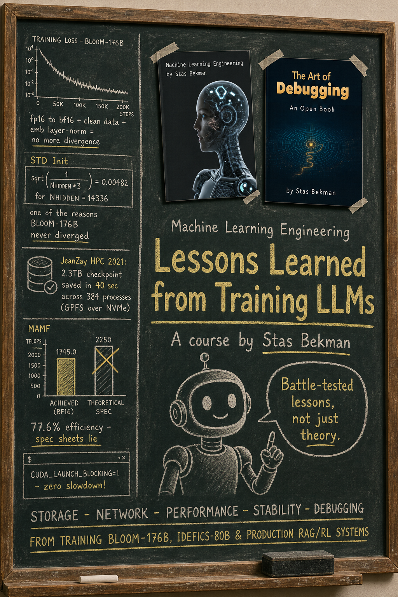

# Lessons Learned from Training LLMs (a course)

A curated collection of real-world "battle stories" and their resolutions, based on two open books by Stas Bekman:

- [Machine Learning Engineering (MLE)](../../README.md)
- [The Art of Debugging (AoD)](https://github.com/stas00/the-art-of-debugging)

Each item below is a hard-won lesson from actually training and operating large language/image models at scale, along with the hardware, storage, network, and debugging surprises that came with them:

- BLOOM-176B (2022)
- IDEFICS-80B (2023)
- Production RAG/RL systems at Contextual.AI (2024)
- Various Arctic Training open source work at Snowflake (2025-2026)

Each lesson's bold headline is the entry point, and the supporting facts underneath it are broken out as scannable bullets instead of a flowing paragraph, so you can skim the "what/why/how" quickly and still drop into the link for the full story.

This is meant to be read as a course: read the headlines to identify areas of interest, skim the sub-bullets for the reasoning, and if more details are wanted, follow the read-more links to dive into the details, scripts, and benchmarks.

You can take it as a self-guided course, or teach it to others yourself!

## Chapters

<!-- no toc -->
1. [Storage and File Systems](#storage-and-file-systems)
2. [Network and Interconnects](#network-and-interconnects)
3. [Training Performance and Throughput](#training-performance-and-throughput)
4. [DataLoaders](#dataloaders)
5. [Fault Tolerance and Reliability](#fault-tolerance-and-reliability)
6. [Training Stability](#training-stability)
7. [Compute, Accelerators and Memory](#compute-accelerators-and-memory)
8. [Cloud Providers and Procurement](#cloud-providers-and-procurement)
9. [Debugging Methodology](#debugging-methodology)

## Storage and File Systems

- **Fast parallel storage is a game changer for fast model checkpointing.**
  - Distributed parallel file systems like GPFS and WekaIO let hundreds to thousands of clients hit the same storage at once without creating hotspots - the difference this makes is dramatic.
  - **Case in point:** at JeanZay HPC (2021), a 2.3TB checkpoint was written in parallel across 384 processes in just 40 seconds, because the cluster ran GPFS over NVMe drives.
  - The gap between "GPFS over NVMe" and "a generic cloud NFS mount" can be many multiples in wall-clock time.
  - **Takeaway:** benchmark your specific file system for your specific workload to know the overheads.

  📖 [Which file system to choose](../../storage/README.md#which-file-system-to-choose)

- **Slow shared storage silently kills developer productivity, not just training throughput.**
  - On GCP's Zonal FileStore over NFS, a plain `python -c "import torch"` took 20 seconds uncached (versus ~2 seconds once cached), and installing a conda environment with a handful of prebuilt packages could take 20-30 minutes.
  - This kind of slowdown doesn't show up in a training-throughput benchmark at all, but it grinds down every developer, every day, multiplied across the whole team.
  - **The fix:** run a "perception benchmark" (timed `import torch`, `conda create`, `git status`, `pytest --collect-only`) against any storage solution before committing to it, comparing it to a local NVMe baseline.
  - If a proposed shared filesystem is only 2x faster than what you have, it's probably not worth switching - aim for something like 5-10x closer to local NVMe speeds before it stops being a daily source of frustration.
  - Start using `uv` - 5-50x faster than `pip install`.

  📖 [Which file system to choose](../../storage/README.md#which-file-system-to-choose)

- **Python's tens-of-thousands of tiny files can exhaust inodes long before you run out of actual disk space.**
  - If a filesystem partition uses a large block size (e.g. 16MiB, common for GPFS partitions optimized for big files) but your files average 16KiB, you waste up to 1,024x the space per file - and, more importantly, chew through the inode budget instead of the byte budget.
  - This is exactly what happened at JeanZay HPC: conda installs tens of thousands of tiny 4KiB-ish files per environment, so the team kept running out of inodes on normal GPFS partitions and had to request a dedicated partition just for conda environments.
  - **The fix:** keep at least two differently-tuned partitions - a small (4-8KiB) block size for millions of tiny files (venvs, package caches), and a large (2-16MiB) block size for a few huge files (checkpoints, datasets). Modern GPFS sub-blocks can also help by packing tiny files together.
  - Always check `df -i` alongside `df -h`, since a partition can report plenty of free space while being completely out of usable inodes.

  📖 [File Block size](../../storage/README.md#file-block-size)

- **Dataloading directly from cloud storage during training is painful and should be avoided if at all possible.**
  - During IDEFICS-80B training there wasn't enough local disk space for the multi-TB multimodal dataset, so the team had to stream from cloud storage - and it took many weeks of effort trying to make that solution robust, without ever quite getting there.
  - **The core problem:** the streaming Dataloader at that time didn't preserve the `DataSampler`'s RNG state across resumes, so every crash-and-resume cycle either skipped or repeated data - the training never got a single clean epoch of genuinely unique data.
  - **Lesson:** prefer having enough local disk for dataloading, and only offload checkpoints to the cloud asynchronously (via crontab or a SLURM job), always keeping the last couple of checkpoints locally for a fast resume.
  - If you must stream from the cloud, make sure your specific solution can resume exactly - without losing or repeating data, and without needing an enormous number of local DataLoader worker processes.

  📖 [Local storage beats cloud storage](../../storage/README.md#local-storage-beats-cloud-storage)

## Network and Interconnects

- **Always double check whether a bandwidth number is unidirectional or bidirectional (duplex) before comparing it to a measurement.**
  - Most benchmarking tools report unidirectional bandwidth, but vendor marketing nearly always prefers the duplex number, since it's roughly 2x bigger and looks more impressive.
  - **Rule of thumb:** if your measured bandwidth comes out to around 40% of the advertised spec, the advertised number was probably duplex - halve it, and your real efficiency is a common ~80%.
  - **Example:** on an A100 node advertised at 600GBps intra-node, a measured 235GBps looked like a disappointing 40% efficiency, until it was compared against the correct 300GBps unidirectional spec (~80%).
  - The same pattern repeats on H200 today: NVLink is advertised at 900GBps (duplex), but an all-reduce benchmark reaching ~376GBps checks out nicely against the 450GBps unidirectional spec.

  📖 [Unidirectional vs Bidirectional (Duplex)](../../network/README.md#unidirectional-vs-bidirectional-duplex)

- **A slow inter-node network can force your entire training framework choice, not just your throughput ceiling.**
  - At JeanZay HPC, the Omni-Path interconnect was stuck at only 135Gbps.
  - That single fact forced the BLOOM-176B team onto Megatron-DeepSpeed (tensor + pipeline parallelism, which sends far less data over the wire) instead of the much simpler DeepSpeed ZeRO (which needs much higher bandwidth to shard optimizer states and gradients).
  - This kind of decision is nearly impossible to walk back once a multi-month training run is underway - network speed needs to be known and factored into your parallelism strategy at the very start of the project.
  - If you're stuck with a slow inter-node network, favor strategies that only exchange activations (pipeline/tensor parallelism) over ones that exchange full gradients and optimizer state (ZeRO-DP/FSDP).

  📖 [Omni-Path](../../network/README.md#omni-path)

- **Sometimes an all-reduce benchmark reports a number that seems to exceed the physical wire's theoretical maximum, and that's not a measurement bug - it's SHARP.**
  - On an H100 node, an intra-node NVLink 4.0 all-reduce reported 480GBps for a 4GiB payload - even though the unidirectional spec is "only" 450GBps.
  - **The explanation:** NVIDIA's SHARP protocol lets NCCL perform the reduction directly on network switch hardware. Once NCCL detects InfiniBand/NVSwitch SHARP support, it switches to the `NVLS` algorithm, which needs only `N+1` sends instead of the usual `2N`.
  - This also means the standard `busbw` calculation (which assumes the `2N` model) under-reports true efficiency once `NVLS`/SHARP kicks in - a number that looks "too good" is a smarter algorithm at work, not an instrumentation error.
  - You get the SHARP speedup automatically as long as a collective engages all 8 GPUs on the node (or a full multiple-of-8 group on NVL36/NVL72) and `NCCL_NVLS_ENABLE` isn't disabled.

  📖 [SHARP](../../network/README.md#sharp)

- **A shared inter-node network makes performance optimization nearly impossible, because you can't tell what changed - your code or your noisy neighbors.**
  - At JeanZay HPC, before BLOOM-176B, the exact same configuration produced meaningfully different throughput on every single run, simply because other users' jobs were sharing the same fabric at unpredictable intensity.
  - This is a dead end for serious tuning work: you can't attribute a throughput change to your own tweak if the ambient noise floor itself shifts by double digits between runs.
  - **The fix:** the team was granted an exclusive, isolated SLURM partition on the (then brand new) A100s just before the BLOOM-176B launch, at which point optimization work finally became tractable.
  - If you're doing serious pre-training performance work, insist on a dedicated, isolated network partition for the benchmarking phase.

  📖 [Shared internode network](../../network/README.md#shared-internode-network) + [Crucial reproducibility requirements](../../network/benchmarks/README.md#crucial-reproducibility-requirements)

## Training Performance and Throughput

- **Spec sheets provide unachievable numbers - always benchmark matmul on your own hardware.**
  - Theoretical peak TFLOPS assume perfectly-shaped matrices, no memory movement overhead, and boost clocks that hold indefinitely - none of which happens in real training.
  - **Example:** an NVIDIA B200 SXM may only reach ~1745.0 TFLOPS (BF16) out of a 2250 TFLOPS theoretical spec (~77.6% efficiency), and this number itself depends on the software stack version and exact matrix shapes.
  - This is why "Maximum Achievable Matmul FLOPS" (MAMF) exists as a metric distinct from the theoretical spec: it's obtained by brute-force searching matmul shapes on your actual hardware/software with `mamf-finder.py`, giving you the realistic ceiling to optimize against.
  - Once your measured training TFLOPS get close to your own MAMF number (not the theoretical peak), it's time to stop optimizing and start training.

  📖 [Maximum Achievable Matmul FLOPS comparison table](../../compute/accelerator/README.md#maximum-achievable-matmul-flops-comparison-table)

- **Throughput optimization is a journey with diminishing returns, not a fixed destination you arrive at instantly.**
  - During BLOOM-176B's tuning phase, the team started below 100 TFLOPS and, over a few weeks, worked up to 150 TFLOPS by launch - no single silver bullet, just accumulated smaller wins.
  - **Know when to stop:** once there was no more meaningful headroom relative to what similar setups achieved at the time (~155 TFLOPS ceiling for 80GB A100s in 2022), the team deliberately stopped optimizing and began training.
  - Budget explicit calendar time for this tuning phase before the real launch - treating it as an afterthought means either wasting compute at low efficiency for months, or endlessly delaying the launch trying to "perfect" the setup.

  📖 [TFLOPS as a performance metric](../../training/performance/README.md#tflops-as-a-performance-metric)

- **Global batch size ramp-up matters far more than intuition suggests, especially with Pipeline Parallelism.**
  - For BLOOM-176B, starting too small was disastrous: GBS=16 measured only 8 TFLOPS, because with Pipeline Parallelism a small GBS creates a large proportional "pipeline bubble" of idle GPU time.
  - The team instead started at GBS=192 (73 TFLOPS) and ramped up by 16 every ~9.77M samples, eventually reaching GBS=2048 at 150 TFLOPS.
  - **Why ramp at all:** early training is essentially random and doesn't benefit yet from large, highly-refined batches, so there's no point paying the pipeline-bubble cost of a small batch during that phase either.
  - If you use Pipeline Parallelism, benchmark your actual achieved TFLOPS at a few candidate starting GBS values before committing to a ramp schedule.

  📖 [Global Batch Size Ramp Up](../../training/hparams.md#global-batch-size-ramp-up)

## DataLoaders

- **Multiple DataLoaders in the same process can hang randomly, and the workaround may simply be to not use one of them.**
  - During BLOOM-176B, the training DataLoader ran fine with `num_workers=2`, but adding an evaluation DataLoader alongside it caused random hangs - a known class of long-unresolved PyTorch multi-worker-DataLoader bugs.
  - **The workaround:** set `num_workers=0` for the eval loader specifically (accepting slower, blocking IO since eval ran far less often), and eventually drop in-training eval entirely in favor of asynchronous lm-harness-style evaluation on saved checkpoints.
  - **Bonus:** removing the in-loop eval also sped up the main training loop, since it no longer shared resources with a second DataLoader at all.

  📖 [Asynchronous DataLoader](../../training/performance/README.md#asynchronous-dataloader)

- **Streaming DataLoaders can silently become your hard bottleneck if per-worker memory use is high and CPU RAM is limited.**
  - During IDEFICS-80B training, the streaming DataLoader for the multimodal dataset consumed huge, constantly-spiking memory per worker, and with only ~1TiB of CPU RAM per node the team couldn't spawn enough workers to keep the pipeline fed.
  - Unlike a GPU-memory bottleneck (which usually throws a clear error immediately), an under-provisioned DataLoader just quietly caps throughput below what the accelerators are capable of, without necessarily crashing anything.
  - There wasn't time to engineer a better solution, so the team finished the run accepting that DataLoader-bound ceiling.
  - If you use multimodal or otherwise memory-hungry streaming pipelines, budget CPU RAM headroom for DataLoader workers as carefully as you budget GPU memory for the model.

  📖 [Asynchronous DataLoader](../../training/performance/README.md#asynchronous-dataloader)

## Fault Tolerance and Reliability

- **Beware of newly minted GPUs: a fresh batch of accelerators often has a 3-10% failure rate, and it's worse for the earliest units of a brand-new GPU generation.**
  - This is a well-known enough pattern that burn-in practices exist to catch it before hardware reaches customers: OEMs typically run a 3-4 week burn-in, and cloud providers then run an additional 2-3 day acceptance test - though not every provider does this rigorously (or discloses whether they did).
  - **Standard practical response:** plan for spare/redundant nodes (5-10% extra isn't unreasonable), and make sure your scheduler can automatically drain and replace bad nodes without manual intervention.
  - Once you've spent weeks filtering good accelerators from bad ones, insist on a **fixed** allocation so those good nodes stay yours on reboot instead of going back into a shared pool.
  - It's worth explicitly asking any cloud provider how long, and how rigorously, your specific nodes were burned in before you took possession - "we burned them in" without a duration is not a useful answer.

  📖 [Always plan to have more nodes than needed](../../training/fault-tolerance/README.md#always-plan-to-have-more-nodes-than-needed) + [Accelerators need to be burned in](../../insights/how-to-choose-cloud-provider.md#accelerators-need-to-be-burned-in) + [Ensure you keep your good accelerators on reboot](../../insights/how-to-choose-cloud-provider.md#ensure-you-keep-your-good-accelerators-on-reboot)

- **Checkpoint overhead scales inversely with your IO speed.**
  - BLOOM-176B's checkpoints were fast: 2.3TB in 40 seconds, every ~3 hours across a ~3-month run - about 720 checkpoints and only ~8 total hours of overhead, a mere ~0.37% tax on wall-clock time.
  - The same cadence, run on IO that's 5x slower (a normal gap between premium and standard cloud storage tiers), balloons to roughly 2% of total training time - a genuinely significant cost at scale.
  - **The math:** measure your actual save duration, multiply by how many times you intend to save, and compare that total to your expected training duration.
  - If you must offload checkpoints off-node to the cloud, always keep the two most recent checkpoints locally for a fast resume, since the very latest one might be corrupted from a mid-save crash.

  📖 [Frequent checkpoint saving](../../training/fault-tolerance/README.md#frequent-checkpoint-saving)

- **Build a kill-switch, because SLURM has no concept of group job ownership and this becomes a real operational problem.**
  - In an HPC environment, if a colleague launches a long job (or a SLURM job array) and goes to sleep, you literally cannot stop or modify it without `sudo` access - SLURM's permission model is per-user, not per-team.
  - **BLOOM-176B's fix:** a file-poll kill-switch. The training loop checks for a specific file before each new iteration, and if found, saves a checkpoint and exits cleanly, letting *any* team member intervene.
  - An additional poll at the very start of `main()` means a long queued job array from a sleeping teammate can be "burned through" almost instantly, rather than each job running its full duration first.
  - Small amount of code, large amount of operational safety - worth building into any shared multi-user training setup from day one.

  📖 [Kill switch](../../training/fault-tolerance/README.md#kill-switch)

- **Watch the watchers: a scheduled job-status watchdog is what actually catches "the training silently stopped running and nobody noticed."**
  - During BLOOM-176B, a `slurm-status.py` script ran roughly hourly (via crontab-emulation on SLURM, since real `crontab` usually isn't available there) and checked whether the named job was running or at least queued.
  - If neither condition held, it emailed an alert and also piped the check into the main training log for a paper trail.
  - This costs almost nothing to run, and it catches an entire category of expensive failures (hours or days of silently-idle compute) that would otherwise only surface when a human happened to check manually.
  - **Principle:** don't just build the training loop - build the thing that watches the training loop.

  📖 [Is-job-running watchdog](../../training/fault-tolerance/README.md#is-job-running-watchdog)

- **Monitor disk usage (and inode usage) aggressively, because checkpoint-heavy training can eat storage far faster than intuition suggests.**
  - BLOOM-176B's checkpointing consumed ~18.4TB of disk *per day*, and on a shared cluster with other jobs also writing data, that burn rate can blow through a "should be plenty" allocation fast.
  - The `fs-watchdog.py` tool monitored both raw disk usage percentage *and* inode usage across every relevant partition, since these are two independent ways to run out of "space."
  - Alert thresholds need to be tuned per-partition, not set to a single blanket percentage - what matters is translating the percentage into "how many days of runway at my current daily burn rate."
  - This is what turns "we ran out of disk space at 3am and lost the run" into "we got an email three days ago and were able to add more storage in time."

  📖 [Low disk space alerts](../../training/fault-tolerance/README.md#low-disk-space-alerts)

- **80% can be the new 100% on some distributed filesystems, so `df` showing free space is not a reliable safety guarantee.**
  - Distributed storage is built from many physical disks (each typically only 0.3-2TB); if rebalancing isn't performed often enough, any single disk can hit 100% full and reject writes even while aggregate `df` reports a comfortable 80% used.
  - This precise failure mode was hit during IDEFICS-80B training, where 80% genuinely became the practical ceiling on that filesystem.
  - It varies by technology: Lustre is known to have this issue (80% reliable), GPFS providers claim they don't have it.
  - **Safe move:** ask your storage provider what percentage of nominal capacity they consider reliably usable, and provision with that real ceiling in mind.

  📖 [Low disk space alerts](../../training/fault-tolerance/README.md#low-disk-space-alerts)

- **Sometimes the right engineering decision is to work around a leak instead of chasing it to its root cause, especially under time pressure.**
  - During IDEFICS-80B, a slow CPU memory leak took multiple days to build up to an OOM crash - a timescale that makes root-causing painfully slow to iterate on.
  - Instead of halting training to hunt for the source, the team built an in-loop watchdog that monitored resident memory and voluntarily exited once a threshold was crossed, letting the next queued job resume with memory reclaimed.
  - **Concrete pattern:** check `psutil.virtual_memory().percent` (or the GPU equivalent via `torch.cuda.mem_get_info()` after `gc.collect()` + `torch.cuda.empty_cache()`) once per iteration, and exit early past a threshold - cheap insurance worth adding regardless of whether you currently suspect a leak.

  📖 [Dealing with slow memory leaks](../../training/fault-tolerance/README.md#dealing-with-slow-memory-leaks)

- **Handle forced preemption gracefully: know exactly how much runway your program needs to save-and-exit, and tell it that number up front.**
  - SLURM jobs on shared HPC clusters have hard time limits (a common one is ~20 hours, though BLOOM-176B's jobs ran up to 100 hours), and just letting the job get killed wastes steps since the last checkpoint.
  - **BLOOM-176B's Approach A** (via `--exit-duration-in-mins`): tell the program at launch exactly how many minutes it has. It starts an internal timer and checks before each iteration (via an `all_reduce`-synchronized flag across all ranks) whether the budget is exceeded - if so, it saves and exits cleanly before SLURM's hard kill.
  - **Sizing the budget:** know how long one iteration takes and how long a checkpoint save takes, sum those, then double for safety margin - exiting early costs nothing, exiting late costs the whole checkpoint.
  - **Approach B:** a signal-based approach (`--signal=B:USR1@<seconds>`, trapped directly or relayed through the launcher for `torchrun`/`accelerate`/`deepspeed`), useful when a fixed time budget can't be cleanly computed in advance.

  📖 [Approach A: tell the program at launch time when to start exiting](../../training/fault-tolerance/README.md#approach-a-tell-the-program-at-launch-time-when-it-should-start-the-exiting-process)

## Training Stability

- **Initialization std matters enormously for stability, and getting it wrong can make a large model simply unable to get past the first few thousand iterations.**
  - In the pre-BLOOM 104B experiments, the team couldn't break past early training until they realized Megatron-LM's default at that time `--init-method-std` of 0.02 was far too large for a model of that hidden size.
  - Two published formulas were considered: "Transformers without Tears" (`sqrt(2/(NHIDDEN*5))`) and the 530B paper (`sqrt(1/(NHIDDEN*3))`) - the team deliberately chose the smaller (530B) value as the more conservative option.
  - For BLOOM-176B's `NHIDDEN=14336`, that formula gives `std=0.00482` - a tiny, easy-to-get-wrong number that was one of the key reasons the 176B run never suffered a full divergence.
  - **Lesson:** initialization std should scale with hidden size via a published formula, not be copy-pasted as a fixed constant from a smaller model's config.

  📖 [STD Init](../../training/instabilities/README.md#std-init)

- **Learn from a failed training rather than just abandoning it: the pre-BLOOM 104B experiments' repeated divergence directly produced the recipe that made BLOOM-176B succeed.**
  - Those 104B attempts kept diverging early on, and post-mortem pointed to two suspects: fp16 (narrower dynamic range, prone to overflow) and training data with a lot of uncleaned web-scraped garbage.
  - For BLOOM-176B, the team changed three things at once: switched fp16 → bf16, used much cleaner data, and added an embedding layer-norm. The combination "made all the difference," yielding an almost perfectly smooth loss curve (one spike, recovered in 200 steps).
  - The point isn't just "use bf16" - a genuinely failed multi-months experiment, properly analyzed rather than written off, directly produced the fix for the next, larger attempt.

  📖 [A very failed training](../../training/instabilities/training-loss-patterns.md#a-very-failed-training)

## Compute, Accelerators and Memory

- **Coherent (unified) memory hardware has genuinely unpredictable behavior, and the fix is a driver-level mode switch, not a code change.**
  - On NVIDIA's coherent-memory platforms (DGX Station, DGX Spark, GH200, GB300), Linux can transparently borrow from GPU HBM when it runs out of CPU RAM - but not the reverse - and `nvidia-smi` may not even report this borrowing.
  - While tuning max sequence length for Qwen3-32B post-training on a DGX Station (optimizer states offloaded to CPU RAM), the team hit maddening, seemingly random alternation between CPU-OOM and GPU-OOM, depending on whatever background daemons happened to be running.
  - **The fix** was not a code change at all, but a system setting: switching from the default NUMA coherent memory mode to CDMM ("driver") mode via `/etc/modprobe.d/nvidia-openrm.conf` and a reboot, after which CPU and GPU memory stopped silently cross-borrowing.
  - If you see unexplained, seemingly non-deterministic OOMs on coherent-memory NVIDIA hardware, check the `CoherentGPUMemoryMode` setting before debugging your training script.

  📖 [Overcoming the coherent memory uncertain behavior](../../debug/pytorch.md#overcoming-the-coherent-memory-uncertain-behavior)

- **Cryptic async CUDA errors sometimes need the "debug" flag turned on permanently, and that flag can be free.**
  - CUDA is async by default, so by the time an error manifests, the program's context has already moved on - producing tracebacks that point nowhere useful, or NCCL messages that outright refuse to generate one.
  - `CUDA_LAUNCH_BLOCKING=1` forces synchronous execution, normally at a real performance cost, but it also means you finally get an accurate, in-context traceback when something breaks.
  - BLOOM-176B ran its *entire* training under this flag (because training would otherwise hang for an undiagnosed reason), and surprisingly saw zero measurable throughput impact.
  - **Lesson:** don't assume a debug flag is automatically a performance tax without measuring it for your specific case - it might also be the fix.

  📖 [Dealing with Async CUDA bugs](../../debug/pytorch.md#dealing-with-async-cuda-bugs)

- **Memory profilers catch real leaks that are otherwise nearly invisible in code review.**
  - While implementing a tricky custom `TiledMLP` `torch.autograd.Function`, a leak was hiding in the implementation and only became obvious once rendered visually via PyTorch's memory profiler (`torch.cuda.memory._record_memory_history()` + `_dump_snapshot()`, viewed at pytorch.org/memory_viz).
  - Most allocations show up as bars that start and get freed. The leaked tensors showed up as continuous bars that started at one layer's forward pass and never ended, repeating on every subsequent layer.
  - You can click any bar to get the Python-level traceback to the exact allocating line, turning "there's a leak somewhere" into "line X in file Y" in minutes.
  - Beyond leak-hunting, the same tool is great for visually comparing how differently two implementations of "the same" algorithm use GPU memory over time (e.g. normal vs. CPU-offloaded activation checkpointing).

  📖 [PyTorch memory profiler](../../debug/pytorch.md#pytorch-memory-profiler)

- **Strategic, precisely-placed memory allocation tracing finds framework bugs too, not just bugs in your own code.**
  - Having explicit control over exactly *when* you sample GPU/CPU memory (a "sample now" call at strategic points, via a helper derived from DeepSpeed's `see_memory_usage`) can isolate a leak that a passive profiler might miss.
  - Using this technique, strategic tracing exposed a genuine leak inside PyTorch's own `all_gather_object` (since fixed, along with several other PyTorch-internal leaks found the same way).
  - **Nuance:** releasing a Python variable doesn't necessarily free the tensor immediately, since Python garbage collection runs on its own schedule. Call `gc.collect()` before sampling, or you'll see phantom "still allocated" numbers.
  - You must disable this tooling in production, as it will lead to bad performance.

  📖 [Strategic memory allocation tracing](../../debug/pytorch.md#strategic-memory-allocation-tracing)

- **Hyper-Threads can wreck network throughput on some hardware, and the only way to know is to actually benchmark both settings on your specific setup.**
  - On AWS p4 nodes, enabling Hyper-Threading (normally thought of as "free" extra CPU parallelism) dropped network throughput to roughly a quarter of its non-HT value.
  - Because of this specific, measured result, HT was deliberately kept disabled on that setup from then on, rather than left at the (often HT-enabled-by-default) SLURM configuration.
  - This is not universal in either direction - on some *other* setups the opposite is true, and disabling HT (`--hint=nomultithread`) is what degrades throughput.
  - **The only reliable path:** benchmark your actual workload's network throughput with HT on and off on your specific hardware, and pick whichever wins empirically.

  📖 [To enable Hyper-Threads or not](../../orchestration/slurm/performance.md#to-enable-hyper-threads-or-not)

## Cloud Providers and Procurement

- **A large support headcount on a call is not the same thing as real support, and this distinction is worth negotiating into a contract explicitly.**
  - The "we will do our best" pattern often means ten-plus people joining an escalation call with no actual ability to fix the problem - it can take weeks to months (faster with personal connections) to reach the two people who matter: one product manager, one responsible engineer.
  - Since the customer is legally obligated to keep paying and generally can't unilaterally break the contract, "best effort" is asymmetric unless the contract has specific, quantifiable delivery metrics per critical component.
  - **The most useful remedy to negotiate:** a pause on payment obligations until a defined problem is fixed - the one lever that actually creates an incentive to prioritize the fix.
  - Negotiate this *before* signing - after the fact you have essentially no leverage.

  📖 [We-will-do-our-best clause](../../insights/how-to-choose-cloud-provider.md#we-will-do-our-best-clause)

- **Accelerators are what fail, overwhelmingly - roughly 95% of hardware failures on a cluster are the accelerators themselves, not CPUs, storage, or network gear.**
  - This statistic should directly shape fault-tolerance planning: it's not worth equal engineering effort on storage/network resilience as on GPU-failure resilience.
  - **Practical response:** a fast, ideally fully automated replacement path (an API, not a support ticket), plus explicitly asking how many spares the provider keeps and how quickly they commit to swapping a failed unit.
  - Because instant replacement is rarely actually available, the standard mitigation is to pay for ~10% more nodes than needed, potentially using the extras for day-to-day dev work and as instant fallbacks when a production node fails.
  - This overprovisioning is real money, but cheap relative to a stalled multi-hundred-GPU job waiting on a support ticket.

  📖 [Dealing with accelerator failures](../../insights/how-to-choose-cloud-provider.md#dealing-with-accelerator-failures)

- **The network can quietly steal accelerator memory that you were sold and are paying for, without anyone telling you in advance.**
  - On one cloud, ~5GiB of *each* GPU's memory was already consumed by the provider's networking software before any user workload started - discovered only after signing, not disclosed during sales.
  - As accelerator memory grows (H200's 141GiB, B200's 180GiB usable), a fixed 5GiB overhead matters proportionally less, but on an 80GiB H100 it's a material fraction that can be the difference between a batch size fitting or OOMing.
  - **Actionable:** ask, before signing, exactly how much GPU memory is reserved by the provider's software stack versus how much is actually available, and get the number in writing.

  📖 [Does the network steal from the accelerator memory?](../../insights/how-to-choose-cloud-provider.md#does-the-network-steal-from-the-accelerator-memory)

- **Provider software stacks can trap you on old, unsupported OS versions, purely because their own internal tooling hasn't caught up.**
  - More than once, a provider's required drivers/orchestration/monitoring stack simply didn't support any Ubuntu version newer than some fairly old release, forcing an outdated OS underneath a modern ML stack.
  - Easy to overlook during evaluation (nobody demos "which Ubuntu version can I run") but becomes real friction later: security patches, kernel features, drivers, and some ML framework dependencies can quietly assume a newer base OS.
  - **Mitigation:** ask, during evaluation and not after signing, exactly which OS/software versions are supported and required, and get a commitment on how quickly newer versions will be supported.

  📖 [Up-to-date software/OS versions](../../insights/how-to-choose-cloud-provider.md#up-to-date-softwareos-versions)

## Debugging Methodology

From [The Art of Debugging](https://github.com/stas00/the-art-of-debugging):

- **Isolate a failing import or component into a one-liner rather than debugging it inside a large, slow-starting program.**
  - If a large program fails during startup (a failing `import torch`, or a model/tokenizer/config load failing on a missing HF auth token), extract exactly that operation into a standalone one-line command and reproduce it there directly.
  - This matters because fast debug cycles and small reproduction payloads are the two most important prerequisites for successful debugging - waiting ten minutes per attempt across thirty attempts means losing track of which hypothesis you actually tested.
  - One-liners, such as `python -c "import torch"`, are also atomic (searchable in shell history), trivially copy-pasteable to a remote machine, and easy to save as a file of reusable variations.
  - The same technique doubles as how you'd pre-download/cache a large model or dataset in parallel with other development work. `python -c 'import sys; from transformers import AutoTokenizer; AutoTokenizer.from_pretrained(sys.argv[1])' t5-small`

  📖 [The power of one-liner programs](https://github.com/stas00/the-art-of-debugging/blob/master/methodology/README.md#the-power-of-one-liner-programs)

- **Bisect to find the exact breaking commit rather than manually scanning through hundreds of commits by eye.**
  - Common scenario: pinned to a known-good release, upgraded to bleeding-edge `main` for a new feature, and something broke somewhere across hundreds of commits in between.
  - `git bisect` does a classic binary search: give it one known-good and one known-bad commit, test the midpoint, mark `good`/`bad`, and repeat - 1,024 candidate commits collapse to about 10 rounds of testing.
  - Complications have standard handles: `git bisect skip` for untestable commits, and custom terms (`--term-new=fixed --term-old=broken`) when hunting for a fix rather than a break.
  - Once it converges, the first-bad commit's GitHub page almost always links to the PR that introduced it - an immediate, informed place to ask for help.

  📖 [Finding a breaking commit by bisecting revisions](https://github.com/stas00/the-art-of-debugging/blob/master/methodology/README.md#finding-a-breaking-commit-by-bisecting-revisions)

- **Get a backtrace from a core file to turn a useless, huge traceback into an exact, actionable line of code.**
  - When a compiled extension (CUDA kernel, NCCL, any C/C++-backed library) segfaults, Python can't produce a meaningful exception at all - you're left with nothing, or an unreadable native dump.
  - **Fix:** `gdb -c /path/to/core /path/to/program` followed by `bt`, which walks the call stack at the moment of the crash and shows the exact source line. `bt full` additionally shows local variable values (e.g. a pointer showing `0x0` reveals it was dereferenced uninitialized).
  - For multi-threaded programs (essentially all serious PyTorch/CUDA programs), `thread apply all bt` shows every thread's stack, since the real root cause sometimes lives in a different thread than the one that crashed.
  - This is exactly how real PyTorch crash reports get root-caused, turning a massive native dump into one actionable line.

  📖 [Get the backtrace from the core file](https://github.com/stas00/the-art-of-debugging/blob/master/compiled-programs/README.md#get-the-backtrace-from-the-core-file)

- **Backtrace a live, hung process instead of waiting for it to crash or timeout on its own.**
  - Sometimes the problem is a deadlock, not a segfault - the process is alive but never making progress, so there's no crash event to trigger a core dump.
  - `gdb --pid=<pid>` attaches to an already-running process without restarting it, and `thread apply all bt` shows exactly what every thread is doing - precisely how a real PyTorch deadlock was once diagnosed.
  - If you want to preserve state for later analysis (or free resources immediately), `gcore <pid>` or `kill -ABRT <pid>` forces a core dump, though both also terminate the process.
  - Use this live-attach technique for "spinning" or fully-hung processes, versus the core-file technique above for processes that already crashed.
  - If it's hanging inside Python, `py-spy` is a lifesaver!

  📖 [Get the backtrace from the still running process](https://github.com/stas00/the-art-of-debugging/blob/master/compiled-programs/README.md#get-the-backtrace-from-the-still-running-process) + [py-spy](https://github.com/stas00/the-art-of-debugging/blob/master/pytorch/README.md#py-spy)

- **Run flaky or segfaulting tests directly under gdb rather than trying to reproduce the crash blind.**
  - For an intermittently-segfaulting `pytest` test, launch the whole invocation under gdb from the start (`gdb -ex r --args python -m pytest -sv tests/test_failing.py`) rather than trying to catch it separately afterward.
  - When it segfaults, gdb drops you right back at its prompt at the exact moment. `bt` (or `bt full`) works identically to the core-file case, followed by `c` to continue if desired.
  - This sidesteps the "but it didn't crash when I tried to reproduce it separately" frustration entirely.
  - Combined with the two backtrace techniques above, this is considered sufficient to diagnose roughly 95% of real-world native-level crashes in ML codebases.

  📖 [Run the program under gdb](https://github.com/stas00/the-art-of-debugging/blob/master/compiled-programs/README.md#run-the-program-under-gdb)

- **Missing symbols are very often a link-time or library-version problem, not a mysterious runtime bug - and `nm` lets you actually verify what's present.**
  - `undefined symbol: util_b` at runtime, despite the function existing in your codebase, is frequently caused by the wrong version of a shared library being loaded (e.g. via `LD_LIBRARY_PATH` pointing at an older build).
  - `nm ./your_program | grep symbol_name` shows whether a symbol is defined (`T`) or merely referenced-but-undefined (`U`) in a specific binary or library, turning a guess into a checkable fact.
  - Combined with `ldd` (which shows exactly which library files a binary actually resolved to), you can directly compare `nm` output across two "same-named" library builds and see that one has the symbol and the other doesn't.
  - This combination - `nm` for "does the symbol exist here" and `ldd` for "which file actually got loaded" - resolves the large majority of "missing symbol" runtime errors.

  📖 [nm](https://github.com/stas00/the-art-of-debugging/blob/master/compiled-programs/README.md#nm)

---

*All lessons are drawn from [Machine Learning Engineering](../../README.md) and [The Art of Debugging](https://github.com/stas00/the-art-of-debugging) by Stas Bekman, distributed under [CC BY-SA 4.0](../../LICENSE-CC-BY-SA).*
