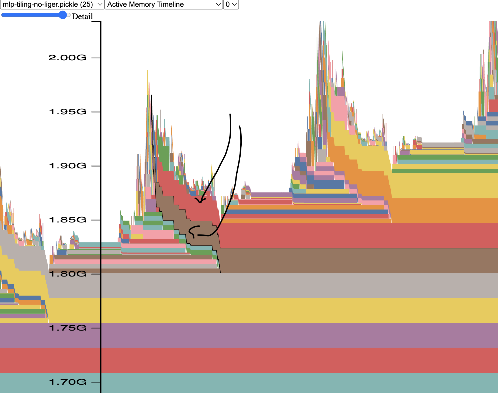
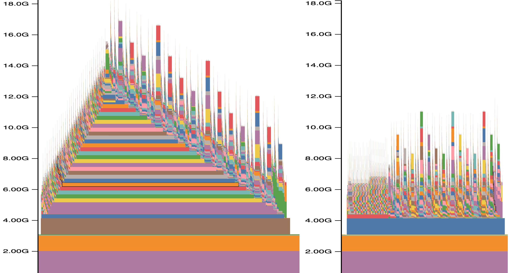
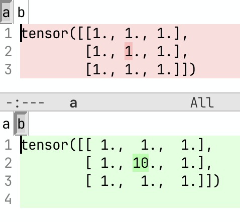

# Debugging PyTorch Programs

## Fast debug of PyTorch models

### Reducing the number of layers for large models

When debugging PyTorch workflows, as explained in [using small payload](https://github.com/stas00/the-art-of-debugging/blob/master/methodology/README.md#2-small-payload) you'd normally try to use tiny random models (see [here how to get and create those](#faster-debug-and-development-with-tiny-models-tokenizers-and-datasets)). But since some problems only appear at scale it's very likely you'd have to use the full-sized model, which may take a very long time to load and run until it gets to the point of interest, where problems appear.

Given the nature of ML model architectures, they typically use a sequence of identical layers that repeat one after another. Therefore, if a model has, say, 48 layers, you can shrink it to just 2 layers, which will dramatically speed up both the loading and running the code. Of course, the qualitative outcome will be bad, but we aren't concerned with quality if the workload hangs or breaks.

Therefore in this section we will discuss how to reduce the model's number of hidden layers from many to just 1-2. If the layers aren't identical (e.g. some MoE models alternate between 2 different block configurations) then ensure you include at least one variation of each. For the purpose of the following demonstrations we will use this MoE model [Qwen/Qwen3-30B-A3B-Instruct-2507](https://huggingface.co/Qwen/Qwen3-30B-A3B-Instruct-2507). We have 48 hidden layers there as can be seen from its [config file](https://huggingface.co/Qwen/Qwen3-30B-A3B-Instruct-2507/blob/main/config.json).

This model may have 2 alternating types of Transformer blocks, so we need to keep at least 2 layers. (`Qwen/Qwen3-Next-80B-A3B-Instruct` uses a full attention block only once every 4 layers so there you'd need at least 4 layers.)

The config entry that we want to change is [`num_hidden_layers`](https://huggingface.co/Qwen/Qwen3-30B-A3B-Instruct-2507/blob/e67ac5d/config.json#L24)

Let's first run a quick test to demonstrate that even just the model loading time can be much faster, before seeing the huge speedup in the compute time:

```bash
git clone https://huggingface.co/Qwen/Qwen3-30B-A3B-Instruct-2507
time python -c 'import sys; from transformers import AutoModelForCausalLM; \
AutoModelForCausalLM.from_pretrained(sys.argv[1])' ./Qwen3-30B-A3B-Instruct-2507
perl -pi -e 's|"num_hidden_layers": 48|"num_hidden_layers": 2|' Qwen3-30B-A3B-Instruct-2507/config.json
time python -c 'import sys; from transformers import AutoModelForCausalLM; \
AutoModelForCausalLM.from_pretrained(sys.argv[1])' ./Qwen3-30B-A3B-Instruct-2507
```

so here we clone the model locally and then measured how long it took to load the base model:
```
real    5m59.857s
user    128m28.088s
sys     16m33.861s
```
then we reduced the number of layers from 48 to 2 and repeated the model loading. This time we get:
```
real    0m20.398s
user    2m9.101s
sys     2m29.587s
```

Looking at the `real` entry (wallclock time) we have 6 minutes loading for the full model vs 20 seconds for the shrunk 2-layer model - that's 18x times faster and ~5.5 minutes of waiting time saved!

There are 3 ways to accomplish that.

In this discussion we presume you're using HF Transformers-based models, but the same methodology could be translated to other modeling frameworks.

#### 1. local clone with config edits

After finding the desired model on https://huggingface.co/, clone its git repo to the local disk, modify the `num_hidden_layers` entry in `config.json`, and then load the model from the local clone (same as we have just shown when measuring model loading time).

```bash
git clone https://huggingface.co/Qwen/Qwen3-30B-A3B-Instruct-2507
perl -pi -e 's|"num_hidden_layers": 48|"num_hidden_layers": 2|' Qwen3-30B-A3B-Instruct-2507/config.json
python -c 'import sys; from transformers import AutoModelForCausalLM; \
AutoModelForCausalLM.from_pretrained(sys.argv[1])' ./Qwen3-30B-A3B-Instruct-2507
```
Please make sure that you load the locally cloned version, that is:
```
- ... from_pretrained("Qwen/Qwen3-30B-A3B-Instruct-2507")
+ ... from_pretrained("./Qwen3-30B-A3B-Instruct-2507")
```

This approach is useful since you don't need to change the user-end code.

#### 2. editing the config object on the fly

The other even simpler approach is to hack the config object on the fly. This requires no local cloning and is probably the easiest solution, though it requires modifying the end user code:
```bash
python -c 'import sys; from transformers import AutoModelForCausalLM, AutoConfig; \
c=AutoConfig.from_pretrained(sys.argv[1]); c.num_hidden_layers=2; \
m=AutoModelForCausalLM.from_pretrained(sys.argv[1], config=c)' Qwen/Qwen3-30B-A3B-Instruct-2507
```

And since you will end up with an incomplete model which will generate random outputs anyway, you can also save the overhead of loading the original model weights and just create the model on the fly like so:

```bash
python -c 'import sys; from transformers import AutoModelForCausalLM, AutoConfig; \
c=AutoConfig.from_pretrained(sys.argv[1]); c.num_hidden_layers=2; \
m=AutoModelForCausalLM.from_config(c)' Qwen/Qwen3-30B-A3B-Instruct-2507
```

#### 3. hacking the architecture modeling code

This approach is most useful if you need to deal with multiple models of the same architecture and you don't want to modify the end user code.

First we clone HF Transformers and install its editable version:
```
git clone https://github.com/huggingface/transformers/tree/main/src/transformers
cd transformers
pip install -e .[dev]
```
Now we can tweak the code under `src/transformers` and it will be immediately visible to the Python environment that is being used.

Continuing the example of working with `Qwen/Qwen3-30B-A3B-Instruct-2507` model, we find the place where its architecture modeling code lives in the HF Transformers code base. For example, we can look at the `architectures` field in the [model's config](https://huggingface.co/Qwen/Qwen3-30B-A3B-Instruct-2507/blob/e67ac5d/config.json#L3), which gives us `Qwen3MoeForCausalLM`. We now find the Python module where it lives in the HF Transformers code base:

```bash
$ grep -Ir "class Qwen3MoeForCausalLM" src/transformers/models
src/transformers/models/qwen3_moe/modeling_qwen3_moe.py:class Qwen3MoeForCausalLM(Qwen3MoePreTrainedModel, GenerationMixin):
src/transformers/models/qwen3_moe/modular_qwen3_moe.py:class Qwen3MoeForCausalLM(MixtralForCausalLM):
```

So we know it's in `src/transformers/models/qwen3_moe/modeling_qwen3_moe.py` (we don't care for `modular_qwen3_moe.py` in this situation, since it's `modeling_qwen3_moe.py` that gets loaded).

Now we open `src/transformers/models/qwen3_moe/modeling_qwen3_moe.py` in the editor and search for `num_hidden_layers` usages to find where the layers are initialized, which in this case is here:

```python
class Qwen3MoeModel(Qwen3MoePreTrainedModel):
    def __init__(self, config: Qwen3MoeConfig):
        super().__init__(config)
        [...]
        self.layers = nn.ModuleList(
            [Qwen3MoeDecoderLayer(config, layer_idx) for layer_idx in range(config.num_hidden_layers)]
        )
```

So now we just hack the value of `num_hidden_layers` and we are done:
```python
class Qwen3MoeModel(Qwen3MoePreTrainedModel):
    def __init__(self, config: Qwen3MoeConfig):
        super().__init__(config)
        [...]
        config.num_hidden_layers = 2
        self.layers = nn.ModuleList(
            [Qwen3MoeDecoderLayer(config, layer_idx) for layer_idx in range(config.num_hidden_layers)]
        )
```
and now as long as this version of HF Transformers is devel-installed (`pip install -e .`) into the running Python environment `Qwen3MoeForCausalLM`-type of models will only use the first 2 layers as if it were the full model.

If you need to load the full model, but only run a few layers, then you can hack the loop over the layers in the model's `forward`. If the original code in `Qwen3MoeModel.forward` was:

```python
for decoder_layer in self.layers[: self.config.num_hidden_layers]):
    hidden_states = decoder_layer(...)
```
you can change to:
```python
KEEP_N_LAYERS = 2
for idx, decoder_layer in enumerate(self.layers[: self.config.num_hidden_layers]):
    # XXX: shortcut for much faster completion
    if idx+1 > KEEP_N_LAYERS: continue
    hidden_states = decoder_layer(...)
```


#### Additional Notes

When you load a pre-trained model while shortening its layers stack, you're going to see a flurry of warnings telling you that some weights have been ignored.

Also I'm reminding that you will end up with a model which will allow you to perform functional checks and tune ups - memory usage and performance, etc. It will produce garbage and if you measure the loss it'll be very high (though it shouldn't be `NaN`).

You can now measure performance with say 2 and 4 layers and tell how much overhead each layer takes from the difference and extrapolate this to what the full model will need.

Memory usage-wise, unless there is a memory leak, after the first layer finished running, subsequent layers shouldn't consume any additional CPU or GPU memory (other than peak memory) if activation checkpointing is not used and `torch.cuda` memory cache isn't flushed. If activation checkpointing is enabled, then expect each layer to consume the same additional amount of memory as the previous one (of the size of the checkpointed tensor).

#### Other shrink-the-stack use cases

You can apply a similar hack to other components that also have stacks of identical code-wise blocks. For example, you could reduce the number of attention heads and then the attention mechanism will run much faster (but of course producing garbage, which is fine most of the time when we focus on functional debugging) or skipping most attention blocks completely.

When I was debugging 15M sequence length training using [ALST](https://arxiv.org/abs/2506.13996) - I would only run self-attention in the last layer and then skip it in the previous layers - this reduced my testing time from hours to minutes, since very long sequence length using full self-attention has an O(2) quadratic nature with regards to sequence length it attends to.

Let's say we run only attention in the last layer:

In attention `__init__` we set a few flags, let's use `Qwen3MoeAttention`:
```python
    def __init__(self, config: Qwen3MoeConfig, layer_idx: int):
        super().__init__()
        self.skip_all_but_last_attention_debug_mode = True
        self.rotating_layer_counter = 0
```

and then in `Qwen3MoeAttention.forward`, we replace:
```python
attn_output, attn_weights = attention_interface((self, query_states, ...)
```

(note the `...` - most args were trimmed for this exemplification), with:
```python
import einops
if not self.skip_all_but_last_attention_debug_mode:
    attn_output, attn_weights = attention_interface(self, query_states, ...)
else:
    self.rotating_layer_counter = (self.rotating_layer_counter + 1) % self.num_hidden_layers
    # we detect the last layer by module counting since we know how many layers there are
    if self.rotating_layer_counter % self.num_hidden_layers == 0:
        attn_output, attn_weights = attention_interface(self, query_states, ...)
    else:
        # this feeds bogus data of the right shape connected to a graph - good enough for debug
        attn_output = einops.rearrange(query_states, "bs hc sl ... -> bs sl hcl ...")
        attn_weights = None
```
and, of course, install `pip install einops` for the above code to work.

### Faster Debug and Development with Tiny Models, Tokenizers and Datasets

If you're debugging problems and develop with full sized models and tokenizers you're likely not working in a very efficient way. Not only it's much more difficult to solve problem, the amount of waiting to get the program to restart and to get to the desirable point can be huge - and cumulatively this can be a huge drain on one's motivation and productivity, not talking about the resolution taking much longer, if at all.

The solution is simple:

**Unless you're testing the quality of a model, always use a tiny random model with potentially tiny tokenizer.**

Moreover, large models often require massive resources, which are typically expensive and can also can make a debugging process super complicated. For example any debugger can handle a single process, but if your model doesn't fit and require some sort of [parallelization](../training/model-parallelism) that requires multiple processes - most debuggers will either break or have issue giving you what you need. The ideal development environment is one process and a tiny model is guaranteed to fit on an even cheapest single smallest consumer GPU available. You could even use the free [Google Colab](https://colab.research.google.com/) to do development in a pinch if you have no GPUs around.

So the updated ML development mantra then becomes:

- the larger the model the better the final product generates
- the smaller the model the quicker the final product's training can be started

footnote: the recent research shows that larger isn't always better, but it's good enough to convey the importance of my communication.

Once your code is working, do switch to the real model to test the quality of your generation. But even in this case still try first the smallest model that produces a quality result. Only when you can see that the generation is mostly right use the largest model to validate if your work has been perfect.

#### Making a tiny model

Important: given their popularity and the well designed simple API I will be discussing HF [`transformers`](https://github.com/huggingface/transformers/) models. But the same principle can be applied to any other model.

TLDR: it's trivial to make a tiny HF `transformers` model:

1. Fetch the config object of a full size model
2. Shrink the hidden size and perhaps a few other parameters that contribute to the bulk of the model
3. Create a model from that shrunken config
4. Save this model. Done!

footnote: It's critical to remember that this will generate a random model, so don't expect any quality from its output.

footnote: These notes were written with HF Transformers models in mind. If you're using a different modeling library you may have to adapt some of these things.

Now let's go through the actual code and convert ["google/mt5-small"](https://huggingface.co/google/mt5-small/tree/main) into its tiny random counterpart.

```python
from transformers import MT5Config, MT5ForConditionalGeneration

mname_from = "google/mt5-small"
mname_very_small = "mt5-tiny-random"

config = MT5Config.from_pretrained(mname_from)

config.update(dict(
    d_model=64,
    d_ff=256,
))
print("new config", config)

very_small_model = MT5ForConditionalGeneration(config)
print(f"num of params {very_small_model.num_parameters()}")

very_small_model.save_pretrained(mname_very_small)
```

As you can see it's trivial to do. And you can make it even smaller if you don't need the hidden size to be at least 64. For example try 8 - you just need to make sure that the number of attention heads isn't larger than hidden size.

Also please note that you don't need any GPUs to do that and you could do this even on a huge 176B parameter model like [BLOOM-176B](https://huggingface.co/bigscience/bloom). Since you never load the actual original model, except its config object.

Before modifying the config you can dump the original parameters and choose to shrinks more dimensions. For example, using less layers makes it even smaller and easier to debug. So here is what you can do instead:

```
config.update(dict(
    d_model=64,
    d_ff=256,
    d_kv=8,
    num_layers=8,
    num_decoder_layers=8,
    num_heads=4,
    relative_attention_num_buckets=32,
))
```

The original ["google/mt5-small"](https://huggingface.co/google/mt5-small/tree/main) model file was 1.2GB. With the above changes (and vocab shrinking as explained in the following sections) we got it down to 126MB.

If you're dealing with a multi-level nested config, you will have to update each sub-level's config object separately. For example in [IDEFICS](https://huggingface.co/HuggingFaceM4/idefics-9b/blob/main/config.json) we have 1 main and 2 nested objects:
```
config
config.perceiver_config
config.vision_config
```
If you wanted to shrink this model you'd want to update `config` and `config.vision_config` with smaller values:
```
config.update(dict(
    hidden_size=64,
    intermediate_size=37,
    num_hidden_layers=5,
    num_attention_heads=4,
    max_position_embeddings=64,
    max_sequence_length=64,

))
# sub object needs to be updated directly
config.vision_config.update(dict(embed_dim=64))
```
See [idefics-make-tiny-model.py](tiny-scripts/idefics-make-tiny-model.py) for a fully working script (I didn't bother adding the vocab shrinking as I'm just demonstrating how to update nested config objects here).

We can then further halve our tiny model size by converting the model to fp16 or bf16 (depending on the goal) before saving it:

```
very_small_model.half() # convert to fp16
#very_small_model.bfloat16() # convert to bf16
very_small_model.save_pretrained(mname_very_small)
```
this takes us to 64MB file.

So you could stop here and your program will start much much faster already.

And there is one more step you could do to make it truly tiny.

What we haven't shrunken so far is the vocabulary dimension so 64x250k (hidden*vocab) is still huge. Granted this 250k vocab model is not typical - normally models models' vocab is ~30-50k, but even 30k is a lot if we want the model to be truly tiny.

So next we will look into various techniques to shrinking the tokenizer, as it defines our vocab size.

#### Making a tiny tokenizer

This task varies between a relatively simple procedure and a much more complex workout depending on the underlying tokenizer.

The following recipes have come from a few awesome tokenizer experts at HuggingFace, which I then adapted to my needs.

You probably don't really need to understand how these work until you actually need them, therefore if you're reading this for the first time you can safely jump over these to [Making a tiny model with a tiny tokenizer](#making-a-tiny-model-with-a-tiny-tokenizer).

##### Anthony Moi's version

[Anthony Moi](https://github.com/n1t0)'s tokenizer shrinker:

```python
import json
from transformers import AutoTokenizer
from tokenizers import Tokenizer

vocab_keep_items = 5000
mname = "microsoft/deberta-base"

tokenizer = AutoTokenizer.from_pretrained(mname, use_fast=True)
assert tokenizer.is_fast, "This only works for fast tokenizers."
tokenizer_json = json.loads(tokenizer._tokenizer.to_str())
vocab = tokenizer_json["model"]["vocab"]
if tokenizer_json["model"]["type"] == "BPE":
    new_vocab = { token: i for token, i in vocab.items() if i < vocab_keep_items }
    merges = tokenizer_json["model"]["merges"]
    new_merges = []
    for i in range(len(merges)):
        a, b = merges[i].split()
        new_token = "".join((a, b))
        if a in new_vocab and b in new_vocab and new_token in new_vocab:
            new_merges.append(merges[i])
    tokenizer_json["model"]["merges"] = new_merges
elif tokenizer_json["model"]["type"] == "Unigram":
    new_vocab = vocab[:vocab_keep_items]
elif tokenizer_json["model"]["type"] == "WordPiece" or tokenizer_json["model"]["type"] == "WordLevel":
    new_vocab = { token: i for token, i in vocab.items() if i < vocab_keep_items }
else:
    raise ValueError(f"don't know how to handle {tokenizer_json['model']['type']}")
tokenizer_json["model"]["vocab"] = new_vocab
tokenizer._tokenizer = Tokenizer.from_str(json.dumps(tokenizer_json))
tokenizer.save_pretrained(".")
```

I later discovered that gpt2 seems to have a special token `"<|endoftext|>"` stashed at the very end of the vocab, so it gets dropped and code breaks. So I hacked it back in with:
```python
if "gpt2" in mname:
        new_vocab = { token: i for token, i in vocab.items() if i < vocab_keep_items-1 }
        new_vocab["<|endoftext|>"] = vocab_keep_items-1
    else:
        new_vocab = { token: i for token, i in vocab.items() if i < vocab_keep_items }
```


##### Lysandre Debut's version

[Lysandre Debut](https://github.com/LysandreJik)' shrinker using `train_new_from_iterator`:

```python
from transformers import AutoTokenizer

mname = "microsoft/deberta-base" # or any checkpoint that has a fast tokenizer.
vocab_keep_items = 5000

tokenizer = AutoTokenizer.from_pretrained(mname)
assert tokenizer.is_fast, "This only works for fast tokenizers."
tokenizer.save_pretrained("big-tokenizer")
# Should be a generator of list of texts.
training_corpus = [
    ["This is the first sentence.", "This is the second one."],
    ["This sentence (contains #) over symbols and numbers 12 3.", "But not this one."],
]
new_tokenizer = tokenizer.train_new_from_iterator(training_corpus, vocab_size=vocab_keep_items)
new_tokenizer.save_pretrained("small-tokenizer")
```
but this one requires a training corpus, so I had an idea to cheat and train the new tokenizer on its own original vocab which gave me:

```python
from transformers import AutoTokenizer

mname = "microsoft/deberta-base"
vocab_keep_items = 5000

tokenizer = AutoTokenizer.from_pretrained(mname)
assert tokenizer.is_fast, "This only works for fast tokenizers."
vocab = tokenizer.get_vocab()
training_corpus = [ vocab.keys() ] # Should be a generator of list of texts.
new_tokenizer = tokenizer.train_new_from_iterator(training_corpus, vocab_size=vocab_keep_items)
new_tokenizer.save_pretrained("small-tokenizer")
```

which is almost perfect, except it now doesn't have any information about the frequency for each word/char (that's how most tokenizers compute their vocab, which if you need this info you can fix by
having each key appearing `len(vocab) - ID times`, i.e.:

```
training_corpus = [ (k for i in range(vocab_len-v)) for k,v in vocab.items() ]
```
which will make the script much much longer to complete.

But for the needs of a tiny model (testing) the frequency doesn't matter at all.


##### Hack the tokenizer file approach

Some tokenizers can be be just manually truncated at the file level, e.g. let's shrink Llama2's tokenizer to 3k items:

```python
# Shrink the orig vocab to keep things small (just enough to tokenize any word, so letters+symbols)
# ElectraTokenizerFast is fully defined by a tokenizer.json, which contains the vocab and the ids,
# so we just need to truncate it wisely
import subprocess
import shlex
from transformers import LlamaTokenizerFast

mname = "meta-llama/Llama-2-7b-hf"
vocab_keep_items = 3000

tokenizer_fast = LlamaTokenizerFast.from_pretrained(mname)
tmp_dir = f"/tmp/{mname}"
tokenizer_fast.save_pretrained(tmp_dir)
# resize tokenizer.json (vocab.txt will be automatically resized on save_pretrained)
# perl  -0777 -pi -e 's|(2999).*|$1},"merges": []}}|msg' tokenizer.json # 0-indexed, so vocab_keep_items-1!
closing_pat = '},"merges": []}}'
cmd = (f"perl -0777 -pi -e 's|({vocab_keep_items-1}).*|$1{closing_pat}|msg' {tmp_dir}/tokenizer.json")
#print(f"Running:\n{cmd}")
result = subprocess.run(shlex.split(cmd), capture_output=True, text=True)
# reload with modified tokenizer
tokenizer_fast_tiny = LlamaTokenizerFast.from_pretrained(tmp_dir)
tokenizer_fast_tiny.save_pretrained(".")
```
Please remember that the outcome is only useful for functional testing - not quality work.

Here is the full version of [make_tiny_model.py](https://huggingface.co/stas/tiny-random-llama-2/blob/main/make_tiny_model.py) which includes both the model and the tokenizer shrinking.


##### SentencePiece vocab shrinking

First clone SentencePiece into a parent dir:
```bash
git clone https://github.com/google/sentencepiece
```
Now to the shrinking:
```python
# workaround for fast tokenizer protobuf issue, and it's much faster too!
os.environ["PROTOCOL_BUFFERS_PYTHON_IMPLEMENTATION"] = "python"

from transformers import XLMRobertaTokenizerFast

mname = "xlm-roberta-base"

# Shrink the orig vocab to keep things small
vocab_keep_items = 5000
tmp_dir = f"/tmp/{mname}"
vocab_orig_path = f"{tmp_dir}/sentencepiece.bpe.model" # this name can be different
vocab_short_path = f"{tmp_dir}/spiece-short.model"
# HACK: need the sentencepiece source to get sentencepiece_model_pb2, as it doesn't get installed
sys.path.append("../sentencepiece/python/src/sentencepiece")
import sentencepiece_model_pb2 as model
tokenizer_orig = XLMRobertaTokenizerFast.from_pretrained(mname)
tokenizer_orig.save_pretrained(tmp_dir)
with open(vocab_orig_path, 'rb') as f: data = f.read()
# adapted from https://blog.ceshine.net/post/trim-down-sentencepiece-vocabulary/
m = model.ModelProto()
m.ParseFromString(data)
print(f"Shrinking vocab from original {len(m.pieces)} dict items")
for i in range(len(m.pieces) - vocab_keep_items): _ = m.pieces.pop()
print(f"new dict {len(m.pieces)}")
with open(vocab_short_path, 'wb') as f: f.write(m.SerializeToString())
m = None

tokenizer_fast_tiny = XLMRobertaTokenizerFast(vocab_file=vocab_short_path)
tokenizer_fast_tiny.save_pretrained(".")
```


#### Making a tiny model with a tiny tokenizer

So now you can shrink the vocab size to as small as the tokenizer allows, that is you need to have at least enough tokens to cover the target alphabet and special characters, and usually 3-5k tokens is more than enough.  Sometimes you could make it even small, after all the original ASCII charset has only 128 characters.

If we continue the MT5 code from earlier in this chapter and add the tokenizer shrinking code from the previous section, we end up with this script [mt5-make-tiny-model.py](https://huggingface.co/stas/mt5-tiny-random/blob/main/mt5-make-tiny-model.py)
and when we run it - our end model file is truly tiny - 3.34 MB in size! As you can see the script also has code to validate that the model can actually work with the modified tokenizer. The results will be garbage, but the intention is to test that the new model and the tokenizer are functional.

Here is another example  [fsmt-make-super-tiny-model.py](https://huggingface.co/stas/tiny-wmt19-en-ru/blob/main/fsmt-make-super-tiny-model.py) - here you can see I'm creating a totally new tiny vocab from scratch.

I also recommend to always store the building scripts with the model, so that you could quickly fix things or make similar versions of the model.

Also be aware that since HF `transformers` needs tiny models for their testing, you are very likely to already find one for each architecture available mostly from
https://huggingface.co/hf-internal-testing (except they didn't include the code of how they were made, but you can now figure it out based on these notes).

Another hint: if you need a slightly different tiny model, you can also start with an already existing tiny model and adapt it instead. Since it's random it's really only about getting the right dimensions. For example if the tiny model you found has 2 layers but you need 8, just resave it with this larger dimension and you're done.


#### Making a tiny dataset

Similar to models and tokenizers it helps to have a handy tiny version of a dataset you work with a lot. As usual this won't help with quality testing, but it's perfect for launching your program really fast.

footnote: the impact of using a tiny dataset won't be as massive as using a tiny model, if you're using already pre-indexed Arrow file datasets, since those are already extremely fast. But say you want the iterator to finish an epoch in 10 steps. Instead of editing your code to truncate the dataset, you could just use a tiny dataset instead.

This process of making a tiny dataset is somewhat more difficult to explain because it'd depend on the builder of the original dataset, which can be quite different from each other, but perhaps you can correlate my recipes to your datasets.

But the concept is still very simple:

1. Clone the full dataset git repo
2. Replace its full data tarball with a tiny one that contains just a few samples
3. Save it - Done!

Here are some examples:

- [stas/oscar-en-10k](https://huggingface.co/datasets/stas/oscar-en-10k/blob/main/oscar-en-10k.py)
- [stas/c4-en-10k](https://huggingface.co/datasets/stas/c4-en-10k/blob/main/c4-en-10k.py)
- [stas/openwebtext-10k](https://huggingface.co/datasets/stas/openwebtext-10k/blob/main/openwebtext-10k.py)

In all of these I took the original tarball, grabbed the first 10k records, tarred it back, used this smaller tarball and that was that. The rest of the builder script remained mostly the same.

And here are some examples of synthetic datasets, where instead of just shrinking the original tarball, I untar'ed it, manually chose the representative examples and then wrote a script to build any size of desired dataset based on those few representative samples:
- [stas/general-pmd-synthetic-testing](https://huggingface.co/datasets/stas/general-pmd-synthetic-testing/blob/main/general-pmd-synthetic-testing.py) and the [unpacker](https://huggingface.co/datasets/stas/general-pmd-synthetic-testing/blob/main/general-pmd-ds-unpack.py)
- [stas/cm4-synthetic-testing](https://huggingface.co/datasets/stas/cm4-synthetic-testing/blob/main/cm4-synthetic-testing.py) - and the [unpacker](https://huggingface.co/datasets/stas/cm4-synthetic-testing/blob/main/m4-ds-unpack.py)

These are also the complex examples where each sample is more than a text entry, but may have multiple text entries and images as well.

The unpacker is what expands each complex multi-record sample into its own sub-directory, so that now you can easily go and tweak it to your liking. You can add image, remove them, make text records smaller, etc.. You will also notice that I'm shrinking the large images into tiny 32x32 images, so again I'm applying the important principle of tiny across all dimensions that don't break the requirements of the target codebase.

And then the main script uses that structure to build a dataset of any desired length.

And here is for example the instructions of deploying these scripts for [stas/general-pmd-synthetic-testing](https://huggingface.co/datasets/stas/general-pmd-synthetic-testing/):

```bash
# prep dataset repo
https://huggingface.co/new-dataset => stas/general-pmd-synthetic-testing
git clone https://huggingface.co/datasets/stas/general-pmd-synthetic-testing
cd general-pmd-synthetic-testing

# select a few seed records so there is some longer and shorter text, records with images and without,
# a few variations of each type
rm -rf data
python general-pmd-ds-unpack.py --dataset_name_or_path \
general_pmd/image/localized_narratives__ADE20k/train/00000-00002 --ids 1-10 --target_path data

cd data

# shrink to 32x32 max, keeping ratio
mogrify -format jpg -resize 32x32\> */*jpg

# adjust one record to have no image and no text
cd 1
rm image.jpg text.txt
touch image.null text.null
cd -

cd ..

# create tarball
tar -cvzf data.tar.gz data

# complete the dataset repo
echo "This dataset is designed to be used in testing. It's derived from general-pmd/localized_narratives__ADE20k \
dataset" >> README.md

# test dataset
cd ..
datasets-cli test general-pmd-synthetic-testing/general-pmd-synthetic-testing.py --all_configs
```

I also recommend to always store the building scripts with the dataset, so that you could quickly fix things or make similar versions of the dataset.

Similar to tiny models, you will find many tiny datasets under https://huggingface.co/hf-internal-testing.


#### Conclusion

While in the domain of ML we have the dataset, the model and the tokenizer - each of which can be made tiny and enable super-speed development with low resource requirements, if you're coming from a different industry you can adapt the ideas discussed in this chapter to your particular domain's artifacts/payloads.


#### Backup of all scripts in this chapter

Should the original scripts this chapter is pointing to disappear or the HF hub is down while you're reading this, here is [the local back up of all of them](./tiny-scripts/).

note-to-self: to make the latest backup of files linked to in this chapter run:
```bash
perl -lne 'while (/(https.*?.py)\)/g) { $x=$1; $x=~s/blob/raw/; print qq[wget $x] }' make-tiny-models.md
```

## Memory usage

GPU memory is probably the most invaluable resource, often more important than the compute and we always need more of it. So it's good to know how not to waste it.

The one error we all want to avoid is Out of Memory (aka CUDA OOM):
```
CUDA out of memory. Tried to allocate 15.41 GiB. GPU 3 has a total capacity of 79.10 GiB of which 15.40 GiB is free
```

### Debugging CUDA OOM in `forward`

Let's first demo a simple CUDA OOM situation. Let's create a simple model and do a single `forward`/`backward` call on it:

```python
import torch
class MyModel(torch.nn.Module):
    def forward(self, x):
        y = x.div(2)
        z = y.add(10)
        l = z.mul(2.0)
        return l.sum()

x = torch.rand(int(15e9), device="cuda", requires_grad=True) # 15B elements
net = MyModel()

loss = net(x) # implicit forward
loss.backward()
```

On NVIDIA B200 w/ 180GiB of HBM memory the above script will OOM:

```bash
$ python mem-oom.py
Traceback (most recent call last):
  File "/base/mem-oom.py", line 12, in <module>
    loss = net(x)
           ^^^^^^
  File "/home/stas/miniconda3/envs/dev/lib/python3.12/site-packages/torch/nn/modules/module.py", line 1775, in _wrapped_call_impl
    return self._call_impl(*args, **kwargs)
           ^^^^^^^^^^^^^^^^^^^^^^^^^^^^^^^^
  File "/home/stas/miniconda3/envs/dev/lib/python3.12/site-packages/torch/nn/modules/module.py", line 1786, in _call_impl
    return forward_call(*args, **kwargs)
           ^^^^^^^^^^^^^^^^^^^^^^^^^^^^^
  File "/base/mem-oom.py", line 6, in forward
    l = z.mul(2.0)
        ^^^^^^^^^^
torch.OutOfMemoryError: CUDA out of memory. Tried to allocate 55.88 GiB. GPU 0 has a total capacity of 178.35 GiB of which 10.00 GiB is free. Including non-PyTorch memory, this process has 168.34 GiB memory in use. Of the allocated memory 167.64 GiB is allocated by PyTorch, and 4.62 MiB is reserved by PyTorch but unallocated. ...
```

The traceback tells us where exactly the problem is:
```bash
  File "/base/mem-oom.py", line 6, in forward
    l = z.mul(2.0)
```
Now we can easily act on it, e.g., reducing sequence length, batch size, choosing a smaller model or possibly improving the code to be more memory efficient.

footnote: if your GPU is of a different size you will need to tweak the `x` to be larger or smaller.

### Debugging CUDA OOM in `backward`

Now what happens if the CUDA OOM happens in `backward`?

Unless one writes their own `torch.autograd` class, PyTorch will autogenerate the `backward` function for each corresponding `forward` it runs. And since it is autogenerated, whenever there is an issue in `backward` it becomes very difficult to find what `forward` call (and the exact line number) is responsible for it and thus understand the cause of the problem.

It's quite tricky to write a simple script to trigger a CUDA OOM in an auto-generated `backward`, because when `backward` starts, PyTorch immediately drops the temporary tensors from `forward`, freeing memory for `backward` memory allocations to almost always be successful.

Therefore, let's modify the script from the previous section to intentionally create a temporary memory leak, by returning the intermediate tensors from `forward`, so that their reference counter doesn't go to 0 and they don't get reclaimed when `backward` starts, thus not freeing the CUDA memory they hold.

And let's shrink `x` to 10B elements so that `forward` doesn't OOM, but consumes most of the memory leading to a CUDA OOM in `backward`.

```python
import torch
class MyModel(torch.nn.Module):
    def forward(self, x):
        y = x.div(2)
        z = y.add(10)
        l = z.mul(2.0)
        return l.sum(), y, z, l

x = torch.rand(int(10e9), device="cuda", requires_grad=True) # 10B elements
net = MyModel().cuda()

loss, y, z, l = net(x)
loss.backward()
```

Let's run it:
```bash
$ python mem-oom.py
Traceback (most recent call last):
  File "/base/mem-oom.py", line 13, in <module>
    loss.backward()
  File "/home/stas/miniconda3/envs/dev/lib/python3.12/site-packages/torch/_tensor.py", line 625, in backward
    torch.autograd.backward(
  File "/home/stas/miniconda3/envs/dev/lib/python3.12/site-packages/torch/autograd/__init__.py", line 354, in backward
    _engine_run_backward(
  File "/home/stas/miniconda3/envs/dev/lib/python3.12/site-packages/torch/autograd/graph.py", line 841, in _engine_run_backward
    return Variable._execution_engine.run_backward(  # Calls into the C++ engine to run the backward pass
           ^^^^^^^^^^^^^^^^^^^^^^^^^^^^^^^^^^^^^^^^^^^^^^^^^^^^^^^^^^^^^^^^^^^^^^^^^^^^^^^^^^^^^^^^^^^^^^
torch.OutOfMemoryError: CUDA out of memory. Tried to allocate 37.25 GiB. GPU 0 has a total capacity of 178.35 GiB of which 28.63 GiB is free. Including non-PyTorch memory, this process has 149.71 GiB memory in use. Of the allocated memory 149.01 GiB is allocated by PyTorch, and 6.11 MiB is reserved by PyTorch but unallocated. ...
```

As you can see this traceback tells us absolutely nothing about where the problem is and thus in a real world, where there could be dozens of classes and layers in the model, it's quite impossible to identify the corresponding `forward` call other than perhaps via some smart bisection of the `forward` calls (short-circuiting a few at a time), which would be quite difficult and time consuming and error-prone.

Luckily, PyTorch has a special [autograd mechanism that is used to detect anomalies](https://docs.pytorch.org/docs/stable/autograd.html#debugging-and-anomaly-detection). When enabled it'll augment the `backward` traceback with the `forward` traceback corresponding to the `backward` code.

Let's move the implicit `forward` and explicit `backward` calls into the `torch.autograd.detect_anomaly()` context manager:

```python
with torch.autograd.detect_anomaly():
    loss, y, z, l = net(x)
    loss.backward()
```

with the complete code now becoming:

```python
import torch
class MyModel(torch.nn.Module):
    def forward(self, x):
        y = x.div(2)
        z = y.add(10)
        l = z.mul(2.0)
        return l.sum(), y, z, l

x = torch.rand(int(10e9), device="cuda", requires_grad=True) # 10B elements
net = MyModel().cuda()

with torch.autograd.detect_anomaly():
    loss, y, z, l = net(x)
    loss.backward()
```

footnote: it's crucial that both the `forward` and the `backward` calls are inside this context manager.

Let's run this updated script:

```bash
$ python mem-oom.py
/base/mem-oom.py:12: UserWarning: Anomaly Detection has been enabled. This mode will increase the runtime and should only be enabled for debugging.
  with torch.autograd.detect_anomaly():
/home/stas/miniconda3/envs/dev/lib/python3.12/site-packages/torch/autograd/graph.py:841: UserWarning: Error detected in MulBackward0. Traceback of forward call that caused the error:
  File "/base/mem-oom.py", line 13, in <module>
    loss, y, z, l = net(x)
  File "/home/stas/miniconda3/envs/dev/lib/python3.12/site-packages/torch/nn/modules/module.py", line 1775, in _wrapped_call_impl
    return self._call_impl(*args, **kwargs)
  File "/home/stas/miniconda3/envs/dev/lib/python3.12/site-packages/torch/nn/modules/module.py", line 1786, in _call_impl
    return forward_call(*args, **kwargs)
  File "/base/mem-oom.py", line 6, in forward
    l = z.mul(2.0)
 (Triggered internally at /pytorch/torch/csrc/autograd/python_anomaly_mode.cpp:122.)
  return Variable._execution_engine.run_backward(  # Calls into the C++ engine to run the backward pass
Traceback (most recent call last):
  File "/base/mem-oom.py", line 14, in <module>
    loss.backward()
  File "/home/stas/miniconda3/envs/dev/lib/python3.12/site-packages/torch/_tensor.py", line 625, in backward
    torch.autograd.backward(
  File "/home/stas/miniconda3/envs/dev/lib/python3.12/site-packages/torch/autograd/__init__.py", line 354, in backward
    _engine_run_backward(
  File "/home/stas/miniconda3/envs/dev/lib/python3.12/site-packages/torch/autograd/graph.py", line 841, in _engine_run_backward
    return Variable._execution_engine.run_backward(  # Calls into the C++ engine to run the backward pass
           ^^^^^^^^^^^^^^^^^^^^^^^^^^^^^^^^^^^^^^^^^^^^^^^^^^^^^^^^^^^^^^^^^^^^^^^^^^^^^^^^^^^^^^^^^^^^^^
torch.OutOfMemoryError: CUDA out of memory. Tried to allocate 37.25 GiB. [...]
```

Now in addition to the original traceback, we also got the corresponding `forward` traceback:

```
Traceback of forward call that caused the error:
  File "/base/mem-oom.py", line 13, in <module>
    loss, y, z, l = net(x)
  File "/home/stas/miniconda3/envs/dev/lib/python3.12/site-packages/torch/nn/modules/module.py", line 1775, in _wrapped_call_impl
    return self._call_impl(*args, **kwargs)
  File "/home/stas/miniconda3/envs/dev/lib/python3.12/site-packages/torch/nn/modules/module.py", line 1786, in _call_impl
    return forward_call(*args, **kwargs)
  File "/base/mem-oom.py", line 6, in forward
    l = z.mul(2.0)
 (Triggered internally at /pytorch/torch/csrc/autograd/python_anomaly_mode.cpp:122.)
```

and in particular we narrow it down to this section:

```
  File "/base/mem-oom.py", line 6, in forward
    l = z.mul(2.0)
```

So now we know exactly where in the `forward` code there is an issue that gets triggered in the `backward` and now we can start working on fixing it.

Besides using a context manager, you can also activate it globally somewhere before the training loop using `torch.autograd.set_detect_anomaly(True)`.

Additionally you can disable the `NaN` checker to make things a bit faster with: `torch.autograd.set_detect_anomaly(True, check_nan=False)`.

Important: make sure to disable the anomaly detection mode before you put your work to real use because it will slow things down.

### Overcoming CUDA OOM due to memory fragmentation

When developing [Arctic Long Sequence Training](https://arxiv.org/abs/2506.13996) a lot of the work involved hard (`contiguous`) reshaping of tensors for Sequence Parallelism, which lead to a very poor HBM utilization, because the reshapes lead to memory fragmentation.

The solution was to use:

```bash
export PYTORCH_ALLOC_CONF=expandable_segments:True
```
which made a dramatic positive impact to allowing for a much longer sequence length to be used w/o incurring a CUDA OOM event.

In the particular case of this project I haven't observed any noticeable performance degradation, but if you use it do benchmark the performance w/ and w/o it to ensure it doesn't impact your workload's performance for the worse.

footnote: the original env var name was `PYTORCH_CUDA_ALLOC_CONF`, but it got renamed in recent PyTorch versions.

### Discovering how many GBs is allocatable before OOM for CPU and GPU

Here are 2 simple one-liners that can tell you how much memory you can allocate on cpu and gpu. We will be using an H200 node with ~2TiB of CPU RAM and GPUs of 144GiB of HBM memory.

On CPU:

```bash
$ python -c 'import torch; [(torch.ones((1024*2**18)), print(c)) for c in range(2000)]'
0
1
2
[...]
1996
1997
Killed
```
This one liner tried to allocate 2TiB of memory, 1 GiB at a time, reporting each successful incremental allocation. We can see the program incurred cpu-oom after successfully allocating around 1997GiB.

If your admin set `cgroups` to cpu oom individual programs when a collective amount of cpu memory used by a given user reaches a specific size, this is how you can discover what that value is. For example, on a shared 8-GPU node with 2TiB of CPU RAM, and you asked for just 1x GPU - you will likely get 1/8th of node's total resources - thus any of your processes may get killed via cpu-oom at 250GiB (`2000/8`), even though `top` shows you all of 2TiB available.

Now let's do the same test on GPU (after moving tensors to `cuda` device):

```bash
$ python -c 'import torch; [(torch.ones((1024*2**18)).cuda().contiguous(), print(c)) for c in range(200)]'
0
1
2
3
[...]
137
138
Traceback (most recent call last):
  File "<string>", line 1, in <module>
torch.OutOfMemoryError: CUDA out of memory. Tried to allocate 1024.00 MiB.
GPU 0 has a total capacity of 139.80 GiB of which 289.25 MiB is free. [...]]
```

Indeed, H200 is about 140GiB, so this checks out. You might wonder what's the point of this. This discovery code is useful when you have to deal with multiple systems accessing the same GPU - e.g. VLLM and VeRL sharing the same GPUs and PyTorch memory usage counters [are completely wrong](https://github.com/vllm-project/vllm/issues/33625), or if you want to emulate a smaller GPU memory while using a larger GPU (use case: you have to make your hparams fit into H200 but you lost access to it and you have a larger B300 GPU - just use up that many GiB and now your B300 is like H200 memory-size-wise)

Both of these one-liners will be useful in the investigation process of following section.

### Overcoming the coherent memory uncertain behavior

The introduction of coherent/unified memory in recent NVIDIA products like DGX Station, Spark, GH200, GB300 makes it for a very confusing accounting, hard to understand memory usage patterns and unstable behavior.

For example, with DGX Spark, you can't even get a memory reading from the GPU side - `nvidia-smi` will not report memory use and will say `Not Supported` and `pynvml.nvmlDeviceGetMemoryInfo()` will assert. Here you never know if a CPU RAM using program is going to steal memory from a GPU program and OOM it (or vice versa). The same GPU workload may work at one time and OOM at another depending on what's running on the CPU side.

At least in my latest experiments with DGX Station here is what appears to be true. With the default settings Linux may borrow from the GPU HBM memory if it runs out of its LPDDR5 memory, but not the other way around - since PyTorch doesn't implement borrowing from CPU RAM as of this writing.

We will use the 2 one-liners from the previous section to see what's possible here. We will be using a DGX Station with 277GiB of GPU HBM memory and 496GiB of LPDDR5 CPU RAM - the total for the coherent memory reported by `top` is about 770GiB.

On CPU:

```bash
python -c 'import torch; [(torch.ones((1024*2**18)), print(c)) for c in range(900)]'
```
This program will try to allocate 900GiB of memory, one GiB at a time, reporting each successful incremental allocation. So on DGX Station when GPU is not used we get:
```bash
$ python -c 'import torch; [(torch.ones((1024*2**18)), print(c)) for c in range(900)]'
0
1
2
3
...
748
749
750
Killed
```
The program CPU OOMed at ~750GiB, since some 20GiB were used by system programs. So now we know if nothing else runs we can use all of the coherent memory - once the CPU RAM is fully consumed it'll start using GPU's HBM memory. (However note that `nvidia-smi` / NVML will not report this usage!)

Now let's check how much can we allocate on GPU:
```bash
$ python -c 'import torch; [(torch.ones((1024*2**18)).cuda().contiguous(), print(c)) for c in range(500)]'
0
1
2
3
[...]
272
273
274
Traceback (most recent call last):
  File "<string>", line 1, in <module>
torch.OutOfMemoryError: CUDA out of memory. Tried to allocate 1024.00 MiB.
GPU 0 has a total capacity of 276.50 GiB of which 797.44 MiB is free. [...]]
```

OK, so we can see PyTorch (at least of this writing) won't reach into CPU RAM and has a hard stop at the size of HBM.

case study: As I was trying to figure out the maximum sequence length I could do post-training with on DGX Station with Qwen3-32B model, I kept getting alternating CPU-OOM and GPU-OOM events. The reason was that I was offloading optimizer states to CPU RAM since there wasn't enough HBM memory to hold the weights and optimizer states on a single GB300 GPU, but since there isn't that much CPU RAM either, Linux was reaching into the GPU "cookie jar" and stealing GPU memory. It was a very unsettling experience since I had to run dozens of experiments, most of them leading to one or the other OOM, why? because depending on what CPU-side processes were running (think various Linux daemons and user programs) there would be a different amount of CPU RAM available at different times and the behavior would become unpredictable.

The solution: to prevent CPU from stealing GPU memory switch to the CDMM mode (from the default NUMA mode), as explained in a paper linked from [this post](https://developer.nvidia.com/blog/understanding-memory-management-on-hardware-coherent-platforms/) by running:
```bash
$ echo options nvidia NVreg_CoherentGPUMemoryMode=driver | sudo tee /etc/modprobe.d/nvidia-openrm.conf
```
and rebooting. When the system is back test it's set correctly:
```bash
$ grep Coherent /proc/driver/nvidia/params
CoherentGPUMemoryMode: "driver"
```
If it's not "driver" then it didn't work.

Voila, now you're back into the reliable and predictable "CPU memory is CPU memory, GPU memory is GPU memory" world. No weird surprises and various memory counters reflect reality.

If you rerun the first one-liner after switching to the CDMM mode, you will now see:
```bash
$ python -c 'import torch; [(torch.ones((1024*2**18)), print(c)) for c in range(900)]'
0
1
...
475
Killed
```
Since there is only 496GiB of LPDDR5 and some 20GiB are used by system processes we can now clearly see that CPU wasn't allowed to reach into GPU memory (I wasn't using GPU while running this test - its memory was fully available.) If you remember, originally the one-liner reported the process being CPU-OOMed at ~750GiB.

In the case of DGX Spark where it's only 120GiB of LPDDR5 memory, shared between CPU and GPU and 0 HBM memory, ideally the developer should be able to assign how much of the memory should go to GPU and to CPU - e.g. 80 and 40 correspondingly - that way the developer can reliably plan their workload and avoid programs crashing. I communicated this need to the NVIDIA team, let's see if they will come back with a solution to us.

### PyTorch memory profiler

PyTorch memory profiler is quite easy to use. It requires 2 stages.

Stage 1. Instrument and run the code under `torch.cuda.memory` profiler

```python
import torch
torch.cuda.memory._record_memory_history(max_entries=int(1e9))
# your tensor creation code goes here, e.g.:
t = torch.zeros(100,100, device="cuda")
torch.cuda.memory._dump_snapshot("/tmp/mem.pickle")
```

Here we just allocate a small tensor of zeros.

If you're on a multi-gpu setup you'd want to write a profile dump per rank to an individual file:
```python
rank = torch.distributed.get_rank() # assuming torch.dist has already been initialized
torch.cuda.memory._dump_snapshot(f"/tmp/mem-{rank}.pickle")
```
or just save one rank instead if everything is symmetrical. The first time I missed this nuance and I was getting weird results, since I was hitting a race condition of different ranks writing to the same file, which looked non-corrupt when rendered but the outcome was a big mess.

For a largish code you would want to record as many memory allocation/free events as possible so I normally use a pretty large value like `max_entries=int(1e9)` for the `_record_memory_history` call.

Stage 2. Render the saved profile information into a visual representation

At this stage you'd typically go to https://pytorch.org/memory_viz and drop the memory profile pickle file you generated in Stage 1 into the browser at that URL. The most useful feature there is the 'Active memory profile` drop-down menu.

To get a feeling for what it looks like, here is an example of a memory profile rendering for a memory leak I discovered while I was working on a tricky implementation of a [`TiledMLP` `torch.autograd.Function`](https://github.com/deepspeedai/DeepSpeed/blob/02da3732934efbf10b72e143758747386d45f724/deepspeed/runtime/sequence_parallel/ulysses_sp.py#L836).



You can see those brown- and red-coloured continuous horizontal bars (I pointed to those with black arrows). On the very left edge of those bars are the moments that created 2 large tensors during a single layer's `forward`, but you can see those 2 unlike other colored bars continue all the way into the right edge. The exact same story happen in the next spike, which is just the subsequent layer's memory allocations when it runs its `forward` - and you can see the yellow and orange bars that demonstrate the same leak, because it doesn't get cleared. So each layer's `forward` here leaks a few MBs of memory, which quickly adds up. A very small model has been used here, so that the absolute leak size was small, but once switched to a real model those MBs become GBs and we quickly run out of memory.

You can click on all those bars and the profiler will show you the traceback to the code that created the corresponding memory allocation. Since under the hood, PyTorch runs C++ CUDA code, unless you understand what happens there, it won't help you to understand the location of the leak in the code. But if you trace back up the trace into the Python land, you will actually see references to functions that you'd be familiar with. For example, calls like `torch.zeros()`.

As long as you're in the `forward` function it's relatively easy to find where in the code leaks comes from. But if it's a `backward` it becomes much more complicated unless you're debugging a custom autograd function. Still it should give you enough information to be able to ask for help if you can't figure it out yourself. The best recourse in that situation is to try to reduce the code to the minimal size reproducible Python script that others can reproduce the problem with and then ask at some place where PyTorch developers hang out - for example I find `#questions` at the PyTorch Slack workspace to be an invaluable resource. If you don't have access to that Slack workspace, fear not, https://discuss.pytorch.org/ should work just as well. Even better, using the latter will help others to find answers to the same question down the road.

Besides profiling memory leaks, this functionality is also useful for showing how different implementations of the same algorithm use a different amount of gpu memory. For example, the following visualization I prepared for the [Arctic Long Sequence Training paper](https://arxiv.org/abs/2506.13996):



This visualization depicts a PyTorch memory profile over a single `forward`-`backward` iteration. Left: normal setup. Right: with activation checkpoint offloading to CPU enabled.

The left side visualization is very telling to how gpu memory is used in the `forward` and `backward` calls, you can see how the left side, which is about 1/3 of the plot, is the layer-by-layer `forward` calls, and the right side, which is the remaining 2/3 of the plot, is layer-by-layer `backward` calls. You can also see that `backward` takes 2x longer than `forward` because it has do to compute gradients wrt weights and inputs. You can also see that typically `forward` allocates a lot of memory, which `backward` then gradually releases, while also doing small allocations of its own.

The right side visualization shows how very different memory usage pattern is, if we don't store any intermediary tensors on the gpu and offload them to cpu memory. You can see the same `forward` and `backward` calls but now the memory plot is flat, so you can add many more layers and it'll still use the same amount of gpu memory, whereas the image on left shows that if there are too many layers one will run into OOM, as the hill will continue to climb. If you're curious, the big spikes during `backward` in both images are gradient reductions across gpus.

This shows that even if you don't suspect a memory leak in your code it might still be a good idea to run it through memory profiler and you might get ideas to how to reduce memory usage or at the very least you will have a better feel for what your code is doing with the gpu memory.

Additional important notes:
- Try to limit the profiler dump to just a few iterations, otherwise when you try to render the results in the browser it's likely to crash. You always want at least 2 iterations since the first one is always an outlier. I usually do 3 iterations.

Additional resources:
- [Understanding GPU Memory 1: Visualizing All Allocations over Time](https://pytorch.org/blog/understanding-gpu-memory-1/)
- HF folks made an [improved rendering version](https://huggingface.co/spaces/Leiyre/memory-viz).


### Strategic memory allocation tracing

While external memory profilers can be very useful, often having control over when you take a sample of GPU and CPU memory usage is needed. `see-mem-usage` debug util has been developed by the [DeepSpeed project](https://github.com/deepspeedai/deepspeed) and I made some small tweaks to it:

[see-mem-usage.py](code/see-mem-usage.py)

You want to make sure `pip install nvidia-ml-py` is run once, so that the report includes not only the CUDA memory report but the total gpu memory usage, since CUDA memory allocator is not always used. e.g., NCCL memory allocations aren't visible by CUDA and thus aren't accounted for, but can consume GBs of gpu memory. The total memory usage identical to what `nvidia-smi` reports is the `NV` column in the report.

A critical nuance when tracing GPU memory usage is that if you released a python variable containing a tensor it doesn't necessarily mean the tensor gets immediately freed. Python's garbage collection is run on a schedule and thus it's critical to run `gc.collect()` after releasing critical large environment variables (while debugging!) and only then sampling memory usage, which is what this library does for you behind the scenes.

Needless to say you will not want to use this library in production, since the overhead of frequent `gc.collect` calls and nvml sampling adds a non-trivial runtime overhead. So remember to flip `force=True` to `force=False` and then you can leave the debug code in your production code if desired.

So let's run a little program that allocates a tensor, copies it to cpu, frees it on gpu and then frees the cpu copy.

```python
    device = "cuda" if torch.cuda.is_available() else "cpu"
    see_memory_usage("before alloc", force=True)
    t1 = torch.zeros(100000,10000, device=device)
    t2 = torch.zeros(100000,10000, device=device)
    del t2
    see_memory_usage("after alloc", force=True)
    c1 = t1.cpu()
    see_memory_usage("after copy to cpu", force=True)
    del t1
    see_memory_usage("after freeing on gpu", force=True)
    del c1
    see_memory_usage("after freeing on cpu", force=True)

```

Let's look at the output. The above program is at the bottom of the `see-mem-usage.py` library)

```bash
$ python see-mem-usage.py
[0] mp: before alloc
[0] mp: MA 0.00 GiB | Max_MA 0.00 GiB | CA 0.00 GiB | Max_CA 0.00 GiB | NV 0.59 GiB | CPU Virtual Memory:  used = 82.71 GiB, percent = 4.1%
[0] mp: before alloc2
[0] mp: MA 0.00 GiB | Max_MA 0.00 GiB | CA 0.00 GiB | Max_CA 0.00 GiB | NV 0.59 GiB | CPU Virtual Memory:  used = 82.71 GiB, percent = 4.1%
[0] mp: after alloc
[0] mp: MA 3.73 GiB | Max_MA 7.45 GiB | CA 7.45 GiB | Max_CA 7.45 GiB | NV 8.65 GiB | CPU Virtual Memory:  used = 82.82 GiB, percent = 4.1%
[0] mp: after copy to cpu
[0] mp: MA 3.73 GiB | Max_MA 3.73 GiB | CA 7.45 GiB | Max_CA 7.45 GiB | NV 8.65 GiB | CPU Virtual Memory:  used = 86.55 GiB, percent = 4.3%
[0] mp: after freeing on gpu
[0] mp: MA 0.00 GiB | Max_MA 3.73 GiB | CA 7.45 GiB | Max_CA 7.45 GiB | NV 8.65 GiB | CPU Virtual Memory:  used = 86.55 GiB, percent = 4.3%
[0] mp: after freeing on cpu
[0] mp: MA 0.00 GiB | Max_MA 0.00 GiB | CA 7.45 GiB | Max_CA 7.45 GiB | NV 8.65 GiB | CPU Virtual Memory:  used = 82.82 GiB, percent = 4.1%
```

Legend:

- `MA`: `torch.cuda.memory_allocated()` - how much memory has been allocated at this moment
- `Max_MA`: `torch.cuda.max_memory_allocated()` - what was the peak memory usage so far (we also reset this counter after each run, so it will show the peak memory since the last call to `see_mem_usage`)
- `CA `: `torch.cuda.memory_reserved()`
- `Max_CA`: `torch.cuda.max_memory_reserved()`
- `NV`: current total memory usage like `nvidia-smi` report, which is almost always more than what's reported by torch.cuda (the `MA` column)
- `CPU Virtual Memory`: CPU stats - RSS and percentage of total cpu memory

Now that we know what each column stands for let's analyze the output of the program.

```
[0] mp: before alloc
[0] mp: MA 0.00 GiB | Max_MA 0.00 GiB | CA 0.00 GiB | Max_CA 0.00 GiB | NV 0.59 GiB | CPU Virtual Memory:  used = 82.86 GiB, percent = 4.1%
```

If you look at the `NV` column you can see the gpu was already using 0.59GiB of memory, even though no tensor has been allocated yet. This is because CUDA loads compute kernels the first time you call `import torch` - note that `torch.cuda` is not reporting that! all its columns are zeros.

Then we execute:
```
    t1 = torch.zeros(100000,10000, device=device)
    t2 = torch.zeros(100000,10000, device=device)
    del t2
```
and the corresponding log around it is:

```
[0] mp: before alloc
[0] mp: MA 0.00 GiB | Max_MA 0.00 GiB | CA 0.00 GiB | Max_CA 0.00 GiB | NV 0.59 GiB | CPU Virtual Memory:  used = 82.76 GiB, percent = 4.1%
[0] mp: after alloc
[0] mp: MA 3.73 GiB | Max_MA 7.45 GiB | CA 7.45 GiB | Max_CA 7.45 GiB | NV 8.65 GiB | CPU Virtual Memory:  used = 82.87 GiB, percent = 4.1%
[0] mp: after copy to cpu
```

So we can see that `MA` is half of `Max_MA` - because we had 2 tensors of the same size allocated and one of them freed. So the CUDA peak memory of 7.45GiB is 2x larger than the the current CUDA memory usage. This is a very important moment. Often the software OOMs exactly during peak memory usage. For example, if some intermediary tensor isn't freed up fast enough it could cause OOM - and also see the earlier note about python garbage collection, there are rare situations where a well placed `gc.collect` call can save the day and prevent OOM.

The `CA` and `MaxCA` columns report cached memory, I often find those not very useful for memory debug purposes, I sometimes even add:

```
torch.cuda.empty_cache()
```

to prevent caching getting in the way of accounting, but this one is definitely going to slow things down. The snippet is in `see_memory_usage`, but commented out.

But caching will lead to `nvidia-smi` or the `NV` column in this report to reporting cached memory. In the last row of the report snippet above you can see that while `torch.cuda` reports only 3.73GiB of the actual memory usage, `NV` is 8.65GiB, because some of the memory got cached, but it doesn't check out.

`8.65-7.45=1.2` GiB, whereas the previous `see_mem_usage` before tensor allocation reported `NV` 0.59GiB, in other words some other gpu memory allocations that `torch.cuda` hasn't accounted for have happened and we have no idea what they are! Watch that delta between what CUDA columns and the NV column, sometimes you might find many GiBs are unaccounted for.

What happened here is most likely PyTorch `torch.zero` call loaded some additional CUDA kernels which took another half GB of GPU memory (again unaccounted for). `torch.distributed` with NCCL is another large source of "lost" GPU memory.

Next, we copy one tensor to cpu memory:
```
    c1 = t1.cpu()
```
which gives us:
```
[0] mp: after alloc
[0] mp: MA 3.73 GiB | Max_MA 7.45 GiB | CA 7.45 GiB | Max_CA 7.45 GiB | NV 8.65 GiB | CPU Virtual Memory:  used = 82.82 GiB, percent = 4.1%
[0] mp: after copy to cpu
[0] mp: MA 3.73 GiB | Max_MA 3.73 GiB | CA 7.45 GiB | Max_CA 7.45 GiB | NV 8.65 GiB | CPU Virtual Memory:  used = 86.55 GiB, percent = 4.3%
```
we see the `torch.cuda` and NV counters remain the same but CPU memory counters have gone up.

Do note that the CPU memory report here isn't as informative as gpu memory reports, but what matters here is the delta wrt previous call.

When I want to debug just GPU memory I often remove the cpu memory reports altogether.

One other thing to observe here is that `MA 3.73 GiB | Max_MA 3.73 GiB` - current and peak memory usage are the same, since there were no memory allocations or freeing on gpu at this step.

Next we delete the remaining tensor on CUDA (`t1`):

```
[0] mp: after copy to cpu
[0] mp: MA 3.73 GiB | Max_MA 3.73 GiB | CA 7.45 GiB | Max_CA 7.45 GiB | NV 8.65 GiB | CPU Virtual Memory:  used = 86.55 GiB, percent = 4.3%
[0] mp: after freeing on gpu
[0] mp: MA 0.00 GiB | Max_MA 3.73 GiB | CA 7.45 GiB | Max_CA 7.45 GiB | NV 8.65 GiB | CPU Virtual Memory:  used = 86.55 GiB, percent = 4.3%
```

and we see that `MA` has gone to 0, which is what we would expect, CUDA no longer has any active tensors. Note that the peak memory isn't zero, since there was exactly the size of that tensor allocation since the last time that counter was reset in `see_mem_usage` call.

Finally we free the tensor on cpu:

```
[0] mp: after freeing on gpu
[0] mp: MA 0.00 GiB | Max_MA 3.73 GiB | CA 7.45 GiB | Max_CA 7.45 GiB | NV 8.65 GiB | CPU Virtual Memory:  used = 86.55 GiB, percent = 4.3%
[0] mp: after freeing on cpu
[0] mp: MA 0.00 GiB | Max_MA 0.00 GiB | CA 7.45 GiB | Max_CA 7.45 GiB | NV 8.65 GiB | CPU Virtual Memory:  used = 82.82 GiB, percent = 4.1%
```

we can see that CPU memory report went back to numbers which are very close to the very first report, so we can see more or less all memory has been released on cpu.

The CUDA memory caches are still there as can be seen from `CA` and `Max_CA` columns, and `NV` reflects that plus some other non-CUDA allocation as discussed earlier.

If at the very end we add:
```
torch.cuda.empty_cache()
see_memory_usage("after empty cache", force=True)
```

we would see:
```
[0] mp: after empty cache
[0] mp: MA 0.00 GiB | Max_MA 0.00 GiB | CA 0.00 GiB | Max_CA 7.45 GiB | NV 1.19 GiB | CPU Virtual Memory:  used = 82.8 GiB, percent = 4.1%
```

Note how the `CA` columns is now 0, `Max_CA` column is still non-zero because it was still reporting peak, if we call `see_memory_usage` yet another time, it'd go to 0 as well.

But the interesting other number here is `NV 1.19 GiB` which tells us that there was 1.2GiB of memory allocated outside of the purview of `torch.cuda`. When I try to debug memory leaks that are inside PyTorch that when I enable `torch.cuda.empty_cache()` inside `see_memory_usage` because then it reports the delta for me and I don't need to do any math.

You can't imagine how often I use this debug utility in my day-to-day work.  Every so often I sprinkle these calls around the strategic places I suspect and start mapping out block by block and then narrowing down to the suspect areas. Foe example, one useful use case is to run this report before `forward`, `backward` and `step` and observe if each training iteration leaks a bit of memory and where:

```
    see_memory_usage("before fwd", force=True)
    output = model(**inputs)
    see_memory_usage("before bwd", force=True)
    output.loss.backward()
    see_memory_usage("before step", force=True)
    optimizer.step()
    see_memory_usage("after step", force=True)
```

For example, here is how I found a memory leak in `all_gather_object`, which you can see from this [Issue](https://github.com/pytorch/pytorch/issues/150798). And there were several other similar leaks in PyTorch I discovered using this tool - all have been fixed since then. But more often, of course, the memory leaks are in my code ;)

### CPU Memory

#### Debugging CPU memory OOM

This one is often very tricky to debug especially when a compute node is shared with others and each user gets to enjoy only a slice of the available CPU memory.

Once Resident cpu memory (RSS in `top`) hits the preset limit the program will get killed. There is no nice OOM message like we get with CUDA running out of memory, but you just get a single message:

```
Killed
```

which is very difficult to notice. This is typically performed by an `oom-kill` via [cgroups](https://docs.kernel.org/admin-guide/cgroup-v2.html). The `SIGKILL` is not trappable and there is no way to analyze what happens.

note: Moreover in some situations, as in recent kubernetes implementations, the user gets kicked out from the job allocation, which makes it even more difficult to debug. [Kubernetes Silent Pod Killer](https://itnext.io/kubernetes-silent-pod-killer-104e7c8054d9). This k8s "feature" makes no sense to me.

In the world of ML, you're likely to encounter this issue if you're doing massive parallel data preprocessing or you do GPU memory offloading to CPU memory. But more often when you build python wheels for massive packages like Flash Attention 2 w/o defining `MAX_JOBS` to be something quite small.

#### Getting program's CPU peak memory usage

One way was discussed in [Strategic memory allocation tracing](#strategic-memory-allocation-tracing) where you inject `see_memory_usage` during the program execution, but that's invasive and is not always easily doable, especially what if it's not a Python program that is causing the problem. Besides it doesn't tell you the actual CPU peak memory usage, only GPU peak memory usage.

So let's look at tools that report CPU peak memory usage, w/o needing to use full blown memory profiler.

##### /usr/bin/time

So the first program we look at is `/usr/bin/time`. Do not confuse it with the Bash's built-in `time`, which only reports runtime stats. Other shells beside Bash may have the built-in version as well.

Let's run an example:

```bash
$ /usr/bin/time -v python -c "import torch"
        Command being timed: "python -c import torch"
        User time (seconds): 8.12
        System time (seconds): 0.24
        Percent of CPU this job got: 629%
        Elapsed (wall clock) time (h:mm:ss or m:ss): 0:01.33
        Average shared text size (kbytes): 0
        Average unshared data size (kbytes): 0
        Average stack size (kbytes): 0
        Average total size (kbytes): 0
        Maximum resident set size (kbytes): 640688
        Average resident set size (kbytes): 0
        Major (requiring I/O) page faults: 3
        Minor (reclaiming a frame) page faults: 75005
        Voluntary context switches: 489
        Involuntary context switches: 19
        Swaps: 0
        File system inputs: 0
        File system outputs: 8
        Socket messages sent: 0
        Socket messages received: 0
        Signals delivered: 0
        Page size (bytes): 4096
        Exit status: 0
```

While you can see that it does provide the same measurements as Bash's `time`:
```
        User time (seconds): 8.12
        System time (seconds): 0.24
        Elapsed (wall clock) time (h:mm:ss or m:ss): 0:01.33
```

What we want this time is this line:
```
        Maximum resident set size (kbytes): 640688
```
This gives us the peak memory used by the program, which is the highest amount of CPU memory the program used at any given point of its run. So if you measured your program needing let's say 200GiB of CPU RAM and then you try to run it elsewhere where you only have 132GiB of CPU memory, it'll not work (most likely it will get killed with [cpu-oom](#debugging-cpu-memory-oom) if cgroups are configured).

Note: when it comes to running out of CPU memory regardless of which memory usage reporting tool you use - typically what you want to track is the Resident Set Size metric, which is also known as RSS (e.g., it's one of the column names in the output of `top`). There are many other metrics, but those are usually not useful for this particular need.

As I'm writing this I have this problem where I'm trying to fit a huge model into a given number of GPUs and I'm forced to offload some of the model parameters to CPU memory since I can't fit them all into GPU memory, but I'm also running out of CPU memory. So what I do is I scale down the setup to remove half the layers of the model I try to use to measure the memory footprint and then I should be able to extrapolate the required memory for the full model. Of course, the other way is to do math, to calculate how much memory each tensor consumes, but often it's quicker to just measure usage empirically since math is often insufficient as some components get missed in the calculations. Or potentially you could get more CPU memory ;)

Observation: recently each GPU generation has been getting a sizeable increase in their memory size, however for some reason CSPs continue giving the same amount of CPU memory per compute node as they did with older GPUS with less memory, which leads to multiple problems and limitations. If you're a CSP reading this please consider future nodes to have at least the same amount of CPU memory as the total GPU memory of the node and then some - at least double or triple would be the best. Thank you!

If all you care about is the CPU peak memory report for the program you launched, you can use the ` -f '%M'` flag:

```bash
$ /usr/bin/time -f '%M' python -c "import torch"
640684
```
Now you can, for example, feed this number to some other program - say, you want to get the peak memory usage in a human readable format:
```bash
$ /usr/bin/time -f '%M' python -c "import torch" |& perl -ne 'chomp; printf "%0.2fGiB\n", $_/2**20'
0.61GiB
```

You can see that it about matched "Maximum resident set size" from before.

Note: the Unix memory measurements are often imprecise, because the memory management is very complex, so if you re-run this example again and again you will see slightly different results.

Now before we can use this as a reliable measurement tool let's check if the reported RSS memory usage checks out:

```bash
/usr/bin/time -f '%M' python -c "import torch"
640704
$ /usr/bin/time -f '%M' python -c "import torch; t=torch.zeros(2**14,2**14)"
1549504
$ /usr/bin/time -f '%M' python -c "import torch; t=torch.zeros(2**14,2**15)"
2588624
```

The first run is to measure the peak memory that was used to run `import torch`, which amounts to ~625MiB (`640704 / 2**10`).

Then the second run gives us the same plus memory that was needed to allocate a tensor of `2**14` by `2**14` in fp32 (default `torch` `dtype`) - so the expected additional memory usage is `2**14*2**14*4 = 1073741824` (fp32 `dtype` needs 4 bytes per element) or 1024MiB (`1073741824/2**20`). So let's compare the difference: `(1549504 - 640704) / 2**10` => 887.5MiB, so the reported memory came quite short of what we may have expected.

The third run is expected to have used a double of the additional memory used by the 2nd run, since we now allocated a 2x larger tensor of shape `2**14` by `2**15` - following the same math, that tensor would need 2048MiB of additional CPU memory. And the difference is `(2588624 - 640704) / 2**10` => 1902MiB so we are again short by about the same amount as the second run vs the first one.

However, if we compare the difference in the reported memory used between the second and the third run: `(2588624- 1549504) / 2**10` => 1014 MiB it now does check out very closely, since the expected memory difference was 1024MiB.

So what's going on here? What is being measured is the peak memory usage, so when we fire off `import torch` it allocates some memory, but also releases some, so when we add additional commands, their memory allocation will use some of the memory freed when `import torch` finished its run. So now you understand that comparing peak memory usage can be tricky if some memory get released, after being allocated.

Thus this tool is always useful to tell you how much memory was used at the highest point, but it can be tricky comparing memory usages of program variations.

Now the next question you're likely to ask is what if you have a launcher that spawns other sub-processes. Will it measure the peak memory usage of those sub-processes as well? Usually it does, but I think I have seen situations when it didn't. So let's spawn a sub-process which will run the same `import torch`:

```bash
$ /usr/bin/time -f '%M' sh -c 'python -c "import torch" & wait'
640744
$ /usr/bin/time -f '%M' python -c "import torch"
640836
```
We get a very similar report with and without a sub-process.

If I'm not mistaken it only follows the immediate child process, and not further, since if I use a launcher that calls another launcher which only then runs PyTorch processes I get a lot less memory reported.

##### cgmemtime

[`cgmemtime`](https://github.com/gsauthof/cgmemtime) is a little gem of a C program that uses cgroups v2 to measure the peak CPU memory usage of a process and all of its descendants no matter how many generations follow it.

It's super easy to build:
```bash
git clone https://github.com/gsauthof/cgmemtime
cd cgmemtime
make
```
Now copy the binary to some folder that in your `$PATH` (hint: run `echo $PATH` to see the options) and you can start using it.

```bash
$ cgmemtime python -c "import torch"

user:   0.856 s
sys:    0.101 s
wall:   0.989 s
child_RSS_high:     389572 KiB
group_mem_high:     209240 KiB

$ cgmemtime sh -c 'python -c "import torch" & wait'

user:   0.875 s
sys:    0.085 s
wall:   0.961 s
child_RSS_high:     389416 KiB
group_mem_high:     206520 KiB
```

As you can see it reports both the time and the peak memory usage.

Let's compare with `/usr/bin/time`:
```
$ /usr/bin/time -f '%M' sh -c 'python -c "import torch" & wait'
389748
```
It's almost identical `389416` vs `389748` - Linux CPU memory reporting is a very fluid thing and you're very likely to get slightly different reporting running the same command.

Note: Always recalibrate your tools before making comparisons. You will see different numbers in different sections of the book for the same commands since it's likely they were run at different times with different versions on different systems.

As of this writing most Unix systems have moved to cgroups v2, but it's possible to still find some older distributions that use cgroups v1. If that's the case look at older versions of `cgmemtime` since originally it was written for cgroups v1.

request: I'm yet to figure out how to make it work on a k8s pod, probably has something to do with the container not being configured properly to allow custom cgroups groups. If you know what needs to be done please share the solution.


## Debugging Tensors

When developing software or dealing with some bugs during training or inference, or writing unit tests we often need to investigate tensors - their data, their attributes or both. In the following sections we are going to dive into the more efficient ways of doing this work.

### Many ways to dump tensor's values

Sometimes it's just enough to print the contents of the tensor to do some visual comparisons. What gets dumped can be controlled via `torch.set_printoptions`. Here are the most useful config options with annotation:

```python
torch.set_printoptions(
    threshold=100000000, # print all data (without ... skipping) - can be huge!
    sci_mode=False,      # print all data on the same scale of 1 (this disables scientific notation)
    precision=6,         # print X decimal points for floats (default 4)
    edgeitems=5,         # when the data is large and skipped, control how many entries are printed on each edge
    linewidth=120,       # redefine linewidth for when lines are \n-wrapped in printout (default 80)
                         # if threshold is defined, matrix printing will ignore this setting
    profile="full",      # printing defaults: "default", "short", "full"
)
```

```bash
$ python -c "import torch; t = torch.rand(100,100); print(t)"
tensor([[0.5171, 0.5535, 0.4281,  ..., 0.3363, 0.4250, 0.4631],
        [0.0597, 0.0126, 0.8424,  ..., 0.2475, 0.6926, 0.1892],
        [0.3671, 0.1032, 0.5224,  ..., 0.5822, 0.1384, 0.2008],
        ...,
        [0.1887, 0.9825, 0.8571,  ..., 0.9336, 0.5340, 0.6141],
        [0.0550, 0.9550, 0.4814,  ..., 0.7614, 0.0469, 0.7668],
        [0.3372, 0.4856, 0.9879,  ..., 0.8719, 0.7916, 0.1137]])
```

I often find that when the tensor values are wildly different, forcing the scientific format helps with comparing 2 tensors:

```bash
$ python -c "import torch; t = torch.rand(100,100); torch.set_printoptions(sci_mode=True); print(t)"
tensor([[5.7340e-01, 6.1205e-02, 5.5568e-01,  ..., 9.7872e-01, 6.3079e-01, 1.4958e-01],
        [6.5187e-01, 7.1725e-01, 7.4311e-01,  ..., 1.6829e-01, 2.9124e-01, 9.6725e-01],
        [2.0276e-01, 7.1093e-01, 1.5570e-01,  ..., 8.5468e-01, 3.3631e-02, 7.2699e-01],
        ...,
        [1.3556e-01, 4.1345e-02, 1.1752e-01,  ..., 5.0029e-01, 9.4572e-01, 1.4204e-01],
        [8.9816e-01, 1.4840e-01, 7.5320e-01,  ..., 2.6070e-01, 8.3193e-01, 9.8864e-01],
        [2.9861e-01, 8.4406e-01, 6.4992e-01,  ..., 2.2556e-01, 7.4448e-01, 1.7672e-01]])
```

Sometimes the default 4 decimal places isn't enough, so we can ask for 6 with `precision=6`:

```bash
$ python -c "import torch; t = torch.rand(100,100); torch.set_printoptions(precision=6); print(t)"
tensor([[5.7340e-01, 6.1205e-02, 5.5568e-01,  ..., 9.7872e-01, 6.3079e-01, 1.4958e-01],
        [6.5187e-01, 7.1725e-01, 7.4311e-01,  ..., 1.6829e-01, 2.9124e-01, 9.6725e-01],
        [2.0276e-01, 7.1093e-01, 1.5570e-01,  ..., 8.5468e-01, 3.3631e-02, 7.2699e-01],
        ...,
        [1.3556e-01, 4.1345e-02, 1.1752e-01,  ..., 5.0029e-01, 9.4572e-01, 1.4204e-01],
        [8.9816e-01, 1.4840e-01, 7.5320e-01,  ..., 2.6070e-01, 8.3193e-01, 9.8864e-01],
        [2.9861e-01, 8.4406e-01, 6.4992e-01,  ..., 2.2556e-01, 7.4448e-01, 1.7672e-01]])
```

As you can see now all numbers are on the same scale, so it's very easy to tell a tiny number from a huge number because you can just look at the exponent part.

In all the examples so far most entries were removed and only the first and the last 3 rows and columns were dumped. But sometimes when the tensor is small we might want to see more data, so let's get 4 entries on each edge:

```bash
$ python -c "import torch; t = torch.rand(100,100); torch.set_printoptions(edgeitems=4); print(t)"
tensor([[0.0840, 0.9232, 0.3730, 0.9597,  ..., 0.9191, 0.0434, 0.2139, 0.5933],
        [0.9864, 0.9947, 0.9185, 0.4594,  ..., 0.3290, 0.4087, 0.8190, 0.9482],
        [0.5856, 0.2450, 0.8197, 0.0203,  ..., 0.1945, 0.5485, 0.1075, 0.8870],
        [0.9267, 0.1619, 0.2912, 0.3130,  ..., 0.2847, 0.0935, 0.7931, 0.5177],
        ...,
        [0.0474, 0.9387, 0.7414, 0.3986,  ..., 0.8736, 0.9317, 0.3980, 0.3655],
        [0.8092, 0.1236, 0.3780, 0.8210,  ..., 0.8251, 0.1988, 0.8153, 0.1905],
        [0.7281, 0.0439, 0.4908, 0.4739,  ..., 0.7540, 0.4446, 0.8081, 0.0948],
        [0.0794, 0.0217, 0.4084, 0.8729,  ..., 0.9080, 0.2556, 0.8687, 0.2528]])
```

`threshold` allows you to print more data than the default, so for example if you're seeking a needle in a haystack, where most data points are identical but only a few rows or elements are off, you could dump the whole tensor into a file and then run `diff -u a b` between 2 dumps. To exemplify, let's pick a very small 3x3 tensor of 1s and then insert 10 as the needle into the 2nd tensor in position `[1,1]` (the middle):

```bash
$ python -c "import torch; t = torch.ones(3,3); torch.set_printoptions(threshold=1e10); print(t)" > a
$ python -c "import torch; t = torch.ones(3,3); t[1,1]=10; torch.set_printoptions(threshold=1e10); print(t)" > b
$ diff -u a b
--- a   2025-11-12 02:46:18.000000000 +0000
+++ b   2025-11-12 02:46:25.000000000 +0000
@@ -1,3 +1,3 @@
-tensor([[1., 1., 1.],
-        [1., 1., 1.],
-        [1., 1., 1.]])
+tensor([[ 1.,  1.,  1.],
+        [ 1., 10.,  1.],
+        [ 1.,  1.,  1.]])
```

We can see the needle now. Of course, you'd use that in much larger tensors and will probably want to run the diff in some good visual editor so it's much easier to visualize the differences. Here is an example of comparing `a` and `b` in Emacs:



The differences are high-lighted and are easy to see, especially when the real tensors are float numbers with many decimals.

Granted, you don't need to set `set_printoptions(threshold=1e10)` for a 3x3 tensor, so try the above with 100x100. If you don't `set_printoptions(threshold=1e10)` and the needle entry ends up in what `torch` hides in `...` you will not find it. You can accomplish something similar with `set_printoptions(profile="full")` as explained in the following paragraph.

For convenience, you also have the profiles that you can set via `profile` argument - for example, to get the full tensor set: `set_printoptions(profile="full")`. The 3 types of profile as of this writing are:
 - "default": what you normally get with 3 entries on each edge of the tensor, 4 decimal places for floats.
 - "short": 2 entries and 2 decimal places for floats.
 - "full": print all elements using scientific notation.

Let's demo the "short" profile:

```bash
$ python -c "import torch; t = torch.rand(100,100); torch.set_printoptions(profile='short'); print(t)"
tensor([[0.01, 0.29,  ..., 0.02, 0.41],
        [0.55, 0.34,  ..., 0.42, 0.36],
        ...,
        [0.33, 0.93,  ..., 0.76, 0.25],
        [0.21, 0.22,  ..., 0.37, 0.43]])
```

Visual debuggers like VSCode or PyCharm are excellent at showing tensor's contents and are much easier to navigate and understand than `pdb`, where you have to manually control the visualization. I would often step through to some breakpoint copy-n-paste the contents of a tensor before and after into 2 files and then run a comparison between the 2 to see the differences.

To dump not just the tensor values and possibly a few default attributes (like `device`, and `dtype`), but all of its attributes you can use `rich.inspect`

```bash
$ python -c "import torch, rich; t = torch.rand(2,3); rich.inspect(t)"
╭─────────────────────────────────── <class 'torch.Tensor'> ───────────────────────────────────╮
│ ╭──────────────────────────────────────────────────────────────────────────────────────────╮ │
│ │ tensor([[0.2276, 0.8454, 0.6496],                                                        │ │
│ │ │   │   [0.9643, 0.5291, 0.8428]])                                                       │ │
│ ╰──────────────────────────────────────────────────────────────────────────────────────────╯ │
│                                                                                              │
│          data = tensor([[0.2276, 0.8454, 0.6496],                                            │
│                         [0.9643, 0.5291, 0.8428]])                                           │
│        device = device(type='cpu')                                                           │
│         dtype = torch.float32                                                                │
│          grad = None                                                                         │
│       grad_fn = None                                                                         │
│             H = tensor([[0.2276, 0.9643],                                                    │
│                         [0.8454, 0.5291],                                                    │
│                         [0.6496, 0.8428]])                                                   │
│          imag = RuntimeError('imag is not implemented for tensors with non-complex dtypes.') │
│        is_cpu = True                                                                         │
│       is_cuda = False                                                                        │
│        is_ipu = False                                                                        │
│       is_leaf = True                                                                         │
│       is_maia = False                                                                        │
│       is_meta = False                                                                        │
│     is_mkldnn = False                                                                        │
│        is_mps = False                                                                        │
│       is_mtia = False                                                                        │
│     is_nested = False                                                                        │
│  is_quantized = False                                                                        │
│     is_sparse = False                                                                        │
│ is_sparse_csr = False                                                                        │
│     is_vulkan = False                                                                        │
│        is_xla = False                                                                        │
│        is_xpu = False                                                                        │
│      itemsize = 4                                                                            │
│        layout = torch.strided                                                                │
│            mH = tensor([[0.2276, 0.9643],                                                    │
│                         [0.8454, 0.5291],                                                    │
│                         [0.6496, 0.8428]])                                                   │
│            mT = tensor([[0.2276, 0.9643],                                                    │
│                         [0.8454, 0.5291],                                                    │
│                         [0.6496, 0.8428]])                                                   │
│          name = None                                                                         │
│         names = (None, None)                                                                 │
│        nbytes = 24                                                                           │
│          ndim = 2                                                                            │
│     output_nr = 0                                                                            │
│          real = tensor([[0.2276, 0.8454, 0.6496],                                            │
│                         [0.9643, 0.5291, 0.8428]])                                           │
│ requires_grad = False                                                                        │
│  retains_grad = False                                                                        │
│         shape = torch.Size([2, 3])                                                           │
│             T = tensor([[0.2276, 0.9643],                                                    │
│                         [0.8454, 0.5291],                                                    │
│                         [0.6496, 0.8428]])                                                   │
╰──────────────────────────────────────────────────────────────────────────────────────────────╯

```
This allows you to quickly peek inside the tensor object. Except there might be too much information.


### Detecting problematic tensor values

See also [Numerical instabilities](../training/instabilities#numerical-instabilities) in the training chapter, which covers training-level causes and remedies for `inf`/`nan` values.

#### Inf

Infinity in the context of Machine Learning typically happens where as a result of a computation one or more elements of the tensor overflow.

Let's use fp16 floating point representation for demonstrating how we end up with Infinity numbers. 65504 is the largest normal floating point number that can be represented in the fp16 precision. This is slightly below `2**16` due to how this 16 bit number is represented. For details see [this](https://en.wikipedia.org/wiki/Half-precision_floating-point_format).

Thus we can observe:
```bash
$ python -c "import torch; print(torch.tensor(65504, dtype=torch.float16))"
tensor(65504., dtype=torch.float16)
$ python -c "import torch; print(torch.tensor(65504, dtype=torch.float16) + 50)"
tensor(inf, dtype=torch.float16)
```
The first tensor is fine, but the last one overflows when I added `50` to it and we get `inf`. If you remember back in the day, models were trained in fp16 mixed precision regime and this `inf` happened a lot, thus a special scaler was used to move the numbers into the safe numerical range. And that's the reason why bf16 superseded fp16, since while being less precise bf16's dynamic range is almost as big as that of fp32 despite it having only 16 bits vs. 32 bits for fp32.

To create an `inf` value on demand:
```bash
$ python -c "import torch; print(torch.tensor(float('inf')))"
tensor(inf)
```

To check whether a tensor contains `inf` values:
```python
torch.isinf(t).any() # at least one Inf
torch.isinf(t).all() # all values are Inf
```

I created a special tool for helping to detect Overflow and Underflow values layer by layer, which can be found at [Underflow and Overflow Detection](#underflow-and-overflow-detection).

#### NaN

`NaN` stands for not-a-number - you're most likely to see this in the loss during model training, typically this happens when the learning rate is too high, or the data is really bad, the optimizer fails to do its work and the loss literally breaks becoming a `NaN`.

In the previous section we explained that when a floating point number overflows it becomes an `inf`. `inf` and `nan` are very related, because `inf` turns into `nan` quite easily, e.g. multiplying `0` by `inf`:
```bash
$ python -c "import torch; print(0*torch.tensor(float('inf')))"
tensor(nan)
```
Most of the time `nan` happens to one or more gradient values during `backward` pass, and once `loss` becomes a NaN it's impossible to recover from it.

To check whether a tensor contains `nan` values:
```python
torch.isnan(t).any() # at least one NaN
torch.isnan(t).all() # all values are NaN
```

So to debug one would need to find which layer and model parameters hit `nan` gradients. But in some situation it's the loss function that fails. Here is an example:

```python
from transformers import AutoModelForCausalLM
model = AutoModelForCausalLM.from_pretrained("gpt2")
loss = model.loss_function(
    logits=torch.rand(3, 100),
    labels=torch.tensor([-100, -100, -100]),
    vocab_size=100,
)
```
As of `transformers==4.57.1` the above will give you `loss=tensor(nan)`. The issue here is that the special `-100` label masks tokens to be excluded from the loss calculation and in the above example, we have 0 tokens that aren't masked, since all labels are `-100`. And unfortunately the loss function fails and returns a NaN, instead of `0` - this is most likely a bug in the loss function implementation which makes an assumption that a sample has at least one unmasked token. But if you do sequence sharding and you use SFT you may have huge parts of the sample masked out and you can easily end up with a sample shard where all tokens are masked out. I have run into this problem when developing [Arctic Long Sequence Training](https://arxiv.org/abs/2506.13996). The original solution I used was:
```python
if all((shift_labels == -100).squeeze()):
    loss = (logits.sum() * 0.0).float()
```

Here we prevent `loss=NaN` situation and instead create an artificial loss `0`, which will also set all the grads to `0` in `backward` - the effect of this is akin to a perfect score where the model needs no adjustment since grads will be all zeros.

You can see it in context [here](https://github.com/deepspeedai/DeepSpeed/blob/df59f203f40c8a292dd019ae68c9e6c88f107026/deepspeed/runtime/sequence_parallel/ulysses_sp.py#L1184-L1186). Though the code has evolved since then, and you can find a more elaborate version [here](https://www.deepspeed.ai/tutorials/ulysses-alst-sequence-parallelism/#part-1-ulysses-sequence-parallelism-for-hf-transformers) in the loss calculation across sequence parallel ranks section.

### Underflow and Overflow Detection

For this section we are going to use the [underflow_overflow](./underflow_overflow.py) library.

If you start getting `loss=NaN` or the model inhibits some other abnormal behavior due to `inf` or `nan` in
activations or weights one needs to discover where the first underflow or overflow happens and what led to it. Luckily
you can accomplish that easily by activating a special module that will do the detection automatically.

Let's use a `t5-large` model for this demonstration.

```python
from .underflow_overflow import DebugUnderflowOverflow
from transformers import AutoModel

model = AutoModel.from_pretrained("t5-large")
debug_overflow = DebugUnderflowOverflow(model)
```

[`underflow_overflow.DebugUnderflowOverflow`] inserts hooks into the model that immediately after each
forward call will test input and output variables and also the corresponding module's weights. As soon as `inf` or
`nan` is detected in at least one element of the activations or weights, the program will assert and print a report
like this (this was caught with `google/mt5-small` under fp16 mixed precision):

```
Detected inf/nan during batch_number=0
Last 21 forward frames:
abs min  abs max  metadata
                  encoder.block.1.layer.1.DenseReluDense.dropout Dropout
0.00e+00 2.57e+02 input[0]
0.00e+00 2.85e+02 output
[...]
                  encoder.block.2.layer.0 T5LayerSelfAttention
6.78e-04 3.15e+03 input[0]
2.65e-04 3.42e+03 output[0]
             None output[1]
2.25e-01 1.00e+04 output[2]
                  encoder.block.2.layer.1.layer_norm T5LayerNorm
8.69e-02 4.18e-01 weight
2.65e-04 3.42e+03 input[0]
1.79e-06 4.65e+00 output
                  encoder.block.2.layer.1.DenseReluDense.wi_0 Linear
2.17e-07 4.50e+00 weight
1.79e-06 4.65e+00 input[0]
2.68e-06 3.70e+01 output
                  encoder.block.2.layer.1.DenseReluDense.wi_1 Linear
8.08e-07 2.66e+01 weight
1.79e-06 4.65e+00 input[0]
1.27e-04 2.37e+02 output
                  encoder.block.2.layer.1.DenseReluDense.dropout Dropout
0.00e+00 8.76e+03 input[0]
0.00e+00 9.74e+03 output
                  encoder.block.2.layer.1.DenseReluDense.wo Linear
1.01e-06 6.44e+00 weight
0.00e+00 9.74e+03 input[0]
3.18e-04 6.27e+04 output
                  encoder.block.2.layer.1.DenseReluDense T5DenseGatedGeluDense
1.79e-06 4.65e+00 input[0]
3.18e-04 6.27e+04 output
                  encoder.block.2.layer.1.dropout Dropout
3.18e-04 6.27e+04 input[0]
0.00e+00      inf output
```

The example output has been trimmed in the middle for brevity.

The second column shows the value of the absolute largest element, so if you have a closer look at the last few frames,
the inputs and outputs were in the range of `1e4`. So when this training was done under fp16 mixed precision the very
last step overflowed (since under `fp16` the largest number before `inf` is `64e3`). To avoid overflows under
`fp16` the activations must remain way below `1e4`, because `1e4 * 1e4 = 1e8` so any matrix multiplication with
large activations is going to lead to a numerical overflow condition.

At the very start of the trace you can discover at which batch number the problem occurred (here `Detected inf/nan during batch_number=0` means the problem occurred on the first batch).

Each reported frame starts by declaring the fully qualified entry for the corresponding module this frame is reporting
for. For example, consider this frame:

```
                  encoder.block.2.layer.1.layer_norm T5LayerNorm
8.69e-02 4.18e-01 weight
2.65e-04 3.42e+03 input[0]
1.79e-06 4.65e+00 output
```

Here, `encoder.block.2.layer.1.layer_norm` indicates that it was a layer norm in `layer.1` of `block.2` of the
encoder (both are 0-indexed, i.e. the 2nd sub-layer of the 3rd block). And the specific calls of the `forward` is `T5LayerNorm`.

Let's look at the last few frames of that report:

```
Detected inf/nan during batch_number=0
Last 21 forward frames:
abs min  abs max  metadata
[...]
                  encoder.block.2.layer.1.DenseReluDense.wi_0 Linear
2.17e-07 4.50e+00 weight
1.79e-06 4.65e+00 input[0]
2.68e-06 3.70e+01 output
                  encoder.block.2.layer.1.DenseReluDense.wi_1 Linear
8.08e-07 2.66e+01 weight
1.79e-06 4.65e+00 input[0]
1.27e-04 2.37e+02 output
                  encoder.block.2.layer.1.DenseReluDense.wo Linear
1.01e-06 6.44e+00 weight
0.00e+00 9.74e+03 input[0]
3.18e-04 6.27e+04 output
                  encoder.block.2.layer.1.DenseReluDense T5DenseGatedGeluDense
1.79e-06 4.65e+00 input[0]
3.18e-04 6.27e+04 output
                  encoder.block.2.layer.1.dropout Dropout
3.18e-04 6.27e+04 input[0]
0.00e+00      inf output
```

The last frame reports for `Dropout.forward` function with the first entry for the only input and the second for the
only output. You can see that it was called from an attribute `dropout` inside `DenseReluDense` class. We can see
that it happened in `layer.1` of `block.2` (the 2nd sub-layer of the 3rd block), during the very first batch. Finally, the absolute largest
input elements was `6.27e+04` and same for the output was `inf`.

You can see here, that `T5DenseGatedGeluDense.forward` resulted in output activations, whose absolute max value was
around 62.7K, which is very close to fp16's top limit of 64K. In the next frame we have `Dropout` which renormalizes
the weights, after it zeroed some of the elements, which pushes the absolute max value to more than 64K, and we get an
overflow (`inf`).

As you can see it's the previous frames that we need to look into when the numbers start going into very large for fp16
numbers.

Let's match the report to the code from [`models/t5/modeling_t5.py`](https://github.com/huggingface/transformers/blob/main/src/transformers/models/t5/modeling_t5.py):


```python
class T5DenseGatedGeluDense(nn.Module):
    def __init__(self, config):
        super().__init__()
        self.wi_0 = nn.Linear(config.d_model, config.d_ff, bias=False)
        self.wi_1 = nn.Linear(config.d_model, config.d_ff, bias=False)
        self.wo = nn.Linear(config.d_ff, config.d_model, bias=False)
        self.dropout = nn.Dropout(config.dropout_rate)
        self.gelu_act = ACT2FN["gelu_new"]

    def forward(self, hidden_states):
        hidden_gelu = self.gelu_act(self.wi_0(hidden_states))
        hidden_linear = self.wi_1(hidden_states)
        hidden_states = hidden_gelu * hidden_linear
        hidden_states = self.dropout(hidden_states)
        hidden_states = self.wo(hidden_states)
        return hidden_states
```

Now it's easy to see the `dropout` call, and all the previous calls as well.

Since the detection is happening in a forward hook, these reports are printed immediately after each `forward`
returns.

Going back to the full report, to act on it and to fix the problem, we need to go a few frames up where the numbers
started to go up and most likely switch to the `fp32` mode here, so that the numbers don't overflow when multiplied
or summed up. Of course, there might be other solutions. For example, we could turn off `amp` temporarily if it's
enabled, after moving the original `forward` into a helper wrapper, like so:

```python
import torch

def _forward(self, hidden_states):
    hidden_gelu = self.gelu_act(self.wi_0(hidden_states))
    hidden_linear = self.wi_1(hidden_states)
    hidden_states = hidden_gelu * hidden_linear
    hidden_states = self.dropout(hidden_states)
    hidden_states = self.wo(hidden_states)
    return hidden_states

def forward(self, hidden_states):
    if torch.is_autocast_enabled():
        with torch.cuda.amp.autocast(enabled=False):
            return self._forward(hidden_states)
    else:
        return self._forward(hidden_states)
```

Since the automatic detector only reports on inputs and outputs of full frames, once you know where to look, you may
want to analyse the intermediary stages of any specific `forward` function as well. In such a case you can use the
`detect_overflow` helper function to inject the detector where you want it, for example:

```python
from underflow_overflow import detect_overflow


class T5LayerFF(nn.Module):
    [...]

    def forward(self, hidden_states):
        forwarded_states = self.layer_norm(hidden_states)
        detect_overflow(forwarded_states, "after layer_norm")
        forwarded_states = self.DenseReluDense(forwarded_states)
        detect_overflow(forwarded_states, "after DenseReluDense")
        return hidden_states + self.dropout(forwarded_states)
```

You can see that we added 2 of these and now we track if `inf` or `nan` for `forwarded_states` was detected
somewhere in between.

Actually, the detector already reports these because each of the calls in the example above is a `nn.Module`, but
let's say if you had some local direct calculations this is how you'd do that.

Additionally, if you're instantiating the debugger in your own code, you can adjust the number of frames printed from
its default, e.g.:

```python
from .underflow_overflow import DebugUnderflowOverflow

debug_overflow = DebugUnderflowOverflow(model, max_frames_to_save=100)
```

#### Specific batch absolute mix and max value tracing

The same debugging class can be used for per-batch tracing with the underflow/overflow detection feature turned off.

Let's say you want to watch the absolute min and max values for all the ingredients of each `forward` call of a given
batch, and only do that for batches 1 and 3. Then you instantiate this class as:

```python
debug_overflow = DebugUnderflowOverflow(model, trace_batch_nums=[1, 3])
```

And now full batches 1 and 3 will be traced using the same format as the underflow/overflow detector does.

Batches are 0-indexed.

This is helpful if you know that the program starts misbehaving after a certain batch number, so you can fast-forward
right to that area. Here is a sample truncated output for such configuration:

```
                  *** Starting batch number=1 ***
abs min  abs max  metadata
                  shared Embedding
1.01e-06 7.92e+02 weight
0.00e+00 2.47e+04 input[0]
5.36e-05 7.92e+02 output
[...]
                  decoder.dropout Dropout
1.60e-07 2.27e+01 input[0]
0.00e+00 2.52e+01 output
                  decoder T5Stack
     not a tensor output
                  lm_head Linear
1.01e-06 7.92e+02 weight
0.00e+00 1.11e+00 input[0]
6.06e-02 8.39e+01 output
                   T5ForConditionalGeneration
     not a tensor output

                  *** Starting batch number=3 ***
abs min  abs max  metadata
                  shared Embedding
1.01e-06 7.92e+02 weight
0.00e+00 2.78e+04 input[0]
5.36e-05 7.92e+02 output
[...]
```

Here you will get a huge number of frames dumped - as many as there were forward calls in your model, so it may or may
not be what you want, but sometimes it can be easier to use for debugging purposes than a normal debugger. For example, if
a problem starts happening at batch number 150. So you can dump traces for batches 149 and 150 and compare where
numbers started to diverge.

You can also specify the batch number after which to stop the training, with:

```python
debug_overflow = DebugUnderflowOverflow(model, trace_batch_nums=[1, 3], abort_after_batch_num=3)
```

### Floating point math discrepancies on different devices

See also [Reproducibility](../training/reproducibility#achieve-determinism-in-randomness-based-software) for achieving determinism across different software and hardware setups.

It's important to understand that depending on which device the floating point math is performed on the outcomes can be different. For example doing the same floating point operation on a CPU and a GPU may lead to different outcomes, similarly when using 2 different GPU architectures, and even more so if these are 2 different types of accelerators (e.g. NVIDIA vs. AMD GPUs).

Here is an example of discrepancies I was able to get doing the same simple floating point math on an 11 Gen Intel i7 CPU and an NVIDIA A100 80GB (PCIe) GPU:

```python
import torch

def do_math(device):
    inv_freq = (10 ** (torch.arange(0, 10, device=device) / 10))
    print(f"{inv_freq[9]:.20f}")
    return inv_freq.cpu()

a = do_math(torch.device("cpu"))
b = do_math(torch.device("cuda"))

torch.testing.assert_close(a, b, rtol=0.0, atol=0.0)
```
when we run it we get 2 out of 10 elements mismatch:
```
7.94328212738037109375
7.94328308105468750000
[...]
AssertionError: Tensor-likes are not equal!

Mismatched elements: 2 / 10 (20.0%)
Greatest absolute difference: 9.5367431640625e-07 at index (9,)
Greatest relative difference: 1.200604771156577e-07 at index (9,)
```


This was a simple low-dimensional example, but in reality the tensors are much bigger and will typically end up having more mismatches.

Now you might say that the `1e-6` discrepancy can be safely ignored. And it's often so as long as this is a final result. If this tensor from the example above is now fed through a 100 layers of `matmul`s, this tiny discrepancy is going to compound and spread out to impact many other elements with the final outcome being quite different from the same action performed on another type of device.

For example, see this [discussion](https://github.com/deepspeedai/DeepSpeed/issues/4932) - the users reported that when doing Llama-2-7b inference they were getting quite different logits depending on how the model was initialized. To clarify the initial discussion was about DeepSpeed potentially being the problem, but in later comments you can see that it was reduced to just which device the model's buffers were initialized on. The trained weights aren't an issue they are loaded from the checkpoint, but the buffers are recreated from scratch when the model is loaded, so that's where the problem emerges.

It's uncommon that small variations make much of a difference, but sometimes the difference can be clearly seen, as in this example where the same image is produced on a CPU and an MPS device.


This snapshot and the commentary come from this [PyTorch Issue thread](https://github.com/pytorch/pytorch/issues/84936#issuecomment-1246084645).

If you're curious where I pulled this code from - this is a simplified reduction of this original code in [modeling_llama.py](https://github.com/huggingface/transformers/blob/3f69f415adcbdaedec154ba8eac220ef3276975d/src/transformers/models/llama/modeling_llama.py#L130):

```python
class LlamaRotaryEmbedding(nn.Module):
    def __init__(self, dim, max_position_embeddings=2048, base=10000, device=None):
        super().__init__()

        self.dim = dim
        self.max_position_embeddings = max_position_embeddings
        self.base = base
        inv_freq = 1.0 / (self.base ** (torch.arange(0, self.dim, 2).float().to(device) / self.dim))
        self.register_buffer("inv_freq", inv_freq, persistent=False)
```

### Getting tensor attributes

#### shape

Probably the most useful property attribute during debug is `t.shape` since the most common error one is likely to see is:

```bash
$ python -c "import torch; x=torch.ones(2,3); y=x@x"
[...]
RuntimeError: mat1 and mat2 shapes cannot be multiplied (2x3 and 2x3)
```
So you'd look at the shapes of the tensors using: `print(x.shape)` and correct your code to do the right thing - e.g. you need to transpose the 2nd tensor in the silly example above:

```bash
$ python -c "import torch; x=torch.ones(2,3); y=x@x.T"
```
and the error is gone.

To check the shape of the tensor, it's just `t.shape`:
```bash
$ python -c "import torch; x=torch.ones(2,3); print(x.shape)"
torch.Size([2, 3])
```

It's also super handy for getting various model dimensions, you're often likely to see code like this:
```
batch_size, seqlen, hidden_size = hidden_states.shape
batch_size = hidden_states.shape[0]
```
`t.shape` is the same as `t.size()`, except the latter is a callable and `t.size()[1]` is not as intuitive as `t.shape[1]`

#### device

Forgetting to move a tensor or a model to the right device results in the second most common error:

```bash
$ python -c "import torch; x=torch.ones(2,3); y=x.T.clone().cuda(); x@y"
[...]
RuntimeError: Expected all tensors to be on the same device, but got mat2 is on
cuda:0, different from other tensors on cpu
```

Moving both devices to save device - `cuda` in this case solves the problem:
```bash
$ python -c "import torch; x=torch.ones(2,3); y=x.T.clone().cuda(); x=x.cuda(); x@y"
```

It's a good practice to create the device you want to work with ahead of time and then create all your tensors on that device. For example, to create a `device` variable on the first gpu and then to directly allocate a tensor on it:

```python
import torch
device = torch.device(f"cuda:0")
x = torch.ones(2,3, device=device)
```

To check the device of the tensor, it's just `t.device`:
```bash
$ python -c "import torch; x=torch.ones(2,3); print(x.device)"
cpu
```

There are various devices depending on the hardware you use, `cpu` is always there, `meta` is a special device that requires no hardware and which uses no storage, but only stores the tensor metadata, `cuda` is for gpus, and there are many others.

if there are multiple devices of the same type, they can be indexed in via the `:index` - for example, `cuda:2` - typically means the 3rd gpu (though `CUDA_VISIBLE_DEVICES` environment variable can alter the physical order of GPUs).

Probably the most common line in ML code you have seen is:
```
device = torch.device("cuda" if torch.cuda.is_available() else "cpu")
```
which automatically picks the first gpu if it's available otherwise falls back to cpu.


#### dtype

The precision of the tensor is define via its `dtype` and the typical error involving it is:

```bash
$ python -c "import torch; x=torch.ones(2, dtype=torch.float16); \
y=torch.ones(2, dtype=torch.bfloat16); x@y"
[...]
RuntimeError: dot : expected both vectors to have same dtype, but found Half and BFloat16
```
Here we have the first fp16 tensor can't be `matmul`'ed by second bf16 tensor. However, there is no problem with normal multiplication:

```bash
$ python -c "import torch; x=torch.ones(2, dtype=torch.float16); \
y=torch.ones(2, dtype=torch.bfloat16); z=x*y; print(z.dtype)"
torch.float32
```
I didn't actually know what the dtype of the outcome will be - surprisingly the outcome of fp16 multiplied by bf16 is fp32! And now you know how to discover the `dtype` of the tensor.

To correct the first problem we need to have both tensors of the same `dtype`:

```bash
$ python -c "import torch; x=torch.ones(2, dtype=torch.float16); \
y=torch.ones(2, dtype=torch.float16); x@y"
```
No error this time.

### Dumping multiple tensor attributes

When doing complex debugging often we need to dump multiple tensor attributes. Here the Python's self-declaring `f"{x=}` notation helps to make the code most maintainable/readable:

```bash
$ python -c "import torch; x=torch.ones(2, dtype=torch.float16); \
print(f'x: {x.dtype=} {x.device=} {x.shape}')"
x: x.dtype=torch.float16 x.device=device(type='cpu') torch.Size([2])
```
If you do this a lot and want a whole lot of tensor attributes using a helper debug utility can avoid a lot of typing. For example, these are the most common attributes that you might need while debugging PyTorch applications:

```python
def get_tensor_metadata(t, tensor_name=None, formatted=False):
    """ dump useful tensor attributes
        Args:
        - `t`: tensor
        - `tensor_name`: tensor name (Optional)
        - `formatted`: whether to pretty format (by default just a space separated string)
        Returns: string with passed tensor attributes
    """
    # a mix of callable and non-callable tensor attributes in the defined order
    attrs = """
        device
        dtype
        shape
        numel
        requires_grad
        grad
        stride
        is_contiguous
        data_ptr
    """.split()

    def get_attr_may_be_callable(t, attr):
        a = getattr(t, attr)
        return a() if callable(a) else a

    txt = [f"{a}={get_attr_may_be_callable(t, a)}" for a in attrs]
    if tensor_name is not None:
        txt.insert(0, f"{tensor_name}:")
    if formatted:
        return "\n".join(txt)
    else:
        return ", ".join(txt)
```

Please note that some of these attributes are properties, while others are callables, therefore you'd use `t.shape`, but `t.numel()`.

Now you can call it and see the many details about the tensor:
```python
x = torch.ones(2, dtype=torch.float16)
print(get_tensor_metadata(x, "x", formatted=True))
x:
device=cpu             # device type
dtype=torch.float16    # precision
shape=torch.Size([2])  # shape
numel=2                # how many elements in tensor
requires_grad=False    # does it require gradients?
grad=None              # the .grad field
stride=(1,)            # the layout of data in the storage
is_contiguous=True     # is the storage layout contiguous
data_ptr=483278528     # a unique data pointer in the memory
```
I annotated each attribute in the output if you're not familiar with some of those attributes.

If you do a lot of comparisons, a one liner format would be easier to work with - we just set `formatted=False` or remove it altogether as it's the default value:
```
print(get_tensor_metadata(x, "x"))
x:, device=cpu, dtype=torch.float16, shape=torch.Size([2]), numel=2,
requires_grad=False, grad=None, stride=(1,),
is_contiguous=True, data_ptr=483278528
```
I edited the output to break the one liner into multiples to fit the width here.

We don't yet have a way for Python to tell us the name of the variable that was passed to the function, hence we need to pass the variable name as a string. In Python 3.14 there is a way to overcome this:

(XXX: expand on https://peps.python.org/pep-0750/)

Sometimes having too much data dumped can make the debugging process slower, so it's up to you how many/which attributes you want to dump while debugging.

In some very complex situations you might want to dump all possible attributes. There is a secret private util that will do it for you:

```bash
$ python -c "import torch; x=torch.ones(2, dtype=torch.float16); \
print(torch._subclasses.meta_utils.MetaTensorDescriber().describe_tensor(x))"
MetaTensorDesc(id=0, ndim=1, dtype=torch.float16, device=device(type='cpu'),
size=torch.Size([2]), dynamo_dynamic_indices=[], layout=torch.strided,
is_inference=False, is_leaf=True, requires_grad=False, is_sparse=False,
is_mkldnn=False, is_functorch_wrapped=False, is_batchedtensor=False,
is_legacy_batchedtensor=False, is_gradtrackingtensor=False, is_view=False,
is_nested=False, nested_int=None, is_traceable_wrapper_subclass=False,
is_functional=False, is_conj=False, is_neg=False, is_parameter=False, stride=(1,),
storage_offset=0, storage=MetaStorageDesc(id=0, size=4, data=None), sparse_dim=None,
dense_dim=None, is_coalesced=None, crow_indices=None, col_indices=None,
ccol_indices=None, row_indices=None, values=None, unwrapped=None, bdim=None,
base=None, attrs=None, creation_meta=None, grad=None, ctx=None, type=None,
fake_mode=None, view_func=_CustomViewFunc(func=<built-in method _view_func_unsafe of
Tensor object at 0x100c30230>), level=None, current_level=None, functorch_stack=None,
autograd_meta_from=None, data=None)
```
That's a lot of attributes! But it's missing attributes like `t.data_ptr` and probably others.

Remember `torch.printoptions` from earlier? Another secret private attribute dumping approach is this context manager:

```python
with torch._tensor_str.printoptions(threshold=0, edgeitems=0): print(x)
```
prints: `tensor([...], size=(2,), dtype=torch.float16)`, since we told it to hide the payload, and it ends up only dumping the most common `shape/size` and `dtype` attributes.

Now you know multiple ways of aiding your debug process introspecting tensor attributes.

### Auto-dumping desired tensor attributes

Say, you have been using `print` to dump tensor's contents at strategic places in the code.

```python
print(t)
```

Now you have run into the most common issue of PyTorch complaining about mismatching tensor shapes in some operation. Well, you could go and change the tensor dumps to either print the shape: `print(t.shape)` or add an additional print:

```python
print(t)
print(t.shape)
```
but that's a lot of work.

When you do:
```python
t = torch.rand((2,3))
print(t)
```
behind the scenes, `tensor.Torch.__repr__` is called - which is a special method python calls on an object if it's available before printing a custom representation of the object. This prints:
```
tensor([[0.6220, 0.7673, 0.9156],
        [0.8413, 0.4410, 0.9822]])
```

Why not change `__repr__` to do what we want instead. On top of python module we can add:

```python
import torch
torch.Tensor.__repr_orig__ = torch.Tensor.__repr__
torch.Tensor.__repr__ = lambda t: f"{t.shape} {torch.Tensor.__repr_orig__(t)}"
```

Now this code:
```python
t = torch.rand((2,3))
print(t)
```
prints both the shape and the contents of the tensor:
```
torch.Size([2, 3]) tensor([[0.6220, 0.7673, 0.9156],
        [0.8413, 0.4410, 0.9822]])
```

If all your care about is the shape, then this will do the trick:

```python
import torch
torch.Tensor.__repr_orig__ = torch.Tensor.__repr__
torch.Tensor.__repr__ = lambda t: f"{t.shape}"
```

Now this code:
```python
t = torch.rand((2,3))
print(t)
```
prints just the tensor's shape:
```
torch.Size([2, 3])
```

You can tweak it further to dump other tensor attributes of your choice.

#### lovely-tensors

There is also the [lovely-tensors](https://github.com/xl0/lovely-tensors/) library that is designed to automate the process of making the tensor dump more useful and provide shapes, statistics, nan/inf counts, tensor memory usage, etc.

```bash
pip install lovely-tensors
```

```python
import lovely_tensors as lt
lt.monkey_patch()
t = torch.rand((2,3))
print(t)
```

prints:
```
tensor[2, 3] n=6 x∈[0.295, 0.897] μ=0.512 σ=0.229 [[0.651, 0.897, 0.295], [0.446, 0.310, 0.472]]
```

It prints the shape, number of elements, various statistics and a short snippet of values. In this example the tensor is very small so it printed out all values.

It flags `inf`s and `nan`s:
```python
import lovely_tensors as lt
lt.monkey_patch()
t = torch.rand((1024,1024))
t[100,100] = float('inf')
t[100,101] = float('nan')
print(t)
```
prints:
```
tensor[1024, 1024] n=1048576 (4MiB) x∈[2.980e-07 |██████▇███| 1.000] μ=0.500 σ=0.288 +Inf! NaN!
```
So the output contains `+Inf! NaN!`. Also here the tensor is big enough and it prints the size of the tensor 4MiB.

If you want the original tensor dump in addition to the other attributes, use `t.v`:

```python
print(t.v)
```
gives:
```
tensor[1024, 1024] n=1048576 (4MiB) x∈[2.980e-07 |██████▇███| 1.000] μ=0.500 σ=0.288 +Inf! NaN!
tensor([[0.8077, 0.8768, 0.7949,  ..., 0.4144, 0.2792, 0.6595],
        [0.1443, 0.7482, 0.0300,  ..., 0.6591, 0.1642, 0.2081],
        [0.2470, 0.1187, 0.4105,  ..., 0.3548, 0.8849, 0.3677],
        ...,
        [0.8501, 0.3632, 0.5207,  ..., 0.7146, 0.2554, 0.6134],
        [0.3375, 0.6647, 0.5794,  ..., 0.2235, 0.3606, 0.7333],
        [0.3291, 0.9476, 0.3935,  ..., 0.9475, 0.6077, 0.5302]])
```

If the tensor has `t.grad is not None` it'll also print useful stats about the grad in the output:

```python
import lovely_tensors as lt
lt.monkey_patch()
t = torch.rand((2,2), requires_grad=True)
print(t)
y = t.sum().backward()
print(t)
```
so we get grad stats as well:
```
tensor[2, 2] n=4 x∈[0.184, 0.831] μ=0.500 σ=0.353 grad=None [[0.779, 0.184], [0.207, 0.831]]
tensor[2, 2] n=4 x∈[0.184, 0.831] μ=0.500 σ=0.353 grad={ x∈[1.000, 1.000] μ=1.000 σ=0. } [[0.779, 0.184], [0.207, 0.831]]
```

It has a lot of functionality for working with image tensors as well.

## Debugging multi-node training

For diagnosing NCCL connectivity problems between GPUs and nodes (the layer below PyTorch), see also [How to diagnose NCCL multi-gpu and multi-node connectivity issues](../network/debug#how-to-diagnose-nccl-multi-gpu-and-multi-node-connectivity-issues).

### Getting nodes to talk to each other

Once you need to use more than one node to scale your training, e.g., if you want to use DDP to train faster, you have to get the nodes to talk to each other, so that communication collectives could send data to each other. This is typically done via a comms library like [NCCL](https://github.com/nVIDIA/nccl). And in our DDP example, at the end of training step all GPUs have to perform an `all_reduce` call to synchronize the gradients across all ranks.

In this section we will discuss a very simple case of just 2 nodes (with 8 GPUs each) talking to each other and which can then be easily extended to as many nodes as needed. Let's say that these nodes have the IP addresses 10.0.0.1 and 10.0.0.2.

Once we have the IP addresses we then need to choose a port for communications.

In Unix there are 64k ports. The first 1k are reserved for common services so that any computer on the Internet could connect to any other computer knowing ahead of time which port to connect to. For example, port 22 is reserved for SSH. So that whenever you do `ssh example.com` in fact the program open a connection to `example.com:22`.

As there are thousands of services out there, the reserved 1k ports is not enough, and so various services could use pretty much any port. But fear not, when you get your Linux box on the cloud or an HPC, you're unlikely to have many preinstalled services that could use a high number port, so most ports should be available.

Therefore let's choose port 6000.

Now we have: `10.0.0.1:6000` and `10.0.0.2:6000` that we want to be able to communicate with each other.

The first thing to do is to open port `6000` for incoming and outgoing connections on both nodes. It might be open already or you might have to read up the instructions of your particular setup on how to open a given port.

Here are multiple ways that you could use to test whether port 6000 is already open.

```bash
telnet localhost:6000
nmap -p 6000 localhost
nc -zv localhost 6000
curl -v telnet://localhost:6000
```

Most of these should be available via `apt install` or whatever your package manager uses.

Let's use `nmap` in this example. If I run:

```bash
$ nmap -p 22 localhost
[...]
PORT   STATE SERVICE
22/tcp open  ssh
```
We can see the port is open and it tells us which protocol and service is allocated as a bonus.

Now let's run:
```bash
$ nmap -p 6000 localhost
[...]

PORT     STATE  SERVICE
6000/tcp closed X11
```
Here you can see port 6000 is closed.

Now that you understand how to test, you can proceed to test the `10.0.0.1:6000` and `10.0.0.2:6000`.

First ssh to the first node in terminal A and test if port 6000 is opened on the second node:

```bash
ssh 10.0.0.1
nmap -p 6000 10.0.0.2
```
if all is good, then in terminal B ssh to the second node and do the same check in reverse:

```bash
ssh 10.0.0.2
nmap -p 6000 10.0.0.1
```

If both ports are open you can now use this port. If either or both are closed you have to open these ports. Since most clouds use a proprietary solution, simply search the Internet for "open port" and the name of your cloud provider.

The next important thing to understand is that compute nodes will typically have multiple network interface cards (NICs). You discover those interfaces by running:

```bash
$ sudo ifconfig
```

One interface is typically used by users to connecting to nodes via ssh or for various other non-compute related services - e.g., sending an email or download some data. Often this interface is called `eth0`, with `eth` standing for Ethernet, but it can be called by other names.

Then there is the inter-node interface which can be InfiniBand, EFA, OPA, HPE Slingshot, etc. ([more information](../network#inter-node-networking)). There could be one or dozens of those interfaces.

Here are some examples of `ifconfig`'s output:

```bash
$ sudo ifconfig
enp5s0: flags=4163<UP,BROADCAST,RUNNING,MULTICAST>  mtu 1500
        inet 10.0.0.23  netmask 255.255.255.0  broadcast 10.0.0.255
        [...]
```
I removed most of the output showing only some of the info. Here the key information is the IP address that is listed after `inet`. In the example above it's `10.0.0.23`. This is the IP address of interface `enp5s0`.

If there is another node, it'll probably be `10.0.0.24` or `10.0.0.21` or something of sorts - the last segment will be the one with a different number.

Let's look at another example:

```bash
$ sudo ifconfig
ib0     Link encap:UNSPEC  HWaddr 00-00-00-00-00-00-00-00-00-00-00-00-00-00-00-00
        inet addr:172.0.0.50  Bcast: 172.0.0.255  Mask:255.255.255.0
        [...]
```
Here `ib` typically tells us it's an InfiniBand card, but really it can be any other vendor. I have seen [OmniPath](../network#omni-path) using `ib` for example. Again `inet` tells us the IP of this interface is `172.0.0.50`.

If you lost me, we want the IP addresses so that we could test if ip:port is open on each node in question.

Finally, going back to our pair of `10.0.0.1:6000` and `10.0.0.2:6000` let's do an `all_reduce` test using 2 terminals, where we choose `10.0.0.1` as the master host which will coordinate other nodes.
For testing we will use this helper debug program [torch-distributed-gpu-test.py](./torch-distributed-gpu-test.py).

In terminal A:

```bash
$ ssh 10.0.0.1
$ python -m torch.distributed.run --role $(hostname -s): --tee 3 --nnodes 2 --nproc_per_node 8 \
 --master_addr 10.0.0.1 --master_port 6000 torch-distributed-gpu-test.py
```

In terminal B:

```bash
$ ssh 10.0.0.2
$ python -m torch.distributed.run --role $(hostname -s): --tee 3 --nnodes 2 --nproc_per_node 8 \
 --master_addr 10.0.0.1 --master_port 6000 torch-distributed-gpu-test.py
```

Note that I'm using the same `--master_addr 10.0.0.1 --master_port 6000` in both cases because we checked port 6000 is open and we use `10.0.0.1` as the coordinating host.

This approach of running things manually from each node is painful and so there are tools that automatically launch the same command on multiple nodes

**pdsh**

`pdsh` is one such solution - which is like `ssh` but will automatically run the same command on multiple nodes:

```bash
PDSH_RCMD_TYPE=ssh pdsh -w 10.0.0.1,10.0.0.2 \
"python -m torch.distributed.run --role $(hostname -s): --tee 3 --nnodes 2 --nproc_per_node 8 \
 --master_addr 10.0.0.1 --master_port 6000 torch-distributed-gpu-test.py"
```

You can see how I folded the 2 sets of commands into 1. If you have more nodes, just add more nodes as `-w` argument.


**SLURM**

If you use SLURM, it's almost certain that whoever set things up already have all the ports opened for you, so it should just work. But if it doesn't the information in this section should help debug things.

Here is how you'd use this with SLURM.

```bash
#!/bin/bash
#SBATCH --job-name=test-nodes        # name
#SBATCH --nodes=2                    # nodes
#SBATCH --ntasks-per-node=1          # crucial - only 1 task per dist per node!
#SBATCH --cpus-per-task=10           # number of cores per tasks
#SBATCH --gres=gpu:8                 # number of gpus
#SBATCH --time 0:05:00               # maximum execution time (HH:MM:SS)
#SBATCH --output=%x-%j.out           # output file name
#
export GPUS_PER_NODE=8
export MASTER_ADDR=$(scontrol show hostnames $SLURM_JOB_NODELIST | head -n 1)
export MASTER_PORT=6000
#
srun --jobid $SLURM_JOBID bash -c 'python -m torch.distributed.run \
--nproc_per_node $GPUS_PER_NODE --nnodes $SLURM_NNODES --node_rank $SLURM_PROCID \
--master_addr $MASTER_ADDR --master_port $MASTER_PORT \
torch-distributed-gpu-test.py'
```
If you have more than 2 nodes you just need to change the number of nodes and the above script will automatically work for any number of them.


**MPI**:

Another popular way is to use [Message Passing Interface (MPI)](https://en.wikipedia.org/wiki/Message_Passing_Interface). There are a few open source implementations of it available.

To use this tool you first create a `hostfile` that contains your target nodes and the number of processes that should be run on each host. In the example of this section, with 2 nodes and 8 gpus each it'd be:

```bash
$ cat hostfile
10.0.0.1:8
10.0.0.2:8
```
and to run, it's just:
```bash
$ mpirun --hostfile  -np 16 -map-by ppr:8:node python my-program.py
```

Note that I used `my-program.py` here because [torch-distributed-gpu-test.py](./torch-distributed-gpu-test.py) was written to work with `torch.distributed.run` (also known as `torchrun`). With `mpirun` you will have to check your specific implementation to see which environment variable it uses to pass the rank of the program and replace `LOCAL_RANK` with it, the rest should be mostly the same.

Nuances:
- You might have to explicitly tell it which interface to use by adding `--mca btl_tcp_if_include 10.0.0.0/24` to match our example. If you have many network interfaces it might use one that isn't open or just the wrong interface.
- You can also do the reverse and exclude some interfaces. e.g. say you have `docker0` and `lo` interfaces - to exclude those add `--mca btl_tcp_if_exclude docker0,lo`.

`mpirun` has a gazillion of flags and I will recommend reading its manpage for more information. My intention was only to show you how you could use it. Also different `mpirun` implementations may use different CLI options.


#### Solving the InfiniBand connection between multiple nodes

In one situation on Azure I got 2 nodes on a shared subnet and when I tried to run the 2 node NCCL test:

```bash
NCCL_DEBUG=INFO python -u -m torch.distributed.run --nproc_per_node=1 --nnodes 2 --rdzv_endpoint 10.2.0.4:6000  --rdzv_backend c10d torch-distributed-gpu-test.py
```
I saw in the debug messages that InfiniBand interfaces got detected:
```
node-2:5776:5898 [0] NCCL INFO NET/IB : Using [0]ibP111p0s0:1/IB [1]rdmaP1111p0s2:1/RoCE [RO]; OOB eth0:10.2.0.4<0>
```
But the connection would then time out with the message:
```
node-2:5776:5902 [0] transport/net_ib.cc:1296 NCCL WARN NET/IB : Got completion from peer 10.2.0.5<33092> with error 12, opcode 0, len
0, vendor err 129 (Recv)
node-2:5776:5902 [0] NCCL INFO transport/net.cc:1134 -> 6
node-2:5776:5902 [0] NCCL INFO proxy.cc:679 -> 6
node-2:5776:5902 [0] NCCL INFO proxy.cc:858 -> 6 [Proxy Thread]
```
and nothing works. So here the Ethernet connectivity between 2 nodes works but not the IB interface.

There could be a variety of reason for this failing, but of the most likely one is when you're on the cloud and the 2 nodes weren't provisioned so that their IB is connected. So your Ethernet inter-node connectivity works, but it's too slow. Chances are that you need to re-provision the nodes so that they are allocated together. For example, on Azure this means you have to allocate nodes within a special [availability set](https://learn.microsoft.com/en-us/azure/virtual-machines/availability-set-overview?source=recommendations)

Going back to our case study, once the nodes were deleted and recreated within an availability set the test worked out of the box.

The individual nodes are often not meant for inter-node communication and often the clouds have the concept of clusters, which are designed for allocating multiple nodes as a group and are already preconfigured to work together.


### Prefixing logs with `node:rank`, interleaved asserts

In this section we will use `torchrun` (`torch.distributed.run`) during the demonstration and at the end of this section similar solutions for other launchers will be listed.

When you have warnings and tracebacks (or debug prints), it helps a lot to prefix each log line with its `hostname:rank` prefix, which is done by adding `--role $(hostname -s): --tee 3` to `torchrun`:

```bash
python -m torch.distributed.run --role $(hostname -s): --tee 3 --nnodes 1 --nproc_per_node 2 \
torch-distributed-gpu-test.py
```

Now each log line will be prefixed with `[hostname:rank]`

Note that the colon is important.

If you're in a SLURM environment the above command line becomes:

```bash
srun --jobid $SLURM_JOBID bash -c 'python -m torch.distributed.run \
--nproc_per_node $GPUS_PER_NODE --nnodes $SLURM_NNODES --node_rank $SLURM_PROCID \
--master_addr $MASTER_ADDR --master_port $MASTER_PORT \
--role $(hostname -s): --tee 3 \
torch-distributed-gpu-test.py'
```

Of course adjust your environment variables to match, this was just an example.

Important! Note, that I'm using a single quoted string of commands passed to `bash -c`. This way `hostname -s` command is delayed until it's run on each of the nodes. If you'd use double quotes above, `hostname -s` will get executed on the starting node and then all nodes will get the same hostname as the prefix, which defeats the purpose of using these flags. So if you use double quotes you need to rewrite the above like so:

```bash
srun --jobid $SLURM_JOBID bash -c "python -m torch.distributed.run \
--nproc_per_node $GPUS_PER_NODE --nnodes $SLURM_NNODES --node_rank \$SLURM_PROCID \
--master_addr $MASTER_ADDR --master_port $MASTER_PORT \
--role \$(hostname -s): --tee 3 \
torch-distributed-gpu-test.py"
```

`$SLURM_PROCID` is escaped too as it needs to be specific to each node and it's unknown during the launch of the slurm job on the main node. So there are 2 `\$` escapes in this version of the command.

This prefixing functionality is also super-helpful when one gets the distributed program fail and which often results in interleaved tracebacks that are very difficult to interpret. So by `grep`ing for one `node:rank` string of choice, it's now possible to reconstruct the real error message.

For example, if you get a traceback that looks like:

```
  File "/path/to/training/dataset.py", line 785, in __init__
  File "/path/to/training/dataset.py", line 785, in __init__
    if self.dataset_proba.sum() != 1:
AttributeError: 'list' object has no attribute 'sum'
    if self.dataset_proba.sum() != 1:
  File "/path/to/training/dataset.py", line 785, in __init__
  File "/path/to/training/dataset.py", line 785, in __init__
    if self.dataset_proba.sum() != 1:
    if self.dataset_proba.sum() != 1:
AttributeError: 'list' object has no attribute 'sum'
AttributeError: 'list' object has no attribute 'sum'
AttributeError: 'list' object has no attribute 'sum'
```

and when it's dozens of frames over 8 nodes it can't be made sense of, but the above `-tee` + `--role` addition will generate:

```
[host1:0]  File "/path/to/training/dataset.py", line 785, in __init__
[host1:1]  File "/path/to/training/dataset.py", line 785, in __init__
[host1:0]    if self.dataset_proba.sum() != 1:
[host1:0]AttributeError: 'list' object has no attribute 'sum'
[host1:1]    if self.dataset_proba.sum() != 1:
[host1:2]  File "/path/to/training/dataset.py", line 785, in __init__
[host1:3]  File "/path/to/training/dataset.py", line 785, in __init__
[host1:3]    if self.dataset_proba.sum() != 1:
[host1:2]    if self.dataset_proba.sum() != 1:
[host1:1]AttributeError: 'list' object has no attribute 'sum'
[host1:2]AttributeError: 'list' object has no attribute 'sum'
[host1:3]AttributeError: 'list' object has no attribute 'sum'
```
and you can `grep` this output for just one `host:rank` prefix, which gives us:

```bash
$ grep "[host1:0]" log.txt
[host1:0]  File "/path/to/training/dataset.py", line 785, in __init__
[host1:0]    if self.dataset_proba.sum() != 1:
[host1:0]AttributeError: 'list' object has no attribute 'sum'
```

and voila, you can now tell what really happened. And as I mentioned earlier there can be easily a hundred to thousands of interleaved traceback lines there.

Also, if you have just one node, you can just pass `-tee 3` and there is no need to pass `--role`.

If `hostname -s` is too long, but you have each host with its own sequence number like:
```
[really-really-really-long-hostname-5:0]
[really-really-really-long-hostname-5:1]
[really-really-really-long-hostname-5:2]
```
you can of course make it shorter by replacing `hostname -s` with `hostname -s | tr -dc '0-9'`, which would lead to much shorter prefixes:
```
[5:0]
[5:1]
[5:2]
```

And, of course, if you're doing debug prints, then to solve this exact issue you can use [`printflock`](#good-old-print).

Here is how you accomplish the same feat with other launchers:

- `srun` in SLURM: add `--label`
- `openmpi`: add `--tag-output`
- `accelerate`: you can just pass the same `-tee` + `--role` flags as in `torchrun`


### Invoke pdb on a specific rank in multi-node training

Once pytorch 2.2 is released you will have a new handy debug feature:

```python
import torch.distributed as dist
[...]

def mycode(...):

   dist.breakpoint(0)

```

This is the same as `ForkedPdb` (below) but will automatically break for you on the rank of your choice - rank0 in the example above. Just make sure to call `up;;n` right away when the breakpoint hits to get into your normal code.

Here is what it does underneath:

```python
import sys
import pdb

class ForkedPdb(pdb.Pdb):
    """
    PDB Subclass for debugging multi-processed code
    Suggested in: https://stackoverflow.com/questions/4716533/how-to-attach-debugger-to-a-python-subproccess
    """
    def interaction(self, *args, **kwargs):
        _stdin = sys.stdin
        try:
            sys.stdin = open('/dev/stdin')
            pdb.Pdb.interaction(self, *args, **kwargs)
        finally:
            sys.stdin = _stdin


def mycode():

    if dist.get_rank() == 0:
        ForkedPdb().set_trace()
    dist.barrier()

```
so you can code it yourself as well.

And you can use that `ForkedPdb` code for normal forked applications, minus the `dist` calls.

## Diagnosing crashes, hangs and tracing execution

If you suspect a crash is caused by faulty hardware rather than your code, see also [Troubleshooting NVIDIA GPUs](../compute/accelerator/nvidia/debug.md#errors-and-diagnostics).

### Dealing with Async CUDA bugs

When using CUDA, failing pytorch programs very often produce a python traceback that makes no sense or can't be acted upon. This is because due to CUDA's async nature - when a CUDA kernel is executed, the program has already moved on and when the error happened the context of the program isn't there. The async functionality is there to make things faster, so that while the GPU is churning some `matmul` the program on CPU could already start doing something else.

At other times some parts of the system will actually tell you that they couldn't generate the correct traceback, as in this error:

```
[E ProcessGroupNCCL.cpp:414] Some NCCL operations have failed or timed out. Due to the
asynchronous nature of CUDA kernels, subsequent GPU operations might run on corrupted/
incomplete data. To avoid this inconsistency, we are taking the entire process down.
```

There are a few solutions.

If the failure is instant and can be reproduced on CPU (not all programs work on CPU), simply re-rerun it after hiding your GPUs. This is how you do it:

```bash
CUDA_VISIBLE_DEVICES="" python my-pytorch-program.py
```

The env var `CUDA_VISIBLE_DEVICES` is used to manually limit the visibility of GPUs to the executed program. So for example if you have 8 gpus and you want to run program1.py with first 4 gpus and program2.py with the remaining 2 gpus you can do:

```bash
CUDA_VISIBLE_DEVICES="0,1,2,3" python my-pytorch-program1.py
CUDA_VISIBLE_DEVICES="4,5,6,7" python my-pytorch-program2.py
```
and the second program won't be the wiser that it's not using GPUs 0-3.

But in the case of debug we are hiding all GPUs, by setting `CUDA_VISIBLE_DEVICES=""`.

Now the program runs on CPU and you will get a really nice traceback and will fix the problem in no time.

But, of course, if you your program requires multiple GPUs this won't work. And so here is another solution.

Rerun your program after setting this environment variable:

```bash
CUDA_LAUNCH_BLOCKING=1 python my-pytorch-program.py
```

This variable tells pytorch (or any other CUDA-based program) to turn its async nature off everywhere and now all operations will be synchronous. So when the program crashes you should now get a perfect traceback and you will know exactly what ails your program.

In theory enabling this variable should make everything run really slow, but in reality it really depends on your software. We did the whole of BLOOM-176B training using `CUDA_LAUNCH_BLOCKING=1` with [`Megatron-DeepSpeed`](https://github.com/bigscience-workshop/Megatron-DeepSpeed) and had zero slowdown - we had to use it as pytorch was hanging without it and we had no time to figure the hanging out.

So, yes, when you switch from async to sync nature, often it can hide some subtle race conditions, so there are times that a hanging disappears as in the example I shared above. So measure your throughput with and without this flag and sometimes it might actual not only help with getting an in-context traceback but actually solve your problem altogether.

Note: [NCCL==2.14.3 coming with `pytorch==1.13` hangs](https://github.com/NVIDIA/nccl/issues/750) when `CUDA_LAUNCH_BLOCKING=1` is used. So don't use it with that version of pytorch. The issue has been fixed in `nccl>=2.17` which should be included in `pytorch==2.0`.


### segfaults and getting a backtrace from a core file

It's not uncommon for a complex pytorch program to segfault and drop a core file. Especially if
you're using complex extensions like NCCL.

The corefile is what the program generates when it crashes on a low-level - e.g. when using a python extension - such as a CUDA kernel or really any library that is coded directly in some variant of C or another language and made accessible in python through some binding API. The most common cause of a segfault is when such software accesses memory it has not allocated. For example, a program may try to free memory it hasn't allocated. But there could be many other reasons.

When a segfault event happens Python can't do anything, as the proverbial carpet is pulled out from under its feet, so it can't generate an exception or even write anything to the output.

In these situation one must go and analyse the libC-level calls that lead to the segfault, which is luckily saved in the core file.

The general mechanics - enabling core dumps (`ulimit -c unlimited` and `kernel.core_pattern`), loading a core file into `gdb`, and the `bt` / `bt full` / `thread apply all bt` commands - are covered in [Segmentation fault, core files and gdb](https://github.com/stas00/the-art-of-debugging/blob/master/compiled-programs/README.md#segmentation-fault-core-files-and-gdb). Here we focus on the PyTorch-specific nuances.

If your program crashed, you will often find a file that will look something like: `core-python-3097667-6`

A PyTorch-specific gotcha: you must load the core file with the exact python executable that ran the crashed program. If you have multiple python environments you have to activate the right one first, or `gdb` may fail to unpack the core file. So typically I'd go:

```bash
conda activate my-env
gdb python core-python-3097667-6
```
- adjust `my-env` to whatever env you use, or instead of conda use whatever way you use to activate your python environment - and perhaps you're using the system-wise python and then you don't need to activate anything.
- adjust the name of the core file to the file you have gotten - it's possible that there are many - pick the latest then.

Now `gdb` will churn for a bit and will give you a prompt where you type: `bt`. We will use an actual core file here:

```
(gdb) bt
#0  0x0000147539887a9f in raise () from /lib64/libc.so.6
#1  0x000014753985ae05 in abort () from /lib64/libc.so.6
#2  0x000014751b85a09b in __gnu_cxx::__verbose_terminate_handler() [clone .cold.1] () from /lib64/libstdc++.so.6
#3  0x000014751b86053c in __cxxabiv1::__terminate(void (*)()) () from /lib64/libstdc++.so.6
#4  0x000014751b860597 in std::terminate() () from /lib64/libstdc++.so.6
#5  0x000014751b86052e in std::rethrow_exception(std::__exception_ptr::exception_ptr) () from /lib64/libstdc++.so.6
#6  0x000014750bb007ef in c10d::ProcessGroupNCCL::WorkNCCL::handleNCCLGuard() ()
   from .../python3.8/site-packages/torch/lib/libtorch_cuda_cpp.so
#7  0x000014750bb04c69 in c10d::ProcessGroupNCCL::workCleanupLoop() ()
   from.../python3.8/site-packages/torch/lib/libtorch_cuda_cpp.so
#8  0x000014751b88cba3 in execute_native_thread_routine () from /lib64/libstdc++.so.6
#9  0x000014753a3901cf in start_thread () from /lib64/libpthread.so.0
#10 0x0000147539872dd3 in clone () from /lib64/libc.so.6
```

and there you go. How do you make sense of it?

Well, you go from the bottom of the stack to the top. You can tell that a `clone` call was made in `libc` which then called `start_thread` in `libpthread` and then if you keep going there are a bunch of calls in the torch libraries and finally we can see that the program terminated itself, completing with `raise` from `libc` which told the Linux kernel to kill the program and create the core file.

This wasn't an easy to understand backtrace.

footnote: Yes, python calls it a *traceback* and elsewhere it's called a *backtrace* - it's confusing, but it's more or less the same thing.

Actually I had to ask pytorch devs for help and received:

- PyTorch `ProcessGroup` watchdog thread caught an asynchronous error from NCCL
- This error is an `“unhandled system error”` which in this particular case turned out to be an IB-OPA error
- The `ProcessGroup`’s `WorkCleanUp` thread rethrew the error so that the main process would crash and the user would get notified (otherwise this async error would not surface)

Trust me there are times when even if you're inexperienced the backtrace can give you enough of a hint to where you should look for troubleshooting.

But fear not - most of the time you won't need to understand the traceback. Ideally you'd just attach the core file to your filed Issue. But it can easily be 5GB large. So the developers that will be trying to help you will ask you to generate a `gdb` backtrace and now you know how to do that.

Since most modern programs run multiple threads and `bt` only shows the main thread, use `thread apply all bt` at the `(gdb)` prompt to get a backtrace for every thread (see the link above for details).

I didn't promise it'll be easy, I just showed you where to start.


### strace

Similar to [py-spy](#py-spy), `strace` is a super-useful tool which traces any running application at the low-level system calls - e.g. `libC` and alike.

For example, run:
```bash
strace python -c "print('strace')"
```
and you will see everything that is done at the system call level as the above program runs.

But usually it's more useful when you have a stuck program that spins all CPU cores at 100% but nothing happens and you want to see what's it doing. In this situation you simply attached to the running program like so:

```bash
strace --pid PID
```
where you get the PID for example from the output of `top` or `ps`. Typically I just copy-n-paste the PID of the program that consumes the most CPU - `top` usually shows it at the very top of its listing.

Same as `py-spy` you may need `sudo` perms to attached to an already running process - it all depends on your system setup. But you can always start a program with `strace` as I have shown in the original example.

Let's look at a small sub-snippet of the output of `strace python -c "print('strace')"`

```
write(1, "strace\n", 7strace
)                 = 7
```
Here we can see that a write call was executed on filedescriptor `1`, which almost always is `stdout` (`stdin` being 0, and `stderr` being 2).

If you're not sure what a filedescriptor is pointing to, normally you can tell from `strace`'s output itself. But you can also do:

```bash
ls -l /proc/PID/fd
```
where PID is the pid of the currently running program you're trying to investigate.

For example, when I run the above while running a pytest test with gpus, I got (partial output):
```
l-wx------ 1 stas stas 64 Mar  1 17:22 5 -> /dev/null
lr-x------ 1 stas stas 64 Mar  1 17:22 6 -> /dev/urandom
lrwx------ 1 stas stas 64 Mar  1 17:22 7 -> /dev/nvidiactl
lrwx------ 1 stas stas 64 Mar  1 17:22 8 -> /dev/nvidia0
lr-x------ 1 stas stas 64 Mar  1 17:22 9 -> /dev/nvidia-caps/nvidia-cap2
```
so you can see that a device `/dev/null` is open as FD (file descriptor) 5, `/dev/urandom` as FD 6, etc.

Now let's go look at another snippet from our `strace` run.

```
access("/etc/ld.so.preload", R_OK)      = -1 ENOENT (No such file or directory)
```
Here it tried to see if file `/etc/ld.so.preload` exists, but as we can see it doesn't - this can be useful if some shared library is missing - you can see where it's trying to load it from.

Let's try another one:
```
openat(AT_FDCWD, "/lib/x86_64-linux-gnu/libpthread.so.0", O_RDONLY|O_CLOEXEC) = 3
read(3, "\177ELF\2\1\1\0\0\0\0\0\0\0\0\0\3\0>\0\1\0\0\0\0\0\0\0\0\0\0\0"..., 832) = 832
newfstatat(3, "", {st_mode=S_IFREG|0644, st_size=21448, ...}, AT_EMPTY_PATH) = 0
mmap(NULL, 16424, PROT_READ, MAP_PRIVATE|MAP_DENYWRITE, 3, 0) = 0x7f8028807000
mmap(0x7f8028808000, 4096, PROT_READ|PROT_EXEC, MAP_PRIVATE|MAP_FIXED|MAP_DENYWRITE, 3, 0x1000) = 0x7f8028808000
mmap(0x7f8028809000, 4096, PROT_READ, MAP_PRIVATE|MAP_FIXED|MAP_DENYWRITE, 3, 0x2000) = 0x7f8028809000
mmap(0x7f802880a000, 8192, PROT_READ|PROT_WRITE, MAP_PRIVATE|MAP_FIXED|MAP_DENYWRITE, 3, 0x2000) = 0x7f802880a000
close(3)
```
here we can see that it opens `/lib/x86_64-linux-gnu/libpthread.so.0` and assigns it FD 3, it then reads 832 chars from FD 3, (we can also see that the first chars are ELF - which stands for a shared library format), then memory maps it and closes that file.

In this following example, we see a python cached file is opened, its filepointer is moved to 0, and then it's read and closed.
```
openat(AT_FDCWD, "/home/stas/anaconda3/envs/py38-pt113/lib/python3.8/__pycache__/abc.cpython-38.pyc", O_RDONLY|O_CLOEXEC) = 3
fstat(3, {st_mode=S_IFREG|0664, st_size=5329, ...}) = 0
lseek(3, 0, SEEK_CUR)                   = 0
lseek(3, 0, SEEK_CUR)                   = 0
fstat(3, {st_mode=S_IFREG|0664, st_size=5329, ...}) = 0
brk(0x23bf000)                          = 0x23bf000
read(3, "U\r\r\n\0\0\0\0\24\216\177c\211\21\0\0\343\0\0\0\0\0\0\0\0\0\0\0\0\0\0\0"..., 5330) = 5329
read(3, "", 1)                          = 0
close(3)
```
It's important to notice that file descriptors are re-used, so we have seen the same FD 3 twice, but each time it was open to a different file.

If your program is for example trying to reach to the Internet, you can also tell these calls from `strace` as the program would be reading from a socket file descriptor.

So let's run an example on a program that downloads files from the HF hub:
```bash
strace python -c 'import sys; from transformers import AutoConfig; AutoConfig.from_pretrained(sys.argv[1])' t5-small
```

here is some relevant to this discussion snippet:
```
socket(AF_INET6, SOCK_STREAM|SOCK_CLOEXEC, IPPROTO_TCP) = 3
setsockopt(3, SOL_TCP, TCP_NODELAY, [1], 4) = 0
ioctl(3, FIONBIO, [1])                  = 0
connect(3, {sa_family=AF_INET6, sin6_port=htons(443), sin6_flowinfo=htonl(0), inet_pton(AF_INET6, "2600:1f18:147f:e850:e203:c458:10cd:fc3c
", &sin6_addr), sin6_scope_id=0}, 28) = -1 EINPROGRESS (Operation now in progress)
poll([{fd=3, events=POLLOUT|POLLERR}], 1, 10000) = 1 ([{fd=3, revents=POLLOUT}])
getsockopt(3, SOL_SOCKET, SO_ERROR, [0], [4]) = 0
[...]
write(3, "\26\3\3\0F\20\0\0BA\4\373m\244\16\354/\334\205\361j\225\356\202m*\305\332\275\251\17J"..., 126) = 126
read(3, 0x2f05c13, 5)                   = -1 EAGAIN (Resource temporarily unavailable)
poll([{fd=3, events=POLLIN}], 1, 9903)  = 1 ([{fd=3, revents=POLLIN}])
read(3, "\24\3\3\0\1", 5)               = 5
read(3, "\1", 1)                        = 1
read(3, "\26\3\3\0(", 5)                = 5
read(3, "\0\0\0\0\0\0\0\0\344\v\273\225`\4\24m\234~\371\332%l\364\254\34\3472<\0356s\313"..., 40) = 40
ioctl(3, FIONBIO, [1])                  = 0
poll([{fd=3, events=POLLOUT}], 1, 10000) = 1 ([{fd=3, revents=POLLOUT}])
write(3, "\27\3\3\1.\0\374$\361\217\337\377\264g\215\364\345\256\260\211$\326pkR\345\276,\321\221`-"..., 307) = 307
ioctl(3, FIONBIO, [1])                  = 0
read(3, 0x2ef7283, 5)                   = -1 EAGAIN (Resource temporarily unavailable)
poll([{fd=3, events=POLLIN}], 1, 10000) = 1 ([{fd=3, revents=POLLIN}])
```

You can see where that again it uses FD 3 but this time it opens a INET6 socket instead of a file. You can see that it then connects to that socket, polls, reads and writes from it.

There are many other super useful understandings one can derive from using this tool.

BTW, if you don't want to scroll up-down, you can also save the output to a file:
```bash
strace -o strace.txt python -c "print('strace')"
```

Now, since you're might want to strace the program from the very beginning, for example to sort out some race condition on a distributed filesystem, you will want to tell it to follow any forked processes. This what the `-f` flag is for:


```bash
strace -o log.txt -f python -m torch.distributed.run --nproc_per_node=4 --nnodes=1 --tee 3 test.py
```

So here we launch 4 processes and will end up running `strace` on at least 5 of them - the launcher plus 4 processes (each of which may spawn further child processes).

It will conveniently prefix each line with the pid of the program so it should be easy to tell which system was made by which process.

But if you want separate logs per process, then use `-ff` instead of `-f`.

The `strace` manpage has a ton of other useful options.

While the methodologies found in this article were developed while working with multi-node multi-gpu pytorch-based training, they, of course, can help with any multi-process multi-node Python programs.

### Helper tools

Try to use the following script [torch-distributed-gpu-test.py](torch-distributed-gpu-test.py) to diagnose the situation.

This will help primarily with discovering network-related issues. And also to quickly understand how multi-gpu communications work.

For code-related issues read the rest of this document.

### Approaches to diagnosing multi-gpu hanging / deadlocks

#### py-spy

First do `pip install py-spy`.

Now you can attach to each process with:

```bash
py-spy dump -n -p PID
```
and it will tell you where the process hangs (very often it's a nccl collective function or a `barrier`).

- `PID` is the process id of the hanging python process.
- `-n` is useful if you want to see stack traces from python extensions written in C, C++, etc., as the program may hang in one of the extensions
- you may need to add `sudo` before the command - for more details see [this note](https://github.com/benfred/py-spy/blob/master/README.md#when-do-you-need-to-run-as-sudo).

If you have no `sudo` access your sysadmin might be able to perform this for you:
```bash
sudo echo 0 > /proc/sys/kernel/yama/ptrace_scope
```
which will allow you running `py-spy` (and `strace`) without needing `sudo`. Beware of the possible [security implications](https://wiki.ubuntu.com/SecurityTeam/Roadmap/KernelHardening#ptrace_Protection) - but typically if your compute node is inaccessible from the Internet it's less likely to be a risk.

If the above fails with "Permission denied" error, either of the following 2 ways should do the trick:
```bash
sudo sysctl -w kernel.yama.ptrace_scope=0
sudo bash -c "echo 0 > /proc/sys/kernel/yama/ptrace_scope"
```

To make this change permanent edit `/etc/sysctl.d/10-ptrace.conf` and set:
```
kernel.yama.ptrace_scope = 0
```

Here is an example of `py-spy dump` python stack trace:
```
Thread 835995 (active): "MainThread"
    broadcast (torch/distributed/distributed_c10d.py:1191)
    _aggregate_total_loss (deepspeed/runtime/pipe/engine.py:540)
    train_batch (deepspeed/runtime/pipe/engine.py:330)
    train_step (megatron/training.py:436)
    train (megatron/training.py:851)
    pretrain (megatron/training.py:187)
    <module> (pretrain_gpt.py:239)
```
The very first line is where the program is stuck.

If the hanging happens inside a CPP extension, add `--native` `py-spy` and it'll show the non-python code if any.

If the process has multiple threads it'll show a stack trace of each thread. For example:

```
Thread 0x7F6D3C29D740 (idle): "MainThread"
    wait (threading.py:312)
    result (concurrent/futures/_base.py:435)
    main (slurmeventd.py:208)
    <module> (slurmeventd.py:217)
Thread 0x7F6CF5FFB700 (idle): "Thread-CallbackRequestDispatcher"
    wait (threading.py:312)
    get (queue.py:171)
    _get_many (pubsub_v1/subscriber/_protocol/helper_threads.py:56)
    __call__ (pubsub_v1/subscriber/_protocol/helper_threads.py:103)
    run (threading.py:892)
    _bootstrap_inner (threading.py:954)
    _bootstrap (threading.py:912)
```

`MainThread` is the main process.

##### multi-process py-spy

Now, how do you do it for multiple processes. Doing it one-by-one is too slow. So let's do it at once.

If the launch command was `python`, what you do is:
```bash
pgrep -P $(pgrep -o python) | xargs -I {} py-spy dump --pid {}
```

if `deepspeed`:
```bash
pgrep -P $(pgrep -o deepspeed) | xargs -I {} py-spy dump --pid {}
```

for `accelerate`:
```bash
pgrep -P $(pgrep -o accelerate) | xargs -I {} py-spy dump --pid {}
```

you get the idea.

This particular approach will only analyse the main processes and not various other sub-processes/threads spawned by these processes. So if you have 8 gpus and 8 processes, the above will generate 8 stack traces.

Then you can pipe the output into this additional useful filter:
```bash
pgrep -P $(pgrep -o deepspeed) | xargs -I {} py-spy dump --pid {} | grep -A5 MainThread
```
so it'll show the first 5 entries of each traceback of the `MainThread`.

If you have zombies from previously run processes and they are defunct and can't be killed you most likely need to switch to `pgrep -n` to grep the newest, rather than the oldest processes (`pgrep -o`).
```bash
pgrep -P $(pgrep -n deepspeed) | xargs -I {} py-spy dump --pid {}
```

In some situations when an additional launcher wrapper is added that let's say calls a `deepspeed` launcher, I will see that you end up with an additional Python parent process, so then you need to add one more level of `pgrep -P`:
```bash
pgrep -P $(pgrep -P $(pgrep -n deepspeed)) | xargs -I {} py-spy dump --pid {}
```

If you want all processes and their subprocesses, then you'd just run:
```bash
pgrep -f python | xargs -I {} py-spy dump --pid {}
```
(and as before replace `python` with the name of the launcher program if it's not `python`)


##### multi-node py-spy via srun

What if you have multiple nodes?

You can of course `ssh` to each node interactively and dump the stack traces.

If you're using the SLURM environment you can use `srun` to do it on all nodes for you.

Now in another console get the `SLURM_JOBID` (or get it from `salloc` log):
```bash
squeue -u `whoami` -o "%.16i %9P %26j %.8T %.10M %.8l %.6D %.20S %R"
```

Now use the following `srun` command after adjusting jobid with `SLURM_JOBID` from the outcome of the command above this sentence:
```bash
srun --jobid=2180718 --gres=gpu:0 --nodes=40 --tasks-per-node=1 --output=trace-%N.out sh -c 'ps aux | grep python | egrep -v "grep|srun" | grep `whoami` | awk "{print \$2}" | xargs -I {} py-spy dump --native --pid {}' || echo "failed"
```

Notes:
- One must use `--gres=gpu:0` for the monitor `srun` or otherwise it will block until the main `srun` (the one running the training) exits.
- Each node will generate its unique log file named `trace-nodename.out` - so this would help to identify which node(s) are problematic. You can remove `--output=trace-%N.out` if you want it all being dumped to stdout
- In some SLURM versions you may also need to add `--overlap`
- In some SLURM versions the jobid might not match that of reported in `squeue`, so you have to get the correct `SLURM_JOB_ID` from the logs of the job you're trying to "attach" to - i.e. your `srun` job that allocated the GPUs.
- Sometimes `bash` doesn't work, but `sh` does. I think it has to do with what dot files get `source`d
- You might need to also activate a custom python environment, which you can do like so:
```bash
srun --jobid=2180718 --gres=gpu:0 --nodes=40 --tasks-per-node=1 --output=trace-%N.out sh -c 'conda activate myenvname; ps auxc | ... ' || echo "failed"
```
or you can do it inside `~/.bashrc` or whatever shell's rc file you decide to use.

As mentioned before if you want just the main processes you'd use this instead:
```bash
srun --jobid=2180718 --gres=gpu:0 --nodes=40 --tasks-per-node=1 --output=trace-%N.out sh -c 'pgrep -P $(pgrep -o python) | xargs -I {} py-spy dump --pid {}' || echo "failed"
```
Adjust `python` if need be as explained in the multi-gpu section above.

The previous longer command will deliver traces for all python processes.

If you're not getting anything, start with the basic debug like:

```bash
srun --jobid=2180718 --gres=gpu:0 --nodes=40 --tasks-per-node=1 --output=trace-%N.out sh -c 'date'
```
once you know you're talking to all the nodes, then you can progressively unravel the depth of calls, as in:

```bash
srun --jobid=2180718 --gres=gpu:0 --nodes=40 --tasks-per-node=1 sh -c 'date'
srun --jobid=2180718 --gres=gpu:0 --nodes=40 --tasks-per-node=1 sh -c 'pgrep -o python'
srun --jobid=2180718 --gres=gpu:0 --nodes=40 --tasks-per-node=1 sh -c 'pgrep -P $(pgrep -o python) '
srun --jobid=2180718 --gres=gpu:0 --nodes=40 --tasks-per-node=1 sh -c 'pgrep -P $(pgrep -o python) | xargs -I {} py-spy dump --pid {}'
```
and at each stage check that the output makes sense - e.g. the 2nd and 3rd call you should be getting the PIDs of the processes.


##### multi-node py-spy via pdsh

`pdsh` seems to be a good easy tool to use to accomplish remote work on multiple nodes. Say, you're running on 2 nodes with hostnames `nodename-5` and `nodename-8`, then you can quickly test that remote execution is working by getting the `date` on all of these hosts with just:
```bash
$ PDSH_RCMD_TYPE=ssh pdsh -w nodename-[5,8] "date"
nodename-5: Wed Oct 25 04:32:43 UTC 2023
nodename-8: Wed Oct 25 04:32:45 UTC 2023
```

footnote: `pdsh` should be available via a normal OS package installer

Once you tested that `date` works it's time to move to `py-spy`.

To do `py-spy` on all python processes that are sub-processes, it'd be:
```bash
PDSH_RCMD_TYPE=ssh pdsh -w nodename-[5,8] 'pgrep -P $(pgrep -o python) | xargs -I {} py-spy dump --pid {}'
```
but as you're likely to need to have the `~/.bashrc` run, you will need to clone it into `~/.pdshrc`, reduce that clone to what is needed to be run (e.g. modify `PATH`, `activate conda`) and then `source` it, like:

```bash
PDSH_RCMD_TYPE=ssh pdsh -w nodename-[5,8] 'source ~/.pdshrc; pgrep -P $(pgrep -o python) | xargs -I {} py-spy dump --pid {}"'
```

The reason you need a startup script is because usually `~/.bashrc` starts with:
```bash
# If not running interactively, don't do anything
case $- in
    *i*) ;;
      *) return;;
esac
```
so when you run such non-interactive workflows Bash won't process its `~/.bashrc` normally (exit early) and thus anything relying on this startup script won't work. So you can either remove the non-interactive exiting code above or fork `~/.bashrc` into a startup file that only contains what's needed for the remote command to succeed.


footnote: there is nothing special about `~/.pdshrc` - any other name would do, since you're manually `source`ing it.


And if your system isn't setup to run `py-spy` w/o `sudo` as explained a few sections up, you'd need something like this:

```bash
PDSH_RCMD_TYPE=ssh pdsh -w nodename-[5,8] 'sudo bash -c "source ~/.pdshrc; pgrep -P $(pgrep -o python) | xargs -I {} py-spy dump --pid {}"'
```

Of course, you may need to edit the `pgrep` section to narrow down which processes you want to watch.

Additionally, to avoid being prompted with:
```
Are you sure you want to continue connecting (yes/no/[fingerprint])?
```
for every new node you haven't logged into yet, you can disable this check with:
```bash
echo "Host *" >> ~/.ssh/config
echo "  StrictHostKeyChecking no" >> ~/.ssh/config
```
Here I assume you're on an isolated cluster so you don't need to worry about security issues and thus bypassing such check is most likely OK.


##### multi-node py-spy via ds_ssh

This is yet another way, but please make sure to read the `pdsh` section above first.

The following notes require `pip install deepspeed`.

In one SLURM environment I also attempted using `pdsh` via `ds_ssh`, but somehow I wasn't able to run `py-spy` remotely - the main issue was that remote `ssh` command wasn't giving the same env as when I was logged in interactively via `ssh`. But if you have `sudo` access on the compute nodes then you could do:

First prepare `hostfile`:
```bash
function makehostfile() {
perl -e '$slots=split /,/, $ENV{"SLURM_STEP_GPUS"};
$slots=8 if $slots==0; # workaround 8 gpu machines
@nodes = split /\n/, qx[scontrol show hostnames $ENV{"SLURM_JOB_NODELIST"}];
print map { "$_ slots=$slots\n" } @nodes'
}
makehostfile > hostfile
```
Adapt `$slots` to the number of gpus per node. You may have to adapt this script if your `scontrol` produces a different output.

Now run the `py-spy` extraction command over all participating nodes:
```
ds_ssh -f hostfile "source ~/.pdshrc; ps aux | grep python | grep -v grep | grep `whoami` | awk '{print \$2}' | xargs -I {} sudo py-spy dump --pid {} "
```

Notes:
- Put inside `~/.pdshrc` whatever init code that you may need to run. If you don't need any you can remove `source ~/.pdshrc;` from the command line.
- If you don't have it already `ds_ssh` is installed when you do `pip install deepspeed`.
- you might need to `export PDSH_RCMD_TYPE=ssh` if you get `rcmd: socket: Permission denied` error


#### Network-level hanging

The hanging could be happening at the network level. `NCCL_DEBUG=INFO` can help here.

Run the script with `NCCL_DEBUG=INFO` env var and try to study the outcome for obvious errors. It will tell you which device it's using, e.g.:
```
DeepWhite:21288:21288 [0] NCCL INFO NET/Socket : Using [0]enp67s0:192.168.50.21<0>
```
So it's using interface `enp67s0` over `192.168.50.21`

Is your `192.168.50.21` firewalled? or is it somehow a misconfigured network device?

Does it work if you use a loopback device `127.0.0.1`?
```bash
NCCL_DEBUG=INFO NCCL_SOCKET_IFNAME=lo python -m torch.distributed.run --nproc_per_node 4 --nnodes 1 torch-distributed-gpu-test.py
```

if not, see what other local network devices you have via `ifconfig` - try that instead of `lo` if any.

It's currently using `enp67s0` in the above example.


#### Isolate problematic GPUs

You can also try to see if only some GPUs fail

For example, does it work if you use the first 2 or the last 2 gpus:

```bash
CUDA_VISIBLE_DEVICES=0,1 python -m torch.distributed.run --nproc_per_node 2 --nnodes 1 torch-distributed-gpu-test.py
```
then the 2nd pair:
```bash
CUDA_VISIBLE_DEVICES=2,3 python -m torch.distributed.run --nproc_per_node 2 --nnodes 1 torch-distributed-gpu-test.py
```


#### python `trace`

Now what happens when the training doesn't just hang, but the hanging process stops responding? e.g. this happens when there is a serious hardware issue. But what if it is recurrent and `py-spy` won't help here, since it won't be able to attach to a process that is not responding.

So next came the idea of tracing all calls like one does with `strace(1)`, I researched python calls tracing facilities and have discovered that python has a `trace` sub-system.

The following code will trace all python calls and log them to the console and into a dedicated per process log file, via a custom `Tee` module I added.

This then can help to understand where some processes stopped responding, since we will have the log of the last call and all the previous calls before it went unresponsive.

```bash
$ cat train.py
[...]

def main():
    # [...]
    train()

import re
class Tee:
    """
    A helper class to tee print's output into a file.
    Usage:
    sys.stdout = Tee(filename)
    """

    def __init__(self, filename):
        self.stdout = sys.stdout
        self.file = open(filename, "a")

    def __getattr__(self, attr):
        return getattr(self.stdout, attr)

    def write(self, msg):
        self.stdout.write(msg)
        self.file.write(msg)
        self.file.flush()

    def flush(self):
        self.stdout.flush()
        self.file.flush()

if __name__ == "__main__":

    import sys
    import trace
    import socket
    import os

    # enable the trace
    if 0:
        cwd = os.path.realpath('.')
        pid = os.getpid()
        hostname = socket.gethostname()
        local_rank = int(os.environ["LOCAL_RANK"])
        trace_output_file = f"{cwd}/trace-{hostname}-{local_rank}-{pid}.txt"

        # create a Trace object, telling it what to ignore, and whether to
        # do tracing or line-counting or both.
        tracer = trace.Trace(
            ignoredirs=[sys.prefix, sys.exec_prefix],
            trace=1,
            count=1,
            timing=True,
        )

        # run the new command using the given tracer
        sys.stdout = Tee(trace_output_file)
        tracer.run('main()')
    else:
        main()

```

This code doesn't require any special handing other than enabling the trace by changing `if 0` to `if 1`.

If you don't set `ignoredirs`, this will now dump all python calls. Which means expect a lot of GBs of data logged, especially if you have hundreds of GPUs.

Of course, you don't have to start tracing from `main` - if you suspect a specific are you can start tracing there instead and it'll be much faster and less data to save.

I wish I could tell `trace` which packages to follow, but alas it only supports dirs to ignore, which is much more difficult to set, and thus you end up with a lot more data than needrf. But still this is a super useful tool for debugging hanging processes.

Also, your code will now run much much slower and the more packages you trace the slower it will become.

##### NicerTrace

As `Trace` proved to provide very limited usability when debugging a complex multi-node multi-hour run crash, I have started on working on a better version of the `trace` python module.

You can find it here: [NicerTrace](./NicerTrace.py)

I added multiple additional flags to the constructor and made the output much more useful. You fill find a full working example in that same file, just run:

```bash
python trace/NicerTrace.py
```
and you should see:

```
        trace/NicerTrace.py:1 <module>
0:00:00 <string>:     1:         trace/NicerTrace.py:185 main
0:00:00 NicerTrace.py:   186:     img = Image.new("RGB", (4, 4))
        PIL.Image:2896 new
0:00:00 Image.py:  2912:     _check_size(size)
        PIL.Image:2875 _check_size
0:00:00 Image.py:  2883:     if not isinstance(size, (list, tuple)):
0:00:00 Image.py:  2886:     if len(size) != 2:
0:00:00 Image.py:  2889:     if size[0] < 0 or size[1] < 0:
```
as you will see in the example I set:

```
            packages_to_include=["PIL"],
```
so it'll trace `PIL` plus anything that is not under `site-packages`. If you need to trace another package, just add it to that list.

This is a very fresh work-in-progress package, so it's evolving as we are trying to make it help us resolve a very complex crashing situation.


##### Working with generated trace files

When the per-node-rank trace files has been generated the following might be helpful to quickly analyse the situation:


- grep for a specific match and also print the file and line number where it was found:

```bash
grep -n "backward" trace*
```

- show `tail -1` of all trace files followed by the name of each file:

```bash
find . -name "trace*" -exec sh -c 'echo "$1: $(tail -3 "$1")"' _ {} \;
```

- or similar to the above, but print 5 last lines with the leading filename and some vertical white space for an easier reading:

```bash
find . -name "trace*" -exec sh -c 'echo; echo $1; echo "$(tail -5 "$1")"' _ {} \;
```

- count how many times grep matched a given pattern in each ifle and print the matched file (in this example matching the pattern `backward`):

```bash
find . -name "trace*" -exec sh -c 'echo "$1: $(grep "backward" $1 | wc -l)"' _ {} \;
```


#### good old `print`

Now once you discovered where the hanging happens to further understand why this is happening, a debugger would ideally be used, but more often than not debugging multi-process (multi-node) issues can be very difficult.

In such situations a good old `print` works. You just need to add some debug prints before the calls where things hang, things that would help understand what lead to the deadlock. For example, some `barrier` was missing and one or a few processes skipped some code and while the rest of processes are still blocking waiting for everybody to send some data (for example in NCCL collective functions like `gather` or `reduce`).

You of course, want to prefix each print with the rank of the process so that you could tell which is which. For example:

```python
import torch.distributed as dist
print(f"{dist.get_rank()}: passed stage 0")
```

What you will quickly discover is that if you have multiple GPUs these prints will be badly interleaved and you will have a hard time making sense of the debug data. So let's fix this. We are going to override `print` with a custom version of the same, but which uses `flock` to ensure that only one process can write to stdout at the same time.

The helper module `printflock.py` is included [here](../training/tools/printflock.py). To activate it just run this at the top of the module you're debugging:

```python
from printflock import printflock as print
```

and now all your `print` calls in that module will magically be non-iterleaved. You can of course, just use `printflock` directly:

```python
from printflock import printflock
import torch.distributed as dist
printflock(f"{dist.get_rank()}: passed stage 0")
```

#### core files

If the hanging happens inside non-python code, and `py-spy --native` isn't enough for some reason you can make the hanging program dump a core file, which is done with one of these approaches:

```bash
gcore <pid>
kill -ABRT <pid>
```

and then you can introspect the core file as explained [here](#segfaults-and-getting-a-backtrace-from-a-core-file).

If you don't get the core file dumped you need to configure your system to allow so and also specify where the core files should be saved to.

To ensure the file is dumped in bash run (other shells may use a different command):
```bash
ulimit -c unlimited
```
To make this persistent run:
```bash
echo '* soft core unlimited' >> /etc/security/limits.conf
```


On some systems like Ubuntu the core files are hijacked by `apport`, check the contents of `/proc/sys/kernel/core_pattern` to see where they are sent. You can override where they are sent with:

```bash
sudo sysctl -w kernel.core_pattern=/tmp/core-%e.%p.%h.%t
```

Change the directory if you want to, but make sure that the user the program is running under can write to that directory.
To make this change permanent edit `/etc/sysctl.conf` and add `kernel.core_pattern=/tmp/core-%e.%p.%h.%t` (or modify if it's already there).

footnote: see `man core` for all the different templates available

If on Ubuntu by default it sends core files to `apport`, which may save the core to `/var/lib/apport/coredump` or
`/var/crash`. But you can change this as explained above.

A quick way to test if your setup can generate a core file is:
```
sleep 10 &
killall -SIGSEGV sleep
```

Normally `SIGSEGV` isn't recommended for a real situation of diagnosing a hanging program, because `SIGSEGV` is likely to launch a sighandler, but for this test it's good enough.


#### Code loops

Code loops can be tricky to debug in hanging scenarios. If you have code like the following:

```python
for i, d in enumerate(data):
    some_hanging_call(d)
```

it's possible that one process hangs in the first iteration, and another process in the second iteration, which makes things very confusing. But the stack trace won't give such indication, as the line numbers would be the same, even though the processes aren't in the same place code progression-wise.

In such situations unroll the loop to be:
```
d_iter = iter(data)
some_hanging_call(next(d_iter)
some_hanging_call(next(d_iter)
```
and now when you run `py-spy` the line numbers will be correct. The processes hanging in the first iteration will report the first `some_hanging_call` and those in the second iteration in the second call - as each now has its own line.


### Hardware-specific issues

#### AMD/ROCm hangs or slow with IOMMU enabled

AMD Instinct users may need to either [Disable IOMMU](https://github.com/stas00/toolbox/issues/1#issuecomment-1076830400) or set it to:
```bash
GRUB_CMDLINE_LINUX_DEFAULT="iommu=soft"
```
in `/etc/default/grub` (the grub config file could be elsewhere depending on the OS).

Disabling is `GRUB_CMDLINE_LINUX="amd_iommu=off"`

## Performance and profiling

### Measuring durations

One of the key things we care about is in ML software is its speed. This is because when the program runs faster:
- we need to spend less money on the hardware (even if you own the hardware, you still need to pay electricity to run it).
- the program finishes faster - have you heard of the AI race? You can have the best idea for a new model but if the competitor's framework trains the model faster that yours your idea could become irrelevant by the time your software completes the training.

Well, may be add bragging rights to the list above ;)

The first need of making software faster is measuring various runtime durations, then optimizing, measuring again and hopefully getting some of those runtime durations shorter.

#### time

So obviously the first tool to reach out is time.

```bash
$ python -c 'import time; start=time.time(); time.sleep(1); print(f"duration: {time.time()-start} secs")'
duration: 1.0000815391540527 secs
```
The little one-liner took a snapshot of start time, then slept for 1 seconds and then took another time snapshot and reported the difference. That's all.

As you may have noticed in the earlier sections of this chapter that there are different types of time.

```bash
$ time python -c 'import torch'
real    0m0.943s
user    0m0.837s
sys     0m0.104s
```
Here:
- `real` signifies the wall clock time - that is if you were to use a stop-watch - this the amount of elapsed time since you launched the program and it has finished its run
- `user` is the amount of time the program spent performing calls in the user-space - that is your program
- `sys` is the amount of time performing system calls (operating system / kernel level) - things like IO, networking, memory

While in the above demo `user+sys` time (`.104+.837=0.941`) almost adds up to `real` time (`0.943`), very often it's not the case and `real` time can be both bigger and lower. If, for example, you're doing some very demanding compilation like building PyTorch using `make -j` to use all the cpu-cores, and at the same time you decide to run another program on the same system - the latter is likely to report a bigger `real` time and a smaller `user` plus `sys` time, because your program will be fighting with dozens of copies of `gcc` to get its share of a cpu time, spending a lot of time waiting. Slow or blocking IO (e.g. shared nfs filesystem) is another example of the same discrepancy. Usually if your software isn't competing with another software, then `real` is all you should care about. Analyzing `sys` + `user` is important for those who optimize the low level systems.


#### Event-based durations

When measuring code execution on GPUs (and another non-CPU devices), which always involves launching CUDA and similar kernels, using wall clock time won't give you the correct measurement, which means you won't be able to reliably optimize your kernels or code using those kernels. The correct way to do it precisely is to use events. In the following example we use CUDA events:

```python
import torch
start_event = torch.cuda.Event(enable_timing=True)
end_event   = torch.cuda.Event(enable_timing=True)
x = torch.ones(2**10,2**10, device="cuda")
start_event.record()
x@x.T
end_event.record()
torch.cuda.synchronize()
duration = start_event.elapsed_time(end_event) / 1000
print(f"It took {duration} seconds to run this")
```
It will report:
```
It took 0.07701897430419923 seconds to run this
```

The code creates 2 CUDA event objects, then it creates a large tensor, starts recording on the first event, runs a huge matmul of that tensor with the transposed version of itself, records the end of the event, waits till any asyncronious events complete and then measures the duration of time between the two events. `start_event.elapsed_time(end_event)` can be called any time later. The important exact sequence/order is just these lines:

```python
start_event.record()
<the code execution of which you want to time goes here>
end_event.record()
torch.cuda.synchronize()
```

If you're working with other devices, most of them have similar or identical API:

- `torch.cuda.Event` - NVIDIA CUDA + AMD ROCm
- `ht.hpu.Event(enable_timing)` - Intel Gaudi
- `torch.xpu.Event(enable_timing)` - Intel dGPUs
- Apple MPS has a different API, but we can emulate the same API as can seen in [mamf-finder.py](https://github.com/stas00/ml-engineering/blob/0099885db36a8f06556efe1faf552518852cb1e0/compute/accelerator/benchmarks/mamf-finder.py#L159).

Here are good practical examples of measuring time durations with the help of device events:
- [mamf-finder](../compute/accelerator/benchmarks/mamf-finder.py)
- [all_reduce_bench](../network/benchmarks/all_reduce_bench.py)

Here are some excellent articles going into deeper explanations and examples:
- [How to Accurately Time CUDA Kernels in Pytorch](https://www.speechmatics.com/company/articles-and-news/timing-operations-in-pytorch)

### Profilers

In [Python Profilers](https://github.com/stas00/the-art-of-debugging/blob/master/python/README.md#profilers) we have seen how to use general Python profilers to detect where the program is slow. For PyTorch there are specially designed profilers that give you a better view on the PyTorch APIs and enables you to work not only with CPUs but with GPUs, TPUs, and other hardware. These are designed to give a very small overheads and provide access to fine grained APIs not visible from Python profilers.

Since PyTorch operations are usually performed asynchronously the regular profilers like cProfile will not be able to provide correct measurements since it doesn't know how long the actual kernel operation has taken and it'll instead report something that it can see that happens on CPU.

#### torch.profiler

`torch.profiler` allows one to profile PyTorch API, correctly measuring the actual execution time which often is done asynchronously - that is a Python dispatchers pushes the kernel execution command into a queue and then when the scheduler sees an opportunity the kernel gets executed. This functionality cannot be performed with Python profilers like cProfile.

Let's look at a simple example:

```python
# torch-profile-linear-example.py
import torch
from torch.profiler import profile, ProfilerActivity

linear = torch.nn.Linear(1024, 1024).to("cuda")
x = torch.randn(256, 512, 1024, device="cuda")

# warmup
out = linear(x)
torch.cuda.synchronize()

with profile(activities=[ProfilerActivity.CUDA], with_stack=True) as prof:
    out = linear(x)
    torch.cuda.synchronize()
print(prof.key_averages().table(sort_by="cuda_time_total", row_limit=10, max_name_column_width=50))
```

It creates a Linear layer, creates a random input tensor and feeds it to the Linear layer. This is done twice, the first time is the warmup which we ignore and the second time we run the linear layer with `torch.profiler` and then print the profiler report:

```bash
$ python torch-profile-linear-example.py
--------------------------------------------------  ------------  ------------  ------------  ------------  ------------  ------------  ------------  ------------  ------------  ------------
                                              Name    Self CPU %      Self CPU   CPU total %     CPU total  CPU time avg     Self CUDA   Self CUDA %    CUDA total  CUDA time avg    # of Calls
--------------------------------------------------  ------------  ------------  ------------  ------------  ------------  ------------  ------------  ------------  ------------  ------------
sm90_xmma_gemm_f32f32_tf32f32_f32_tn_n_tilesize...         0.00%       0.000us         0.00%       0.000us       0.000us     692.898us        99.77%     692.898us     692.898us             1
                                   Memset (Device)         0.00%       0.000us         0.00%       0.000us       0.000us       1.569us         0.23%       1.569us       1.569us             1
                           Activity Buffer Request        58.16%       1.626ms        58.16%       1.626ms       1.626ms       0.000us         0.00%       0.000us       0.000us             1
                             cudaStreamIsCapturing         0.20%       5.714us         0.20%       5.714us       5.714us       0.000us         0.00%       0.000us       0.000us             1
                                        cudaMalloc        15.12%     422.728us        15.12%     422.728us     422.728us       0.000us         0.00%       0.000us       0.000us             1
                                   cudaMemsetAsync         0.60%      16.840us         0.60%      16.840us      16.840us       0.000us         0.00%       0.000us       0.000us             1
                             cudaFuncGetAttributes         0.29%       8.029us         0.29%       8.029us       4.014us       0.000us         0.00%       0.000us       0.000us             2
                               cudaLaunchKernelExC         1.08%      30.300us         1.08%      30.300us      30.300us       0.000us         0.00%       0.000us       0.000us             1
                             cudaDeviceSynchronize        24.55%     686.310us        24.55%     686.310us     343.155us       0.000us         0.00%       0.000us       0.000us             2
--------------------------------------------------  ------------  ------------  ------------  ------------  ------------  ------------  ------------  ------------  ------------  ------------
Self CPU time total: 2.796ms
Self CUDA time total: 694.467us
```

From the report it's easy to see that the code spends most of its time performing a GEMM operation, since that's what a linear layer does. You can see that it took 692.898us, which accounted for 97% of CUDA operations of this run. The rest of the calls are various CUDA functions that were used while launching the GEMM operation `sm90_xmma_gemm_f32f32_tf32f32_f32_tn_n_tilesize...`.

Since kernel names tend to include dtype and shapes they can be pretty long, so if you'd like to see the full name, you can make `max_name_column_width` longer, for example:
```diff
- print(prof.key_averages().table(sort_by="cuda_time_total", row_limit=10, max_name_column_width=50))
+ print(prof.key_averages().table(sort_by="cuda_time_total", row_limit=10, max_name_column_width=450))
```

The other interesting parts of the report are the end-to-end timings:
```
Self CPU time total: 2.796ms
Self CUDA time total: 694.467us
```
thus you can see that in total about 2.8 msec were spent on CPU and 0.7 ms msec on CUDA.

Of course, once you profile a whole model, rather than a single Linear layer you will see a lot more kernels in the profiler output and that's where things become interesting.

For more options please refer to the [`torch.profiler` doc](https://docs.pytorch.org/docs/stable/profiler.html).

Additionally, here is [an excellent introduction to `torch.profiler` from the HuggingFace team](https://huggingface.co/blog/torch-profiler).

#### When torch.profiler isn't enough

In the introduction it was stated that cProfile isn't the wrong profiler for PyTorch code, however there are situations where you want to use cProfile with PyTorch code.

Recently I have been diagnosing a strange ~1 sec overhead in forward and backward calls, the `torch.profile` forward measurement would take about 100 msec but the total wallclock timer would be around 1 sec. I was getting no help from torch.profile and decided to run cProfile instead. I immediately saw the issue - it was a triton kernel recompilation that was taking about 1 sec. As I was working with a flattened 2D padded input into 1D unpadded input, the final unpadded tensors was different on many steps and was triggering a kernel recompilation which was written to work with specific input length.

Let's reproduce this use case and work with different debug tools to understand the situation.

I assume you already have the correct version of torch installed, if not head [here](https://pytorch.org/get-started/locally/).

We just need `liger-kernel` installed then:
```bash
pip install liger-kernel
```

Let's first write a flexible profiler context manager that allows us to quickly switch between cProfile, `torch.profiler` and no profiler at all.

```python
# profilers.py
from contextlib import nullcontext
from pstats import Stats
from torch.profiler import profile, record_function, ProfilerActivity
import cProfile
import pstats
import torch

# customize the precision of cProfile to give 6 decimals
pstats.f8 = lambda x: f"{x:3.6f}"


class ProfilerContext:
    """
    A proxy Profiler context manager class that can quickly choose between cProfile, torch.profiler and no-profiler w/o changing the end user code (other than changing the profiler type flag)

    Example:

    prof_fwd = ProfilerContext(type="c", name="some context")
    with prof_fwd():
        x = 1
    prof_fwd.report()
    """

    def __init__(self, type="none", name=None):
        """
        Args:
        - type: "torch": torch.profiler, "c": cProfile, "none": none
        - name: some context string for the reports
        """
        self.torch = False
        self.c = False
        if type == "torch":
            self.torch = True
        elif type == "c":
            self.c = True
        elif type == "none":
            pass
        else:
            raise ValueError(f"the `type` can be one of torch|c|none but got {type}")

        self.name = name if name is not None else "unknown"

        if self.torch:
            self.ctx = profile(activities=[ProfilerActivity.CUDA], record_shapes=False, with_stack=True)
        elif self.c:
            self.ctx = cProfile.Profile()
        else:
            self.ctx = nullcontext()

    def __call__(self):
        if self.torch and torch.cuda.is_available():
            torch.cuda.synchronize()

        return self.ctx

    def report(self):
        if self.torch:
            print(f"*** torch.profile {self.name} ***")
            print(self.ctx.key_averages().table(sort_by="cuda_time_total", row_limit=20))
        elif self.c:
            print(f"*** cProfile {self.name} ***")
            stats = Stats(self.ctx)
            stats.sort_stats("tottime").print_stats(20)
            # cumulative report is useful to understand where some of the large internal time overheads
            # come from - because it shows you the stack of calls leading to the slow call. So
            # `tottime` shows candidates to study and `cumulative` for finding context for those calls
            stats.sort_stats('cumulative').print_stats(50)
        else:
            pass # report nothing
```

Now let's use it to profile 2 forward calls using [Liger Kernel](https://github.com/linkedin/Liger-Kernel):

```python
# liger-kernel-varlen-recompile.py
import torch
import time
from liger_kernel.transformers import AutoLigerKernelForCausalLM
from profilers import ProfilerContext

#PROFILER_TYPE = "c"
PROFILER_TYPE = "torch"
#PROFILER_TYPE = "none"

model = AutoLigerKernelForCausalLM.from_pretrained("Qwen/Qwen3-0.6B").to("cuda")

batch_size = 5
seq_len = 512
vocab_size = model.config.vocab_size

input_ids = torch.randint(0, vocab_size, (batch_size, seq_len), device=model.device)
attention_mask = torch.ones_like(input_ids)

for i in range(2):
    prof = ProfilerContext(type=PROFILER_TYPE, name=f"FWD {i}")
    start = time.perf_counter()
    with prof(): outputs = model(input_ids=input_ids, attention_mask=attention_mask)
    prof.report()
    print(f"wallclock duration: {(time.perf_counter()-start)*1000:0.3f} msecs")
```

When we run it we get this discrepancy I mentioned earlier:
```bash
$ pytest liger-kernel-varlen-recompile.py
*** torch.profile FWD 0 ***
[...]
Self CPU time total: 119.385ms
Self CUDA time total: 25.041ms

wallclock duration: 1003.727 msecs
```

You can see that the difference between CPU/CUDA time reports and the measured wallclock duration is huge, but on the second step the difference is much smaller:

```
*** torch.profile FWD 1 ***
[...]
Self CPU time total: 59.184ms
Self CUDA time total: 25.011ms

wallclock duration: 228.978 msecs
```

I trimmed out most of the profiling report to show just the relevant for this discussion parts.

Now why does the first forward call takes much longer than PyTorch's `forward` call? Is it because something happens that is not PyTorch related? So let's use the same script but switch from `torch.profile` to `cProfile`, but just editing the script to:
```
PROFILER_TYPE = "c"
#PROFILER_TYPE = "torch"
```
Now when we rerun the script, we quickly see the issue on the first forward call:

```
*** cProfile FWD 0 ***
         113616 function calls (109641 primitive calls) in 3.290 seconds

   Ordered by: internal time
   List reduced from 947 to 20 due to restriction <20>

   ncalls  tottime  percall  cumtime  percall filename:lineno(function)
       28 1.991778 0.071135 1.991778 0.071135 {built-in method torch._C._nn.scaled_dot_product_attention}
       57 0.427335 0.007497 0.427335 0.007497 {built-in method torch.cat}
      398 0.268139 0.000674 0.268139 0.000674 {method 'update' of '_hashlib.HASH' objects}
      197 0.134879 0.000685 0.134879 0.000685 {built-in method torch._C._nn.linear}
       28 0.107747 0.003848 0.107747 0.003848 {built-in method torch.empty_like}
      475 0.091337 0.000192 0.091337 0.000192 {method 'read' of '_io.BufferedReader' objects}
        1 0.050481 0.050481 0.055220 0.055220 python3.12/site-packages/transformers/models/qwen3/modeling_qwen3.py:319(forward)
       80 0.035789 0.000447 0.036184 0.000452 {built-in method _io.open}
      115 0.025036 0.000218 0.025036 0.000218 {method '__exit__' of '_io._IOBase' objects}
    144/7 0.008807 0.000061 0.037330 0.005333 {built-in method builtins.exec}
        6 0.005818 0.000970 0.005818 0.000970 {built-in method _imp.create_dynamic}
        1 0.005175 0.005175 0.005175 0.005175 {method 'all' of 'torch._C.TensorBase' objects}
      376 0.004812 0.000013 0.004812 0.000013 {built-in method posix.stat}
```

One can instantly see that there are quite a few calls that are clearly from the libc library and which interface with the system, e.g., the `exec`, `posix.stat` and `io.open` calls. This is definitely something we don't want to happen during the super fast `forward`/`backward` calls using PyTorch.

The cProfile wrapper I wrote dumps the profiler data twice, first sorted by internal time which helps us quickly see which methods are slow in general - but that doesn't help us understand where these calls came from, so the second dump sorts by accumulation time and helps us discover the caller stack trace. So if we look at the second dump:

```
         113616 function calls (109641 primitive calls) in 3.290 seconds

   Ordered by: cumulative time
   List reduced from 947 to 50 due to restriction <50>

   ncalls  tottime  percall  cumtime  percall filename:lineno(function)
[...]]
      141 0.000894 0.000006 0.620426 0.004400 /home/yak/miniconda3/envs/dev/lib/python3.12/site-packages/liger_kernel/ops/utils.py:33(wrapper)
      169 0.000906 0.000005 0.524757 0.003105 /home/yak/miniconda3/envs/dev/lib/python3.12/site-packages/triton/runtime/jit.py:370(<lambda>)
      169 0.004586 0.000027 0.523851 0.003100 /home/yak/miniconda3/envs/dev/lib/python3.12/site-packages/triton/runtime/jit.py:695(run)
      113 0.000454 0.000004 0.498234 0.004409 /home/yak/miniconda3/envs/dev/lib/python3.12/site-packages/liger_kernel/transformers/rms_norm.py:37(forward)
      113 0.000670 0.000006 0.490840 0.004344 /home/yak/miniconda3/envs/dev/lib/python3.12/site-packages/liger_kernel/ops/rms_norm.py:605(forward)
      113 0.002546 0.000023 0.490049 0.004337 /home/yak/miniconda3/envs/dev/lib/python3.12/site-packages/liger_kernel/ops/rms_norm.py:409(rms_norm_forward)
        5 0.000087 0.000017 0.435603 0.087121 /home/yak/miniconda3/envs/dev/lib/python3.12/site-packages/triton/runtime/jit.py:826(_do_compile)
        5 0.000169 0.000034 0.435442 0.087088 /home/yak/miniconda3/envs/dev/lib/python3.12/site-packages/triton/compiler/compiler.py:226(compile)
       57 0.427335 0.007497 0.427335 0.007497 {built-in method torch.cat}
       28 0.000101 0.000004 0.426423 0.015229 /home/yak/miniconda3/envs/dev/lib/python3.12/site-packages/transformers/cache_utils.py:742(update)
       28 0.000226 0.000008 0.426321 0.015226 /home/yak/miniconda3/envs/dev/lib/python3.12/site-packages/transformers/cache_utils.py:98(update)
        5 0.000105 0.000021 0.368456 0.073691 /home/yak/miniconda3/envs/dev/lib/python3.12/site-packages/triton/runtime/cache.py:307(get_cache_key)
        1 0.000693 0.000693 0.349386 0.349386 /home/yak/miniconda3/envs/dev/lib/python3.12/site-packages/triton/runtime/cache.py:271(triton_key)
      398 0.268139 0.000674 0.268139 0.000674 {method 'update' of '_hashlib.HASH' objects}
```

We can quickly understand that the weird libc calls came from Liger Kernel using Triton, which in turn compiles the kernel and caches it. Hopefully it's obvious from the stack trace above.

Now, normally it's perfectly fine that the first call is likely to run some optimizations (e.g. `torch.compile`) which could take longer than the subsequent calls, but in case of the older versions of liger-kernel there was a bug that recompiled and cached the `RMSNorm` kernel for every new sequence length, which massively impacted the end-to-end performance (moreover it'd do it twice for `forward` and `backward` since those are 2 different kernels).

So if you install `pip install liger-kernel==0.6.1` you will see this problem if your sequence length changes from step to step. I found that installing `liger-kerne>=0.8.0` fixes the problem.

In general when you benchmark code you need a warmup phase where the code is exercised first and you start benchmarking things after step 2 or even later at times, but in this case I wanted to demonstrate how cProfile can still be useful when you profile seemingly pure PyTorch code and you observe that it's underperforming, and it was enough to do it in the very first step. But it'd work just as fine in step 2 and onwards.
