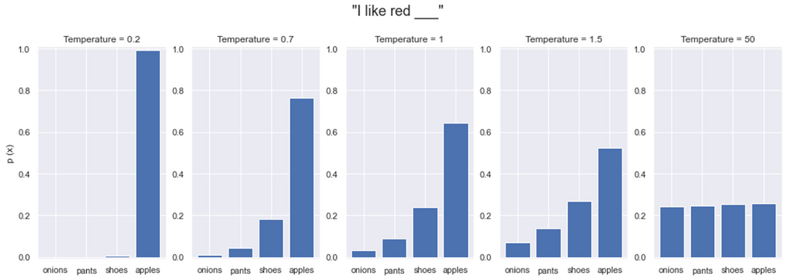
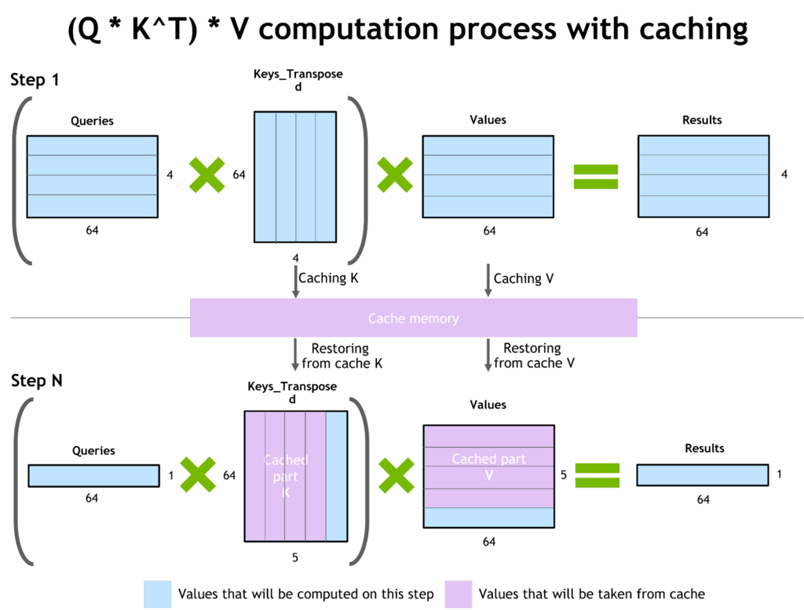
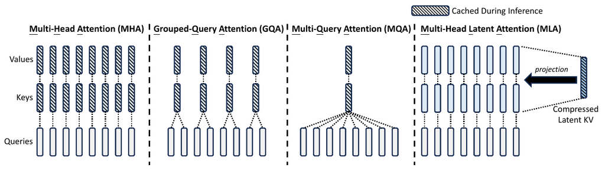
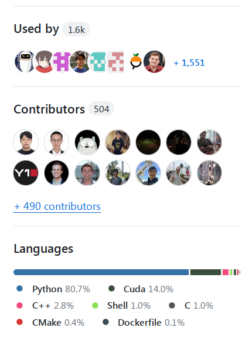

# Inference

XXX: this chapter is under construction - some sections are complete, some are still starting out, many are yet to be started, but there are already enough of useful sections completed to make it a good reading.

## Glossary

- CLA: Cross-Layer Attention
- FHE: Fully Homomorphic Encryption
- GQA: Grouped-Query Attention
- ITL: Inter-Token Latency
- KV: Key Value
- LPU: Language Processing Unit™
- MHA: Multi-Head Attention
- MLA: Multi-Latent Attention
- MPC: Secure Multi-Party Computation
- MQA: Multi-Query Attention
- PPML: Privacy-Preserving Machine Learning
- QPS: Queries Per Second
- TPOT: Time Per Output Token
- TTFT: Time to First Token


See [Concepts](#concepts) for more glossary-like entries.

## Concepts


### Prefill and Decode

When doing inference there are 2 stages:

#### Prefill

Prefill: as all tokens of the prompt are known - process the full prompt length at once (similar to training) and cache the intermediate states (KV cache). This stage contributes very little latency as even a 1k prompt can be processed really fast, given enough memory.

#### Decode

Decode: new tokens generation happens, one new token at a time (regressive approach) based on all the previous tokens (the prompt and any new tokens generated so far). Thus this stage contributes the most to the generation's latency as unlike prefill, decoding can't be parallelized.


### Online vs Offline inference

When you have users that send queries in real time - this is Online inference, also known as Deployment or Interactive inference. Examples: chatbot, search engines, general REST APIs. In this case one always runs an inference server and there could be various clients querying it.

When you have a file with hundreds or thousands of prompts that you need to run inference on - this is Offline inference, also known as batch inference. Examples: benchmark evaluation and synthetic data generation. In this case the inference server is often not needed and the inference is run directly in the same program that sends the query (client and server in one application).

The 2 main use cases are often optimized for different performance metrics - the online inference use case requires a very low TTFT and low latency, whereas the offline inference requires high throughput. The combined prefill and decode token processing throughput is the key metric for any type of inference because it defines the total cost of the inference service. In the case of online inference, the better the combined throughput the more users can be served with the same hardware. For offline inference, it's clear that the faster the inference is done, the smaller the compute costs will be.


### Grounding

It's the process of giving the pre-trained model additional information that wasn't available during its training.
For example [input-grounded tasks](#input-grounded-tasks) give the model a lot of additional information in the prompt. Non zero-shot prompts ground the model in examples altering the default model behavior. Prompt-engineering is all about grounding the model to behave in a certain way during inference.

Retrieval Augmented Generation (RAG) is one of the main techniques for grounding models as it supplies the inference process with additional data that is relevant to the prompt. And the intention is that the model will give more significance to that information than the massive compressed information it was trained on.

Fine-tuning to a different knowledge domain is another grounding approach, we update the model to be grounded in a new dataset that could be quite distinct from the original domain of data the foundational model has been trained on.

Grounding can be thought of providing a context. As anybody can attest it's easier to answer a question when one understands the context of the question. The same applies with model generation. The better the context, the more relevant the generated output is.

In a multi-modal use case an image or a video supplied with the text prompt can be that grounding or a context.


### Tasks


#### Input-grounded tasks

Input-grounded tasks are those where the generated response is derived mainly from the prompt, i.e. the main source of knowledge is contained in the prompt. These include:

- Translation
- Summarization
- Document QA
- Multi-turn chat
- Code editing
- Speech recognition (audio transcription)


### Batching

Processing the decoding stage one token at a time is extremely accelerator-inefficient. Batching multiple queries together improved the accelerator utilization and enables processing multiple requests at once.

The maximum possible batch size depends on how much memory is left after loading the model weights and filling the KV-cache with intermediate states.

#### Static batching

This is the naive straightforward batching where the first N queries are batched together - the problem here is that if many queries have finished generating they will have to wait for the longest to generate query to complete before they can be returned to the caller - greatly increasing the latency.

#### Continuous Batching or In-flight batching

Continuous Batching or In-flight batching is a process where the generation engine removes completed results as soon as they are done and replacing them with new queries, without waiting for the whole batch to complete. So that a sequence in position 0 in the batch could be generating its 10th token, while a sequence in position 1 in the batch could be just starting its first token generation, and position 3 is producing its last token.

This improves the response time, since there is no need for a sequence that already finished not to be returned immediately and there is no need for a new prompt to wait for the next batch to become available. Of course, if all of the compute is fully busy, and there are no new openings in the batch, then some requests will have to wait before the compute will start processing those.


### Paged Attention

Paged Attention is very popular with inference servers as it allows for a very efficient accelerator memory utilization, by the virtue of approaching the accelerator memory like the OS memory using paging, which allowed dynamic memory allocation and prevents memory fragmentation.


### Decoding methods

The main decoding methods are:  [Greedy decoding](#greedy-decoding),
[Beam search](#beam-search) and [Sampling](#sampling).


#### Greedy decoding

Greedy decoding is when the model always chooses the token with the highest probability. This is the fastest decoding method but it doesn't always generate the best outcome, since it may choose a less ideal token path and miss out on a great future sequence of tokens.

One of the main issues with this method is creation of loops, where the same sentence is repeated again and again.

#### Beam search

Beam search overcomes the limitation of greedy decoding by generating multiple outputs at the same time, so instead of following the highest probability - with beam size of 3 it follows top 3 probabilities at each new token, then discards all but the 3 sub-paths out of 9 (`3*3`), that lead to the highest total probability of all tokens in the chain. Then at the end the path with the highest probability of all tokens is chosen.

This method is slower than greedy decoding because it has to generate n times more tokens and it requires n times more memory.

#### Sampling

Sampling-based decoding introduces randomness.

But, of course, choosing random words will not lead to a good result, so we still want greedy decoding like certainty but making it more interesting/alive by adding controlled randomness to it.

The most common sampling methods are:

- **Top-K Sampling** method chooses the top k tokens based on their logit probability and then randomly picks one of those tokens.
- **Top-p Sampling** (also known as **nucleus sampling**) is like Top-K Sampling, but the K varies for each next token and is calculated by adding up the top token probabilities till the threshold `p` is reached. So if there are predictions that the model is much more certain about only those will be considered.

#### Temperature

Temperature is another component of [Top-p](#sampling) sampling strategy which has the following impact depending on its value:

- `t==0.0:` ends up choosing the token with highest probability - no randomness here - same as greedy decoding - precise use cases.
- `0.0<t<1.0`: the probabilities are pushed further apart, so the closer to 0.0 the less randomness - somewhere between precise and balanced use cases.
- `t==1.0`: has no impact on sampling - the original training distribution is preserved here - balanced relevance and diversity use cases.
- `t>1.0`: the probabilities are pushed closer together, creating a lot more randomness - creative use cases.

The following set of plots should make this crystal clear:



([source](https://www.hopsworks.ai/dictionary/llm-temperature))

To really understand the impact, the temperature factor typically gets applied to the log probabilities just before or as part of the Softmax operation.

```
scaled_logits = logits / temperature
probs = softmax(scaled_logits)
```
The softmax operation turns logit differences into probability ratios - when we divide by t<1.0, we make these differences larger, causing more extreme probability ratios and a more peaked distribution. When we divide by t>1.0, we make these differences smaller, causing more similar probability ratios and a more uniform distribution. At t=0, this effectively makes the highest logit infinitely larger than the others (though division by zero is avoided in practice).

Temperature will have no impact on Greedy decoding, Beam search and Top-K sampling strategies, as it impacts the distance between logit probabilities and all of these strategies use the top probabilities based on their order and temperature doesn't change the order of probabilities. Whereas Top-p sampling allows more or less contenders to enter the sub-set the random sampling will be pulled from based on their total probability - so the closer the probabilities are (high temp) the more randomness is possible.

Other than `t==0.0` and `t==0` there are no hard prescribed values to copy from and you will have to experiment with each use case to find the values that work the best for your needs - though you surely will find people offering good baselines for different use cases if you search the Internet.

For more on decoding methods, see this [Huggingface blog](https://huggingface.co/blog/how-to-generate).

### Guided Text Generation

Also known as Structured Text Generation and Assisted generation.

If the model can return its generated output in a specific format, rather than unrestricted format, you don't want the model to hallucinate invalid formats. For example, if you want a model to return a JSON dict, it should do just that.

The way this is accomplished is by using guided text generation. Instead of choosing a generated token with highest probability, the technique uses the next best token with highest probability that fits the next expected token sub-set. To elucidate with an example: if you want the model to generate a JSON list of strings like `["apples", "oranges"]` thus we expect:

```
["string", "string", ..., "string"]
123...
```

The first generated token has to be `[`. If the model got `"`, for example, instead of `[`, as the highest probability, and `[` had a lower probability - we want to pick the one with lower probability so that it'll be `[`.

Then the next generated token has to be `"`. If it's not, search for tokens with lower probabilities until `"` is found and choose that.

The third token has to be a valid string (i.e. not `[` or `"`).

And so on.

Basically, for each next token we need to know a subset of tokens that is allowed and choose one with the highest probability from that subset.

This is a very cool technique. Instead of trying to repair the generated output which is not always possible to match the expected format, we get the model to generate the correct output in the first place.

This technique has several costs:
- it slows down the generation - the more complex the schema it has to adhere to the slower it'll be at generating tokens. From measuring generation speed I found some structured text generation libraries perform much faster than others.
- it may contribute to model hallucination.

There are multiple implementations of this technique, as of this writing the two popular libraries are:
- https://github.com/outlines-dev/outlines
- https://github.com/noamgat/lm-format-enforcer

You ideally want the implementations that have already been integrated into inference frameworks like vLLM and others.

#### Faster inference with guided generation

It's possible to use the schema to speed up inference as well. For example, consider this simple "profile" schema:

```
{
  "type": "object",
  "properties": {
    "name": { "type": "string"},
    "age": { "type": "integer"}
  },
  "required": ["name", "age"]
}
```

Since the schema has specific keys `name` and `age`, as soon as the model has predicted: `{"n` or `{"a` it doesn't need to perform an auto-regressive generation to come up with ``{"name": ` and `{"age": ` because both of these must lead to a specific unambiguous single outcome - so here it can perform a prefill instead of decoding and save a few slow steps at it knows 100% the next few tokens will be `ame": ` or `ge":` correspondingly. Clearly, this approach would be most beneficial when the schema has a lot of pre-determined keys and short generated values.


### Speculative decoding

Also known as Speculative inference or Assisted generation.

Because it's very slow to generate tokens one a time, sometimes it is possible to cheat and speed things up by using a much smaller and faster draft model. So for example, your normal inference uses Llama-70B which would be quite slow, but we could use Llama-7b as a draft model and then we could verify if the prediction is correct but doing it at once for all tokens.

Example: let's take a prompt `I'm turnin', turnin', turnin', turnin', turnin' around and all that I can see is just` and now:

1. use Llama-7b to predict `another lemon tree` auto-regressively, in 3 steps, but much faster than Llama-70b.
2. now use Llama-70b to run a batch of 3 prompts:

```
[...I can see is just]
[...I can see is just another]
[...I can see is just another lemon]
```
I shortened the full prompt for the sake of the demo with `...` - it should be there for real. And I'm pretending that each token is a full word here.

And now in a single step Llama-70B generates:

```
[...I can see is just] another
[...I can see is just another] lemon
[...I can see is just another lemon] tree
```

Now there could be multiple outcomes:
- if everything matches - in 3 short and 1 long step we generated the final result, instead of using 3 long steps.
- if only `another lemon` matched - we might still better off if it saved time.
- if nothing or little matched we wasted a bit of time.

Obviously, if instead of 3 tokens we had more tokens the savings are likely to be bigger.

Also, don't miss the fact that we did the same amount of compute here and then some, as compared to doing this generation with the large model normally, but the latency of this approach can be much better - so the user on average should get a better response time from your application using it - if the draft model is much smaller and still produces good predictions.

When there is a partial mismatch we can go back to the draft model and feed it all the matched tokens before the first mismatched token and the next good token predicted by the big model and get it to make a new fast prediction for the mismatching tail.

The draft model ideally should be trained on the same data (or least data from a similar distribution) and its tokenizer has to be the same as the large model.

Speculative decoding gives the highest return on [input-grounded tasks](#input-grounded-tasks), such as translation, summarization, document QA, multi-turn chat because in those tasks the range of possible outputs is much smaller and the draft model is much more likely to match the big model.

For the same reason it works best in when used in [greedy decoding](#greedy-decoding), as there is the least amount of possible variations during generation. If not using greedy decoding, you will want to have the value of  [temperature](#temperature) close to 0.

Here is a good indepth dive into this subject: [Assisted Generation: a new direction toward low-latency text generation](https://huggingface.co/blog/assisted-generation).

One other much simpler solution for [input-grounded tasks](#input-grounded-tasks), is to use [ngram prompt lookup decoding](https://github.com/apoorvumang/prompt-lookup-decoding). In this approach there is no need for a draft model, instead the prompt is searched for matching strings to generate candidates. In some situations it's said to speed decoding up by 2x+.


### Privacy-preserving inference

Most companies serving inference will run into a user privacy need. It should be safe for a user to submit a query w/o someone snooping on it. One solution would be an on-premise solution where the client runs the server themselves and then there is no privacy issue, but that most likely is going to expose provider's IP - model's weights and possibly code/algorithms. Therefore, there is a need for a fully encrypted generation - that is the computations are to be performed on client-encrypted data.

The solutions that address this need are called Privacy-Preserving Machine Learning (PPML).

One of the solutions is called Fully [Homomorphic Encryption](https://en.wikipedia.org/wiki/Homomorphic_encryption) (FHE).

Have a look at one such implementation, [concrete-ml](https://github.com/zama-ai/concrete-ml) that rewrites the model to be able to have the client run part of the model themselves, then the intermediary encrypted activations are sent to the server to perform the attention and then sent back to the client. Thus the provider retains part of their IP - and I suppose this part of IP prevents the client from stealing the full IP, since partial weights aren't enough to reconstruct the full model. [This article](https://huggingface.co/blog/encrypted-llm) goes into more details.

There are various other approaches, e.g. this paper: [LLMs Can Understand Encrypted Prompt: Towards Privacy-Computing Friendly Transformers](https://arxiv.org/abs/2305.18396v3) goes into a custom solution based on Secure Multi-Party Computation (MPC) and FHE and has a good reference list.

The problem with current solutions is the huge computational overhead - which greatly impacts the cost and latency. In the future ASIC solutions should address these issues.


### Model parallelism

When a model can't fit onto a single accelerator or when it's more efficient to split the model across multiple accelerators even if it does fit but barely, the same [Model Parallelism techniques](../training/model-parallelism) from training apply to inference.

#### Tensor parallelism

Most of the time you are most likely to only run into [Tensor Parallelism](../training/model-parallelism#tensor-parallelism) where the model weights are sharded across 2 to 8 accelerators. Ideally you want to try to fit the model into a single accelerator, because then it has the least amount of overhead during generation. But surprisingly you are likely to end up with higher decoding throughput if you use tensor parallelism - this is because it enables you to fit much larger batches and also because the `forward` call may be faster despite the additional comms between the accelerators. Of course, you will be getting this speed up at a cost of using more accelerators in some cases. So it's best to experiment, there will be use-cases where a higher tensor parallelism degree will give a better total throughput considering the same number of accelerators.

footnote: in my experiments TP=1 leads to the highest TTFT and lowest decoding throughput, as compared to TP>1. So if you're being requested to make the TTFT faster and the model fits, use smaller TP or TP=1. If you're being requested to make the decoding throughput faster, throw more accelerators at it with a higher TP degree.

#### Pipeline parallelism

Further, while tensor parallelism helps to lower latency, using [Pipeline Parallelism](../training/model-parallelism#pipeline-parallelism) could help increase the throughput. This is especially so for very large models where many accelerators have to be used anyway to even load the model's weights. If say you're using Llama 405B and TP=8 is used, then each accelerator has to all-reduce to 7 other accelerators, whereas with PP=8 each accelerator needs to communicate only with 2 other accelerators (`recv` the input from the previous stage and `send` the current output to the next stage), creating a much lower pressure on the networking layer and this can speed things up dramatically if the hardware supports it.

It's important to clarify here that PP can be superior to TP only if you use the full PP and not the naive PP. In the [naive PP](../training/model-parallelism#naive-model-parallelism-vertical) only one PP stage works at any given time so it'd perform worse than TP. To benefit from PP the inference framework needs to feeds all PP stages in parallel to perform [full PP](../training/model-parallelism#pipeline-parallelism).

The other important thing about PP inference is that unlike training, there is no `backward` pass, thus there is no need to solve the inactivity bubble problem. There will be only a tiny overhead of filling the PP stages in the first few micro-batches.

And as with training you may find that some mix of TP and PP will lead to the best outcome (e.g. TP=4 + PP=4 for Llama 405B). So make sure to experiment and measure different configurations and pick the one that meets your needs.


## Key inference performance metrics

There are two ways to look at performance metrics, the usual system metrics of latency and throughput, and the user-experience metrics: Time To First Token (TTFT) and Time Per Output Token (TPOT). Let's look at both pairs.

### System performance metrics

#### Latency

**Latency is the time it took to receive the complete response since a request was sent**.

This includes the time to:
1. receive the request
2. pre-process the prompt (the prefill stage)
3. generate the new tokens of the response (the decoding stage)
4. send the response back to the client.

The time to receive the request and send the response is mostly the same with a small variation due to the differences in the length of the prompt and the generated response. These length variations should have a negligible impact to the total time.

The prefill stage processes all the prompt's tokens in parallel so here as well the variations in the length of the prompt shouldn't make too much of a difference, albeit longer prompts will consume more accelerator memory and impact the total throughput.

The decoding stage is the one most impacted by the length of the generated response since each new token is generated as a separate step. Here the longer the response the longer the decoding stage will be.

If the server doesn't have enough capacity to process all current requests at once and has to queue some of them, then the wait time in the queue extends the latency by that time.

footnote: if you think of car traffic on the road, latency is the time it takes one to drive from point A to point B (e.g. home to office), including the speed limitations due to traffic lights, jams and legal limits.

#### Throughput

Throughput measures the ability of an inference server to process many requests in parallel and batch requests efficiently.

The definition of throughput could be defined by how many requests can be served concurrently, but since some requests get served much faster than others, so that several short requests could be served during a single long request, it makes sense to count the total rate of tokens generated across the system.

Thus a more common definition of **inference throughput is total tokens generated per second across the whole system**.

footnote: if you think of car traffic on the road, throughput is how many cars can move through a given road at any given time. The more lanes the road has and the higher the speed limit the higher the throughput of that road. But clearly some vehicles are short and some are long, so some sort of normalization is needed. For example, ferries calculate how many meters or feet of vehicles they can fit it and thus long vehicles pay more than short ones.


### User experience metrics

While there are many characteristics an inference server can be judged by - like power usage, efficiency and cost, one could say that since the systems interface humans - the most important characteristics are all in the domain on having a smooth user experience. If the user experience is slow and choppy, the user will go to a competitor. Therefore the key needs are:

#### Time To First Token

**Time To First Token (TTFT) is defined as the time that passed since the user hit the Submit button (or Enter) and the moment they have received a first word or a part of the word in return**.

A very low Time To First Token (TTFT) is wanted. These days users are conditioned to expect from any application to start responding ideally faster than 1 second. Therefore the shorter the time the user has to wait before they start receiving the fist tokens the better. This becomes even more important for chatbots which are expected to be interactive. The length of TTFT is impacted by many elements, the key ones being the computation of the [prefill stage](#prefill) (pre-processing the prompt) and whether the request got its processing immediately upon user request received or whether it had to wait in the queue.

It's important to observe that TTFT w/o a load on a server can be very different from when a server is under a heavy load. If normally the server sends the first token in 1 sec, if the server is already busy processing all the requests it can handle at once and there is a queue, the effective TTFT other than for the first few requests, could easily be much much longer. So usually one should measure an average TTFT and report it together with the number of concurrent requests sent during the benchmark.

This is a non-trivial metric since depending on the prompt size the time will vary, so ideally you'd want to normalize it to the number of tokens in the prompt.

#### Time Per Output Token

Time Per Output Token (TPOT) is a per user metric. It measures how long does it take for a new token to be generated for a given user.

A relatively low Time Per Output Token (TPOT) is desired, but it doesn't have to be too high. This time ideally should be close to the reading speed of the human who sent the request. So for example if you serve first graders the TPOT can be quite low, but the more educated the person is the faster TPOT should be to achieve a smooth reading experience.

According to wiki there are [3 types of reading](https://en.wikipedia.org/wiki/Speed_reading#Types_of_reading) and the reading speed is measured in words per minute (WPM).

The average tokens per word can vary from tokenizer to tokenizer, primarily depending on their vocab size and the language(s). Here let's consider an English tokenizer with about 1.5 tokens per word. Now we can convert words per minute (WPM) to tokens per minute (TPM).

And now we just need to divide by 60 to get Tokens Per Second (TPS) and invert to get time per output token (TPOT)

So `TPOT = 60 / (WPM*1.5)` in seconds

| Reader   | WPM |  TPM |   TPS |  TPOT |
| :-----   | --: | ---: | ----: | ----: |
| Subvocal | 250 |  375 |  6.25 |  0.16 |
| Auditory | 450 |  675 | 11.25 | 0.089 |
| Visual   | 700 | 1050 | 18.75 | 0.057 |

Remember to change the 1.5 co-efficient to the actual word to tokens average ratio of your tokenizer. For example, as of this writing OpenAI ChatGPT's with a 50k vocab is reported to be about 1.3 tokens per word, while many other LLMs have 30k vocabs, which lead to a higher tokens per words ratio.

As you can see TPOT is an awkward value to track and think of in one's head, so **once you know your targeted TPOT it's better to convert it to Tokens Per Seconds (TPS) and track that instead**.

Therefore in this example if your system can generate a sustainable 20 tokens per second per request your clients will be satisfied since that system will be able to keep up even with the super-fast readers at 700 words per minute.

And there, of course, will be users who would prefer to wait till the generation is complete before they would start reading the response. In which case faster is better.

Depending on the type of generation, the following is likely to apply:
1. Image - all-at-once
2. Text - as fast as user's reading speed or all-at-once if they prefer not to have moving parts before they start reading
3. Audio - as fast as user's listening speed
4. Video - as fast as user's watching speed

If this is an offline system that doesn't interface individual humans and there are just batches of requests processed these metrics make no difference, but latency and throughput are the key ones.


### Simplified performance metrics

As you can tell the discussed above metrics have a lot of overlap in them. Practically we can reduce all of them to just these 2 metrics: Prefill throughput and Decode throughput - and probably how many parallel requests per second the system can handle.

#### Prefill throughput

This is how fast the system can pre-process the prompt - in tokens per second.

Assuming there is a negligible overhead of receiving and sending the request, in the absence of a queue where the incoming request gets immediately workedon [TTFT](#time-to-first-token) is really the number of tokens in the prompt divided by the prefill tokens per seconds plus the time to generate the first token (which we can ignore as it'd be very fast).

If there is a queue then prefill throughput isn't enough, because then TTFT can be much longer as one has to add the time the request spent in the queue.

#### Decode throughput

This is how fast the system generates response tokens - in tokens per second.

This addresses, both the throughput and Time Per Output Token metrics.

The response latency then is the number of tokens in the prompt divided by the prefill throughput plus the number of generated tokens divided by the decode throughput.


### More metric notes

#### Accelerator utilization

Accelerator utilization - either percentage or power measurement is a good indicator of whether your setup uses the accelerators efficiently. For example, if you use NVIDIA GPUs and you `watch -n 0.5 nvidia-smi` and you see you're at 10% "gpu util" while massively bombarding the inference server with many requests that usually means that either the inference server is very inefficient (e.g. spends a lot of time copying things back-n-forth) or it could be that the clients are inefficient at how they receive the data (i.e. too much IO blocking).

footnote: when I first wrote a simple benchmark using the openai client it worked fine at a low concurrency, but at a higher concurrency the inference server dropped its gpu util to 6-7%. After I replaced the client with `aiohttp` API it went up to 75%. Therefore beware that it's your benchmark that could be the culprit of bad performance reports and not the server.

This is somewhat of an equivalent of using [TFLOPS to measure training efficiency](../training/performance/README.md#tflops-as-a-performance-metric).

In the ideal case you want your accelerator utilization to be as high as possible. Beware that at least for NVIDIA GPUs `gpug util` [isn't what you might think it is](../compute/accelerator/nvidia/debug.md#how-to-get-the-real-gpu-utilization-metrics), but if it reports a very low percentage it's good enough of a signal to know that there is definitely an inefficiency problem.

#### Percentiles

If you read benchmarks and run into things like p50, p75, p90, p95 and p99 percentiles - these are statistical filters that give you the results based on the percentage of results that fit under (or over) a certain threshold. Even the same request is likely to take a slightly different response time when it gets re-run multiple times. So, for example, if 95% of the time a throughput was higher than a certain value - that would be a p95 percentile. That also would mean that 5% of the time the throughput was lower than that same threshold value. The higher the number next to `p`, the more difficult it is to achieve.

For example, let's look at partial output of a system loading report generated by [k6](https://github.com/grafana/k6) on an inference server:

```
http_req_duration..: avg=13.74s   min=12.54s  med=13.81s   max=13.83s   p(90)=13.79s   p(95)=13.83s
http_req_receiving.: avg=27.98µs  min=15.16µs med=21.6µs   max=98.13µs  p(90)=44.98µs  p(95)=59.2µs
http_req_sending...: avg=133.8µs  min=20.47µs med=75.39µs  max=598.04µs p(90)=327.73µs p(95)=449.65µs
```

If we look at the first line which reported the total generation time, if we look at the minimal recorded value of 12.54 seconds, we then know that 90% of responses took between 12.54 and 13.79 secs and 95% of responses took between
12.54 and 13.83 secs - and in this particular case the median reported value is between the p90 and p95 values.

The same interpretation applies to the other lines in the report, but the key exemplification here is that p90 values are lower than p95 values because time is being measured (the lower the better).

Percentiles are useful when outliers aren't important, so, for example, instead of looking at the slowest throughput measured you'd say ignore the worst 5% of outcomes and suddenly the system's performance looks much much better. But one has to be very careful with such discarding of bad outcomes when dealing with users, since it means that some of them will have a bad experience using your system. Also 5% translates to a whole lot of users if you have millions of them.

Please refer to [Percentile](https://en.wikipedia.org/wiki/Percentile) for a much more indepth explanation.


## Speeding up model loading time

When serving in production it might be OK to let the model takes its loading time since it happens once and then the server runs for days, so this overhead is amortized over many days. But when doing research, development and testing it's critical that the inference server starts serving really fast.

Sometimes the overhead is just loading to CPU and then moving the tensors to the accelerators, at other times there is an additional need to shard the tensors for multiple accelerators to perform [TP](../training/model-parallelism#tensor-parallelism) and [PP](../training/model-parallelism#pipeline-parallelism).

Various approaches are used for that - most involve some sort of pre-sharding and caching, with a subsequent direct loading onto GPU.

For example:

- vLLM supports the `--load-format` flag, where one could choose options like `npcache` (numpy format caching) or `tensorizer` using  CoreWeave’s [Tensorizer](https://github.com/coreweave/tensorizer).  ([recipe](https://docs.vllm.ai/en/latest/serving/tensorizer.html) and, of course, if you use TP>1 you want to [pre-shard the weights once](https://docs.vllm.ai/en/latest/getting_started/examples/save_sharded_state.html).
 - TensorRT-LLM requires the user to build a model engine for each specific use-case and loads the pre-made shards at run time (unless you're using the simplified API which will build the model engine on the fly on every server start).


## Benchmarks

You can write your own benchmark as explained in [key inference performance metrics](#key-inference-performance-metrics) or use an existing one.

At the moment I use mainly the [prefill throughput](#prefill-throughput) and [decode throughput](#decode-throughput) benchmarks. The first one just measures tokens per second from the moment the request was sent and the first generated token received, and the second one is the throughput between the first and the last generated tokens received. Here is the relevant snippet of such measurement using [`openai` client completions API](https://github.com/openai/openai-python):

```
[... create client, data, etc. ...]
prefill_tokens_len = len(prompt)
start_time = time.time()
decode_text = ""
decode_started = False
completion = client.completions.create(prompt=prompt, ...)
for chunk in completion:
    if chunk.choices:
        decode_text += text
        if not decode_started:
            decode_started_time = time.time()
            prefill_time = decode_started_time - start_time
            decode_started = True

end_time = time.time()
decode_time = end_time - decode_started_time
decode_tokens = tokenizer.encode(decode_text)
decode_tokens_len = len(decode_tokens)

# tokens/per sec
prefill_throughput = prefill_tokens_len / prefill_time
decode_throughput  = decode_tokens_len  / decode_time
```

The `prefill_throughput` is not very precise here, since the client only know when it sent the request and received the first token, so a bit more went into this stage than pure prompt-preprocessing, but it should be close enough.

Of course, like any serious benchmark, you want to run this multiple times to get realistic numbers, as the variance  between single runs can be quite large.

note: I've discovered that when I use the openAI client it doesn't scale well and with many concurrent requests the openAI client creates a bottleneck and doesn't measure the real server performance - I am yet to figure out if it's an issue in my code or the openAI client or how it interacts with vLLM server - I'm investigating here https://github.com/vllm-project/vllm/issues/7935 - I found that [this version](https://github.com/vllm-project/vllm/blob/f842a7aff143a4a1ddc59e1fb57109cb377f5475/benchmarks/backend_request_func.py#L223-L301) of the client, rewritten to use `aiohttp` scales really well - so I switched to using it.

Here are some good starting points for load testing:

- https://github.com/vllm-project/vllm/blob/main/benchmarks/benchmark_throughput.py - my favorite tool so far
- https://github.com/grafana/k6 - useful for load testing to simulate multiple concurrent clients - uses JavaScript clients.
- https://github.com/bentoml/llm-bench - benchmarks inference loads (not yet sure if it works only for BentoML)


What I'm missing right now is a tool to measure the highest concurrency the server can handle.


## Anatomy of Model's Memory Usage

The inference memory usage is quite different from [training](../training/performance#anatomy-of-models-memory-usage). Here we have:

1. Model weights
2. KV cache - crucial to not need to recalculate past tokens for each new generated token
3. Activation memory - this is the processing temporary memory which would depend on a batch size and a sequence length

### Model Weights

- 4 bytes * number of parameters for fp32
- 2 bytes * number of parameters for fp16/bf16
- 1 byte  * number of parameters for fp8/int8
- 0.5 bytes * number of parameters for int4

footnote: even more compact formats are being worked on as you read this, e.g. [microscaling format (MX)](https://fpga.org/category/microscaling-mx-formats/) also known as block floating point, where the exponent bits are shared between multiple elements of the tensor (MXFP6, MXFP4, etc.)

Example: Meta-Llama-3.1-8B in bf16 will need `2 (bf16 bytes) * 8B (num of params) = 16GB` (approximately)


### KV Caching

It'd be very expensive to recalculate all the previous KV (Key Value) values before each new token is generated and thus they are cached in accelerator's memory. Newly computed KV-values are appended to the existing cache.



([source](https://developer.nvidia.com/blog/accelerated-inference-for-large-transformer-models-using-nvidia-fastertransformer-and-nvidia-triton-inference-server/))

KV cache size is directly proportional to the input sequence length and batch size. Past query values aren't used in the attention mechanism and thus don't need to be cached.

A KV cache of 1 token requires `dtype_bytes * 2 * num_hidden_layers * hidden_size * num_key_value_heads / num_attention_heads` bytes

notes:
- `dtype_bytes` is bytes per dtype: 4 bytes for fp32, 2 bytes for bf16/fp16, etc.
- `2` stands for keys + values as there are 2 of them.
- `num_key_value_heads / num_attention_heads` is the factor that will depend on whether multi-query (MQA), grouped-query (GQA) or multi-head attention (MHA) is used. for MHA it'll be 1, for MQA it'll be `1/num_attention_heads` and for GQA it'll depend on how many queries are used per group, i.e. `num_key_value_heads / num_attention_heads` which is the general case for MHA and MQA.

You can get these dimensions from `config.json` inside the model's folder or from an equivalent file if it's different.
e.g. [meta-llama/Meta-Llama-3.1-8B](https://huggingface.co/meta-llama/Meta-Llama-3.1-8B/blob/main/config.json).

Examples:

1 token Meta-Llama-3.1-8B in bf16 will need: `2 (bf16 bytes) * 2 (keys+values) * 32 (num_hidden_layers) * 4096 (hidden_size) * 8 (num_key_value_heads) / 32 (num_attention_heads)  / 10**6 = 0.131MB`. This model uses GQA so it uses 1/4th of the vanilla MHA.

A batch size of 1 of 1024 tokens will need `0.131*1024 = ~134MB`.

A batch size of 128 of 1024 tokens each will need `0.131*1024*128 / 10**3 = ~17.2GB`.

The KV cache for Meta-Llama-3.1-8B would have taken 4x more memory per token if it were to use MHA, 8x less memory if it were to use MQA. It's easy to see why from this diagram:

In this case the model has `num_key_value_heads=8` and `num_attention_heads=32`, hence MQA and GQA use 32x and 4x less memory than MHA, correspondingly.

[DeepSeek v3](https://arxiv.org/abs/2412.19437) introduced Multi-Latent Attention (MLA) which compresses the Key and Value into a latent vector, which further reduces the KV-cache size.  See section 2.1.1 of the paper for the specific details.

Here is the diagram that shows the difference between MHA/GQA/MQA/MLA:



[source](https://arxiv.org/abs/2405.04434)

[SwiftKV](https://arxiv.org/abs/2410.03960) was invented to deal with the common situation of 10:1 ratio of prefill vs decode use-cases, reducing inference computation during prompt processing rather than just compressing memory. By combining model rewiring and knowledge-preserving self-distillation, SwiftKV achieves substantial reductions in computational overhead during inference with minimal accuracy loss, leading to transformative improvements in throughput, latency and cost efficiency for enterprise LLM workloads by up to 2x.

KV cache while saving recomputation has a big negative impact on inference's performance. Here is a quote from [Dynamic Memory Compression: Retrofitting LLMs for Accelerated Inference](https://arxiv.org/abs/2403.09636):

> 2.3. Memory-Bound and Compute-Bound Operations
>
> Every operation performed with a GPU accelerator, such as General Matrix Multiply (GEMM), is either memory-bound or compute-bound. In the former case, the overall runtime is dominated by high bandwidth memory (HBM) access, while in the latter by the actual computations. Auto-regressive generation with Transformer LLMs, where the sequence length for every forward pass is n = 1, tends to be memory-bound rather than compute-bound. The vast majority of a forward pass is spent either processing linear layers (in MHSA, Feed-Forward, and output vocabulary projection) or calculating attention scores and outputs from Equation (4). For linear layers, the ratio of FLOPS to memory accesses improves as the batch size increases, and more FLOPS are performed with the set of layer weights retrieved from the HBM. Eventually, with a large enough batch size, linear layers become compute-bound. On the other hand, for the calculation of Equation (4) inside MHSA layers during auto-regressive inference, the ratio of FLOPS to input size remains constant, and MHSA layers are memory-bound regardless of the batch size. It follows that for those layers, latency scales linearly with the size of the KV cache.

* Equation (4) is the usual self-attention mechanism equation of `Softmax(Q,K)V`

A smaller KV cache would lead to faster generation and higher GPU utilization. So various techniques like gisting, context distillation, key-value eviction policies (token dropping), memory compression, multi-query attention, grouped-query attention, cross-layer attention, anchor-based self-attention, quantization and many others are used to accomplish that.

In the case of a small batch size you should check if disabling KV cache will not give a better overall performance.


## Inference frameworks

There are many dozens of inference frameworks and more emerging every week, so it'd be very difficult to list them all. So this here you will find a starter list of a handful of inference frameworks that might be a good fit for your needs, but do check out other frameworks if the ones listed here don't satisfy your needs.

This section is trying hard to be neutral and not recommend any particular frameworks, since even if I was able to try them all out, there is no way I could possible guess which framework will work best for which user/company.


### vLLM

[vLLM](https://github.com/vllm-project/vllm)

### DeepSpeed-FastGen

[DeepSpeed-FastGen](https://github.com/deepspeedai/DeepSpeed/tree/master/blogs/deepspeed-fastgen) from [the DeepSpeed team](https://github.com/deepspeedai/DeepSpeed).

### TensorRT-LLM

[TensorRT-LLM](https://github.com/NVIDIA/TensorRT-LLM) (also integrated what used to be `FasterTransformer`)

Supports only NVIDIA gpus.

### TGI

[TGI](https://github.com/huggingface/text-generation-inference)

### SGLang

[SGLang](https://github.com/sgl-project/sglang)

### OpenPPL

[OpenPPL](https://github.com/OpenPPL/ppl.nn)

### LightLLM

[LightLLM](https://github.com/ModelTC/lightllm)

### LMDeploy

[LMDeploy](https://github.com/InternLM/lmdeploy)

### MLC-LLM

[MLC-LLM](https://github.com/mlc-ai/mlc-llm)

If your favourite inference framework isn't listed please make a PR and add it.


### Accelerator-specific frameworks

Most inference framework obviously support NVIDIA CUDA. Some support AMD ROCm and Intel Gaudi.

But there are accelerator-specific frameworks:

### Intel Gaudi, MAX, etc.

-  https://github.com/intel/intel-extension-for-transformers


### How to choose an inference framework

To choose the most suitable inference framework you need to answer at least the following questions:

1. Does the framework have the features that you need? Be careful here, some frameworks list that they support feature A, but when you try to use it it's not well integrated or works really slowly.
2. Does the framework have a permissive license that meets your current and future needs? In practice we have seen that frameworks with licenses that go against commercial use are likely to be rejected by the community. For example HF's TGI tried to charge for commercial use and it backfired - so its license got reverted to the original Apache 2.0 license and now they are trying to recover from being shunned by the community.
3. Does the framework have a thriving community of contributors? Go to the framework's github repo and check how many contributors it has - if it's very few I'd be concerned as thriving frameworks usually tend to invite contributions and that means that even if the core contributors don't have the time some feature, some contributors might do it for you.
4. Does the framework have a high adoption? github stars are often a good indication, but sometimes it can be hyped up via smart marketing moves. So seek out other signals - e.g. `Used by` count on the framework's repo's main page on github - these are real numbers. Lots of PRs and Issues is another flag. Then search the web for how many articles are written about the given framework.
5. Are the framework maintainers responsive to Issues and PRs? Some frameworks will ignore many Issues and even PRs. Check the count of how many PRs and Issues not being addressed. A high outstanding open Issues is a difficult signal - from one side it means this is a popular project, from the other side it means the developer team and contributors can't cope with the needs of its users.
6. While the majority of ML inference frameworks are written in Python, with some sprinkling of C++ or Triton for fused kernels, some aren't written in Python. (e.g. NVIDIA's TensorRT-LLM is 99% C++, TGI's big chunk is written in Rust). If something doesn't work the way you need it to and you filed an Issue and it's not being addressed, will you be able to get your hands dirty and modify the framework to do what you need?
7. The other issue you may run into is that some frameworks don't want your PRs where you implemented missing features or made improvements and then you will end up maintaining a fork, which can be extremely difficult if you want to continue syncing with the upstream and cause a lot of pain to your developers.
8. Run some sort of load [benchmarks](#benchmarks) for the desired workloads to know if the performance is adequate.
9. Will you want to choose the [best cost-effective accelerator](../compute/accelerator#high-end-accelerators-for-ml-workloads) down the road or are you OK being locked in into a specific vendor? For example, a framework from NVIDIA isn't likely to support any other accelerators besides NVIDIA's. Same goes for AMD and Intel.

For example, here is a snapshot of [vLLM](https://github.com/vllm-project/vllm)'s stats as of 2024-08-24, which is one of the most popular inference frameworks as of this writing.



You can see that it is used by many github repositories, it has a lot of contributors and that it's written mainly in Python. So it should be very easy to find this information about any inference framework you may consider. This was just an example and not an endorsement of vLLM.


## Inference Chips

Besides general purpose accelerators some vendors have been working special ASICs that are designed to do Inference-only.

### Groq

- [Groq](https://groq.com/)


## Resources

- [A Survey on Efficient Inference for Large Language Models (2024)](https://arxiv.org/abs/2404.14294)
