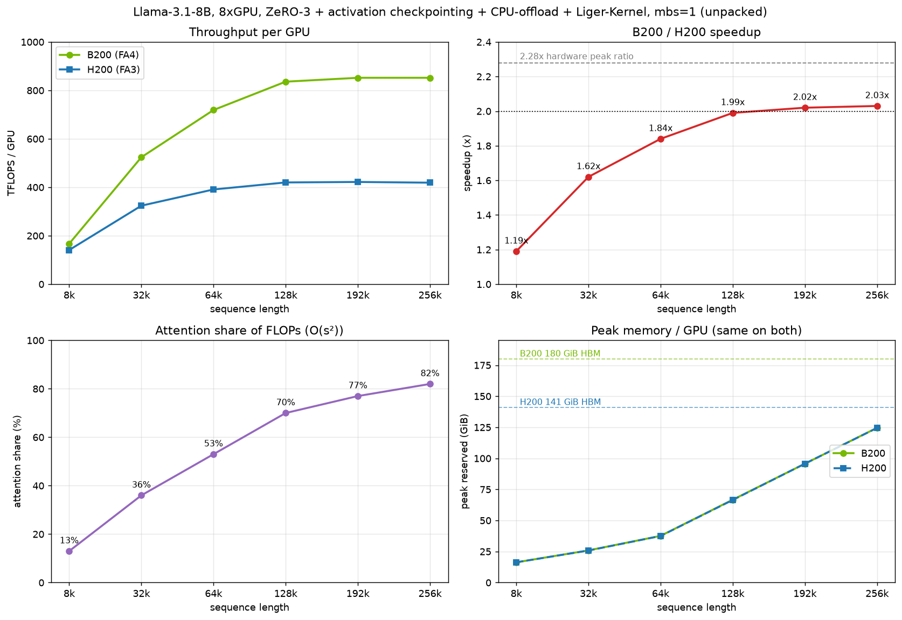

# When Is It Worth Upgrading GPUs?

A practical guide to deciding whether a GPU generation upgrade is worth its cost, using a real DeepSpeed training benchmark (meta-llama/Llama-3.1-8B, FlashAttention-3 on H200 vs FlashAttention-4 on B200) as the concrete worked example. The framework generalizes to any "should I upgrade from GPU X to GPU Y" decision building upon numbers from Hopper H200 → Blackwell B200.

## Key spec differences: H200 vs B200

| Spec                              | H200 SXM         | B200 SXM                | Ratio (B200/H200) |
| --------------------------------- | ---------------- | ----------------------- | ----------------: |
| Architecture                      | Hopper           | Blackwell               |                 — |
| Compute capability                | sm90             | sm100                   |                 — |
| Attention kernel (HF auto-select) | FlashAttention-3 | FlashAttention-4 (beta) |                 — |
| Peak bf16 TFLOPS (theoretical)    | 989              | 2250                    |         **2.28×** |
| Peak fp8 TFLOPS (theoretical)     | 1979             | 4500                    |             2.27× |
| HBM capacity (usable) HBM3e       | ~141 GiB         | ~180 GiB                |             1.28× |
| HBM bandwidth                     | 4.8 TB/s         | 8.0 TB/s                |             1.67× |
| TDP                               | 700 W            | 1000 W                  |             1.43× |

Theoretical peak TFLOPS is [a ceiling nobody hits in practice](../../training/performance/README.md#tflops-as-a-performance-metric) — see the [MAMF numbers below](#mamf-the-realistic-ceiling-not-the-marketing-number) for what's actually achievable. Full spec tables (all dtypes, all vendors, memory, power, clocks): [ml-engineering accelerator spec tables](../../compute/accelerator/README.md#tflops-comparison-table).

## MAMF: the realistic ceiling, not the marketing number

**MAMF (Maximum Achievable Matmul FLOPS)** is the actual best-case `matmul` throughput measured on real hardware/software (perfectly-aligned max-size shapes, no sparsity) — as opposed to the theoretical peak that's physically unreachable. Use it to sanity-check whether your own training TFLOPS have room left to optimize, or whether you're already near the ceiling (measure MAMF on your own GPUs with [`mamf-finder.py`](../../compute/accelerator/benchmarks/mamf-finder.py)). Source and full comparison across multiple vendors: [MAMF comparison table](../../compute/accelerator/README.md#maximum-achievable-matmul-flops-comparison-table).

**BF16:**

| Accelerator   | MAMF (TFLOPS) | Theoretical | Efficiency |
| ------------- | ------------: | ----------: | ---------: |
| H100/H200 SXM |         794.5 |         989 |      80.3% |
| B200 SXM      |        1745.0 |        2250 |      77.6% |

**FP8:**

| Accelerator | MAMF (TFLOPS) | Theoretical | Efficiency |
| ----------- | ------------: | ----------: | ---------: |
| H200 SXM    |        1453.4 |        1979 |      73.4% |
| B200 SXM    |        3432.5 |        4500 |      76.3% |

Takeaway: the *achievable* bf16 ratio (1745/794.5 = **2.20×**) tracks the theoretical 2.28× closely because efficiency is similar on both chips (80.3% vs 77.6%). In fp8 the achievable ratio is actually *higher* than theoretical (3432.5/1453.4 = **2.36×**) because B200's fp8 path is relatively more mature (76.3%) than H200's (73.4%). Either way, **2.2–2.4× is the realistic matmul-only ceiling** for this upgrade — real training throughput will land below that once attention scaling, dense-GEMM maturity, and communication overhead are factored in (the [worked example below](#worked-example-meta-llamallama-31-8b-training-step-fa3-vs-fa4) shows exactly how much below, and why).

## Decision framework, part 1 — do you need a new dtype?

Start here, because this one question can settle the decision on its own, with no benchmarking. The real first question isn't *"how much faster is it"* but *"does the new GPU do something the current one **can't**?"* — and for a hardware-generation jump the clearest such capability gap is **new low-precision dtypes**.

Blackwell adds **FP4/NVFP4/FP6** that Hopper **cannot execute in hardware at all** — relevant for FP4 inference or microscaling training recipes.[^unlocks] If your target recipe needs one of these formats, the old GPU scores zero, not "2× slower" — there's nothing to benchmark, you either need the capability or you don't. (Caveat: this is also the feature *most* exposed to software-maturity risk — the silicon can do it before the framework/kernels/numerics recipes can; see [software support below](#software-support-the-cost-of-switching-too-early).)

**Before upgrading *for* a feature, confirm the software you actually use supports it.** A hardware capability you can't exercise from your stack is money spent on nothing — a spec sheet lists what the silicon *can* do, not what your framework/kernels/libraries will let you do today. Examples:
   - **NVLink-C2C** (the CPU↔GPU coherent interconnect on Grace-based systems) looked great on paper but was barely exploited by most training/inference software when it launched — so paying for it bought little real-world benefit until the software caught up.
   - Similarly, it took many months for a fully usable flash attention 4 to emerge. One had to continue using flash attention 2, which was very slow on Blackwell, since it couldn't take advantage of the new architecture.

Treat "does my stack support this feature?" as a hard gate on any feature-motivated upgrade (and re-check over time, since support improves).

Everything else a new GPU brings — more memory, more bandwidth, faster interconnect, more raw FLOPS — is a *bigger quantity of what you already have*, not a brand-new capability, so it doesn't settle the decision by itself; it comes down to measurement. That's [part 2](#decision-framework-part-2--is-it-worth-it-on-performance).

[^unlocks]: Dtype peak TFLOPS (theoretical), H200 → B200: bf16 989→2250, fp8 1979→4500, plus formats Hopper can't execute at all — fp6 →4500, fp4 →9000, nvfp4 →10000. FP4 roughly doubles fp8 throughput and halves the memory/bandwidth of the quantized tensors. What makes 4-bit actually *usable* is Blackwell's **2nd-gen Transformer Engine with microscaling**: FP4 has only ~16 representable values, so one scale factor per tensor can't span its dynamic range (small values flush to zero, large ones saturate). Microscaling (MX / NVFP4) instead uses a separate scale per small block (e.g. per 16–32 values), applied by the tensor cores in hardware at no throughput cost — so you keep accuracy near fp8/bf16 at FP4's ~2× speed and half memory, which naive per-tensor FP4 can't. (Hopper's 1st-gen TE did this for fp8 via per-tensor scales; Blackwell's 2nd-gen extends it to block-scaled fp4/fp6.)

## Decision framework, part 2 — is it worth it on performance?

If you don't need the new functionalities covered by [part 1](#decision-framework-part-1--do-you-need-a-new-dtype), then upgrading is a quantitative speed-and-capacity-for-money question — and that you have to **measure**. Work through these steps before trusting any vendor slide or single benchmark number:

1. **Match the software stack on both GPUs.** Same torch/CUDA/library versions on old and new hardware — a newer GPU is often *also* validated on a newer stack, and stack deltas alone can be worth double-digit percent (see ["compare on an identical software stack" below](#caveats)). Compare apples to apples.
2. **Find your workload's attention-vs-dense split, and how it scales with your real config.** New GPU generations usually improve attention (FlashAttention kernels) faster than dense GEMM maturity (cuBLAS/cuDNN need time to catch up on a new architecture). If your workload is attention-heavy (long context), you'll see a bigger win than a short-context/dense-bound workload — and that split isn't fixed, it grows with sequence length. Measure it, don't assume it.[^linear-attn]
3. **Weigh the new GPU's quantitative hardware advantages for *your* workload — memory, bandwidth, interconnect.** These are lifts, not new capabilities, so their value is workload-specific and must be measured:
   - **More memory** (e.g. 180 vs 141 GiB) is the borderline one. It can let a config fit that OOMs on the old GPU and lets you shed throughput-costing crutches (CPU offload, a high ZeRO stage, activation checkpointing) — so the *effective* speedup can even exceed the raw FLOPS ratio once you re-tune. But "doesn't fit" is rarely a hard wall: you can almost always fit on the older GPU with more parallelism (more GPUs + [ZeRO/TP/CP/SP/PP/EP](../../training/model-parallelism/README.md)), so it's usually a *cost/efficiency* trade-off, tipping to "just upgrade" only when the extra GPUs/parallelism to fit would cost or slow you more than the newer hardware. (In the extreme — when no amount of parallelism you can afford fits it — memory does become a hard capability gap, like a new dtype.)
   - **More HBM bandwidth** (8.0 vs 4.8 TB/s, ~1.67×) sets the ceiling for bandwidth-bound work (norms, elementwise, optimizer, KV traffic) and decode-bound inference latency; payoff depends on how bandwidth-bound your workload actually is.
   - **Faster interconnect** (newer NVLink/NVSwitch/NVLink-C2C) raises the ZeRO/TP/CP/SP/PP/EP comms, various host memory offloading strategies and multi-node-scaling ceiling; payoff depends on how comms-bound you are.
4. **Compute \$/token (or \$/step), not just TFLOPS/step.** A 2× speedup at 2× the price is break-even on cost, with the tie broken by (a) wall-clock time and (b) memory headroom.
5. **Watch out for real-world caveats that inflate or deflate the lab number** — packed vs unpacked sequences, beta-quality kernels, software-stack mismatches. See the [Caveats below](#caveats) for concrete examples.

[^linear-attn]: The O(s²) full-attention share that drives most of this long-context advantage is shrinking as newer models move to **linear / hybrid attention** (Gated DeltaNet, Mamba-style SSMs, sliding-window, and MoE hybrids that interleave a few full-attention layers among many linear-attention ones). Linear attention is O(s), so it behaves more like the dense path than like full attention — the quadratic term that makes the new GPU shine at long context is a *smaller fraction* of these models than of a classic dense-attention transformer. If your target model is a hybrid/linear-attention architecture, don't extrapolate the speedup from a full-attention model like the Llama-3 model family; benchmark that specific architecture (its kernels are also "younger" — see [software support below](#software-support-the-cost-of-switching-too-early)).

The rest of this doc walks through these steps end-to-end on the H200→B200 example.

## Worked example: meta-llama/Llama-3.1-8B training step, FA3 vs FA4

Setup: meta-llama/Llama-3.1-8B, real weights, bf16, 8 GPUs, DeepSpeed, mbs=1, fwd+bwd+step. Attention is HF-native `attn_implementation`, auto-selected per GPU: **H200 → FA3, B200 → FA4**.

### Results: speedup grows with sequence length

Same config on both GPUs (ZeRO-3 + activation checkpointing + CPU-offload + Liger-Kernel), steady-state TFLOPS/GPU:

| seqlen | full attn<br>share of step | H200<br>TFLOPS | H200<br>MFU | B200<br>TFLOPS | B200<br>MFU |   speedup |
| -----: | -------------------------: | -------------: | ----------: | -------------: | ----------: | --------: |
|     8K |                       ~13% |            141 |         14% |            167 |          7% | **1.19×** |
|    32K |                       ~36% |            324 |         33% |            524 |         23% | **1.62×** |
|    64K |                       ~53% |            391 |         40% |            719 |         32% | **1.84×** |
|   128K |                       ~70% |            420 |         42% |            836 |         37% | **1.99×** |
|   192K |                       ~77% |            422 |         43% |            852 |         38% | **2.02×** |
|   256K |                       ~82% |            419 |         42% |            852 |         38% | **2.03×** |



**Why speedup scales with seqlen (the attention-vs-dense split, in action):** causal attention costs `6·s²·d·h·L` per step (O(s²)); the dense path costs `6·N·tok` (O(s)). Longer sequences push attention's share of the step up, and attention is exactly where FA4/Blackwell's advantage concentrates — while the dense path (bandwidth-bound at this size + "young" sm_100 cuBLAS) that scales only ~1.7× shrinks to a rounding error. The identity `speedup ≈ 2.28 × MFU_ratio` holds throughout — the residual gap to 2.28× is FA4-beta overhead not yet reaching the full hardware ratio even on pure attention.

**FLOP-counting convention:** the TFLOPS/MFU figures are *model* FLOPs ([MFU](../../training/performance/README.md#mfu-vs-hfu)) with attention counted **causally** (`6·s²·…`, the lower triangle FlashAttention actually computes — the non-causal `12·s²` would double-count attention and inflate MFU at long context). Activation-checkpoint recompute is *excluded* — counting it would be HFU (~1.3× higher). Both conventions cancel in the B200/H200 speedup ratio, so only the absolute MFU/TFLOPS depend on this choice, not the headline speedups.

**8k caveat:** this heavy config (ZeRO-3 + activation checkpointing + CPU-offload) exists to reach 256k, so at 8k it's pure overhead with no compute to hide behind → single-digit B200 MFU and only 1.19×. A right-sized 8k run (ZeRO-2, no activation checkpointing/offload) hits ~1.69× at much higher MFU — see ["where the dense-path deficit comes from" below](#where-the-dense-path-deficit-comes-from-why-not-the-full-228). **Lesson: don't benchmark a long-context config at short context and call it representative.**

### Does the bigger GPU unlock configs the old one can't run?

Config: ZeRO-3, Liger-Kernel, activation checkpointing on, CPU AdamW offload on, mbs=1. With activation checkpointing + fused-CE, [activation memory](../../training/performance/README.md#anatomy-of-models-memory-usage) is small and linear: **peak ≈ 12.6 GiB + 0.00043 GiB/token** (the 12.6 GiB floor is ZeRO-3 param/grad shards; AdamW state lives on CPU).

Peak memory (`max_memory_reserved`, worst rank) is **identical on H200 and B200 at a given seqlen** — it's set by the model + ZeRO-3 sharding + activations, not the GPU architecture — so a seqlen that fits one fits the other, up to each GPU's own ceiling:

|   seqlen | H200 peak (GiB) | B200 peak (GiB) | H200 TFLOPS | B200 TFLOPS |
| -------: | --------------: | --------------: | ----------: | ----------: |
|       8K |            16.3 |            16.3 |         141 |         167 |
|      32K |            25.8 |            25.9 |         324 |         524 |
|      64K |            37.5 |            37.6 |         391 |         719 |
|     128K |            66.5 |            66.7 |         420 |         836 |
|     192K |            95.7 |            95.7 |         422 |         852 |
| **256K** |       **124.5** |       **124.6** |     **419** |     **852** |

Max on H200's ~130 GiB usable budget is **256k tokens at ~125 GiB**, confirmed on both boxes (peaks match within ~0.2 GiB). B200's larger HBM (180 vs 141 GiB) could push past ~350k tokens — sequences H200 **cannot fit at any price** — and that's exactly the regime where B200's speedup is largest. This is the "more memory" advantage from [part 2](#decision-framework-part-2--is-it-worth-it-on-performance) in its extreme form: past 256k the comparison isn't "B200 is faster", it's "H200 can't do this job".

### Caveats

1. unpacked vs packed sequences

   Every run above feeds **one dense sequence** → genuine full O(s²) attention, which is what drives attention to ~82% of FLOPs at 256K (the ["full attn share of step" column](#results-speedup-grows-with-sequence-length) of the speedup table) and the ≥2× speedup. Real training often **packs** short samples with a document mask, making attention cost `Σ lenᵢ²` instead of `(Σ lenᵢ)²`. For example, packing samples of ~8k tokens each into a 256k sequence → attention runs only *within* each sample, so its FLOPs drop ~32× (total attention work falls from `256k²` to `Σ lenᵢ² = 256k·8k`, a factor of `256k ÷ 8k = 32`; the drop factor = packed seqlen ÷ *average sample length*, set by how **short** each sample is, not by how **many** you pack). That puts attention back at the ~13% share of a genuine 8k sequence (the [8K row above](#results-speedup-grows-with-sequence-length)), so the speedup reverts to the dense-bound regime we measured directly there — **~1.7×** (see ["where the dense-path deficit comes from" below](#where-the-dense-path-deficit-comes-from-why-not-the-full-228)), not the ~2× of true long context. The ≥2× result is specific to genuinely long *individual* documents — check which regime your workload is actually in before assuming the headline number transfers.

2. compare on an identical software stack

   When I was writing this guide I originally didn't pay attention and compared H200 on torch **2.10.0/cu129** against B200 on torch **2.13.0/cu130** and got very different results, massively benefitting B200. Suspecting the CUDA version, I reran the sweep on H200 alone across torch 2.10.0–2.13.0 on both cu129 and cu130 — and CUDA turned out to barely matter. The real driver is **PyTorch itself**: 2.12.0 and higher is significantly faster than 2.11.0 and earlier, independent of CUDA version. At 8k, same GPU/model/config, sweeping torch and CUDA independently:

   | H200 @ 8k, TFLOPS/GPU | torch 2.10.0 | 2.11.0 | 2.12.0 | 2.13.0    |
   | --------------------- | ------------ | ------ | ------ | --------- |
   | **cu129**             | 113.8        | –      | –      | 140.4     |
   | **cu130**             | 117.8        | 120.5  | 140.1  | **140.2** |

   The torch 2.11.0 → 2.12.0 jump alone is **+16% on the H200** (120.5 → 140.1 TFLOPS at cu130) — meanwhile CUDA 12.9 vs 13.0 contributes at most ~3.5% (113.8 → 117.8 at torch 2.10.0) and essentially nothing by torch 2.13.0 (140.4 vs 140.2). A chunk of the old "advantage" was a **PyTorch-version artifact, not hardware, and not even CUDA**. All results in this doc use the identical stack (torch 2.13.0/cu130, deepspeed 0.19.2) on both boxes. **If you skip this check, you will systematically overstate whichever GPU happens to be benchmarked on the newer PyTorch version.**

### Is B200 worth ~2× the H200 cost?

For simplicity let's assume the cost difference is 2×, which is usually the case when a new GPU family just starts to come out. As of this writing Blackwell has been out for about a year, so the actual cost difference is already less than 2×.

In your actual calculations use your quoted price, not the information found online.

So let's do the math with the 2× price difference assumption:

- **Long unpacked context (128k–256k):** ~2.0× throughput for ~2× cost → break-even on \$/token, then a net win from (1) **half the wall-clock time** and (2) **more memory** unlocking context (≥256k) H200 can't hold at all — and that's exactly where B200's speedup peaks, so the two compound.
- **Short / packed-short (dense-bound):** ~1.7× for 2× cost → **loses** on \$/token today. At this batch size the dense path is bandwidth-bound, not compute-bound (see ["where the dense-path deficit comes from" below](#where-the-dense-path-deficit-comes-from-why-not-the-full-228)), so don't expect cuBLAS sm_100 maturity alone to close the gap to 2.28× — it converges toward the **~1.67× HBM-bandwidth ceiling** instead. Reaching closer to 2.28× here would need a bigger batch/larger GEMMs to make the dense path compute-bound again.

**Beyond \$/token — the time dimension.** Cost-per-performance alone can be the wrong metric, because it treats a slow-but-cheap and a fast-but-pricey option as equivalent when they cost the same per token — ignoring *wall-clock time to result*.
   - For training, a run that takes 2× longer can mean losing a first-to-market race, which no \$/token saving compensates for.
   - For inference, 2× slower performance directly degrades user experience — higher TTFT (time to first token) and TPOT (time per output token) — which can cost you users regardless of how favorable the per-token math looks.
   - In principle you can buy back the speed on the cheaper GPU by throwing ~2× as many of them at the problem, but that usually means *more* cross-GPU (and often cross-node) communication, which adds overhead and can eat into — or even exceed — the speedup you were trying to recover, especially for comms-bound workloads. So weigh the raw speed advantage as its own axis, not just as a term inside the \$/token ratio.

**Verdict for this example:** yes, upgrade for genuinely long-context training; hold off for short/packed workloads, since the dense path there is bandwidth-bound rather than compute-bound (see ["where the dense-path deficit comes from" below](#where-the-dense-path-deficit-comes-from-why-not-the-full-228)) and won't reach the full 2.28× hardware ratio at this batch size.

### Where the dense-path deficit comes from (why not the full 2.28×?)

Deep-dive on the 8k step (ZeRO-2, no activation checkpointing, right-sized for short context) explaining *why* the dense path caps the speedup below the hardware ratio. All three buckets below share **one clock** — the measured wall-clock step time, split by each bucket's share of compute-stream kernel time (attention = FlashAttention kernels; NCCL gradient comms overlap the backward pass and are hidden inside the wall clock) — so the buckets reconcile with the total by construction. Reproduce with [`bench_decompose.py`](bench_decompose.py).

**Step decomposition @ 8k** (attention is ~13% of the FLOPs and ~12% of the step time; the dense path is the rest):

| bucket          | H200<br>TFLOPS | H200<br>MFU | B200<br>TFLOPS | B200<br>MFU |     ratio |
| --------------- | -------------: | ----------: | -------------: | ----------: | --------: |
| attention (FA)  |            447 |         45% |            834 |         37% |     1.87× |
| everything else |            463 |         47% |            771 |         34% |     1.67× |
| **total**       |            461 |         47% |            778 |         35% | **1.69×** |

Two things stand out:
- **Attention (FA4 vs FA3) scales 1.87×**, measured *in-step*, matching the isolated micro-benchmark ([`bench_flash_attn.py`](bench_flash_attn.py), FA4 vs FA3, 8B attn shape, causal: fwd+bwd **1.88× @ 8k → 1.95× @ 32k**). Attention is close to the 2.28× ceiling and is *not* the bottleneck.
- **The ceiling is the dense "everything else" bucket at 1.67×** — essentially exactly the **HBM-bandwidth ratio** (8 vs 4.8 TB/s = 1.67×). At mbs=1 × 8k the per-GPU GEMMs are small and the dense path is bandwidth-/overhead-bound (norm/RoPE/SwiGLU/CE elementwise + NCCL comms + skinny GEMMs), so Blackwell's 2.28× *compute* advantage sits mostly idle and the bucket tracks memory bandwidth instead. That drags the blended total down to **1.69×**.

**Liger-Kernel** (fused RMSNorm/RoPE/SwiGLU/CE) is a **memory win, not a speed win at 8k**: it cuts peak memory ~20% (**99 → 80 GiB**, identical on both GPUs) while leaving step time within noise (≤1.5% on either box) and the blend essentially unchanged (~1.66×). Fusing the bandwidth-bound elementwise ops doesn't lift throughput here because the dense path is already limited by GEMM size and comms, not by those ops — consistent with the bucket tracking HBM bandwidth. cuBLAS sm_100 is "younger" than Hopper's cuBLAS and FA4 is in beta as of this writing, so this dense-path deficit should shrink over time — re-run this benchmark periodically rather than treating today's number as permanent.

### Environment used for these experiments

|                                      | B200                         | H200               |
| ------------------------------------ | ---------------------------- | ------------------ |
| GPU                                  | NVIDIA B200                  | NVIDIA H200        |
| attention                            | flash-attn-4 4.0.0b22 (beta) | flash-attn-3 3.0.0 |
| PyTorch / CUDA                       | 2.13.0 / cu130               | 2.13.0 / cu130     |
| deepspeed                            | 0.19.2                       | 0.19.2             |
| python / transformers / Liger-Kernel | 3.12.12 / 5.14.1 / 0.8.0     | (same)             |

## Software support: the cost of switching too early

New silicon almost always ships ahead of the software stack that can fully exploit it. "The GPU is available" and "the GPU is *usable* for your workload at its rated performance" can be many months apart — and the gap can be per-model-architecture, not just per-GPU. Two concrete forms this takes, both visible directly in this benchmark:

1. **The optimized kernel itself may still be beta.** B200's attention path here is `flash-attn-4 4.0.0b22` — a beta release, not GA. Beta kernels can have correctness bugs, missing features, and breaking API changes before their 1.0; pin the exact version, re-test on every bump, and check the project's issue tracker rather than assuming "it's on PyPI" means production-ready.
2. **The rest of the stack may lag even where the headline kernel is fine.** Isolated attention (FA4 vs FA3) already scales at ~1.9× here, close to the 2.28× hardware ratio (see ["where the dense-path deficit comes from" above](#where-the-dense-path-deficit-comes-from-why-not-the-full-228)) — but the *dense* path only reaches ~1.7× (it tracks the HBM-bandwidth ratio, being bandwidth-/overhead-bound at this size, and Blackwell's cuBLAS on the new `sm_100` architecture is "younger" than Hopper's, which has had years to mature). Net effect: you can be running the best available attention kernel and still see a fraction of the theoretical speedup, because a less glamorous part of the stack — the one nobody puts on a slide — hasn't caught up yet.

**Practical checklist before committing budget to a new architecture:**

- Search the kernel library's issue tracker for your exact GPU's compute capability (e.g. `sm_100`) and your model's attention/MoE mechanism by name — a README saying "supported" doesn't mean GA-quality or even that pre-built wheels exist.
- Confirm your training framework (DeepSpeed, Megatron-LM, TorchTitan, etc.) has a *released* version validated against the new compute capability — "should work, it's just CUDA" is not the same as tested.
- If your model uses a non-standard op (linear attention, MoE routing, sparse attention, fused custom CUDA extensions), verify someone has actually built *and benchmarked* it on the new architecture. Don't assume it inherits the GPU's speedup just because the GPU is faster.
- Re-measure periodically rather than trusting a one-time verdict. Beta kernels and young GEMM libraries both improve fast; the cuBLAS-maturity gap described above is exactly the kind of moving target that can flip a "not yet worth it" into "worth it" within a few release cycles — in either direction if a regression lands.

## Rent the new target hardware

While you might be able to rely on someone else doing the analysis work for you (this guide), typically workloads differ and it's best to benchmark your exact workloads.

Therefore, I recommend first renting at least one node of the target GPUs you're considering and running benchmarks there.

If your workload involves multiple nodes, try to first reduce the workload to just one node and do the performance comparisons there. e.g. shrink the number of layers in the model to make it much smaller — ML model architectures are typically a stack of identical repeating layers, so [cutting a 48-layer model down to 1-2 layers](../../debug/pytorch.md#reducing-the-number-of-layers-for-large-models) consumes little GPU memory and should fit into a single node easily, while keeping the per-layer compute/memory behavior representative.

If the workload involves multiple nodes, then you definitely need to eventually benchmark the full minimal replica configuration, but you can postpone that until after checking that the single-node comparisons give favorable results towards choosing to upgrade the GPUs. If they do not, then you saved yourself time and money not needing to rent additional nodes.

## Applying this framework to your own upgrade decision

Swap in your own model, GPUs, and prices, then work through the two-part decision framework above — first the feature check, then, if features don't already decide it, the performance steps:

1. Pin an identical software stack on both GPUs (see ["compare on an identical software stack" above](#caveats)) — otherwise you're measuring the stack, not the hardware.
2. Sweep the axis that shifts your attention/dense (or otherwise-accelerated/non-accelerated) split — for LLM training that's sequence length; for other workloads it may be batch size, resolution, or something else entirely.
3. Sweep memory-limited configs on the old GPU until it OOMs, and check what the new GPU can additionally fit.
4. Get your actual \$/GPU-hour on old vs new, and compute \$/token or \$/step at each point on the sweep, not just at the top of the sweep.
5. Check for gotchas that invalidate the comparison: beta kernels, packed vs unpacked data, thermal throttling, silicon-lottery variance across GPUs on the same node (see [Not all accelerators are created equal](../../compute/accelerator/README.md#not-all-accelerators-are-created-equal)).

If you use [FSDP](../../training/model-parallelism/README.md) for scaling — it should be somewhat equal in performance to Deepspeed ZeRO — you might have to tweak the config a bit to match your exact setup, but, of course, ideally benchmark your exact software.

## Same-generation upgrades

Everything above compared two *generations* (Hopper → Blackwell). A within-generation refresh — e.g. B200 → **B300** ("Blackwell Ultra") — is a different, usually smaller, decision. The same two-part decision framework applies — [part 1 (do you need a new dtype?)](#decision-framework-part-1--do-you-need-a-new-dtype) and [part 2 (is it worth it on performance?)](#decision-framework-part-2--is-it-worth-it-on-performance) — but the answers shift in predictable ways.

| spec                             |     B200 SXM |      B300 SXM |     ratio |
| -------------------------------- | -----------: | ------------: | --------: |
| bf16 / fp8 TFLOPS (theoretical)  |  2250 / 4500 |   2250 / 4500 |      1.0× |
| fp4 / nvfp4 TFLOPS (theoretical) | 9000 / 10000 | 12600 / 15000 | ~1.4–1.5× |
| bf16 MAMF (achievable)           |         1745 |          1769 |    ~1.01× |
| HBM (usable)                     |     ~180 GiB |      ~288 GiB |  **1.6×** |
| HBM bandwidth                    |     8.0 TB/s |      8.0 TB/s |      1.0× |
| TDP                              |       1000 W |        1300 W |      1.3× |

What this means for the should-you-upgrade framework:

- **[Part 1](#decision-framework-part-1--do-you-need-a-new-dtype) (do you need a new dtype?) rarely fires.** B300 introduces no dtype B200 lacks. The one thing that *can* act like a part-1 gap is **memory**: 288 vs 180 GiB (1.6×) is a big jump, so a model/config that can't be made to fit a B200 node even with parallelism may fit a B300 node outright.
- **[Part 2](#decision-framework-part-2--is-it-worth-it-on-performance) (is it worth it on performance?): the only real compute uplift is fp4 (~1.4–1.5×)** — bf16/fp8 are unchanged, so B300 mainly pays off for low-precision inference/training and for the extra memory.
- **Software-maturity risk is low.** Same architecture family (`sm_100`), same FA4/kernel stack — none of the "switching too early" cost from the cross-generation case.

## Reproduce this benchmark

Every number in this guide comes from the scripts in this folder. Nothing here is hand-entered — below is exactly which script produces which table/figure, so you can regenerate them (or re-run on your own GPUs/model). All scripts **auto-detect the GPU** (Hopper→FA3, Blackwell→FA4) and echo the resolved backend + full env in their output header, so the *same commands* run on both boxes.

### Files at a glance

| file | purpose | produces |
|---|---|---|
| `install.sh` | one-time setup: pins matched torch/CUDA/deps, installs FA3 (Hopper) or FA4 (Blackwell), stages the model to local disk | the identical-stack environment (the "compare on an identical software stack" caveat) |
| `benchmark.py` | training loop (fwd+bwd+step), real weights, prints per-step JSON (`tflops`, `peak_mem_gib`); config block at top, env-overridable (`SEQ_LEN`, `STEPS`, `WARMUP_STEPS`, `ZERO_STAGE`, `OFFLOAD_OPTIMIZER`, `GRAD_CHECKPOINT`, `USE_LIGER`, `MEM_DEBUG`) | one row of the speedup + memory tables |
| `run_sweep.sh` | drives `benchmark.py` across a list of sequence lengths, logs to `results_<gpu>_<ts>.log` | the **speedup-vs-seqlen** and **max-seqlen/memory** tables |
| `bench_flash_attn.py` | isolated FA3/FA4 attention-kernel micro-benchmark (fwd + fwd/bwd TFLOPS across seqlens) | the **isolated attention** numbers in "where the dense-path deficit comes from" |
| `bench_decompose.py` | one profiled training step, splits measured wall time into attention (FlashAttention kernels) vs everything-else buckets on a single clock (env-overridable: `SEQ_LEN`, `ZERO_STAGE`, `GRAD_CHECKPOINT`, `OFFLOAD_OPTIMIZER`, `USE_LIGER`) | the **step-decomposition** table in "where the dense-path deficit comes from" |
| `plot_results.py` | matplotlib figure from the sweep numbers (data hardcoded at the top of the script) | `results_plot.png` |

### Step 1 — set up an identical stack on each GPU (once per node)

Run the same installer on the H200 box and the B200 box. It pins identical torch/CUDA/deps so the only intended difference is the attention backend, then auto-installs FA3 on Hopper / FA4 on Blackwell and stages the model to local disk:

```bash
./install.sh  # H200 -> FA3, B200 -> FA4 (auto-detected); --force fa3|fa4 to override
```

`HF_HOME` defaults to `~/.cache/huggingface`; the model (`meta-llama/Llama-3.1-8B`) must be present there first (e.g., run `hf download meta-llama/Llama-3.1-8B`). The installer's final step verifies the stack and does a tiny FA call to catch ABI mismatches.

### Step 2 — run the sequence-length sweep on each GPU (speedup + memory tables)

```bash
SEQLENS="8192 32768 65536 131072 196608 262144" GPUS=8 ./run_sweep.sh # -> results_<gpu>_<ts>.log
```

Run this on both boxes. Each step prints a JSON line like `{"step": 5, "warmup": false, "exec_time_ms": ..., "tflops": ..., "peak_mem_gib": ...}`; take the steady-state (non-warmup) `tflops` for the throughput/speedup table and `peak_mem_gib` for the memory table. The B200/H200 speedup is just the ratio of the two boxes' `tflops` at each seqlen. (Defaults if you omit env vars: single seqlen 196608, 8 GPUs, 10 steps + 2 warmup.) All the config that defines the run — ZeRO-3, activation checkpointing, CPU AdamW offload, Liger-Kernel, mbs=1 — lives in `benchmark.py`'s config block and is echoed in each run's header.

### Step 3 — isolated attention micro-benchmark (dense-path deep-dive)

```bash
python bench_flash_attn.py   # prints per-seqlen fwd / fwd+bwd TFLOPS for FA3 or FA4
```

Run on both boxes; the FA4/FA3 ratio of `fwd_bwd_tflops` per seqlen is the "isolated attention" result showing attention itself scales ~1.9× — i.e. that the dense path, not FA, is what caps the end-to-end speedup.

### Step 4 — step decomposition (attention vs everything-else buckets)

```bash
for L in 0 1; do USE_LIGER=$L deepspeed --num_gpus=8 bench_decompose.py; done  # L=0 base, L=1 Liger
```

Run on both boxes. It measures the wall-clock step time (profiler off), then profiles one window and splits that measured time into an attention bucket (FlashAttention kernels) and an everything-else bucket by their share of compute-stream kernel time (NCCL comm overlaps backward and is excluded as hidden). Because both buckets are carved out of the *same* measured step, they reconcile with the total by construction — that's the **step-decomposition** table. The B200/H200 ratio per bucket is the per-bucket speedup (attention ~1.87×, dense path ~1.67×).

### Step 5 — the memory usage investigation (optional)

```bash
MEM_DEBUG=1 SEQ_LEN=32768 deepspeed --num_gpus=8 benchmark.py
```

`MEM_DEBUG=1` adds staged allocated/reserved probes around fwd/bwd/step and dumps a `torch.cuda.memory._record_memory_history` snapshot on rank 0 — this is useful for [diagnosing GPU memory usage](../../training/performance/README.md#memory-profiler-tools).

### Step 6 — regenerate the plot

```bash
python plot_results.py       # -> results_plot.png
```

Note: `plot_results.py` has the sweep numbers **hardcoded at the top** (it does not parse the `.log` files). If you re-run the sweep and get different numbers, update the arrays in `plot_results.py` and the tables above to match, then regenerate.

## Further reading

- [Accelerators](../../compute/accelerator/README.md) — full spec tables (all vendors, all dtypes), MAMF methodology, memory/power/clock references, silicon-lottery and cooling notes.
