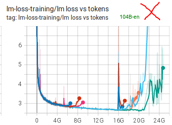
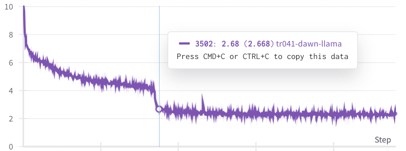
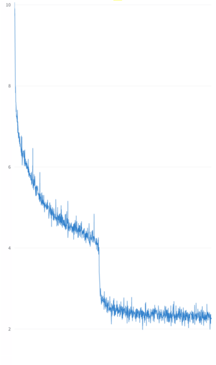
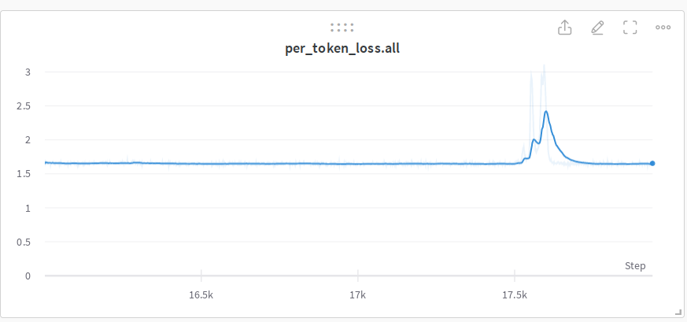
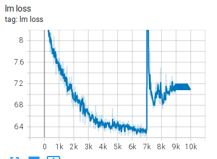
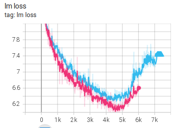
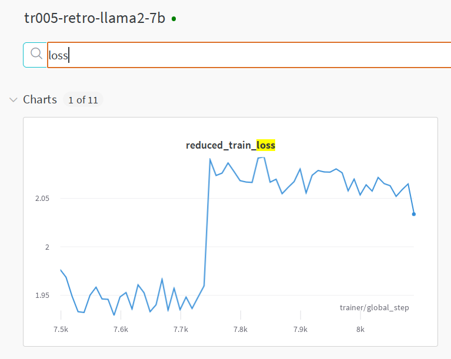
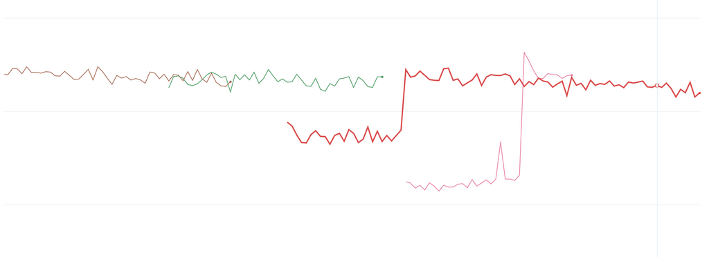

# Understanding Training Loss Patterns

Training loss plot is similar to the heart beat pattern - there is the good, the bad and you-should-worry one. After studying many training loss trajectories one develops an intuition to explain various loss behaviors during one's training and how to act on those.

I warn you that the "Understanding" in the title of this section is overloaded since very often we don't really understand why certain types of spikes happen. Here "understanding" refers to recognizing various patterns. We then usually have techniques to overcome the bad patterns and bring the training successfully to the finish line.

Thus you will find here a gallery of training loss patterns sometimes with real explanations, but more often than not educated guesses to what might be happening.

Please excuse the plot snapshots looking wildly different from each other as they have come from many sources over multiple years.

## The good, the bad and the unexpected

Let's look at some good, bad and unusual patterns.

### A very failed training

Prior to starting BLOOM-176B training we did multiple experiments with the [104B model](https://github.com/bigscience-workshop/bigscience/tree/master/train/tr8-104B-wide). We failed to figure out how to not diverge very early on.

As you can see many attempts were made, many techniques were applied (see [chronicles](https://github.com/bigscience-workshop/bigscience/blob/master/train/tr8-104B-wide/chronicles.md). We think the 2 main obstacles were using fp16 and data that had a lot of garbage in it. For BLOOM-176B we switched to bf16, used much cleaner data and also added an embedding layer-norm and that made all the difference.

### An almost perfect training

The [BLOOM-176B](https://github.com/bigscience-workshop/bigscience/tree/master/train/tr11-176B-ml) training had a close to perfect training loss trajectory, with a single spike that has recovered in 200 steps.

You can inspect the [TB](https://huggingface.co/bigscience/tr11-176B-logs/tensorboard) to zoom in and check other plots.

This was the almost perfect training indeed. Lots of hard work was put into achieving this.

### The grokking moment

Recently I was doing some performance testing and run a tiny global batch size of 8 on 8x A100 nodes on llama-2-7b trained from scratch. (w/ Deepspeed ZeRO-3 DP using HF Transformers [Llama](https://github.com/huggingface/transformers/tree/main/src/transformers/models/llama) implementation)

Here one can observe a rapid loss improvement from 4 to 2.5 in just 480 samples after a very steady much slower improvements. My colleague [Gautam Mittal](https://github.com/gmittal) called it the [grokking](https://en.wikipedia.org/wiki/Grok) moment. In just a handful of steps the model suddenly generalized to much better predict the masked tokens.

Normally one doesn't see such a dramatic improvement when using a much larger batch size.

If we zoom in it took about 60 8-sample per iteration steps:

## Main types of loss spikes

In general there are 3 types of loss spikes:

1. Fast recovering spikes
2. Slow recovering spikes
3. Not fully recovering spikes

The spikes usually happen because of a bad data pocket, either due to badly shuffled data or because it hasn't been cleaned from some garbage scraped from the websites.

While one would suspect that the batch before the spike was the trigger, but if you were to study that batch's contents you are likely to find nothing unusual - quite often the problem starts developing many steps before and then most of the sudden it happens. But also it might not be easy to study the batch, since it could amount to a size of a book when the global batch size and the sequence lengths are huge.

### Fast recovering spikes

Loss spikes can happen often and as long as they quickly bounce back to where they left off the training usually continues as if nothing happened:

Here is an example of [the 13B pre-BLOOM training experiment](https://github.com/bigscience-workshop/bigscience/tree/master/train/tr1-13B-base):

As you can see there are many spikes, some of a huge magnitude but they have all quickly recovered.

### Slow recovering spikes

Here is a slow recovering spike from the [IDEFICS-80B](https://github.com/huggingface/m4-logs/blob/master/tr-190-80b/chronicles.md) training:

### Not fully recovering spikes

This [104B model attempt](https://github.com/bigscience-workshop/bigscience/tree/master/train/tr8-104B-wide) spiked, started recovering but decided to not recover fully and instead started diverging

Here is another example from the [IDEFICS-80B](https://github.com/huggingface/m4-logs/blob/master/tr-190-80b/chronicles.md) training:

### Non-spike diverging

Here are a few examples of diverging that didn't go through a spike

and here are a few more:

as you can see each restart makes a bit of progress and then the model diverges.

All these are from the [104B model attempts](https://github.com/bigscience-workshop/bigscience/tree/master/train/tr8-104B-wide).

### Multiple datasets spikes

During the [IDEFICS-80B](https://github.com/huggingface/m4-logs/blob/master/tr-190-80b/chronicles.md) training we were using 2 different dataset types mixed together:

Legend: cm4 (high), average (mid) and pmd (low)

You can see that the loss spikes were sometimes happening simultaneously on both datasets and at other times only one of the datasets loss would spike.

Here the model was learning two different data distributions and as you can see it was not reporting the same loss and the spike behaviors on both data distributions. The pmd datasets loss was much easier for the model than the cm4 one.

## Resume-related spikes

Training resume due to a hardware crash or because a need to rollback to an earlier checkpoint due to encountering a divergence is pretty much guaranteed to happen. If your training software doesn't resume perfectly so that the model doesn't notice there was a resume various problems could be encountered.

The most complicated challenge of resume is restoring various RNGs, getting to the DataLoader index where the previous training was restored, and dealing with various other requirements if you use complex DataLoaders that are specific to your setup.

### DataSampler related issues

During [IDEFICS-80B](https://github.com/huggingface/m4-logs/blob/master/tr-190-80b/chronicles.md) training we had a very complicated DataLoader which was suffering from image to text ratio fluctuations when the DataLoader was getting restored on resume, so we ended up having a small spike on each resume which would then recover:

You can see the loss and ratio plots correlation here. As we had to resume about a dozen times we saw a lot of those spikes.

### Impacts of repeat data

I was training a variation of Llama2 and saw this super unusual spike that didn't diverge or recover but which switched to a new higher loss level:

I rolled back to just before the weird behavior occurred and restarted. The loss training progressed at the same loss level for a bit and then again spiked and shifted to a higher loss.

I have never seen this type of divergence before. I was scratching my head for a while and then decided to look at the bigger picture.

As of this writing [Wandb](https://wandb.ai/) doesn't handle resume data plotting correctly if a rollback was performed, that is it ignores all new data after the rollback until the steps of the old data have been overcome. This forces us to start a new wandb plot for every resume with a rollback so that new data is shown. And if you needs to see the whole plot you have to stitch them and which includes dead data points that are no longer true. So I did the stitching and saw this puzzle:

There was no real spike in the two earlier runs. The loss never went up in the first place. In both resumes it was under-reporting loss due to an exactly repeated data and then it reached data it hasn't seen before and started reporting correctly. In other words it was overfitting and reporting a false loss.

The cause of the problem is data repetition, and since it clearly memorised some of it it was reporting a better loss.

The problem comes from [pytorch-lightning](https://github.com/lightning-ai/lightning) not handling resumes correctly wrt DataSampler automatically - basically every time you resume you start your data stream from scratch. This, of course, requires a user to somehow fix the situation. You could change the seed to somewhat ameliorate the situation and avoid the exact data sequence, but it still leaves you with repeat data, which isn't what you want for any serious training (or ablation experiments, since your observation will be invalid, if they assume [IID data distribution](https://en.wikipedia.org/wiki/Independent_and_identically_distributed_random_variables).

footnote: I discussed [this issue with the PTL developers](https://github.com/Lightning-AI/lightning/issues/18780) and they said that they tried hard to come up with a generic solution but it wasn't meant to be. So the user needs to figure it out.

Make sure to check your training framework documentation whether it handles the DataSampler resuming correctly. Make sure you didn't discover this problem after the training has finished and you ended up training 6x times the same 50B of tokens from the planned 300B tokens seen only once each.

Doing a couple of resumes early on before embarking on the real training should also expose if there is a problem. Albeit, if the data gets reshuffled on each resume you are unlikely to see it. It'll only be seen if the seed is the same.
