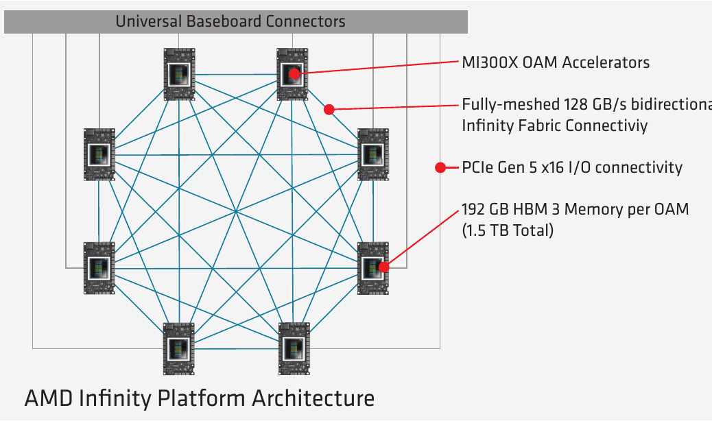
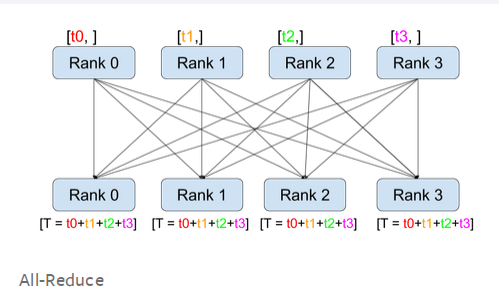
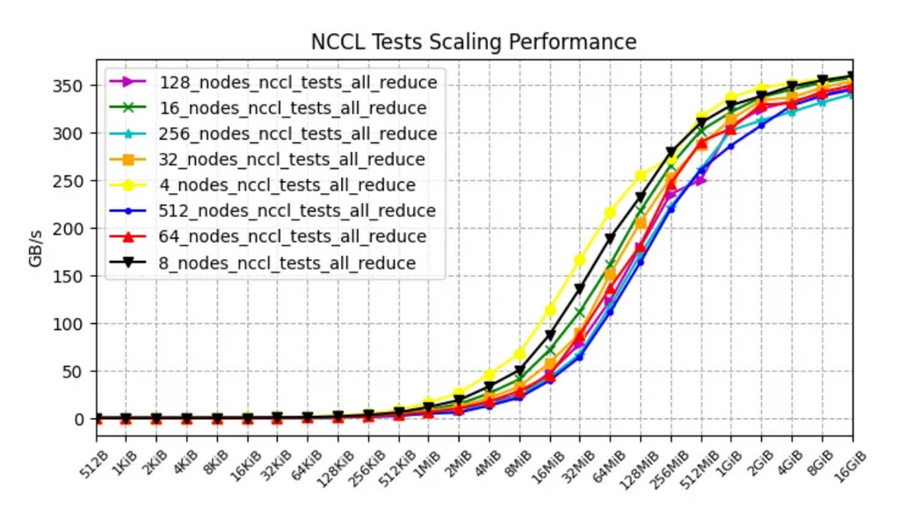
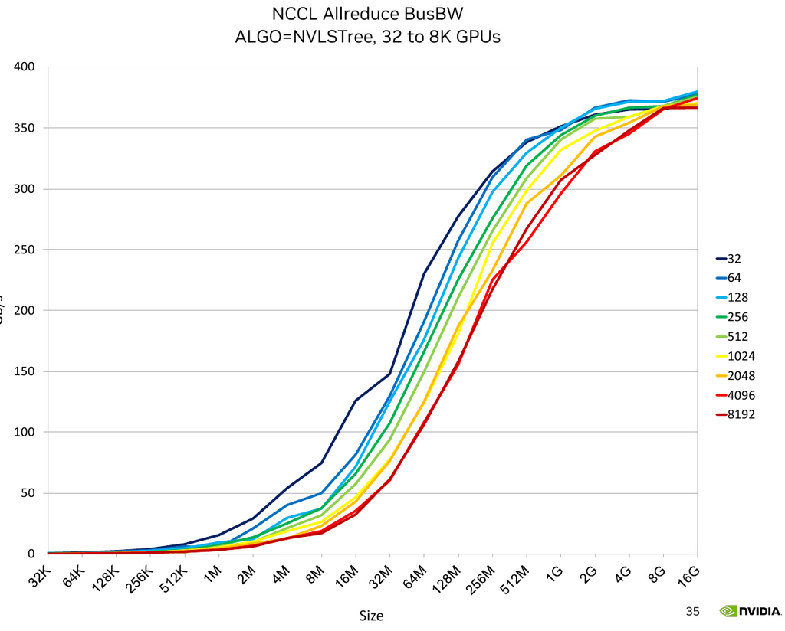
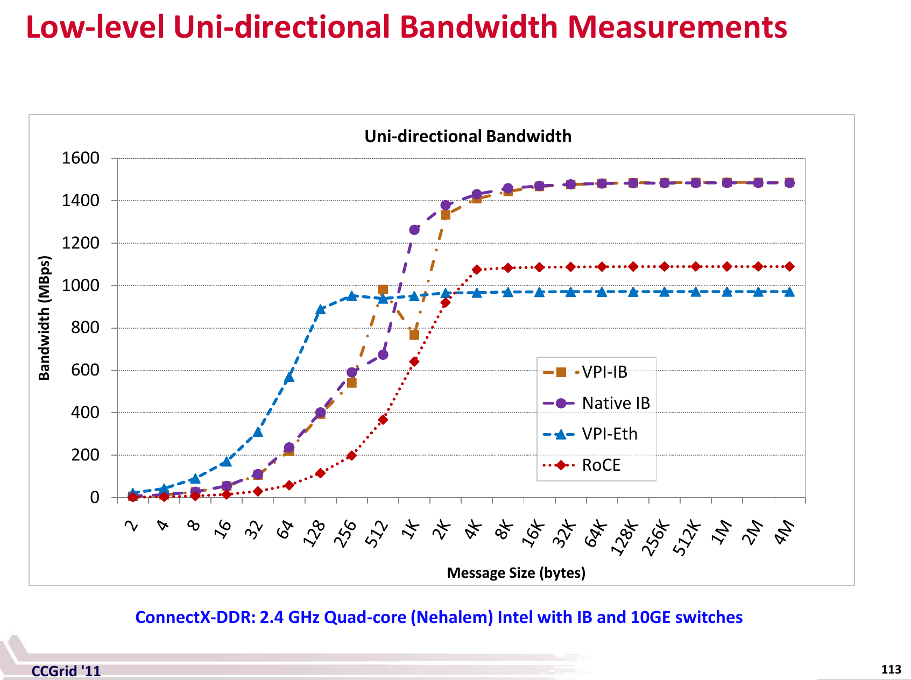

# Inter-node and Intra-Node Networking Hardware

**Subsections**:

- [Communication Patterns](comms.md)
- [Network Debug](debug)
- [Network Benchmarks](benchmarks)

## Introduction

It's not enough to buy/rent expensive accelerators to train and infer models fast. You need to ensure that your [storage IO](../storage), [CPU](../compute/cpu) and network are fast enough to "feed the accelerator furnace". If this is not ensured then the expensive accelerators will be underutilized leading to lost $$, slower training time and inference throughput. While it can be any other of the mentioned components, the network is often the bottleneck during the training (assume your DataLoader is fast).

If your model fits on a single accelerator, you have little to worry about. But nowadays most models require several accelerators to load and LLM/VLM models require multiple compute nodes for training and some even for inference.

Most compute nodes contain 8 accelerators, some 4, others 16, and even more accelerators and recently there are some that have one super-accelerator per node.

When the model spans several accelerators and doesn't leave a single node all you need to worry about is fast [Intra-node networking](#intra-node-networking). As soon as the model requires several nodes, which is often the case for training as one can use multiple replicas to parallelize and speed up the training, then fast [Inter-node networking](#inter-node-networking) becomes the key.

This article covers both types of networking hardware, reports their theoretical and effective bandwidths and explains how they inter-play with each other.

## Glossary and concepts

You can safely ignore the many concepts and abbreviations listed here until you need them and then return here.

- ALU: Arithmetic Logic Units
- AR: Adaptive Routing (but also could mean Aggregation Router)
- DMA: Direct Memory Access
- EFA: Elastic Fabric Adapter
- HCA: Host Channel Adapter
- IB: Infiniband
- MFU: Model Flops Utilization (e.g. `mfu=0.5` at half-precision on A100 comes from getting 156TFLOPs, because peak half-precision spec is 312TFLOPS, and thus `156/312=0.5`)
- NIC: Network Interface Card
- OPA: Omni-Path Architecture
- OPX: Omni-Path Express
- OSFP: Octal Small Form Factor Pluggable (transceiver)
- RDMA: Remote Direct Memory Access
- RoCE: RDMA over Converged Ethernet
- RoE: RDMA over Ethernet
- SHARP: Scalable Hierarchical Aggregation Reduction Protocol
- VPI: Virtual Protocol Interconnect
- xGMI: Socket to Socket Global Memory Interface

Speed-related:
- Unidirectional: a transmission from one point to another in one direction A -> B
- Bi-directional, Duplex: a transmission from one point to another in both directions A <-> B, typically 2x speed of unidirectional
- GBps, GB/s: Gigabytes per secs (1GBps = 8Gbps) transferred in a channel
- GT/s: GigaTransfers per second - the number of operations transferring data that occur in each second.
- Gbps, Gb/s: Gigabits per secs (1Gbps = 1/8GBps) transferred in a channel
- Bisection Width: minimum number of links cut to divide the network into two parts (not necessarily equal). The bandwidth of those links is known as Bisection Bandwidth - which is often used as a metric for real network bandwidth). Sometimes it's referred to as the worst-case network capacity. Here is a [good answer](https://networkengineering.stackexchange.com/a/29662/93656) that explains this and related concepts, but it's unlikely you need to understand this other than knowing what is being meant, as chances are your cluster's topology has already been done by the provider.
- Adaptive Routing improves Static routing to enable out of order packets on the network. Packets are load balanced at each switch to better distribute the network workload.
- [Remote Direct Memory Access](#rdma-networking)

footnote: In the following sections pay close attention that 1GBps = 8Gbps.


### Unidirectional vs Bidirectional (Duplex)

Most benchmarking / bandwidth measurement tools will report a unidirectional bandwidth. So be careful when you look at unidirectional vs. bidirectional (duplex) speeds. Typically the latter is ~2x faster.

If you measure the bandwidth on your setup and it's about 40% of the advertised speed, carefully check if the advertised speed said duplex and if so half that and then your measured bandwidth should now be about 80% which is expected.

case study: for a while I couldn't understand why when I run the nccl-tests all_reduce benchmark on an A100 node with advertised 600GBps intra-node speed I was getting only 235GBps (40%) until Horace He kindly pointed out that I should be looking at unidirectional speed which is 300GBps, and then I get 80% of the theoretical spec which checks out.


## Cluster networks

Each node of the cluster has 3 networks, each running at a very different speed from each other.

1. [Frontend](#frontend-networking)
2. [Backend](#backend-networking)
3. [Out-of-band](#out-of-band-networking)

### Frontend networking

Frontend networking is typically for the Internet connection (e.g. downloading python packages and offloading to the cloud storage), distributed network storage (e.g. checkpoints and datasets) and orchestration (e.g. SLURM and Kubernetes). As of this writing a typical node is likely to have a single 100-400Gbps connection.

footnote: not all clusters will have external Internet connection available, e.g. many HPC environments only provide external access via special cpu-only nodes.

### Backend networking

Backend networking is to perform GPU-to-GPU connectivity which allows training and inference to scale to multiple accelerators (e.g. all-reduce, all-gather and other collective comms). This is the most important part of the AI cluster. Typically this would be either an [Infiniband](#infiniband) or [RoCEv2 Ethernet](#rdma-networking). It then breaks down into [intra-node networking](#intra-node-networking) and [inter-node networking](#inter-node-networking) - the GPUs on the same node typically can communicate with each other at faster speed than with GPUs on other nodes. Here the typical top speeds as of this writing would be around 5600Gbps for intra-node and 3200Gps per node for inter-node networking. There will be at least one backend connection per accelerator and at times there can be multiple connections per accelerator, especially if low bandwidth NICs are used.

footnote: not all providers will match the industry's standard networking speeds - on some the inter-node networking speed could be up to 10x slower. So always check what you get.

### Out-Of-Band networking

Out-Of-Band (OOB) networking is used for bootstraping backend networking, monitoring node's health, remote re-imaging of the nodes, etc. It typically uses a single slow 1Gbps ethernet connection.


## RDMA networking

Remote Direct Memory Access is like DMA (Direct Memory Access) on the node, but across nodes. It allows data exchange between nodes w/o the overhead using the local processor, OS kernel and caches, which is what TCP/IP uses. The 3 main implementations are:

1. Infiniband
2. RDMA over Converged Ethernet (RoCE) (IB or UDP-based RDMA)
3. iWARP (TCP-based RDMA)

Here is a [good overview article](https://community.fs.com/article/roce-vs-infiniband-vs-tcp-ip.html).


## Intra-node networking

This is also known as scale-up networking.

There are multiple platforms/solutions out there that provide intra-node networking:

1. Generic: [PCIe](#pcie)
2. NVIDIA: [NVLink](#nvlink) and [NVSwitch](#nvswitch)
3. AMD: [Infinity Fabric](#infinity-fabric--xgmi)
4. Intel: [Gaudi2](#gaudi2), [Gaudi3](#gaudi3)

### All-to-all bandwidth

Here is intra-node unidirectional theoretical all-to-all peak bandwidth cross-comparison for current solutions sorted by bandwidth:

| Interconnect    | Accelerator |  GBps |
| :-------------- | :---------- | ----: |
| NVIDIA NVLink 5 | B200, B*    | 900.0 |
| Intel           | Gaudi3      | 600.0 |
| NVIDIA NVLink 4 | H100, H*    | 450.0 |
| AMD XGMI        | MI325X      | 448.0 |
| AMD XGMI        | MI300X      | 448.0 |
| AMD XGMI        | MI250X      | 350.0 |
| NVIDIA NVLink 3 | A100        | 300.0 |
| Intel           | Gaudi2      | 300.0 |
| PCIe 5          |             |  63.0 |
| PCIe 4          |             |  31.0 |

Notes:

* NVSwitch operates at the same speed as NVLink of that generation. See [NVSwitch](#nvswitch).
* Pay close attention to when the spec says unidirectional vs bidirectional (duplex) speeds - if you read an online spec and it doesn't explicitly declare the directionality - look for an answer. I had to research many docs to figure it out in some of the tables below as some vendors omit this crucial information in the published specs. I even had to edit a few wiki pages to add the missing information. Remember that for the vendors the bigger, the better so almost always they will use the duplex number, which is typically 2x bigger than the unidirectional one.


### Peer-to-peer bandwidth

Some vendors have their all-to-all and peer-to-peer (GPU-to-GPU) bandwidth the same, while others don't. For example, AMD MI3\* are 64GBps GPU-to-GPU (peer-to-peer), but 448GBps in total on a board of 8 accelerators, since `64*7=448`.

Here is the intra-node unidirectional theoretical peer-to-peer peak bandwidth cross-comparison for current solutions sorted by bandwidth:

| Interconnect    | Accelerator |  GBps |
| :-------------- | :---------- | ----: |
| NVIDIA NVLink 5 | B200, B*    | 900.0 |
| Intel           | Gaudi3      | 600.0 |
| NVIDIA NVLink 4 | H100, H*    | 450.0 |
| NVIDIA NVLink 3 | A100        | 300.0 |
| Intel           | Gaudi2      | 300.0 |
| AMD XGMI        | MI325X      |  64.0 |
| AMD XGMI        | MI300X      |  64.0 |
| AMD XGMI        | MI250X      |  50.0 |

When peer-to-peer bandwidth is much lower than all-to-all it means that if you don't use all of the accelerators on the node by the same application, you will end up with a much lower bandwidth and your application will have a performance impact if the accelerators have to communicate between each others.

To validate this the [all_reduce_bench.py](benchmarks/all_reduce_bench.py) was run on a 8x GPU AMD MI300X node with a 4GB payload and the `busbw` measurements were:

- 2 GPUs:  47.671 GBps
- 8 GPUs:  312.912 GBps

i.e. 2 GPUs performed 6.5x slower than 8.

So if you have you to deploy TP=2, TP=4, or ZeRO-DP/FSDP over 2 or 4 GPUs, be it training or inference, the network will become a bottleneck. If you use TP=1 or TP=8 or ZeRO-DP/FSDP over 8 GPUs, or DP over 1-GPU replicas there is no problem. (If you're not sure what TP/ZeRO-DP/DP mean please see [model-parallelism](../training/model-parallelism).)

You will find the details analysis of each technology in the following sections.


### PCIe

[PCIe](https://en.wikipedia.org/wiki/PCI_Express) is a high-speed serial computer expansion bus standard that can be found even on the cheapest computer desktop.

| Interconnect | Lane/Direction | Lanes | Unidirection | Duplex   |
| :----------  | -------------: |  ---: | ----------:  | ------:  |
| PCIe 4       |  ~2.0 GBps     |    16 |  31 GBps     |  62 GBps |
| PCIe 5       |  ~4.0 GBps     |    16 |  63 GBps     | 126 GBps |
| PCIe 6       |  ~7.5 GBps     |    16 | 121 GBps     | 242 GBps |
| PCIe 7       | ~15.0 GBps     |    16 | 242 GBps     | 484 GBps |

If one compares the latest generations of different intra-node networking technologies (see the following sections) PCIe is usually an order of magnitude behind.


### NVLink

- [NVLink](https://en.wikipedia.org/wiki/NVLink) is a wire-based serial multi-lane near-range communications link developed by Nvidia. Here is the [What Is NVLink](https://blogs.nvidia.com/blog/what-is-nvidia-nvlink/) blog post with more background on it.

I found the NVLink wiki page to be quite difficult to follow, so I will try to help bring clarity into this. And I'm pretty sure as of this writing some of the numbers on that wiki page are bogus and it doesn't look like NVIDIA maintains that page.

Effective payload rate of intra-node GPU-to-GPU communication hardware:

| Interconnect | Lane/Direction | Lanes | Links | Unidirection | Duplex     | GPU               |
| :----------- | -------------: | ----: | ----: | -----------: | ---------: | :---------------- |
| NVLink 1     | 2.50 GBps      |     8 |     4 | 80 GBps      | 160 GBps   | P100              |
| NVLink 2     | 3.125 GBps     |     8 |     6 | 150 GBps     | 300 GBps   | V100              |
| NVLink 3     | 6.25 GBps      |     4 |    12 | 300 GBps     | 600 GBps   | A100              |
| NVLink 4     | 12.50 GBps     |     2 |    18 | 450 GBps     | 900 GBps   | H100, H200, GH200 |
| NVLink 5     | 25.00 GBps     |     2 |    18 | 900 GBps     | 1800 GBps  | B200, B\*, GB\*   |

There is a good overview of evolution of NVLink (1 to 4) [here](https://www.naddod.com/blog/unveiling-the-evolution-of-nvlink).

The largest PCIe 16x slot has 16 lanes. Smaller slots have less lanes, 1x == 1 lane.

NVIDIA Hopper nodes typically come equipped with PCIe 5 and NVLink 4. So there NVLink is 7x faster than PCIe.

NVIDIA Blackwell nodes will be equipped with PCIe 5 and NVLink 5. So there NVLink will be 14x faster than PCIe.

Let's look at several examples of nodes and correlate the theory with reality.

If you use multiple GPUs the way cards are inter-connected can have a huge impact on the total training time. If the GPUs are on the same physical node, you can run:

```
nvidia-smi topo -m
```

and it will tell you how the GPUs are inter-connected.

On a machine with dual-GPU and which are connected with NVLink, you will most likely see something like:

```
        GPU0    GPU1    CPU Affinity    NUMA Affinity
GPU0     X      NV2     0-23            N/A
GPU1    NV2      X      0-23            N/A
```

on a different machine w/o NVLink you may see:
```
        GPU0    GPU1    CPU Affinity    NUMA Affinity
GPU0     X      PHB     0-11            N/A
GPU1    PHB      X      0-11            N/A
```

The report includes this legend:

```
  X    = Self
  SYS  = Connection traversing PCIe as well as the SMP interconnect between NUMA nodes (e.g., QPI/UPI)
  NODE = Connection traversing PCIe as well as the interconnect between PCIe Host Bridges within a NUMA node
  PHB  = Connection traversing PCIe as well as a PCIe Host Bridge (typically the CPU)
  PXB  = Connection traversing multiple PCIe bridges (without traversing the PCIe Host Bridge)
  PIX  = Connection traversing at most a single PCIe bridge
  NV#  = Connection traversing a bonded set of # NVLinks
```

So the first report `NV2` tells us the GPUs are interconnected with 2 NVLinks, and the second report `PHB` we have a typical consumer-level PCIe+Bridge setup.

Check what type of connectivity you have on your setup. Some of these will make the communication between cards faster (e.g. NVLink), others slower (e.g. PHB).

Depending on the type of scalability solution used, the connectivity speed could have a major or a minor impact. If the GPUs need to sync rarely, as in DDP, the impact of a slower connection will be less significant. If the GPUs need to send messages to each other often, as in ZeRO-DP, then faster connectivity becomes super important to achieve faster training.

Now, let's look at the topology of the A100 and H100 nodes:


- A100 topology:

```
$ nvidia-smi topo -m
      GPU0  GPU1  GPU2  GPU3  GPU4  GPU5  GPU6  GPU7  CPU Affinity  NUMA Affinity
GPU0   X    NV12  NV12  NV12  NV12  NV12  NV12  NV12   0-23         0
GPU1  NV12   X    NV12  NV12  NV12  NV12  NV12  NV12   0-23         0
GPU2  NV12  NV12   X    NV12  NV12  NV12  NV12  NV12   0-23         0
GPU3  NV12  NV12  NV12   X    NV12  NV12  NV12  NV12   0-23         0
GPU4  NV12  NV12  NV12  NV12   X    NV12  NV12  NV12  24-47         1
GPU5  NV12  NV12  NV12  NV12  NV12   X    NV12  NV12  24-47         1
GPU6  NV12  NV12  NV12  NV12  NV12  NV12   X    NV12  24-47         1
GPU7  NV12  NV12  NV12  NV12  NV12  NV12  NV12   X    24-47         1
```
You can see there are 12 NVLinks and 2 NUMA Groups (2 CPUs w/ 24 cores each)

- H100 topology:
```
$ nvidia-smi topo -m
      GPU0  GPU1  GPU2  GPU3  GPU4  GPU5  GPU6  GPU7  CPU Affinity  NUMA Affinity
GPU0   X    NV18  NV18  NV18  NV18  NV18  NV18  NV18   0-51         0
GPU1  NV18   X    NV18  NV18  NV18  NV18  NV18  NV18   0-51         0
GPU2  NV18  NV18   X    NV18  NV18  NV18  NV18  NV18   0-51         0
GPU3  NV18  NV18  NV18   X    NV18  NV18  NV18  NV18   0-51         0
GPU4  NV18  NV18  NV18  NV18   X    NV18  NV18  NV18  52-103        1
GPU5  NV18  NV18  NV18  NV18  NV18   X    NV18  NV18  52-103        1
GPU6  NV18  NV18  NV18  NV18  NV18  NV18   X    NV18  52-103        1
GPU7  NV18  NV18  NV18  NV18  NV18  NV18  NV18   X    52-103        1
```
You can see there are 18 NVLinks and 2 NUMA Groups (2 CPUs w/ 52 cores each)

Of course, other A100 and H100s node reports may vary, e.g. the number of cpu cores is likely to be different.


### NVSwitch

[NVSwitch](https://www.nvidia.com/en-us/data-center/nvlink/) can connect more than 8 GPUs at the speed of [NVLink](#nvlink). It's advertised to connect up to 256 GPUs in the future generations of the switch.

The benefit of connecting more than 8 GPUs at the speed of NVLink is that it allows all-to-all GPU communications at a much faster speed than any intra-node hardware can provide. And with ever increasing compute speeds the network is the likely bottleneck leading to underutilized super-expensive GPUs.

For example, in the universe of Tensor Parallelism (Megatron), one doesn't use TP degree of more than 8, because TP is only efficient at NVLink speed. ZeRO-DP (Deepspeed/FSDP) would also run much faster if the whole cluster uses NVLink speed and involves no slow inter-node connections.

NVSwitch is used for intra-node connectivity.

NVSwitch gen 1 came out with V100, gen 2 with A100, gen 3 with H100, and gen 4 with B200 - the speed corresponds to the NVLink version of the same technology.

The [NVIDIA DGX H100](https://developer.nvidia.com/blog/upgrading-multi-gpu-interconnectivity-with-the-third-generation-nvidia-nvswitch/) has a 3.6 TBps of full-duplex NVLink Network bandwidth provided by 72 NVLinks (NVLink 4). The normal NVLink 4 has 18 NVLinks (0.9 TBps duplex). So this setup has 4 switches (`18*4=72`) and therefore `0.9*4=3.6` TBps. Note, that this server has 8 GPUs, so here we get a much faster intra-node communications as compared to the standard NVLink 4.0 which provides only 0.9 TBps all-to-all connectivity for 8 GPUs.

NVIDIA DGX A100 has 6 switches of 12 NVLinks for a total of 72.

[DGX H100 SuperPOD](https://developer.nvidia.com/blog/upgrading-multi-gpu-interconnectivity-with-the-third-generation-nvidia-nvswitch/) combines 32 DGX H100 servers, for a total of 256 GPUs. It looks like here they use only half the NVLinks they used for a single DGX H100, so only 1.8 TBps per node, for a total of 57.6 TBps in total.

Additionally, NVSwitch gen3 and higher comes with [NVIDIA Scalable Hierarchical Aggregation Reduction Protocol (SHARP)](#sharp) which can boost both the intra- and inter-node speeds. For example, NCCL is working on `NCCL_ALGO=NVLS` which already boosts the intra-node bandwidth above the normal spec and as of this writing work is being done to boost inter-node bandwidth as well.

Recently [GB200 NVL72](https://www.nvidia.com/en-us/data-center/gb200-nvl72/) has been introduced, which uses NVSwitch to put 72 Blackwell GPUs into a single node all inter-connected at NVLink 5 900GBps unidirectional speed. So instead of having a 8-gpu node, now we have a 72-gpu node (even though physically they don't all reside on the same board).

### Infinity Fabric / xGMI

AMD MI* Accelerators intra-node communication is performed by AMD Infinity Fabric, which is also known as xGMI (Socket to Socket Global Memory Interface).

This is AMD's answer to [NVLink](#nvlink).

The following is the all-to-all bandwidth.

| Interconnect  | Link/Direction | Links | Unidirection | Duplex     |
|               | peer-to-peer   |       | all-to-all   | all-to-all |
| :------------ | -------------: | ----: | -----------: | ---------: |
| MI325X        | 64 GBps        |     7 | 448 GBps     | 896 GBps   |
| MI300X        | 64 GBps        |     7 | 448 GBps     | 896 GBps   |
| MI250X        | 50 GBps        |     7 | 350 GBps     | 700 GBps   |
|               |                |       |              |            |
| MI355X        | ??             |       |              |            |

The peer-to-peer bandwidth is just that of a single link/direction (the 2nd column). This means that unless you use the whole 8-GPU node in a single process group you will have a 7x slower comms performance. See [Peer-to-peer bandwidth](#peer-to-peer-bandwidth) for details.

Other intra-node solutions typically have the same all-to-all and peer-to-peer intra-node bandwidth, so Infinity Fabric appears to be dramatically slower. I suppose that is because these were created mainly for inference, as these slow speeds would dramatically slow down LLM training.



Platform specs:
- [MI250X](https://www.amd.com/en/products/accelerators/instinct/mi200/mi250x.html)
- [MI300x](https://www.amd.com/en/products/accelerators/instinct/mi300/platform.html)
- [MI325X](https://www.amd.com/en/products/accelerators/instinct/mi300/mi325x.html)
- MI355X ??


### Gaudi2

According to [Gaudi2 spec](https://habana.ai/wp-content/uploads/2023/10/HLS-Gaudi2_Datasheet_10_23.pdf), these nodes provide the same 100GbE RoCE v2 RDMA hardware for inter- and intra-node connectivity (24x 100Gbps per card).

- intra-node: 8x 7x3 NICs - 300Gbps card to card
- inter-node: 8x 1x3 NICS - for a total of 2.4Tbps (300GBps)

### Gaudi3

According to [Gaudi3 spec](https://www.intel.com/content/www/us/en/content-details/817486/intel-gaudi-3-ai-accelerator-white-paper.html), these nodes provide the same setup as Gaudi2 except the cards are 2x faster using 200GbE RoCE v2 RDMA  for inter- and intra-node connectivity (24x 200Gbps per card).

- intra-node: 8x 7x3 NICs - 600Gbps card to card
- inter-node: 8x 1x3 NICS - for a total of 4.8Tbps (600GBps)

### NeuronLink v3

NeuronLink v3 ([spec](https://awsdocs-neuron.readthedocs-hosted.com/en/latest/general/arch/neuron-hardware/trn2-arch.html)) is the intra-node equivalent of NVLink for AWS Trainium2, but it's a point-to-point architecture, like AMD MI* so it can't take advantage of the other Trainium2 chips' NeuronLink v3 unless they are engaged in the same process group. This technology is based on PCIe-5.0 (so 32Gbps per lane unidirectional).

NeuroLink v3 also has an inter-node use in addition to EFA v3.

Number of Trainium2 chips per node and intra-node network speeds:
- Trainium2: 16 chips interconnected at 128GBps peer-to-peer undirectional (32 PCIe lanes) and each Trainium2 connects to 3 other chips
- Trainium2 Ultra: 64 chips - the 16 chip groups are the same as non-Ultra, plus these 4 groups are interconnected at 64GBps with each other.

Like TPU it is used in a 3D Torus structure. Here different axis connect at different speeds, so the total all-to-all bandwith per chip is 640GBps unidirectional (`128GBps * 4 intra-node neighbours + 64GBps * 2 inter-node neighbours`)

When their spec suggests 1024GBps/chip intra-instance bandwidth, it is bidirectional, so only 512GBps/chip unidirectional - and it comes from `128GBps * 4 intra-node neighbours` (and only if all 4 chips are engaged).


## Inter-node networking

This is also known as scale-out networking.

As inter-node hardware used to be about of an order of magnitude slower than intra-node hardware in this universe Gbps are used instead of GBps. (1 GBps = 8 Gbps) (Though as of recent inter-node speeds are almost as fast as [intra-node](#intra-node-networking))

When it comes to inter-node networking hardware, there are the well established [InfiniBand](#infiniband) from NVIDIA and a few other players, various NVLink-based NVIDIA products and there are many new comers that mainly are coming from compute cloud providers who can't compete on the slim margin renting out someone else's hardware so they build their own (AWS EFA, GCP GPUDirect-TCPX), and there are also HPE and Cornelis Networks with recently updated products.

Here is inter-node unidirectional theoretical peak bandwidth cross-comparison for current technologies sorted by total bandwidth of common node setups:

| Interconnect         | NICs x Gbps | Total GBps | Notes     |
| :------------------- | ----------: | ---------: | :------   |
| Intel Gaudi3         |      24x200 |        600 |           |
| AWS EFA v3           |      16x200 |        400 | Tranium 2 |
| NVIDIA Quantum-2 IB  |       8x400 |        400 | H100      |
| AWS EFA v2           |      32x100 |        400 | H100      |
| Intel Gaudi2         |      24x100 |        300 |           |
| InfiniBand XDR1600   |       8x200 |        200 |           |
| GCP GPUDirect-TCPXO  |       8x200 |        200 |           |
| GCP GPUDirect-TCPX   |       4x200 |        100 |           |
| HPE Slingshot        |       4x200 |        100 |           |
| Omni-Path CN100      |       8x100 |        100 |           |
| AWS EFA v1           |       4x100 |         50 |           |
| InfiniBand NDR400    |       4x100 |         50 |           |
|                      |             |            |           |
| in the future:       |             |            |           |
|                      |             |            |           |
| Omni-Path CN5000     |       8x400 |        400 | Q2-2025   |
| InfiniBand GDR3200   |       8x400 |        400 | 2025      |
| Omni-Path CN6000     |       8x800 |        800 | 2026      |

Notes:

* these are common/popular node setups - some custom nodes may have a different configuration more often with less NICs and rarely with more NICs. And, yes, AWS EFA v2 puts 32 NICs on each node - that must be a lot of wires.
* Note how the once order-of-magnitude difference between inter- and [intra-node bandwidth](#intra-node-networking) is starting to disappear - I have recently rescaled the speeds here from Gbps to GBps.

You will find the details analysis of each technology in the following sections.

### InfiniBand

[InfiniBand](https://en.wikipedia.org/wiki/InfiniBand) (IB) has been around for a few decades so there are many available configurations that can be found out there. So that if someone says they have InfiniBand that is insufficient information. What you need to know is the signaling rate and the number of IB links.

InfiniBand is a complete network protocol that implements RDMA (bypasses TCP/IP).

Here are the most recent signaling rates which you are likely to see in the current hardware offerings:

Signaling rate of uni-directional links in Gbps:
| Links | EDR | HDR |  NDR |  XDR |  GDR |  LDR |
| ----: | --: | --: |  --: |  --: |  --: |  --: |
|     1 |  25 |  50 |  100 |  200 |  400 |  800 |
|     4 | 100 | 200 |  400 |  800 | 1600 | 3200 |
|     8 | 200 | 400 |  800 | 1600 | 3200 | 4800 |
|    12 | 300 | 600 | 1200 | 2400 | 4800 | 9600 |

Notes:
* the GDR is planned in 2025 and LDRs some years later

Latency in usecs:
| EDR | HDR | NDR | XDR | GDR | LDR |
| --: | --: | --: | --: | --: | --: |
| 0.5 | 0.6 | ??  | ??  | ??  | ??  |

`??` = NDR and later didn't publish latency data

InfiniBand provides [RDMA](https://en.wikipedia.org/wiki/Remote_direct_memory_access).

Here are some examples of NVIDIA devices with the fastest IB:

- One configuration of NVIDIA DGX H100 comes with 8x NVIDIA ConnectX-7 (CX7) Ethernet/InfiniBand ports each of 200Gbps, for a total of 1.6 Gbps to connect with other DGX servers.
- For DGX H100 SuperPOD the ConnectX-7s across all 32 DGX servers and associated InfiniBand switches provide 25.6 TBps of full duplex bandwidth for use within the pod or for scaling out the multiple SuperPODs - that is an equivalent of 0.8 TBps per node (6.4Tbps!).
- NVIDIA GB200-based solutions will come with 400Gbps or 800Gpbs NDR via Quantum-2 InfiniBand 800G switches (2x400G NDR interfaces)

According to wikipedia while [InfiniBand](https://en.wikipedia.org/wiki/InfiniBand) used to have multiple manufacturers - at the moment it's just Intel (purchased QLogic) and NVIDIA (purchased Mellanox). Also see [InfiniBand Trade Association](https://www.infinibandta.org/).

Practical links:
- [InfiniBand Utilities](https://docs.nvidia.com/networking/display/ofedv512580/infiniband+fabric+utilities) (the link could be outdated as it's versioned) - these are useful when debugging an IB setup.

### NVIDIA Quantum-2 InfiniBand

[NVIDIA Quantum-2 InfiniBand Platform](https://www.nvidia.com/en-us/networking/quantum2/) supports 400Gbps bandwidth per link, provides RDMA, includes in-network computing with [SHARP](#sharp), supports PCIe-5.

The switches can connect 64 devices at 400Gbps.


### EFA

[Elastic Fabric Adapter (EFA)](https://aws.amazon.com/hpc/efa/) is a recent inter-node networking technology created by AWS.

- EFA v1 0.4 Tbps (effective 340 Gbps for all_reduce tests) (P4 AWS instances)
- EFA v2 3.2 Tbps (since Q3-2023, P5 AWS instances - 32 100GbE (4x28G) NICs!)
- EFA v3 3.2 Tbps (since Q1-2025, P5en AWS instances - 16 200GbE (4x56G) NICs! and Trn2 AWS instances) - same theoretical speed as v2, but should be delivering a much better actual speed at real world message sizes.


### Gaudi2 (inter-node)

According to [Gaudi2 spec](https://habana.ai/wp-content/uploads/2023/10/HLS-Gaudi2_Datasheet_10_23.pdf), these nodes provide `3*8=24` NICs of 100GbE RoCE v2 RDMA for a total of 2.4Tbps of inter-node connectivity with other Gaudi2 nodes.


### Gaudi2 (inter-node)

According to [Gaudi3 spec](https://www.intel.com/content/www/us/en/content-details/817486/intel-gaudi-3-ai-accelerator-white-paper.html), these nodes provide `3*8=24` NICs of 200GbE RoCE v2 RDMA for a total of 4.8Tbps of inter-node connectivity with other Gaudi2 nodes.


According to [Gaudi2 spec](https://habana.ai/wp-content/uploads/2023/10/HLS-Gaudi2_Datasheet_10_23.pdf), these nodes provide `3*8=24` NICs of 100GbE RoCE v2 RDMA for a total of 2.4Tbps of inter-node connectivity with other Gaudi2 nodes.


### HPE Slingshot interconnect

[HPE Slingshot interconnect](https://www.hpe.com/ca/en/compute/hpc/slingshot-interconnect.html) seems to be used by HPCs. As of this writing it provides 200Gbps per link. Some HPCs use 4 of those links to build 800Gbps interconnects, and, of course, with more links will deliver a higher overall bandwidth.


### GPUDirect-TCPX

GPUDirect-TCPX is an RDMA-over-TCP software solution developed by Google for A3 instances. GPUDirect-TCPXO is a hardware-accelerated extension of TCPX available only on A3 Mega. The docs are scarce, but here is some information on [TCPX](https://cloud.google.com/compute/docs/gpus/gpudirect) and [TCPXO](https://cloud.google.com/cluster-toolkit/docs/machine-learning/a3-mega-enable-gpudirect-tcpxo).

This technology didn't catch on and will be phased out to be replaced with RoCE starting with Blackwell instances at GCP.

### Omni-Path

[Omni-Path Architecture](https://en.wikipedia.org/wiki/Omni-Path) (OPA). Originally by Intel, the technology got sold to Cornelis Networks. It's also known as Omni-Path Express (OPX).

case study: I used this technology at JeanZay HPC in France in 2022. It was only 135Gbps and while the vendor tried to fix it a year later it was still the same speed. Hopefully the issue has been resolved and the speed is much faster nowadays. Because it was so slow we had to use [Megatron-Deepspeed](https://github.com/bigscience-workshop/Megatron-DeepSpeed) for training BLOOM-176B instead of the much easier to use DeepSpeed ZeRO).

As of this writing I see that the product comes with either 100 or 200Gbps bandwidth. So it's unlikely you will see anybody offering this solution for ML workloads, unless they manage to install many NICs perhaps?

[CN-100](Cornelis Omni-Path Accelerated Host Fabric Adapter CN-100HFA) 100Gbps NICs have been around for many years now.

[CN5000](https://www.cornelisnetworks.com/solutions/cornelis-cn5000/) 400Gbps NICs will be launched by Cornelis Networks in Q2-2025. One upcoming MI300X setup uses 8x of these for 3200Gbps of total unidirectional inter-node bandwidth.

Omni-Path provides [RDMA](https://en.wikipedia.org/wiki/Remote_direct_memory_access).


### Ultra Accelerator Link (UALink)

[The UALink initiative](https://www.google.ca/search?q=Ultra+Accelerator+Link) is an attempt to create an open standard to compete with [NVLink](#nvlink). Supposedly it'll be based on AMD's [Infinity Fabric](#infinity-fabric--xgmi). As of this writing there is no actual hardware to speak of.


## Other essential network technologies

### SHARP

NVIDIA [Scalable Hierarchical Aggregation and Reduction Protocol (SHARP)](https://docs.nvidia.com/networking/display/sharpv300) - allows performing data reductions and aggregations on the network itself (in-network computing). This is very useful if you do a lot of MPI, NCCL and other network collectives that support SHARP, as those should get their latencies much improved.

To understand the importance of this technology - for all-reduce operations, instead of 2N sends, it will only need N+1 sends - so for a large N - it almost doubles the effective all-reduce throughput. (N is the number of communicating ranks/gpus). For details see [all-reduce operation compatibility](https://developer.nvidia.com/blog/upgrading-multi-gpu-interconnectivity-with-the-third-generation-nvidia-nvswitch/) (you'd have to scroll down to get to that section).

Recent NCCL versions will automatically use this technology if it is available.

The SHARP hardware that is part of the NVSwitch or Infiniband switches includes arithmetic logic units (ALU) that perform the compute directly rather than using GPUs. It's said that it can perform math in FP64, FP32, FP16 and BF16 dtypes.

case study: I discovered SHARP accidentally when an H100 intra-node NVLink 4.0 [all-reduce](benchmarks/all_reduce_bench.py) benchmark reported 480GBps for a 4GB payload when the theoretical spec was only 450GBps! We figured out it's because NCCL turned on the new `NVLS` algo as it detected Infiniband SHARP. I still don't understand how it clocked speed faster than what the physical medium allows. I'm pretty sure that `busbw` calculation algorithm needs to be adjusted there from 2N to N+1 to get the real speed. There is a detailed discussion about this [here](https://github.com/NVIDIA/nccl-tests/issues/153#issuecomment-1628415956). Bottom line: `busbw` may or may not be giving you the real bandwidth number depending on the `algo` NCCL chose to use, where only when `Ring` algo is used the `busbw` is correct.

## Understanding why inter-node network speed is of a huge importance

This is probably one of the most important multi-segment section that you really want to understand well. While it seeks out to show how important the inter-node speed is, to build up the case it'll teach on the way many important training-related concepts.

### The basics

First, let's get a bit of a feeling what all those Gbps/GBps practically mean.

If your model is 80B parameter large, and you need to transmit every parameter or a gradient on the network even once in float32 (fp32) format, which requires 4 bytes per parameter, so you need to send `80*4` 320GB of data, or 2560Gb (`*8`). If your network's bandwidth is 200Gbps it will take 12.8 seconds (`2560/200`) to transmit. And if you had 1600Gbps network then it'd take only 1.6 seconds. Why does it matter?

### 1-GPU training

Let's start with a much smaller model of say 2B params, to train it you'd need at least [18 bytes per parameter](../training/performance/README.md#anatomy-of-models-memory-usage) in mixed half precision. So `18*2` 36GB of memory just for model weights, optimizer states and gradients. Plus you need additional memory for activations and it'll depend on the batch size and sequence length. But with 80GB A100 GPU we can definitely train this model on a single GPU.

We then assume for the moment that the DataLoader is fast enough to be negligible in duration compared to the compute time. And thus we get a close to a perfect MFU (Model FLOPs Utilization):

```
[DL][  compute  ][DL][  compute  ][DL][  compute  ]
---------------------------------------------------> time
|<--iteration-->||<--iteration-->||<--iteration-->|
```

which means that the GPU just needs to do many matmuls and it'd do it amazing fast. In this situation you get the highest ROI (Return on Investment).

### Single node training

The previous situation was fantastic due to the close to perfect MFU, but you realize that the training on a single GPU is going to take quite some time, since we are in AI race you'd probably want to finish the training sooner than later. So you'd ask - can I train the model on 8 GPUs instead, and the answer would be - yes, of course. With one caveat - at the end of each iteration you'd need to sync the gradients between the 8 processes (each process for a single GPU), so that each participating process of the training can benefit from what the other 7 have learned during the last iteration.

footnote: You could, of course, use less than 8 GPUs, it is just that most NVIDIA GPU-based compute nodes these days have 8 GPUs so why not get the best return on investment.

footnote: in the ideal world the training on 1 GPU for 8 durations of time, should cost the same as training on 8 GPUs for 1 duration of time. That's one would expect to spend the same $$ and to finish 8 times faster. But because of data synchronization requirements, this is not the case.

If the experimental model still contains 2B params like in the previous section and grads are in fp32 then the training program needs to send 8GB (`2B * 4B`) of data on every iteration. Moreover, since syncing the gradients requires an [`all_reduce` collective](https://pytorch.org/tutorials/intermediate/dist_tuto.html#collective-communication) collective - it needs to transmit the data twice - the first time sending the gradient data by each GPU, computing the sum of gradients and send this value back to each participating GPU so that each training process will benefit from the learning advancements each of its peers made in the last iteration.

Here is the all-reduce collective visualized:



([source](https://pytorch.org/tutorials/intermediate/dist_tuto.html#collective-communication))

So we need to send 8GB twice, which means we need to send 16GB of data.

footnote: and to be exact the 2x comms volume for all-reduce is really `2*(n-1)/n` where n is the number of participating GPUs. So if n=2, the coefficient is just 1 since `2*(2-1)/2=1` and 1.75 for n=8 since `2*(8-1)/8=1.75` and it becomes already very close to 2 at n=64.

footnote: there is also the important issue of latency of the network - which is multiplied several times due to how data is gathered from all participating GPUs. But, given that here we are moving a very large payload the latency contributes a very small overhead and for simplicity can be ignored.

How long will it take to send 16GB of data?

- A100 @ 300GBps: `16/300` = 0.053 secs
- H100 @ 450GBps: `16/450` = 0.035 secs

which is incredibly fast!

And here is how our timeline will look like:

```
[DL][  compute ][comms][DL][  compute ][comms][DL][  compute ][comms]|
-----------------------------------------------------------------------> time
|<---- iteration ---->||<---- iteration ---->||<---- iteration ----->|
```

oh and this whole synchronization protocol is called DDP ([DistributedDataParallel](https://pytorch.org/docs/stable/generated/torch.nn.parallel.DistributedDataParallel.html)) in the PyTorch lingo.

#### Comms and compute overlap

Even with this really fast comms the network still creates a bottleneck and leads to a short idling of the GPUs. To solve this issue the advanced algorithms implement an overlap of comms and compute. Until now we approached the problem as one single transmission, but in reality each model is made of many layers and each layer can transmit the gradients it has computed, while the next layer is computing its gradients. So if you look at the level of the model, what happens in the `backward` path is:


```
[   compute   ][   compute   ][   compute   ]
               [comms]        [comms]        [comms]
---------------------------------------------> time
<- layer -1 ->|<- layer -2 ->|<- layer -3 ->|
```

so once the last layer (-1) computed its gradients it all-reduces them while the 2nd to last layer performs its `backward`, and so on, until the first layer finished with gradients and it finally sends its gradients out.

So now you understand how overlapping works, So we can now update our bigger picture diagram to be:

Now our timing diagram becomes very similar to the diagram we had for a single GPU:

```
[DL][  compute  ][DL][  compute  ][DL][  compute  ]
[  comms ]       [  comms]        [  comms]
---------------------------------------------------> time
|<--iteration-->||<--iteration-->||<--iteration-->|
```

and we hope that comms are faster than DL+compute, since if they aren't faster than we have the following GPU idling gaps:

```
[DL][  compute  ][idle][DL][  compute  ][idle][DL][  compute  ][idle]
[         comms       ][         comms       ][         comms       ]
----------------------------------------------------------------------> time
|<---  iteration  --->||<---  iteration  --->||<---  iteration  --->|
```

When comms take longer than compute, the comms part that doesn't overlap is called "exposed communication". Here the compute is blocked waiting for the arrival of the data it needs to continue.


#### Calculating TFLOPS

Calculating TFLOPS answers the question of how long will it take to perform a compute.

There is a bit of nomenclature confusion here as TFLOPS as the final `s` sometimes means `sec` and at other times just `ops`.

For example, when you read, the [A100 spec](https://www.nvidia.com/en-us/data-center/a100/#specifications) the TFLOPS there means TeraFloatingPointOperations per second.

So let's define these abbreviations exactly:

- TFLOPS - TeraFLoatingpointOPerations per Second (another way is TFLOP/s)
- TFLOP - TeraFLoatingpointOPerations (or TFLOPs - lower case `s` but it's already confusing)

Also see the [wiki page](https://en.wikipedia.org/wiki/FLOPS) for more clarifications.

For GPT-family of decoder transformers models we can use the math described in this [BLOOM-176 docs](https://github.com/bigscience-workshop/bigscience/tree/master/math#calculate-tflops):

Here is how many TFLOP are processed per second:
```
tflops = model_size_in_B * 4 * 2 * seqlen * global_batch_size / (time_in_sec_per_interation * total_gpus * 1e3)
```

This formula assume one uses [activation recomputation](../training/performance/README.md#gradient-checkpointing) which saves GPU memory while introducing a smallish overhead. If one doesn't use it then replace `4` with `3` as the model has to do only 1x compute per `forward` and 2x per `backward` (since the grads are calculated twice - once for inputs and once for weights). With activation recomputation the `forward` is done twice and thus you have an additional path which leads to a multiplier of `4` instead of `3`

footnote: activation recomputation and gradient checkpointing both refer to the same technique.

so let's remove the time component, which will give us the total TFLOP

```
tflop = model_size_in_B * 4 * 2 * seqlen * global_batch_size / (total_gpus * 1e3)
```

So let's say we have:
- `seqlen=2048` (sequence length)
- `global_batch_size=16`

and we already defined:
- `total_gpus=8`
- `model_size_in_B=2`

This gives us:

```
tflops = 2 * 4 * 2 * 2048 * 16 / (8 * 1e3) = 65.536 TFLOP
```

So if we do a mixed half-precision training and most of the operations are done in half-precision then we can roughly say that we do [312 TFLOPS on A100](https://www.nvidia.com/en-us/data-center/a100/#specifications) and usually a well optimized framework on a well-tuned hardware will do at least 50% MFU - that is it'll be able to compute at about 1/2 peak performance.

footnote: It's a ~3x [989 TFLOPS on H100](https://www.nvidia.com/en-us/data-center/h100) (scroll to the end) and also it shows a misleading 2x numbers for sparsity so you have to mentally divide it by 2.

So continuing this train of thought it means that the setup will have about 156TFLOPS - and so it'll take 0.42 secs to process a single iteration (2x `forward` and 2x `backward` compute) if we ignore the overhead of the DataLoader (which we hope is close to instant).

Earlier we said that a typical A100 node has an intra-node NVLink connection of 300GBps, and thus we said that to send 16GB of grads will take `16/300` = 0.053 secs.

And we measured our compute to be 0.42 secs, so here the network isn't a bottleneck as `0.42 > 0.053` so the compute will be slower than communication.

You can now do several thought experiments - for example if you halve the batch size or the sequence length you will halve the compute time.

footnote: this is a very rough suggestions since GPUs work the fastest when the matrices they multiple are huge. But this is good enough for a simplified thought experiment we are having here. In reality halving the dimension will not halve the compute time.

OK, but hopefully at this point it's quite clear that if you remain at the boundaries of a single node, you don't need to worry about your GPUs idling.

But what if you want to speed up the training even more and throw say 4x 8-GPU nodes at it. (and of course you don't have a choice but to use multiple nodes if you have a much larger model). Suddenly, the comms can become an even bigger bottleneck.


### Multiple node training

So here we are continuing with the idea of 2B param model and we will now use 32 GPUs across 4 nodes to speed up the training even more.

While each group of 8 GPUs is still connected with super-fast NVLink technology, the inter-node connections are usually in an order of magnitude slower.

Let's say you have a 200Gbps connection. Let's repeat the math from the previous section of how long it'll take to reduce 16GB of gradients.

16GB is 128Gb, and so at 200Gbps this will take 0.64 seconds.

And if stick to the compute taking 0.42 seconds, here we end up with comms taking longer than compute since `0.64 > 0.42`.

Let's bring both use cases together:

| nodes | comms | compute | comms is a bottleneck |
|-------|-------|---------|-----------------------|
|     1 | 0.027 |    0.42 | no                    |
|     4 |  0.64 |    0.42 | yes                   |

on this 200Gbps inter-node setup the comms are 23x slower than the same performed on an intra-node NVLink connections.

In this case even though we still have the much faster NVLink connection, we don't really benefit from it, since the whole ensemble communicates at the speed of the slowest link. And that slowest link is the inter-node connection.

So in this particular situation if you were able to get a 400Gbps inter-node the speed would double and the comms will finish in 0.32 secs and thus will be faster than that 0.42 secs the compute would take.

footnote: you will never be able to get the advertised speed fully on the application level, so if it's advertised as 400Gbps in the best case expect to get 320Gbps (about 80%). So make sure to take this into the account as well. Moreover, depending on the payload of each collective - the smaller the payload the smaller the actual network throughput will be.

And remember this was all handling a pretty tiny as considered these days 2B param model.

Now do the same math with 20B and 200B parameter model and you will see that you need to have a much much faster inter-node connectivity to efficiently scale.

### Large model training

Of course, when we train large models we don't use DDP, because we simply can't fit the whole model on a single GPU so various other techniques are used. The details are discussed in a dedicated chapter on [Model Parallelism](../training/model-parallelism), but the only important thing to understand immediately is that all scalability techniques incur a much larger comms overhead, because they all need to communicate a lot more than just gradients. and therefore the amount of traffic on the network can easily grow 3x and more as compared to the DDP protocol overhead we have been exploring so far.

It can be difficult to do even approximate math as we did in this chapter, because the actual compute time depends on the efficiency of the chosen framework, how well it was tuned, how fast the DataLoader can feed the batches and many other things, therefore there is no standard MFU that one can use in the math and you will discover your MFU when you configure and run the first few steps of the large model training. and then you will read the [Performance chapters](../training/performance) and improve your MFU even more.

As I have shown in these sections it should be possible to be able to do a back-of-envelope calculations once you understand the specific scalability technique and its networking costs, so that you could know ahead of time which Inter-node network speed you need to require from your acquisition manager. Of course, you also need to understand the particular model architecture and calculate how many TFLOP it will take to do a single iteration.


## Important nuances

### Real network throughput

The network throughput in the advertised spec and the actual throughput will never be the same. In the best case you can expect about 80-90% of the advertised spec.

Then the network throughput will depend on the size of payload being sent during each communication. The higher the payload the higher the throughput will be.

Let's demonstrate this using [nccl-tests](https://github.com/NVIDIA/nccl-tests) on a single A100 node
```
$ ./build/all_reduce_perf -b 32k -e 16G -f 2 -g 8 -n 50
[...]
           size    time   algbw   busbw
            (B)    (us)  (GB/s)  (GB/s)
         32_768   43.83    0.75    1.31
         65_536   46.80    1.40    2.45
        131_072   51.76    2.53    4.43
        262_144   61.38    4.27    7.47
        524_288   80.40    6.52   11.41
       1048_576   101.9   10.29   18.00
       2097_152   101.4   20.68   36.18
      4_194_304   101.5   41.33   72.33
      8_388_608   133.5   62.82  109.93
     16_777_216   276.6   60.66  106.16
     33_554_432   424.0   79.14  138.49
     67_108_864   684.6   98.02  171.54
    134_217_728  1327.6  101.10  176.92
    268_435_456  2420.6  110.90  194.07
    536_870_912  4218.4  127.27  222.72
  1_073_741_824  8203.9  130.88  229.04
  2_147_483_648   16240  132.23  231.41
  4_294_967_296   32136  133.65  233.88
  8_589_934_592   64074  134.06  234.61
 17_179_869_184  127997  134.22  234.89
```

footnote: I massaged the output to remove unwanted columns and made the size more human readable

This benchmark run an `all_reduce` collective for various payload sizes from 32KB to 16GB. The value that we care about is the `busbw` - this column tells us the real network throughput as explained [here](https://github.com/NVIDIA/nccl-tests/blob/master/doc/PERFORMANCE.md#bus-bandwidth).

As you can see for payloads smaller than 8MB the throughput is very low - and it starts saturating around payload size of 536MB. It's mostly because of latency. Reducing a single 4GB payload is much faster than 1000x 4MB payloads.

Here is a benchmark that demonstrates that: [all_reduce_latency_comp.py](benchmarks/all_reduce_latency_comp.py). Let's run it on the same A100 node:

```
$ python -u -m torch.distributed.run --nproc_per_node=8 all_reduce_latency_comp.py

----------- 1x 4.0GB ----------------
 busbw: 1257.165 Gbps

----------- 1000x 0.004GB ----------------
 busbw: 374.391 Gbps
```

It's easy to see that it's about 3x slower in this particular case to send the same payload but in 1000 smaller chunks.

So when you calculate how long does it take to `all_reduce` a given payload size, you need to use the corresponding `busbw` entry (after of course you have run this benchmark on your particular hardware/environment).

Figuring out the payload can be tricky since it'd depend on the implementation of the framework. Some implementations will reduce each weight's gradient alone which obvious would lead to a very small payload and the network will be very slow. Other implementations bucket multiple gradients together before reducing those, increasing the payload and minimizing the latency impact.

But let's go back to the benchmark results table. This test was done on an A100 node that runs NVLink advertised as
uni-directional 300GBs so we get about 78% of the theoretical speed with 17GB payload and more than that the benchmark crashes. It can be seen from the last few rows of the table that not much more can be squeezed.

We can also run [p2pBandwidthLatencyTest](https://github.com/NVIDIA/cuda-samples/tree/master/Samples/5_Domain_Specific/p2pBandwidthLatencyTest) which performs a low-level p2p benchmark:

```
./p2pBandwidthLatencyTest
[...]
Unidirectional P2P=Enabled Bandwidth (P2P Writes) Matrix (GB/s)
   D\D     0      1      2      3      4      5      6      7
     0 1581.48 274.55 275.92 272.02 275.35 275.28 273.62 273.20
     1 274.70 1581.48 275.33 272.83 275.38 273.70 273.45 273.70
     2 274.81 276.90 1594.39 272.66 275.39 275.79 273.97 273.94
     3 273.25 274.87 272.12 1545.50 274.38 274.37 274.22 274.38
     4 274.24 275.15 273.44 271.57 1584.69 275.76 275.04 273.49
     5 274.37 275.77 273.53 270.84 274.59 1583.08 276.04 273.74
     6 275.61 274.86 275.47 273.19 272.58 275.69 1586.29 274.76
     7 275.26 275.46 275.49 273.61 275.50 273.28 272.24 1591.14
[...]
```

As you can see in the Unidirectional section of the report we do get 274 GBps out of the advertised 300GBps (~91%).

Please note that when I re-run this same test on H100s (NVLink 4.0) I got a much worse efficiency:

```
Unidirectional P2P=Enabled Bandwidth (P2P Writes) Matrix (GB/s)
   D\D     0      1      2      3      4      5      6      7
     0 2494.51 364.13 375.99 378.03 376.77 376.71 374.85 375.66
     1 375.18 2533.95 376.08 374.98 376.21 375.96 375.76 375.12
     2 363.43 393.28 2532.67 376.35 377.14 376.47 375.76 375.48
     3 369.90 375.92 393.63 2525.38 376.58 375.88 376.13 377.01
     4 376.20 376.28 375.20 393.52 2526.02 375.82 375.05 376.10
     5 376.26 376.60 375.54 375.52 376.81 2521.18 376.37 376.60
     6 374.31 376.19 376.80 376.32 376.83 376.44 2529.85 376.39
     7 376.17 376.49 376.53 374.95 376.30 376.82 375.71 2519.78
```

So 376GBps out of 450GBps is 83% (not very good).

Bottom line - in this particular setup:
1. if you have huge payloads you will be able to use about 80% of the advertised 300GBps
2. if the payload of each communication is smallish it could be far far lower.

The following plot demonstrates how the actual bandwidth changes for all-reduce with the size of the message and the number of participating nodes (4 to 512 nodes):


([source](https://arxiv.org/abs/2411.13055))

And here is a similar plot, but using NVLSTree algo, which helps to reach an even better performance on H100s (4 to 1024 nodes):


[source](https://www.nvidia.com/en-us/on-demand/session/gtc24-s62129/)

Here is another similar plot but it compares the message sizes and several networks:


([source](https://ieeexplore.ieee.org/document/5238655))

That last plot is from 2011, and the former ones are from 2024 - comparing these you can appreciate how much faster the networks have become and how much bigger messages are being sent.

Another tool for bandwidth measurements on NVIDIA GPUs is [NVIDIA/nvbandwidth](https://github.com/NVIDIA/nvbandwidth).

### Latency

Latency tells us how long it takes to send or receive a message. It has an inverse relationship with throughput - the faster is the throughput the lower is the latency.

Here is an old but good plot demonstrating how the latencies change with message size and the type of the network:


([source](https://ieeexplore.ieee.org/document/5238655))

Typically the more "hops" the message has to travel, the bigger the latency. 2 accelerators residing on the same node and connected directly to each other (e.g., NVLink) will have the least amount of latency. If their communication path traverses a PCIe switch the latency will be bigger. 2 accelerators residing on 2 different nodes sharing a single switch will have a bigger latency because there is a switch to traverse. The further they get away from each other, the more switches the message has to travel through, the bigger the latency.


### Proprietary network hardware and NCCL

Proprietary network hardware vendors like AWS (EFA) don't disclose their secrets and therefore the public libraries like [nccl](https://github.com/NVIDIA/nccl) cannot support those out of the box. These vendors have to supply their own versions of the network collective libraries to be used by users of their hardware.

Originally proprietary hardware vendors used the trick of telling the users to use `LD_LIBRARY_PATH` and/or `LD_PRELOAD` to dynamically overload `libnccl.so` to get their custom version loaded into PyTorch or another framework. But recently NCCL developed a [NCCL Net Plugin](https://github.com/NVIDIA/nccl/tree/master/ext-net) which should be used now instead. This feature was added in NCCL v2.12.

Now, when NCCL is initialized, it will look for a `libnccl-net.so` library and dynamically load it, then look for symbols inside the library. That's where proprietary hardware vendors should now put their custom APIs. This library, of course, should still be either in `LD_LIBRARY_PATH` or the `/etc/ld.so.conf` config.

For more information about dynamic library loading see [this section](https://github.com/stas00/the-art-of-debugging/tree/master/compiled-programs#shared-libraries-ldsoconf-nm-unresolved-symbols-ldd-ld_library_path-ld_preload).

### Node Proximity

If you get 2 random nodes from the cloud they may not reside on the same subnet and there will be an additional latency incurred for all transmissions.

You want to make sure that the nodes used for a single training all reside on the same subnet/spine so they are all one hop away from each other.

When you plan to eventually have a large cluster but starting small make sure that your provider can expand the cluster while keeping all the nodes close to each other.

Here are the cloud-specific ways of accomplishing node proximity:

- Azure: [availability set](https://learn.microsoft.com/en-us/azure/virtual-machines/availability-set-overview?source=recommendations)
- GCP: [compact placement policies](https://cloud.google.com/compute/docs/instances/use-compact-placement-policies)

Depending on the type of package you have or what type of machines you rent - you may or may not be able to use those.

### Shared internode network

If you use a shared HPC environment, or even if you have your own cluster but sharing it with your colleagues expect the network bandwidth to be unreliable and fluctuate at different times of the day.

This situation unfortunately makes it extremely difficult to finetune the performance of your training setup. Since every time you run a test the TFLOPs will vary, so how do you do the optimization? This is at least the situation with SLURM-based clusters. Apparently when Kubernetes is used, one can use cluster namespaces to segregate the network.

case study: we had this issue at JeanZay HPC when we were doing preliminary experiments before we started training BLOOM-176B. As that HPC has many users it was pretty much impossible to do speed optimizations, as even running the exact same setup again and again gave different throughput results. Luckily just before we launched BLOOM-176B training we were given an exclusive access to the new at that time A100 partition so we were the only users and we were able to greatly optimize the throughput.


## Parallelism network collectives

See [Parallelism network collectives](../training/model-parallelism#parallelism-network-collectives).
