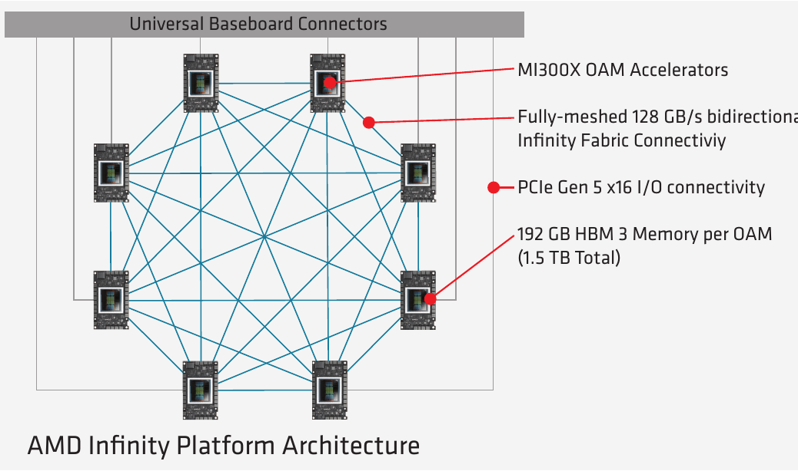
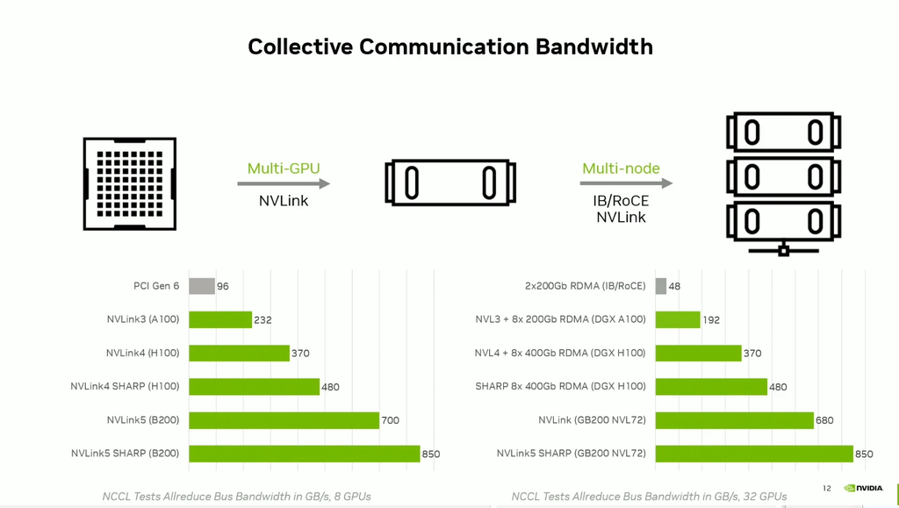
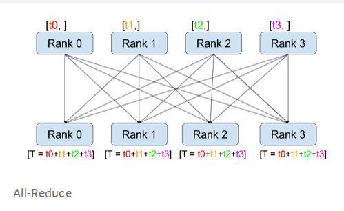
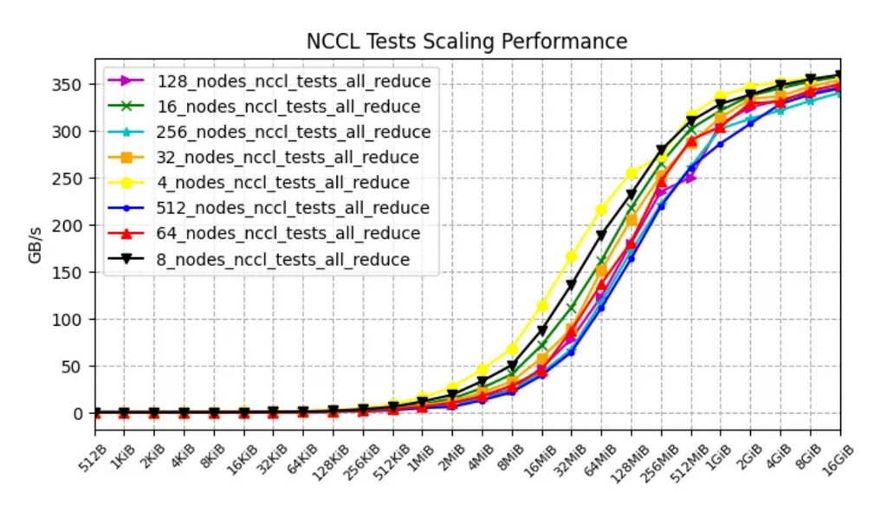
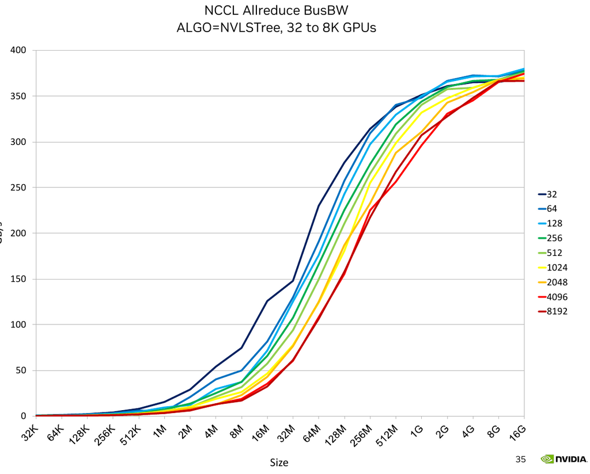
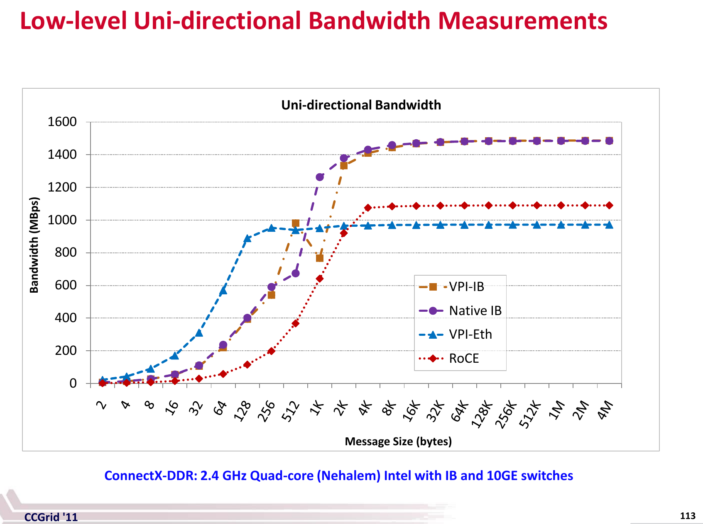
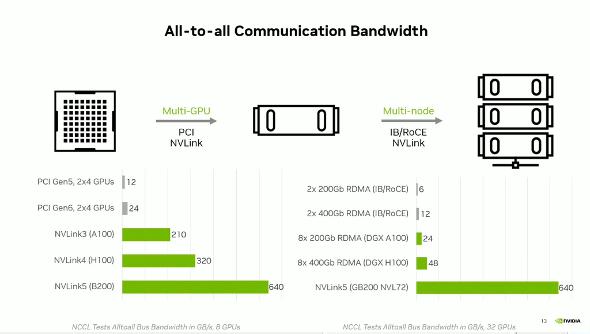
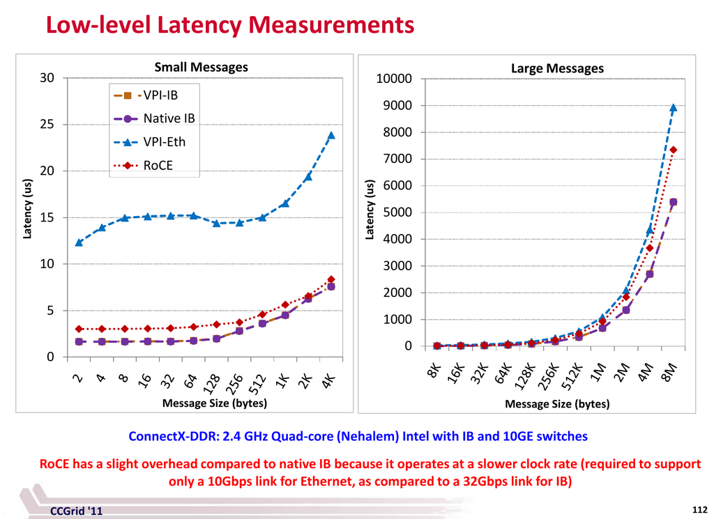

# Inter-Node and Intra-Node Networking Hardware

**Subsections**:

- [Communication Patterns](comms.md)
- [Network Debug](debug)
- [Network Benchmarks](benchmarks)

## Introduction

It's not enough to buy/rent expensive accelerators to train and infer models fast. You need to ensure that your [storage IO](../storage), [CPU](../compute/cpu) and network are fast enough to "feed the accelerator furnace". If this is not ensured then the expensive accelerators will be underutilized leading to lost $$, slower training time and inference throughput. While it can be any other of the mentioned components, the network is often the bottleneck during the training (assume your DataLoader is fast).

If your model fits on a single accelerator, you have little to worry about. But nowadays most models require several accelerators to load and LLM/VLM models require multiple compute nodes for training and some even for inference.

Most compute nodes contain 8 accelerators, some 4, others 16, and even more accelerators and recently there are some that have one super-accelerator per node.

When the model spans several accelerators and doesn't leave a single node all you need to worry about is fast [Intra-node networking](#intra-node-networking). As soon as the model requires several nodes, which is often the case for training as one can use multiple replicas to parallelize and speed up the training, then fast [Inter-node networking](#inter-node-networking) becomes the key.

This article covers both types of networking hardware, reports their theoretical and effective bandwidths and explains how they inter-play with each other.

## Glossary and concepts

You can safely ignore the many concepts and abbreviations listed here until you need them and then return here.

- ALU: Arithmetic Logic Units
- C2C: chip-to-chip, as in NVLink-C2C
- CPO: co-packaged optics - the optical engine sits inside the switch package instead of a pluggable transceiver
- DMA: Direct Memory Access
- EDR, HDR, NDR, XDR, GDR, LDR: InfiniBand per-lane data-rate generations - see [InfiniBand](#infiniband)
- EFA: Elastic Fabric Adapter
- GA: Generally Available - the product can actually be bought or rented, as opposed to announced, sampling, or spec'd only
- GDR: an InfiniBand per-lane data-rate generation - a roadmap target at 400Gbps per lane, as in the `InfiniBand GDR3200` row of the [inter-node table](#inter-node-networking) - see [InfiniBand](#infiniband). Beware that NCCL uses the same three letters for GPUDirect RDMA, the direct path between a NIC and accelerator memory, as in `NCCL_NET_GDR_LEVEL` - unrelated to this entry, and the clash is inherited from the two ecosystems that coined them, IBTA for the link generation and NVIDIA for the data path
- HCA: Host Channel Adapter
- HPC: High-performance Computing
- IB: InfiniBand
- IBTA: InfiniBand Trade Association
- ICI: Inter-Chip Interconnect - Google's scale-up fabric between TPU chips
- MFU: Model Flops Utilization (e.g. `mfu=0.5` at half-precision on A100 comes from getting 156TFLOPS, because peak half-precision spec is 312TFLOPS, and thus `156/312=0.5`)
- NCCL: NVIDIA Collective Communications Library
- NIC: Network Interface Card
- NVL72: an NVLink domain of 72 accelerators; likewise NVL8 and NVL36
- NVLS: NVLink [SHARP](#glossary-and-concepts) - the NCCL algorithm that reduces inside the NVSwitch
- NVLSTree: the NCCL algorithm that combines `NVLS` inside each node with a tree across nodes; multi-node only
- OPA: Omni-Path Architecture
- OPX: Omni-Path Express
- OSFP: Octal Small Form Factor Pluggable (transceiver)
- P2P: peer-to-peer - traffic between exactly two accelerators, as opposed to all-to-all
- QSFP-DD: Quad Small Form Factor Pluggable Double Density (transceiver)
- RC: Reliable Connection - the default connection type in verbs-based tools, connection-oriented with reliable in-order delivery
- RDMA: Remote Direct Memory Access
- RMA: Remote Memory Access - libfabric's name for one-sided read/write operations, the same class of operation as an RDMA write
- RoCE: RDMA over Converged Ethernet
- SHARP: Scalable Hierarchical Aggregation Reduction Protocol
- SRD: Scalable Reliable Datagram - AWS EFA's transport, which delivers reliably but does not preserve message order, unlike [RC](#glossary-and-concepts)
- SuperNIC: NVIDIA's name for its recent high-rate network adapters
- TCPX, TCPXO: Google Cloud's GPUDirect transports for A3 machine types
- UEC: Ultra Ethernet Consortium - the body behind the Ultra Ethernet standard that AI NICs target
- VPC: Virtual Private Cloud - the general-purpose cloud network, as opposed to the accelerator fabric
- xGMI: Socket to Socket Global Memory Interface
- XGS: the cross-datacenter variant of Spectrum-X

Speed-related:
- Adaptive Routing: improves Static routing to enable out of order packets on the network. Packets are load balanced at each switch to better distribute the network workload.
- algbw: algorithm bandwidth - payload size divided by elapsed time
- Bi-directional, Duplex: a transmission from one point to another in both directions A <-> B, typically 2x the one-direction (unidirectional) rate
- Bisection Width: minimum number of links cut to divide the network into two parts (not necessarily equal). The bandwidth of those links is known as Bisection Bandwidth - which is often used as a metric for real network bandwidth). Sometimes it's referred to as the worst-case network capacity. Here is a [good answer](https://networkengineering.stackexchange.com/a/29662/93656) that explains this and related concepts, but it's unlikely you need to understand this other than knowing what is being meant, as chances are your cluster's topology has already been done by the provider.
- busbw: bus bandwidth - `algbw` scaled by a per-collective correction factor so it reflects the hardware bottleneck rather than the rank count
- GBps, GB/s: Gigabytes per secs (1GBps = 8Gbps) transferred in a channel
- Gbps, Gb/s: Gigabits per secs (1Gbps = 1/8GBps) transferred in a channel
- GT/s: GigaTransfers per second - the number of operations transferring data that occur in each second.
- Unidirectional: a transmission from one point to another in one direction A -> B

footnote: In the following sections pay close attention that 1GBps = 8Gbps.


### Unidirectional vs Bidirectional (Duplex)

Most benchmarking / bandwidth measurement tools will report a unidirectional bandwidth. So be careful when you look at unidirectional vs. bidirectional (duplex) speeds. Typically the latter is ~2x faster.

If you measure the bandwidth on your setup and it's about 40% of the advertised speed, carefully check if the advertised speed said duplex and if so half that and then your measured bandwidth should now be about 80% which is expected.

case study: for a while I couldn't understand why when I run the nccl-tests all_reduce benchmark on an A100 node with advertised 600GBps intra-node speed I was getting only 235GBps (40%) until Horace He kindly pointed out that I should be looking at unidirectional speed which is 300GBps, and then I get 80% of the theoretical spec which checks out.

That ~80% expectation holds on newer hardware too. On a node of 8x H200 (NVLink 4, NVSwitch-connected) a pairwise copy measures 396.40GBps unidirectional against the 450GBps spec, or 88%, and 783.73GBps duplex against 900GBps, or 87% - so on this fabric running both directions at once costs almost nothing, measured with [nvbandwidth](benchmarks/README.md#nvbandwidth):

```bash
./nvbandwidth -i 10 -t device_to_device_memcpy_write_ce                # 396.40 GB/s per pair
./nvbandwidth -i 10 -t device_to_device_bidirectional_memcpy_write_ce  # 783.73 GB/s per pair, total
```

footnote: the bidirectional testcase prints `Write1`, `Write2` and a combined `total` matrix - read the total rather than doubling one direction.

A pairwise copy is the right instrument for this comparison because it moves bytes and nothing else. A *collective* on the same hardware can report more than the unidirectional spec, which is a different effect entirely - see [SHARP](#sharp).


## Cluster networks

Each node of the cluster has 3 networks, each running at a very different speed from each other.

1. [Frontend](#frontend-networking)
2. [Backend](#backend-networking)
3. [Out-of-band](#out-of-band-networking)

### Frontend networking

Frontend networking is typically for the Internet connection (e.g. downloading python packages and offloading to the cloud storage), distributed network storage (e.g. checkpoints and datasets) and orchestration (e.g. SLURM and Kubernetes). As of 2026-08 a typical node is likely to have a single 100-400Gbps connection.

footnote: not all clusters will have external Internet connection available, e.g. many HPC environments only provide external access via special cpu-only nodes.

### Backend networking

Backend networking is to perform GPU-to-GPU connectivity which allows training and inference to scale to multiple accelerators (e.g. all-reduce, all-gather and other collective comms). This is the most important part of the AI cluster. Typically this would be either an [InfiniBand](#infiniband) or [RoCEv2 Ethernet](#rdma-networking). It then breaks down into [intra-node networking](#intra-node-networking) and [inter-node networking](#inter-node-networking) - the GPUs on the same node typically can communicate with each other at faster speed than with GPUs on other nodes. Here the typical top [unidirectional](#unidirectional-vs-bidirectional-duplex) speeds as of 2026-08 would be around 900GBps per accelerator for intra-node (NVLink 5, as on B200/B300) and 100GBps per accelerator, or 800GBps per node, for inter-node (8x ConnectX-8, as on DGX B300 XDR) - so about an order of magnitude apart per accelerator, a ratio that has held for several generations because both sides keep doubling together. That is the gap between the links; the gap you actually measure with a collective is much smaller, for reasons explained in [Inter-node speed depends on intra-node speed](#inter-node-speed-depends-on-intra-node-speed). There will be at least one backend connection per accelerator and at times there can be multiple connections per accelerator, especially if low bandwidth NICs are used.

footnote: not all providers will match the industry's standard networking speeds - on some the inter-node networking speed could be up to 10x slower. So always check what you get.

### Out-Of-Band networking

Out-Of-Band (OOB) networking is used for bootstrapping backend networking, monitoring node's health, remote re-imaging of the nodes, etc. It typically uses a single slow 1Gbps ethernet connection.


## RDMA networking

Remote Direct Memory Access is like DMA (Direct Memory Access) on the node, but across nodes. It allows data exchange between nodes w/o the overhead using the local processor, OS kernel and caches, which is what TCP/IP uses. The 3 main implementations are:

1. InfiniBand
2. RDMA over Converged Ethernet (RoCE) (IB or UDP-based RDMA)
3. iWARP (TCP-based RDMA)

Here is a [good overview article](https://www.fs.com/blog/a-quick-look-at-the-differences-rdma-vs-tcpip-2945.html).


## Intra-node networking

This is also known as scale-up networking.

There are multiple platforms/solutions out there that provide intra-node networking:

1. Generic: [PCIe](#pcie)
2. NVIDIA: [NVLink](#nvlink) and [NVSwitch](#nvswitch)
3. AMD: [Infinity Fabric](#infinity-fabric--xgmi)
4. Intel: [Gaudi2](#gaudi2), [Gaudi3](#gaudi3)
5. AWS: NeuronLink (Trainium)
6. Google: ICI (TPU)
7. Huawei: [UB Link](#ub-link-unifiedbus) (Ascend)

### All-to-all bandwidth

Here is intra-node unidirectional theoretical all-to-all peak bandwidth cross-comparison for current solutions sorted by bandwidth:

**Generally available:**

| Interconnect     | Accelerator  | GBps   | Notes |
| :--------------- | :----------- | -----: | :---- |
| NVIDIA NVLink 5  | B200, B*     |  900.0 | 1     |
| AWS NeuronLink 3 | Trainium2    |  640.0 | 2     |
| Intel            | Gaudi3       |  600.0 |       |
| Google ICI       | TPU7x        |  600.0 | 4     |
| AMD XGMI         | MI355X       |  535.5 |       |
| AMD XGMI         | MI350X       |  535.5 |       |
| NVIDIA NVLink 4  | H100, H*     |  450.0 | 1     |
| AMD XGMI         | MI325X       |  448.0 |       |
| AMD XGMI         | MI300X       |  448.0 |       |
| AMD XGMI         | MI250X       |  350.0 |       |
| NVIDIA NVLink 3  | A100         |  300.0 | 1     |
| Intel            | Gaudi2       |  300.0 |       |
| PCIe 5           |              |   63.0 |       |
| PCIe 4           |              |   31.0 |       |

**Announced, availability not confirmed:**

| Interconnect     | Accelerator  | GBps   | Notes |
| :--------------- | :----------- | -----: | :---- |
| Huawei UB Link   | Ascend 950DT |  840.0 | 5     |
| NVIDIA NVLink 6  | Rubin        | 1800.0 | 1     |
| PCIe 6           |              |  121.0 | 3     |

Notes:

1. NVSwitch operates at the same speed as NVLink of that generation. See [NVSwitch](#nvswitch).
2. AWS publishes `NeuronLink-v3 ... 1.28 TB/sec bandwidth per chip` for Trainium2 without declaring directionality, so it's halved here per the directionality note below. AWS doesn't publish a per-link rate or a link count, so Trainium2 can't be placed in the [peer-to-peer table](#peer-to-peer-bandwidth) below.
3. PCIe 6 is listed under `Announced, availability not confirmed` because no shipping accelerator attaches at Gen6 as of 2026-07-31 - current parts are Gen5 x16 (NVIDIA H200 SXM lists `PCIe Gen5`, AMD MI350X/MI355X list `PCIe 5.0 x16`), so 63GBps remains today's ceiling for accelerator-to-accelerator PCIe traffic. Gen6 already ships on the NIC side - NVIDIA markets ConnectX-8 as bringing "PCIe Gen6 connectivity in a single device", which is what lets one adapter feed 800Gbps.
4. Google publishes a "Bidirectional inter-chip interconnect (ICI) bandwidth per chip (GBps)" of 1200 for TPU7x, halved here per the note above. Peer-to-peer is the per-axis figure, "bi-directional bandwidth of 200 GBps per axis" - and 6 neighbors in the 3D torus at 200 each is exactly the 1200 total, so the two figures corroborate. `GA` is `?` because Google documents TPU7x fully without stating an availability stage. See [TPU7x](https://docs.cloud.google.com/tpu/docs/tpu7x).
5. Huawei publishes a per-cabinet total interconnect bandwidth of up to 64 x 1.68TBps bidirectional for the Atlas 950 SuperPoD - 1.68TBps bidirectional per accelerator, halved here. Only the Chinese pages carry it; the English ones state no per-NPU figure. Peer-to-peer is unknown, so there is no row in the [peer-to-peer table](#peer-to-peer-bandwidth). `GA` is `?` because Huawei publishes no availability for Ascend 950DT anywhere reachable - its own English site serves a plain downloader only a navigation shell, in which `950DT` does not appear at all. China-only distribution is not the reason: once availability is confirmed the row belongs with the available hardware, annotated as China-only. See [UB Link](#ub-link-unifiedbus).

General notes:

* Pay close attention to when the spec says unidirectional vs bidirectional (duplex) speeds - if you read an online spec and it doesn't explicitly declare the directionality - look for an answer. I had to research many docs to figure it out in some of the tables below as some vendors omit this crucial information in the published specs. I even had to edit a few wiki pages to add the missing information. Remember that for the vendors the bigger, the better so almost always they will use the duplex number, which is typically 2x bigger than the unidirectional one.


### Peer-to-peer bandwidth

Some vendors have their all-to-all and peer-to-peer (GPU-to-GPU) bandwidth the same, while others don't. For example, AMD MI300X/MI325X are 64GBps GPU-to-GPU (peer-to-peer), but 448GBps in total on a board of 8 accelerators, since `64*7=448`. Likewise MI350X/MI355X are 76.5GBps peer-to-peer and 535.5GBps all-to-all, since `76.5*7=535.5`.

Here is the intra-node unidirectional theoretical peer-to-peer peak bandwidth cross-comparison for current solutions sorted by bandwidth:

**Generally available:**

| Interconnect    | Accelerator | GBps   |
| :-------------- | :---------- | -----: |
| NVIDIA NVLink 5 | B200, B*    |  900.0 |
| Intel           | Gaudi3      |  600.0 |
| NVIDIA NVLink 4 | H100, H*    |  450.0 |
| NVIDIA NVLink 3 | A100        |  300.0 |
| Intel           | Gaudi2      |  300.0 |
| Google ICI      | TPU7x       |  100.0 |
| AMD XGMI        | MI355X      |   76.5 |
| AMD XGMI        | MI350X      |   76.5 |
| AMD XGMI        | MI325X      |   64.0 |
| AMD XGMI        | MI300X      |   64.0 |
| PCIe 5          |             |   63.0 |
| AMD XGMI        | MI250X      |   50.0 |
| PCIe 4          |             |   31.0 |

**Announced, availability not confirmed:**

| Interconnect    | Accelerator | GBps   |
| :-------------- | :---------- | -----: |
| NVIDIA NVLink 6 | Rubin       | 1800.0 |
| PCIe 6          |             |  121.0 |

note: PCIe carries the same number in both tables, but for the opposite reason to NVLink. NVLink matches because NVSwitch lets a single pair light up every link - you get the whole fabric either way. PCIe matches because an accelerator has just one x16 host link, so that link is the ceiling whether it talks to one peer or to seven. And unlike NVLink or Infinity Fabric, where every pair has the same fabric path, the PCIe number depends on where the two devices sit - under the same switch, across the root complex, or across CPU sockets are all different paths (`nvidia-smi topo -m` tells you which). So treat the PCIe rows as a best case for a well-placed pair, not as a figure that holds for any two devices in the node.

note: the PCIe rows assume an x16 attachment, which is what current accelerators use - NVIDIA H200 SXM lists `PCIe Gen5` at 128GBps duplex, AMD MI350X/MI355X list `PCIe 5.0 x16`, and A100 is Gen4 x16. If a part is attached at x8, halve the figure. Note also that as of 2026-07-31 no shipping accelerator attaches at Gen6 - so 63GBps is today's real ceiling for accelerator-to-accelerator PCIe traffic, and the PCIe 6 row is there for the platforms that will. Gen6 *is* already shipping elsewhere in the node: NVIDIA markets ConnectX-8 as bringing "PCIe Gen6 connectivity in a single device", which is what lets one adapter feed 800Gbps (100GBps) since Gen5 x16 tops out at 63GBps.

When peer-to-peer bandwidth is much lower than all-to-all it means that if you don't use all of the accelerators on the node by the same application, you will end up with a much lower bandwidth and your application will have a performance impact if the accelerators have to communicate between each others.

To validate this the [all_reduce_bench.py](benchmarks/all_reduce_bench.py) was run on a 8x GPU AMD MI300X node with a 4GiB payload and the `busbw` measurements were:

- 2 GPUs:  47.671GBps
- 8 GPUs:  312.912GBps

i.e. 2 GPUs performed 6.5x slower than 8.

So if you have you to deploy TP=2, TP=4, or ZeRO-DP/FSDP over 2 or 4 GPUs, be it training or inference, the network will become a bottleneck. If you use TP=1 or TP=8 or ZeRO-DP/FSDP over 8 GPUs, or DP over 1-GPU replicas there is no problem. (If you're not sure what TP/ZeRO-DP/DP mean please see [model-parallelism](../training/model-parallelism).)

You will find the details analysis of each technology in the following sections.


### PCIe

[PCIe](https://en.wikipedia.org/wiki/PCI_Express) is a high-speed serial computer expansion bus standard that can be found even on the cheapest computer desktop.

**Generally available:**

| Interconnect | Lane/<br>Direction<br>(GBps) | Lanes | Uni-dir.<br>(GBps) | Duplex<br>(GBps) |
| :----------- | ---------------------------: | ----: | -----------------: | ---------------: |
| PCIe 4       |                         ~2.0 |    16 |                 31 |               62 |
| PCIe 5       |                         ~4.0 |    16 |                 63 |              126 |
| PCIe 6       |                         ~7.5 |    16 |                121 |              242 |

**Announced, availability not confirmed:**

| Interconnect | Lane/<br>Direction<br>(GBps) | Lanes | Uni-dir.<br>(GBps) | Duplex<br>(GBps) |
| :----------- | ---------------------------: | ----: | -----------------: | ---------------: |
| PCIe 7       |                        ~15.0 |    16 |                242 |              484 |
| PCIe 8       |                        ~30.0 |    16 |                484 |              968 |

If one compares the latest generations of different intra-node networking technologies (see the following sections) PCIe is usually an order of magnitude behind.

The table above is spec. What a PCIe link actually delivers is a separate question, and one nobody seems to publish - so here is a measurement. On a node of 8x H200 where each accelerator has its own PCIe 5 x16 link, [nvbandwidth](#nvlink-c2c) reports 55.43GBps host-to-device and 55.06GBps device-to-host, which is 88% and 87% of the 63GBps row above. The eight links came out within 0.10GBps of each other, with `nvbandwidth` reporting a coefficient of variation of 0.00.

To reproduce, first confirm the generation and width, since the 63GBps figure only applies to PCIe 5 at x16:

```bash
nvidia-smi --query-gpu=index,pcie.link.gen.current,pcie.link.width.current --format=csv
```

then, with [nvbandwidth](benchmarks/README.md#nvbandwidth):

```bash
./nvbandwidth -i 10 -t host_to_device_memcpy_ce
./nvbandwidth -i 10 -t device_to_host_memcpy_ce
```

caveat: `host_to_device_memcpy_ce` measures whatever the host-to-device path happens to be on that platform, so read it against the fabric the machine actually uses. On an x86 host with PCIe-attached SXM accelerators that path is PCIe, which is what the 88% above refers to. On a Grace-Blackwell system the very same testcase measures [NVLink-C2C](#nvlink-c2c) instead and reports several hundred GBps - same command, different fabric, an order of magnitude apart.

footnote: a released specification is not shipping silicon. As of 2026-07-30 [PCI-SIG](https://pcisig.com/specifications) lists `PCI Express Base Specification Revision 7.0` as released, while PCIe 8.0 exists only as a members-only draft, targeted for 2028. And even a finished spec takes years to reach products - PCIe 6.0 hardware didn't launch until August 2025, about three years after its spec was done. So read the last rows as where the standard is heading, not as what you can buy.


### NVLink

footnote: `nvidia-smi nvlink -s` reports the raw per-link signalling rate, and summing it overshoots the advertised aggregate. A B200 lists 18 links at 53.125GBps = 956.25GBps against the advertised 900GBps, and an H100 lists 18 at 26.5625GBps = 478.125GBps against 450GBps. Both land at a ratio of 0.9412, which is the encoding overhead, so multiply the sum by ~0.94 to get back to the spec figure.

- [NVLink](https://en.wikipedia.org/wiki/NVLink) is a wire-based serial multi-lane near-range communications link developed by NVIDIA. Here is the [What Is NVLink](https://blogs.nvidia.com/blog/what-is-nvidia-nvlink/) blog post with more background on it.

I found the NVLink wiki page to be quite difficult to follow, so I will try to help bring clarity into this. And I'm pretty sure as of 2026-08 some of the numbers on that wiki page are bogus and it doesn't look like NVIDIA maintains that page.

Effective payload rate of intra-node GPU-to-GPU communication hardware:

**Generally available:**

| Interconnect | Lane/<br>Direction<br>(GBps) | Lanes | Links | Uni-dir.<br>(GBps) | Duplex<br>(GBps) | GPU               |
| :----------- | ---------------------------: | ----: | ----: | -----------------: | ---------------: | :---------------- |
| NVLink 1     |                         2.50 |     8 |     4 |                 80 |              160 | P100              |
| NVLink 2     |                        3.125 |     8 |     6 |                150 |              300 | V100              |
| NVLink 3     |                         6.25 |     4 |    12 |                300 |              600 | A100              |
| NVLink 4     |                        12.50 |     2 |    18 |                450 |              900 | H100, H200, GH200 |
| NVLink 5     |                        25.00 |     2 |    18 |                900 |             1800 | B200, B\*, GB\*   |

**Announced, availability not confirmed:**

| Interconnect | Lane/<br>Direction<br>(GBps) | Lanes | Links | Uni-dir.<br>(GBps) | Duplex<br>(GBps) | GPU               |
| :----------- | ---------------------------: | ----: | ----: | -----------------: | ---------------: | :---------------- |
| NVLink 6     |                        25.00 |     2 |    36 |               1800 |             3600 | Rubin             |

There is a good overview of evolution of NVLink (1 to 4) [here](https://www.naddod.com/blog/unveiling-the-evolution-of-nvlink).

The largest PCIe 16x slot has 16 lanes. Smaller slots have less lanes, 1x == 1 lane.

NVIDIA Rubin nodes come equipped with PCIe 6 and NVLink 6. So there NVLink is ~15x faster than PCIe.

NVIDIA Blackwell nodes come equipped with PCIe 6 and NVLink 5. So there NVLink is ~7x faster than PCIe.

NVIDIA Hopper nodes typically come equipped with PCIe 5 and NVLink 4. So there NVLink is ~7x faster than PCIe.

Let's look at several examples of nodes and correlate the theory with reality.

If you use multiple GPUs the way cards are inter-connected can have a huge impact on the total training time. If the GPUs are on the same physical node, you can run:

```bash
nvidia-smi topo -m
```

and it will tell you how the GPUs are inter-connected.

On a machine with dual-GPU and which are connected with NVLink, you will most likely see something like:

```
        GPU0    GPU1    CPU Affinity    NUMA Affinity
GPU0     X      NV2     0-23            N/A
GPU1    NV2      X      0-23            N/A
```

on a different machine w/o NVLink you may see:
```
        GPU0    GPU1    CPU Affinity    NUMA Affinity
GPU0     X      PHB     0-11            N/A
GPU1    PHB      X      0-11            N/A
```

The report includes this legend:

```
  X    = Self
  SYS  = Connection traversing PCIe as well as the SMP interconnect between NUMA nodes (e.g., QPI/UPI)
  NODE = Connection traversing PCIe as well as the interconnect between PCIe Host Bridges within a NUMA node
  PHB  = Connection traversing PCIe as well as a PCIe Host Bridge (typically the CPU)
  PXB  = Connection traversing multiple PCIe bridges (without traversing the PCIe Host Bridge)
  PIX  = Connection traversing at most a single PCIe bridge
  NV#  = Connection traversing a bonded set of # NVLinks
```

So the first report `NV2` tells us the GPUs are interconnected with 2 NVLinks, and the second report `PHB` shows we have a typical consumer-level PCIe+Bridge setup.

Check what type of connectivity you have on your setup. Some of these will make the communication between cards faster (e.g. NVLink), others slower (e.g. PHB).

Depending on the type of scalability solution used, the connectivity speed could have a major or a minor impact. If the GPUs need to sync rarely, as in DDP, the impact of a slower connection will be less significant. If the GPUs need to send messages to each other often, as in ZeRO-DP, then faster connectivity becomes super important to achieve faster training.

Now, let's look at the topology of the A100 and H100 nodes:


- A100 topology:

```bash
$ nvidia-smi topo -m
      GPU0  GPU1  GPU2  GPU3  GPU4  GPU5  GPU6  GPU7  CPU Affinity  NUMA Affinity
GPU0   X    NV12  NV12  NV12  NV12  NV12  NV12  NV12   0-23         0
GPU1  NV12   X    NV12  NV12  NV12  NV12  NV12  NV12   0-23         0
GPU2  NV12  NV12   X    NV12  NV12  NV12  NV12  NV12   0-23         0
GPU3  NV12  NV12  NV12   X    NV12  NV12  NV12  NV12   0-23         0
GPU4  NV12  NV12  NV12  NV12   X    NV12  NV12  NV12  24-47         1
GPU5  NV12  NV12  NV12  NV12  NV12   X    NV12  NV12  24-47         1
GPU6  NV12  NV12  NV12  NV12  NV12  NV12   X    NV12  24-47         1
GPU7  NV12  NV12  NV12  NV12  NV12  NV12  NV12   X    24-47         1
```
You can see there are 12 NVLinks and 2 NUMA Groups (2 CPUs w/ 24 cores each)

- H100 topology:
```bash
$ nvidia-smi topo -m
      GPU0  GPU1  GPU2  GPU3  GPU4  GPU5  GPU6  GPU7  CPU Affinity  NUMA Affinity
GPU0   X    NV18  NV18  NV18  NV18  NV18  NV18  NV18   0-51         0
GPU1  NV18   X    NV18  NV18  NV18  NV18  NV18  NV18   0-51         0
GPU2  NV18  NV18   X    NV18  NV18  NV18  NV18  NV18   0-51         0
GPU3  NV18  NV18  NV18   X    NV18  NV18  NV18  NV18   0-51         0
GPU4  NV18  NV18  NV18  NV18   X    NV18  NV18  NV18  52-103        1
GPU5  NV18  NV18  NV18  NV18  NV18   X    NV18  NV18  52-103        1
GPU6  NV18  NV18  NV18  NV18  NV18  NV18   X    NV18  52-103        1
GPU7  NV18  NV18  NV18  NV18  NV18  NV18  NV18   X    52-103        1
```
You can see there are 18 NVLinks and 2 NUMA Groups (2 CPUs w/ 52 cores each)

Of course, other A100 and H100s node reports may vary, e.g. the number of cpu cores is likely to be different.

### NVLink-C2C

This is a high-bandwidth connection between Grace CPU and GPUs on GH200 and GB200+ modules, Vera CPU and Rubin GPUs.

As of 2026-08 there is no public spec of the speed, but I found 450GBps unidirectional mentioned [here](https://newsletter.semianalysis.com/p/gb200-hardware-architecture-and-component#%C2%A7the-4-rack-scale-form-factors-of-blackwell) for GB200. As compared to 900GBps unidirectional bandwidth for NVLink-5 - so half the speed of the latter.

request: I'm looking for an official spec if you find one please let me know.

**Generally available:**

| Architecture    | Uni-dir.<br>(GBps) | NVLink<br>(GBps) | NVLink<br>gen |
| :-------------- | -----------------: | ---------------: | ------------: |
| Grace/Hopper    |                450 |              900 |             4 |
| Grace/Blackwell |                450 |              900 |             5 |

**Announced, availability not confirmed:**

| Architecture    | Uni-dir.<br>(GBps) | NVLink<br>(GBps) | NVLink<br>gen |
| :-------------- | -----------------: | ---------------: | ------------: |
| Vera/Rubin      |                900 |             1800 |             6 |

Next, it's important to understand that these speeds are of a standalone C2C technology and it can be much lower when integrated into the system, when bottlenecked by other components.

On DGX Station (comprised of half the GB300 module) I benchmarked ~80% unidirection and ~38% duplex efficiency vs theoretical bandwidth using the [nvbandwidth benchmark](benchmarks/README.md#nvbandwidth):

```bash
$ ./nvbandwidth
[...]
Running host_to_device_memcpy_ce.
memcpy CE CPU(row) -> GPU(column) bandwidth (GB/s)
           0
 0    359.05

SUM host_to_device_memcpy_ce 359.05

Running device_to_host_memcpy_ce.
memcpy CE CPU(row) <- GPU(column) bandwidth (GB/s)
           0
 0    377.15

SUM device_to_host_memcpy_ce 377.15

Running host_to_device_bidirectional_memcpy_ce.
memcpy CE CPU(row) <-> GPU(column) bandwidth (GB/s)
           0
 0    175.38

SUM host_to_device_bidirectional_memcpy_ce 175.38

Running device_to_host_bidirectional_memcpy_ce.
memcpy CE CPU(row) <-> GPU(column) bandwidth (GB/s)
           0
 0    171.76
 [...]
```

Here is the math (I averaged two direct bandwidth reports as the reports aren't the same for each direction)
```
(359+377)/2 / 450 = 0.82
(175+171)/2*2 / 900 = 0.38
```
Essentially, the end-to-end doesn't support the duplex C2C spec, but delivers half the unidirectional speed when communicated in both directions. The wire is duplex, but LPDDR5X memory bandwidth on Grace prevents it from running at full speed in both directions, as the bidirectional test makes both directions share that same memory bandwidth. It's probably not a problem in most current ML applications that normally would send data in one direction H2D / D2H at the same time, but if real duplex is needed beware of this issue.


### NVSwitch

footnote: on a rack-scale NVLink system this makes `nvidia-smi topo -m` unusually informative - it reports `NV#` connections to accelerators in other chassis, because those are inside the same scale-up domain. On a conventional node the same tool tells you nothing about inter-node connectivity, since it only knows about NVIDIA's own fabrics.

[NVSwitch](https://www.nvidia.com/en-us/data-center/nvlink/) can connect more than 8 GPUs at the speed of [NVLink](#nvlink). It's advertised to connect up to 256 GPUs in the future generations of the switch.

The benefit of connecting more than 8 GPUs at the speed of NVLink is that it allows all-to-all GPU communications at a much faster speed than any intra-node hardware can provide. And with ever increasing compute speeds the network is the likely bottleneck leading to underutilized super-expensive GPUs.

For example, in the universe of Tensor Parallelism (Megatron), one doesn't use TP degree of more than 8, because TP is only efficient at NVLink speed. ZeRO-DP (DeepSpeed/FSDP) would also run much faster if the whole cluster uses NVLink speed and involves no slow inter-node connections.

NVSwitch is used for intra-node connectivity.

NVSwitch gen 1 came out with V100, gen 2 with A100, gen 3 with H100, and gen 4 with B200 - the speed corresponds to the NVLink version of the same technology.

The [NVIDIA DGX H100](https://web.archive.org/web/20231208180425/https://developer.nvidia.com/blog/upgrading-multi-gpu-interconnectivity-with-the-third-generation-nvidia-nvswitch/) connects eight H100 GPUs through four third-generation NVSwitch chips. Each H100 has 900GBps of bidirectional NVLink 4 bandwidth, which NVIDIA still lists on a live page in its [NVLink specifications](https://www.nvidia.com/en-us/data-center/nvlink/) table under `Fourth Generation`. NVIDIA separately specifies 3.6TBps of system bisection bandwidth and 450GBps of reduction bandwidth. These describe different scopes: 900GBps is the interface bandwidth available to one GPU, while 3.6TBps is aggregate traffic across a balanced partition of the eight-GPU fabric; the number of NVSwitch chips doesn't multiply the bandwidth of one GPU.

NVIDIA DGX A100 has 6 switches of 12 NVLinks for a total of 72.

A [DGX H100 SuperPOD](https://docs.nvidia.com/dgx-superpod/reference-architecture-scalable-infrastructure-h100/latest/index.html) scalable unit contains 32 DGX H100 systems (256 GPUs), but each DGX remains its own in-node NVSwitch domain. The systems scale out over a separate Quantum-2 NDR400 InfiniBand compute fabric, so cross-node bandwidth must be described from the ConnectX-7/InfiniBand topology rather than by halving or summing the internal NVLinks. See [InfiniBand](#infiniband).

Additionally, NVSwitch gen3 and higher comes with [NVIDIA Scalable Hierarchical Aggregation Reduction Protocol (SHARP)](#sharp) which can boost both the intra- and inter-node speeds for `all-reduce`. NCCL versions now have `NCCL_ALGO=NVLS` which boosts the intra-node `all-reduce` bandwidth up to 30%, and inter-node `all-reduce` by about 25%.

Recently [GB200 NVL72](https://www.nvidia.com/en-us/data-center/gb200-nvl72/) has been introduced, which uses NVSwitch to put 72 Blackwell GPUs into a single node all inter-connected at NVLink 5 900GBps unidirectional speed. So instead of having a 8-gpu node, now we have a 72-gpu node (even though physically they don't all reside on the same board).

### Infinity Fabric / xGMI

AMD MI* Accelerators intra-node communication is performed by AMD Infinity Fabric, which is also known as xGMI (Socket to Socket Global Memory Interface).

This is AMD's answer to [NVLink](#nvlink).

The following is the all-to-all bandwidth.

**Generally available:**

| Interconnect | Link/<br>Direction<br>P2P (GBps) | Links | Uni-dir.<br>all-to-all<br>(GBps) | Duplex<br>all-to-all<br>(GBps) |
| :----------- | -------------------------------: | ----: | -------------------------------: | -----------------------------: |
| MI355X       |                             76.5 |     7 |                            535.5 |                           1071 |
| MI350X       |                             76.5 |     7 |                            535.5 |                           1071 |
| MI325X       |                               64 |     7 |                              448 |                            896 |
| MI300X       |                               64 |     7 |                              448 |                            896 |
| MI250X       |                               50 |     7 |                              350 |                            700 |

**Announced, availability not confirmed:**

| Interconnect | Link/<br>Direction<br>P2P (GBps) | Links | Uni-dir.<br>all-to-all<br>(GBps) | Duplex<br>all-to-all<br>(GBps) |
| :----------- | -------------------------------: | ----: | -------------------------------: | -----------------------------: |
| MI455X       |                               ?? |    ?? |                             1800 |                           3600 |

The peer-to-peer bandwidth is just that of a single link/direction (the 2nd column). This means that unless you use the whole 8-GPU node in a single process group you will have a 7x slower comms performance. See [Peer-to-peer bandwidth](#peer-to-peer-bandwidth) for details.

Other intra-node solutions typically have the same all-to-all and peer-to-peer intra-node bandwidth, so Infinity Fabric appears to be dramatically slower, unless the workload either doesn't use intra-node comms or the whole node is engaged in a single workload.



Platform specs:
- [MI250X](https://www.amd.com/en/products/accelerators/instinct/mi200/mi250x.html)
- [MI300x](https://www.amd.com/en/products/accelerators/instinct/mi300/platform.html)
- [MI325X](https://www.amd.com/en/products/accelerators/instinct/mi300/mi325x.html)
- [MI350X](https://www.amd.com/en/products/accelerators/instinct/mi350/mi350x.html)
- [MI355X](https://www.amd.com/en/products/accelerators/instinct/mi350/mi355x.html)

footnote: the MI455X row is `??` where AMD publishes nothing. For MI3\* AMD gives both `Infinity Fabric Links` and `Peak Infinity Fabric Link Bandwidth`, which is what lets the per-link and all-to-all columns be filled and the 7x peer-to-peer penalty be shown. For MI455X it publishes only `Scale-up Bandwidth per GPU: 3.6 TB/s` - no link count, no per-link rate - so the all-to-all columns carry that figure halved per the convention below, and the peer-to-peer columns can't be filled at all. Whether MI4\* still divides its bandwidth per peer the way MI3\* does, or switches to a fabric where a single pair can use all of it, is exactly what those two `??` would answer. AMD also never uses the words "all-to-all" or "any-to-any" about it, so treat 1800 as the accelerator's total scale-up bandwidth rather than a confirmed all-to-all figure.

footnote: AMD publishes a single `Peak Infinity Fabric Link Bandwidth` per link without saying whether it is uni- or bi-directional - 153GBps for MI350X/MI355X and 128GBps for MI300X/MI325X. Vendors quote the larger number, so these are read as duplex and halved for the per-direction column above. AMD also lists an 8th, scale-out link per GPU (128GBps peak), which is not part of the intra-node all-to-all figures.


### Gaudi2

According to [Gaudi2 spec](https://habana.ai/wp-content/uploads/2023/10/HLS-Gaudi2_Datasheet_10_23.pdf), these nodes provide the same 100GbE RoCE v2 RDMA hardware for inter- and intra-node connectivity (24x 100Gbps per card).

- intra-node: 8x 7x3 NICs - 300Gbps card to card
- inter-node: 8x 1x3 NICS - for a total of 2.4Tbps (300GBps)

### Gaudi3

According to [Gaudi3 spec](https://www.intel.com/content/www/us/en/content-details/817486/intel-gaudi-3-ai-accelerator-white-paper.html), these nodes provide the same setup as Gaudi2 except the cards are 2x faster using 200GbE RoCE v2 RDMA  for inter- and intra-node connectivity (24x 200Gbps per card).

- intra-node: 8x 7x3 NICs - 600Gbps card to card
- inter-node: 8x 1x3 NICS - for a total of 4.8Tbps (600GBps)

### NeuronLink v3

NeuronLink v3 ([spec](https://awsdocs-neuron.readthedocs-hosted.com/en/latest/about-neuron/arch/neuron-hardware/trn2-arch.html)) is the intra-node equivalent of NVLink for AWS Trainium2, but it's a point-to-point architecture, like AMD MI* so it can't take advantage of the other Trainium2 chips' NeuronLink v3 unless they are engaged in the same process group. This technology is based on PCIe-5.0 (so 32Gbps per lane unidirectional).

NeuroLink v3 also has an inter-node use in addition to EFA v3.

Number of Trainium2 chips per node and intra-node network speeds:
- Trainium2: 16 chips interconnected at 128GBps peer-to-peer undirectional (32 PCIe lanes) and each Trainium2 connects to 3 other chips
- Trainium2 Ultra: 64 chips - the 16 chip groups are the same as non-Ultra, plus these 4 groups are interconnected at 64GBps with each other.

Like TPU it is used in a 3D Torus structure. Here different axis connect at different speeds, so the total all-to-all bandwidth per chip is 640GBps unidirectional (`128GBps * 4 intra-node neighbors + 64GBps * 2 inter-node neighbors`)

When their spec suggests 1024GBps/chip intra-instance bandwidth, it is bidirectional, so only 512GBps/chip unidirectional - and it comes from `128GBps * 4 intra-node neighbors` (and only if all 4 chips are engaged).


## Inter-node networking

This is also known as scale-out networking.

As inter-node hardware used to be about of an order of magnitude slower than intra-node hardware in this universe Gbps are used instead of GBps. (1GBps = 8Gbps) (The links themselves are still about an order of magnitude apart, but the practical gap for collectives is much smaller, because an inter-node collective also does most of its work over the [intra-node](#intra-node-networking) links - see [Inter-node speed depends on intra-node speed](#inter-node-speed-depends-on-intra-node-speed))

When it comes to inter-node networking hardware, there are the well established [InfiniBand](#infiniband) from NVIDIA and a few other players, various NVLink-based NVIDIA products and there are many new comers that mainly are coming from compute cloud providers who can't compete on the slim margin renting out someone else's hardware so they build their own (AWS EFA, GCP GPUDirect-TCPX), and there are also HPE and Cornelis Networks with recently updated products.

As of 2026-07-28, here is an inter-node unidirectional theoretical peak bandwidth cross-comparison for current platform configurations and interconnect generations. An interface here is a fabric-facing NIC or adapter port, not a SerDes lane or a switch port. Total bandwidth is `interfaces * rate / 8`. The `Shipped` column says whether you can actually get the hardware today (V) or whether it's still a roadmap or pre-GA target (X).

Sorted by Total unidirectional bandwidth descending, then Rate/interface descending, then Platform/example node ascending:

**Generally available:**

| Platform/<br>example<br>node | NICs<br>per<br>node | Rate/<br>interface<br>(Gbps) | Total<br>Uni-dir.<br>(GBps) | Notes   |
| :--------------------------- | ------------------: | ---------------------------: | --------------------------: | :------ |
| NVIDIA DGX B300 XDR          |                   8 |                          800 |                         800 | 1,19    |
| AWS EFA v4 (P6-B300)         |                  16 |                          400 |                         800 | 2,20,31 |
| Intel Gaudi3                 |                  24 |                          200 |                         600 | 3,21    |
| NVIDIA DGX H100 NDR          |                   8 |                          400 |                         400 | 4,22    |
| Omni-Path CN5000 example     |                   8 |                          400 |                         400 | 17,18   |
| AWS EFA v4 (P6-B200)         |                   8 |                          400 |                         400 | 2,30,31 |
| AWS EFA v3 (P5en/Trn2)       |                  16 |                          200 |                         400 | 2,23,31 |
| AWS EFA v2 (P5/P5e)          |                  32 |                          100 |                         400 | 2,23,31 |
| Intel Gaudi2                 |                  24 |                          100 |                         300 | 5,21    |
| InfiniBand XDR200            |                   2 |                          800 |                         200 | 9,11    |
| GCP A3 Mega TCPXO            |                   8 |                          200 |                         200 | 6,24,29 |
| GCP A3 High TCPX             |                   4 |                          200 |                         100 | 6,25,29 |
| HPE Slingshot example        |                   4 |                          200 |                         100 | 7,26    |
| Omni-Path CN100 example      |                   8 |                          100 |                         100 | 8,27    |
| InfiniBand NDR400            |                   1 |                          400 |                          50 | 10,12   |
| AWS EFA v1 (P4d)             |                   4 |                          100 |                          50 | 2,28,31 |

**Announced, availability not confirmed:**

| Platform/<br>example<br>node | NICs<br>per<br>node | Rate/<br>interface<br>(Gbps) | Total<br>Uni-dir.<br>(GBps) | Notes   |
| :--------------------------- | ------------------: | ---------------------------: | --------------------------: | :------ |
| Omni-Path CN6000 example     |                   8 |                          800 |                         800 | 13,14   |
| InfiniBand GDR3200           |                   2 |                         1600 |                         400 | 15,16   |

Notes:

1. [NVIDIA DGX B300 specifications](https://www.nvidia.com/en-us/data-center/dgx-b300/)
2. [AWS EC2 accelerated-computing network specifications](https://docs.aws.amazon.com/ec2/latest/instancetypes/ac.html)
3. [Intel Gaudi3 white paper](https://www.intel.com/content/www/us/en/content-details/817486/intel-gaudi-3-ai-accelerator-white-paper.html)
4. [NVIDIA DGX H100/H200 user guide](https://docs.nvidia.com/dgx/dgxh100-user-guide/introduction-to-dgxh100.html)
5. [Intel Gaudi2 data sheet](https://habana.ai/wp-content/uploads/2023/10/HLS-Gaudi2_Datasheet_10_23.pdf)
6. [Google Cloud GPUDirect-TCPX/TCPXO](https://docs.cloud.google.com/kubernetes-engine/docs/how-to/gpu-bandwidth-gpudirect-tcpx)
7. [HPE Slingshot 11 QuickSpecs](https://www.hpe.com/us/en/collaterals/collateral.a50002546enw.html)
8. [Cornelis CN-100HFA specifications](https://www.cornelis.com/product/cornelis-omni-path-accelerated-host-fabric-adapter-cn-100hfa)
9. [InfiniBand Trade Association XDR specification release](https://infinibandta.org/ibta-unveils-xdr-infiniband-specification-to-enable-the-next-generation-of-ai-and-scientific-computing/)
10. [NVIDIA NDR cabling guide](https://docs.nvidia.com/dgx-superpod/design-guide-cabling-data-centers/latest/ndr-overview.html)
11. Originally written as `8x200Gbps` lane arithmetic - eight 200Gbps XDR lanes are two full-width four-lane XDR ports, not a documented eight-port node. Legacy label from an earlier edition.
12. Originally written as `4x100Gbps` lane arithmetic - four 100Gbps NDR lanes are one full-width four-lane NDR port, not four NICs. Legacy label from an earlier edition.
13. Cornelis [CN6000 product page](https://www.cornelis.com/products/cn6000?product_range=supernics) and [AMD MI400 reference architecture](https://www.cornelis.com/stories/cornelis-announces-new-reference-architecture-for-ai-inference-training-and-hpc-built-for-amd-6th-gen-epycsupsup-and-amd-instinctsupsup-mi400-series)
14. 800Gbps product sampling in 2026; GA target Q4-2026; eight-adapter node remains illustrative.
15. [InfiniBand Trade Association roadmap](https://infinibandta.org/infiniband-roadmap/)
16. Originally written as `8x400Gbps` lane arithmetic - eight 400Gbps GDR lanes are two full-width four-lane GDR ports. GDR is not a standardized shipping platform; the original roadmap target was 2025.
17. [Cornelis CN5000 launch](https://www.cornelis.com/stories/cornelis-launches-cn5000-industry-leading-ai-and-hpc-scale-out-network)
18. 400Gbps family began shipping in June 2025 and broadly available from Q3 2025; eight-adapter node remains illustrative. The original roadmap target was Q2-2025.
19. Eight single-port ConnectX-8 adapters.
20. Sixteen fabric-facing EFA interfaces.
21. Integrated RoCEv2 interfaces.
22. Eight single-port ConnectX-7 adapters.
23. Common 3.2Tbps configuration.
24. Eight accelerator-fabric interfaces.
25. Four accelerator-fabric interfaces.
26. Illustrative four-interface node.
27. Illustrative eight-adapter node.
28. Four fabric-facing EFA interfaces.
29. Google publishes a higher headline number for these machine types - 1800Gbps max network bandwidth for A3 Mega and 1000Gbps for A3 High. Those totals include the VPC/frontend NIC; the figures above count only the accelerator fabric, so `8x200=1600Gbps` and `4x200=800Gbps` respectively. The ~200Gbps difference in each case is the general-purpose network interface, which doesn't carry collectives.
30. Eight fabric-facing EFA interfaces at 400Gbps each, device-reported via `/sys/class/infiniband/rdmap*/ports/1/rate`, for the 3.2Tbps AWS publishes per P6-B200 instance.
31. The `v1`-`v4` EFA generation labels are AWS's own, taken from the [supported instance types](https://docs.aws.amazon.com/AWSEC2/latest/UserGuide/efa.html#efa-instance-types) tables, which group instances under `Nitro v3 (EFA v1)` through `Nitro v6 (EFA v4)` headings. The generation follows the Nitro version, not the accelerator - see [EFA](#efa).

These are common/popular node setups - some custom nodes may have a different configuration more often with less NICs and rarely with more NICs. And, yes, AWS EFA v2 puts 32 NICs on each node - that must be a lot of wires.

footnote: Note how the once order-of-magnitude difference between inter- and [intra-node bandwidth](#intra-node-networking) is starting to disappear - I have recently rescaled the speeds here from Gbps to GBps.

You will find the details analysis of each technology in the following sections.

### Network adapters

The tables in this chapter mostly count node-level bandwidth, but you buy adapters. NVIDIA calls its recent ones SuperNICs, AMD's AI NIC line is Pensando. This is the per-adapter throughput, which is not the same thing as a per-port rate - most of these adapters carry more than one port and vendors rarely say how many. Sorted by throughput descending:

**Generally available:**

| Adapter              | Vendor | Protocol                 | Throughput<br>per adapter<br>(Gbps) | Notes |
| :------------------- | :----- | :----------------------- | ----------------------------------: | :---- |
| ConnectX-8 SuperNIC  | NVIDIA | InfiniBand XDR, Ethernet |                                 800 | 1,4   |
| ConnectX-7 HCA       | NVIDIA | InfiniBand NDR, Ethernet |                                 400 | 1,4   |

**Announced, availability not confirmed:**

| Adapter              | Vendor   | Protocol                          | Throughput<br>per adapter<br>(Gbps) | Notes |
| :------------------- | :------- | :-------------------------------- | ----------------------------------: | :---- |
| ConnectX-9 SuperNIC  | NVIDIA   | Ethernet                          |                                1600 | 1,7   |
| CN6000 SuperNIC      | Cornelis | Omni-Path, RoCEv2, Ultra Ethernet |                                 800 | 8,9   |
| Pensando Vulcano     | AMD      | Ultra Ethernet                    |                                 800 | 2,5,6 |
| Pensando Pollara 400 | AMD      | Ethernet                          |                                 400 | 2,3,7 |

Notes:

1. [NVIDIA InfiniBand adapters](https://www.nvidia.com/en-us/networking/infiniband-adapters/) - NVIDIA states "up to 1.6 terabits per second (Tb/s) throughput" for ConnectX-9, "up to 800 gigabits per second (Gb/s) of data throughput" for ConnectX-8 and "400Gb/s throughput" for ConnectX-7. Port counts and PCIe generations aren't published there, so per-port rates can't be derived from this source.
2. [AMD Pensando networking](https://www.amd.com/en/products/network-interface-cards/pensando.html) - "up to 800 Gbps of Ethernet connectivity" for Vulcano and "up to 400 Gbps Ethernet speeds" for Pollara 400.
3. Pollara 400 has a partner platform catalog, which implies it ships, but AMD doesn't state availability on that page.
4. The InfiniBand generation pairing isn't on NVIDIA's adapter page - it's taken from the platform rows in the [node table above](#inter-node-networking), where DGX B300 XDR uses eight ConnectX-8 at 800Gbps and DGX H100 NDR uses eight ConnectX-7 at 400Gbps.
5. Pre-release as of 2026-07-30. AMD's Vulcano numbers come from "AMD Engineering silicon modeling and AMD synthetic benchmark simulation" and "may vary when actual product(s) are released in market".
6. AMD advertises "up to 2.4 Tbps of scale-out bandwidth per GPU" for Vulcano. That's three 800Gbps NICs attached to one GPU - a platform configuration, not a single faster NIC. Same trap as the node-aggregate columns elsewhere in this chapter.
7. These two sit under `Announced, availability not confirmed` because the vendor page names the product but states no availability, not because the vendor says it is unreleased. NVIDIA lists ConnectX-9 in its adapter portfolio without a ship date; AMD gives Pollara 400 a partner platform catalog, which implies it ships, but says so nowhere. Neither is claimed here as available or unavailable.
8. [Cornelis CN6000 SuperNIC adapters](https://www.cornelis.com/product/cornelis-cn6000-omni-path-adapters) - Bandwidth `800G`; Performance `1.6Tbps bidirectional (800Gbps Tx and 800Gbps Rx)`; Dual QSFP-DD (`x4` @ 112 Gbps/lane); PCIe 6.0 x16. The throughput column is unidirectional, same convention as CN5000 / ConnectX.
9. Pre-GA; see [inter-node](#inter-node-networking) notes 13-14 (product sampling in 2026, GA target Q4-2026).


### InfiniBand

[InfiniBand](https://en.wikipedia.org/wiki/InfiniBand) (IB) has been around for a few decades so there are many available configurations that can be found out there. So that if someone says they have InfiniBand that is insufficient information. What you need to know is the signaling rate and the number of IB links.

InfiniBand is a complete network protocol that implements RDMA (bypasses TCP/IP).

The cards themselves are in [Network adapters](#network-adapters) above - ConnectX-7 for NDR, ConnectX-8 for XDR.

HDR and EDR are marked `GA` below because plenty of clusters still run them, but NVIDIA no longer lists a switch platform for either - its InfiniBand page names only Quantum-2 and Quantum-X800. So treat HDR/EDR as hardware you may inherit rather than hardware you would specify. Worth knowing too that InfiniBand has consolidated to very few manufacturers, which is a lock-in consideration when weighing it against RoCE - see the note on manufacturers further down in this section. As of 2026-07-28, XDR is the latest standardized InfiniBand generation. InfiniBand generation names describe a lane rate; a full-width port combines four lanes. They do not specify how many adapters or ports a node has.

Sorted by 4x port rate descending:

**Generally available:**

| Generation | Rate/<br>lane<br>(Gbps) | Lanes/<br>port | 4x port<br>rate<br>(Gbps) | Ref. |
| :--------- | ----------------------: | -------------: | ------------------------: | :--- |
| XDR        |                     200 |              4 |                       800 | 1    |
| NDR        |                     100 |              4 |                       400 | 2    |
| HDR        |                      50 |              4 |                       200 | 3    |
| EDR        |                      25 |              4 |                       100 | 3    |

**Announced, availability not confirmed:**

| Generation | Rate/<br>lane<br>(Gbps) | Lanes/<br>port | 4x port<br>rate<br>(Gbps) | Ref. |
| :--------- | ----------------------: | -------------: | ------------------------: | :--- |
| LDR        |                     800 |              4 |                      3200 | 3    |
| GDR        |                     400 |              4 |                      1600 | 3    |

Sources:

1. [InfiniBand Trade Association XDR specification release](https://infinibandta.org/ibta-unveils-xdr-infiniband-specification-to-enable-the-next-generation-of-ai-and-scientific-computing/)
2. [NVIDIA NDR cabling guide](https://docs.nvidia.com/dgx-superpod/design-guide-cabling-data-centers/latest/ndr-overview.html)
3. [InfiniBand Trade Association roadmap](https://infinibandta.org/infiniband-roadmap/)

Only 4x ports are shown in the product-oriented table because four lanes are the full-width port configuration used by the modern high-end products compared here. The 1x value is already the Rate/lane column. The earlier 8x and 12x arithmetic is preserved separately below so lane totals aren't compared with port or node totals as if they were the same scope.

GDR and LDR are roadmap targets rather than standardized generations; the table does not imply an availability date.

The June 2021 IBTA roadmap targeted GDR for 2025 and LDR some years later. This historical schedule is retained for context; it was a roadmap target, not confirmation of standardization or product availability.

The following table restores the earlier theoretical width arithmetic. It is sorted by **Links** ascending. These values are lane-rate multiplication, not a statement that a corresponding product or node configuration is available.

| Links | EDR | HDR |  NDR |  XDR |  GDR |  LDR | Ref. |
| ----: | --: | --: | ---: | ---: | ---: | ---: | :--- |
|     1 |  25 |  50 |  100 |  200 |  400 |  800 | 1    |
|     4 | 100 | 200 |  400 |  800 | 1600 | 3200 | 1    |
|     8 | 200 | 400 |  800 | 1600 | 3200 | 6400 | 1, 2 |
|    12 | 300 | 600 | 1200 | 2400 | 4800 | 9600 | 1, 2 |

Sources:

1. [InfiniBand Trade Association roadmap](https://infinibandta.org/infiniband-roadmap/)
2. [InfiniBand Trade Association historical 8X and 12X roadmap](https://infinibandta.org/infiniband-trade-association-ibta-announces-updated-infiniband-roadmap-projecting-data-speeds-of-104gb-s-per-4x-port-in-2011/)

The earlier LDR 8x value was 4800Gbps; the corrected lane-rate arithmetic is `8 * 800 = 6400Gbps`.

Latency in usecs, with columns ordered by generation from oldest to newest:

| EDR | HDR | NDR | XDR | GDR | LDR |
| --: | --: | --: | --: | --: | --: |
| 0.5 | 0.6 | ??  | ??  | ??  | ??  |

`??` = NDR and later didn't publish latency data

InfiniBand provides [RDMA](https://en.wikipedia.org/wiki/Remote_direct_memory_access).

Here are some examples of NVIDIA devices with the fastest IB:

- One configuration of NVIDIA DGX H100 comes with 8x NVIDIA ConnectX-7 (CX7) Ethernet/InfiniBand ports each of 400Gbps, for a total of 3.2Tbps (0.4TBps) unidirectional to connect with other DGX servers.
- For DGX H100 SuperPOD the ConnectX-7s across all 32 DGX servers and associated InfiniBand switches provide 12.8TBps of unidirectional bandwidth (25.6TBps counting both directions) for use within the pod or for scaling out to multiple SuperPODs - that is an equivalent of 0.4TBps (3.2Tbps) unidirectional per node, matching the per-node figure above.
- NVIDIA DGX GB200 NVL72 compute trays provide four single-port ConnectX-7 interfaces at up to 400Gbps each, corresponding to one 400Gbps connection per GPU ([networking documentation](https://docs.nvidia.com/dgx/dgxgb200-user-guide/networking.html)). Quantum-2 carries NDR at 400Gbps per port; an 800G OSFP cable can split into two 400Gbps ports, so it isn't a single 800Gbps NDR endpoint.
- NVIDIA DGX B300 systems provide eight ConnectX-8 interfaces at up to 800Gbps each. In the documented SuperPOD design, the compute fabric uses Quantum-X800 XDR, while the storage fabric uses Quantum-2 NDR.

[InfiniBand](https://en.wikipedia.org/wiki/InfiniBand) used to have multiple manufacturers, but at the moment it's just NVIDIA (purchased Mellanox) - which makes it a single-vendor interconnect, a lock-in consideration when weighing it against Ethernet. Intel is often still counted as the second vendor because it purchased QLogic's InfiniBand business, but that lineage became [Omni-Path](#omni-path) - a separate fabric rather than InfiniBand - and Intel later sold it on to Cornelis Networks. Also see [InfiniBand Trade Association](https://infinibandta.org/).

Practical links:
- [InfiniBand Utilities](https://networking-docs.nvidia.com/mlnxofedswum/24.10-5.1.6.1lts/infiniband-fabric-utilities) (the link could be outdated as it's versioned) - these are useful when debugging an IB setup.

### Switch platforms

The switches the [adapters](#network-adapters) plug into. Both fabrics are here so they can be compared directly - the InfiniBand pair first, then Ethernet.

#### NVIDIA Quantum-2 InfiniBand

[NVIDIA Quantum-2 InfiniBand Platform](https://www.nvidia.com/en-us/networking/quantum2/) is the switch side of NDR, pairing with the ConnectX-7 adapters in [Network adapters](#network-adapters). It supports 400Gbps per port, provides RDMA, includes in-network computing with [SHARP](#sharp), and supports PCIe-5.

The switches provide 64 ports at 400Gbps or 128 ports at 200Gbps.


#### NVIDIA Quantum-X800 InfiniBand

[NVIDIA Quantum-X800 InfiniBand Platform](https://www.nvidia.com/en-us/networking/products/infiniband/quantum-x800/) is the switch side of XDR, pairing with ConnectX-8, and supports 800Gbps per port and includes in-network computing with [SHARP](#sharp) v4.

As of 2026-07-28, Quantum-X800 is used by Blackwell Ultra systems such as DGX B300 and GB300 NVL72; it is not specific to Rubin.


#### Spectrum-X Ethernet

[Spectrum-X](https://www.nvidia.com/en-us/networking/spectrumx/) is NVIDIA's Ethernet answer to its own InfiniBand line, for shops that want RoCE rather than IB. NVIDIA describes it as "the tight coupling of the NVIDIA Spectrum-X Ethernet switch and the NVIDIA Spectrum-X Ethernet SuperNIC" and claims "1.6x over off-the-shelf (OTS) Ethernet".

Switch throughput is fabric capacity - it is not per-node injection bandwidth, and the two should never be added together or compared. Sorted by total throughput descending, then by height ascending:

**Generally available:**

| Switch    | Generation | Ports                                   | Total<br>throughput<br>(Tbps) | Height |
| :-------- | :--------- | :-------------------------------------- | ----------------------------: | :----- |
| SN5600    | Spectrum-4 | 64x OSFP 800GbE                         |                          51.2 | 2U     |
| SN5600D   | Spectrum-4 | 64x OSFP 800GbE                         |                          51.2 | 2U     |
| SN5610    | Spectrum-4 | 64x OSFP 800GbE                         |                          51.2 | 2U     |
| SN5400    | Spectrum-4 | 64x QSFP-DD 400GbE                      |                          25.6 | 2U     |

**Announced, availability not confirmed:**

| Switch    | Generation | Ports                                   | Total<br>throughput<br>(Tbps) | Height |
| :-------- | :--------- | :-------------------------------------- | ----------------------------: | :----- |
| SN6800-LD | Spectrum-6 | 512x MMC-12 co-packaged optics          |                         409.6 | 5U     |
| SN6200-LD | Spectrum-6 | 32x OSFP 2x800GbE + 256x 200G backplane |                         102.4 | 1U     |
| SN6600-LD | Spectrum-6 | 64x OSFP 2x800Gbps (128 ports)          |                         102.4 | 2U     |
| SN6810-LD | Spectrum-6 | 128x MMC-12 co-packaged optics          |                         102.4 | 2U     |
| SN6600    | Spectrum-6 | 64x OSFP 2x800Gbps (128 ports)          |                         102.4 | 3U     |

Source: [NVIDIA Ethernet switching](https://www.nvidia.com/en-us/networking/ethernet-switching/), as of 2026-07-30. NVIDIA does not state per-model availability there, so `GA` is `?` for the Spectrum-6 SN6000 systems - the newer co-packaged-optics generation - and `Y` for the Spectrum-4 SN5000 line, which has been shipping since the Spectrum-X launch.

Two more pieces worth knowing:

- Spectrum-XGS is the cross-datacenter variant, "built for scaling across multiple disparate data centers - located in different buildings or separated by hundreds of kilometers", claiming "1.9x higher NCCL performance in cross-data center environments".
- Multiplane scaling splits "each GPU's SuperNIC across two or more independent network planes" to reach "up to 128K GPUs in two tiers - 64x more than single-plane networks". So a single GPU's inter-node bandwidth may be spread over several fabrics rather than one.


#### Co-packaged silicon photonics

The direction both fabrics are heading: put the optical engine inside the switch package instead of using pluggable transceivers. NVIDIA frames it as "New Co-Packaged Silicon Photonic Networking Switches to Scale to Millions of GPUs, Multi-Site AI Factories", and for the Ethernet side claims "5x better network power efficiency" and "5x longer sustained AI application runtime" against pluggable optics. It is already in shipping part numbers - the Spectrum-6 `SN6800-LD` and `SN6810-LD` above use `MMC-12` co-packaged optics rather than OSFP cages.

Note that NVIDIA does not attach a Quantum product name to the InfiniBand version on its [InfiniBand page](https://www.nvidia.com/en-us/networking/products/infiniband/) - only the generic photonics framing - so there is no generation to put in a table yet. Power is the reason this matters: at 800Gbps and beyond, the transceivers become a serious fraction of a switch's power budget, and that is a datacenter-level constraint rather than a benchmark one.

### Reaching beyond the rack

Not everything is a NIC or a top-of-rack switch. Three categories worth knowing exist, none of which you would size with the [node and adapter tables](#inter-node-networking):

- MetroX - InfiniBand long-haul, reaching "up to 40 kilometers". This is the InfiniBand answer to [Spectrum-XGS](#spectrum-x-ethernet) for splitting one training job across buildings or sites
- InfiniBand routers - for joining separate InfiniBand subnets, which is how very large fabrics are partitioned
- InfiniBand-to-Ethernet gateways - for reaching Ethernet-attached storage and services from an InfiniBand compute fabric

If a job has to span sites, this is the layer that decides whether it is possible at all, and the latency it adds dwarfs anything discussed in the intra-node sections.

### EFA

[Elastic Fabric Adapter (EFA)](https://aws.amazon.com/hpc/efa/) is a recent inter-node networking technology created by AWS.

- EFA v1 0.4Tbps (effective 340Gbps for all_reduce tests) (P4 AWS instances)
- EFA v2 3.2Tbps (since Q3-2023, P5 AWS instances - 32 100GbE (4x28G) NICs!)
- EFA v3 3.2Tbps (since Q1-2025, P5en AWS instances - 16 200GbE (4x56G) NICs! and Trn2 AWS instances) - same theoretical speed as v2, but should be delivering a much better actual speed at real world message sizes.
- EFA v4 3.2Tbps (P6-B200 AWS instances - 8x 400Gbps NICs, i.e. 400Gbps per accelerator)
- EFA v4 6.4Tbps (P6-B300 AWS instances, since Q4-2025 - 16x 400Gbps NICs, i.e. 800Gbps per accelerator). The 2x over B200 comes from doubling the NIC count at the same per-NIC rate, which AWS attributes to PCIe Gen6 - so don't assume "EFA v4" implies 6.4Tbps.

The generation labels above are AWS's own: its [supported instance types](https://docs.aws.amazon.com/AWSEC2/latest/UserGuide/efa.html#efa-instance-types) page groups every EFA-capable instance under a `Nitro v3 (EFA v1)` through `Nitro v6 (EFA v4)` heading. The per-instance bandwidth figures come from the separate [network specifications](https://docs.aws.amazon.com/ec2/latest/instancetypes/ac.html) page, so the two pages are the pair you need.

footnote: the EFA generation tracks the Nitro generation, not the accelerator - and it says nothing about per-accelerator bandwidth. `p6e-gb200.36xlarge` sits under `Nitro v5 (EFA v3)` while `p6-b200.48xlarge` and `p6-b300.48xlarge` are under `Nitro v6 (EFA v4)`, yet the GB200 instance is the faster of the two per accelerator: AWS lists 3200Gbps for its 4 B200s, i.e. 800Gbps (100GBps) each, against the same 3200Gbps spread across 8 on P6-B200, i.e. 400Gbps (50GBps) each. So a higher `v` implies neither newer silicon above it nor more bandwidth per accelerator.

To count the EFA devices on a node:

```bash
fi_info -p efa -t FI_EP_RDM | grep -c provider
```

Divide the result by two. `libfabric` reports two providers per EFA device - one with fabric `efa-direct`, matching the NIC's raw capabilities (8KiB max send, no ordering, no matching), and one with fabric `efa`, offering the fuller interface that MPI or NIXL would use. So `16` means 8 NICs.

Do not count `/sys/class/infiniband/*` instead, because it also lists non-EFA adapters - a P6-B200 node shows 10 entries: the 8 EFA devices (`rdmap*`, each reporting `rate=400 Gb/sec`) plus 2 unrelated 100Gbps adapters. It is however the place to read the per-NIC rate: `cat /sys/class/infiniband/rdmap*/ports/1/rate`. `nvidia-smi topo -m` is the wrong tool for this - it is an intra-node tool and knows nothing about the inter-node fabric.


### Gaudi2 (inter-node)

According to [Gaudi2 spec](https://habana.ai/wp-content/uploads/2023/10/HLS-Gaudi2_Datasheet_10_23.pdf), these nodes provide `3*8=24` NICs of 100GbE RoCE v2 RDMA for a total of 2.4Tbps of inter-node connectivity with other Gaudi2 nodes.


### Gaudi3 (inter-node)

According to [Gaudi3 spec](https://www.intel.com/content/www/us/en/content-details/817486/intel-gaudi-3-ai-accelerator-white-paper.html), these nodes provide `3*8=24` NICs of 200GbE RoCE v2 RDMA for a total of 4.8Tbps of inter-node connectivity with other Gaudi3 nodes.


### HPE Slingshot interconnect

[HPE Slingshot interconnect](https://www.hpe.com/ca/en/compute/hpc/slingshot-interconnect.html) seems to be used by HPCs. As of 2026-08 it provides 200Gbps per link. Some HPCs use 4 of those links to build 800Gbps interconnects, and, of course, with more links will deliver a higher overall bandwidth.


### GPUDirect-TCPX

GPUDirect-TCPX is an RDMA-over-TCP software solution developed by Google for A3 instances. GPUDirect-TCPXO is a hardware-accelerated extension of TCPX available only on A3 Mega. The docs are scarce, but here is some information on [TCPX](https://docs.cloud.google.com/compute/docs/gpus/gpudirect) and [TCPXO](https://docs.cloud.google.com/cluster-toolkit/docs/machine-learning/a3-mega-enable-gpudirect-tcpxo).

This technology didn't catch on and has been phasing out while getting replaced with RoCE starting with Blackwell instances at GCP.

### Omni-Path

[Omni-Path Architecture](https://en.wikipedia.org/wiki/Omni-Path) (OPA). Originally by Intel, the technology got sold to Cornelis Networks. It's also known as Omni-Path Express (OPX).

case study: I used this technology at JeanZay HPC in France in 2022. It was only 135Gbps and while the vendor tried to fix it a year later it was still the same speed. Hopefully the issue has been resolved and the speed is much faster nowadays. Because it was so slow we had to use [Megatron-DeepSpeed](https://github.com/bigscience-workshop/Megatron-DeepSpeed) for training BLOOM-176B instead of the much easier to use DeepSpeed ZeRO).

[Cornelis Omni-Path Accelerated Host Fabric Adapter CN-100HFA](https://www.cornelis.com/product/cornelis-omni-path-accelerated-host-fabric-adapter-cn-100hfa) 100Gbps NICs have been around for many years now - and until 2025 this was the only Omni-Path generation that shipped, since Intel canceled the planned 200Gbps `OPA 200` series in July 2019. At 100Gbps per NIC you were unlikely to see Omni-Path offered for ML workloads unless someone installed many NICs per node.

[CN5000](https://www.cornelis.com/product/cornelis-cn5000-omni-path-adapters) 400Gbps NICs began shipping in June 2025 and have been broadly available since Q3-2025 - see note 18 under the [inter-node networking](#inter-node-networking) table. One MI300X setup uses 8x of these for 3200Gbps of total unidirectional inter-node bandwidth.

footnote: Cornelis's marketing pages sometimes say "400Gbps bidirectional", but the [product-family docs](http://docs.cornelis.com/en/cn5000-product-family-descriptions/fabric-hardware-components/cn5000-supernic.html) state "400 Gbps (4 x 100 Gbps) bandwidth **in each direction**" - so this chapter treats 400Gbps as unidirectional, the same way it treats ConnectX-7 NDR / EFA 400G.

[CN6000](https://www.cornelis.com/product/cornelis-cn6000-omni-path-adapters) is the next generation - an 800Gbps SuperNIC on PCIe 6.0 that runs Omni-Path, RoCEv2, and Ultra Ethernet concurrently (each of its dual QSFP-DD ports independently configurable), so one card can speak Omni-Path on one port and RoCE/UEC on the other. Cornelis targets GA in Q4-2026; until then it sits in the announced half of the [node](#inter-node-networking) and [adapter](#network-adapters) tables.

footnote: Cornelis also writes "800 Gbps of bidirectional bandwidth" in marketing copy; the adapter page's own Performance line is `1.6Tbps bidirectional (800Gbps Tx and 800Gbps Rx)`, so this chapter treats 800Gbps as unidirectional - same call as the CN5000 footnote above.

Omni-Path provides [RDMA](https://en.wikipedia.org/wiki/Remote_direct_memory_access).


### Ultra Accelerator Link (UALink)

[The UALink initiative](https://ualinkconsortium.org/) is an attempt to create an open standard to compete with [NVLink](#nvlink). Supposedly it'll be based on AMD's [Infinity Fabric](#infinity-fabric--xgmi). The consortium published the `UALink 200G 1.0` specification in April 2025 and four more in April 2026, covering in-network compute, chiplets, manageability and 200G performance. As of 2026-08 I'm not aware of any actual hardware to speak of - the consortium lists specifications and members, but no products.


### UB Link (UnifiedBus)

Huawei's scale-up interconnect, playing the same role for [Ascend](../compute/accelerator/README.md#huawei-ascend) accelerators that [NVLink](#nvlink) does for NVIDIA and [Infinity Fabric](#infinity-fabric--xgmi) does for AMD. Worth knowing exists even if you can't buy it, because it is the third serious scale-up fabric and the one the [UALink](#ultra-accelerator-link-ualink) effort is implicitly racing.

Huawei's English pages quote it only at rack level, but the Chinese ones publish the per-accelerator figure. For the Atlas 950 SuperPoD they list a per-cabinet total interconnect bandwidth of up to 64 x 1.68TBps bidirectional. So each NPU gets **1.68TBps duplex, i.e. 840GBps unidirectional**, which puts UB Link between NVLink 5 (900GBps) and NVLink 4 (450GBps).

Three published figures corroborate each other, which is why the number is trustworthy despite the sourcing difficulty: the SuperPoD holds up to 1024 Ascend 950DT accelerators across 16 compute cabinets, which is 64 per cabinet exactly as the bandwidth line states; and 1024 x 1.68TBps is 1.72PBps, exactly the "total bandwidth up to 1.72PBps" the same page claims.

Architecturally it is a switched fabric, not point-to-point: the rack is listed as 16 compute cabinets plus 4 LingQu interconnect cabinets, all 44OU - so **four cabinets are dedicated purely to interconnect**. LingQu is Huawei's name for the UnifiedBus fabric, and those four cabinets are what make a 1024-accelerator scale-up domain possible. Huawei also claims link-level resilience - LingQu link flash-break self-recovery with transport-layer retransmission - and 2+2 optical path protection across cabinets.

caveat on sourcing: use Huawei's Chinese pages, not the English ones. Both are JavaScript applications, but the Chinese product pages inline the full specification table while the English equivalents inline almost nothing - the English Atlas 950 page never states a per-NPU UB Link figure at all. Everything quoted above is from [the Chinese Ascend site](https://www.hiascend.com/hardware/cluster?tag=950), translated here. Treat any second-hand UB Link number with suspicion until you can trace it to Huawei.


## Other essential network technologies

### SHARP

NVIDIA [Scalable Hierarchical Aggregation and Reduction Protocol (SHARP)](https://networking-docs.nvidia.com/sharpum/300) - allows performing data reductions and aggregations on the network itself (in-network computing). This is very useful if you do a lot of MPI, NCCL and other network collectives that support SHARP, as those should get their latencies much improved.

To understand the importance of this technology - for `all-reduce` operations, instead of 2N sends, it will only need N+1 sends - so for a large N - it almost doubles the effective all-reduce throughput. (N is the number of communicating ranks/gpus). For details see [all-reduce operation compatibility](https://web.archive.org/web/20231208180425/https://developer.nvidia.com/blog/upgrading-multi-gpu-interconnectivity-with-the-third-generation-nvidia-nvswitch/) (you'd have to scroll down to get to that section).

Recent NCCL versions will automatically use this technology if it is available via `NCCL_ALGO=NVLS`. Practically at the moment the intra-node `all-reduce` bandwidth is improved by 30%, and inter-node `all-reduce` by about 25%. Both of those figures are NVLink SHARP - the slide further down puts the 30% at NVLink 4 inside a node and the 25% across an NVL72 domain, so even the inter-node case there stays within a scale-up fabric. SHARP in the InfiniBand switches is a separate path, the one that accelerates collectives crossing the scale-out network - the two share a name but not a mechanism.

The SHARP hardware, that is part of the NVSwitch or InfiniBand switches and also NVLink 4 and higher, includes arithmetic logic units (ALU) that perform the compute directly rather than using GPUs. It's said that it can perform math in FP64, FP32, FP16 and BF16 dtypes.

case study: I discovered SHARP accidentally when an H100 intra-node NVLink 4.0 [all-reduce](benchmarks/all_reduce_bench.py) benchmark reported 480GBps for a 4GiB payload when the theoretical spec was only 450GBps! We figured out it's because NCCL turned on the new `NVLS` algo, which engaged NVLink SHARP. I still don't understand how it clocked speed faster than what the physical medium allows. I'm pretty sure that `busbw` calculation algorithm needs to be adjusted there from 2N to N+1 to get the real speed. There is a detailed discussion about this [here](https://github.com/NVIDIA/nccl-tests/issues/153#issuecomment-1628415956). Bottom line: `busbw` may or may not be giving you the real bandwidth number depending on the `algo` NCCL chose to use, where only when `Ring` algo is used the `busbw` is correct.

To take advantage of this great feature:
- the collective has to engage enough GPUs that NCCL actually selects `NVLS` - see the measurements below; the switch is above 4 on H200 and above 5 on B200, so measure yours rather than assuming either number.
- ensure that the env var `NCCL_NVLS_ENABLE` is either unset or set to `1`.

Measured on an 8x H200 node at an 8GiB payload with `nccl-tests`, running each GPU count twice - once as-is and once with `NCCL_NVLS_ENABLE=0` to force the ring - so the last column isolates what SHARP is actually contributing:

| GPUs | algo NCCL picks | busbw     | busbw, NVLS off | gain from SHARP |
| ---: | :-------------- | --------: | --------------: | --------------: |
|    4 | Ring            | 363.3GBps |       363.3GBps |           1.00x |
|    5 | NVLS            | 414.2GBps |       364.4GBps |           1.14x |
|    6 | NVLS            | 435.6GBps |       365.1GBps |           1.19x |
|    7 | NVLS            | 460.0GBps |       365.7GBps |           1.26x |
|    8 | NVLS            | 473.1GBps |       365.6GBps |           1.29x |

So it isn't a cliff at 8 GPUs, it's a ramp that starts above 4. At 4 GPUs NCCL doesn't even select `NVLS`, and the ring number is identical either way - exactly 1.00x. From 5 GPUs up it selects `NVLS` and the gain grows with each accelerator added. Admittedly a 5- or 7-GPU collective is an odd thing to run, but it does mean a partial-node job gets a partial benefit rather than none.

The same sweep on an 8x B200 `p6-b200.48xlarge` node (`nccl=2.27.7`, 8GiB, measured 2026-08-09) shows the ramp is not portable across generations - NCCL stays on `Ring` at 5 GPUs and only switches to `NVLS` from 6 up, confirmed with `NCCL_DEBUG=INFO NCCL_DEBUG_SUBSYS=INIT,TUNING`:

| GPUs | algo NCCL picks | busbw     | busbw, NVLS off | gain from SHARP |
| ---: | :-------------- | --------: | --------------: | --------------: |
|    4 | Ring            | 673.2GBps |       673.8GBps |           1.00x |
|    5 | Ring            | 677.8GBps |       677.8GBps |           1.00x |
|    6 | NVLS            | 778.2GBps |       677.8GBps |           1.15x |
|    7 | NVLS            | 811.2GBps |       680.5GBps |           1.19x |
|    8 | NVLS            | 838.0GBps |       682.2GBps |           1.23x |

At full node the gain is still real - 1.23x here against H200's 1.29x - but a 5-GPU job on this B200 node gets none of it. The chooser on this box is AWS's `NCCL_TUNER_PLUGIN=ofi`, whose log line reads `base Tuner is chosen for platform: p6-b200.48xlarge`, so do not read the H200 threshold across to a different instance type.

NVIDIA's own documentation draws a 4-GPU line, though it takes one step to see why: NVLink SHARP is implemented with multicast - the switch reduces and then fans the result back out to every participant - which is why NCCL's setup log for `NVLS` literally reads `Created Multicast group`. So a statement about multicast is a statement about SHARP, and the [GB200 NVL Partition User Guide](https://docs.nvidia.com/multi-node-nvlink-systems/partition-guide-v1-0.pdf) says that "partitions that have less than or equal to four GPUs will not benefit from multicast and can accomplish all traffic through unicast" - matching the H200 boundary above, and sitting one GPU below the B200 one.

footnote: the multicast group itself is created regardless - `NCCL_DEBUG=INFO NCCL_DEBUG_SUBSYS=NVLS` reports `NVLS Created Multicast group` at 4 GPUs just as it does at 8, along with the same 16 nvls channels. What changes above the threshold is that NCCL starts *using* the `NVLS` algorithm. So "is a multicast group set up" and "is SHARP doing anything for you" are separate questions.

footnote: don't confuse the GPU count with `multicastGroupsLimit`, which the same guide says "must be 0 or a multiple of 4". That one is the number of multicast *teams* reserved to a partition out of the 1,024 the system provides - a fabric-manager resource allocation, unrelated to how many GPUs your collective engages.

In the case of NVL36, NVL72 and others bigger than NVL8 the granularity is likely 4 GPUs rather than 8, since a compute tray holds 2 GB200 modules and each module is 1 Grace CPU + 2 Blackwell GPUs. The [NVIDIA GB200 NVL Partition User Guide](https://docs.nvidia.com/multi-node-nvlink-systems/partition-guide-v1-0.pdf) points the same way: its partition sizing examples step in fours (72, 68 and 64 GPUs), and it states that "partitions that have less than or equal to four GPUs will not benefit from multicast and can accomplish all traffic through unicast". Multi-cast is a requirement for NVLink SHARP to work; for more clarity on why multi-cast is needed, see [this](https://github.com/NVIDIA/nccl/issues/807#issuecomment-1480585042).

**This one still needs validating on real NVL hardware.** The two HGX sweeps above already disagree with each other (H200 switches at 5, B200 at 6), and the guide's statements concern fabric-level partitioning rather than which algorithm NCCL selects inside a partition - so the NVL case could land on either, or on neither. Read the 4-GPU granularity as the likely case from the docs rather than an established one, until someone runs the sweep on an NVL36 or NVL72 system.

Part of what makes this murky is that the GB200 use case is ambiguous/confusing with regards to counting GPUs, since 1x GB200 == 2x B200 + 1x CPU, therefore the NVIDIA doc talks about 4x GB200, which is 8x B200 - and reading that "4x" as a minimum partition size is an easy way to arrive at a granularity of 8 GPUs when the tray itself holds only 4.

The left side of the following slide shows a nice 30% speed up of `all-reduce` bandwidth from NVLink 4 non-SHARP (370GBps) to NVLink 4 SHARP (480GBps). I was able to match the results with a payload of about 8GiB. For `all-reduce` on NVL72 (right side) it shows a 25% improvement (`850/680`).



[source](https://www.nvidia.com/en-us/on-demand/session/gtc25-s72583/)

To see it for yourself on your own node, run the same benchmark twice - `NCCL_NVLS_ENABLE=0` forces the ring path:

```bash
# SHARP (default)
torchrun --nproc_per_node=8 --rdzv_endpoint localhost:6000 --rdzv_backend c10d all_reduce_bench.py
# ring
NCCL_NVLS_ENABLE=0 torchrun --nproc_per_node=8 --rdzv_endpoint localhost:6000 --rdzv_backend c10d all_reduce_bench.py
```

On 8x H200 with `nccl=2.27.7` that gives 482.26GBps against 367.61GBps at a 16GiB payload - a 1.31x gain, matching the 480/370 on the slide above. Add `NCCL_DEBUG=INFO NCCL_DEBUG_SUBSYS=INIT,GRAPH,TUNING` to confirm which path was taken and to find where the switch happens: it reports `Algo RING proto LL` up to a 1MiB payload and `Algo NVLS proto SIMPLE` from 2MiB up, and `Algo RING proto SIMPLE` throughout when NVLS is disabled. `NCCL_DEBUG_FILE=/tmp/nccl.%h.%p.log` keeps that output out of the benchmark's own.

The GPU count is only one of the two conditions. The other is the collective itself - `NVLS` implements `all-reduce` and nothing else. Measured on the same node at a 16GiB payload, all with 8 GPUs engaged:

| collective                       | algo | busbw     | % of 450GBps |
| :------------------------------- | :--- | --------: | -----------: |
| all-reduce, `NCCL_NVLS_ENABLE=1` | NVLS | 480.0GBps |         107% |
| all-reduce, `NCCL_NVLS_ENABLE=0` | Ring | 367.2GBps |          82% |
| all-gather                       | Ring | 361.4GBps |          80% |
| reduce-scatter                   | Ring | 362.9GBps |          81% |

The second row is the same collective at the same width with SHARP switched off, and it is the one that makes the other two readable: `all-gather` and `reduce-scatter` are not slow collectives, they are simply running the ring path that `all-reduce` also falls back to. All three land at 80-82% of the unidirectional spec - the ordinary NVLink efficiency you would expect from [Unidirectional vs Bidirectional (Duplex)](#unidirectional-vs-bidirectional-duplex). Which means `~80%` is the normal case and the 107% is the exception, reachable only by an `all-reduce` wide enough that NCCL selects `NVLS`.

If you want to reproduce these numbers use [nccl-tests](benchmarks/README.md#nccl-tests):

```bash
NCCL_NVLS_ENABLE=1 ./build/all_reduce_perf     -b 16G -e 16G -g 8 -z 1  # 480.0 - NVLS
NCCL_NVLS_ENABLE=0 ./build/all_reduce_perf     -b 16G -e 16G -g 8 -z 1  # 367.2 - Ring, SHARP off
./build/all_gather_perf                        -b 16G -e 16G -g 8 -z 1  # 361.4 - Ring, wrong collective
./build/reduce_scatter_perf                    -b 16G -e 16G -g 8 -z 1  # 362.9 - Ring, wrong collective
```

footnote: `busbw` uses a different correction factor per collective - `2*(n-1)/n` for `all-reduce` against `(n-1)/n` for `all-gather` and `reduce-scatter` - and `nccl-tests` applies the right one for each, so the last column really is comparable across the rows as a fraction of the wire.


## Understanding why inter-node network speed is of a huge importance

This is probably one of the most important multi-segment section that you really want to understand well. While it seeks out to show how important the inter-node speed is, to build up the case it'll teach on the way many important training-related concepts.

### The basics

First, let's get a bit of a feeling what all those Gbps/GBps practically mean.

If your model is 80B parameter large, and you need to transmit every parameter or a gradient on the network even once in float32 (fp32) format, which requires 4 bytes per parameter, so you need to send 320GB (`80*4`) of data, or 2560Gb (`320*8`). If your network's bandwidth is 200Gbps it will take 12.8 seconds (`2560/200`) to transmit. And if you had 1600Gbps network then it'd take only 1.6 seconds.

### 1-GPU training

Let's start with a much smaller model of say 2B params, to train it you'd need at least [18 bytes per parameter](../training/performance/README.md#anatomy-of-models-memory-usage) in mixed half precision which requires 2 bytes to store. So 36GB (`18*2`) of memory just for model weights, optimizer states and gradients. Plus you need additional memory for activations. Saved hidden states, activation checkpoints, and logits scale linearly with batch size and sequence length. Standard dense attention compute scales quadratically with sequence length, while temporary attention memory also scales quadratically only when the kernel materializes the full attention matrix. Taking 80GB A100 GPU for example, we can definitely train this model on a single GPU.

We then assume for the moment that the DataLoader is fast enough to be negligible in duration compared to the compute time. And thus we get a close to a perfect MFU (Model FLOPs Utilization):

```
[DL][  compute  ][DL][  compute  ][DL][  compute  ]
---------------------------------------------------> time
|<--iteration-->||<--iteration-->||<--iteration-->|
```

which means that the GPU just needs to do many matmuls and it'd do it amazingly fast. In this situation you will get the highest ROI (Return on Investment).

### Single node training

The previous situation was fantastic due to the close to perfect MFU, but you realize that the training on a single GPU is going to take quite some time, since we are in AI race you'd probably want to finish the training sooner than later. So you'd ask - can I train the model on 8 GPUs instead, and the answer would be - yes, of course. With one caveat - at the end of each iteration you'd need to sync the gradients between the 8 processes (each process for a single GPU), so that each participating process of the training can benefit from what the other 7 have learned during the last iteration.

footnote: You could, of course, use less than 8 GPUs, it is just that most NVIDIA GPU-based compute nodes these days have 8 GPUs so why not get the best return on investment. On NVLink 4 and higher there is a performance reason as well: an `all-reduce` over 4 or fewer accelerators loses [SHARP](#sharp) altogether, and 5 to 7 accelerators get only part of its benefit.

footnote: In the ideal world the training on 1 GPU for 8 durations of time, should cost the same as training on 8 GPUs for 1 duration of time. That's what one would expect - the same $$ spent, but finishing 8x faster. But because of data synchronization requirements, this is not the case.

If the experimental model still contains 2B params like in the previous section and grads are in fp32 then the training program needs to send 8GB (`2B * 4B`) of data on every iteration. Moreover, since syncing the gradients requires an [`all_reduce` collective](https://docs.pytorch.org/tutorials/intermediate/dist_tuto.html#collective-communication) - it needs to transmit the data twice - the first time sending the gradient data by each GPU, computing the sum of gradients and send this value back to each participating GPU so that each training process will benefit from the learning advancements each of its peers made in the last iteration.

Here is the all-reduce collective visualized:



([source](https://docs.pytorch.org/tutorials/intermediate/dist_tuto.html#collective-communication))

So we need to send 8GB twice on every iteration, which means we need to send 16GB of data.

footnote: and to be exact the 2x comms volume for all-reduce is really `2*(n-1)/n` where n is the number of participating GPUs. So if n=2, the coefficient is just 1 since `2*(2-1)/2=1` and 1.75 for n=8 since `2*(8-1)/8=1.75`. It becomes already very close to 2 at n=64.

footnote: there is also the important issue of latency of the network - which is multiplied several times due to how data is gathered from all participating GPUs. But, given that here we are moving a very large payload the latency contributes a very small overhead and for simplicity can be ignored.

How long will it take to send 16GB of data?

- A100 @ 300GBps: `16/300` = 0.053 secs
- H100 @ 450GBps: `16/450` = 0.035 secs

which is incredibly fast!

And here is how our timeline will look like:

```
[DL][  compute ][comms][DL][  compute ][comms][DL][  compute ][comms]|
-----------------------------------------------------------------------> time
|<---- iteration ---->||<---- iteration ---->||<---- iteration ----->|
```

oh and this whole synchronization protocol is called DDP ([DistributedDataParallel](https://docs.pytorch.org/docs/stable/generated/torch.nn.parallel.DistributedDataParallel.html)) in the PyTorch lingo.

#### Comms and compute overlap

Even with this really fast comms the network still creates a bottleneck and leads to a short idling of the GPUs. To solve this issue the advanced algorithms implement an overlap of comms and compute. Until now we approached the problem as one single transmission, but in reality each model is made of many layers and each layer can transmit the gradients it has computed, while the next layer is computing its gradients. So if you look at the level of the model, what happens in the `backward` path is:


```
[   compute   ][   compute   ][   compute   ]
               [comms]        [comms]        [comms]
---------------------------------------------> time
<- layer -1 ->|<- layer -2 ->|<- layer -3 ->|
```

so once the last layer (-1) computed its gradients it all-reduces them while the 2nd to last layer performs its `backward`, and so on, until the first layer finished with gradients and it finally sends its gradients out.

So now you understand how overlapping works. Now our timing diagram becomes very similar to the diagram we had for a single GPU:

```
[DL][  compute  ][DL][  compute  ][DL][  compute  ]
[  comms ]       [  comms]        [  comms]
---------------------------------------------------> time
|<--iteration-->||<--iteration-->||<--iteration-->|
```

and we hope that comms are faster than DL+compute, since if they aren't faster than we have the following GPU idling gaps:

```
[DL][  compute  ][idle][DL][  compute  ][idle][DL][  compute  ][idle]
[         comms       ][         comms       ][         comms       ]
----------------------------------------------------------------------> time
|<---  iteration  --->||<---  iteration  --->||<---  iteration  --->|
```

When comms take longer than compute, the comms part that doesn't overlap is called "exposed communication". Here the compute is blocked waiting for the arrival of the data it needs to continue.


#### Calculating TFLOPS

Calculating TFLOPS answers the question of how long will it take to perform a compute.

There is a bit of nomenclature confusion here as TFLOPS as the final `s` sometimes means `sec` and at other times just `ops`.

For example, when you read, the [A100 spec](https://www.nvidia.com/en-us/data-center/a100/#specifications) the TFLOPS there means TeraFloatingPointOperations per second.

So let's define these abbreviations exactly:

- TFLOPS - TeraFLoatingpointOPerations per Second (another way is TFLOP/s or TFLOPs/s)
- TFLOP - TeraFLoatingpointOPerations (or TFLOPs - lower case `s` but it's already confusing)

Also see the [wiki page](https://en.wikipedia.org/wiki/FLOPS) for more clarifications.

For GPT-family of decoder transformers models we can use the math described in this [BLOOM-176 docs](https://github.com/bigscience-workshop/bigscience/tree/master/math#calculate-tflops):

Here is how many TFLOP are processed per second:
```
tflops = model_size_in_B * 4 * 2 * seqlen * global_batch_size / (time_in_sec_per_iteration * total_gpus * 1e3)
```

This formula assume one uses [activation recomputation](../training/performance/README.md#gradient-checkpointing) which saves GPU memory while introducing a smallish overhead. If one doesn't use it then replace `4` with `3` as the model has to do only 1x compute per `forward` and 2x per `backward` (since the grads are calculated twice - once for inputs and once for weights). With activation recomputation the `forward` is done twice and thus you have an additional path which leads to a multiplier of `4` instead of `3`

footnote: activation recomputation and gradient checkpointing both refer to the same technique.

so let's remove the time component, which will give us the total TFLOP

```
tflop = model_size_in_B * 4 * 2 * seqlen * global_batch_size / (total_gpus * 1e3)
```

So let's say we have:
- `seqlen=2048` (sequence length)
- `global_batch_size=16`

and we already defined:
- `total_gpus=8`
- `model_size_in_B=2`

This gives us:

```
tflops = 2 * 4 * 2 * 2048 * 16 / (8 * 1e3) = 65.536 TFLOP
```

So if we do a mixed half-precision training and most of the operations are done in half-precision then we can roughly say that we do [312TFLOPS on A100](https://www.nvidia.com/en-us/data-center/a100/#specifications) and usually a well optimized framework on a well-tuned hardware will do at least 50% MFU - that is it'll be able to compute at about 1/2 peak performance.

footnote: It's a ~3x [989TFLOPS on H100](https://www.nvidia.com/en-us/data-center/h100) (scroll to the end) and also it shows a misleading 2x numbers for sparsity so you have to mentally divide it by 2.

So continuing this train of thought it means that the setup will have about 156TFLOPS for mixed half-precision training - and so it'll take 0.42 secs on A100 GPU to process a single iteration (2x `forward` and 2x `backward` compute) if we ignore the overhead of the DataLoader (which we hope is close to instant).

Earlier we said that a typical A100 node has an intra-node NVLink connection of 300GBps, and thus we said that to send 16GB of grads will take `16/300` = 0.053 secs.

And we measured our compute to be 0.42 secs, so here the network isn't a bottleneck as `0.42 > 0.053` so the compute will be slower than communication.

You can now do several thought experiments - for example if you halve the batch size or the sequence length you will halve the compute time.

footnote: this is a very rough suggestions since GPUs work the fastest when the matrices they multiple are huge. But this is good enough for a simplified thought experiment we are having here. In reality halving the dimension will not halve the compute time.

OK, but hopefully at this point it's quite clear that if you remain at the boundaries of a single node, you don't need to worry about your GPUs idling.

But what if you want to speed up the training even more and throw say 4x 8-GPU nodes at it. (and of course you don't have a choice but to use multiple nodes if you have a much larger model). Suddenly, the comms can become an even bigger bottleneck.


### Multiple node training

So here we are continuing with the idea of 2B param model and we will now use 32 GPUs across 4 nodes to speed up the training even more.

While each group of 8 GPUs is still connected with super-fast NVLink technology, the inter-node connections are usually in an order of magnitude slower.

Let's say you have a 200Gbps connection. Let's repeat the math from the previous section of how long it'll take to reduce 16GB of gradients.

16GB is 128Gb, and so at 200Gbps this will take 0.64 seconds.

And if stick to the compute taking 0.42 seconds, here we end up with comms taking longer than compute since `0.64 > 0.42`.

Let's bring both use cases together:

| nodes | comms | compute | comms is a bottleneck |
|-------|-------|---------|-----------------------|
|     1 | 0.053 |    0.42 | no                    |
|     4 |  0.64 |    0.42 | yes                   |

on this 200Gbps inter-node setup the comms are 12x slower than the same performed on an intra-node NVLink connections.

footnote: this arithmetic assumes the whole payload crosses the inter-node wire at one accelerator's NIC rate - a flat ring across all 32 ranks. For example, on a 4-node 8x H200 cluster (`p5en.48xlarge`, NCCL 2.27.7, EFA) a 4GiB `all-reduce` across 32 ranks selects `Ring`, measured 2026-08-07. Forcing `NCCL_ALGO=allreduce:ring` reproduced the default to within 0.1% - 364.65 against 364.87GBps `busbw` - while `NCCL_ALGO=allreduce:nvlstree` was available but 15% slower at 310.07GBps, which is why the AWS tuner rejects it. Do not assume this generalizes: the algorithm is chosen per platform, and on that cluster the chooser is AWS's `NCCL_TUNER_PLUGIN=ofi` plugin rather than NCCL's own tuner. Check yours with `NCCL_DEBUG=INFO NCCL_DEBUG_SUBSYS=INIT,TUNING`.

In this case even though we still have the much faster NVLink connection, we don't really benefit from it, since the whole ensemble communicates at the speed of the slowest link. And that slowest link is the inter-node connection.

So in this particular situation if you were able to get a 400Gbps inter-node the speed would double and the comms will finish in 0.32 secs and thus will be faster than that 0.42 secs the compute would take.

footnote: you will never be able to get the advertised speed fully on the application level, so if it's advertised as 400Gbps in the best case expect to get 320Gbps (about 80%). So make sure to take this into the account as well. Moreover, depending on the payload of each collective - the smaller the payload the smaller the actual network throughput will be.

And remember this was all handling a pretty tiny as considered these days 2B param model.

Now do the same math with 20B and 200B parameter model and you will see that you need to have a much much faster inter-node connectivity to efficiently scale.

### Large model training

Of course, when we train large models we don't use DDP, because we simply can't fit the whole model on a single GPU so various other techniques are used. The details are discussed in a dedicated chapter on [Model Parallelism](../training/model-parallelism), but the only important thing to understand immediately is that all scalability techniques incur a much larger comms overhead, because they all need to communicate a lot more than just gradients and therefore the amount of traffic on the network can easily grow 3x and more as compared to the DDP protocol overhead we have been exploring so far.

It can be difficult to do even approximate math as we did in this chapter, because the actual compute time depends on the efficiency of the chosen framework, how well it was tuned, how fast the DataLoader can feed the batches and many other things, therefore there is no standard MFU that one can use in the math and you will discover your MFU when you configure and run the first few steps of the large model training, and then you will read the [Performance chapters](../training/performance) and improve your MFU even more.

As I have shown in these sections it should be possible to be able to do a back-of-envelope calculations once you understand the specific scalability technique and its networking costs, so that you could know ahead of time which Inter-node network speed you need to require from your acquisition manager. Of course, you also need to understand the particular model architecture and calculate how many TFLOP it will take to do a single iteration.


## Important nuances

### Real network throughput

The network throughput in the advertised spec and the actual throughput will never be the same. In the best case you can expect about 80-90% of the advertised spec.

Then the network throughput will depend on the size of payload being sent during each communication. The higher the payload the higher the throughput will be.

Let's demonstrate this using [nccl-tests](benchmarks/README.md#nccl-tests) on a single A100 node:

```bash
$ ./build/all_reduce_perf -b 32k -e 16G -f 2 -g 8 -n 50
[...]
           size    time   algbw   busbw
            (B)    (us)  (GB/s)  (GB/s)
         32_768   43.83    0.75    1.31
         65_536   46.80    1.40    2.45
        131_072   51.76    2.53    4.43
        262_144   61.38    4.27    7.47
        524_288   80.40    6.52   11.41
       1048_576   101.9   10.29   18.00
       2097_152   101.4   20.68   36.18
      4_194_304   101.5   41.33   72.33
      8_388_608   133.5   62.82  109.93
     16_777_216   276.6   60.66  106.16
     33_554_432   424.0   79.14  138.49
     67_108_864   684.6   98.02  171.54
    134_217_728  1327.6  101.10  176.92
    268_435_456  2420.6  110.90  194.07
    536_870_912  4218.4  127.27  222.72
  1_073_741_824  8203.9  130.88  229.04
  2_147_483_648   16240  132.23  231.41
  4_294_967_296   32136  133.65  233.88
  8_589_934_592   64074  134.06  234.61
 17_179_869_184  127997  134.22  234.89
```

footnote: I massaged the output to remove unwanted columns and made the size more human readable

This benchmark run an `all_reduce` collective for various payload sizes from 32KiB to 16GiB. The value that we care about is the `busbw` - this column tells us the real network throughput as explained [here](https://github.com/NVIDIA/nccl-tests/blob/master/doc/PERFORMANCE.md#bus-bandwidth).

As you can see for payloads smaller than 8MiB the throughput is very low - and it starts saturating around payload size of 512MiB. It's mostly because of latency. Reducing a single 4GB payload is much faster than 1000x 4MB payloads.

Here is the same sweep on an 8x H200 node, using this repo's [all_reduce_bench.py](benchmarks/all_reduce_bench.py), which reports the same two columns:

```bash
$ python -u -m torch.distributed.run --nproc_per_node=8 all_reduce_bench.py

| payload |    busbw   |    algbw   |
| ------: | ---------: | ---------: |
|   32KiB |   1.44GBps |   0.82GBps |
|   64KiB |   2.93GBps |   1.67GBps |
|  128KiB |   5.73GBps |   3.27GBps |
|  256KiB |  11.74GBps |   6.71GBps |
|  512KiB |  23.94GBps |  13.68GBps |
|    1MiB |  39.93GBps |  22.82GBps |
|    2MiB |  64.53GBps |  36.87GBps |
|    4MiB | 107.16GBps |  61.23GBps |
|    8MiB | 155.53GBps |  88.87GBps |
|   16MiB | 219.89GBps | 125.65GBps |
|   32MiB | 275.84GBps | 157.62GBps |
|   64MiB | 346.51GBps | 198.01GBps |
|  128MiB | 401.93GBps | 229.67GBps |
|  256MiB | 436.15GBps | 249.23GBps |
|  512MiB | 450.29GBps | 257.31GBps |
|    1GiB | 463.58GBps | 264.90GBps |
|    2GiB | 469.17GBps | 268.10GBps |
|    4GiB | 473.10GBps | 270.34GBps |
|    8GiB | 477.45GBps | 272.83GBps |
|   16GiB | 482.26GBps | 275.58GBps |
```

The curve has the same shape - low until a few MiB, most of the way there by 512MiB - but the saturated end is instructive. Comparing the 16GiB rows against each node's unidirectional spec:

| node                             | busbw @16GiB | uni-dir. spec | % of spec |
| :------------------------------- | -----------: | ------------: | --------: |
| A100, [NVLink 3](#nvlink)        |   234.89GBps |           300 |       78% |
| H200, [NVLink 4](#nvlink), ring  |   367.61GBps |           450 |       82% |
| H200, [NVLink 4](#nvlink), SHARP |   482.26GBps |           450 |      107% |

The ~80% rule of thumb from [Unidirectional vs Bidirectional (Duplex)](#unidirectional-vs-bidirectional-duplex) is alive and well - the H200 node lands on 82% when NCCL rings, which is what the middle row measures with `NCCL_NVLS_ENABLE=0`. What takes the top row past the wire spec is [SHARP](#sharp): at large payloads NCCL reduces inside the NVSwitch, so fewer bytes cross the links than a ring would need and `busbw`'s ring-based formula stops describing the wire. The A100 node has no such path, which is why its number obeys the rule without any flag.

Here is a benchmark that demonstrates that: [all_reduce_latency_comp.py](benchmarks/all_reduce_latency_comp.py). Let's run it on an 8x H200 node:

```bash
$ python -u -m torch.distributed.run --nproc_per_node=8 all_reduce_latency_comp.py

----------- 1x 4.0GB ----------------
 busbw: 3722.778 Gbps

----------- 1000x 0.004GB ----------------
 busbw: 1146.127 Gbps
```

It's easy to see that it's about 3x slower in this particular case to send the same payload but in 1000 smaller chunks.

footnote: this benchmark does 3 warmup iterations before timing anything, and it has to. NCCL sets up its channels and buffers on the first collective of a given size, and on NVLink 4 and higher also registers the NVLS multicast group - all of which would otherwise be charged to the `1x` measurement, since that one runs first. Without the warmup the same 4GB payload measured 561Gbps instead of 3722Gbps on this node, which is not only 6x low but large enough to reverse the comparison and make 1000 small chunks look faster than one big one.

So when you calculate how long does it take to `all_reduce` a given payload size, you need to use the corresponding `busbw` entry (after of course you have run this benchmark on your particular hardware/environment).

Figuring out the payload can be tricky since it'd depend on the implementation of the framework. Some implementations will reduce each weight's gradient alone which obvious would lead to a very small payload and the network will be very slow. Other implementations bucket multiple gradients together before reducing those, increasing the payload and minimizing the latency impact.

But let's go back to the benchmark results table. This test was done on an A100 node that runs NVLink advertised as uni-directional 300GBps so we get about 78% of the theoretical speed with 16GiB payload and more than that the benchmark crashes. It can be seen from the last few rows of the table that not much more can be squeezed.

We can also run [p2pBandwidthLatencyTest](benchmarks/README.md#p2pbandwidthlatencytest) which performs a low-level p2p benchmark.

Now let's run it on A100:
```bash
./p2pBandwidthLatencyTest
[...]
Unidirectional P2P=Enabled Bandwidth (P2P Writes) Matrix (GB/s)
   D\D     0      1      2      3      4      5      6      7
     0 1581.48 274.55 275.92 272.02 275.35 275.28 273.62 273.20
     1 274.70 1581.48 275.33 272.83 275.38 273.70 273.45 273.70
     2 274.81 276.90 1594.39 272.66 275.39 275.79 273.97 273.94
     3 273.25 274.87 272.12 1545.50 274.38 274.37 274.22 274.38
     4 274.24 275.15 273.44 271.57 1584.69 275.76 275.04 273.49
     5 274.37 275.77 273.53 270.84 274.59 1583.08 276.04 273.74
     6 275.61 274.86 275.47 273.19 272.58 275.69 1586.29 274.76
     7 275.26 275.46 275.49 273.61 275.50 273.28 272.24 1591.14
[...]
```

As you can see in the Unidirectional section of the report we do get 274GBps out of the advertised 300GBps (~91%).

Please note that when I re-run this same test on H100s (NVLink 4.0) I got a much worse efficiency:

```
Unidirectional P2P=Enabled Bandwidth (P2P Writes) Matrix (GB/s)
   D\D     0      1      2      3      4      5      6      7
     0 2494.51 364.13 375.99 378.03 376.77 376.71 374.85 375.66
     1 375.18 2533.95 376.08 374.98 376.21 375.96 375.76 375.12
     2 363.43 393.28 2532.67 376.35 377.14 376.47 375.76 375.48
     3 369.90 375.92 393.63 2525.38 376.58 375.88 376.13 377.01
     4 376.20 376.28 375.20 393.52 2526.02 375.82 375.05 376.10
     5 376.26 376.60 375.54 375.52 376.81 2521.18 376.37 376.60
     6 374.31 376.19 376.80 376.32 376.83 376.44 2529.85 376.39
     7 376.17 376.49 376.53 374.95 376.30 376.82 375.71 2519.78
```

So 376GBps out of 450GBps is 83% (not very good).

Bottom line - in this particular setup:
1. if you have huge payloads you will be able to use about 80% of the advertised 300GBps
2. if the payload of each communication is smallish it could be far far lower.


On GB200 (NVLink 5.0) (on a single nvl4 node w/ 4 GPUs):
```
Unidirectional P2P=Enabled Bandwidth (P2P Writes) Matrix (GB/s)
   D\D     0      1      2      3
     0 5714.94 746.74 746.56 748.08
     1 743.89 5820.72 747.18 746.83
     2 746.16 750.28 5814.63 746.71
     3 744.82 749.00 747.16 5816.66
```
746GBps out of 900GBps (82.8%) - very similar to NVLink4's efficiency.

note: [NVIDIA/nvbandwidth](https://github.com/NVIDIA/nvbandwidth) is supposed to be a more detailed and correct benchmark to replace `p2pBandwidthLatencyTest`, but I found the latter to provide very similar results.

The following plot demonstrates how the actual bandwidth changes for all-reduce with the size of the message and the number of participating nodes (4 to 512 nodes):


([source](https://arxiv.org/abs/2411.13055))

And here is a similar plot, but using NVLSTree algo, which helps to reach an even better performance on H100s (4 to 1024 nodes):


[source](https://www.nvidia.com/en-us/on-demand/session/gtc24-s62129/)

Here is another similar plot but it compares the message sizes and several networks:


([source](https://ieeexplore.ieee.org/document/5238655))

That last plot is from 2011, and the former ones are from 2024 - comparing these you can appreciate how much faster the networks have become and how much bigger messages are being sent.

Here are 2025 performance plots that show the actual achievable bandwidth with the modern technologies in the context of all-reduce and all-to-all collectives:




[source](https://www.nvidia.com/en-us/on-demand/session/gtc25-s72583/)


Another tool for bandwidth measurements on NVIDIA GPUs is [NVIDIA/nvbandwidth](https://github.com/NVIDIA/nvbandwidth).

### Inter-node speed depends on intra-node speed

The specs make inter-node networking look hopeless. On a P6-B200 node (AWS) each accelerator has 900GBps of [NVLink 5](#nvlink) but its [EFA v4](#efa) inter-node is only 50GBps, so the links really are about 18x apart. It is natural to conclude that an `all-reduce` becomes ~18x slower the moment it crosses a node boundary. It doesn't, and this is probably the single most confusing thing about inter-node networking, so it's worth working through carefully.

footnote: the spec for IB NDR400 for this type of a node is 50GBps per accelerator as well.

The following table aggregates the `busbw` measurements for `all_reduce` measured with [all_reduce_bench.py](benchmarks/all_reduce_bench.py) on 1x and 4x P6-B200 nodes - 8x B200 per node, NVLink 5 inside, 8x 50GBps EFA v4 out - on `torch=2.9.1+cu130, cuda=13.0, nccl=2.27.7`. The last column is the price of leaving the node:

| payload | 1 node     | 4 nodes    | slowdown |
| ------: | ---------: | ---------: | -------: |
|   32KiB |   1.20GBps |   0.01GBps |   120.0x |
|   64KiB |   2.17GBps |   0.04GBps |    54.2x |
|  128KiB |   4.86GBps |   0.45GBps |    10.8x |
|  256KiB |   9.54GBps |   1.33GBps |     7.2x |
|  512KiB |  18.71GBps |   2.84GBps |     6.6x |
|    1MiB |  36.06GBps |   5.37GBps |     6.7x |
|    2MiB |  63.09GBps |  10.38GBps |     6.1x |
|    4MiB |  76.48GBps |  18.90GBps |     4.0x |
|    8MiB | 126.49GBps |  35.12GBps |     3.6x |
|   16MiB | 254.96GBps |  64.43GBps |     4.0x |
|   32MiB | 325.97GBps |  91.19GBps |     3.6x |
|   64MiB | 400.60GBps | 156.74GBps |     2.6x |
|  128MiB | 568.38GBps | 197.94GBps |     2.9x |
|  256MiB | 646.11GBps | 229.09GBps |     2.8x |
|  512MiB | 688.99GBps | 326.90GBps |     2.1x |
|    1GiB | 723.34GBps | 361.99GBps |     2.0x |
|    2GiB | 734.97GBps | 372.42GBps |     2.0x |
|    4GiB | 740.64GBps | 377.34GBps |     2.0x |
|    8GiB | 839.07GBps | 380.39GBps |     2.2x |
|   16GiB | 845.67GBps | 381.80GBps |     2.2x |

At large payloads leaving the node costs about 2x, not 18x.

The reason is that an inter-node NCCL collective does not stop using NVLink - it leans on it for nearly all of the data movement. NCCL reduces within each node first, sends only the reduced shard out over the network, and then broadcasts the result back inside each node. So the slow links carry a small fraction of the bytes, and every NIC in the node is busy at the same time.

Let's do the arithmetic for a 4GiB `all-reduce` over 32 ranks (4 nodes x 8 accelerators). Write `P` for the payload, `g` for the accelerators per node, `k` for the nodes and `n = g*k` for the total ranks - here `P` = 4GiB, `g` = 8, `k` = 4 and `n` = 32. The table reports [`busbw`](#glossary-and-concepts), which is the payload-over-elapsed-time rate scaled by the `all-reduce` correction factor `2*(n-1)/n`, so undoing that scaling recovers an elapsed time - `P / (busbw / (2*(n-1)/n))`, which for 4 nodes is `4GiB / (377.34GBps / 1.9375)` = 22.05ms, against `4GiB / (740.64GBps / 1.75)` = 10.15ms on a single node, where `n` = 8 makes the factor `2*(8-1)/8` = 1.75. Three ways one might model the 4-node figure:

footnote: mind the bases when doing this yourself - the benchmark prints `1GiB = 2**30 Bytes` but `1GBps = 10**9 Bytes per second`, so 4GiB is 4.29e9 bytes, not 4e9. Dividing GiB by GBps as if they shared a base understates every time in this section by about 7%.

1. the naive inter-node model - the whole payload has to cross one accelerator's NIC: `P / 50GBps` = `4GiB / 50GBps` = 85.9ms. That is 3.9x more than measured, and it is the arithmetic to avoid.

2. a flat ring across all `n` ranks - each link carries `2*(n-1)/n * P` = `2*(32-1)/32 * 4GiB` = 7.75GiB, and a ring laid out over `k` nodes crosses a node boundary `k` = 4 times, so each node has one boundary link's worth to push out. What that costs depends on how many NICs carry it. Over a single accelerator's NIC it would be `7.75GiB / 50GBps` = 166.4ms, 7.5x more than measured - but NCCL opens multiple channels, so different rings cross the boundary at different accelerators and the node's NICs are all in flight, exactly as in model 3 below. Over the node's `g * 50GBps` = 400GBps that is `7.75GiB / 400GBps` = 20.8ms, within 6% of the 22.05ms measured. So this model is *not* ruled out by these numbers.

3. the hierarchical model - reduce inside each node, exchange the shard between nodes, broadcast back inside. Each phase moves its own collective's correction factor times the payload that phase operates on:

   - intra-node reduce-scatter: `(g-1)/g * P` = `(8-1)/8 * 4GiB` = 3.5GiB per accelerator over NVLink
   - inter-node all-reduce of the resulting `P/g` = 0.5GiB shard, across the `k` nodes: `2*(k-1)/k * P/g` = `2*(4-1)/4 * 0.5GiB` = 0.75GiB per accelerator over EFA
   - intra-node all-gather: `(g-1)/g * P` = `(8-1)/8 * 4GiB` = 3.5GiB per accelerator over NVLink

   Per accelerator that is `2*(g-1)/g * P` = 7GiB over NVLink against `2*(k-1)/k * P/g` = 0.75GiB over EFA, so only `0.75/(7+0.75)` = 9.7% of the traffic leaves the node. And because each accelerator drives its own NIC, all `g` NICs are in flight at once, giving the node `g * 50GBps` = 400GBps of inter-node bandwidth rather than one link's 50GBps.

   At wire rate that shard would cross in `0.75GiB / 50GBps` = 16.1ms, against 22.05ms measured - so the exchange effectively runs at ~73% of wire rate, with NIC efficiency and any non-overlapping intra-node time both folded into that figure. The two cannot simply be additive: `16.1 + 10.15` = 26.25ms would exceed the measured time, so the intra-node phases substantially overlap the exchange rather than queueing behind it. So this model brackets the measurement - 16.1ms fully overlapped, 26.25ms fully serialized, with 22.05ms in between.

Models 2 and 3 both land within ~10% of the measurement, so the arithmetic alone does not tell you which one ran - only that the naive model 1 is badly wrong. Which of the two it is depends on the algorithm NCCL selected, and that is directly readable: `NCCL_DEBUG=INFO NCCL_DEBUG_SUBSYS=INIT,TUNING` reports it, and forcing `NCCL_ALGO=allreduce:<algo>` and comparing against the default confirms it. Measured that way on a 4-node 8x H200 `p5en.48xlarge` cluster, the selection was `Ring`. Do not carry that over to the B200 rows above: on that cluster the chooser was AWS's `NCCL_TUNER_PLUGIN=ofi`, and its own log line - `base Tuner is chosen for platform: p5en.48xlarge` - shows it keying off the instance type. A different instance gets a different tuner table, so the only way to know what your own runs pick is to read it.

Either way, two effects rescue the inter-node case: the node's whole NIC bandwidth is used instead of a single link's, and - if the collective is hierarchical - only a fraction of the payload crosses the slow links at all. The first applies whichever model holds, which is why the naive single-NIC arithmetic is wrong by 3.9x before any question of algorithm arises. This is why a fast intra-node fabric matters even for workloads whose bottleneck you would call inter-node - degrade NVLink and the inter-node numbers degrade with it.

Two warnings come with this:

- It is a large-payload effect. The `slowdown` column collapses at small payloads - 120x at 32KiB - because latency, not bandwidth, dominates there and every node hop adds some. This is the strongest possible argument for bucketing gradients into large reductions rather than reducing each tensor separately.

- Do not read the 4-node `busbw` as a wire speed. 381.80GBps at 16GiB is not what the NICs are doing - undoing the correction factor gives 87.2ms for that reduction, over which each accelerator's NIC moves `1.5 * 16GiB/8` = 3GiB, i.e. ~37GBps, or 74% of its 50GBps. `busbw` is derived from the payload and the elapsed time with a per-collective correction factor, so once NCCL uses a hierarchical algorithm it no longer maps onto any single link - the same caveat as in [SHARP](#sharp).

#### So what should you expect?

If `busbw` isn't a wire speed, what number can you hold against the NIC's spec? Undo both scalings at once. The elapsed time is `P * (2*(n-1)/n) / busbw`, and during it each accelerator's NICs move `2*(k-1)/k * P/g` bytes, so dividing the bytes by the time cancels the payload entirely - units and all - and leaves a payload-free conversion: `per-accelerator rate = busbw * (k-1)/(n-1)`. For the 4GiB 4-node row that is `377.34GBps * 3/31` = 36.52GBps per accelerator, or 73% of the 50GBps of inter-node bandwidth each accelerator has on this node type - which sits right next to the single-node column's own `740.64GBps / 900GBps` = 82% against NVLink 5. Expressed per accelerator, the inter-node result stops looking anomalous and lands in the same ballpark that intra-node measurements do.

footnote: per accelerator, not per NIC, because the two only coincide when the node puts one interface on each accelerator - as P6-B200 does with its 8 EFA devices for 8 accelerators. P6-B300 puts 16 devices on 8 accelerators, so there the same conversion has to be compared against two interfaces' worth of bandwidth.

footnote: this is the one place in this section where the `GiB` vs `GBps` base trap does not bite, and it's worth seeing why. `P` appears in both the byte count and the elapsed time, so it cancels whatever unit it was quoted in, and the result comes out in `busbw`'s own decimal `GBps` - the same base the interface spec uses, since 400Gbps is 50GBps decimal. Going the long way round does need the conversion, and agrees: the 16GiB warning above reaches ~37GBps by converting 3GiB to 3.22e9 bytes and dividing by 87.2ms, while `381.80GBps * 3/31` = 36.95GBps.

`(k-1)/(n-1)` = `3/31` is the same 9.7% derived above as the share of traffic that leaves the node, which is the tidiest statement of this whole section: `busbw` overstates the wire by exactly the reciprocal of the fraction of bytes that cross it.

Two things to keep in mind about the resulting number. It is comparable to a spec figure, whereas `busbw` is not comparable to anything. And it is a floor rather than a wire measurement, because it charges the whole elapsed time to the NICs even though the intra-node phases overlap the exchange - the true wire rate is somewhat higher than what comes out.

It also only reaches its plateau at large payloads. The same 4-node measurements converted, sorted by payload ascending:

| payload | 4-node<br>`busbw`<br>GBps | per-accel.<br>GBps | % of spec |
| ------: | ------------------------: | -----------------: | --------: |
|   16MiB |                     64.43 |               6.24 |     12.5% |
|   32MiB |                     91.19 |               8.82 |     17.6% |
|   64MiB |                    156.74 |              15.17 |     30.3% |
|  128MiB |                    197.94 |              19.16 |     38.3% |
|  256MiB |                    229.09 |              22.17 |     44.3% |
|  512MiB |                    326.90 |              31.64 |     63.3% |
|    1GiB |                    361.99 |              35.03 |     70.1% |
|    2GiB |                    372.42 |              36.04 |     72.1% |
|    4GiB |                    377.34 |              36.52 |     73.0% |
|    8GiB |                    380.39 |              36.81 |     73.6% |
|   16GiB |                    381.80 |              36.95 |     73.9% |

`% of spec` is against the 50GBps of inter-node bandwidth per accelerator on this node type. Below about 1GiB it falls off a cliff, and at 16MiB a perfectly healthy fabric reports 12.5% - which is worth remembering before reading anything into a small-payload number.

Now the caveat that matters most: these percentages describe this system, and they may or may not translate to another one. The conversion itself is topology only - `k` nodes, `n` ranks, no link speeds appear in it - so that part transfers anywhere. The *value* it produces does not, because it depends on how the intra-node and inter-node fabrics are balanced against each other, and that balance is a property of the node type. B300 shows how far it can shift without even changing accelerator generation: it keeps [NVLink 5](#nvlink) at the same 900GBps per accelerator as B200, while its inter-node side is twice as fast - 800Gbps per accelerator against B200's 400Gbps. In the hierarchical model the inter-node term shrinks in proportion while the intra-node terms don't move at all, so a larger share of the elapsed time is intra-node work, and a figure that charges all of that time to the NICs has to be read differently. What it actually comes out as there is unknown - this benchmark has not been run on a B300 cluster - so derive the number from that system's own measurements instead of carrying 73% across.

footnote: this conversion assumes NCCL used the hierarchical algorithm - model 3 in [Inter-node speed depends on intra-node speed](#inter-node-speed-depends-on-intra-node-speed). Under a flat ring each link would instead carry `2*(n-1)/n * P` across `k` node boundaries and the conversion would not apply, so capture `NCCL_DEBUG=INFO NCCL_DEBUG_SUBSYS=INIT,TUNING` alongside the numbers when the algorithm isn't already known. That the numbers land where a hierarchical algorithm predicts is evidence for it, not proof of it.

For how to get these numbers out of a provider in the first place, see [Ask for the actual performance numbers](../insights/how-to-choose-cloud-provider.md#ask-for-the-actual-performance-numbers).

#### Measuring the inter-node fabric on its own

A collective can't tell you this. An `all-reduce` across nodes will always lean on the intra-node fabric, which is the whole point of this section. To measure the wire itself, use a point-to-point RDMA benchmark. [`ib_write_bw`](https://manpages.debian.org/testing/perftest/ib_write_bw.1.en.html) from [perftest](https://github.com/linux-rdma/perftest) runs between two hosts using one adapter (`-d`) and one queue pair (`-q`, default 1), so no second local accelerator and no collective are involved - the isolation is the tool's construction rather than something you configure. Add `--use_cuda=<gpu>` for the GPUDirect RDMA path out of accelerator memory instead of host memory, and `-a` to sweep payload sizes for comparison against the [`busbw` table](#inter-node-speed-depends-on-intra-node-speed).

Despite the name it is not InfiniBand-only - it is written over `uverbs`, the userspace RDMA API, so it works on any adapter the RDMA stack enumerates. On InfiniBand a Subnet Manager must be running first. On EFA pass `-c SRD`, since the default [RC](#glossary-and-concepts) connection type doesn't exist there - omit it and the run dies at setup with `Unable to create QP` / `Couldn't create IB resources`, because there is no RC transport to fall back to. Both sides need identical options and identical `perftest` versions, and the result is a synthetic operation stream rather than application traffic.

Fabrics with their own userspace stack rather than verbs - [Slingshot](#hpe-slingshot-interconnect), [Omni-Path](#omni-path) via OPX, [GPUDirect-TCPX](#gpudirect-tcpx) - need their own tools. The nearest equivalent there is `fi_rma_bw` from [libfabric](https://ofiwg.github.io/libfabric/)'s fabtests, an [RMA](#glossary-and-concepts) read and write bandwidth test which is the same shape of measurement as `ib_write_bw`. Note that libfabric's own documentation warns that its tests are "designed to test functionality and not performance", with the benchmarks as the stated exception, and that even those are "not guaranteed to provide the best latency or bandwidth performance numbers a given provider or system may achieve" - so treat the figure as a floor rather than the fabric's capability.

footnote: RDMA-write-over-[SRD](#glossary-and-concepts) support was contributed to `perftest` by AWS ([PR 206](https://github.com/linux-rdma/perftest/pull/206)). Confirmed on a live instance on 2026-08-07: on an 8x H200 `p5en.48xlarge` node, `ib_write_bw -d rdmap110s0 -c SRD -x 0 --report_gbits -D 10` between two nodes sustained **193.72Gbps on one adapter, or 96.9% of that adapter's 200Gbps line rate**.

footnote: it is tempting to instead keep all the accelerators and take the intra-node fabric away with [`NCCL_P2P_DISABLE=1`](https://docs.nvidia.com/deeplearning/nccl/user-guide/docs/env.html), but that only pushes intra-node traffic down to host memory - the documented fallback order is P2P, then SHM, then network, so `NCCL_SHM_DISABLE=1` is needed as well before NCCL puts same-node ranks on a NIC. On EFA even that isn't enough, because [the libfabric provider uses the instance's shared memory for intra-node communication](https://docs.aws.amazon.com/AWSEC2/latest/UserGuide/efa-start.html): NCCL asks for the network and libfabric serves the transfer from host memory instead. [`FI_EFA_ENABLE_SHM_TRANSFER=0`](https://ofiwg.github.io/libfabric/main/man/fi_efa.7.html) overrides that.

### Latency

Latency tells us how long it takes to send or receive a message. It has an inverse relationship with throughput - the faster is the throughput the lower is the latency.

Here is an old but good plot demonstrating how the latencies change with message size and the type of the network:


([source](https://ieeexplore.ieee.org/document/5238655))

Typically the more "hops" the message has to travel, the bigger the latency. 2 accelerators residing on the same node and connected directly to each other (e.g., NVLink) will have the least amount of latency. If their communication path traverses a PCIe switch the latency will be bigger. 2 accelerators residing on 2 different nodes sharing a single switch will have a bigger latency because there is a switch to traverse. The further they get away from each other, the more switches the message has to travel through, the bigger the latency.


### Proprietary network hardware and NCCL

Proprietary network hardware vendors like AWS (EFA) don't disclose their secrets and therefore the public libraries like [nccl](https://github.com/NVIDIA/nccl) cannot support those out of the box. These vendors have to supply their own versions of the network collective libraries to be used by users of their hardware.

Originally proprietary hardware vendors used the trick of telling the users to use `LD_LIBRARY_PATH` and/or `LD_PRELOAD` to dynamically overload `libnccl.so` to get their custom version loaded into PyTorch or another framework. But recently NCCL developed a [NCCL Net Plugin](https://github.com/NVIDIA/nccl/tree/master/plugins/net) which should be used now instead. This feature was added in NCCL v2.12.

Now, when NCCL is initialized, it will look for a `libnccl-net.so` library and dynamically load it, then look for symbols inside the library. That's where proprietary hardware vendors should now put their custom APIs. This library, of course, should still be either in `LD_LIBRARY_PATH` or the `/etc/ld.so.conf` config.

For more information about dynamic library loading see [this section](https://github.com/stas00/the-art-of-debugging/tree/master/compiled-programs#shared-libraries-ldsoconf-nm-unresolved-symbols-ldd-ld_library_path-ld_preload).

### Node Proximity

If you get 2 random nodes from the cloud they may not reside on the same subnet and there will be an additional latency incurred for all transmissions.

You want to make sure that the nodes used for a single training all reside on the same subnet/spine so they are all one hop away from each other.

When you plan to eventually have a large cluster but starting small make sure that your provider can expand the cluster while keeping all the nodes close to each other.

Here are the cloud-specific ways of accomplishing node proximity:

- Azure: [availability set](https://learn.microsoft.com/en-us/azure/virtual-machines/availability-set-overview?source=recommendations)
- AWS: [cluster placement groups](https://docs.aws.amazon.com/AWSEC2/latest/UserGuide/placement-groups.html)
- GCP: [compact placement policies](https://docs.cloud.google.com/compute/docs/instances/use-compact-placement-policies)

Depending on the type of package you have or what type of machines you rent - you may or may not be able to use those.

### Shared internode network

If you use a shared HPC environment, or even if you have your own cluster but sharing it with your colleagues expect the network bandwidth to be unreliable and fluctuate at different times of the day.

This situation unfortunately makes it extremely difficult to finetune the performance of your training setup. Since every time you run a test the TFLOPS will vary, so how do you do the optimization? This is at least the situation with SLURM-based clusters. Apparently when Kubernetes is used, one can use cluster namespaces to segregate the network.

case study: we had this issue at JeanZay HPC when we were doing preliminary experiments before we started training BLOOM-176B. As that HPC has many users it was pretty much impossible to do speed optimizations, as even running the exact same setup again and again gave different throughput results. Luckily just before we launched BLOOM-176B training we were given an exclusive access to the new at that time A100 partition so we were the only users and we were able to greatly optimize the throughput.


## Parallelism network collectives

See [Parallelism network collectives](../training/model-parallelism/README.md#parallelism-network-collectives).
