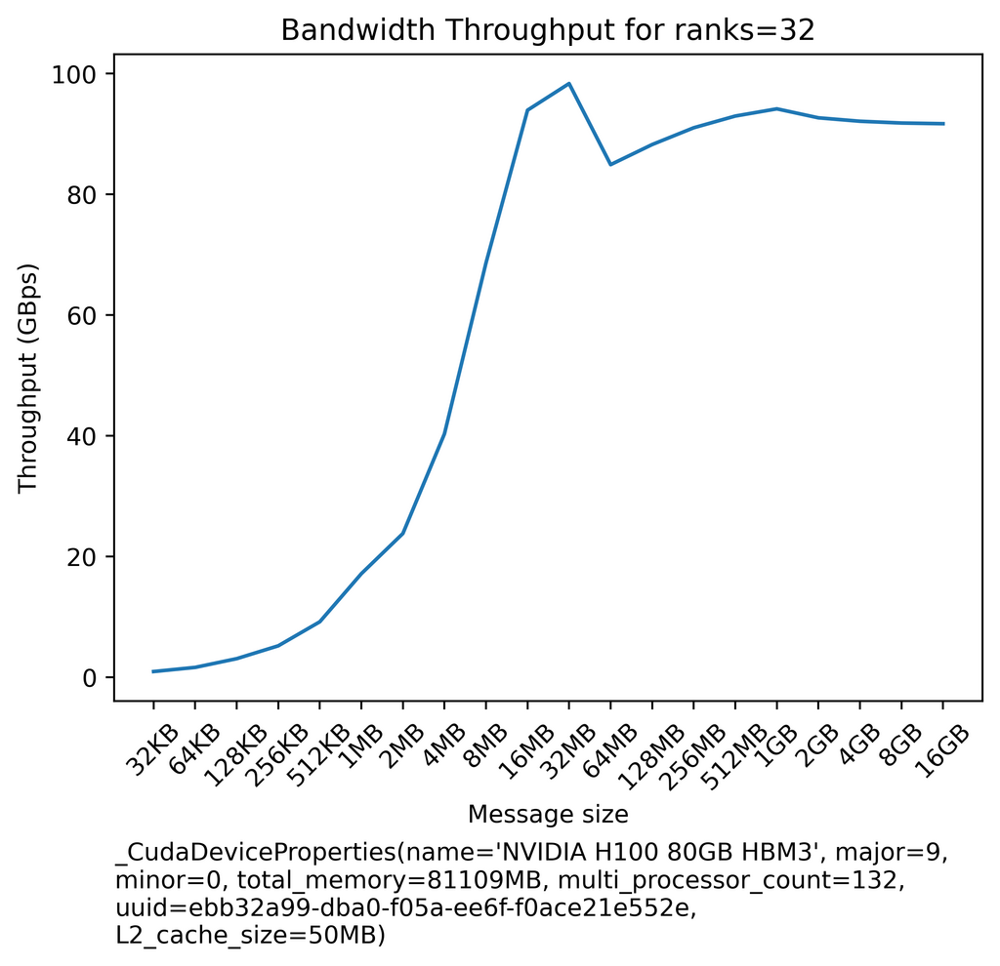
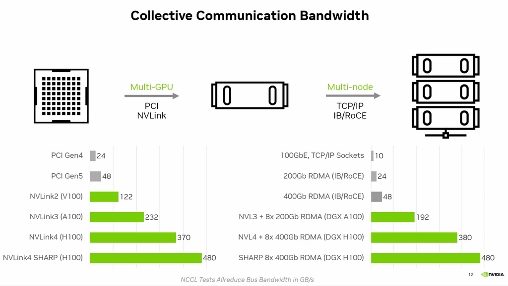

# Networking Benchmarks

## Tools

### all_reduce benchmark

[all_reduce_bench.py](all_reduce_bench.py) - a tool to benchmark the real network bandwidth while performing `all_reduce` on a largish amount of data. This is useful for finding out what one gets in reality as compared to the advertised spec. Somewhat similar to `nccl-tests`, but requires just PyTorch to run.

It generates output like this:
```
| payload |    busbw   |    algbw   |
| ------: | ---------: | ---------: |
|    32KB |   0.92GBps |   0.48GBps |
|    64KB |   1.61GBps |   0.83GBps |
|   128KB |   3.05GBps |   1.58GBps |
|   256KB |   5.18GBps |   2.67GBps |
|   512KB |   9.17GBps |   4.73GBps |
|     1MB |  17.13GBps |   8.84GBps |
|     2MB |  23.79GBps |  12.28GBps |
|     4MB |  40.30GBps |  20.80GBps |
|     8MB |  68.62GBps |  35.42GBps |
|    16MB |  93.93GBps |  48.48GBps |
|    32MB |  98.34GBps |  50.76GBps |
|    64MB |  84.90GBps |  43.82GBps |
|   128MB |  88.23GBps |  45.54GBps |
|   256MB |  91.01GBps |  46.97GBps |
|   512MB |  92.95GBps |  47.98GBps |
|     1GB |  94.15GBps |  48.59GBps |
|     2GB |  92.66GBps |  47.83GBps |
|     4GB |  92.09GBps |  47.53GBps |
|     8GB |  91.80GBps |  47.38GBps |
|    16GB |  91.69GBps |  47.32GBps |
```

And it also creates a plot:



For launching examples and notes please see the top of [all_reduce_bench.py](all_reduce_bench.py).

This table should give a good sense for what scores you should expect for all-reduce collective on a well-tuned network (left is intra-node and right is inter-node):


[source](https://www.nvidia.com/en-us/on-demand/session/gtc24-s62129/)

If you're benchmarking a different collective the expected bandwidth can be very different from the above all-reduce results. [This presentation](https://www.nvidia.com/en-us/on-demand/session/gtc24-s62129/) also gives point-to-point communication bandwidth expectations.


### all_gather_object vs all_reduce

[all_gather_object_vs_all_reduce.py](all_gather_object_vs_all_reduce.py) - a quick benchmark showing 23x speed up when moving from `all_gather_object` to `all_reduce` when collecting completion status from the process group. e.g. when implementing some sort of all-processes-are-done flag. This technique is usually used for synchronizing gpus when they may complete at different number of iterations - which one needs for inference over multiple DP channels, or when one wants to sync a `StopIteration` event in `DataLoader`. See also [all_gather_object_vs_all_gather.py](./all_gather_object_vs_all_gather.py).

### all_reduce latency comparison

[all_reduce_latency_comp.py](all_reduce_latency_comp.py) - exemplifies how 1x 4GB reduction is much faster than 1000x 4MB reductions.


## Crucial reproducibility requirements

The most important requirements for a series of successful experiments is to be able to reproduce the experiment environment again and again while changing only one or a few setup variables.

Therefore when you try to figure out whether some change will improve performance or make it worse, you must figure out how to keep things stable.

For example, you need to find a way to prevent the network usage from fluctuations. When we were doing performance optimizations for [108B pre-BLOOM experiments](https://github.com/bigscience-workshop/bigscience/tree/master/train/tr8-104B-wide) it was close to impossible to perform, since we were on a shared internode network and the exact same setup would yield different throughput depending on how many other users used the network. It was not working. During BLOOM-176B we were given a dedicated SLURM partition with an isolated network where the only traffic was ours. Doing the performance optimization in such environment was just perfect.


## Network throughput

It's critical to understand your particular model size and framework requirements with regard to network bandwidth, throughput and latency. If you underpay for network you will end up having idle gpus and thus you wasted money and time. If you overpay for very fast network, but your gpus are slow, then again you wasted money and time.

If your network is very slow, your training is likely to be network-bound and many improvements in the training setup will not help with the improving performance.

Note: The [EAI cookbook](https://github.com/EleutherAI/cookbook) contains a set of [communication benchmarks](https://github.com/EleutherAI/cookbook/tree/main/benchmarks/communication) for each collective that you can use to quickly measure the throughput of your internode or intranode network.

Here is a simple all-reduce benchmark that you can use to quickly measure the throughput of your internode network:

[all_reduce_bench.py](all_reduce_bench.py)

On CSPs that have enabled [SLURM Pyxis Container Plugin](https://github.com/NVIDIA/pyxis), such as CoreWeave, Crusoe, AWS, Oracle, Azure, GCP, etc, `all_reduce_bench.py` can be easily ran & reproduced via the following command:
```bash
sbatch -n <num_of_nodes> ./all_reduce_bench_pyxis.sbatch
```

Usually benchmarking at least 4 nodes is recommended, but, of course, if you already have access to all the nodes you will be using during the training, benchmark using all of the nodes.


If you do not have access to a pyxis SLURM environment, to run it on 4 nodes:

```
GPUS_PER_NODE=8
NNODES=4
MASTER_ADDR=$(scontrol show hostnames $SLURM_JOB_NODELIST | head -n 1)
MASTER_PORT=6000
python -u -m torch.distributed.run \
    --nproc_per_node $GPUS_PER_NODE \
    --nnodes $NNODES \
    --rdzv_endpoint $MASTER_ADDR:$MASTER_PORT \
    --rdzv_backend c10d \
    --max_restarts 0 \
    --role `hostname -s`: \
    --tee 3 \
    all_reduce_bench.py
```

Notes:
- adapt `MASTER_ADDR` to rank 0 hostname if it's not a SLURM environment where it's derived automatically.

Here is how to run launch it in a SLURM env with 4 nodes:
```
salloc --partition=mypartition --nodes=4 --ntasks-per-node=1 --cpus-per-task=48 --gres=gpu:8 --time=1:00:00 bash
srun --gres=gpu:8 --nodes=4 --tasks-per-node=1 python -u -m torch.distributed.run --nproc_per_node=8 --nnodes 4 --rdzv_endpoint $(scontrol show hostnames $SLURM_JOB_NODELIST | head -n 1):6000 --rdzv_backend c10d all_reduce_bench.py
```

Notes:
- You are likely to need to adapt `--cpus-per-task` and `--partition` arguments there.
- You do `salloc` once and then can repeat `srun` multiple times on the same allocation.

You may get results anywhere between 5Gbps and 1600Gbps (as of this writing). The minimal speed to prevent being network bound will depend on your particular training framework, but typically you'd want at least 400Gbps or higher. Though we trained BLOOM on 50Gbps.

Frameworks that shard weights and optim stages like [Deepspeed](https://github.com/deepspeedai/DeepSpeed) w/ ZeRO Stage-3 do a lot more traffic than frameworks like [Megatron-Deepspeed](https://github.com/bigscience-workshop/Megatron-DeepSpeed) which do tensor and pipeline parallelism in addition to data parallelism. The latter ones only send activations across and thus don't need as much bandwidth. But they are much more complicated to set up and run.

Of course, an efficient framework will overlap communications and compute, so that while one stage is fetching data, the other stage in parallel runs computations. So as long as the communication overhead is smaller than compute the network requirements are satisfied and don't have to be super fantastic.

To get reasonable GPU throughput when training at scale (64+GPUs) with DeepSpeed ZeRO Stage 3 with V100s

1. 100Gbps is not enough
2. 200-400 Gbps is ok
3. 800-1000 Gbps is ideal

[full details](https://github.com/deepspeedai/DeepSpeed/issues/2928#issuecomment-1463041491)

Of course, the requirements are higher for A100 gpu nodes and even higher for H100s (but no such benchmark information has been shared yet).


### Extrapolating benchmark results from several nodes to many

As it's often not easy to benchmark hundreds of nodes, often we try to benchmark interconnect performance using, say, 4 nodes. I wasn't sure whether this would give the correct indication for when 40 or 400 nodes will be used so I asked about it [here](https://github.com/NVIDIA/nccl/issues/790) and the answer was:

> Extrapolating at scale is not that hard for ring and tree (we have a function in `tuning.cc` predicting it, based on the ring linear latency and the tree log latency with reduced BW). Now as you scale, there are many factors which may cause your real performance to be very far off the prediction, like routing. Also note on an IB network you'll be able to use SHARP; that way your latency stays mostly constant as you scale, your bandwidth doesn't degrade much either, and you're always better than both ring and tree.


## Disable Access Control Services

PCI Access Control Services (ACS) used for IO virtualization (also known as VT-d or IOMMU) force P2P PCIe transactions to go up through the PCIe Root Complex, which does not enable GDS to bypass the CPU on paths between a network adapter or NVMe and the GPU in systems that include a PCIe switch.

For the optimal GDS performance, disable ACS by following these instructions [here](https://docs.nvidia.com/deeplearning/nccl/user-guide/docs/troubleshooting.html#pci-access-control-services-acs). Here are some [additional notes](https://docs.nvidia.com/gpudirect-storage/best-practices-guide/index.html)

Please note that if you're using Virtual machines you can't disable ACS as it's a required feature. To run with maximum performance inside virtual machines, Address Translation Service (ATS) needs to be enabled in network adapters.


## Performance-Oriented NCCL Environment Variables

While NCCL is excellent at automatically figuring out the best performance for any given network, sometimes it needs some help, in which case the following NCCL env vars are used to tune up performance. Let's look at a few common ones you might want to be aware of, and the full list of those can be found [here](https://docs.nvidia.com/deeplearning/nccl/user-guide/docs/env.html). e

Note that some `NCCL_IB_*` env vars apply to RoCEv2 networks as well.

### `NCCL_ALGO`

This one defines which algorithms NCCL will use. Typically it's one of:

1. Tree
2. Ring
3. CollnetDirect and CollnetChain (IB SHARP)
4. NVLS (NVLink SHARP)

I was asking questions about how a user can do the optimization and was told at [this NCCL Issue](https://github.com/NVIDIA/nccl/issues/790) that basically the user shouldn't try to optimize anything as NCCL has a ton of smart algorithms inside that will try to automatically switch from one algorithm to another depending on a concrete situation.

Sylvain Jeaugey shared:

> There used to be a static threshold, but it's been replaced by a more complex tuning system. The new system builds a model of the latency and bandwidth of each algorithm/protocol combination (that's many, many combinations) and decides which one should perform best depending on the size. So there is no longer an env var and a static value, which is good because the performance of each algorithm depends on the number of nodes and number of GPUs per node and therefore we need to navigate a 2D space of algo/protocols which isn't easy. You can always force one algorithm with `NCCL_ALGO=TREE` and `NCCL_ALGO=RING` and see what performance you get and whether NCCL switches at the right point. I know it's hard to understand, but it's also the best solution we found to have the best performance across all platforms and users without users having to manually tune the switch points. Downside is, if you want to manually tune things, you can't.

If you use `NCCL_ALGO` you need to list the algorithms to consider, but otherwise you have no control over it. So, really, this is only useful if you want to make sure that one of the algorithms isn't used.

When asking about which algorithm is better, I received:

> Roughly speaking, ring is superior in terms of peak bandwidth (except on 2 nodes), tree is superior in terms of base latency (especially as we scale). `Bandwidth = Size / Time`, so whether you look at the time or the bandwidth for a given size, it will be a combination of both the peak bandwidth and the base latency. For a fixed size, as you scale, the base latency of ring will become prevalent and tree will be better.

There is also a new algo, named `NVLS`, which if NVLink SHARP is available will run faster than NVLink itself, e.g. with NVLink 4.0 (450GBps) one can clock 480GBps doing all-reduce benchmarks. They are working on the inter-node version of that which [requires IB or RoCE](https://github.com/NVIDIA/nccl/issues/1031#issuecomment-1773965518) - this new algo is not documented anywhere as of this writing.

And finally, if you would like to know which algo is being used - you can't - see [this answer](https://github.com/NVIDIA/nccl/issues/754#issuecomment-1346163469). So if you want to know which algo gives which throughput you will have to try them all explicitly by setting `NCCL_ALGO` env var and then you'd know which one was chosen. Or you can edit and recompile NCCL as suggested in that same answer, but you won't want this in production.


### `NCCL_CROSS_NIC`

The `NCCL_CROSS_NIC` variable controls whether NCCL should allow rings/trees to use different NICs, causing inter-node communication to use different NICs on different nodes.

To maximize inter-node communication performance when using multiple NICs, NCCL tries to communicate between same NICs between nodes, to allow for network design where each NIC from each node connects to a different network switch (network rail), and avoid any risk of traffic flow interference. The NCCL_CROSS_NIC setting is therefore dependent on the network topology, and in particular depending on whether the network fabric is rail-optimized or not.

This has no effect on systems with only one NIC.

Values accepted:

- 0: Always use the same NIC for the same ring/tree, to avoid crossing network rails. Suited for networks with per NIC switches (rails), with a slow inter-rail connection. Note there are corner cases for which NCCL may still cause cross-rail communication, so rails still need to be connected at the top.
- 1: Do not attempt to use the same NIC for the same ring/tree. This is suited for networks where all NICs from a node are connected to the same switch, hence trying to communicate across the same NICs does not help avoiding flow collisions.
- 2: (Default) Try to use the same NIC for the same ring/tree, but still allow for it if it would result in better performance.


### `NCCL_IB_QPS_PER_CONNECTION`

This is relevant if you're on a multi-layer Infiniband or RoCEv2 network.

`NCCL_IB_QPS_PER_CONNECTION` defines the number of IB queue pairs to use for each connection between two ranks. This can be useful on multi-level fabrics which need multiple queue pairs to have good routing entropy. In other words, when your jobs are crossing spine or super-spine switches.

By default it is set to `1`, but having a higher number might benefit throughput.

Depends on the size of the network. you could start with something like 4 for any cluster over 64 GPUs (i.e. any cluster that’s bigger than the radix (number of ports) of its IB switch (e.g. the IB NDR switch radix is 64.)

Ideally you'd ask your cloud provider if they have already researched the best value, but if they didn't you can do it yourself, albeit it might be use-case specific.

The other gotcha is that when the value is higher than `1` an additional GPU memory will be consumed.


### `NCCL_MIN_CTAS` and `NCCL_MAX_CTAS`

Cooperative Thread Array (CTA) implements CUDA thread blocks - You can read about it [here](https://docs.nvidia.com/cuda/parallel-thread-execution/#thread-hierarchy).

In the past these 2 env vars were called `NCCL_MIN_NCHANNELS` and `NCCL_MAX_NCHANNELS`.

Because in the CUDA world compute and communication operations share the same limited number of SMs per GPU, if too many SMs are used for compute, the comms will be blocked and vice versa. Since ideally compute and comms should overlap and not block each other finding the right balance is important.

The CTA value is derived algorithmically by NCCL, but the default behavior can be overridden by setting the lower and upper limits via the env vars: [`NCCL_MIN_CTAS`](https://docs.nvidia.com/deeplearning/nccl/user-guide/docs/env.html?highlight=nccl_max_ctas#nccl-min-ctas) and [`NCCL_MAX_CTAS`](https://docs.nvidia.com/deeplearning/nccl/user-guide/docs/env.html?highlight=nccl_max_ctas#nccl-max-ctas). And then NCCL's tuner will be limited to choose the best value in the user-imposed range. The same can be accomplished from the program using `pg_options` in [`torch.distributed.init_process_group`](https://pytorch.org/docs/stable/distributed.html#torch.distributed.init_process_group) via [`ncclConfig_t`](https://docs.nvidia.com/deeplearning/nccl/user-guide/docs/api/types.html#ncclconfig-t)'s `minCTAs` and `maxCTAs` (other process group creation functions have `pg_options` as well). The latter approach allows you to set different CTA settings to different process groups, whereas the env vars will apply globally to all process groups.

Here is an example that directly sets both values to `32` per process group:

```
import torch
nccl_options = torch.distributed.ProcessGroupNCCL.Options()
nccl_options.config.min_ctas = 32
nccl_options.config.max_ctas = 32
torch.distributed.init_process_group(..., pg_options=nccl_options)
```

In order to find the best performance to experiment with different values against a specific benchmark of choice, that emulates the intended workload, you could set both config options to the same value and then bisect on a range of 1 to 64 or similar.


## Infiniband

### Infiniband adaptive routing

Make sure your cloud provider enables IB adaptive routing which could greatly improve the performance.

For nuances see this paper: [Adaptive Routing in InfiniBand Hardware](https://web-backend.simula.no/sites/default/files/publications/files/adaptive_routing_in_infiniband_hardware.pdf).
