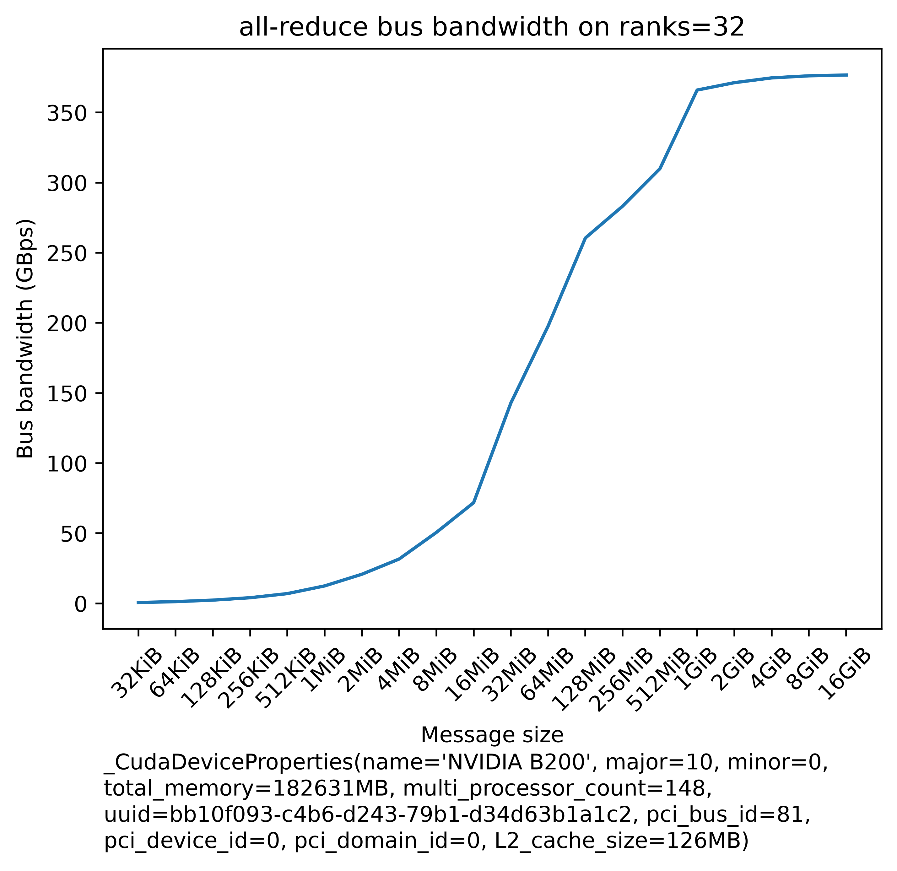
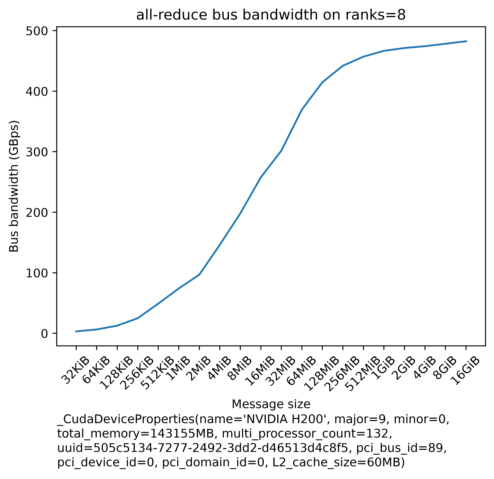
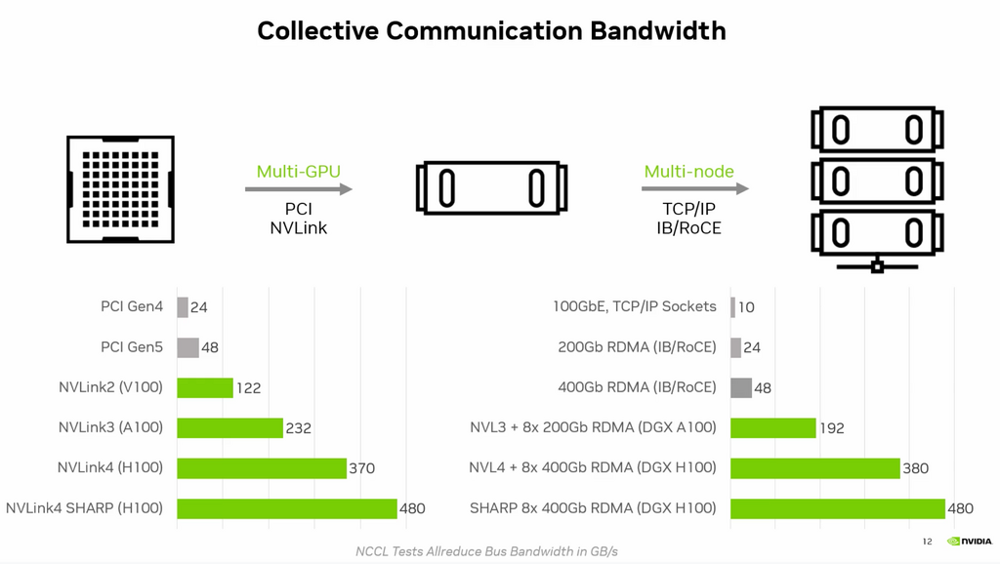
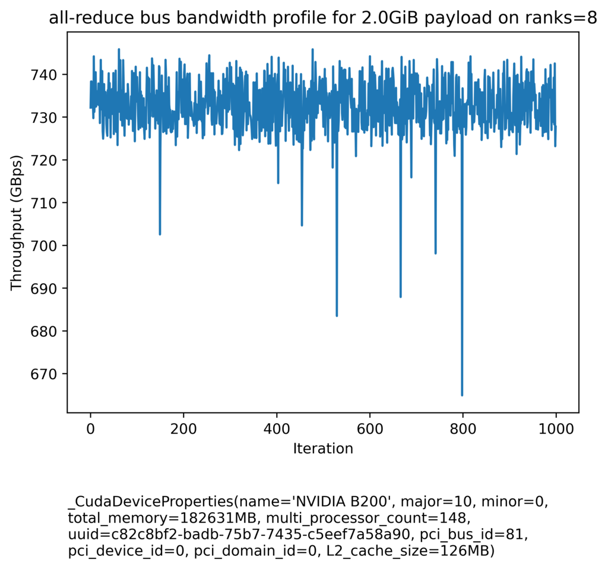
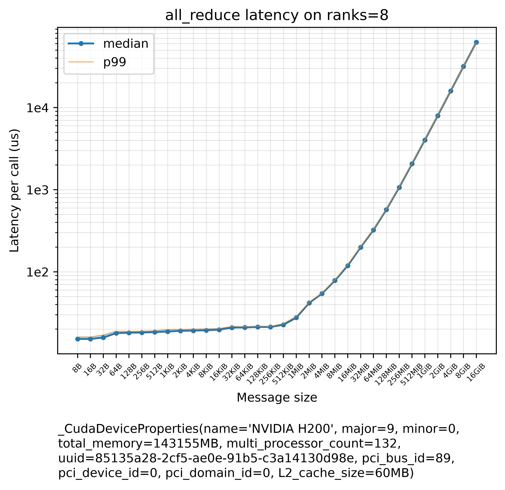
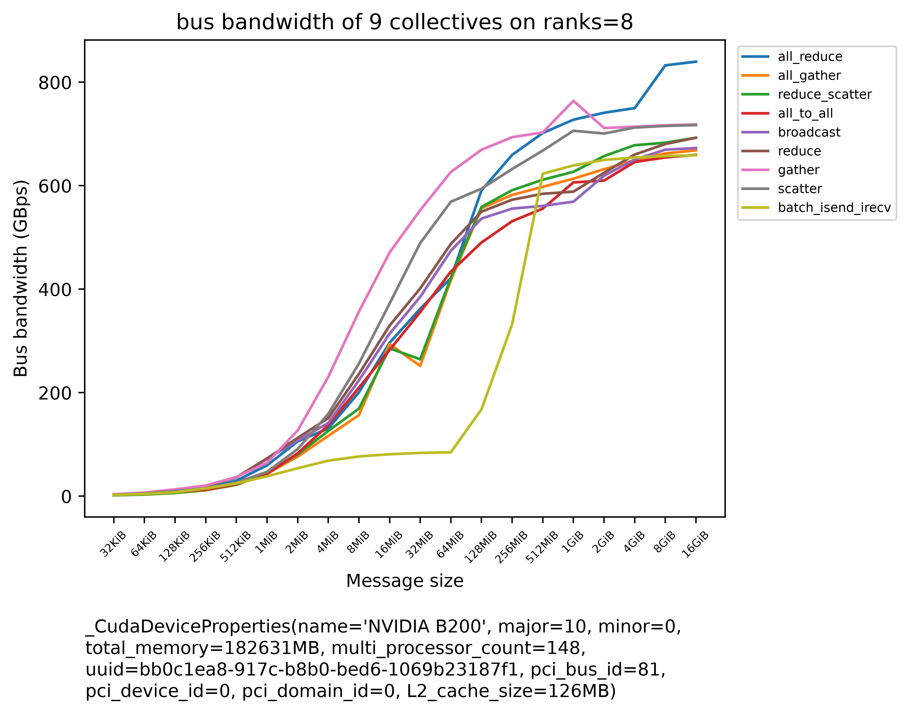
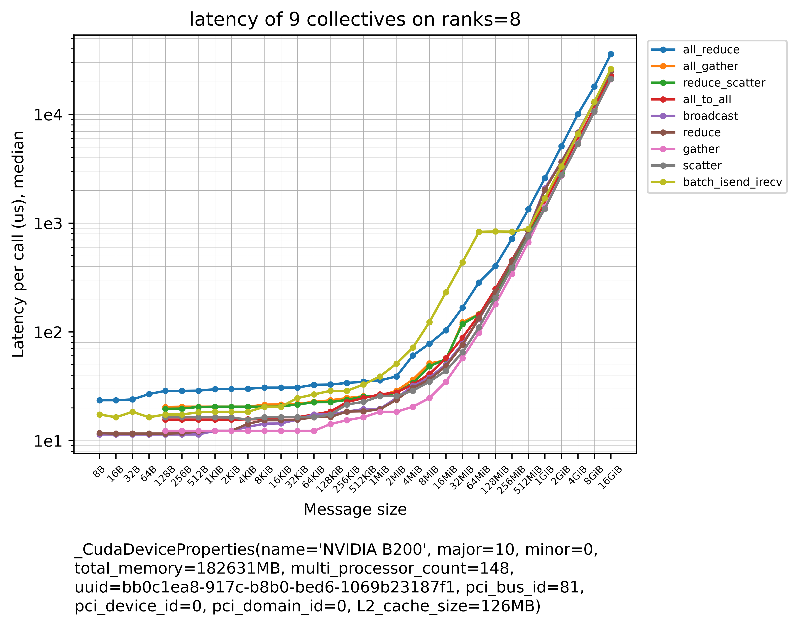

# Networking Benchmarks

## Tools

<a id="all_reduce-benchmark"></a>

### torch-dist-bench

[torch-dist-bench.py](torch-dist-bench.py) - a tool to benchmark the real network bandwidth and latency while performing `all_reduce` and [other collectives](#other-collectives), over a range of payloads. This is useful for finding out what one gets in reality as compared to the advertised spec. Somewhat similar to `nccl-tests`, but requires just PyTorch to run. You want to use this benchmark if your application uses NCCL collectives via `torch.distributed`, and `nccl-tests` if you write CUDA NCCL kernels. This benchmark calls the collectives the way your program does: through PyTorch, which runs some of them with different NCCL calls than `nccl-tests` does, e.g. `scatter` and `batch_isend_irecv` - see [Other collectives](#other-collectives) - and with `--with-host-overhead` it also includes PyTorch's per-call host overhead of some 20-30µs, which at small payloads is about as long as the collective itself.

footnote: Its previous incarnation was known as `all_reduce_bench.py` as it measured just the all-reduce collective.

On 4 8x-B200 nodes it give us:
```
The average bandwidth of all_reduce over 32 ranks (5 warmups / 20 trials, up to 10 queued calls per trial):

| payload |    busbw   |    algbw   |
| ------: | ---------: | ---------: |
|   32KiB |   0.65GBps |   0.33GBps |
|   64KiB |   1.27GBps |   0.66GBps |
|  128KiB |   2.35GBps |   1.21GBps |
|  256KiB |   4.06GBps |   2.10GBps |
|  512KiB |   6.99GBps |   3.61GBps |
|    1MiB |  12.47GBps |   6.44GBps |
|    2MiB |  20.79GBps |  10.73GBps |
|    4MiB |  31.63GBps |  16.33GBps |
|    8MiB |  50.61GBps |  26.12GBps |
|   16MiB |  71.80GBps |  37.06GBps |
|   32MiB | 142.90GBps |  73.76GBps |
|   64MiB | 197.77GBps | 102.07GBps |
|  128MiB | 260.50GBps | 134.45GBps |
|  256MiB | 283.23GBps | 146.18GBps |
|  512MiB | 309.91GBps | 159.95GBps |
|    1GiB | 365.99GBps | 188.90GBps |
|    2GiB | 371.26GBps | 191.62GBps |
|    4GiB | 374.66GBps | 193.37GBps |
|    8GiB | 376.14GBps | 194.14GBps |
|   16GiB | 376.71GBps | 194.43GBps |
```

Read the normalized `busbw` column rather than `algbw` - [PERFORMANCE.md](https://github.com/NVIDIA/nccl-tests/blob/master/doc/PERFORMANCE.md#bandwidth) explains why. Like `nccl-tests`, the benchmark measures a unidirectional bandwidth, so compare it against the advertised unidirectional peak throughput, not the bidirectional (duplex) one.

And if you have the `matplotlib` pip package installed, it also creates a plot:




Here is the same benchmark on a single 8x H200 node (`torch=2.14.0+cu130`, `cuda=13.0`, `nccl=2.30.7`, 5 warmup and 20 trial iterations per payload, 13 seconds for the whole sweep):



Note the linear y-axis compresses everything below ~100GBps into the bottom of the plot, so the small-payload end - the part that matters for gradient bucketing - is easier to read off the `default` column of the table in [How the bandwidth is measured](#how-the-bandwidth-is-measured), measured on the same node, than off the curve. That sweep tops out at 482.35GBps, which is *above* the 450GBps unidirectional [NVLink 4](../README.md#nvlink) spec rather than below it; see [SHARP](../README.md#sharp) for why, and for what the same node measures with it disabled.

[Inter-node speed depends on intra-node speed](../README.md#inter-node-speed-depends-on-intra-node-speed) explains why a 4 node-benchmark (32 ranks) tops out at 376.71GBps when a single node (8 ranks) of the same B200s reaches 838.97GBps, and what the number means for each NIC.

For launching examples please see the top of [torch-dist-bench.py](torch-dist-bench.py). You can interrupt the benchmark with Ctrl-C, and it'll still report the results it measured up to that point.

This table should give a good sense for what scores you should expect for all-reduce collective on a well-tuned network (left is intra-node and right is inter-node):


[source](https://www.nvidia.com/en-us/on-demand/session/gtc24-s62129/)

If you're benchmarking a different collective the expected bandwidth can be very different from the above all-reduce results. [This presentation](https://www.nvidia.com/en-us/on-demand/session/gtc24-s62129/) also gives point-to-point communication bandwidth expectations.

To check the stability of all-reduce over time, rather than averaging the results, you can profile a single payload size with these 2 flags `--profile_stability --payload_size_in_gib 0.5` (change the last value to the desired payload size in GiB). Beware that a typical ML workload doesn't call all-reduce back to back non-stop so this approach puts the network through a stress test, which is a somewhat non-typical workload. But it can still show if the network has issues with sustained load. Here is an example of a plot generated on a 8x B200 with a payload of 2GiB:



<a id="how-the-calls-are-timed"></a>

#### How the bandwidth is measured

By default each trial keeps the GPU busy for ~2ms, queues up to 10 back-to-back `dist.all_reduce` calls behind that, and divides the elapsed time by the number of calls. Payloads up to 64MiB get 10 calls, larger ones fewer, and those from 1GiB up a single call, where one call takes milliseconds anyway. This hides PyTorch's 20-30µs of host overhead per call, as it is hidden in a program whose host stays ahead of the GPU, e.g. a training loop with enough compute queued between its collectives - where the host doesn't stay ahead, such as with small collectives issued back to back or a program waiting on each result, use `--with-host-overhead`. The multiple calls also average out the ranks reaching the first one at slightly different times.

These bandwidth trials record a CUDA event only before the first call and after the last. The [latency](#latency) is measured by separate trials with an event after every call, because an event recorded between two queued calls slows them down: on an 8x B200 node a 1MiB all-reduce takes 35µs with one and 30µs without, and `nccl-tests` shows the same difference between its `-I 1` and its default timing. Timing the bandwidth with the per-call events would cost an all-reduce 9-13% of its bandwidth from 8KiB to 2MiB there, and the [other collectives](#other-collectives) up to 35%.

Here are the measurements on the same 8x H200 node as the plot above, next to [nccl-tests](#nccl-tests)' run built against the same NCCL version - it is what code calling NCCL API directly:

| payload | default    | nccl-tests | difference |
| ------: | ---------: | ---------: | ---------: |
|   32KiB |   3.15GBps |   3.20GBps |        +2% |
|   64KiB |   6.16GBps |   6.26GBps |        +2% |
|  128KiB |  12.46GBps |  12.40GBps |      -0.5% |
|  256KiB |  24.68GBps |  24.63GBps |      -0.2% |
|  512KiB |  48.15GBps |  48.30GBps |      +0.3% |
|    1MiB |  74.57GBps |  72.45GBps |        -3% |
|    2MiB |  96.26GBps |  91.48GBps |        -5% |
|    4MiB | 145.14GBps | 139.97GBps |        -4% |
|    8MiB | 196.56GBps | 182.03GBps |        -7% |
|   16MiB | 255.90GBps | 242.45GBps |        -5% |
|   32MiB | 301.25GBps | 298.44GBps |      -0.9% |
|   64MiB | 368.86GBps | 369.82GBps |      +0.3% |
|  128MiB | 414.54GBps | 411.21GBps |      -0.8% |
|  256MiB | 441.87GBps | 442.27GBps |      +0.1% |
|  512MiB | 456.23GBps | 455.82GBps |      -0.1% |
|    1GiB | 465.91GBps | 464.00GBps |      -0.4% |
|    2GiB | 471.06GBps | 468.31GBps |      -0.6% |
|    4GiB | 474.13GBps | 473.10GBps |      -0.2% |
|    8GiB | 478.24GBps | 475.16GBps |      -0.6% |
|   16GiB | 482.25GBps | 480.70GBps |      -0.3% |

The two agree within 2%, except from 1MiB to 16MiB, where `nccl-tests` reads 3-7% lower. Whether to measure with this benchmark or with `nccl-tests` depends on whether you are writing a PyTorch program or a NCCL kernel - see [nccl-tests](#nccl-tests).

If your workload captures its all-reduce calls in a CUDA graph through PyTorch, expect lower `busbw` at small payloads than this benchmark's default timing reports. Replaying PyTorch-captured all-reduces on B200 left a gap of about 2.5µs between consecutive ones, which cost regular all-reduces up to 9% and symmetric memory ones 12-26% at 2MiB and below, where a call takes only 10-35µs.

Add `--with-host-overhead` to time one call per trial on an idle GPU instead. It charges that host overhead to every call - what an all-reduce costs when the program waits for its result before doing anything else. Its latency then also includes the ranks reaching the call at different times, as the latency of OSU's `osu_allreduce` does.

Neither mode times a collective that runs concurrently with compute kernels, as it does in a training loop that overlaps them. The kernels compete for the SMs and the memory bandwidth, so an overlapped collective can take longer than reported here if it can't access immediately all the SMs it needs; `nccl-tests` doesn't time that either.

#### Latency

Next to the bandwidth, the benchmark reports how long a single call takes - the median, the 99th percentile (p99) and the mean - and plots the median and the p99 against the payload size. For small payloads this is the number that matters, as they move next to nothing: on an 8x H200 node an 8B all-reduce still takes 15µs, and every payload up to 512KiB takes 15-23µs, so a faster link wouldn't help them - fewer calls or cheaper ones would. This adds up fast in inference: a model served with tensor parallelism over 8 accelerators does 2 all-reduces per layer for every generated token, and with a hidden size of 8192 in bf16 a batch of up to 32 tokens makes each a 16-512KiB all-reduce, right in that flat range - so an 80-layer model waits 160 x 15µs = 2.4ms per token on all-reduces alone, however fast its links. Training has small all-reduces too, to sync flags, scalars or loss values across ranks, and MoE pays the same toll on the [all-to-all](#other-collectives) of its token routing.

And all-reduce is the best case: NCCL gives only all-reduce its tree algorithm, and NVLS can reduce it inside the switch, so other collectives can take longer at the same payload - see [which collective to measure latency with](../README.md#which-collective-to-measure-latency-with), and time them with `--collectives`.



#### How the latency is measured

- Each call's time is the time from the end of the previous queued call to its own end, as in `nccl-tests`' per-iteration timing (`-I 1`), which it reports in its `i_*` columns, and as the median in its `-J` JSON output. The first call of a trial is left out, and a 1-element all-reduce after the busy wait lines the ranks up on the GPU before it: otherwise a rank whose busy wait ends first spends the difference waiting in its first calls - in one call for most collectives, but in up to ranks-1 calls for `batch_isend_irecv`, whose ring passes the wait on one rank per call.
- A call isn't done until it's done on every rank, so each call's time is that of its slowest rank, as in `nccl-tests`' per-iteration median and p99. Its `time` column is instead each rank's time per call averaged over the ranks, which is close for an all-reduce, whose ranks finish together, but lower for collectives whose ranks don't, such as `broadcast`.
- Small payloads get up to 1000 calls each, so that the p99 is the 10th slowest of them, and larger payloads fewer, once 1000 calls would move more than 40MiB - [Intel MPI Benchmarks](https://github.com/intel/mpi-benchmarks) counts its repetitions the same way. `nccl-tests` times 20 calls by default and OSU's `osu_allreduce` 1000 up to 8KiB and 100 above.
- Median and p99 rather than the mean, because one slow call moves the mean but not the median, and the p99 shows how slow the slow calls get. The mean is printed too.
- A rank's Python thread occasionally pauses for a few milliseconds. When that happens while it queues a trial's calls, its GPU runs out of queued work before the 2ms busy wait is over, and the trial times the pause rather than the all-reduce. Such trials are left out on all ranks, and the report says how many: on the 8x H200 node it was 50-60 of 1904 trials per run. Without this, the p99 at small payloads read anywhere from 19µs to 380µs and changed from run to run.

On the same 8x H200 node (`torch=2.14.0+cu130`, `nccl=2.30.7`), compared with `nccl-tests` timing 1000 calls per payload one by one (`-n 1000 -w 200 -I 1`, in-place):

| payload | median | p99    | sym-mem<br>median | sym-mem<br>p99 | host<br>overhead<br>median | host<br>overhead<br>p99 | nccl-tests<br>`time` | nccl-tests<br>p99 |
| ------: | -----: | -----: | ----------------: | -------------: | -------------------------: | ----------------------: | -------------------: | ----------------: |
|      8B | 15.2µs | 16.1µs |             8.1µs |          9.0µs |                     36.6µs |                  3668µs |               14.9µs |            16.1µs |
|     64B | 17.9µs | 19.0µs |             8.1µs |          9.2µs |                     38.0µs |                  5166µs |               17.0µs |            19.0µs |
|    1KiB | 18.8µs | 19.8µs |             8.4µs |          9.3µs |                     39.1µs |                  5213µs |               18.2µs |            19.7µs |
|   32KiB | 20.9µs | 21.7µs |            11.6µs |         12.4µs |                     41.7µs |                  4877µs |               20.4µs |            21.6µs |
|  256KiB | 21.4µs | 21.9µs |            12.6µs |         13.8µs |                     43.5µs |                  3607µs |               21.0µs |            21.7µs |
|    1MiB | 27.7µs | 28.5µs |            16.3µs |         17.2µs |                     50.9µs |                    75µs |               27.8µs |            28.6µs |

sym-mem: run with `--sym-mem`; host overhead: run with `--with-host-overhead`.

The default timing agrees with `nccl-tests` within 1µs at the p99, and [symmetric memory](#symmetric-memory) roughly halves the latency up to 16KiB. On an 8x B200 node with the same software the two agreed within 1µs as well - an 8B all-reduce took 23.5µs at the median and 24.7µs at the p99, and 11.6µs and 12.5µs with `--sym-mem` - so a small all-reduce costs more there than on the H200 node. `--with-host-overhead` keeps the trials in which a host paused, as that's what a program that waits on each all-reduce gets: its median adds the ~20µs of PyTorch's per-call overhead, and its p99 up to 256KiB is 3.6-5.2ms, because more than 1 call in 100 waited for some rank's paused host.

The report also names the smallest payload that reaches half the peak `busbw` - 16MiB or 32MiB on the 8x H200 node above, as 16MiB sits right at the half. Payloads below it get less than half the bandwidth the setup can give, and are better judged by their latency.

By default the latency is measured from 8B to 16GiB and the bandwidth from 32KiB to 16GiB, since below 32KiB a call's time is nearly all latency, so its `busbw` says little. `--min-payload` moves where the latency range starts, `--min-busbw-payload` where the bandwidth range starts, and `--max-payload` where both end - e.g. `--max-payload 16K` for a quick latency-only run.

#### Other collectives

The benchmark times `all_reduce` by default. To time other collectives, add `--collectives` with one or more of their names, comma separated, e.g. `--collectives all_gather,reduce_scatter` or `all` for all nine of them - `all_reduce`, `all_gather`, `reduce_scatter`, `all_to_all`, `broadcast`, `reduce`, `gather`, `scatter` and `batch_isend_irecv`. Examples:

```bash
python -u -m torch.distributed.run --nproc_per_node=8 torch-dist-bench.py --collectives all_gather,reduce_scatter
python -u -m torch.distributed.run --nproc_per_node=8 torch-dist-bench.py --collectives all
```

Each collective gets the same timing and plots as `all_reduce`, saved as `busbw-mean-<collective>-<host>-<ranks>.png` and `latency-<collective>-<host>-<ranks>.png`. When more than one is benchmarked, they share one table with each collective's `busbw` and latency median per payload - add `--separate-tables` for a table each with `algbw` and the latency's p99 and mean as well - and a summary table and two plots comparing them follow, saved as `busbw-mean-collectives-<host>-<ranks>.png` and `latency-collectives-<host>-<ranks>.png`. All nine from 8B to 16GiB take under 2 minutes on one 8x B200 node.

The payload, `algbw` and `busbw` follow `nccl-tests`, whose [PERFORMANCE.md](https://github.com/NVIDIA/nccl-tests/blob/master/doc/PERFORMANCE.md) explains them. The payload is the larger of a rank's input and output buffers, and `busbw` is `algbw` multiplied by a factor that makes it comparable across collectives and numbers of ranks `n`:

| collective          | a rank's input            | a rank's output                 | `busbw`<br>factor |
| :------------------ | :------------------------ | :------------------------------ | :---------------- |
| `all_reduce`        | the payload               | the payload                     | 2(n-1)/n          |
| `all_gather`        | 1/n of the payload        | the payload                     | (n-1)/n           |
| `reduce_scatter`    | the payload               | 1/n of the payload              | (n-1)/n           |
| `all_to_all`        | the payload, 1/n per rank | the payload, 1/n from each rank | (n-1)/n           |
| `broadcast`         | the payload, on the root  | the payload                     | 1                 |
| `reduce`            | the payload               | the payload, on the root        | 1                 |
| `gather`            | 1/n of the payload        | the payload, on the root        | (n-1)/n           |
| `scatter`           | the payload, on the root  | 1/n of the payload              | (n-1)/n           |
| `batch_isend_irecv` | the payload, to rank+1    | the payload, from rank-1        | 1                 |

The root is rank 0, and `batch_isend_irecv` has each rank send to the next rank and receive from the previous one, as `nccl-tests` does. The send and the receive are issued together as one batch: unbatched, they'd run one after the other on the same stream, and each rank's send would wait on its neighbour's receive, which is queued behind that neighbour's own send.

As in `nccl-tests`, the 1/n pieces are rounded down to a multiple of 16 bytes, so payloads with less than 16 bytes per rank are skipped - those below 128B on 8 ranks - and with a number of ranks that isn't a power of 2, `all_gather`, `gather`, `reduce_scatter`, `scatter` and `all_to_all` move a little less than the payload, and the table reports what they did move.

Here are all nine on an 8x B200 node (`torch=2.14.0+cu130`, `nccl=2.30.7`), with and without `--sym-mem`:

| collective          | 1KiB<br>median | 1KiB<br>p99 | sym-mem<br>1KiB<br>median | busbw<br>at 16GiB | sym-mem<br>busbw<br>at 16GiB | half-peak<br>payload |
| :------------------ | -------------: | ----------: | ------------------------: | ----------------: | ---------------------------: | -------------------: |
| `all_reduce`        |         29.7µs |      31.7µs |                    12.3µs |        839.63GBps |                   819.63GBps |                64MiB |
| `all_gather`        |         20.5µs |      22.6µs |                    12.1µs |        668.28GBps |                   748.32GBps |                64MiB |
| `reduce_scatter`    |         20.5µs |      22.5µs |                    12.3µs |        692.63GBps |                   488.22GBps |                64MiB |
| `all_to_all`        |         15.6µs |      17.5µs |                    15.6µs |        659.71GBps |                   690.73GBps |                32MiB |
| `broadcast`         |         12.3µs |      14.4µs |                    11.7µs |        672.71GBps |                   693.71GBps |                32MiB |
| `reduce`            |         12.3µs |      14.4µs |                    12.3µs |        692.63GBps |                   693.79GBps |                32MiB |
| `gather`            |         12.3µs |      13.3µs |                    12.3µs |        718.33GBps |                   718.30GBps |                16MiB |
| `scatter`           |         16.4µs |      18.4µs |                    15.4µs |        717.11GBps |                   723.19GBps |                16MiB |
| `batch_isend_irecv` |         18.4µs |      22.5µs |                    18.3µs |        658.84GBps |                   691.51GBps |               256MiB |

sym-mem: run with `--sym-mem`. The half-peak payload is the smallest one reaching half the collective's peak `busbw`, as in [Latency](#latency).





At small payloads `all_to_all`, which MoE dispatch and combine use, takes 15.6µs - about half of an `all_reduce` - and `broadcast`, `reduce` and `gather` take 12.3µs. `--sym-mem` brings `all_reduce`, `all_gather` and `reduce_scatter` down to the same 12µs and leaves the others' small payloads about where they were. At larger payloads it helps some collectives and hurts others: `all_gather` gets 748GBps at 16GiB instead of 668GBps and `batch_isend_irecv` up to twice the `busbw` from 4MiB to 128MiB, while `broadcast` loses up to half its `busbw` from 4MiB to 128MiB, and `reduce_scatter` tops out at 488GBps instead of 693GBps.

`gather` reads 764GBps at 1GiB, more than at 16GiB - read its peak off the larger payloads.

Against `nccl-tests` built with the same NCCL on the same node - its per-iteration median and p99 (`-I 1`) for the latency, its default timing for the bandwidth - `all_reduce`, `all_gather`, `reduce_scatter`, `all_to_all`, `broadcast`, `reduce` and `gather` agree within about 1µs up to 1MiB and within 2% at 16GiB, and so do their p99s. Where they differ, it's because PyTorch runs the collective differently or `nccl-tests` times it differently:

- `scatter` takes 3-4µs more up to 128KiB and 6-7µs more from 256KiB to 1MiB, and gets 7-24% less `busbw` from 8KiB to 256MiB. `torch.distributed.scatter` sends each rank its piece with separate NCCL sends, while `nccl-tests` calls NCCL's own `ncclScatter`, added in NCCL 2.28. For `gather` the benchmark calls `torch.distributed.gather_single`, which uses `ncclGather` when PyTorch was built with NCCL>=2.28.3, and agrees with `nccl-tests`. The older `torch.distributed.gather`, which takes a list of output tensors and uses separate sends and receives, took 3.7µs longer at 1KiB.
- `batch_isend_irecv` takes 2-4µs more up to 128KiB. Its send to the next rank and receive from the previous one go through PyTorch's point-to-point path rather than a single collective call. Its `busbw` agrees within 9% from 8KiB up, and within 1% from 32MiB up.
- `broadcast` and `reduce` get 7-15% less `busbw` from 4MiB to 2GiB, because back-to-back `broadcast`s and `reduce`s overlap, unlike `all_reduce`s, and `nccl-tests` times 20 calls in a row, while this benchmark times trials of at most 10 calls, and of 1 call from 1GiB. Against a single `nccl-tests` call (`-n 1`) its 1GiB `broadcast`, at 1.89ms, is within 5%. Its latency median at 1GiB is 2.09ms, because a call's latency is the slowest rank's while the bandwidth, like `nccl-tests`' `time` column, averages over the ranks, and a `broadcast`'s ranks don't finish together.

#### Other implementations

Other benchmarks that measure the latency of collectives, with the payload range each one sweeps by default:

- [nccl-tests](https://github.com/NVIDIA/nccl-tests) - NVIDIA's benchmark of every NCCL collective through the NCCL C API; `time` is the mean per call, `-I 1` adds per-call min, max and p99. One 32MiB payload by default, while its README sweeps `-b 8 -e 128M` on one node and `-b 8 -e 8G` on 8 nodes - see [nccl-tests](#nccl-tests).
- [rccl-tests](https://github.com/ROCm/rccl-tests) - the same benchmark for AMD's RCCL, with the same flags and columns.
- [OSU Micro-Benchmarks](https://mvapich.cse.ohio-state.edu/benchmarks/) - the MPI benchmarks from the MVAPICH team; `osu_allreduce` and its siblings report the average, min and max latency per call, 1B to 1MiB by default.
- [Intel MPI Benchmarks](https://github.com/intel/mpi-benchmarks) - `IMB-MPI1 Allreduce` and the other collectives report `t_min`, `t_max` and `t_avg` per call, 0B to 4MiB by default.
- [PARAM](https://github.com/facebookresearch/param) - Meta's benchmarks, whose `train/comms/pt/comms.py` times collectives through `torch.distributed` like this benchmark does and reports p50, p75 and p95 latency, 8B to 64B by default.
- [UCC perftest](https://github.com/openucx/ucc) - `ucc_perftest` times collectives through UCC, which can run over NCCL, and reports the average, min and max latency; one 128-element payload by default.
- [MSCCL++](https://github.com/microsoft/mscclpp) - its `python/mscclpp_benchmark/allreduce_bench.py` times MSCCL++'s all-reduce kernels against NCCL's from 4KiB to 1GiB.
- [DeepEP](https://github.com/deepseek-ai/DeepEP) - DeepSeek's MoE expert-parallel all-to-all library, whose tests time its dispatch and combine kernels at realistic token counts rather than sweeping payload sizes.


#### Symmetric memory

Symmetric memory can speed up NCCL comms significantly at lower payloads. See [Symmetric memory](../README.md#symmetric-memory) for details.

To run the collectives on buffers registered as an NCCL symmetric memory window, add `--sym-mem` (similar to `nccl-tests -R 2`), which lets NCCL>=2.27 use its symmetric kernels for the collectives that have them. It needs torch>=2.9, the first release whose `ProcessGroupNCCL.register_mem_pool()` takes `symm`. Run the benchmark with and without it to see what symmetric memory gains on your setup. Use it only if the workload you're benchmarking for runs them on symmetric memory buffers too, otherwise its numbers won't reflect what that workload will get. [Other collectives](#other-collectives) shows which collectives it speeds up on a B200 node, and which it slows down.


### all_gather_object vs all_reduce

[all_gather_object_vs_all_reduce.py](all_gather_object_vs_all_reduce.py) - a quick benchmark showing 23x speed up when moving from `all_gather_object` to `all_reduce` when collecting completion status from the process group. e.g. when implementing some sort of all-processes-are-done flag. This technique is usually used for synchronizing gpus when they may complete at different number of iterations - which one needs for inference over multiple DP channels, or when one wants to sync a `StopIteration` event in `DataLoader`. See also [all_gather_object_vs_all_gather.py](./all_gather_object_vs_all_gather.py).

### all_reduce latency comparison

[all_reduce_latency_comp.py](all_reduce_latency_comp.py) - exemplifies how 1x 4GB reduction is much faster than 1000x 4MB reductions.

### nccl-tests

[NVIDIA/nccl-tests](https://github.com/NVIDIA/nccl-tests) benchmarks collectives - `all-reduce`, `all-gather`, `reduce-scatter` and the rest - and reports the same `busbw`/`algbw` columns as [torch-dist-bench.py](torch-dist-bench.py).

Which of the two to use depends on what you're writing. If it's a PyTorch program, use `torch-dist-bench.py`: it calls the collectives through `torch.distributed`, the way your program will, so its numbers are what your program gets - [Other collectives](#other-collectives) shows where that differs from `nccl-tests`. If you're writing code that calls NCCL directly, such as a custom communication kernel or a C++/CUDA layer on top of NCCL, use `nccl-tests`, which calls the NCCL C API the same way your code will.

`MPI=0` is fine for a single node, and `NCCL_HOME` points at whichever NCCL you want to test - the one PyTorch uses being the convenient choice, since that is what your training will actually use. pip-installed PyTorch gets it from the `nvidia-nccl` wheel, which as of `nvidia-nccl-cu13==2.30.7` ships `libnccl.so.2` but no `libnccl.so`, so give the linker a `libnccl.so` next to the headers:

```bash
git clone https://github.com/NVIDIA/nccl-tests
cd nccl-tests
NCCL_PIP=$(python -c "import nvidia.nccl; print(list(nvidia.nccl.__path__)[0])")
mkdir -p nccl-home/lib
ln -s $NCCL_PIP/include nccl-home/include
ln -s $NCCL_PIP/lib/libnccl.so.2 nccl-home/lib/libnccl.so
make -j MPI=0 NCCL_HOME=$PWD/nccl-home
export LD_LIBRARY_PATH=$NCCL_PIP/lib:$LD_LIBRARY_PATH
```

That puts one binary per collective under `build/` - `all_reduce_perf`, `all_gather_perf`, `reduce_scatter_perf`, `alltoall_perf` and others. The `LD_LIBRARY_PATH` line makes them load that same NCCL at run time rather than a system one - check the `NCCL version` line they print. A default run times back-to-back calls, which matches `torch-dist-bench.py`'s default timing, and `-R 2` registers the buffers as a symmetric memory window, which matches `torch-dist-bench.py --sym-mem`.

### nvbandwidth

[NVIDIA/nvbandwidth](https://github.com/NVIDIA/nvbandwidth) measures point-to-point bandwidth between hosts and accelerators - the closest thing to a direct reading of a single link, as opposed to a collective's aggregate:

```bash
git clone https://github.com/NVIDIA/nvbandwidth
cd nvbandwidth
cmake . && make
```

Run it with no arguments for the full sweep, `./nvbandwidth -l` to list the testcases, or `-t <testcase>` to run just one. `-i N` raises the iteration count from its default of 3.

note: `host_to_device_memcpy_ce` measures whatever the host-to-device path happens to be on that platform - PCIe on an x86 host with PCIe-attached accelerators, NVLink-C2C on a Grace-Blackwell system. Same command, an order of magnitude apart, so read the number against the fabric the machine actually uses.

### p2pBandwidthLatencyTest

[p2pBandwidthLatencyTest](https://github.com/NVIDIA/cuda-samples/tree/master/cpp/5_Domain_Specific/p2pBandwidthLatencyTest) from CUDA samples is a low-level accelerator-to-accelerator benchmark:

```bash
git clone https://github.com/NVIDIA/cuda-samples/
cd cuda-samples/cpp/5_Domain_Specific/p2pBandwidthLatencyTest
nvcc -o p2pBandwidthLatencyTest p2pBandwidthLatencyTest.cu -I ../../../Common
```

note: this repository reorganized its layout - the samples used to live under `Samples/` and are now under `cpp/`. If the `cd` fails, `find . -name p2pBandwidthLatencyTest.cu` will locate it. `Common` is still at the repository root, so the `-I` path is unchanged.


## Crucial reproducibility requirements

The most important requirements for a series of successful experiments is to be able to reproduce the experiment environment again and again while changing only one or a few setup variables.

Therefore when you try to figure out whether some change will improve performance or make it worse, you must figure out how to keep things stable.

For example, you need to find a way to prevent the network usage from fluctuations. When we were doing performance optimizations for [108B pre-BLOOM experiments](https://github.com/bigscience-workshop/bigscience/tree/master/train/tr8-104B-wide) it was close to impossible to perform, since we were on a shared internode network and the exact same setup would yield different throughput depending on how many other users used the network. It was not working. During BLOOM-176B we were given a dedicated SLURM partition with an isolated network where the only traffic was ours. Doing the performance optimization in such environment was just perfect.


## Network throughput

It's critical to understand your particular model size and framework requirements with regard to network bandwidth, throughput and latency. If you underpay for network you will end up having idle gpus and thus you wasted money and time. If you overpay for very fast network, but your gpus are slow, then again you wasted money and time.

If your network is very slow, your training is likely to be network-bound and many improvements in the training setup will not help with the improving performance.

Note: The [EAI cookbook](https://github.com/EleutherAI/cookbook) contains a set of [communication benchmarks](https://github.com/EleutherAI/cookbook/tree/main/benchmarks/communication) for each collective that you can use to quickly measure the throughput of your internode or intranode network.

Here is a simple all-reduce benchmark that you can use to quickly measure the throughput of your internode network:

[torch-dist-bench.py](torch-dist-bench.py)

On CSPs that have enabled [SLURM Pyxis Container Plugin](https://github.com/NVIDIA/pyxis), such as CoreWeave, Crusoe, AWS, Oracle, Azure, GCP, etc, `torch-dist-bench.py` can be easily ran & reproduced via the following command:
```bash
sbatch -n <num_of_nodes> ./torch-dist-bench-pyxis.sbatch
```

Usually benchmarking at least 4 nodes is recommended, but, of course, if you already have access to all the nodes you will be using during the training, benchmark using all of the nodes.


If you do not have access to a pyxis SLURM environment, to run it on 4 nodes:

```bash
GPUS_PER_NODE=8
NNODES=4
MASTER_ADDR=$(scontrol show hostnames $SLURM_JOB_NODELIST | head -n 1)
MASTER_PORT=6000
python -u -m torch.distributed.run \
    --nproc_per_node $GPUS_PER_NODE \
    --nnodes $NNODES \
    --rdzv_endpoint $MASTER_ADDR:$MASTER_PORT \
    --rdzv_backend c10d \
    --max_restarts 0 \
    --role `hostname -s`: \
    --tee 3 \
    torch-dist-bench.py
```

Notes:
- adapt `MASTER_ADDR` to rank 0 hostname if it's not a SLURM environment where it's derived automatically.

Here is how to launch it in a SLURM env with 4 nodes:
```bash
salloc --partition=mypartition --nodes=4 --ntasks-per-node=1 --cpus-per-task=48 --gres=gpu:8 --time=1:00:00 bash
srun --cpus-per-task=$SLURM_CPUS_PER_TASK --gres=gpu:8 --nodes=4 --tasks-per-node=1 python -u -m torch.distributed.run --nproc_per_node=8 --nnodes 4 --rdzv_endpoint $(scontrol show hostnames $SLURM_JOB_NODELIST | head -n 1):6000 --rdzv_backend c10d torch-dist-bench.py
```

Notes:
- You are likely to need to adapt `--cpus-per-task` and `--partition` arguments there.
- You do `salloc` once and then can repeat `srun` multiple times on the same allocation.

You may get results anywhere between 5Gbps and 6700Gbps (as of 2026-10), and the payload size matters as much as the hardware does - `busbw` climbs by orders of magnitude from a small payload to a large one on the very same setup. In the measured tables under [Inter-node speed depends on intra-node speed](../README.md#inter-node-speed-depends-on-intra-node-speed), at a 16GiB payload a single B200 node reaches 838.97GBps and four nodes 376.60GBps - about 6700Gbps and 3000Gbps - while at 32KiB those same runs report 2.17GBps and 0.64GBps. So always compare like payload with like. The minimal speed to prevent being network bound will depend on your particular training framework, but typically you'd want at least 400Gbps or higher. Though we trained BLOOM on 50Gbps.

Frameworks that shard weights and optim stages like [DeepSpeed](https://github.com/deepspeedai/DeepSpeed) w/ ZeRO Stage-3 do a lot more traffic than frameworks like [Megatron-DeepSpeed](https://github.com/bigscience-workshop/Megatron-DeepSpeed) which do tensor and pipeline parallelism in addition to data parallelism. The latter ones only send activations across and thus don't need as much bandwidth. But they are much more complicated to set up and run.

Of course, an efficient framework will overlap communications and compute, so that while one stage is fetching data, the other stage in parallel runs computations. So as long as the communication overhead is smaller than compute the network requirements are satisfied and don't have to be super fantastic.

To get reasonable GPU throughput when training at scale (64+GPUs) with DeepSpeed ZeRO Stage 3 with V100s

1. 100Gbps is not enough
2. 200-400Gbps is ok
3. 800-1000Gbps is ideal

[full details](https://github.com/deepspeedai/DeepSpeed/issues/2928#issuecomment-1463041491)

Of course, the requirements are higher for A100 gpu nodes and even higher for H100s (but no such benchmark information has been shared yet).


### Extrapolating benchmark results from several nodes to many

As it's often not easy to benchmark hundreds of nodes, often we try to benchmark interconnect performance using, say, 4 nodes. I wasn't sure whether this would give the correct indication for when 40 or 400 nodes will be used so I asked about it [here](https://github.com/NVIDIA/nccl/issues/790) and the answer was:

> Extrapolating at scale is not that hard for ring and tree (we have a function in `tuning.cc` predicting it, based on the ring linear latency and the tree log latency with reduced BW). Now as you scale, there are many factors which may cause your real performance to be very far off the prediction, like routing. Also note on an IB network you'll be able to use SHARP; that way your latency stays mostly constant as you scale, your bandwidth doesn't degrade much either, and you're always better than both ring and tree.


## Disable Access Control Services

PCI Access Control Services (ACS) used for IO virtualization (also known as VT-d or IOMMU) force P2P PCIe transactions to go up through the PCIe Root Complex, which does not enable GDS to bypass the CPU on paths between a network adapter or NVMe and the GPU in systems that include a PCIe switch.

For the optimal GDS performance, disable ACS by following these instructions [here](https://docs.nvidia.com/deeplearning/nccl/user-guide/docs/troubleshooting.html#pci-access-control-services-acs). Here are some [additional notes](https://docs.nvidia.com/gpudirect-storage/best-practices-guide/index.html)

Please note that if you're using Virtual machines you can't disable ACS as it's a required feature. To run with maximum performance inside virtual machines, Address Translation Service (ATS) needs to be enabled in network adapters.


## Performance-Oriented NCCL Environment Variables

While NCCL is excellent at automatically figuring out the best performance for any given network, sometimes it needs some help, in which case the following NCCL env vars are used to tune up performance. Let's look at a few common ones you might want to be aware of, and the full list of those can be found [here](https://docs.nvidia.com/deeplearning/nccl/user-guide/docs/env.html).

Note that some `NCCL_IB_*` env vars apply to RoCEv2 networks as well.

### `NCCL_ALGO`

This one defines which algorithms NCCL will use. Typically it's one of:

1. Tree
2. Ring
3. CollnetDirect and CollnetChain (IB SHARP)
4. NVLS (NVLink SHARP)

I was asking questions about how a user can do the optimization and was told at [this NCCL Issue](https://github.com/NVIDIA/nccl/issues/790) that basically the user shouldn't try to optimize anything as NCCL has a ton of smart algorithms inside that will try to automatically switch from one algorithm to another depending on a concrete situation.

Sylvain Jeaugey shared:

> There used to be a static threshold, but it's been replaced by a more complex tuning system. The new system builds a model of the latency and bandwidth of each algorithm/protocol combination (that's many, many combinations) and decides which one should perform best depending on the size. So there is no longer an env var and a static value, which is good because the performance of each algorithm depends on the number of nodes and number of GPUs per node and therefore we need to navigate a 2D space of algo/protocols which isn't easy. You can always force one algorithm with `NCCL_ALGO=TREE` and `NCCL_ALGO=RING` and see what performance you get and whether NCCL switches at the right point. I know it's hard to understand, but it's also the best solution we found to have the best performance across all platforms and users without users having to manually tune the switch points. Downside is, if you want to manually tune things, you can't.

If you use `NCCL_ALGO` you need to list the algorithms to consider, but otherwise you have no control over it. So, really, this is only useful if you want to make sure that one of the algorithms isn't used.

When asking about which algorithm is better, I received:

> Roughly speaking, ring is superior in terms of peak bandwidth (except on 2 nodes), tree is superior in terms of base latency (especially as we scale). `Bandwidth = Size / Time`, so whether you look at the time or the bandwidth for a given size, it will be a combination of both the peak bandwidth and the base latency. For a fixed size, as you scale, the base latency of ring will become prevalent and tree will be better.

There is also an algo named `NVLS`, which uses NVLink SHARP to do the reduction inside the switch and can therefore report more than the wire spec - with NVLink 4.0 (450GBps) an `all-reduce` benchmark clocks 480GBps. `NVLSTree` (NCCL 2.18+) is the inter-node counterpart and [requires IB or RoCE](https://github.com/NVIDIA/nccl/issues/1031#issuecomment-1773965518). See [SHARP](../README.md#sharp) for when it engages, what it is worth, and why `busbw` stops describing the wire once it does.

And if you would like to know which algo is being used, `NCCL_DEBUG=INFO` combined with `NCCL_DEBUG_SUBSYS=INIT,TUNING` reports the selection per payload size:

```bash
NCCL_DEBUG=INFO NCCL_DEBUG_SUBSYS=INIT,TUNING NCCL_DEBUG_FILE=/tmp/nccl.%h.%p.log \
./build/all_reduce_perf -b 32k -e 16G -f 2 -g 8
grep -ihoE "AllReduce: [0-9]+ Bytes -> Algo [A-Z]+ proto [A-Z0-9]+" /tmp/nccl.*.log | sort -u
```

On an 8x H200 node that prints lines like `AllReduce: 2097152 Bytes -> Algo NVLS proto SIMPLE`, and reveals where NCCL switches over - `RING` with the `LL` protocol for payloads up to 1MiB, then `NVLS` with `SIMPLE` from 2MiB up. `NCCL_DEBUG_FILE` keeps all of this out of the benchmark's own output, which otherwise gets buried.

Setting `NCCL_ALGO` explicitly is still worth doing, but for a different purpose - measuring what each algorithm delivers on your hardware, rather than discovering which one NCCL chose.


### `NCCL_CROSS_NIC`

The `NCCL_CROSS_NIC` variable controls whether NCCL should allow rings/trees to use different NICs, causing inter-node communication to use different NICs on different nodes.

To maximize inter-node communication performance when using multiple NICs, NCCL tries to communicate between same NICs between nodes, to allow for network design where each NIC from each node connects to a different network switch (network rail), and avoid any risk of traffic flow interference. The NCCL_CROSS_NIC setting is therefore dependent on the network topology, and in particular depending on whether the network fabric is rail-optimized or not.

This has no effect on systems with only one NIC.

Values accepted:

- 0: Always use the same NIC for the same ring/tree, to avoid crossing network rails. Suited for networks with per NIC switches (rails), with a slow inter-rail connection. Note there are corner cases for which NCCL may still cause cross-rail communication, so rails still need to be connected at the top.
- 1: Do not attempt to use the same NIC for the same ring/tree. This is suited for networks where all NICs from a node are connected to the same switch, hence trying to communicate across the same NICs does not help avoiding flow collisions.
- 2: (Default) Try to use the same NIC for the same ring/tree, but still allow for it if it would result in better performance.


### `NCCL_IB_QPS_PER_CONNECTION`

This is relevant if you're on a multi-layer InfiniBand or RoCEv2 network.

`NCCL_IB_QPS_PER_CONNECTION` defines the number of IB queue pairs to use for each connection between two ranks. This can be useful on multi-level fabrics which need multiple queue pairs to have good routing entropy. In other words, when your jobs are crossing spine or super-spine switches.

By default it is set to `1`, but having a higher number might benefit throughput.

Depends on the size of the network. you could start with something like 4 for any cluster over 64 GPUs (i.e. any cluster that’s bigger than the radix (number of ports) of its IB switch (e.g. the IB NDR switch radix is 64.)

Ideally you'd ask your cloud provider if they have already researched the best value, but if they didn't you can do it yourself, albeit it might be use-case specific.

The other gotcha is that when the value is higher than `1` an additional GPU memory will be consumed.


### `NCCL_MIN_CTAS` and `NCCL_MAX_CTAS`

Cooperative Thread Array (CTA) implements CUDA thread blocks - You can read about it [here](https://docs.nvidia.com/cuda/parallel-thread-execution/#thread-hierarchy).

In the past these 2 env vars were called `NCCL_MIN_NCHANNELS` and `NCCL_MAX_NCHANNELS`.

Because in the CUDA world compute and communication operations share the same limited number of SMs per GPU, if too many SMs are used for compute, the comms will be blocked and vice versa. Since ideally compute and comms should overlap and not block each other finding the right balance is important.

The CTA value is derived algorithmically by NCCL, but the default behavior can be overridden by setting the lower and upper limits via the env vars: [`NCCL_MIN_CTAS`](https://docs.nvidia.com/deeplearning/nccl/user-guide/docs/env.html?highlight=nccl_max_ctas#nccl-min-ctas) and [`NCCL_MAX_CTAS`](https://docs.nvidia.com/deeplearning/nccl/user-guide/docs/env.html?highlight=nccl_max_ctas#nccl-max-ctas). And then NCCL's tuner will be limited to choose the best value in the user-imposed range. The same can be accomplished from the program using `pg_options` in [`torch.distributed.init_process_group`](https://docs.pytorch.org/docs/stable/distributed.html#torch.distributed.init_process_group) via [`ncclConfig_t`](https://docs.nvidia.com/deeplearning/nccl/user-guide/docs/api/types.html#ncclconfig-t)'s `minCTAs` and `maxCTAs` (other process group creation functions have `pg_options` as well). The latter approach allows you to set different CTA settings to different process groups, whereas the env vars will apply globally to all process groups.

Here is an example that directly sets both values to `32` per process group:

```python
import torch
nccl_options = torch.distributed.ProcessGroupNCCL.Options()
nccl_options.config.min_ctas = 32
nccl_options.config.max_ctas = 32
torch.distributed.init_process_group(..., pg_options=nccl_options)
```

In order to find the best performance to experiment with different values against a specific benchmark of choice, that emulates the intended workload, you could set both config options to the same value and then bisect on a range of 1 to 64 or similar.


## InfiniBand

### InfiniBand adaptive routing

Make sure your cloud provider enables IB adaptive routing which could greatly improve the performance.

For nuances see this paper: [Adaptive Routing in InfiniBand Hardware](https://web-backend.simula.no/sites/default/files/publications/files/adaptive_routing_in_infiniband_hardware.pdf).
