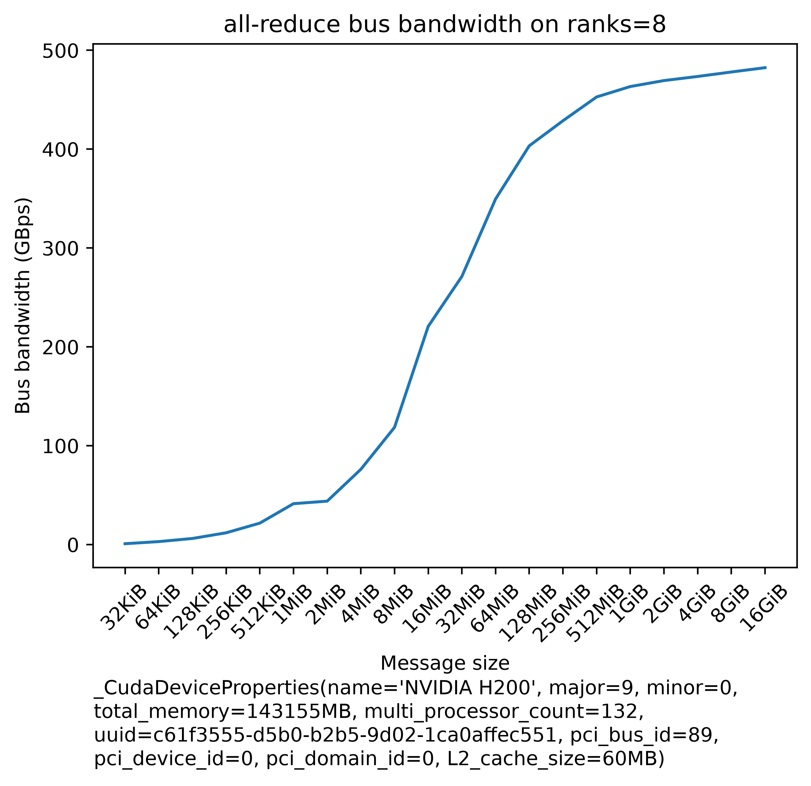

# all-reduce on a single 8x H200 node

An `all_reduce` sweep from 32KiB to 16GiB on one node of 8x H200, [NVSwitch](../../README.md#nvswitch)-connected, run with [all_reduce_bench.py](../all_reduce_bench.py):

```bash
python -u -m torch.distributed.run --nproc_per_node=8 --rdzv_endpoint localhost:6000 \
    --rdzv_backend c10d all_reduce_bench.py
```

- software: `torch=2.9.1+cu130`, `cuda=13.0`, `nccl=2.27.7`
- hardware: 8x NVIDIA H200 SXM (143155MiB HBM3e each, 132 SMs), NVLink 4, all pairs `NV18`
- measured: 2026-08-04, 5 warmup / 20 trial iterations per payload, 47 seconds total

| payload |    busbw   |    algbw   |
| ------: | ---------: | ---------: |
|   32KiB |   1.44GBps |   0.82GBps |
|   64KiB |   2.93GBps |   1.67GBps |
|  128KiB |   5.73GBps |   3.27GBps |
|  256KiB |  11.74GBps |   6.71GBps |
|  512KiB |  23.94GBps |  13.68GBps |
|    1MiB |  39.93GBps |  22.82GBps |
|    2MiB |  64.53GBps |  36.87GBps |
|    4MiB | 107.16GBps |  61.23GBps |
|    8MiB | 155.53GBps |  88.87GBps |
|   16MiB | 219.89GBps | 125.65GBps |
|   32MiB | 275.84GBps | 157.62GBps |
|   64MiB | 346.51GBps | 198.01GBps |
|  128MiB | 401.93GBps | 229.67GBps |
|  256MiB | 436.15GBps | 249.23GBps |
|  512MiB | 450.29GBps | 257.31GBps |
|    1GiB | 463.58GBps | 264.90GBps |
|    2GiB | 469.17GBps | 268.10GBps |
|    4GiB | 473.10GBps | 270.34GBps |
|    8GiB | 477.45GBps | 272.83GBps |
|   16GiB | 482.26GBps | 275.58GBps |



## Reading these numbers

The 482.26GBps at 16GiB is **107% of the 450GBps unidirectional [NVLink 4](../../README.md#nvlink) spec**, which is not a measurement error - NCCL selects the `NVLS` algorithm at large payloads and performs the reduction inside the NVSwitch, so fewer bytes cross the links than `busbw`'s ring-based formula assumes. See [SHARP](../../README.md#sharp) for the full account, including what the same node measures with SHARP disabled (367.61GBps, or 82% of spec) and how the gain scales with the number of accelerators engaged.

The algorithm switches partway up the sweep, which is visible in the curve: NCCL uses `Ring` with the `LL` protocol up to a 1MiB payload and `NVLS` with `SIMPLE` from 2MiB up. To see that for yourself add `NCCL_DEBUG=INFO NCCL_DEBUG_SUBSYS=INIT,TUNING`.

Note the y-axis is linear, so everything below ~100GBps is compressed into the bottom of the plot - the small-payload behaviour that matters for gradient bucketing is easier to read off the table than off the curve.
