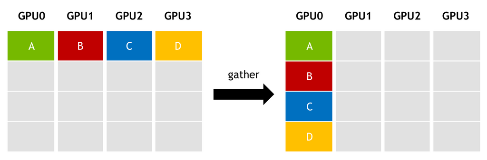

# Communication Patterns

## Point-to-point communications

Point-to-point communications are the simplest type of communication where there is always a single sender and a single receiver.

For example, [Pipeline Parallelism](../training/model-parallelism#pipeline-parallelism) performs a point-to-point communication where the activations from the current vertical stage is sent to the next stage. So the current gpu performs `send` and the gpu holding the next stage performs `recv`.

PyTorch has `send` and `recv` for blocking, `isend` and `irecv` for non-blocking p2p comms. [more](https://pytorch.org/tutorials/intermediate/dist_tuto.html#id1).

## Collective communications

Collective communications include either multiple senders and a single receiver, a single sender and multiple receivers or multiple senders and multiple receivers.

In the world of PyTorch typically each process is tied to a single accelerator, and thus accelerators perform collective communications via process groups. The same process may belong to multiple process groups.

`dist.all_reduce(tensor, op, group)`: Same as reduce, but the result is stored in all processes.

`dist.scatter(tensor, scatter_list, src, group)`: Copies the ithith tensor `scatter_list[i]` to the ithith process.

`dist.gather(tensor, gather_list, dst, group)`: Copies `tensor` from all processes in `dst`.

`dist.all_gather(tensor_list, tensor, group)`: Copies `tensor` from all processes to `tensor_list`, on all processes.

`dist.barrier(group)`: Blocks all processes in group until each one has entered this function.

`dist.all_to_all(output_tensor_list, input_tensor_list, group)`: Scatters list of input tensors to all processes in a group and return gathered list of tensors in output list.

### Broadcast

`dist.broadcast(tensor, src, group)`: Copies `tensor` from `src` to all other processes.

[source](https://images.nvidia.com/events/sc15/pdfs/NCCL-Woolley.pdf)

### Gather

[source](https://images.nvidia.com/events/sc15/pdfs/NCCL-Woolley.pdf)

### All-gather

[source](https://images.nvidia.com/events/sc15/pdfs/NCCL-Woolley.pdf)

### Reduce

`dist.reduce(tensor, dst, op, group)`: Applies `op` to every `tensor` and stores the result in `dst`.

[source](https://images.nvidia.com/events/sc15/pdfs/NCCL-Woolley.pdf)

PyTorch supports multiple reduction operations like: `avg`, `sum`, `product`, `min`, `max`, `band`, `bor`, `bxor`, and others - [full list](https://pytorch.org/docs/stable/distributed.html#torch.distributed.ReduceOp).

### All-reduce

[source](https://images.nvidia.com/events/sc15/pdfs/NCCL-Woolley.pdf)

### Scatter

[source](https://images.nvidia.com/events/sc15/pdfs/NCCL-Woolley.pdf)

### Reduce-Scatter

[source](https://images.nvidia.com/events/sc15/pdfs/NCCL-Woolley.pdf)

### All-to-all

[source](https://images.nvidia.com/events/sc15/pdfs/NCCL-Woolley.pdf)

## Algorithms

### Ring

#### Broadcast with unidirectional ring

Given:

- N: bytes to broadcast
- B: bandwidth of each link
- k: number of GPUs

A naive broadcast will send `N/B` at each step. The total time to broadcast to `k` GPUs will take: `(k-1)*N/B`

Here is an example of how a ring-based broadcast is performed:

[source](https://images.nvidia.com/events/sc15/pdfs/NCCL-Woolley.pdf)

This algorithm splits `N` into `S` messages

At each step `N/(S*B)` is sent, which is `S` times less than the naive algorithm sends per step.

The total time to broadcast `N` bytes to `k` GPUs will take:

`S*N/(S*B) + (k − 2)*N*(SB) = N*(S + k − 2)/(S*B)`

and if split messages are very small so that`S>>k`: `S + k − 2` is `~S` and then the total time is about `N/B`.

#### All-reduce with unidirectional ring

Ring-based `all-reduce` is done similarly to [broadcast](#broadcast-with-unidirectional-ring). The message is split into many small messages and each GPU sends a small message to the next GPU in parallel with other GPUs. `all-reduce` has to perform 2x steps than `broadcast`, because it performs a reduction - so the size of the message needs to be sent twice over the wire.

Moreover, the whole message can be first split into chunks, to make the process even more efficient. Here is the reduction of the first chunk:

[source](https://images.nvidia.com/events/sc15/pdfs/NCCL-Woolley.pdf)

Then the next chunk is done, until all smaller messages are reduced:

[source](https://images.nvidia.com/events/sc15/pdfs/NCCL-Woolley.pdf)
