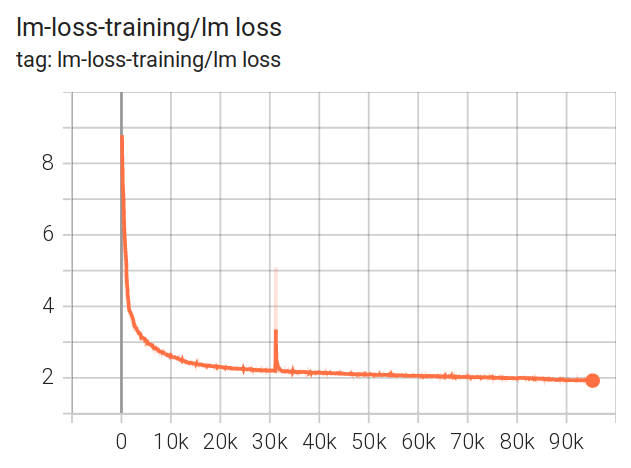
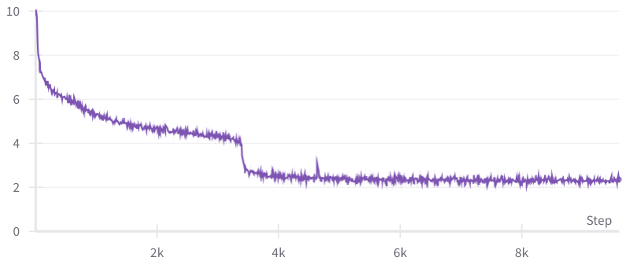
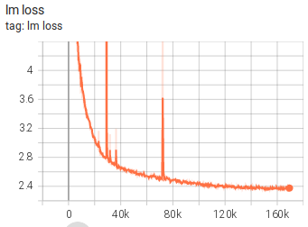
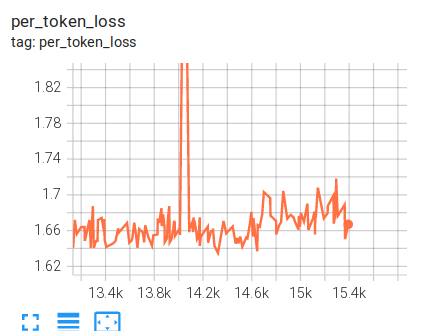
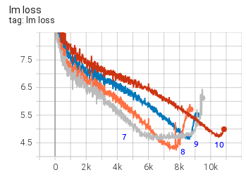
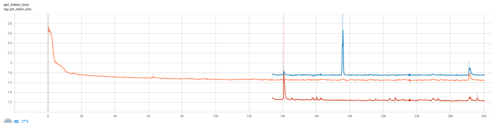

# training-loss-patterns - 中文翻译

理解训练损失模式

训练损失图类似于心电图——有好的、坏的和你应该担心的情况。经过对许多训练损失轨迹的研究，人们逐渐发展出一种直觉来解释训练中的各种损失行为以及如何应对这些情况。

在这里，我警告你，本节标题中的“理解”一词可能有些过载，因为很多时候我们并不真正知道为什么会出现某些类型的尖峰。这里的“理解”指的是识别各种模式。然后我们通常会有技术手段来克服不良模式，并成功地完成训练。

因此，你会发现这里有一个训练损失模式的画廊，有时附有真实的解释，但更多的是基于教育性猜测来推测可能发生的情况。

请原谅这些图表看起来彼此差异很大，因为它们来自多年来的多个来源。

## 好的、坏的和意想不到的

让我们看看一些好的、坏的和不寻常的模式。

### 一次彻底失败的训练

在开始BLOOM-176B训练之前，我们对[104B模型](https://github.com/bigscience-workshop/bigscience/tree/master/train/tr8-104B-wide)进行了多次实验。我们未能找出如何避免早期的发散问题。

如你所见，进行了许多尝试，应用了许多技术（参见[编年史](https://github.com/bigscience-workshop/bigscience/blob/master/train/tr8-104B-wide/chronicles.md)）。我们认为主要障碍是使用fp16和数据中有很多垃圾。对于BLOOM-176B，我们切换到了bf16，使用了更干净的数据，并添加了一个嵌入层归一化，这使一切都变得不同了。

### 几乎完美的训练

[BLOOM-176B](https://github.com/bigscience-workshop/bigscience/tree/master/train/tr11-176B-ml) 训练的损失轨迹几乎完美，只有一个尖峰在200步内恢复。

你可以检查[TB](https://huggingface.co/bigscience/tr11-176B-logs/tensorboard)以放大并检查其他图表。

这确实是一次几乎完美的训练。为此付出了大量的努力。

### 理解时刻

最近我在进行性能测试时，在一个llama-2-7b模型上运行了全局批次大小为8的小批量，该模型从零开始训练。（使用HF Transformers [Llama](https://github.com/huggingface/transformers/tree/main/src/transformers/models/llama) 实现）

可以看到，在仅仅480个样本后，损失迅速从4提高到2.5，而在此之前进展非常缓慢。我的同事[Gautam Mittal](https://github.com/gmittal)称其为“理解”时刻。在几步之内，模型突然能够更好地预测被遮蔽的令牌。

通常情况下，当使用更大的批次大小时，你不会看到如此显著的改进。

如果我们放大来看，大约需要60个每迭代8个样本的步骤：

## 主要类型的损失尖峰

总的来说，有三种类型的损失尖峰：

1. 快速恢复的尖峰
2. 慢速恢复的尖峰
3. 不完全恢复的尖峰

尖峰通常是因为数据中有问题的部分，可能是由于数据混洗不好或未清理从网站抓取的垃圾数据。

虽然你可能会怀疑是前一批数据导致了尖峰，但如果你研究这批数据的内容，很可能会发现没有什么异常——通常问题在很多步骤之前就开始发展，然后突然发生。但研究这批数据也可能不容易，因为当全局批次大小和序列长度很大时，这批数据量可能相当于一本书。

### 快速恢复的尖峰

损失尖峰经常发生，只要它们能很快反弹回原来的位置，训练通常会继续进行，就像什么都没发生一样：

这是一个[13B预-BLOOM训练实验](https://github.com/bigscience-workshop/bigscience/tree/master/train/tr1-13B-base)的例子：

如你所见，有许多尖峰，有些尖峰幅度很大，但它们都很快恢复了。

### 缓慢恢复的尖峰

这是[IDEFICS-80B](https://github.com/huggingface/m4-logs/blob/master/tr-190-80b/chronicles.md) 训练的一个缓慢恢复的尖峰：

### 不完全恢复的尖峰

这是[104B模型尝试](https://github.com/bigscience-workshop/bigscience/tree/master/train/tr8-104B-wide)的一个尖峰，开始恢复但没有完全恢复，而是开始发散：

这里还有一个来自[IDEFICS-80B](https://github.com/huggingface/m4-logs/blob/master/tr-190-80b/chronicles.md) 训练的例子：

### 非尖峰发散

以下是几个没有经过尖峰就发散的例子：

还有更多例子：

如你所见，每次重启都会取得一些进展，然后模型就会发散。

所有这些都是来自[104B模型尝试](https://github.com/bigscience-workshop/bigscience/tree/master/train/tr8-104B-wide)。

### 多个数据集尖峰

在[IDEFICS-80B](https://github.com/huggingface/m4-logs/blob/master/tr-190-80b/chronicles.md) 训练期间，我们混合使用了两种不同类型的训练数据集：

图例：cm4（高），平均（中）和pmd（低）

你可以看到，有时两个数据集上的损失尖峰同时发生，而有时只有其中一个数据集的损失会上升。

模型正在学习两种不同的数据分布，正如你所见，它报告的损失和尖峰行为在两个数据分布上是不同的。pmd数据集的损失比cm4数据集更容易处理。