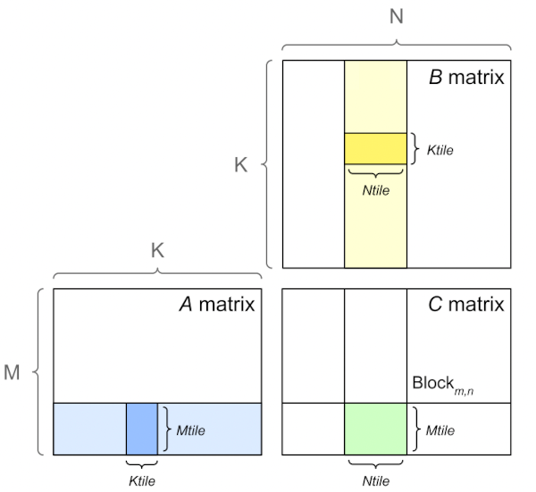
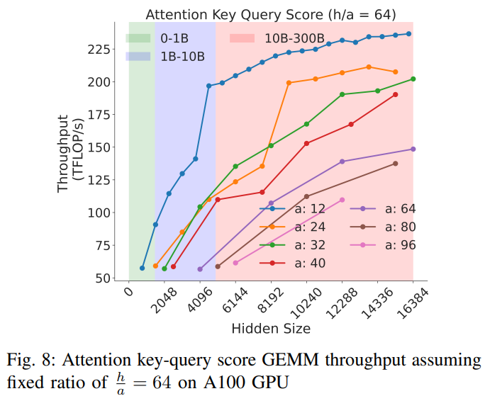

# Software Tune Up For The Best Performance

The faster you can make your model to train the sooner the model will finish training, which is important not only to being first to publish something, but also potentially saving a lot of money.

In general maximizing throughput is all about running many experiments and measuring the outcome and choosing the one that is superior.

In certain situations your modeling team may ask you to choose some hyper parameters that will be detrimental to throughput but overall beneficial for the overall model's success.


## Glossary and concepts

- HFU: Hardware FLOPS Utilization
- MFU: Model FLOPS Utilization

### MACs vs FLOP vs FLOPS vs FLOP/s

This section is here to try to disambiguate the common performance metric definitions and their relationship to each other.

**MAC vs FLOP**:

- 1 FLOP (FLoating point OPeration) can be one of addition, subtraction, multiplication, or division operation.

- 1 MAC (Multiply-ACCumulate) operation is a multiplication followed by an addition, that is: `a * b + c`

Thus 1 MAC = 2 FLOPs. It's also quite common for modern hardware to perform 1 MAC in a single clock cycle.

Please note that to calculate the number of MACs in relationship to FLOPs the reverse logic applies, that is MACs = 0.5 FLOPs - it's somewhat confusing since we have just said that 1 MAC = 2 FLOPs, but it checks out - observe: 100 FLOPs = 50 MACs - because there are 2 FLOPs in each MAC.

Moreover, while 1 MAC = 2 FLOPs, the reverse isn't necessarily true. That is 2 FLOPs isn't necessarily equal to 1 MAC. For example, if you did `.5*.6` 100 times it'd be 100 FLOPs, which here would equal to 100 MACs, because here only the multiply part of the MAC is executed.

**FLOP vs FLOPS vs FLOP/s**

- 1 FLOP (FLoating point OPeration) is any floating point addition, subtraction, multiplication, or division operation.

- 1 FLOPS (FLoating point OPeration per Second) is how many floating point operations were performed in 1 second - see [FLOPS](https://en.wikipedia.org/wiki/FLOPS)

Further you will find the following abbreviations: GFLOPS = Giga FLOPS, TFLOPS = Tera FLOPS, etc., since it's much easier to quickly grasp 150TFLOPS rather than 150000000000000FLOPS.

There is an ambiguity when FLOPS is used in writing - sometimes people use it to indicate the total quantity of operations, at other times it refers to operations per second. The latter is the most common usage and that is the definition used in this book.

In scientific writing FLOP/s is often used to clearly tell the reader that it's operations per second. Though this particular approach is hard to convert to a variable name since it still becomes `flops` when illegal characters are removed.

In some places you might also see FLOPs, which again could mean either, since it's too easy to flip lower and upper case `s`.

If the definition is ambiguous try to search for context which should help to derive what is meant:

- If it's a math equation and there is a division by time you know it's operations per second.
- If speed or performance is being discussed it usually refers to operations per second.
- If it talks about the amount of compute required to do something it refers to the total amount of operations.


### TFLOPS as a performance metric

Before you start optimizing the performance of your training setup you need a metric that you can use to see whether the throughput is improving or not. You can measure seconds per iteration, or iterations per second, or some other such timing, but there is a more useful metric that measures TFLOPS.

Measuring TFLOPS is superior because without it you don't know whether you are close to the best performance that can be achieved or not. This measurement gives you an indication of how far you're from the peak performance reported by the hardware manufacturer.

In this section I will use BLOOM's training for the exemplification. We used 80GB A100 NVIDIA GPUs and we trained in mixed bf16 regime. So let's look at the [A100 spec](https://www.nvidia.com/en-us/data-center/a100/) which tells us:

```
BFLOAT16 Tensor Core 	312 TFLOPS
```

Therefore we now know that if we were to only run `matmul` on huge bf16 matrices of very specific dimensions without copying to and from the device we should get around 312 TFLOPS max.

Practically though, due to disk IO, communications and copying data from the GPU's memory to its computing unit overhead and because we can't do everything in bf16 and at times we have to do math in fp32 (or tf32) we can really expect much less than that. The realistic value will vary from accelerator to accelerator, but for A100 in 2022 getting above 50% (155 TFLOPS) was an amazing sustainable throughput for a complex 384 GPUs training setup.

footnote: in 2023 the invention of flash attention and other techniques have pushed the bar to more than 50%.

When we first started tuning things up we were at <100 TFLOPS and a few weeks later when we launched the training we managed to get 150 TFLOPS.

The important thing to notice here is that we knew that we can't push it further by much and we knew that there was no more point to try and optimize it even more.

So a general rule of thumb for when you prepare for a massive model training - ask around what's the top TFLOPS one can expect to get with a given accelerator on a multi-node setup with the specified precision - and optimize until you get close to that. Once you did stop optimizing and start training.

footnote: For 80GB A100s in 2022 that was 155, in 2023 it has been pushed to about 180 TFLOPS.

footnote: When calculating TFLOPS it's important to remember that the math is different if [Gradient checkpointing](#gradient-checkpointing) are enabled, since when it's activated more compute is used and it needs to be taken into an account. Usually the cost is of an additional forward path, but recently better methods have been found that saves some of that recomputation.

For decoder transformer models the following is an estimation formula which slightly under-reports the real TFLOPS:

TFLOPS: `model_size_in_B * 4 * 2 * seqlen * global_batch_size / (time_in_sec_per_interation * total_gpus * 1e3)`

The factor of 4 is used with activation/gradient checkpointing, otherwise it will be 3. For 100B+ models, activation checkpointing will almost always be on.

So the `3*2` is often called "model FLOPs" and `4*2` - "hardware FLOPs", correlating to MFU and HFU (model and hardware FLOPS per second divided by the accelerator's theoretical peak FLOPS)

```
perl -le '$ng=64; $ms=52; $gbs=1024; $sp=127; $seqlen=2048; print $ms*4*2*$seqlen*$gbs / ( $sp * $ng * 1e3)'
```
(ng = total gpus, ms = model size in B, gbs = global batch size, sp = throughput in seconds)

Here is the same formula using `bash` env vars and which breaks down GBS into `MBS*DP*GAS` (GAS in this case corresponded to `pp_chunks` which was the number of chunks in the pipeline, but normally GAS just stands for Gradient Accumulation Steps):
```
echo "($MSIZE*4*2*SEQLEN*$MICRO_BATCH_SIZE*$DP_SIZE*$GAS)/($THROUGHPUT*$NNODES*4*1000)" | bc -l
```

The exact formula is in Equation 3 of Section 5.1 of the [Efficient Large-Scale Language Model Training on GPU Clusters Using Megatron-LM](https://arxiv.org/abs/2104.04473) paper. You can see the code [here](https://github.com/bigscience-workshop/Megatron-DeepSpeed/pull/251).

footnote: For Inference only it'd be: `24Bsh^2 + 4Bs^2h` floating point operations per layer.


#### Automating FLOP calculation

Until recently we had to rely on manual FLOP calculations as explained in the previous section - many of those formulas have mistakes in them, and many models behave differently depending on various configuration settings. So it can be tricky to get the FLOP count correctly (and across many different model architectures). But fear not, the awesome PyTorch team developed an automatic way of measuring FLOPs.

```
from torch.utils.flop_counter import FlopCounterMode

flop_counter = FlopCounterMode(mods=model, display=False, depth=None)
with flop_counter:
    model(**input).sum().backward()
total_flops =  flop_counter.get_total_flops()
```
Voila, you have the FLOPs counted for you!

In my code I run it only on a 2nd iteration (as the first iteration is likely to have some additional compute that is run once). You don't need to repeat it again, you can just cache its value (well, unless you have a situation where iterations aren't the same for some reason).

So all that remains is measuring the time it took each specific iteration to run and dividing FLOPs by time in seconds and `1e12` to get the performance TFLOPS.

```
tflops = total_flops / time / 1e12
```

This will give you a slightly different value on each iteration.


### MFU vs HFU

Model FLOPS Utilization (MFU) and Hardware FLOPS Utilization (HFU) estimate how well the hardware is being utilized during `forward` and `backward` passes of the model (including any syncing networking overhead and possibly DataLoader IO).

```
MFU = Estimated_Achieved_FLOPS / Theoretical_FLOPS
HFU = Actual_Achieved_FLOPS / Theoretical_FLOPS
```

HFU measures the actual FLOPS. For example, the technique of [Gradient checkpointing/Activation Recompution](#gradient-checkpointing) repeats all or some parts of the `forward` pass a second time, so factually more FLOS (FLoating point OperationS) are used. Whereas MFU ignores implementation details and accounts only for the theoretical needs of the computation and thus less accurate.

[Reducing Activation Recomputation in Large Transformer Models](https://arxiv.org/abs/2205.05198) is a good paper to read about these concepts.

`Theoretical_FLOPS` is what you see on the official accelerator specs. You can find the table of these values for high end accelerators [here](../../compute/accelerator#tflops-comparison-table). So let's use H100 as an example. Its BF16 theoretical TFLOPS is 989 TFLOPS.

Now, say, you measured your actual training loop's performance and it was 400 TFLOPS as actual achieved FLOPS. Then your MFU is:
```
HFU = 400/989 = 0.40%
```

If you didn't use activation recomputation feature (not repeating `forward`) your HFU and MFU would be the same. If you did use it, your calculation will lead to less FLOS and thus lower FLOPS and thus MFU will be lower than HFU.

For example [Megatron-LM](https://github.com/NVIDIA/Megatron-LM) published the following stats for A100-80GB:

| Model Size | Model FLOPs Utilization | Hardware FLOPs Utilization |
| :---: | :---: | :---: |
| 22B   | 41.5% | 43.7% |
| 175B  | 51.4% | 52.8% |
| 530B  | 56.0% | 57.0% |
| 1T    | 56.3% | 57.0% |

As you can see, since Megatron-LM was using activation recomputation for these trainings, MFU < HFU.

More recent H100+A100 MFU/HFU numbers have been published [here](https://github.com/mosaicml/llm-foundry/tree/main/scripts/train/benchmarking#mfu-and-hfu).

Now, whenever you see MFU or HFU numbers published you have to be careful comparing those numbers to any other similar numbers, until you know that the same way was used to calculate FLOPS. Since `HFU=Actual_Achieved_FLOPS/Theoretical_FLOPS` and `Theoretical_FLOPS` are fixed, the only variable here is the `Actual_Achieved_FLOPS` and since most of the time an estimated value is calculated based on parameter shapes, there are many versions of calculations out there, some of which are slightly imprecise whereas others are very imprecise. Compilers may also impact the effective FLOPs, by optimizing some operations away. Moreover you don't know how iteration time was measured.

To recall `TFLOPS = FLOS / iteration_duration`. So, in order to do a fair comparison the 2 main questions to ask are:
1. Was the total used floating point operations calculated in the same way?
2. Was the time component calculated back-to-back of each iteration, including the `DataLoader` and logging, vs only `fwd`+`bwd` parts.

If either one or both of these mismatch then you can't make a fair comparison.

Unfortunately, most of the time papers and blog posts just report the MFU number w/o a link to how it was calculated.

But, do not fear, if you have trouble comparing your results with competing results, remember the measurement artifacts described above.
These artifacts do not improve the bottom-line throughput, thus, as long as you consistently use whatever way you choose to calculate TFLOPS, you will immediately see when your application's performance has improved or degraded, as relative numbers are most important for you.

#### MFU is a very rough approximation

Most of the training/finetuning regimes use a mixed precision, yet when MFU/HFU are calculated the fastest format's compute is used. For example, for a BF16-mixed precision training some parts of the compute are done in BF16, yet others in FP32! but we measure the FLOPS as if everything was done in BF16, which, of course, leads to a very imprecise measurement. Ideally, each segment of the compute will be measured separately to account to when which format was used. The reason it sort of works is because the smaller format compute usually dominates those mixed precision training regimes.

Moreover, depending on the cluster setup - in particular storage IO and network IO are heavily involved, the same software may deliver different MFUs, because not all clusters are created equal. Therefore it's OK to compare your particular setup's MFU before and after the optimization, but it's very difficult to compare your setup's MFU to another team's cluster's MFU.


## How To Improve Speed and Save Memory

The more GPU memory you have for your batch size (BS) the more efficient the GPUs will be at performing compute, and the faster you will complete your task since you will be able to go through data faster.

Of course, this section is crucial for when you get GPU OOM with even BS=1 and you don't want to rent/buy more hardware.


Here is an overview of what features can help to either improve speed or save memory

| Method                   | Speed  | Memory |
| :----------------------  | :----  | :----- |
| Gradient accumulation    | Yes    | Yes    |
| Gradient checkpointing   | No*    | Yes    |
| Mixed precision training | Yes    | No     |
| Batch size               | Yes    | Yes    |
| Optimizer choice         | Yes    | Yes    |
| DataLoader               | Yes    | No     |
| DeepSpeed Zero           | No     | Yes    |
| Flash Attention          | Yes    | Yes    |

\* Gradient checkpointing slows things down for the given batch size, but since it frees up a lot of memory, enabling a much larger BS, it actually improves the overall speed.


### Anatomy of Model's Operations

Transformers architecture includes 3 main groups of operations grouped below by compute-intensity.

1. **Tensor Contractions**

    Linear layers and components of Multi-Head Attention all do batched **matrix-matrix multiplications**. These operations are the most compute-intensive part of training a transformer.

2. **Statistical Normalizations**

    Softmax and layer normalization are less compute-intensive than tensor contractions, and involve one or more **reduction operations**, the result of which is then applied via a map.

3. **Element-wise Operators**

    These are the remaining operators: **biases, dropout, activations, and residual connections**. These are the least compute-intensive operations.

This knowledge can be helpful to know when analyzing performance bottlenecks.

This summary is derived from [Data Movement Is All You Need: A Case Study on Optimizing Transformers 2020](https://arxiv.org/abs/2007.00072)


### Anatomy of Model's Memory Usage

We've seen that training the model uses much more memory than just putting the model on the GPU. This is because there are many components during training that use GPU memory. The components on GPU memory are the following:

1. model weights
2. optimizer states
3. gradients
4. forward activations saved for gradient computation
5. temporary buffers
6. functionality-specific memory

A typical model trained in mixed precision with AdamW requires 18 bytes per model parameter plus activation memory and temp memory.

Let's look at the details.

**Model Weights:**

- 4 bytes * number of parameters for fp32 training
- 6 bytes * number of parameters for mixed precision training (maintains a model in fp32 and one in fp16/bf16 in memory)

**Optimizer States:**

- 8 bytes * number of parameters for normal AdamW (maintains 2 states)
- 4 bytes * number of parameters for AdamW running at bf16. See [this work](https://github.com/huggingface/transformers/pull/21312) that uses `AnyPrecisionAdamW`.
- 4 bytes * number of parameters for optimizers like SGD with momentum (maintains only 1 state) or LION, or Adafactor (and others) (Adafactor uses some additional memory beside 4 bytes)
- 2 bytes * number of parameters for 8-bit AdamW optimizers like [bitsandbytes](https://github.com/TimDettmers/bitsandbytes)

**Gradients**

- 4 bytes * number of parameters for either fp32 precision and in some frameworks with mixed half-precision precision training.
- 2 bytes * number of parameters for non-mixed half-precision and in some frameworks with mixed half-precision precision training.

**Forward Activations**

- size depends on many factors, the key ones being sequence length, hidden size and batch size.

There are the input and output that are being passed and returned by the forward and the backward functions and the forward activations saved for gradient computation.

**Temporary Memory**

Additionally there are all kinds of temporary variables which get released once the calculation is done, but in the moment these could require additional memory and could push to OOM. Therefore when coding it's crucial to think strategically about such temporary variables and sometimes to explicitly free those as soon as they are no longer needed.

**Functionality-specific memory**

Then your software could have special memory needs. For example, when generating text using beam search, the software needs to maintain multiple copies of inputs and outputs.


For **inference**, the math is very similar to training, minus optimizer states and gradients. And for model weights there is just a single multiplier of the number of parameters:

- 6 bytes in mixed precision (4+2)
- 4 bytes in fp32
- 2 bytes in half precision
- 1 byte in quantized int8 precision

Another excellent resource that takes you through the memory needs and other requirements is
[Transformer Math 101](https://blog.eleuther.ai/transformer-math/).

The [EAI cookbook](https://github.com/EleutherAI/cookbook) contains a set of [calculation scripts](https://github.com/EleutherAI/cookbook/tree/main/calc) that can output the theoretical memory overhead for a given training or inference calculation run based on your configuration and setup.

There is a very handy [GPU VRAM Estimator](https://vram.asmirnov.xyz/) from Alexander Smirnov, and [the notes to how it works](https://asmirnov.xyz/vram).


### Additional GPU memory usage

In addition to the memory usage described in the previous section, there are other consumers of the GPU memory - so you never get the full memory for your model's use.

#### Preloaded CUDA kernels memory usage

When PyTorch uses CUDA for the first time, it may use up 0.5-2GB of GPU memory, reducing the GPU's total available memory. This memory won't be accounted for by torch memory profiler.

The size of allocated memory for cuda kernels varies between different GPUs, and also it can be different between pytorch versions. Let's allocate a 4-byte tensor on cuda and check how much GPU memory is used up upfront.

With `pytorch==1.10.2`:
```
$ CUDA_MODULE_LOADING=EAGER python -c "import torch; x=torch.ones(1).cuda(); free, total = map(lambda x: x/2**30, torch.cuda.mem_get_info()); \
used=total-free; print(f'pt={torch.__version__}: {used=:0.2f}GB, {free=:0.2f}GB, {total=:0.2f}GB')"
pt=1.10.2: used=1.78GB, free=77.43GB, total=79.21GB
```

With `pytorch==1.13.1`:
```
$ CUDA_MODULE_LOADING=EAGER python -c "import torch; x=torch.ones(1).cuda(); free, total = map(lambda x: x/2**30, torch.cuda.mem_get_info()); \
used=total-free; print(f'pt={torch.__version__}: {used=:0.2f}GB, {free=:0.2f}GB, {total=:0.2f}GB')"
pt=1.13.1: used=0.90GB, free=78.31GB, total=79.21GB
```

The older pytorch "wasted" 1.78GB of A100, the newer only 0.9GB, thus saving a whooping 0.9GB, which can be the saving grace for the OOM situations.

`CUDA_MODULE_LOADING=EAGER` is needed in the recent pytorch version if we want to force cuda kernels pre-loading, which are otherwise lazy-loaded on demand. But do not use this setting in production since it's likely to use more memory than needed. The whole point of lazy-loading is to load only the kernels that are needed.

With `pytorch==2.1.1`:
```
$ CUDA_MODULE_LOADING=EAGER python -c "import torch; x=torch.ones(1).cuda(); free, total = map(lambda x: x/2**30, torch.cuda.mem_get_info()); \
used=total-free; print(f'pt={torch.__version__}: {used=:0.2f}GB, {free=:0.2f}GB, {total=:0.2f}GB')"
pt=2.1.1+cu121: used=0.92GB, free=78.23GB, total=79.15GB
```
As compared to the lazy mode:
```
$ python -c "import torch; x=torch.ones(1).cuda(); free, total = map(lambda x: x/2**30, torch.cuda.mem_get_info()); \
used=total-free; print(f'pt={torch.__version__}: {used=:0.2f}GB, {free=:0.2f}GB, {total=:0.2f}GB')"
pt=2.1.1+cu121: used=0.47GB, free=78.68GB, total=79.15GB
```
There is a 450MB difference, but here we only loaded kernels to do `torch.ones` - the actual memory allocated at run time with other code using torch API will be somewhere between 0.47 and 0.92GB.


#### `torch.distributed` memory usage

When using `torch.distributed` expect ~1-2GB of GPU memory taken away just to initialize things - the more GPUs the higher the memory used. Different backends are likely to use a different amount of memory. And this memory won't be accounted for by torch memory profiler.

Here is [torch-dist-mem-usage.py](distributed/torch-dist-mem-usage.py) that demonstrates the actual memory usage:

```
$ python -u -m torch.distributed.run --nproc_per_node=2 --rdzv_endpoint localhost:6000  --rdzv_backend c10d \
torch-dist-mem-usage.py
[...]
[0] mp: before barrier
[0] mp: MA 0.00 GB | Max_MA 0.00 GB | CA 0.00 GB | Max_CA 0.00 GB | NV 0.55 GB | CPU Virtual Memory:  used = 68.79 GB, percent = 3.4%
[0] mp: after barrier
[0] mp: MA 0.00 GB | Max_MA 0.00 GB | CA 0.00 GB | Max_CA 0.00 GB | NV 2.00 GB | CPU Virtual Memory:  used = 69.33 GB, percent = 3.5%
[0] mp: after 2nd barrier
[0] mp: MA 0.00 GB | Max_MA 0.00 GB | CA 0.00 GB | Max_CA 0.00 GB | NV 2.00 GB | CPU Virtual Memory:  used = 69.33 GB, percent = 3.5%
[0] mp: after dist destroy
[0] mp: MA 0.00 GB | Max_MA 0.00 GB | CA 0.00 GB | Max_CA 0.00 GB | NV 1.28 GB | CPU Virtual Memory:  used = 69.25 GB, percent = 3.5%
[0] mp: after dist destroy
[0] mp: MA 0.00 GB | Max_MA 0.00 GB | CA 0.00 GB | Max_CA 0.00 GB | NV 1.28 GB | CPU Virtual Memory:  used = 69.25 GB, percent = 3.5%
```

So you can see that the [CUDA kernels](#preloaded-cuda-kernels-memory-usage) took 0.55GB (first line `NV 0.55 GB`), but when `dist.barrier` was run an additional 1.5GB were consumed. If you run `init_process_group` with `device_id` arg then the additional memory allocation will move to that call instead and less will be used by `dist.barrier`.


#### Memory fragmentation

As the model allocates and frees tensors, the memory could fragment. That is there could be enough free memory to allocate, say, 1GB of contiguous memory, but it could be available in 100s of small segments spread out through the memory and thus even though the memory is available it can't be used unless very small allocations are made.

Environment variable `PYTORCH_CUDA_ALLOC_CONF` comes to help and allows you to replace the default memory allocation mechanisms with more efficient ones. For more information see [Memory management](https://pytorch.org/docs/stable/notes/cuda.html#memory-management).


### Batch sizes

First, there are usually two batch sizes:

1. micro batch size (MBS), also known as batch size per gpu - this is how many samples a single gpu consumes during a model's single `forward` call.

2. global batch size (GBS) - this is the total amount of samples consumed between two optimizer steps across all participating GPUs.

Model replica is how many gpus are needed to fit the full model.

- If the model fits into a single GPU a model replica takes 1 GPU. Usually then one can use multiple GPUs to perform  [Data Parallelism](../../training/model-parallelism#data-parallelism)
- If the model doesn't fit into a single GPU, it'd usually require some sort of sharding technique - it can be
 [Tensor Parallelism](../../training/model-parallelism#tensor-parallelism) (TP),  [Pipeline Parallelism](../../training/model-parallelism#pipeline-parallelism) (PP), or [ZeRO Data Parallelism](../../training/model-parallelism#zero-data-parallelism) (ZeRO-DP).

You can have as many data streams as there are replicas. Which is the same as the value of DP.
- So in the simple case of a model fitting into a single GPU. There are as many data streams as there are GPUs. DP=N_GPUS
- when the model doesn't fit onto a single GPU, then `DP=N_GPUs/(TP*PP)` in the case of 3D parallelism and DP=ZeRO-DP in the case of ZeRO parallelism.

Going back to our global batch size (GBS) it's calculated as:

```
GBS = MBS*DP
```

So if you have 8 gpus (N_GPUS=8) and your MBS=4 and you do DP you end up with having GBS=32 because:

```
GBS = MBS*DP = 4*8 = 32
```

If you use TP with a degree of 2 (TP=2) and PP with a degree of 2 (PP=2) this means each model replica takes 4 gpus (`TP*PP`), and thus with N_GPUS=8

```
DP = N_GPUS/(TP*PP) = 8 / (2*2) = 2
```
and now GBS becomes:

```
GBS = MBS*DP = 4*2 = 8
```

If your training setup requires [Gradient Accumulation](#gradient-accumulation), one usually defines the interval of how many steps to wait before performing a gradient accumulation. The term is usually Gradient Accumulation Steps (GAS). If GAS=4 (i.e. sync grads every 4 steps) and TP=1, PP=1 and DP=8:


```
DP = N_GPUS/(TP*PP) = 8 / (1*1) = 8
GBS = MBS*DP*GAS = 4*8*4 = 128
```

Typically you want to make the micro batch size as large as possible so that the GPU memory is close to being full, but not too full.

With large models usually there is not much free GPU memory left to have a large micro batch size, therefore every additional sample you can fit is important.

While it's super important that sequence length and hidden size and various other hyper parameters are high multiples of 2 (64, 128 and higher) to achieve the highest performance, because in most models the batch dimension is flattened with the sequence length dimension during the compute the micro batch size alignment usually has little to no impact on performance.

Therefore if you tried to fit a micro batch size of 8 and it OOM'ed, but 7 fits - use the latter rather than 4. The higher the batch size the more samples you will be able to fit into a single step.

Of course, when using hundreds of GPUs your global batch size may become very large. In that case you might use a smaller micro batch size or use less GPUs or switch to a different form of data parallelism so that the GPUs work more efficiently.


### Gradient Accumulation

The idea behind gradient accumulation is to instead of calculating the gradients for the whole batch at once to do it in smaller steps. The way we do that is to calculate the gradients iteratively in smaller batches by doing a forward and backward pass through the model and accumulating the gradients in the process. When enough gradients are accumulated we run the model's optimization step. This way we can easily increase the overall batch size to numbers that would never fit into the GPU's memory. In turn, however, the added forward and backward passes can slow down the training a bit.

Gradient Accumulation Steps (GAS) is the definition of how many steps are done w/o updating the model weights.

When using Pipeline parallelism a very large Gradient Accumulation is a must to keep the [pipeline's bubble to the minimum](../../training/model-parallelism/README.md#naive-model-parallelism-vertical).

Since the optimizer step isn't performed as often with gradient accumulation there is an additional speed up here as well.

The following benchmarks demonstrate how increasing the gradient accumulation steps improves the overall throughput (20-30% speedup):

- [RTX-3090](https://github.com/huggingface/transformers/issues/14608#issuecomment-1004392537)
- [A100](https://github.com/huggingface/transformers/issues/15026#issuecomment-1005033957)

When [data parallelism](../../training/model-parallelism#data-parallelism) is used gradient accumulation further improves the training throughput because it reduces the number of gradient reduction calls, which is typically done via the `all_reduce` collective which costs a 2x size of gradients to be reduced. So for example, if one goes from GAS=1 to GAS=8 in `DistributedDataParallelism` (DDP) the network overhead is reduced by 8x times, which on a slow inter-node network can lead to a noticeable improvement in the training throughput.


### Gradient Checkpointing

**Gradient Checkpointing** is also known as **Activation Recompution** and **Activation Checkpointing**.

This methodology is only relevant for training, and not during inference.

Enabling gradient checkpointing allows one to trade training throughput for accelerator memory. When this feature is activated instead of remembering the outputs of, say, transformer blocks until the `backward` pass is done, these outputs are dropped. This frees up huge amounts of accelerator memory. But, of course, a `backward` pass is not possible without having the outputs of `forward` pass, and thus they have to be recalculated.

This, of course, can vary from model to model, but typically one pays with about 20-25% decrease in throughput, but since a huge amount of gpu memory is liberated, one can now increase the batch size per gpu and thus overall improve the effective throughput of the system. In some cases this allows you to double or quadruple the batch size if you were already able to do a small batch size w/o OOM. (Recent papers report as high as 30-40% additional overhead.)

Activation checkpointing and gradient checkpointing are 2 terms for the same methodology.

For example, in HF Transformers models you do `model.gradient_checkpointing_enable()` to activate it in your custom Trainer or if you use the HF Trainer then you'd activate it with `--gradient_checkpointing 1`.

XXX: expand on new tech from the paper: [Reducing Activation Recomputation in Large Transformer Models](https://arxiv.org/abs/2205.05198) which found a way to avoid most activation recomputations and thus save both memory and compute.

### Memory-efficient optimizers

The most common optimizer is Adam. It and its derivatives all use 8 bytes per param (2x fp32 tensors - one for each momentum), which account for almost half the memory allocation for the model, optimizer and gradients. So at times using other optimizers may save the day, if they successfully train that is. Not all optimizers are suitable for all training tasks.

4-byte optimizers:

- There are optimizers like Adafactor that need only 4 bytes. Same goes for the recently invented [LION optimizer](https://arxiv.org/abs/2302.06675).

- `AnyPrecisionAdamW`. Some courageous souls try to do the whole training in BF16 (not mixed precision!), including the optimizer and thus need only 4 bytes per parameter for optim states. See [this work](https://github.com/huggingface/transformers/pull/21312). Hint: this optimizer requires Kahan summation and/or stochastic rounding, see [Revisiting BFloat16 Training (2020)](https://arxiv.org/abs/2010.06192). You need only 8 bytes per parameter for weights, optim states and gradients here! Instead of 18!

2-byte optimizers:

- There are quantized solutions like `bnb.optim.Adam8bit` which uses only 2 bytes instead of 8 (1 byte per momentum).  You can get it from [here](https://github.com/TimDettmers/bitsandbytes). Once installed, if you're using HF Trainer, you can enable it on with just passing `--optim adamw_bnb_8bit`!

For speed comparisons see [this benchmark](https://github.com/huggingface/transformers/issues/22101)
Speed-wise:`apex`'s `apex.optimizers.FusedAdam` optimizer is so far the fastest implementation of Adam. Since pytorch-2.0 [torch.optim.AdamW](https://pytorch.org/docs/stable/generated/torch.optim.AdamW.html) added support for `fused=True` option, which brings it almost on par with `apex.optimizers.FusedAdam`.


## Model execution speed

### `forward` vs `backward` Execution Speed

For convolutions and linear layers there are 2x flops in the backward compared to the forward, which generally translates into ~2x slower (sometimes more, because sizes in the backward tend to be more awkward). Activations are usually bandwidth-limited, and it’s typical for an activation to have to read more data in the backward than in the forward (e.g. activation forward reads once, writes once, activation backward reads twice, `gradOutput` and output of the forward, and writes once, `gradInput`).


## Memory profiler tools

In this chapter we discussed the theoretical math of how much this or that feature should consume in MBs of memory. But often in reality things aren't exactly the same. So you plan for a certain model size and batch sizes but when you come to use it suddenly there is not enough memory. So you need to work with your actual code and model and see which part takes how much memory and where things got either miscalculated or some additional missed overhead hasn't been accounted for.

You'd want to use some sort of memory profiler for that purpose. There are various memory profilers out there.

One useful tool that I developed for quick and easy profiling of each line or block of code is
[IPyExperiments](https://github.com/stas00/ipyexperiments). You just need to load your code into a jupyter notebook and it'll automatically tell you how much CPU/GPU memory each block allocates/frees. So e.g. if you want to see how much memory loading a model took, and then how much extra memory a single inference step took - including peak memory reporting.


## Vector and matrix size divisibility

The paper, [The Case for Co-Designing Model Architectures with Hardware](https://arxiv.org/abs/2401.14489) investigates the effects of transformer sizing on the underlying hardware. The [associated scripts](https://github.com/EleutherAI/cookbook/tree/main/benchmarks/sizing) allow you to run the benchmarks yourself if you're running on hardware besides NVIDIA V100/A100.

One gets the most efficient performance when batch sizes and input/output neuron counts are divisible by a certain number, which typically starts at 8, but can be much higher as well. That number varies a lot depending on the specific hardware being used and the dtype of the model.

For fully connected layers (which correspond to GEMMs), NVIDIA provides recommendations for [input/output neuron counts](
https://docs.nvidia.com/deeplearning/performance/dl-performance-fully-connected/index.html#input-features) and [batch size](https://docs.nvidia.com/deeplearning/performance/dl-performance-fully-connected/index.html#batch-size).

[Tensor Core Requirements](https://docs.nvidia.com/deeplearning/performance/dl-performance-matrix-multiplication/index.html#requirements-tc) define the multiplier based on the dtype and the hardware. For example, for fp16 a multiple of 8 is recommended, but on A100 it's 64!

For parameters that are small, there is also [Dimension Quantization Effects](https://docs.nvidia.com/deeplearning/performance/dl-performance-matrix-multiplication/index.html#dim-quantization) to consider, this is where tiling happens and the right multiplier can have a significant speedup.

[The Case for Co-Designing Model Architectures with Hardware](https://arxiv.org/abs/2401.14489) provides much greater detail on tile/wave quantization and the number of attention heads, but the highlights are:

### Tile and wave quantization

Notation:

- `a`: Number of attention heads
- `h`: Hidden dimension size
- `s`: Sequence length
- `b`: Microbatch size
- `t`: Tensor-parallel size

First, some background.

NVIDIA GPUs divide the output matrix into regions or tiles as shown in the below figure and schedule them to one of the available streaming multiprocessors (SM) on the GPU (e.g., A100 GPUs have 108 SMs). Each tile or thread block is processed in a Tensor Core, which NVIDIA introduced for fast tensor operations. NVIDIA Tensor Cores are only available for GEMMs with appropriate dimensions. Tensor Cores can be fully utilized when GEMM dimensions `m`, `k`, and `n` are multiples of 16 bytes and 128 bytes for V100 and A100 GPUs, respectively. Since a FP16 element is 2 bytes, this corresponds to dimension sizes that are multiples of 8 and 64 elements, respectively. If these dimension sizes are not possible, Tensor Cores perform better with larger multiples of 2 bytes.



There are multiple tile sizes that the kernel can choose from. If the GEMM size does not divide evenly into the tile size, there will be wasted compute, where the thread block must execute fully on the SM, but only part of the output is necessary. This is called the **tile quantization** effect, as the output is quantized into discrete tiles.

Another quantization effect is called **wave quantization**. As the thread blocks are scheduled to SMs, only 108 thread blocks at a time may be scheduled. If, for example, 109 thread blocks must be scheduled, two rounds, or waves, of thread blocks must be scheduled to GPU. The first wave will have 108 thread blocks, and the second wave will have 1. The second wave will have almost the same latency as the first, but with a small fraction of the useful compute. As the matrix size increases, the last or tail wave grows. The throughput will increase, until a new wave is required. Then, the throughput will drop.

What this means for transformers, is that for a given ratio of `h/a`, one needs to ensure they're on the crest of a wave. If you're using NVIDIA V100/A100 GPUs, we've already done this work for you in https://arxiv.org/pdf/2401.14489.pdf

An example of this for 32 attention heads:


More powers of 2 in `h/a` helps!


### Number and size of attention heads

Generally, it's most computationally efficient to keep the ratio of `h/a` as large as possible without accuracy degradation. A good figure from [The Case for Co-Designing Model Architectures with Hardware](https://arxiv.org/abs/2401.14489) showing this effect is:




### Flash attention

If you're using [Flash Attention](https://github.com/Dao-AILab/flash-attention), good news! These MHA sizing constraints are taken care of for you. Your only constraint is to have a large enough ratio of `h/a` to saturate your GPU cores:


### SwiGLU-based MLP

Models such as PaLM, LLaMA, Mistral and others use the SwiGLU activation function in place of the more common GLU activation function.

The SwiGLU-based MLP contains an additional learned matrix in its activation function. There the MLP block contains 3 matrices instead of the original 2. To preserve the total number of parameters in the MLP block the paper that introduces [SwiGLU](https://arxiv.org/abs/2002.05202) proposes to use `dim_mlp = 8/3*dim_attn` instead of the typical `dim_mlp = 4*dim_attn`. The [The Case for Co-Designing Model Architectures with Hardware](https://arxiv.org/abs/2401.14489) paper provides recommendations for finding the value of hidden dimension (`h`) that would lead to the best `matmul` performance, and if you used `8/3*h` is likely to result in a much slower MLP block, because `8/3` will break all the alignments.

In order to overcome this problem one only needs to realize that the `8/3` coefficient is only a suggestion and thus it’s possible to find other near by coefficients that would lead to better-shaped MLP matrices. In fact if you look at the publicly available LLama-2 models, its 7B variant uses `11008/4096 = 2.6875` as a coefficient, which is quite close to `8/3 = 2.667`, and its 70B variant uses a much larger `28672/8192 = 3.5` coefficient. Here the 70B variant ended up with an MLP block that contains significantly more parameters than a typical transformer block that doesn’t use SwiGLU.

Now that we know the recommended coefficient isn’t exact and since a good `h` has already been chosen, one can now search for a good nearby coefficient that still leads to high-performance GEMMs in the MLP. Running a brute-force search reveals that Llama-2-7B’s intermediate size is indeed one of the best performing sizes in its range.

Here is [swiglu-maf-bench.py](benchmarks/matrix-shape/swiglu-maf-bench.py) that can be easily adapted to your use-case and once run on the target hardware the training will happen on, you will be able to find the best hidden size of the MLP.

Let's run it on H100 with `h = 4096`:

```
./swiglu-maf-bench.py
Wanted the closest to 10922 d_ff value that leads to the highest TFLOPS (d_hidden=4096)

Searching 50 steps in the range of 10822 .. 11022
Results: baseline, followed by near-by best performing d_ff results:

 d_ff  tflops mlp_params
-------------------------
10922  272.73 134209536
-------------------------
10944  398.38 134479872
10848  395.62 133300224
10880  395.52 133693440
10912  395.16 134086656
11008  395.01 135266304
```

As it can be easily seen the `8/3*4096=10922` leads to a rather slow performance. But `10944`, which is just `22` bigger than `10922`, gives a whooping 46% speedup for the `matmul`. The total corresponding MLP parameters is printed as well, should you want to choose slightly slower choices but with a different number of parameters.


### Final recommendations for model sizing

The full recommendations are:
1. Vocab size divisible by 64
2. Microbatch size as large as possible
3. `b*s`, `h/a`, and `h/t` should be divisible by a power of 2
4. `(b*a)/t` should be an integer
5. `t` should be small as possible
6. For SwiGLU search for the best performing hidden size close to `8/3*h`

### Additional reading

- [What Shapes Do Matrix Multiplications Like?](https://www.thonking.ai/p/what-shapes-do-matrix-multiplications)


## NUMA affinity

[Non-uniform memory access (NUMA)](https://en.wikipedia.org/wiki/Non-uniform_memory_access) is a computer memory design used in multiprocessing, where the memory access time depends on the memory location relative to the processor.
As modern servers have more than one CPU to get the best performance accelerators residing in the same NUMA node as the corresponding CPU should have the processes bound to that same NUMA node.

First, let's understand what do NUMA nodes signify.

Here is a typical A100 8x GPUs server NUMA nodes diagram:


As you can see it has 2 CPUs, each defining a NUMA block, and each such block contains a group of 4 GPUs. The GPUs are the grey blocks that say `CoProc` with 108 compute units (SMs) and 79GB of memory.

footnote: the diagram was generated by `lstopo a100.png` from [hwloc](https://github.com/open-mpi/hwloc).

If you're using Hyper-Threads then you want to use `lstopo -l` to see the HT core count presented correctly. For example if you have 2 NUMA nodes with 8 accelerators and 104 physical cpu-cores and 208 logical cores - thus (`208/8=26` HT-cores per GPU), then the HT cores will be for:

- gpu0..3 `[0, 1,  2, 3, ...,  51, 104, 105, 106, ..., 129]`
- gpu4..7 `[52, 53, 54, ..., 103, 156, 157, 158, ..., 207]`

You first get the physical cpu-core counts and then the remaining HT cores, hence the strange gap.

If this is an NVIDIA node, the other way to easily see the CPU affinity is to run:

```
$ nvidia-smi topo -m
        GPU0    GPU1    GPU2    GPU3    GPU4    GPU5    GPU6    GPU7    CPU Affinity    NUMA Affinity
GPU0     X      NV18    NV18    NV18    NV18    NV18    NV18    NV18    0-51,104-155    0
GPU1    NV18     X      NV18    NV18    NV18    NV18    NV18    NV18    0-51,104-155    0
GPU2    NV18    NV18     X      NV18    NV18    NV18    NV18    NV18    0-51,104-155    0
GPU3    NV18    NV18    NV18     X      NV18    NV18    NV18    NV18    0-51,104-155    0
GPU4    NV18    NV18    NV18    NV18     X      NV18    NV18    NV18    52-103,156-207  1
GPU5    NV18    NV18    NV18    NV18    NV18     X      NV18    NV18    52-103,156-207  1
GPU6    NV18    NV18    NV18    NV18    NV18    NV18     X      NV18    52-103,156-207  1
GPU7    NV18    NV18    NV18    NV18    NV18    NV18    NV18     X      52-103,156-207  1
```
On this H100 cluster you can see the `CPU Affinity` column which tells you which cores reside together with the first and the second group of GPUs, and the `NUMA Affinity` column.

Now that it's clear that the various compute components are placed in 2 or more groups, to achieve the best performance we need to ensure that the components communicate within the group they belong to, and avoid any cross-talk. For example, if gpu0 belong to NUMA node 0, then the process that drives this GPU should only use cpu-cores from NUMA node 0.

The same should apply to networking or any other components that you may have control over.

Practically though in my experience so far if your workload is very light on CPU work this change will make very little difference to the overall performance, but can be quite impactful if a lot of CPU use is done. On the other hand if doing the most efficient thing is easy, even the tiniest improvement is likely to accumulate over long training jobs, so it's worth to implement, IMHO.

### NUMA process binding

There are multiple ways to accomplish the binding of processes to the cpu-cores of the right NUMA node.

#### numactl

One of the most common tools to do that is using `numactl`, which sets the NUMA affinity as it launches a new process.

For example, let's see how it can be integrated with the `torchrun` launcher.

This launcher currently needs a helper util [numa-set.sh](benchmarks/numa/numa-set.sh) to perform NUMA affinity settings, once you downloaded it and made it executable, you can now get the right NUMA affinity using:

```
torchrun --nproc_per_node=8 --role : --tee 3 --no-python ./numa-set.sh your-program.py
```

Note: you'd need `numactl` installed on your system for this util to work.

For example, here is how you can validate that the assignments are correct:
```
torchrun --nproc_per_node=8 --role : --tee 3 --no-python ./numa-set.sh python -c \
'import os; cores=os.sched_getaffinity(0); print(f"{len(cores)} visible cpu cores: {cores}")'
```

On a system with 208 HT cpu-cores, you will most likely see:

```
[:0]:104 visible cpu cores: {0, 1, 2, 3, 4, 5...
[:1]:104 visible cpu cores: {0, 1, 2, 3, 4, 5...
[:2]:104 visible cpu cores: {0, 1, 2, 3, 4, 5...
[:3]:104 visible cpu cores: {0, 1, 2, 3, 4, 5...
[:4]:104 visible cpu cores: {52, 53, 54, 55, ...
[:5]:104 visible cpu cores: {52, 53, 54, 55, ...
[:6]:104 visible cpu cores: {52, 53, 54, 55, ...
[:7]:104 visible cpu cores: {52, 53, 54, 55, ...
```

The first 4 accelerators use the first half of the cpu-cores and the other 4 the second half, which matches the earlier explanations of the right setting.

If you remove `./numa-set.sh`, you'd get:

```
torchrun --nproc_per_node=8 --role : --tee 3 --no-python python -c \
'import os; cores=os.sched_getaffinity(0); print(f"{len(cores)} visible cpu cores: {cores}")'
```
You will see that all 8 processes see all 208 cpu-cores:
```
[:0]:208 visible cpu cores: {0, 1, 2, 3, ...
```

so as each process has access to any cpu-core - a cross talk may occur, which may introduce a small performance overhead.


#### os.sched_setaffinity

You can, of course, change the NUMA affinity after the program was launched. You saw the use of `os.sched_getaffinity` to get the current settings, and the corresponding `os.sched_setaffinity` is used to change it.

```
import os
os.sched_setaffinity(0, [0, 1])
```
Here we told the system that the process running this script (`0`) can only use cpu-cores `0` and `1`.

So now we just need to figure out how to programmatically get the right cpu sets for each accelerator's process. Here is how to do it with [pynvml](#pynvml).

#### pynvml

If you're using NVIDIA GPUs, `pynvml` (`pip install pynvml`) can be very helpful to get all sorts of information about the gpu and not needing to call `nvidia-smi` - in this situation we are going to use for it to tell us the correct affinity given a GPU index.

In [numa-set-pynvml.py](benchmarks/numa/numa-set-pynvml.py) you will find a working helper function that you could call at the very top of your training loop like so:
```
local_rank = torh.distributed.get_rank()
set_numa_affinity(0, verbose=True)
```
call it before `DataLoader` is initialized to get the workers use the right cpu-cores!

Normally, the local process rank equals the gpu index, but if one uses `CUDA_VISIBLE_DEVICES` - this might not be true any longer - if you use it, you will need to remap the process rank to the actual index:

```
gpu_index = int(os.environ.get("LOCAL_RANK", 0))
if "CUDA_VISIBLE_DEVICES" in os.environ:
    ids = list(map(int, os.environ.get("CUDA_VISIBLE_DEVICES", "").split(",")))
    gpu_index = ids[gpu_index] # remap
```

The other gotcha can be `CUDA_DEVICE_ORDER` which typically defaults to `PCI_BUS_ID`, but one could also set it to
`CUDA_DEVICE_ORDER=FASTEST_FIRST` if you have mixed GPUs, but it's very very unlikely that you will run into this in a high end server setup, so you can safely ignore this.


#### srun

If using SLURM and you're OK with using `srun` as the launcher, rather than `torchrun`, `accelerate`, etc., it'll do all the binding work for you automatically. See the full launcher [here](../../orchestration/slurm/launchers/srun-launcher.slurm).

To make it NUMA affinity-ready all you need to add is these 2 headers:
```
#SBATCH --gres-flags=enforce-binding
#SBATCH --ntasks-per-socket=4
```

`--ntasks-per-socket=4` assumes you have 2 cpu sockets with 8 accelerators - so `8/2=4` accelerators per socket.

This is an even more precise solution, since it'd assign each process its own group of cpu-cores, rather than just give all the NUMA node 0 cpu-cores to the processes driving accelerators 0-3, and NUMA node 1 cpu-cores to the processes driving accelerators 4-7.

#### Specific launchers

Various launchers have support for NUMA affinity settings:

- [HF Accelerate](https://github.com/huggingface/accelerate) has a flag `--enable_cpu_affinity` that you add to the `accelerate` launch command and it'll do this for you. Available since `accelerate>0.28.0`.
- [torchrun](https://github.com/pytorch/pytorch) doesn't have it, but I showed how to do it in this [section](#numactl).
- srun was covered [here](#srun).


## DataLoader

### Asynchronous DataLoader

The default setting is `num_workers=0`, which means whenever you call `next(iter(dataloader))` the data is actively fetched in real time - which means there will be an IO overhead and if there are any transforms those would be applied in real time as well - all blocking the accelerator's compute.

The solution is to use the asynchronous `DataLoader` by setting `num_workers > 0`. Typically, unless your `DataLoader` is extremely slow 2 workers is enough:

```
DataLoader(..., num_workers=2, ...
```

Now when `next(iter(dataloader))` is called the data should be already in the CPU memory with all the transforms done. It still needs to be copied to the accelerator memory - to speed that up see [Pinned memory and non blocking device copy](#pinned-memory-and-non-blocking-device-copy).

Here is a benchmark which emulates a slow data transform: [num-workers-bench.py](benchmarks/dataloader/num-workers-bench.py)

```
num_workers=0: average time: 5.388
num_workers=1: average time: 3.900
num_workers=2: average time: 1.333
num_workers=3: average time: 0.839
num_workers=4: average time: 0.875
```

So you can see that in this particular case the speed was dramatically improving up to 3 workers. If the `DataLoader` is very light and does very little the difference will be much smaller, but 0 workers will always lead to the biggest overhead.

By measuring the performance of your workload you can finetune this number by trying lower and higher values. But remember that each one of the workers may consume a lot of CPU memory. So on a node of 8 accelerators with 2 workers, that would be 16 additional processes. Nowadays, the compute nodes have often hundreds of cpu cores and a TBs of CPU memory so there should be plenty of resources for many workers to be supported. In the past it was a different story.

Also note that because any data transforms are applied asynchronously and ahead of time, the CPU and memory speed don't matter much in this case. e.g. with 2 workers as long as the next iteration data preparation takes less than 2 compute iterations the `DataLoader` shouldn't be a bottleneck.

Beware that sometimes you may encounter problems using `num_workers > 0` - the pytorch Issues has a few related Issues that haven't been resolved in several years, where a worker would hang. In particular when having 2 `Dataloader`s. In fact we had this problem during BLOOM-176B training, where the training `Dataloader` worked fine with 2 workers, but once eval `Dataloader` was added it'd randomly hang - so we after failing to figure it out we resorted to a workaround of `num_workers=0` just for the eval and switch to doing it very rarely. Eventually, we stopped doing eval altogether and started doing lm-harness style async eval done to the saved intermediary checkpoints instead, which also sped up the training process.

case study: during IDEFICS-80B training we were using a streaming `Dataloader` which worked really bad and it was consuming huge amounts of memory per worker, and it'd spike often, and we had about 1TB of CPU memory and we couldn't spawn enough workers - so the `Dataloader` was a bottleneck. We didn't have time to find a better solution at that time so we finished training with it.


### Pinned memory and non-blocking device copy

A combination of:

1. `DataLoader(pin_memory=True, ...)`
2. `batch.to(device="cuda", non_blocking=True)`

is likely to make the `DataLoader` less of a bottleneck.

1. Enabling pinned memory allows for a more efficient data transfer from CPU to accelerator memory.
2. non-blocking will further speed things up by allowing some overlap between compute and data movements

Here is a small benchmark demonstrating the difference: [pin-memory-non-block-bench.py](benchmarks/dataloader/pin-memory-non-block-bench.py). When I run it on an A100 80GB-PCIe, the output was:
```
pin_memory= True, non_blocking= True: average time: 0.459
pin_memory= True, non_blocking=False: average time: 0.522
pin_memory=False, non_blocking= True: average time: 0.658
pin_memory=False, non_blocking=False: average time: 0.646
```
so you can see that `pin_memory=True`+`non_blocking=True` is a worthy change.

For more background you can read [1](https://pytorch.org/docs/stable/notes/cuda.html#use-pinned-memory-buffers) and [2](https://developer.nvidia.com/blog/how-optimize-data-transfers-cuda-cc/).

Notes:
- Pinned memory is treated specially by the OS, by preventing the paging out when the total available memory is low, so it reduces the total amount of available memory to other programs. Thus use with care.
- I recall that a few times people reported problems when using pinned memory - I think it's mostly when the system doesn't have much CPU memory to start with or they used too much of pinned memory, so the OS can start swapping heavily.
- If you measure your [per iteration TFLOPS](#tflops-as-a-performance-metric) you can compare the throughput with and w/o these changes and choose the one that works the best. It'd be even easier to see the impact if you measure the `DataLoader` overhead separately from the the `forward/backwards` and post-compute (usually logging, which can be surprisingly slow at times).


## torch.compile

`torch.compile` will eventually speed things up amazingly for both training and inference. It's very difficult to make it work well on a random model, because the level of complexities to overcome is huge. There are some models that already work well with it, but many are still a long term work in progress.

If you tried it and thing don't work you:
1. may report it to the PyTorch team, ideally with a small reproducible example
2. can try to read this extensive [torch.compile, the missing manual](https://docs.google.com/document/d/1y5CRfMLdwEoF1nTk9q8qEu1mgMUuUtvhklPKJ2emLU8/edit#heading=h.ivdr7fmrbeab) and you might be able to make some things work, and may still need to report some issues to PyTorch

One thing is certain is that you want to use the latest pytorch version, which most likely would be some recent nightly build, rather than the last released version (though you might start with the latter).


## Automatic garbage collection

Python periodically performs an automatic garbage collection based on internal heuristics. In an LLM-training scenario with hundreds to thousands of accelerators used in synchronization - if different ranks follow even slightly different code paths the automatic garbage collection process could be triggered at different times for different ranks. Which means that one or more ranks could be slower than other ranks while performing this operation, and thus becoming stragglers, slowing down the whole ensemble.

Usually one can see this by studying [the MFU plot](#mfu-vs-hfu) where downward spikes can be observed.

If this happens to your training you can disable the automatic garbage collection with:
```
import gc
gc.disable()
```
at the beginning of your trainer and then manually perform garbage collection at the desired intervals. For example, calling this once in a training iteration:
```
import gc
gc.collect()
```

Refer to [`gc`'s manpage](https://docs.python.org/3/library/gc.html) for more nuances.
